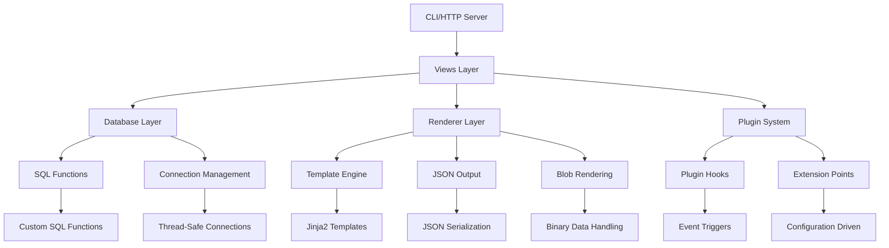

# `datasette`

## Repository Overview

### Tree Structure
```
datasette/
├── publish/           # Publishing functionality for datasette datasets
├── utils/             # Utility functions and helpers
├── views/             # View controllers and presentation logic
├── actor_auth_cookie.py     # Authentication cookie management for user sessions
├── blob_renderer.py         # Renders binary data blobs in various formats
├── database.py              # Database connection management and query execution utilities
├── default_magic_parameters.py  # Defines default magic parameters used in datasette queries
├── default_menu_links.py    # Contains default navigation menu link configurations
├── default_permissions.py   # Implements default permission policies for resource access
├── forbidden.py             # Manages forbidden access responses and permission validation
├── handle_exception.py      # Processes and formats error responses for HTTP requests
├── inspect.py               # Offers inspection utilities for datasette objects and metadata
├── plugins.py               # Manages plugin loading and extension mechanism integration
├── renderer.py              # Implements core template and content rendering functionality
├── sql_functions.py         # Registers and manages custom SQL functions available in datasette
├── tracer.py                # Provides tracing and logging capabilities for debugging and monitoring
└── url_builder.py           # Constructs URLs for datasette resources and API endpoints
```

### Purpose
Datasette is a web application that allows users to explore and publish structured data. It serves as a tool for making databases browsable over the web, enabling users to query, visualize, and share data without requiring complex web development skills. The repository provides the foundational infrastructure that powers datasette's functionality.

Datasette is particularly valuable for:
- Data journalists and analysts who want to make datasets publicly accessible
- Developers who need to quickly expose database content via web interfaces
- Researchers who want to share data in an interactive format
- Organizations seeking to democratize data access within their teams

### Position in Ecosystem
Datasette operates as a standalone web application that can run independently or be integrated into larger systems. It functions as both a command-line tool and a Python library, making it flexible for various deployment scenarios. It's designed to work with SQLite databases but can be extended to work with other database backends through its plugin architecture.

### Architecture


Key architectural patterns:
- **Layered Architecture**: Separation of concerns between database, rendering, authentication, and presentation layers
- **Plugin System**: Extensible architecture allowing third-party extensions
- **Component-Based Design**: Modular components that can be composed independently
- **Service-Oriented**: Each core functionality is encapsulated in dedicated modules

### Entry Points

#### Command Line Interface (CLI)
- **Command**: `datasette`
- **Purpose**: Main entry point for running the web server
- **Usage**: `datasette my_database.db --port 8001`
- **Target Audience**: Users who want to quickly serve databases over HTTP

#### Importable Python API
- **Module**: `datasette`
- **Purpose**: Programmatic access to datasette functionality
- **Usage**: `from datasette import Database; db = Database('my.db')`
- **Target Audience**: Developers integrating datasette into larger applications

#### Web Service Endpoints
- **Root**: `/` - Datasette homepage with database listing
- **Database**: `/{database}` - Database view with tables
- **Table**: `/{database}/{table}` - Table view with data
- **Query**: `/{database}/-/query` - Query interface
- **API**: `/{database}/{table}.json` - JSON API endpoint
- **Target Audience**: Web browsers and API consumers

### Core Features

1. **Database Connectivity**
   - SQLite database access with connection pooling
   - Support for multiple database files
   - Thread-safe operations
   - Implementation: `database.py`

2. **Data Exploration Interface**
   - Web-based browsing of database tables
   - SQL query interface
   - Pagination and filtering capabilities
   - Implementation: `views/` directory

3. **Content Rendering**
   - HTML table views
   - JSON API endpoints
   - Binary data blob rendering
   - Implementation: `renderer.py`, `blob_renderer.py`

4. **Authentication & Permissions**
   - Session-based authentication
   - Permission policy enforcement
   - Access control mechanisms
   - Implementation: `actor_auth_cookie.py`, `forbidden.py`, `default_permissions.py`

5. **Plugin System**
   - Extension points for custom functionality
   - Hook-based event system
   - Configuration-driven behavior
   - Implementation: `plugins.py`

6. **URL Management**
   - Dynamic URL construction
   - Route resolution
   - Parameter handling
   - Implementation: `url_builder.py`

7. **Error Handling**
   - Graceful exception processing
   - User-friendly error messages
   - Stack trace preservation
   - Implementation: `handle_exception.py`

### Dependencies

#### External Dependencies
- **sqlite3**: Core database connectivity
- **jinja2**: Template rendering engine
- **json**: JSON serialization/deserialization
- **os**: File system operations
- **urllib**: URL manipulation utilities

#### Internal Dependencies
- **publish/**: Publishing functionality for datasette datasets
- **utils/**: Utility functions and helpers
- **views/**: View controllers and presentation logic

### Configuration
Datasette supports configuration through:
- Command-line arguments
- Environment variables
- Configuration files (when implemented)
- Runtime parameters for customization

### Extension Points
Datasette provides several ways to extend its functionality:
1. **Plugins**: Custom modules that hook into the plugin system
2. **Hooks**: Event-driven extension points in the core system
3. **Subclassing**: Extending core classes for custom behavior
4. **Configuration**: Runtime configuration of system behavior

---

## Modules

- [`datasette`](datasette.md)
- [`datasette/publish`](datasette/publish.md)
- [`datasette/utils`](datasette/utils.md)
- [`datasette/views`](datasette/views.md)

