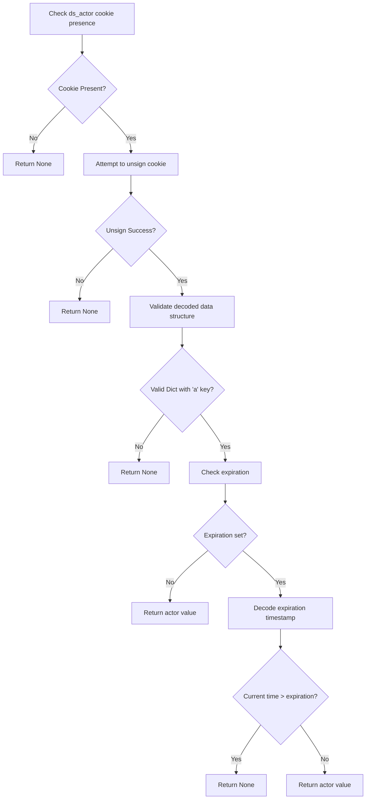

# `actor_auth_cookie.py`

## `datasette.actor_auth_cookie.actor_from_request` · *function*

## Summary:
Extracts and validates actor information from a signed HTTP cookie for authentication purposes.

## Description:
This function retrieves the "ds_actor" cookie from an HTTP request, verifies its cryptographic signature using Datasette's signing mechanism, and returns the associated actor identifier if valid and unexpired. The function serves as a core component in Datasette's authentication system, enabling secure session management through signed cookies.

## Args:
    datasette (object): Datasette instance providing the unsign method for cookie validation
    request (object): HTTP request object containing cookies and other request metadata

## Returns:
    str or None: The actor identifier if the cookie is valid and unexpired, None otherwise

## Raises:
    None explicitly raised - handles BadSignature exception internally

## Constraints:
    Preconditions:
    - The request object must have a cookies attribute that supports dictionary-style access
    - The datasette object must provide an unsign method for signature verification
    
    Postconditions:
    - Returns None if cookie is missing, invalid, or expired
    - Returns the actor string if cookie is valid and unexpired

## Side Effects:
    None - This function is read-only and doesn't modify any external state

## Control Flow:


## Examples:
```python
# Typical usage in authentication middleware
actor = actor_from_request(datasette_instance, request)
if actor:
    # User is authenticated
    user_id = actor
else:
    # User needs to authenticate
    redirect_to_login()
```

