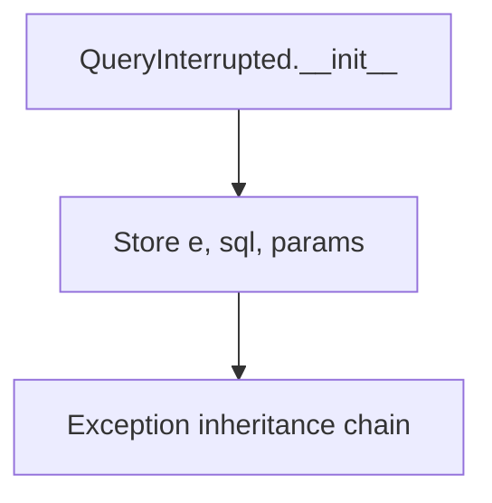
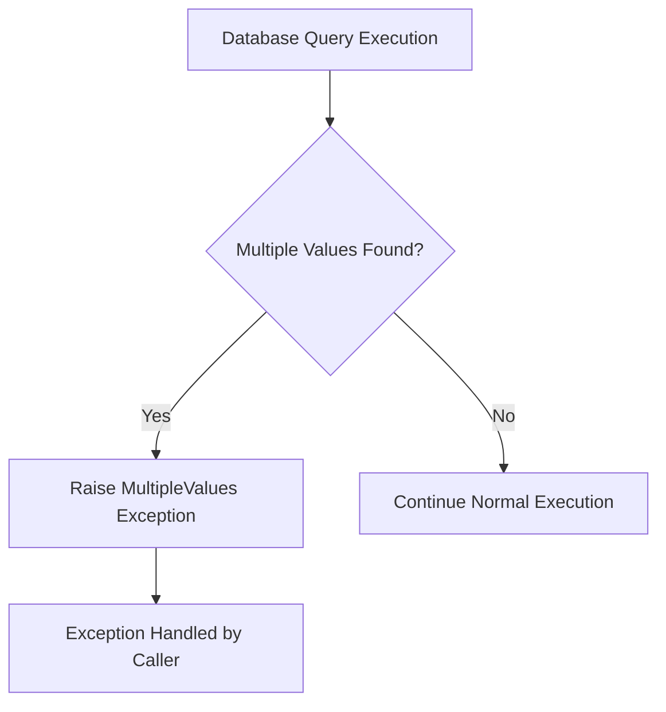
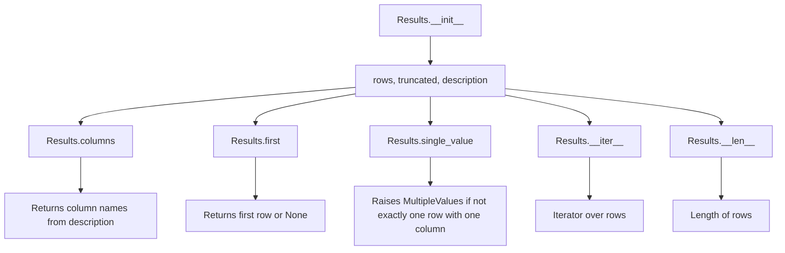

```mermaid
graph TD
    A[Database.__init__] --> B[Initialize attributes]
    B --> C[Database.suggest_name]
    B --> D[Database.connect]
    B --> E[Database.execute_fn]
    B --> F[Database.execute_write_fn]
    B --> G[Database.execute]
    B --> H[Database.execute_write]
    B --> I[Database.execute_write_script]
    B --> J[Database.execute_write_many]
    B --> K[Database.table_names]
    B --> L[Database.table_exists]
    B --> M[Database.table_columns]
    B --> N[Database.table_column_details]
    B --> O[Database.primary_keys]
    B --> P[Database.fts_table]
    B --> Q[Database.label_column_for_table]
    B --> R[Database.foreign_keys_for_table]
    B --> S[Database.hidden_table_names]
    B --> T[Database.view_names]
    B --> U[Database.get_all_foreign_keys]
    B --> V[Database.get_table_definition]
    B --> W[Database.get_view_definition]
    B --> X[Database.table_counts]
    B --> Y[Database.attached_databases]
    B --> Z[Database.close]
```

# `database.py`

## `datasette.database.Database` · *class*

## Summary:
Database class that manages SQLite database connections with support for both read and write operations, handling various database configurations including memory databases, mutable vs immutable databases, and thread-safe execution patterns.

## Description:
The Database class serves as a central abstraction for managing SQLite database connections within the Datasette framework. It provides a unified interface for executing SQL queries, managing database connections, and handling different database configurations such as in-memory databases, mutable/immutable files, and thread-safe write operations.

This class is responsible for creating and maintaining database connections, supporting both synchronous and asynchronous execution patterns, and providing utility methods for database introspection such as retrieving table names, column information, foreign keys, and other metadata. It handles connection pooling, thread safety for write operations, and caching of frequently accessed database information.

The class is designed to work with Datasette's execution model, supporting both direct execution and execution through thread pools when configured. It also implements proper resource management through connection cleanup and provides mechanisms for database introspection and metadata retrieval.

## State:
- name (str): Database name identifier, initially None
- route (str): Route/path associated with this database, initially None  
- ds: Datasette instance reference
- path (str): File path to the database file (None for memory databases)
- is_mutable (bool): Whether the database file can be modified, defaults to True
- is_memory (bool): Whether this is an in-memory database, defaults to False
- memory_name (str): Name for memory database (used with shared cache), defaults to None
- cached_hash (str): Cached SHA256 hash of the database file, initially None
- cached_size (int): Cached size of the database file, initially None
- _cached_table_counts (dict): Cached counts for database tables, initially None
- _write_thread (threading.Thread): Thread used for executing write operations, initially None
- _write_queue (queue.Queue): Queue for write operation tasks, initially None
- _read_connection: Cached read-only database connection, initially None
- _write_connection: Cached write-enabled database connection, initially None
- _all_file_connections (list): List of all file-based database connections for cleanup, initially empty

## Lifecycle:
- Creation: Instantiate with Datasette instance and optional configuration parameters (path, is_mutable, is_memory, memory_name)
- Usage: Call methods like execute(), execute_write(), table_names(), etc. for database operations. Write operations are handled asynchronously through thread pools when configured.
- Destruction: Call close() method to clean up all database connections

## Method Map:


## Raises:
- AssertionError: In connect() method when trying to write to immutable database (write=True and is_mutable=False)
- sqlite3.OperationalError: When database operations fail due to operational issues
- sqlite3.DatabaseError: When database operations fail due to database errors
- QueryInterrupted: When a query is interrupted (wrapped exception)
- Any exceptions raised by underlying database operations or connection management

## Example:
```python
# Create a database instance
db = Database(datasette_instance, path="/path/to/database.db")

# Execute a read query
results = await db.execute("SELECT * FROM users LIMIT 10")

# Execute a write query
await db.execute_write("INSERT INTO users (name, email) VALUES (?, ?)", 
                       ("Alice", "alice@example.com"))

# Get table names
tables = await db.table_names()

# Close connections
db.close()
```

### `datasette.database.Database.__init__` · *method*

## Summary:
Initializes a Database instance with configuration parameters and sets up internal state for connection management and database operations.

## Description:
The Database.__init__ method serves as the constructor for Database objects, establishing the fundamental configuration and state needed for database operations. It accepts a Datasette instance and various database configuration options, then initializes internal attributes that control database behavior including mutability, memory usage, and connection management patterns.

This method is called during Database object creation and establishes the foundation for all subsequent database operations. It prepares the object for connection establishment and ensures proper initialization of caching mechanisms and thread-safe write operation infrastructure.

## Args:
    ds: Datasette instance reference for database context
    path (str, optional): File path to the SQLite database file. None for in-memory databases
    is_mutable (bool): Whether the database file can be modified. Defaults to True
    is_memory (bool): Whether this is an in-memory database. Defaults to False
    memory_name (str, optional): Name for memory database (used with shared cache). Defaults to None

## Returns:
    None: This method initializes instance attributes and does not return a value

## Raises:
    None explicitly raised by this method

## State Changes:
    Attributes READ: None
    Attributes WRITTEN: 
    - self.name: Set to None
    - self.route: Set to None
    - self.ds: Set to ds parameter
    - self.path: Set to path parameter
    - self.is_mutable: Set to is_mutable parameter
    - self.is_memory: Set to is_memory parameter, potentially overridden if memory_name is provided
    - self.memory_name: Set to memory_name parameter
    - self.cached_hash: Set to None
    - self.cached_size: Set to None
    - self._cached_table_counts: Set to None
    - self._write_thread: Set to None
    - self._write_queue: Set to None
    - self._read_connection: Set to None
    - self._write_connection: Set to None
    - self._all_file_connections: Set to empty list

## Constraints:
    Preconditions:
    - ds parameter must be a valid Datasette instance
    - path parameter should be a string or None
    - is_mutable parameter should be a boolean
    - is_memory parameter should be a boolean
    - memory_name parameter should be a string or None
    
    Postconditions:
    - All internal state attributes are initialized to appropriate default values
    - If memory_name is provided, is_memory is set to True regardless of initial is_memory value
    - Connection-related attributes are initialized to None or empty containers

## Side Effects:
    None: This method performs no I/O operations or external service calls. It only initializes instance attributes.

### `datasette.database.Database.cached_table_counts` · *method*

## Summary
Returns cached table counts for the database, retrieving them from inspection data when available.

## Description
This property provides access to pre-computed table counts for the database. It first checks if counts have already been cached in `_cached_table_counts`. If not, and if inspection data is available for this database, it extracts table counts from the inspection data structure. This approach avoids expensive recomputation of table counts when they're already known.

The method is primarily used internally by the `table_counts` method to efficiently retrieve cached counts without re-executing queries.

## Args
None

## Returns
dict[str, int] or None: A dictionary mapping table names to their row counts, or None if no cached counts exist and inspection data is unavailable.

## Raises
None explicitly raised

## State Changes
- Attributes READ: `self._cached_table_counts`, `self.ds.inspect_data`, `self.name`
- Attributes WRITTEN: `self._cached_table_counts` (only when populating cache)

## Constraints
- Preconditions: The Database instance must have a valid `ds` attribute containing `inspect_data` and a valid `name` attribute
- Postconditions: If inspection data is available and contains table counts, these counts are stored in `self._cached_table_counts` for future access

## Side Effects
None

### `datasette.database.Database.suggest_name` · *method*

## Summary:
Returns a suggested name for the database based on its path, memory name, or defaults to "db".

## Description:
This method determines an appropriate name for a Database instance by checking available attributes in order of preference. It's designed to provide a meaningful identifier for databases when no explicit name has been assigned. This method is typically called during database initialization or registration to assign a logical name.

## Args:
    self: The Database instance

## Returns:
    str: A suggested database name, chosen in this priority order:
        - If self.path exists: the stem of the file path (filename without extension)
        - If self.memory_name exists: the memory name string
        - Otherwise: "db" as a default fallback

## Raises:
    None explicitly raised

## State Changes:
    Attributes READ: self.path, self.memory_name
    Attributes WRITTEN: None

## Constraints:
    Preconditions:
        - self.path should be a valid file path string or None
        - self.memory_name should be a string or None
    Postconditions:
        - Returns a non-empty string representing a database name
        - The returned string is suitable for use as a database identifier

## Side Effects:
    None

### `datasette.database.Database.connect` · *method*

## Summary:
Creates and returns a SQLite database connection with appropriate configuration based on the database's type and access requirements.

## Description:
This method establishes SQLite database connections with specific configurations tailored to the database type and requested access mode. It handles three main database scenarios: in-memory databases (both named and anonymous), and file-based databases with different access modes. The method is designed to be called internally by other database operations to ensure proper connection management and configuration.

## Args:
    write (bool): When True, creates a writable connection; when False, creates a read-only connection (default: False)

## Returns:
    sqlite3.Connection: A configured SQLite database connection object

## Raises:
    AssertionError: When attempting to create a write connection to a non-mutable database

## State Changes:
    Attributes READ: self.memory_name, self.is_memory, self.is_mutable, self.ds.nolock, self.path
    Attributes WRITTEN: self._all_file_connections (appends new connection)

## Constraints:
    Preconditions: 
    - If write=True, then self.is_mutable must be True
    - Database path must be valid for file-based databases
    
    Postconditions:
    - Returned connection is properly configured for the requested access mode
    - Connection is added to self._all_file_connections for later cleanup

## Side Effects:
    - Creates a new SQLite database connection
    - May perform I/O operations to establish the connection
    - Appends connection to internal tracking list for resource management

### `datasette.database.Database.close` · *method*

## Summary:
Closes all file-based database connections managed by this database instance.

## Description:
This method iterates through all database connections stored in the `_all_file_connections` list and calls the `close()` method on each one. It's designed to properly clean up resources when the database instance is no longer needed or being shut down. This method is typically called during the cleanup phase of a database's lifecycle to ensure all open connections are properly terminated and system resources are released.

The method is part of the Database class's resource management strategy, ensuring that all file-based SQLite connections are properly closed when the database instance is destroyed or explicitly closed.

## Args:
    None

## Returns:
    None

## Raises:
    AttributeError: If `self._all_file_connections` is not properly initialized or is not iterable.
    Exception: Any exception raised by the underlying connection's `close()` method, such as database-specific errors during connection termination.

## State Changes:
    Attributes READ: self._all_file_connections
    Attributes WRITTEN: None

## Constraints:
    Preconditions: The Database instance must have been initialized and connections must have been created via the `connect()` method. The `_all_file_connections` attribute must be a valid iterable.
    Postconditions: All connections in `self._all_file_connections` will have their `close()` method called, releasing associated resources. The `_all_file_connections` list itself remains in memory but becomes empty after successful execution.

## Side Effects:
    I/O operations: Each connection's close() method performs I/O to properly terminate the database connection and release associated resources.
    Resource cleanup: System resources such as file descriptors and memory buffers associated with database connections are freed.

### `datasette.database.Database.execute_write` · *method*

## Summary:
Executes a write SQL statement within a transaction context and returns the execution results.

## Description:
This asynchronous method executes a write SQL operation (INSERT, UPDATE, DELETE, etc.) within a database transaction. It wraps the SQL execution in a context manager to ensure proper transaction handling and uses tracing for performance monitoring. The method delegates to `execute_write_fn` for the actual execution logic, which handles thread management and connection handling.

The method is designed to separate the concerns of SQL execution from connection management and thread coordination, making it suitable for write operations that need to be executed in a controlled environment. The nested `_inner` function ensures that the SQL statement is executed within a transaction context using Python's `with` statement, guaranteeing atomicity of the operation.

This method differs from `execute_write_script` (which executes multiple SQL statements) and `execute_write_many` (which executes the same statement with multiple parameter sets).

## Args:
    sql (str): The SQL statement to execute. Must be a valid write operation.
    params (dict, optional): Parameter dictionary for SQL placeholders. Defaults to None.
    block (bool): Whether to wait for completion before returning. Defaults to True.

## Returns:
    The return value depends on the execution context:
    - When `block=True`: Returns the result of the database operation (typically a cursor object)
    - When `block=False`: Returns a task identifier for asynchronous result retrieval

## Raises:
    Exception: Any exceptions raised by the underlying database connection or execution logic.

## State Changes:
    Attributes READ: self.name
    Attributes WRITTEN: None

## Constraints:
    Preconditions: 
    - Database must be properly initialized
    - SQL statement must be a valid write operation
    - Database must be mutable (is_mutable=True)
    
    Postconditions:
    - The SQL statement is executed within a transaction
    - If block=True, the method waits for completion before returning
    - If block=False, a task ID is returned for later retrieval

## Side Effects:
    - Database I/O operations through SQLite connection
    - Tracing of SQL execution for monitoring purposes
    - Potential thread creation for write operations when executor is configured

### `datasette.database.Database.execute_write_script` · *method*

## Summary:
Executes a multi-statement SQL script within a transaction context and returns the execution results.

## Description:
This method provides a thread-safe way to execute multiple SQL statements contained in a single script string. It wraps the execution in a transaction context to ensure atomicity, making it suitable for schema modifications or batch operations that should succeed or fail as a unit. The method delegates to `execute_write_fn` for thread management and connection handling.

## Args:
    sql (str): A string containing one or more SQL statements separated by semicolons
    block (bool): Whether to wait for completion before returning. Defaults to True

## Returns:
    The return value from the underlying database connection's `executescript` method, typically a cursor object representing the results of the script execution

## Raises:
    Any exceptions that may occur during SQL script execution or database connection operations

## State Changes:
    Attributes READ: self.name, self.ds
    Attributes WRITTEN: None

## Constraints:
    Preconditions: The database must be mutable (is_mutable=True) and the script must be valid SQL
    Postconditions: The script is executed atomically within a transaction context

## Side Effects:
    I/O operations through database connections, potential modification of database state through DDL/DML statements, tracing instrumentation

### `datasette.database.Database.execute_write_many` · *method*

## Summary:
Executes a write SQL statement multiple times with different parameter sets within a transaction context.

## Description:
This asynchronous method performs batch database write operations by executing the same SQL statement with multiple sets of parameters. It's optimized for scenarios where identical write operations need to be performed repeatedly with varying data. The method wraps the operation in a database transaction for atomicity and uses tracing for performance monitoring.

The method delegates to `execute_write_fn` for thread-safe execution management, which handles connection pooling and concurrent access control. It's particularly useful for bulk insertions, updates, or deletions where the same operation is applied to multiple data records.

## Args:
    sql (str): The SQL write statement to execute (e.g., INSERT, UPDATE, DELETE). Must be a valid write operation.
    params_seq (sequence): A sequence of parameter sets, where each set corresponds to one execution of the SQL statement.
    block (bool): If True, waits for the operation to complete before returning. If False, returns immediately with a task identifier. Defaults to True.

## Returns:
    sqlite3.Cursor: A cursor object containing the results of the last executed statement in the batch. The exact return type depends on the database driver implementation.

## Raises:
    Exception: Any exceptions raised by the underlying database connection, SQL execution, or thread management.

## State Changes:
    Attributes READ: self.name
    Attributes WRITTEN: None

## Constraints:
    Preconditions:
    - Database must be properly initialized and mutable
    - SQL statement must be a valid write operation
    - Parameters sequence must be iterable with compatible parameter sets
    
    Postconditions:
    - All parameter sets are processed in a single transaction
    - If block=True, the method waits for completion before returning
    - If block=False, a task identifier is returned for later retrieval

## Side Effects:
    - Database I/O operations through SQLite connection
    - Tracing of SQL execution for monitoring purposes
    - Potential thread creation for write operations when executor is configured

### `datasette.database.Database.execute_write_fn` · *method*

## Summary:
Executes a write function with thread-safe queuing or direct execution based on the database configuration.

## Description:
This method provides a mechanism for executing write operations on the database. When the Datasette instance doesn't use a thread pool executor, it executes the function directly on a write connection. When a thread pool executor is configured, it queues the write operation for execution on a dedicated write thread, enabling safe concurrent writes.

## Args:
    fn (callable): A function that takes a database connection as its sole argument and performs write operations.
    block (bool): If True, waits for and returns the result of the write operation. If False, returns a task identifier immediately.

## Returns:
    Any: When block=True, returns the result of executing fn. When block=False, returns a UUID task identifier.

## Raises:
    Exception: When block=True and the write operation raises an exception, the exception is re-raised.

## State Changes:
    Attributes READ: self.ds.executor, self._write_connection
    Attributes WRITTEN: self._write_connection, self._write_queue, self._write_thread

## Constraints:
    Preconditions: The Database instance must be properly initialized with a valid connection setup.
    Postconditions: When block=True, the write operation completes successfully or raises an exception. When block=False, the write operation is queued for later execution.

## Side Effects:
    I/O: Database write operations are performed.
    Thread creation: A new daemon thread may be started if no write thread exists.
    Queue operations: Tasks are added to a thread-safe queue for processing.

### `datasette.database.Database._execute_writes` · *method*

## Summary:
Processes write database operations in a dedicated background thread, maintaining a persistent connection for efficient write handling.

## Description:
This method serves as the main execution loop for a background thread that handles all write operations for a database instance. It establishes a single database connection for write operations and processes tasks from a queue, executing them against the shared connection. This approach avoids the overhead of creating new connections for each write operation and provides thread-safe write handling.

The method is invoked automatically by the `execute_write_fn` method when the Datasette instance is configured to use threading for write operations (when `self.ds.executor` is not None). It runs continuously in a background thread, waiting for write tasks to process.

## Args:
    None - This is a method that operates on the instance state

## Returns:
    None - This method runs indefinitely in a background thread and does not return normally

## Raises:
    None - Exceptions are caught and returned via the task's reply queue rather than being raised

## State Changes:
    Attributes READ:
        - self.connect: Used to establish database connection
        - self.ds._prepare_connection: Used to prepare the database connection
        - self._write_queue: Used to retrieve write tasks
    
    Attributes WRITTEN:
        - self._write_thread: Set when the thread is started (though this is set in execute_write_fn, not directly in this method)

## Constraints:
    Preconditions:
        - The Database instance must have a valid `ds` attribute (Datasette instance)
        - The `_write_queue` attribute must be initialized (set by `execute_write_fn`)
        - The method assumes that `self.ds.executor` is not None (threading mode is enabled)
        
    Postconditions:
        - A database connection is established for write operations
        - The method runs continuously in a background thread
        - All write tasks are processed sequentially

## Side Effects:
    - Creates and manages a background thread that runs indefinitely
    - Establishes a database connection for write operations
    - Processes tasks from a queue and sends results back via reply queues
    - Writes error messages to stderr when exceptions occur in task execution

### `datasette.database.Database.execute_fn` · *method*

## Summary:
Executes a database operation function against a SQLite connection, managing connection lifecycle and supporting both synchronous and asynchronous execution contexts.

## Description:
This asynchronous method provides a standardized way to execute database operations that require a SQLite connection. It handles automatic connection management, creating and caching connections as needed for read operations. The method supports two execution modes: synchronous execution when no thread pool executor is configured (`self.ds.executor is None`), and asynchronous execution using a thread pool executor when one is available.

The method is typically called by other database operations that need to perform SQLite queries or operations that may benefit from connection pooling or thread safety.

## Args:
    fn (callable): A function that accepts a single SQLite connection parameter and performs database operations

## Returns:
    The return value of the provided function `fn`, which varies depending on the specific operation being performed

## Raises:
    Any exceptions raised by the provided function `fn`, underlying database operations, or connection management

## State Changes:
    Attributes READ: self.ds.executor, self._read_connection, self.name
    Attributes WRITTEN: self._read_connection (when initialized for the first time)

## Constraints:
    Preconditions:
    - The Database instance must be properly initialized
    - The provided function `fn` must accept a single SQLite connection parameter
    - The function should be safe to execute against a SQLite connection
    
    Postconditions:
    - A valid SQLite connection is available for the function to operate on
    - Connection is properly managed and cached for reuse in subsequent calls
    - The function's return value is returned to the caller

## Side Effects:
    - May create and cache a new SQLite database connection for read operations
    - May perform I/O operations when establishing database connections
    - Uses thread pool executor for asynchronous execution when configured via self.ds.executor
    - Accesses a global connections object for thread-safe connection sharing (when executor is configured)

### `datasette.database.Database.execute` · *method*

## Summary:
Executes a SQL query against the database with thread-safe operations and optional result truncation.

## Description:
This asynchronous method executes SQL queries in a thread-safe manner, handling database connections and operations in a separate thread to avoid blocking the main execution thread. It supports query time limiting, result truncation, and proper error handling including interruption detection.

The method is designed to be called during database query execution phases in Datasette's data processing pipeline, typically when retrieving data for display or API responses.

## Args:
    sql (str): The SQL query string to execute.
    params (dict, optional): Parameter dictionary for SQL query placeholders. Defaults to None.
    truncate (bool): Whether to truncate results based on page size limits. Defaults to False.
    custom_time_limit (int, optional): Custom time limit in milliseconds for this query. Defaults to None.
    page_size (int, optional): Page size to use for result limiting. Defaults to None.
    log_sql_errors (bool): Whether to log SQL errors to stderr. Defaults to True.

## Returns:
    Results: A named tuple containing query results with rows, truncated flag, and column descriptions.

## Raises:
    QueryInterrupted: When a query is interrupted by the time limit mechanism.
    sqlite3.OperationalError: When database operational errors occur.
    sqlite3.DatabaseError: When general database errors occur.

## State Changes:
    Attributes READ: 
        - self.ds.page_size
        - self.ds.sql_time_limit_ms
        - self.ds.max_returned_rows
        - self.name
    
    Attributes WRITTEN: None

## Constraints:
    Preconditions:
        - Database connection must be established
        - SQL query must be valid
        - Parameters must match expected placeholders in SQL query
        
    Postconditions:
        - Query execution completes within time limits
        - Results are properly formatted with row data and metadata
        - Error conditions are handled appropriately

## Side Effects:
    - I/O operations for database query execution
    - Potential stderr writes when log_sql_errors=True and errors occur
    - Thread switching for database operations via execute_fn

### `datasette.database.Database.hash` · *method*

## Summary:
Computes and caches a SHA256 hash of the database file for immutable databases, returning None for mutable or memory databases.

## Description:
This property computes a cryptographic hash of the database file to enable cache invalidation and change detection. For mutable databases or memory databases, it returns None since their contents can change. For persistent databases, it first checks for a cached hash, then falls back to inspecting the file directly or using cached metadata from the Datasette instance.

## Args:
    None

## Returns:
    str or None: SHA256 hex digest of the database file if the database is immutable and persistent, otherwise None

## Raises:
    None explicitly raised

## State Changes:
    Attributes READ: self.cached_hash, self.is_mutable, self.is_memory, self.ds, self.name, self.path
    Attributes WRITTEN: self.cached_hash

## Constraints:
    Preconditions: 
    - Database instance must be initialized with proper attributes
    - For non-mutable databases, self.path must be a valid file path
    - self.ds must be a valid Datasette instance
    
    Postconditions:
    - If a hash is computed, it's stored in self.cached_hash for future calls
    - Returns None for mutable or memory databases regardless of file state
    - Returns cached hash if previously computed and available

## Side Effects:
    - Reads from the filesystem when computing hash for the first time
    - May access Datasette's inspect_data cache
    - Modifies self.cached_hash when hash is computed

### `datasette.database.Database.size` · *method*

## Summary:
Returns the size of the database file, utilizing cached values when available and implementing appropriate fallback strategies.

## Description:
This method calculates and returns the size of the database file, employing a multi-layered approach to optimize performance and handle different database configurations. It first checks for a cached size value, then handles special cases like in-memory databases, mutable databases, and databases with inspection data. The method serves as a property-like interface for accessing database size information efficiently.

The method follows this priority order:
1. Return cached size if available
2. Return 0 for in-memory databases
3. For mutable databases, retrieve size from filesystem
4. For non-mutable databases with inspection data, use cached size from inspect_data
5. Otherwise, retrieve size from filesystem and cache it

## Args:
    None

## Returns:
    int: The size of the database file in bytes, or 0 for in-memory databases.

## Raises:
    None explicitly raised

## State Changes:
    Attributes READ: self.cached_size, self.is_memory, self.is_mutable, self.ds.inspect_data, self.name, self.path
    Attributes WRITTEN: self.cached_size (when not previously cached)

## Constraints:
    Preconditions: 
    - The Database instance must be properly initialized
    - self.path must be a valid path if the database is not in-memory
    - self.ds must be a valid Datasette instance with inspect_data attribute
    
    Postconditions:
    - If the size is successfully determined, it's stored in self.cached_size for future calls
    - Returns 0 for in-memory databases regardless of actual file size
    - Returns the actual file size for non-mutable databases when inspect_data is not available

## Side Effects:
    - File system I/O operations when retrieving file size via Path(self.path).stat().st_size
    - Potential modification of self.cached_size when size is calculated and not previously cached

### `datasette.database.Database.table_counts` · *method*

## Summary:
Retrieves row counts for all tables in the database, with caching for immutable databases.

## Description:
Asynchronously computes and returns the number of rows for each table in the database. For immutable databases, this method implements caching to avoid repeated expensive COUNT queries. The method executes a COUNT(*) query for each table and handles database errors gracefully by setting problematic table counts to None.

This method is typically called during database initialization or metadata gathering phases in Datasette's data processing pipeline, particularly when preparing table information for display or API responses.

## Args:
    limit (int): Maximum time limit in milliseconds for each COUNT query. Defaults to 10.

## Returns:
    dict[str, int or None]: A dictionary mapping table names to their row counts. If a table count cannot be determined due to an error, the value will be None.

## Raises:
    QueryInterrupted: When a COUNT query is interrupted due to exceeding the time limit.
    sqlite3.OperationalError: When database operational errors occur during COUNT query execution.
    sqlite3.DatabaseError: When general database errors occur during COUNT query execution.

## State Changes:
    Attributes READ: 
        - self.is_mutable
        - self._cached_table_counts
        - self.name
        - self.ds.inspect_data
    
    Attributes WRITTEN: 
        - self._cached_table_counts (when database is immutable)

## Constraints:
    Preconditions:
        - Database connection must be established
        - Database must be accessible
        - Table names must be retrievable via table_names() method
        
    Postconditions:
        - All tables in the database are accounted for in the returned dictionary
        - Count values are either integers representing row counts or None for failed queries
        - For immutable databases, results are cached for subsequent calls

## Side Effects:
    - Database I/O operations for executing COUNT queries on each table
    - Potential stderr writes when SQL errors occur (controlled by execute method)
    - Thread switching for database operations via execute_fn

### `datasette.database.Database.mtime_ns` · *method*

## Summary:
Returns the last modification time of the database file in nanoseconds, or None for in-memory databases.

## Description:
This property retrieves the modification timestamp of the database file. For in-memory databases, it returns None since they don't have a persistent file representation. For regular file-based databases, it uses Python's pathlib.Path.stat() method to obtain the modification time in nanoseconds.

## Args:
    None

## Returns:
    int or None: The modification time in nanoseconds since the Unix epoch, or None if the database is in-memory.

## Raises:
    None

## State Changes:
    Attributes READ: self.is_memory, self.path
    Attributes WRITTEN: None

## Constraints:
    Preconditions: 
    - self.path must be a valid path string or None
    - self.is_memory must be a boolean value
    Postconditions:
    - Returns None when self.is_memory is True
    - Returns an integer representing nanoseconds since Unix epoch when self.is_memory is False

## Side Effects:
    I/O: Performs a filesystem stat operation on the database file path

### `datasette.database.Database.attached_databases` · *method*

## Summary:
Returns a list of attached database objects excluding the main database.

## Description:
This method queries the SQLite database for information about all attached databases using the PRAGMA database_list command. It filters out the main database (which has seq=0) and returns only attached databases as AttachedDatabase objects. This method is typically called during database initialization or inspection phases to discover all available attached databases.

## Args:
    None

## Returns:
    list[AttachedDatabase]: A list of AttachedDatabase objects representing each attached database, excluding the main database. Each AttachedDatabase typically contains the sequence number, name, and file path of the attached database.

## Raises:
    None explicitly raised - depends on underlying self.execute() implementation

## State Changes:
    Attributes READ: self.name (used in trace logging)
    Attributes WRITTEN: None

## Constraints:
    Preconditions: Database connection must be established and accessible
    Postconditions: Returns a list of AttachedDatabase objects with filtered results

## Side Effects:
    I/O: Executes a PRAGMA SQL command against the database connection
    External service calls: None
    Mutations to objects outside self: None

### `datasette.database.Database.table_exists` · *method*

## Summary:
Checks if a table exists in the SQLite database by querying the sqlite_master table.

## Description:
This method determines whether a given table name exists in the database by executing a SQL query against SQLite's system table sqlite_master. It's used during database operations to verify table availability before performing actions on specific tables.

## Args:
    table (str): The name of the table to check for existence

## Returns:
    bool: True if the table exists, False otherwise

## Raises:
    None explicitly raised by this method

## State Changes:
    Attributes READ: self.name (used in execute method's trace)
    Attributes WRITTEN: None

## Constraints:
    Preconditions: The database connection must be properly initialized and accessible
    Postconditions: The method returns a boolean value indicating table existence without modifying any database state

## Side Effects:
    I/O: Executes a SQL query against the SQLite database
    External service calls: None
    Mutations to objects outside self: None

### `datasette.database.Database.table_names` · *method*

## Summary:
Retrieves the names of all tables in the SQLite database.

## Description:
This asynchronous method queries the SQLite master table to collect all table names in the database. It executes a SELECT statement against sqlite_master where type='table' and extracts the table names from the results.

## Args:
    None

## Returns:
    list[str]: A list of table names as strings, one for each table in the database.

## Raises:
    Exception: May raise exceptions from the underlying database execution if the query fails.

## State Changes:
    Attributes READ: None
    Attributes WRITTEN: None

## Constraints:
    Preconditions: The Database instance must be properly initialized and connected to a valid SQLite database.
    Postconditions: Returns a list containing all table names in the database.

## Side Effects:
    I/O: Performs a database query operation against the SQLite database.
    External service calls: None
    Mutations to objects outside self: None

### `datasette.database.Database.table_columns` · *method*

## Summary:
Retrieves the names of all columns in a specified database table by executing a database query through the connection manager.

## Description:
This asynchronous method fetches the column names from a given database table by delegating to the `table_columns` utility function. It leverages the database connection management system through `execute_fn` to ensure proper connection handling and execution context.

The method is typically called during database introspection phases when application code needs to understand the structure of specific tables, such as when building UI components, validating data models, or performing schema analysis operations.

This logic is encapsulated in its own method rather than being inlined because it represents a distinct database operation that may be reused across different parts of the application, and it abstracts away the complexity of connection management while providing a clean interface for column name retrieval.

## Args:
    table (str): Name of the database table to query for column names

## Returns:
    list[str]: A list of column names (as strings) for the specified table

## Raises:
    Any exceptions raised by the underlying database connection, query execution, or connection management, including but not limited to:
    - sqlite3.Error: When the table doesn't exist or database connection issues occur
    - Other database-related exceptions from the connection pool or execution context

## State Changes:
    Attributes READ: self.ds.executor, self._read_connection, self.name
    Attributes WRITTEN: self._read_connection (when initialized for the first time)

## Constraints:
    Preconditions:
    - The Database instance must be properly initialized
    - The specified table must exist in the database
    - The database connection must be accessible
    
    Postconditions:
    - A valid SQLite connection is available for the query execution
    - The connection is properly managed and cached for reuse in subsequent calls
    - Column names for the requested table are returned

## Side Effects:
    - Performs I/O operations when executing database queries
    - May create and cache a new SQLite database connection for read operations
    - Uses thread pool executor for asynchronous execution when configured

### `datasette.database.Database.table_column_details` · *method*

## Summary:
Retrieves detailed column information for a specified database table by executing a PRAGMA query against the SQLite connection.

## Description:
This asynchronous method fetches comprehensive metadata about all columns in a given database table. It internally uses the `table_column_details` utility function to execute either `PRAGMA table_xinfo()` or `PRAGMA table_info()` queries depending on the SQLite version support. The method is part of the Database class and provides a standardized way to access table schema information.

The method is typically called during database introspection phases when application code needs to understand the structure of specific tables, such as when building UI components, validating data models, or performing schema analysis operations.

This logic is encapsulated in its own method rather than being inlined because it represents a distinct database operation that may be reused across different parts of the application, and it abstracts away the complexity of choosing between different PRAGMA commands based on SQLite version compatibility.

## Args:
    table (str): Name of the database table to query for column details

## Returns:
    list[Column]: A list of Column namedtuples containing detailed information about each column in the specified table. The Column namedtuple contains fields returned by SQLite PRAGMA queries (typically including column ID, name, data type, constraints, etc.), with additional fields available when using newer SQLite versions that support table_xinfo.

## Raises:
    Any exceptions raised by the underlying database connection or query execution, including but not limited to:
    - sqlite3.Error: When the table doesn't exist or database connection issues occur
    - Other database-related exceptions from the connection pool or execution context

## State Changes:
    Attributes READ: self.ds.executor, self._read_connection, self.name
    Attributes WRITTEN: self._read_connection (when initialized for the first time)

## Constraints:
    Preconditions:
    - The Database instance must be properly initialized
    - The specified table must exist in the database
    - The database connection must be accessible
    
    Postconditions:
    - A valid SQLite connection is available for the query execution
    - The connection is properly managed and cached for reuse in subsequent calls
    - Detailed column information for the requested table is returned

## Side Effects:
    - Performs I/O operations when executing database queries
    - May create and cache a new SQLite database connection for read operations
    - Uses thread pool executor for asynchronous execution when configured

### `datasette.database.Database.primary_keys` · *method*

## Summary:
Retrieves the primary key column names for a specified database table.

## Description:
Asynchronously fetches the primary key column names from a database table by executing a database operation that queries table schema information. This method is part of the Database class and provides access to primary key metadata for tables within the database.

The method delegates to `detect_primary_keys` which internally uses `table_column_details` to retrieve column information and identifies primary key columns based on their `is_pk` attribute.

Known callers:
- This method is likely called during database schema inspection or table metadata retrieval operations, particularly when building table views or performing database introspection.

This logic is encapsulated in its own method to provide a clean abstraction for accessing primary key information while maintaining consistency with other database metadata operations that use the `execute_fn` pattern.

## Args:
    table (str): The name of the database table to inspect for primary key information

## Returns:
    list[str]: A list of primary key column names ordered by their primary key sequence, or an empty list if the table has no primary keys

## Raises:
    Any exceptions raised by the underlying database operations or connection management in `execute_fn`

## State Changes:
    Attributes READ: None
    Attributes WRITTEN: None

## Constraints:
    Preconditions:
    - The Database instance must be properly initialized
    - The specified table must exist in the database
    - The table name must be properly escaped to prevent SQL injection
    
    Postconditions:
    - Returns a list of column names that constitute the primary key for the specified table
    - The list is ordered according to primary key sequence
    - If the table has no primary key, returns an empty list

## Side Effects:
    - Performs database I/O operations to query table schema information
    - May create or reuse a database connection through the `execute_fn` mechanism

### `datasette.database.Database.fts_table` · *method*

## Summary:
Checks if a table has a corresponding FTS (Full Text Search) table and returns the FTS table name if it exists.

## Description:
This method determines whether a given table has an associated FTS (Full Text Search) table in the SQLite database. It performs a database lookup to verify the existence of both the original table and its corresponding FTS table (named `{table}_fts`). This method is typically called during database operations that require FTS functionality, such as search queries or indexing operations.

The method is separated from inline logic to provide a clean abstraction for FTS table detection, making the code more readable and testable.

## Args:
    table (str): The name of the table to check for FTS table existence

## Returns:
    str or None: The name of the FTS table if it exists, or None if no FTS table is found

## Raises:
    None explicitly raised - however, underlying database operations may raise sqlite3 exceptions

## State Changes:
    Attributes READ: None
    Attributes WRITTEN: None

## Constraints:
    Preconditions: The database connection must be valid and accessible
    Postconditions: The method returns either the FTS table name or None, with no side effects on the Database object's state

## Side Effects:
    I/O: Performs database queries against the SQLite master table to check table existence
    External service calls: None
    Mutations to objects outside self: None

### `datasette.database.Database.label_column_for_table` · *method*

## Summary:
Determines the most appropriate column to use as a label for displaying table records, prioritizing explicit configuration over heuristics.

## Description:
This asynchronous method attempts to identify the best column name to use as a human-readable label for records in a given database table. It follows a priority order: first checking for an explicitly configured label column in table metadata, then applying heuristic rules to select an appropriate column from the table's schema.

The method is called during table display operations to determine which column should be shown as the primary identifier for records in that table. This helps provide meaningful display names in user interfaces and API responses.

## Args:
    table (str): The name of the database table for which to determine a label column

## Returns:
    str or None: The name of the column to use as a label, or None if no suitable column can be determined

## Raises:
    Any exceptions raised by underlying database operations or metadata access methods

## State Changes:
    Attributes READ: self.ds, self.name
    Attributes WRITTEN: None

## Constraints:
    Preconditions:
    - The Database instance must be properly initialized with a valid Dataset instance (self.ds)
    - The specified table must exist in the database
    - The table must have at least one column
    
    Postconditions:
    - Returns either a valid column name string or None
    - Does not modify any state in the Database instance

## Side Effects:
    - Performs database queries to retrieve table metadata and column information
    - May trigger database connection establishment if needed
    - Calls asynchronous database execution functions (execute_fn)

### `datasette.database.Database.foreign_keys_for_table` · *method*

## Summary:
Asynchronously retrieves outbound foreign key relationship information for a specified database table.

## Description:
Executes a database query to fetch foreign key constraints that reference other tables from the specified table. This method provides access to outbound foreign key metadata, enabling analysis of table relationships and dependency structures within the database schema.

## Args:
    table (str): Name of the database table to query for outbound foreign key relationships.

## Returns:
    Results from the database query containing outbound foreign key constraint information for the specified table. The exact structure depends on the implementation of get_outbound_foreign_keys.

## Raises:
    Any exceptions that may occur during database execution or query processing, including database connection errors or query execution failures.

## State Changes:
    Attributes READ: None explicitly stated
    Attributes WRITTEN: None explicitly stated

## Constraints:
    Preconditions: The Database instance must be properly initialized and connected to a valid SQLite database. The specified table must exist in the database.
    Postconditions: The method returns foreign key relationship information for outbound constraints from the specified table.

## Side Effects:
    Asynchronous I/O operations to access the underlying SQLite database through the execute_fn mechanism.

### `datasette.database.Database.hidden_table_names` · *method*

## Summary:
Asynchronously returns a list of hidden table names by collecting from database queries, spatialite detection, metadata, and prefix matching.

## Description:
This asynchronous method aggregates hidden table names from multiple sources to support Datasette's hidden table handling logic. The method follows a multi-step process to identify all tables that should be considered hidden in the database.

The method structure indicates it should:
1. Execute database queries to retrieve initial hidden table names (SQL queries missing from source)
2. Check for spatialite presence and add spatialite-specific hidden tables (SQL queries missing from source)
3. Incorporate hidden tables defined in database metadata configuration
4. Identify tables that start with hidden table prefixes

Note: The implementation appears to be incomplete as two database query calls lack SQL statements.

## Args:
    None

## Returns:
    list[str]: A list of hidden table names as strings

## Raises:
    None explicitly raised

## State Changes:
    Attributes READ: 
    - self.ds (Datasette instance)
    - self.name (database name)
    - self.execute (method)
    - self.execute_fn (method)
    - self.table_names (method)

## Constraints:
    Preconditions:
    - Database instance must be properly initialized
    - Database connection must be available
    - The database must be accessible for querying
    
    Postconditions:
    - Returns a list of strings representing hidden table names
    - All returned table names are unique (duplicates may be filtered out by set operations)

## Side Effects:
    - Executes database queries against the connected SQLite database (via self.execute and self.execute_fn)
    - Reads database metadata through self.ds.metadata()
    - Calls self.table_names() to get all table names

### `datasette.database.Database.view_names` · *method*

## Summary:
Retrieves the names of all database views by querying the SQLite master table.

## Description:
Queries the SQLite database's master table to retrieve the names of all views. This method is used to enumerate available views in the database for operations such as view inspection, metadata collection, or UI display.

This method is separated from inline SQL execution to provide a clean abstraction for accessing view names, making the code more readable and maintainable compared to embedding the SQL query directly in calling code.

## Args:
    None

## Returns:
    list[str]: A list of view names (strings) from the database. Returns an empty list if no views exist.

## Raises:
    sqlite3.OperationalError: When the underlying SQLite query fails due to database corruption or access issues.
    sqlite3.DatabaseError: When there are general database errors during query execution.
    QueryInterrupted: When the query execution is interrupted by timeout or user cancellation.

## State Changes:
    Attributes READ: self.name (used in trace logging)
    Attributes WRITTEN: None

## Constraints:
    Preconditions: The Database instance must be properly initialized and connected to a valid SQLite database.
    Postconditions: The returned list contains only valid view names from the database's sqlite_master table.

## Side Effects:
    I/O: Executes a SQL query against the SQLite database connection.
    External service calls: None
    Mutations to objects outside self: None

### `datasette.database.Database.get_all_foreign_keys` · *method*

## Summary:
Retrieves all foreign key relationships in the database, organized by table with incoming and outgoing references.

## Description:
This asynchronous method fetches comprehensive foreign key information from the database, returning a dictionary that maps each table name to its associated incoming and outgoing foreign key relationships. The method leverages the database connection management system to safely execute the foreign key query against the SQLite database.

This method is typically called during database schema analysis or when building metadata about table relationships for features like foreign key visualization or constraint validation.

## Args:
    None

## Returns:
    dict[str, dict[str, list[dict[str, str]]]]: A nested dictionary structure where:
        - Keys are table names (str)
        - Values are dictionaries with "incoming" and "outgoing" keys
        - Each contains lists of foreign key relationship dictionaries with keys:
          * "other_table" (str): Name of the referenced table
          * "column" (str): Column name in the current table
          * "other_column" (str): Column name in the referenced table

## Raises:
    Any exceptions raised by the underlying database connection or query execution

## State Changes:
    Attributes READ: self.ds.executor, self._read_connection, self.name
    Attributes WRITTEN: self._read_connection (when initialized for the first time)

## Constraints:
    Preconditions:
    - The Database instance must be properly initialized
    - The database must be accessible and readable
    
    Postconditions:
    - A valid SQLite connection is established and used for the query
    - The foreign key data is returned in a consistent dictionary format

## Side Effects:
    - May create and cache a new SQLite database connection for read operations
    - Performs I/O operations when executing database queries
    - Accesses a global connections object for thread-safe connection sharing (when executor is configured)

### `datasette.database.Database.get_table_definition` · *method*

## Summary:
Retrieves the complete SQL definition of a database table including its schema and associated indexes.

## Description:
Fetches the CREATE TABLE statement and all associated index definitions from SQLite's sqlite_master table for a given table name. This method is used to obtain the complete DDL (Data Definition Language) for a table, which includes both the table schema and all indexes defined on that table.

The method queries sqlite_master twice - once for the main table definition and once for all indexes associated with the table. It combines these definitions into a single string separated by newlines.

## Args:
    table (str): Name of the table to retrieve definition for
    type_ (str): Type of database object to retrieve. Defaults to "table" but can also be "view"

## Returns:
    str or None: Complete SQL definition including table schema and indexes, or None if table doesn't exist

## Raises:
    None explicitly raised - relies on underlying execute() method exceptions

## State Changes:
    Attributes READ: None
    Attributes WRITTEN: None

## Constraints:
    Preconditions: Database connection must be established and valid
    Postconditions: Returns properly formatted SQL string or None

## Side Effects:
    I/O operations: Queries the SQLite database through the execute() method
    External service calls: None
    Mutations to objects outside self: None

### `datasette.database.Database.get_view_definition` · *method*

## Summary:
Retrieves the complete SQL definition of a database view including its schema and associated indexes.

## Description:
Fetches the CREATE VIEW statement and all associated index definitions from SQLite's sqlite_master table for a given view name. This method is a convenience wrapper around get_table_definition that specifically targets views rather than tables.

This method is typically called during database introspection or when displaying metadata about database views to users. It's used in the Datasette application to provide detailed information about view structures.

## Args:
    view (str): Name of the view to retrieve definition for

## Returns:
    str or None: Complete SQL definition including view schema and indexes, or None if view doesn't exist

## Raises:
    None explicitly raised - relies on underlying execute() method exceptions from get_table_definition

## State Changes:
    Attributes READ: None
    Attributes WRITTEN: None

## Constraints:
    Preconditions: Database connection must be established and valid
    Postconditions: Returns properly formatted SQL string or None

## Side Effects:
    I/O operations: Queries the SQLite database through the execute() method
    External service calls: None
    Mutations to objects outside self: None

### `datasette.database.Database.__repr__` · *method*

## Summary:
Returns a string representation of the Database object with optional metadata tags.

## Description:
This method provides a human-readable string representation of a Database instance, including its name and optional metadata such as mutability status, memory usage, hash, and size. The representation follows the pattern "<Database: name (tag1, tag2, ...)>", where tags are included only when applicable.

## Args:
    None

## Returns:
    str: A formatted string representation of the Database object in the form "<Database: name (tag1, tag2, ...)>", where tags are optional and include:
        - "mutable" when is_mutable is True
        - "memory" when is_memory is True  
        - "hash=<value>" when hash is not None
        - "size=<value>" when size is not None

## Raises:
    None

## State Changes:
    Attributes READ: 
        - self.name (str): The database name
        - self.is_mutable (bool): Whether the database is mutable
        - self.is_memory (bool): Whether the database is in-memory
        - self.hash (str or None): The database hash value
        - self.size (int or None): The database size in bytes

## Constraints:
    Preconditions: 
        - All attributes accessed (name, is_mutable, is_memory, hash, size) must be accessible on the instance
        - The name attribute should be a string
        - The hash and size attributes may be None

    Postconditions:
        - Returns a string with the format "<Database: name (tags)>"
        - If no tags apply, returns "<Database: name>"
        - The returned string is suitable for debugging and logging purposes

## Side Effects:
    None

## `datasette.database.WriteTask` · *class*

## Summary:
A minimal data class for encapsulating database write task information including function, task ID, and reply queue.

## Description:
The WriteTask class serves as a simple data container for database write operations. It holds three pieces of information necessary for asynchronous task processing: a callable function to execute, a unique task identifier, and a reply queue for communication. This class enables decoupled execution of database write operations where the actual work is performed separately from the task creation.

## State:
- fn: Callable object (function or method) to be executed for the write operation
- task_id: Unique identifier string for tracking the task
- reply_queue: Queue-like object for sending results or notifications back to the caller

## Lifecycle:
- Creation: Instantiated with three required arguments: function, task_id, and reply_queue
- Usage: Typically passed to an asynchronous task processor that executes the function with the provided parameters
- Destruction: Managed by Python's garbage collection; no explicit cleanup required

## Method Map:
```mermaid
graph TD
    A[WriteTask.__init__] --> B[Task Executor]
    B --> C[Execute fn(task_id, reply_queue)]
    C --> D[Send result to reply_queue]
```

## Raises:
- No exceptions raised during __init__ construction
- Exceptions may occur during function execution, but those are not handled by this class

## Example:
```python
# Create a write task
task = WriteTask(
    fn=lambda task_id, reply_queue: print(f"Processing {task_id}"),
    task_id="task-123",
    reply_queue=some_queue
)
```

### `datasette.database.WriteTask.__init__` · *method*

## Summary:
Initializes a WriteTask instance with function, task ID, and reply queue for database write operations.

## Description:
Constructs a WriteTask object that encapsulates the necessary information for executing a database write operation asynchronously. This method sets up the task's core components: the function to execute, a unique identifier for tracking, and a communication channel for results.

## Args:
    fn (callable): Function or method to be executed for the database write operation
    task_id (str): Unique identifier string for tracking this specific task
    reply_queue (queue-like object): Communication channel for sending results or notifications back to the caller

## Returns:
    None: This method initializes instance attributes and does not return a value

## Raises:
    No exceptions are raised by this method during initialization

## State Changes:
    Attributes READ: No instance attributes are read during initialization
    Attributes WRITTEN: 
    - self.fn: Stores the callable function for the write operation
    - self.task_id: Stores the unique task identifier
    - self.reply_queue: Stores the communication queue for results

## Constraints:
    Preconditions:
    - fn must be a callable object (function, method, or callable instance)
    - task_id must be a string or convertible to string
    - reply_queue must support standard queue operations (put/get methods)
    
    Postconditions:
    - All three instance attributes are properly initialized
    - The object is ready for use in asynchronous task processing

## Side Effects:
    None: This method performs only attribute assignment with no external I/O or service calls

## `datasette.database.QueryInterrupted` · *class*

## Summary:
Exception raised when a database query is interrupted, wrapping the original exception with SQL query context.

## Description:
QueryInterrupted is a custom exception class that extends Python's built-in Exception class. It is designed to provide enhanced error context when a database query operation is interrupted, by capturing the original exception along with the SQL statement and its parameters that caused the interruption.

This exception serves as a wrapper that preserves the original error information while adding contextual information about which SQL query was being executed when the interruption occurred. It is typically used in database operations where query execution might be cancelled or timed out.

## State:
- e (Exception): The original exception that occurred during query execution
- sql (str): The SQL statement that was being executed when the interruption occurred
- params (tuple/list): The parameters that were bound to the SQL statement

## Lifecycle:
- Creation: Instantiated by passing three arguments: the original exception (e), the SQL string (sql), and the parameters (params)
- Usage: Raised during database query interruption scenarios, typically caught by higher-level error handling code
- Destruction: Standard Python exception cleanup when the exception propagates out of scope

## Method Map:


## Raises:
- None: This is an exception class itself, so it doesn't raise other exceptions

## Example:
```python
try:
    # Database query execution that gets interrupted
    result = database.execute(sql_statement, params)
except sqlite3.OperationalError as e:
    # Wrap the original exception with query context
    raise QueryInterrupted(e, sql_statement, params)
```

### `datasette.database.QueryInterrupted.__init__` · *method*

## Summary:
Initializes a QueryInterrupted exception with the original exception, SQL query, and parameters that caused the interruption.

## Description:
The QueryInterrupted.__init__ method constructs an exception instance that wraps an original database exception with contextual information about the SQL query that was interrupted. This allows for more informative error reporting when database operations are cancelled or timeout during execution.

## Args:
    e (Exception): The original exception that occurred during database query execution, typically a SQLite operational error or timeout exception.
    sql (str): The SQL statement that was being executed when the query interruption occurred.
    params (tuple/list): The parameters that were bound to the SQL statement, used for providing context about the specific query that failed.

## Returns:
    None: This method initializes instance attributes but does not return a value.

## Raises:
    None: This method does not raise any exceptions itself.

## State Changes:
    Attributes READ: No self attributes are read during initialization.
    Attributes WRITTEN: 
    - self.e: Stores the original exception for later retrieval
    - self.sql: Stores the SQL statement that caused the interruption
    - self.params: Stores the query parameters for context

## Constraints:
    Preconditions:
    - The `e` parameter should be a valid exception object that represents the cause of query interruption
    - The `sql` parameter should be a string containing the SQL statement that was executing
    - The `params` parameter should be a tuple or list of values that were bound to the SQL statement
    
    Postconditions:
    - All three instance attributes (`e`, `sql`, `params`) are properly set on the constructed exception object
    - The exception maintains proper inheritance from Python's base Exception class

## Side Effects:
    None: This method performs only attribute assignment and has no external side effects.

## `datasette.database.MultipleValues` · *class*

## Summary:
Represents an exception raised when a database operation encounters multiple values where only one was expected.

## Description:
The MultipleValues exception is a custom exception class that extends Python's built-in Exception class. It is designed to be raised when database operations expect a single result but encounter multiple values, typically during queries that should return exactly one row or one column value. This exception helps distinguish between normal execution flow and exceptional conditions where data integrity constraints are violated.

This exception is commonly used in database query processing where strict cardinality expectations are enforced, such as when retrieving a unique record by primary key or when expecting a scalar result from an aggregate query.

## State:
- Inherits from: Exception
- No instance attributes: This is a pure exception class with no additional state
- No initialization parameters: The constructor accepts no arguments beyond those inherited from Exception

## Lifecycle:
- Creation: Instantiated by the database layer when multiple values are encountered where one was expected
- Usage: Raised during database query execution and caught by higher-level handlers
- Destruction: Automatically cleaned up by Python's garbage collector after being handled

## Method Map:


## Raises:
- MultipleValues: Raised when database operations encounter multiple values where a single value was expected

## Example:
```python
# Typical usage in database context
try:
    result = database.execute("SELECT id FROM users WHERE email = ?", ["john@example.com"])
    # If multiple users have the same email, this raises MultipleValues
except MultipleValues:
    # Handle the case where multiple records match the query
    handle_multiple_results()
```

## `datasette.database.Results` · *class*

## Summary:
A container class for database query results that provides convenient access methods and metadata about query output.

## Description:
The Results class encapsulates the outcome of a database query, storing raw rows, truncation status, and column description metadata. It provides utility methods for common operations like accessing the first result, extracting single values, and iterating over results. This abstraction allows callers to work with query results in a consistent manner regardless of the underlying database implementation.

## State:
- rows: list of tuples representing database query results, where each tuple corresponds to a row
- truncated: boolean indicating whether the query results were truncated due to limits
- description: database column description metadata, typically from cursor.description

## Lifecycle:
- Creation: Instantiate with rows (list of tuples), truncated (boolean), and description (sequence of column metadata)
- Usage: Access via properties (columns), methods (first, single_value), or iteration protocol (__iter__)
- Destruction: No special cleanup required; relies on Python's garbage collection

## Method Map:


## Raises:
- MultipleValues: Raised by single_value() when results don't consist of exactly one row with one column

## Example:
```python
# Create results instance
results = Results(
    rows=[('Alice', 30), ('Bob', 25)],
    truncated=False,
    description=[('name',), ('age',)]
)

# Access columns
print(results.columns)  # ['name', 'age']

# Get first row
first_row = results.first()  # ('Alice', 30)

# Iterate over results
for row in results:
    print(row)

# Get length
count = len(results)  # 2
```

### `datasette.database.Results.__init__` · *method*

## Summary:
Initializes a Results object with query results, truncation status, and column metadata.

## Description:
Constructs a Results instance to encapsulate the outcome of a database query. This constructor accepts three fundamental components of database query results: the actual row data, a flag indicating whether results were truncated, and column metadata describing the result structure. The Results class uses these components to provide convenient access methods like first(), columns(), and single_value().

This method serves as the primary entry point for creating Results objects, typically called internally by database query execution methods when they need to package query outcomes for downstream processing.

## Args:
    rows (list[tuple]): List of tuples representing database query results, where each tuple corresponds to a row of data
    truncated (bool): Boolean flag indicating whether the query results were truncated due to imposed limits
    description (sequence): Database column description metadata, typically obtained from cursor.description

## Returns:
    None: This method initializes instance attributes and does not return a value

## Raises:
    None: This method does not raise exceptions during initialization

## State Changes:
    Attributes READ: None
    Attributes WRITTEN: 
    - self.rows: assigned the rows parameter
    - self.truncated: assigned the truncated parameter  
    - self.description: assigned the description parameter

## Constraints:
    Preconditions:
    - rows should be iterable (typically a list of tuples)
    - truncated should be a boolean value
    - description should be iterable with column metadata structure
    
    Postconditions:
    - All three instance attributes are properly initialized with the provided parameters
    - The Results object is ready for use with other methods like first(), columns(), etc.

## Side Effects:
    None: This method only assigns parameters to instance attributes and has no external side effects

### `datasette.database.Results.columns` · *method*

## Summary:
Returns a list of column names from the database query result description.

## Description:
This property extracts and returns the column names from the database query result's description metadata. It's designed to provide easy access to the column structure of query results without requiring direct manipulation of the underlying description tuple structure.

## Args:
    None

## Returns:
    list[str]: A list of column names as strings, extracted from the first element of each tuple in self.description.

## Raises:
    None

## State Changes:
    Attributes READ: self.description
    Attributes WRITTEN: None

## Constraints:
    Preconditions: self.description must be iterable and each item in it must be indexable with [0].
    Postconditions: The returned list contains exactly one string for each column in the query result.

## Side Effects:
    None

### `datasette.database.Results.first` · *method*

## Summary:
Returns the first row from the result set, or None if no rows exist.

## Description:
This method provides convenient access to the first row of query results. It's commonly used when a query is expected to return at most one row, such as when querying by primary key or when expecting a single record. This method is typically part of a Results class that manages query execution and result storage.

The method performs a simple check: if the result set contains rows, it returns the first one; otherwise it returns None. This pattern is useful for queries that should return zero or one results, such as fetching a specific record by ID.

## Args:
    None

## Returns:
    dict-like or None: The first row as a dictionary-like object if rows exist, otherwise None. Each row represents a database record with column names as keys.

## Raises:
    None

## State Changes:
    Attributes READ: self.rows
    Attributes WRITTEN: None

## Constraints:
    Preconditions: The object must have a `rows` attribute that is iterable and contains dictionary-like objects representing database rows
    Postconditions: Returns either the first element of self.rows (a dictionary-like object) or None if self.rows is empty

## Side Effects:
    None

### `datasette.database.Results.single_value` · *method*

## Summary:
Extracts a single scalar value from a database query result when exactly one row and one column exist.

## Description:
This method provides a convenient way to retrieve a single scalar value from database query results. It validates that the result contains exactly one row with exactly one column, and returns the value in that position. This is commonly used when executing queries that return aggregate functions like COUNT(), MAX(), MIN(), or similar single-value operations.

## Args:
    None

## Returns:
    The scalar value from the single row and single column result.

## Raises:
    MultipleValues: When the result set does not contain exactly one row with one column.

## State Changes:
    Attributes READ: self.rows
    Attributes WRITTEN: None

## Constraints:
    Preconditions: 
    - self.rows must be a list-like object
    - Must contain exactly one row
    - That row must contain exactly one column
    
    Postconditions:
    - Returns the value at position [0][0] of self.rows if conditions are met
    - Raises MultipleValues if conditions are not met

## Side Effects:
    None

### `datasette.database.Results.__len__` · *method*

## Summary:
Returns the number of rows in the results set.

## Description:
This magic method enables the use of Python's built-in `len()` function on Results instances. It provides a convenient way to determine the size of the result set without having to access the underlying rows directly.

## Args:
    None

## Returns:
    int: The number of rows contained in the results set.

## Raises:
    None

## State Changes:
    Attributes READ: self.rows
    Attributes WRITTEN: None

## Constraints:
    Preconditions: The Results instance must be initialized with a valid rows attribute
    Postconditions: The returned value equals the number of elements in self.rows

## Side Effects:
    None

