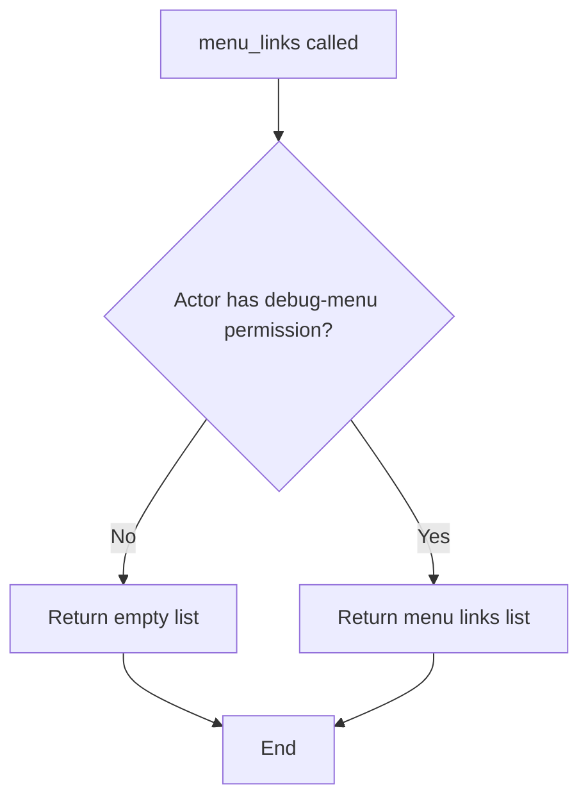

# `default_menu_links.py`

## `datasette.default_menu_links.menu_links` · *function*

## Summary:
Returns an async function that generates debug menu links for Datasette admin interface when the actor has appropriate permissions.

## Description:
This function implements a Datasette hook that provides debug menu links for administrators. It returns an async inner function that, when called, checks if the actor has the "debug-menu" permission. If permission is granted, it returns a list of menu link dictionaries containing href paths and labels for various debugging and administrative features. If permission is denied, it returns an empty list.

The function is designed as a hook implementation to integrate with Datasette's plugin architecture, allowing dynamic menu generation based on user permissions.

## Args:
    datasette (Datasette): The Datasette instance providing URL generation and permission checking capabilities
    actor (dict): Actor information used for permission validation

## Returns:
    callable: An async function that when invoked returns a list of menu link dictionaries or an empty list

## Raises:
    None explicitly raised - the function delegates permission checking to datasette.permission_allowed()

## Constraints:
    Preconditions:
    - datasette must be a valid Datasette instance with urls.path() method available
    - actor must be a valid actor dictionary for permission checking
    - The function must be used as a hook implementation in Datasette
    
    Postconditions:
    - The returned async function will always return either a list of menu link dictionaries or an empty list
    - Menu link dictionaries contain 'href' and 'label' keys

## Side Effects:
    None - This function doesn't perform any I/O operations or mutate external state directly. It relies on datasette.permission_allowed() and datasette.urls.path() which may have their own side effects.

## Control Flow:


## Examples:
```python
# Typical usage in a Datasette plugin hook
async def my_menu_links(datasette, actor):
    # This would be called internally by Datasette
    menu_func = menu_links(datasette, actor)
    links = await menu_func()
    return links

# Result when permission is granted:
[
    {"href": "/-/databases", "label": "Databases"},
    {"href": "/-/plugins", "label": "Installed plugins"},
    {"href": "/-/versions", "label": "Version info"},
    {"href": "/-/metadata", "label": "Metadata"},
    {"href": "/-/settings", "label": "Settings"},
    {"href": "/-/permissions", "label": "Debug permissions"},
    {"href": "/-/messages", "label": "Debug messages"},
    {"href": "/-/allow-debug", "label": "Debug allow rules"},
    {"href": "/-/threads", "label": "Debug threads"},
    {"href": "/-/actor", "label": "Debug actor"},
    {"href": "/-/patterns", "label": "Pattern portfolio"}
]

# Result when permission is denied:
[]
```

