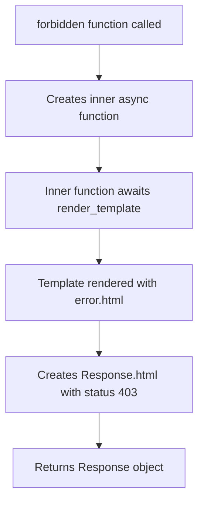

# `forbidden.py`

## `datasette.forbidden.forbidden` · *function*

## Summary:
Creates an async HTTP 403 Forbidden response handler for Datasette applications, typically used in hook implementations.

## Description:
Returns an async callable that generates a properly formatted HTTP 403 Forbidden response using Datasette's templating system. This function serves as a factory for creating standardized forbidden access handlers that render the error.html template with appropriate context.

The function is designed to be used within Datasette's hook system (marked with @hookimpl) to handle unauthorized access attempts. It encapsulates the logic for creating consistent error responses while allowing customization through the message parameter, making it reusable across different forbidden scenarios in Datasette plugins.

## Args:
    datasette (Datasette): The Datasette application instance providing access to rendering capabilities and template system
    request (Request): The incoming HTTP request object containing request context for template rendering
    message (str): The error message to display in the forbidden response template

## Returns:
    callable: An async function that when called returns a Response object with HTTP status 403 and HTML content rendered from error.html template

## Raises:
    None explicitly raised by this function - any exceptions would originate from underlying template rendering or response creation processes

## Constraints:
    Preconditions:
    - datasette must be a valid Datasette application instance with template rendering capabilities
    - request must be a valid request object compatible with Datasette's template system
    - message must be a string value that can be safely rendered in HTML
    
    Postconditions:
    - The returned async function, when awaited, produces a Response object conforming to ASGI specification
    - The Response object has HTTP status code 403
    - The Response renders the error.html template with title "Forbidden" and provided message context

## Side Effects:
    - Invokes datasette.render_template() which may involve filesystem I/O for template loading
    - Creates a Response object that will eventually be transmitted over the network via ASGI
    - Triggers template rendering and processing overhead

## Control Flow:


## Examples:
```python
# Typical usage in a Datasette hook implementation
@hookimpl
def my_forbidden_handler(datasette, request, message):
    return forbidden(datasette, request, message)

# Usage would result in a 403 response with error template
# and the provided error message rendered in HTML
```

