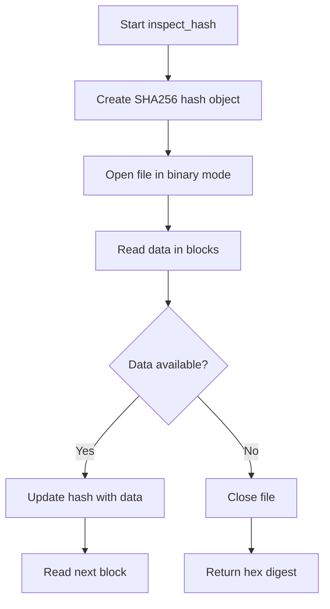
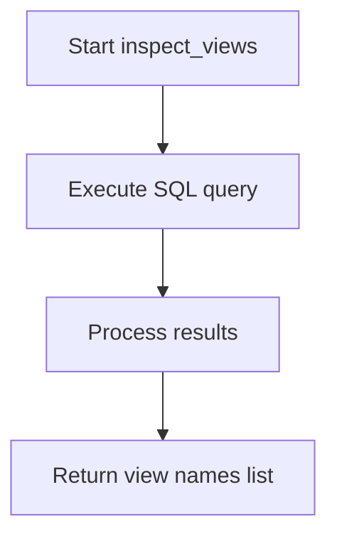
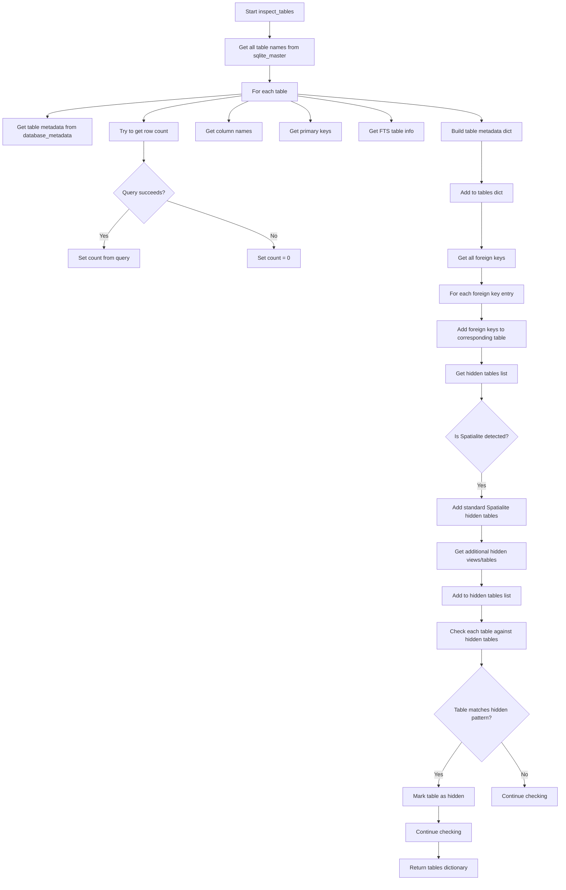

# `inspect.py`

## `datasette.inspect.inspect_hash` · *function*

## Summary:
Computes the SHA256 hash of a file's binary contents by reading it in blocks.

## Description:
This function calculates a cryptographic SHA256 hash of a file's binary content by reading the file in fixed-size blocks. It is designed to handle files of any size efficiently without loading the entire file into memory. The function is typically used for file integrity verification, caching mechanisms, or identifying unique files based on their content.

The function is extracted into its own utility to provide a reusable, efficient method for computing file hashes while maintaining good performance characteristics for large files. This separation allows other parts of the codebase to compute file hashes without duplicating the reading and hashing logic.

## Args:
    path (pathlib.Path): The file path to hash

## Returns:
    str: A hexadecimal string representation of the SHA256 hash (64 characters long)

## Raises:
    FileNotFoundError: If the file at the specified path does not exist
    PermissionError: If the file cannot be opened for reading due to insufficient permissions

## Constraints:
    Preconditions:
    - The path parameter must be a valid pathlib.Path object pointing to an existing file
    - The file must be readable
    
    Postconditions:
    - The file is read completely and its hash is computed
    - The function returns a consistent 64-character hexadecimal string representing the SHA256 hash

## Side Effects:
    - Reads from the filesystem
    - May cause disk I/O operations depending on file size and storage medium

## Control Flow:


## Examples:
    >>> from pathlib import Path
    >>> file_path = Path("example.db")
    >>> hash_value = inspect_hash(file_path)
    >>> print(hash_value)
    'a1b2c3d4e5f67890123456789012345678901234567890123456789012345678'

## `datasette.inspect.inspect_views` · *function*

## Summary:
Retrieves the names of all database views from the SQLite master table.

## Description:
This function queries the SQLite database's master table to identify and return all defined views. It's used to enumerate database views for inspection purposes.

## Args:
    conn: Database connection object to an SQLite database

## Returns:
    list[str]: A list containing the names of all views in the database

## Raises:
    None explicitly raised

## Constraints:
    Preconditions:
        - The conn parameter must be a valid SQLite database connection
        - The database must be accessible and readable
    
    Postconditions:
        - Returns an empty list if no views exist in the database
        - Returns a list of string view names if views exist

## Side Effects:
    None

## Control Flow:


## Examples:
```python
# Example usage
import sqlite3
conn = sqlite3.connect('example.db')
views = inspect_views(conn)
print(views)  # Output: ['view1', 'view2', ...] or [] if no views
```

## `datasette.inspect.inspect_tables` · *function*

## Summary:
Inspects database tables and gathers comprehensive metadata including column information, primary keys, row counts, and visibility status.

## Description:
Analyzes all tables in a SQLite database connection and collects detailed metadata about each table. This function serves as a central inspection point for database schema analysis, gathering information such as column names, primary key definitions, row counts, and whether tables should be hidden from user interfaces.

The function is typically called during database initialization or schema introspection phases when Datasette needs to understand the structure and properties of all tables in a database. It aggregates information from various utility functions and database queries to build a complete picture of the database schema.

This logic is extracted into its own function rather than being inlined because it performs a complex aggregation of multiple database queries and metadata sources, making it reusable across different parts of the application and easier to test in isolation.

## Args:
    conn: A SQLite database connection object
    database_metadata: A dictionary containing metadata about the database, particularly table-specific settings

## Returns:
    dict[str, dict]: A dictionary mapping table names to their metadata dictionaries, each containing:
        - "name" (str): Table name
        - "columns" (list[str]): List of column names
        - "primary_keys" (list[str]): List of primary key column names
        - "count" (int): Number of rows in the table (0 if inaccessible)
        - "hidden" (bool): Whether the table should be hidden from user interfaces
        - "fts_table" (str or None): Name of associated FTS table if full-text search is enabled
        - "foreign_keys" (dict or None): Foreign key relationships for the table (populated later)

## Raises:
    None explicitly raised - exceptions from database operations are caught and handled gracefully

## Constraints:
    Preconditions:
    - The conn parameter must be a valid SQLite database connection
    - The database must be accessible and readable
    - The database must contain a sqlite_master table (standard SQLite requirement)
    
    Postconditions:
    - All tables in the database are inspected and their metadata collected
    - Hidden tables are properly identified and marked
    - Foreign key relationships are associated with appropriate tables

## Side Effects:
    - Executes multiple database queries against the provided connection
    - May perform I/O operations when accessing database tables
    - Modifies the returned dictionary in-place to add foreign key information

## Control Flow:


## Examples:
```python
# Basic usage
import sqlite3
from datasette.inspect import inspect_tables

conn = sqlite3.connect("example.db")
metadata = {"tables": {"users": {"hidden": True}}}
tables_info = inspect_tables(conn, metadata)
print(tables_info["users"]["hidden"])  # True
print(tables_info["users"]["columns"])  # ['id', 'name', 'email']

# With spatialite database
metadata = {}
tables_info = inspect_tables(conn, metadata)
# Tables like "geometry_columns", "spatial_ref_sys" will be marked as hidden
```

