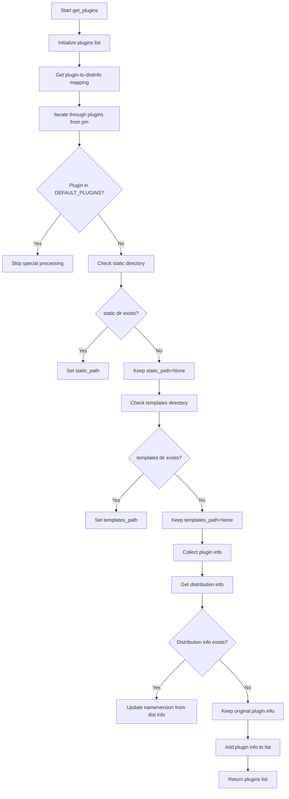

# `plugins.py`

## `datasette.plugins.get_plugins` · *function*

## Summary
Retrieves comprehensive metadata about installed Datasette plugins, including directory paths, hooks, and version information.

## Description
Enumerates all registered plugins through the pluggy system and collects detailed metadata for each plugin. For non-default plugins, it checks for the existence of static and templates directories and gathers information about implemented hooks and package version metadata.

## Args
None

## Returns
A list of dictionaries, where each dictionary contains metadata about a single plugin:
- "name" (str): The plugin's name, potentially overridden by the distribution's project name
- "static_path" (str or None): Path to the plugin's static assets directory, or None if not found
- "templates_path" (str or None): Path to the plugin's templates directory, or None if not found
- "hooks" (list[str]): List of hook names implemented by this plugin
- "version" (str or None): Plugin version from package metadata, or None if not available

## Raises
None - Exceptions (KeyError, ImportError) that may occur during resource checking are caught and suppressed internally.

## Constraints
Preconditions:
- The global variable `pm` must be initialized as a pluggy.PluginManager instance
- The global variable `DEFAULT_PLUGINS` must be defined as a collection of plugin names to exclude from special processing
- All plugins must be registered with the plugin manager before calling this function

Postconditions:
- Returns a list of plugin metadata dictionaries with consistent structure
- Plugin metadata includes all available information, with None values for missing optional fields

## Side Effects
- File system I/O operations via pkg_resources to check for directory existence
- Potential import operations when accessing plugin resources

## Control Flow


## Examples
```python
# Basic usage
plugins = get_plugins()
for plugin in plugins:
    print(f"Plugin: {plugin['name']}")
    print(f"Version: {plugin.get('version', 'Unknown')}")
    print(f"Hooks: {plugin['hooks']}")
```

