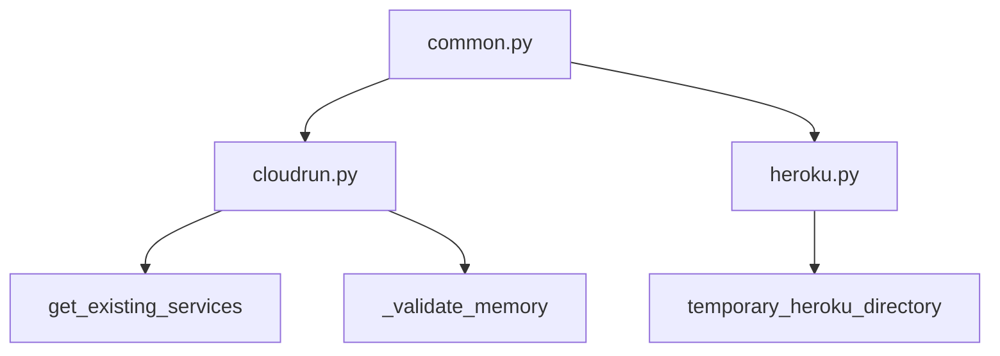

# `datasette.publish`

## Tree:
```
publish/
├── cloudrun.py
├── common.py
└── heroku.py
```

## Role:
Provides unified deployment and publishing capabilities for Datasette applications across multiple cloud platforms and hosting services.

## Description:
The publish module implements Datasette's deployment infrastructure, enabling users to publish their datasets to various platforms including Google Cloud Run and Heroku. It offers a consistent command-line interface while abstracting platform-specific deployment complexities.

The module is organized into three core files:
- `common.py`: Contains shared utilities and argument handling logic used across all publishing targets
- `cloudrun.py`: Implements Google Cloud Run deployment functionality including service validation and deployment commands
- `heroku.py`: Implements Heroku deployment functionality including artifact preparation and deployment workflows

This modular design allows for easy extension to new platforms while maintaining consistent user experience across all deployment targets.

## Components:
*   **_validate_memory** (cloudrun.py): Validates memory specification strings for Cloud Run deployment commands
*   **get_existing_services** (cloudrun.py): Retrieves metadata about existing Google Cloud Run services
*   **publish_cloudrun_subcommand** (cloudrun.py): Configures and registers a Click command for deploying to Google Cloud Run
*   **add_common_publish_arguments_and_options** (common.py): Adds common command-line arguments and options for publishing subcommands
*   **fail_if_publish_binary_not_installed** (common.py): Checks if required binary tools are installed for publishing
*   **validate_plugin_secret** (common.py): Validates plugin secret values to prevent shell injection
*   **publish_heroku_subcommand** (heroku.py): Creates and registers a Heroku publish subcommand for Datasette deployments
*   **temporary_heroku_directory** (heroku.py): Creates a temporary directory structure for Heroku deployment



## Public API:
*   **publish_cloudrun_subcommand(publish)**: Registers a Click command for deploying Datasette to Google Cloud Run
*   **publish_heroku_subcommand(publish)**: Creates and registers a Heroku publish subcommand for Datasette deployments
*   **add_common_publish_arguments_and_options(subcommand)**: Decorates Click commands with standard publishing arguments and options
*   **fail_if_publish_binary_not_installed(binary, publish_target, install_link)**: Validates that required binary tools are installed for publishing
*   **validate_plugin_secret(ctx, param, value)**: Validates plugin secret values to prevent shell injection vulnerabilities
*   **temporary_heroku_directory(files, name, metadata, extra_options, branch, template_dir, plugins_dir, static, install, version_note, secret, extra_metadata)**: Context manager for preparing Heroku deployment artifacts

## Dependencies:
*   **Internal**: 
    *   `datasette.publish.common` - Provides shared utilities for argument handling and validation
    *   `datasette.publish.cloudrun` - Contains Cloud Run specific deployment logic
    *   `datasette.publish.heroku` - Contains Heroku specific deployment logic
*   **External**: 
    *   `click` - Used for command-line interface construction and argument parsing
    *   `subprocess` - Used for executing system commands like `gcloud` and `heroku`
    *   `json` - Used for parsing JSON output from cloud platform APIs
    *   `tempfile` - Used for creating temporary directories during deployment preparation
    *   `os` - Used for filesystem operations and environment management
    *   `shutil` - Used for copying files and directories during deployment preparation

## Constraints:
*   Callers must ensure required platform-specific CLIs (gcloud, heroku) are installed and properly configured
*   Plugin secret values must not contain single quote characters to prevent shell injection
*   Platform-specific deployment commands require appropriate authentication and permissions
*   Temporary directories are automatically cleaned up, but callers should not rely on their persistence
*   The module is not thread-safe as it modifies global Click command registries and uses temporary files

---

## Files

- [`cloudrun.py`](publish/cloudrun.md)
- [`common.py`](publish/common.md)
- [`heroku.py`](publish/heroku.md)

