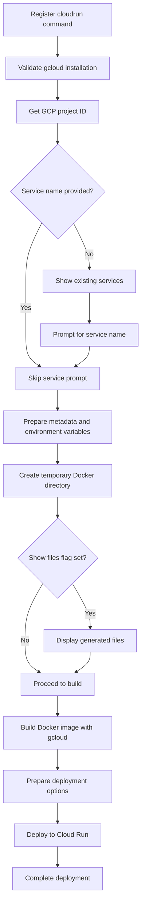
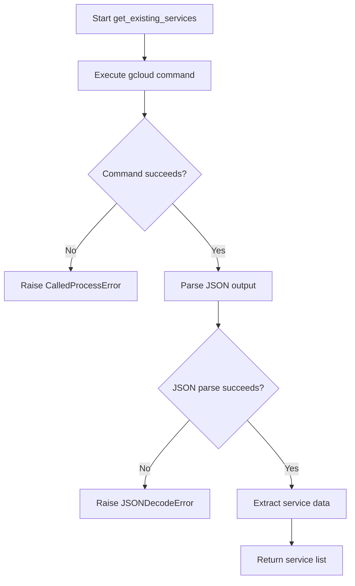
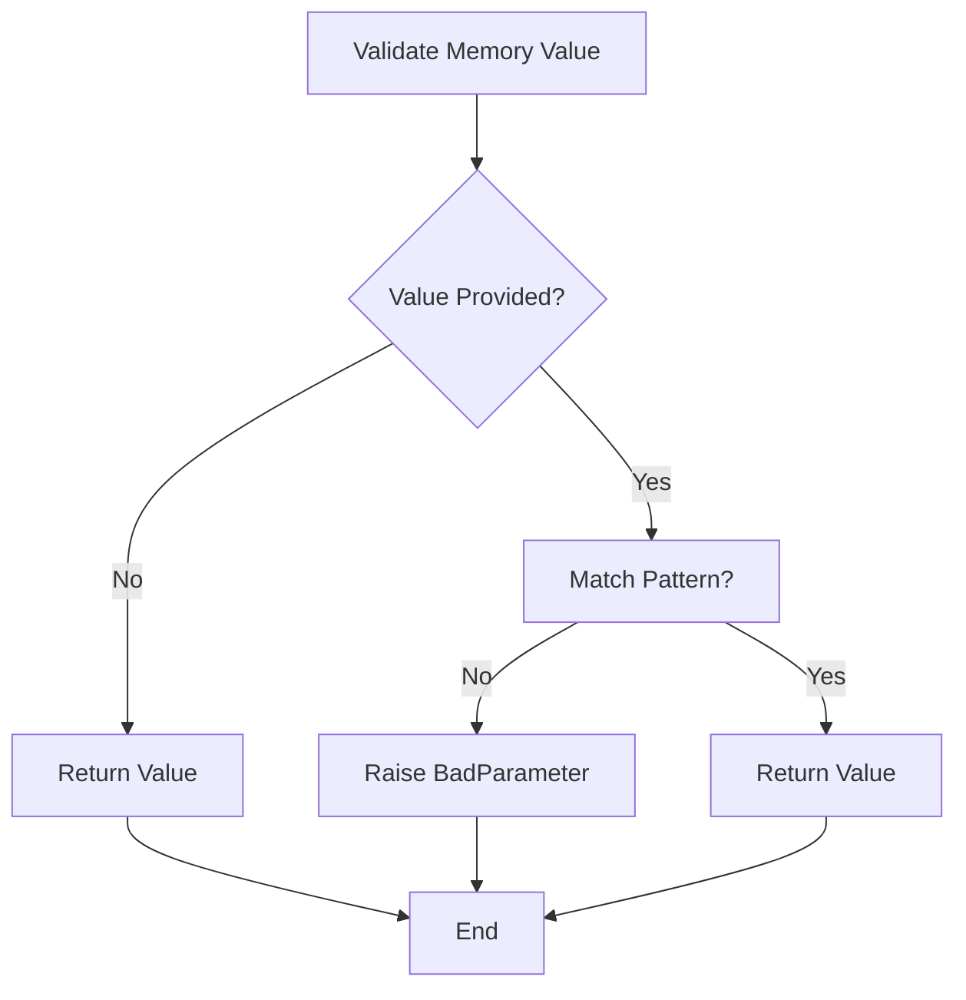

# `cloudrun.py`

## `datasette.publish.cloudrun.publish_subcommand` · *function*

## Summary
Configures and registers a Click command for deploying Datasette applications to Google Cloud Run.

## Description
This function creates a Click subcommand that enables users to publish Datasette instances to Google Cloud Run. It handles the complete deployment workflow including validating prerequisites, collecting deployment parameters, generating Docker artifacts, building container images, and deploying to Cloud Run. The command integrates with common publish options and provides interactive prompts for service naming when not specified.

## Args
    publish: A Click group object to which the cloudrun command will be registered. This parameter is typically obtained from a Click CLI application and is used to register the new subcommand.

## Returns
    Click command object: The decorated Click command that can be invoked to deploy Datasette to Google Cloud Run.

## Raises
    SystemExit: When the required 'gcloud' CLI tool is not installed or configured
    subprocess.CalledProcessError: When gcloud commands fail during service listing or deployment operations
    json.JSONDecodeError: When parsing JSON responses from gcloud commands fails
    click.BadParameter: When invalid memory specifications are provided or plugin secrets contain single quotes

## Constraints
    Preconditions:
        - The 'gcloud' CLI tool must be installed and authenticated with appropriate Google Cloud permissions
        - The user must have permission to create and deploy Cloud Run services
        - At least one datasette file must be specified for deployment
    Postconditions:
        - A Docker image is built and pushed to Google Container Registry
        - A Cloud Run service is deployed with the specified configuration
        - Temporary files are cleaned up after deployment

## Side Effects
    - Executes subprocess commands for gcloud operations (service listing, build submission, deployment)
    - Creates temporary directories and files for Docker build context
    - Modifies the Click command registry by registering the cloudrun subcommand
    - Makes network calls to Google Cloud APIs via gcloud CLI

## Control Flow


## Examples
```bash
# Deploy with default settings
datasette publish cloudrun my-database.db

# Deploy with custom service name and memory allocation
datasette publish cloudrun --service my-service --memory 2Gi my-database.db

# Deploy with plugin secrets and custom metadata
datasette publish cloudrun \
  --service my-datasette \
  --plugin-secret datasette-auth-github client_id abc123 \
  --title "My Dataset" \
  --description "Dataset for analysis" \
  my-database.db
```

## `datasette.publish.cloudrun.get_existing_services` · *function*

## Summary:
Retrieves metadata about existing Google Cloud Run services in the managed platform.

## Description:
Fetches a list of all Google Cloud Run services deployed on the managed platform and extracts key metadata including service names, creation timestamps, and access URLs. This function serves as a utility for publishing workflows to determine what services already exist in the target environment.

## Args:
    None

## Returns:
    list[dict]: A list of dictionaries, each containing:
        - "name" (str): The name of the Cloud Run service
        - "created" (str): ISO timestamp of when the service was created
        - "url" (str): The public URL address of the service

## Raises:
    subprocess.CalledProcessError: When the underlying `gcloud` command fails to execute or returns a non-zero exit code
    json.JSONDecodeError: When the JSON output from gcloud cannot be parsed
    KeyError: When expected keys are missing from the service metadata structure returned by gcloud

## Constraints:
    Preconditions:
        - The `gcloud` CLI tool must be installed and properly configured
        - The user must have appropriate permissions to list Cloud Run services
        - The default project must be set or specified in gcloud configuration
    Postconditions:
        - Returns a list of service dictionaries with consistent structure
        - All returned dictionaries contain the three expected keys: "name", "created", "url"

## Side Effects:
    - Executes a subprocess command (`gcloud run services list`)
    - Makes network calls to Google Cloud APIs via the gcloud CLI
    - May modify the process environment through subprocess execution

## Control Flow:


## Examples:
```python
# Basic usage
services = get_existing_services()
for service in services:
    print(f"Service: {service['name']}, URL: {service['url']}")

# Typical workflow in publish context
try:
    existing_services = get_existing_services()
    # Process existing services...
except subprocess.CalledProcessError as e:
    print(f"Failed to list services: {e}")
```

## `datasette.publish.cloudrun._validate_memory` · *function*

## Summary:
Validates memory specification strings for Cloud Run deployment commands.

## Description:
A Click callback function that ensures memory values provided via command-line arguments follow the correct format (number followed by Gi, G, Mi, or M units). This function is used to validate the --memory parameter in datasette publish cloudrun commands.

## Args:
    ctx: Click context object containing command execution context
    param: Click parameter object representing the parameter being validated
    value: String value to validate as a memory specification (e.g., "1Gi", "512Mi")

## Returns:
    The original value if validation passes, allowing the command to proceed

## Raises:
    click.BadParameter: When the value doesn't match the expected memory format pattern

## Constraints:
    Precondition: The value parameter should be a string or None
    Postcondition: If validation succeeds, the returned value maintains the original input

## Side Effects:
    None - This function performs no I/O operations or state mutations

## Control Flow:


## Examples:
    Valid inputs: "1Gi", "512Mi", "2G", "1024M"
    Invalid inputs: "1GB", "invalid", "1", "1.5Gi"

