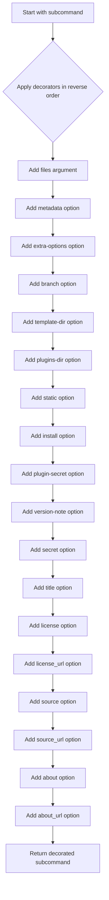
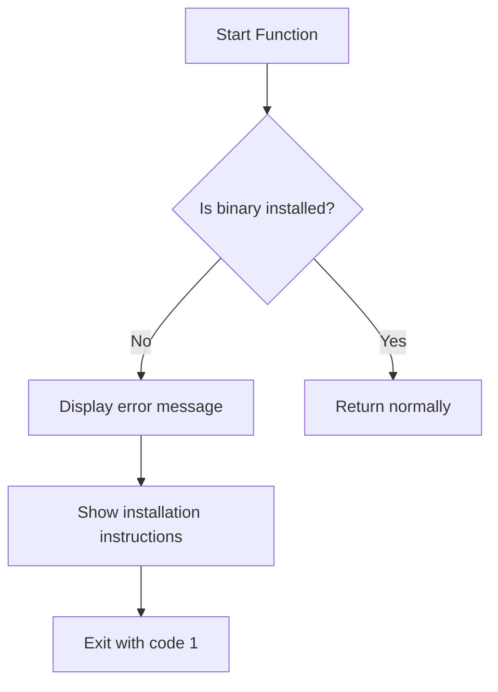

# `common.py`

## `datasette.publish.common.add_common_publish_arguments_and_options` · *function*

## Summary:
Adds common command-line arguments and options for datasette publishing subcommands.

## Description:
This function decorates a Click subcommand by applying a set of standard command-line arguments and options that are commonly needed when publishing Datasette instances. It enables consistent CLI interfaces across different publishing commands while centralizing argument definitions.

The function is designed to be reusable across various publish subcommands (like deploy, host, etc.) to avoid duplication of argument definitions. It applies decorators in reverse order to ensure proper stacking behavior.

## Args:
    subcommand (click.Command): The Click command object to decorate with common arguments and options.

## Returns:
    click.Command: The decorated command object with all common arguments and options applied.

## Raises:
    click.BadParameter: When plugin secret validation fails due to single quote characters in secret values.

## Constraints:
    Preconditions:
    - The subcommand parameter must be a valid Click command object
    - The validate_plugin_secret function must be available in scope
    
    Postconditions:
    - The returned command object will have all common CLI arguments and options registered
    - The command will accept the same set of arguments regardless of which publish subcommand it is used with

## Side Effects:
    None

## Control Flow:


## Examples:
```bash
# Typical usage in a publish subcommand
@click.command()
@add_common_publish_arguments_and_options
def deploy(files, metadata, extra_options, ...):
    # Command implementation here
    pass

# Usage would allow:
# datasette publish deploy db.sqlite --metadata metadata.json --title "My Dataset"
```

## `datasette.publish.common.fail_if_publish_binary_not_installed` · *function*

## Summary:
Checks if a required binary tool is installed and exits with an informative error message if not.

## Description:
This utility function validates that a specific binary tool required for publishing to a particular target is installed and available in the system PATH. If the binary is missing, it displays a formatted error message with installation instructions and terminates the application.

The function is designed to prevent publishing operations from failing later due to missing dependencies, providing immediate feedback to users about what tools need to be installed.

## Args:
    binary (str): Name of the binary executable to check for existence
    publish_target (str): Name of the publishing target that requires this binary
    install_link (str): URL or instructions link for installing the required binary

## Returns:
    None: This function never returns normally as it calls sys.exit(1) when the binary is not found

## Raises:
    This function does not raise exceptions directly, but exits the program with status code 1

## Constraints:
    Preconditions:
    - All arguments must be non-empty strings
    - The binary name must be a valid executable name that could appear in system PATH
    - The install_link should be a valid URL or installation instructions

    Postconditions:
    - If the binary exists, the function completes without side effects
    - If the binary doesn't exist, the program terminates with exit code 1

## Side Effects:
    - Writes error messages to stderr using click.secho and click.echo
    - Terminates the program execution via sys.exit(1)

## Control Flow:


## Examples:
```python
# Check if 'gh' (GitHub CLI) is installed for GitHub Pages publishing
fail_if_publish_binary_not_installed(
    binary="gh",
    publish_target="GitHub Pages",
    install_link="https://cli.github.com/"
)

# Check if 'netlify' is installed for Netlify publishing
fail_if_publish_binary_not_installed(
    binary="netlify",
    publish_target="Netlify",
    install_link="https://docs.netlify.com/cli/get-started/"
)
```

## `datasette.publish.common.validate_plugin_secret` · *function*

## Summary:
Validates that plugin secret values do not contain single quote characters to prevent shell injection vulnerabilities.

## Description:
This function serves as a Click callback validator for plugin secret parameters. It ensures that any plugin secret values provided via command-line arguments do not contain single quote characters, which could potentially lead to shell injection attacks when these values are used in shell commands.

The function is designed to be used as a validation callback in Click command-line interfaces where plugin secrets are configured. It processes a list of (plugin_name, plugin_setting, setting_value) tuples and validates each setting_value.

## Args:
    ctx: Click context object
    param: Click parameter object being validated  
    value: Iterable of 3-tuples containing (plugin_name, plugin_setting, setting_value) representing plugin configuration secrets

## Returns:
    The original value parameter unchanged, if validation passes

## Raises:
    click.BadParameter: When any setting_value in the input contains a single quote character

## Constraints:
    Preconditions:
    - The value parameter must be iterable
    - Each element in value must be a 3-tuple (plugin_name, plugin_setting, setting_value)
    - The function assumes proper Click context and parameter objects are provided
    
    Postconditions:
    - If validation passes, the return value equals the input value
    - If validation fails, the function raises an exception and never returns

## Side Effects:
    None

## Control Flow:
The function iterates through all items in the value parameter. For each 3-tuple (plugin_name, plugin_setting, setting_value), it checks if setting_value contains a single quote character. If any such character is found, it raises a click.BadParameter exception. Otherwise, it returns the original value unchanged.

## Examples:
```python
# Valid usage - no single quotes in secrets
secrets = [
    ("my_plugin", "api_key", "secret123"),
    ("another_plugin", "token", "token456")
]
# This passes validation and returns the secrets unchanged

# Invalid usage - contains single quote
secrets_with_quote = [
    ("my_plugin", "api_key", "secret'withquote")
]
# This raises click.BadParameter with message:
# "--plugin-secret cannot contain single quotes"
```

