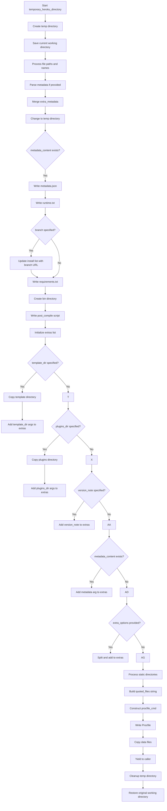

# `heroku.py`

## `datasette.publish.heroku.publish_subcommand` · *function*

## Summary:
Creates and registers a Heroku publish subcommand for Datasette deployments.

## Description:
This function acts as a decorator factory that creates and registers a Heroku deployment subcommand with the Datasette publish command group. It defines a Click command that enables users to deploy Datasette applications directly to Heroku with comprehensive configuration options.

The command handles the complete Heroku deployment workflow including validating the Heroku CLI installation, ensuring required plugins are installed, preparing deployment artifacts through a temporary directory context, managing application naming and creation, setting environment variables for plugin secrets, and triggering the Heroku build process.

## Args:
    publish (click.Group): The Click group object representing the 'publish' command group to which this subcommand will be added.

## Returns:
    None: This function modifies the Click group in-place by registering the new 'heroku' subcommand and returns nothing.

## Raises:
    click.ClickException: When the target directory already exists during --generate-dir mode.
    click.Abort: When user declines to install the required heroku-builds plugin.
    subprocess.CalledProcessError: When shell commands fail during plugin installation or Heroku operations.

## Constraints:
    Preconditions:
    - The `publish` parameter must be a valid Click Group object
    - Heroku CLI must be installed and accessible in PATH
    - The heroku-builds plugin must be installed (will be prompted for installation if missing)
    - Required files and directories must be accessible for deployment

    Postconditions:
    - A new 'heroku' subcommand is registered with the publish Click group
    - The command accepts all standard publish arguments and Heroku-specific options
    - If successful, the application is deployed to Heroku

## Side Effects:
    - Modifies the Click command group by registering a new subcommand
    - Installs Heroku plugins if needed (via subprocess calls)
    - Creates temporary directories and files for deployment preparation
    - Makes network calls to Heroku API for app creation and builds
    - Sets environment variables on the deployed Heroku application
    - May modify global state through Click command registration

## Control Flow:
```mermaid
flowchart TD
    A[Call publish_subcommand(publish)] --> B[Register heroku subcommand with publish group]
    B --> C[Validate heroku CLI installation]
    C --> D{heroku-builds plugin installed?}
    D -- No --> E[Ask to install heroku-builds plugin]
    E --> F[Install heroku-builds plugin]
    D -- Yes --> G[Prepare extra metadata]
    G --> H{plugin_secret provided?}
    H -- Yes --> I[Process plugin secrets and environment variables]
    I --> J[Create temporary Heroku directory context]
    J --> K{generate_dir specified?}
    K -- Yes --> L[Copy files to generate_dir and exit]
    K -- No --> M[Check for existing app with name]
    M --> N{App name exists?}
    N -- No --> O[Create new Heroku app]
    N -- Yes --> P[Use existing app name]
    O --> P
    P --> Q[Set environment variables on app]
    Q --> R[Trigger Heroku build]
    R --> S[End]
```

## Examples:
```bash
# Deploy to Heroku with default settings
datasette publish heroku data.db

# Deploy with custom app name
datasette publish heroku data.db --name my-datasette-app

# Generate files without deploying
datasette publish heroku data.db --generate-dir ./deploy-files

# Deploy with custom metadata
datasette publish heroku data.db \\
    --title "My Dataset" \\
    --description "A dataset of interesting data" \\
    --license "MIT" \\
    --source "Datasette Project"

# Deploy with plugin secrets
datasette publish heroku data.db \\
    --plugin-secret my-plugin api_key secret-key-value
```

## `datasette.publish.heroku.temporary_heroku_directory` · *function*

## Summary:
Creates a temporary directory structure with all necessary files for deploying a Datasette application to Heroku.

## Description:
This function serves as a context manager that prepares a temporary directory containing all required files for Heroku deployment of a Datasette instance. It handles setting up configuration files like Procfile, requirements.txt, runtime.txt, and metadata.json, as well as copying necessary data files, templates, plugins, and static directories. The temporary directory is automatically cleaned up when exiting the context.

## Args:
    files (list[str]): List of file paths to include in the deployment
    name (str): Name of the application (not directly used in the function)
    metadata (TextIO, optional): File handle containing metadata JSON
    extra_options (str, optional): Additional options to pass to datasette serve command
    branch (str, optional): Git branch to install Datasette from (for development versions)
    template_dir (str, optional): Path to template directory to copy
    plugins_dir (str, optional): Path to plugins directory to copy
    static (list[tuple[str, str]]): List of (mount_point, path) tuples for static directories
    install (list[str]): List of packages to install via pip
    version_note (str, optional): Version note to include in deployment
    secret (str): Secret key (not directly used in the function)
    extra_metadata (dict, optional): Additional metadata fields to merge with existing metadata

## Returns:
    None: This function is a context manager that yields control to the caller within the temporary directory context

## Raises:
    None explicitly raised: The function doesn't raise exceptions directly, but underlying operations may raise IOError, OSError, etc.

## Constraints:
    Preconditions:
    - All file paths in `files` must be accessible
    - If `metadata` is provided, it must be readable and contain valid JSON
    - Directory paths in `template_dir`, `plugins_dir`, and `static` paths must exist
    - `install` list should contain valid pip package names
    
    Postconditions:
    - A temporary directory is created with all necessary deployment files
    - Current working directory is changed to the temporary directory during execution
    - Temporary directory is cleaned up upon exiting the context

## Side Effects:
    - Changes current working directory to a temporary directory
    - Creates temporary files and directories on disk
    - Writes multiple files including Procfile, requirements.txt, runtime.txt, metadata.json
    - Copies files and directories using link_or_copy/link_or_copy_directory functions
    - Calls cleanup methods on the temporary directory object

## Control Flow:


## Examples:
```python
# Basic usage with minimal parameters
with temporary_heroku_directory(
    files=["data.db"],
    name="my-datasette-app",
    metadata=None,
    extra_options=None,
    branch=None,
    template_dir=None,
    plugins_dir=None,
    static=[],
    install=["datasette"],
    version_note=None,
    secret="secret-key"
) as temp_dir:
    # Work within the temporary directory
    # Files are now available for Heroku deployment
    pass

# Usage with metadata and custom requirements
with temporary_heroku_directory(
    files=["data.db", "other.db"],
    name="my-app",
    metadata=open("metadata.json"),
    extra_options="--cors --host 0.0.0.0",
    branch=None,
    template_dir="templates",
    plugins_dir="plugins",
    static=[("static", "public/static")],
    install=["datasette", "datasette-vega"],
    version_note="Version 1.0",
    secret="secret-key",
    extra_metadata={"title": "My Custom Title"}
) as temp_dir:
    # Deployment-ready directory is now set up
    pass
```

