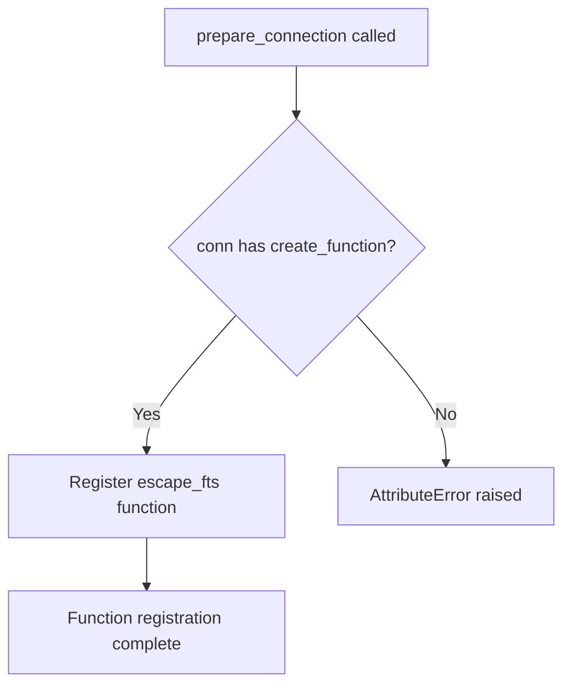

# `sql_functions.py`

## `datasette.sql_functions.prepare_connection` · *function*

## Summary:
Registers a custom SQL function named "escape_fts" with database connections for full-text search query escaping in Datasette plugins.

## Description:
This function serves as a Datasette plugin hook that registers a custom SQL function called "escape_fts" with database connections. The registered function properly escapes full-text search queries according to SQLite's FTS (Full Text Search) requirements, ensuring correct handling of special characters and quoted strings in search terms. This function is typically called automatically by Datasette's plugin system when a plugin is loaded.

## Args:
    conn: Database connection object supporting the create_function method
        - Type: sqlite3.Connection or compatible database connection
        - Purpose: The database connection to register the SQL function with

## Returns:
    None: This function does not return any value

## Raises:
    AttributeError: If the connection object does not have a create_function method
    TypeError: If the arguments to create_function are invalid

## Constraints:
    Preconditions:
        - The conn parameter must be a valid database connection object
        - The conn object must support the create_function method
    Postconditions:
        - The "escape_fts" SQL function is registered with the provided connection
        - The function can be used in SQL queries to escape FTS queries

## Side Effects:
    - Modifies the database connection state by registering a new SQL function
    - No external I/O operations performed

## Control Flow:


## Examples:
```python
# Typical usage in a Datasette plugin
import sqlite3
from datasette.sql_functions import prepare_connection

# Create a database connection
conn = sqlite3.connect(':memory:')

# Register the escape_fts function
prepare_connection(conn)

# Now the escape_fts function can be used in SQL queries
cursor = conn.execute('SELECT escape_fts("hello world")')
result = cursor.fetchone()[0]
# Result would be properly escaped for FTS search
```

