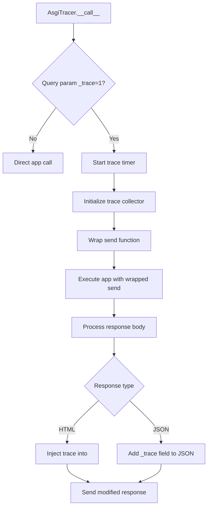

# `tracer.py`

## `datasette.tracer.get_task_id` · *function*

## Summary:
Retrieves the current asynchronous task identifier for tracing purposes, falling back to the actual task ID if no trace identifier is set.

## Description:
This function provides a mechanism to obtain a consistent task identifier for tracing operations within asynchronous code. It first checks if a trace-specific task ID has been set in the current context, returning that if available. If no trace ID is present, it attempts to derive the actual task ID from the current asyncio event loop.

## Args:
    None

## Returns:
    int or None: The trace task ID if set in context, otherwise the actual task ID as returned by `id(asyncio.current_task())`, or None if no event loop is available.

## Raises:
    None explicitly raised

## Constraints:
    Preconditions:
    - The function should be called within an asynchronous context
    - If called outside of an async context, the fallback behavior will return None
    
    Postconditions:
    - Returns either a trace task ID (if set), the actual task ID, or None
    - Does not modify any global state

## Side Effects:
    None

## Control Flow:
```mermaid
flowchart TD
    A[get_task_id called] --> B{trace_task_id in context?}
    B -- Yes --> C[Return trace_task_id]
    B -- No --> D[Try get_event_loop()]
    D --> E{RuntimeError?}
    E -- Yes --> F[Return None]
    E -- No --> G[Get current_task()]
    G --> H[Return id(current_task())]
```

## Examples:
```python
# Basic usage in async context
task_id = get_task_id()

# When trace_task_id is set in context
# (this would typically be done by other tracing functions)
trace_task_id.set(12345)
task_id = get_task_id()  # Returns 12345
```

## `datasette.tracer.trace_child_tasks` · *function*

## Summary:
A generator-based context manager that establishes a tracing context for child asynchronous tasks by setting a task identifier in the current execution context.

## Description:
This function implements a context manager that manages the `trace_task_id` ContextVar for asynchronous task tracing. When entered, it sets the current task identifier in the context, making it available to child tasks. When exited, it restores the previous context value. This enables tracing systems to maintain task hierarchy and relationship tracking in asynchronous code execution.

The function is designed to be used with Python's `with` statement as a context manager, providing automatic setup and cleanup of tracing context. It's particularly useful for creating traceable task hierarchies in asynchronous applications.

## Args:
    None

## Returns:
    Generator: A generator object that yields control during the context execution. The generator produces no meaningful values.

## Raises:
    None explicitly raised

## Constraints:
    Preconditions:
    - Must be called within an asynchronous context where `get_task_id()` can successfully retrieve a task identifier
    - The `trace_task_id` ContextVar must be properly initialized in the module scope
    
    Postconditions:
    - The `trace_task_id` ContextVar is set to a task identifier during execution
    - The `trace_task_id` ContextVar is reset to its previous value upon exiting the context

## Side Effects:
    - Modifies the current context's `trace_task_id` ContextVar value
    - No external I/O operations or state mutations beyond context management

## Control Flow:
```mermaid
flowchart TD
    A[trace_child_tasks called] --> B[Set trace_task_id with get_task_id()]
    B --> C[Yield control to managed block]
    C --> D{Exiting context?}
    D -->|Yes| E[Reset trace_task_id to previous value]
    E --> F[Exit]
```

## Examples:
```python
# Typical usage as a context manager
async def my_async_function():
    with trace_child_tasks():
        # All child tasks created within this block
        # will inherit the tracing context
        await asyncio.create_task(some_other_task())

# Multiple nested contexts
async def complex_async_function():
    with trace_child_tasks():
        await asyncio.create_task(task1())
        with trace_child_tasks():
            await asyncio.create_task(task2())
```

## `datasette.tracer.trace` · *function*

## Summary:
A context manager that records timing and execution information for tracing asynchronous operations.

## Description:
This function serves as a tracing utility that wraps execution contexts to capture performance metrics and execution details. It's designed to be used as a context manager to automatically measure execution duration and collect stack trace information for debugging and performance analysis.

The function is typically called within asynchronous code paths where detailed tracing is needed. It's part of a larger tracing system that associates trace data with specific tasks through task identifiers, enabling profiling and debugging of complex asynchronous workflows.

## Args:
    type (str): The type/category of the traced operation, used to categorize trace entries
    **kwargs: Additional metadata to be recorded with the trace entry

## Returns:
    Generator: A context manager generator that yields the input kwargs to allow the wrapped code to execute, then collects and stores trace information after execution completes.

## Raises:
    AssertionError: When any of the keyword arguments conflict with reserved trace keys (defined as `TRACE_RESERVED_KEYS`)

## Constraints:
    Preconditions:
    - Must be called within an asynchronous context where task tracking is meaningful
    - The `type` parameter must be a string identifying the operation type
    - Keyword arguments must not contain reserved trace keys (defined as `TRACE_RESERVED_KEYS`)
    
    Postconditions:
    - If tracing is enabled for the current task, trace data is appended to the task's tracer
    - Execution continues normally with the yielded kwargs
    - Timing measurements are captured accurately using `time.perf_counter()`

## Side Effects:
    - May append trace data to a global tracer collection (`tracers`)
    - Captures and formats stack trace information
    - Uses `time.perf_counter()` for high-resolution timing

## Control Flow:
```mermaid
flowchart TD
    A[trace() called with type and kwargs] --> B{TRACE_RESERVED_KEYS in kwargs?}
    B -- Yes --> C[AssertionError raised]
    B -- No --> D[get_task_id() called]
    D --> E{task_id is None?}
    E -- Yes --> F[Yield kwargs and return]
    E -- No --> G[tracers.get(task_id) called]
    G --> H{tracer exists?}
    H -- No --> I[Yield kwargs and return]
    H -- Yes --> J[Start timer with time.perf_counter()]
    J --> K[Yield kwargs (execute wrapped code)]
    K --> L[End timer with time.perf_counter()]
    L --> M[Create trace_info dict with type, start, end, duration_ms, traceback]
    M --> N[Update trace_info with kwargs]
    N --> O[Append trace_info to tracer]
    O --> P[Return to caller]
```

## Examples:
```python
# Database query tracing with metadata
async def fetch_user_data(user_id):
    with trace("database_query", table="users", user_id=user_id):
        return await db.fetch_one("SELECT * FROM users WHERE id = ?", (user_id,))

# API request tracing with endpoint information
async def handle_user_request(user_id):
    with trace("api_request", endpoint="/users/{user_id}"):
        data = await fetch_user_data(user_id)
        return {"user": data}

# Nested tracing for complex operations
async def process_user_order(user_id, order_id):
    with trace("order_processing", user_id=user_id, order_id=order_id):
        with trace("validate_user", user_id=user_id):
            await validate_user_permissions(user_id)
        
        with trace("fetch_order", order_id=order_id):
            order = await fetch_order(order_id)
            
        with trace("process_payment", amount=order.amount):
            await process_payment(order)
```

## `datasette.tracer.capture_traces` · *function*

## Summary:
A generator-based context manager that temporarily associates a tracer object with the current task ID for tracing purposes.

## Description:
This function serves as a generator-based context manager that enables tracing by associating a tracer object with the current asynchronous task. It retrieves the current task identifier and stores the provided tracer in a global registry during the execution context. This allows tracing systems to track and associate trace data with specific tasks throughout their lifecycle.

The function is designed to be used as a context manager (with the `with` statement) and ensures proper cleanup by removing the tracer association when exiting the context. It operates as a two-phase generator that yields control at the beginning and end of the tracing context.

Known callers within the codebase:
- This function is likely called by tracing setup functions or middleware that need to establish tracer context for specific tasks
- It would typically be used in async request handlers or task processing functions where tracing is desired

This logic is extracted into its own function rather than being inlined because it encapsulates the core tracing context management responsibility, providing a clean separation between tracer setup/cleanup and the actual tracing logic.

## Args:
    tracer (Any): The tracer object to associate with the current task. This is typically a tracing utility or instrumentation object that will be used to record trace data.

## Returns:
    Generator: A generator that acts as a context manager, yielding control twice - once at the beginning and once at the end of the tracing context.

## Raises:
    None explicitly raised

## Constraints:
    Preconditions:
    - Must be called within an asynchronous context where `get_task_id()` can successfully retrieve a task identifier
    - The `tracer` parameter should be a valid tracer object that can handle trace recording operations
    
    Postconditions:
    - If a task ID is available, the tracer is stored in the global `tracers` registry during the context
    - The tracer is removed from the registry when exiting the context
    - If no task ID is available, the function operates as a no-op context manager

## Side Effects:
    - Modifies the global `tracers` dictionary by adding/removing entries
    - Uses context variables to manage task identification
    - May affect tracing behavior by making tracer objects available to trace collection systems

## Control Flow:
```mermaid
flowchart TD
    A[capture_traces called] --> B[get_task_id()]
    B --> C{task_id is None?}
    C -- Yes --> D[Yield (first yield)]
    C -- No --> E[Store tracer in tracers[task_id]]
    E --> F[Yield (first yield)]
    F --> G[Delete tracer from tracers[task_id]]
    G --> H[Yield (second yield)]
```

## Examples:
```python
# Basic usage as context manager
with capture_traces(my_tracer):
    # All tracing operations within this block
    # will use my_tracer for the current task
    do_something_that_generates_traces()

# Usage in async context
async def handle_request():
    tracer = create_tracer()
    with capture_traces(tracer):
        await process_request()
```

## `datasette.tracer.AsgiTracer` · *class*

## Summary:
ASGI middleware that adds performance tracing capabilities to HTTP requests, injecting trace information into responses when requested via query parameter.

## Description:
The AsgiTracer class implements ASGI middleware that instruments HTTP requests to capture performance traces. When a request contains the query parameter `_trace=1`, it wraps the application call with tracing functionality that records request duration, trace data from child operations, and injects this information into the HTTP response body.

This class serves as a debugging and performance monitoring tool for ASGI applications, allowing developers to inspect request processing times and trace execution paths without modifying application code. It specifically targets HTML responses by embedding trace data before the closing `</body>` tag, and JSON responses by adding a `_trace` field to the JSON payload.

## State:
- app: ASGI application callable that this tracer wraps (required parameter to __init__)
- max_body_bytes: Class attribute defining maximum response body size (256 KB) for trace injection

## Lifecycle:
- Creation: Instantiate with an ASGI application callable using `AsgiTracer(app)`
- Usage: Call instance with standard ASGI scope, receive, and send parameters as per ASGI specification
- Destruction: No explicit cleanup required; relies on ASGI lifecycle management

## Method Map:


## Raises:
- No explicit exceptions raised by __init__
- Exceptions from wrapped ASGI app are propagated normally

## Example:
```python
# Create tracer middleware
app = AsgiTracer(my_asgi_app)

# When making a request with ?_trace=1
# Response will contain trace information embedded in HTML or JSON

# Typical usage in ASGI application:
# app = AsgiTracer(my_datasette_app)
```

### `datasette.tracer.AsgiTracer.__init__` · *method*

## Summary:
Initializes the ASGI tracer middleware with an ASGI application to wrap for performance tracing.

## Description:
Constructs an AsgiTracer instance that will instrument HTTP requests to capture performance traces when requested via the `_trace=1` query parameter. This constructor stores the provided ASGI application for later use in request processing.

The tracer middleware intercepts ASGI requests and can optionally modify response bodies to include performance trace information when the `_trace=1` query parameter is present in the request.

## Args:
    app: ASGI application callable that this tracer will wrap for performance monitoring. Must be a valid ASGI application that follows the ASGI specification.

## Returns:
    None: This method initializes the instance but does not return a value.

## Raises:
    None: This method does not raise any exceptions under normal circumstances.

## State Changes:
    Attributes READ:
    - None: This method does not read any existing instance attributes.

    Attributes WRITTEN:
    - self.app: Stores the provided ASGI application callable for later use in request processing.

## Constraints:
    Preconditions:
    - The `app` parameter must be a valid ASGI application callable that accepts standard ASGI scope, receive, and send parameters.
    - The method should be called in an appropriate context where ASGI middleware initialization is expected.

    Postconditions:
    - The instance will have `self.app` set to the provided ASGI application.
    - The instance is ready to be used as ASGI middleware for request processing.

## Side Effects:
    None: This method performs no I/O operations or external service calls. It only stores a reference to the provided ASGI application.

### `datasette.tracer.AsgiTracer.__call__` · *method*

## Summary:
Intercepts and traces ASGI HTTP requests, modifying response bodies to include performance trace information when the `_trace=1` query parameter is present.

## Description:
This method implements the ASGI middleware interface to wrap HTTP request processing. When the `_trace=1` query parameter is present in the request, it enables detailed tracing of request processing time and database operations. The method captures timing information and injects it into the response body for HTML pages or adds it to JSON responses.

The method acts as a filter that either passes through the request unchanged or wraps the response handling to collect and annotate trace data. It's designed to be used as ASGI middleware in Datasette applications for debugging and performance analysis.

## Args:
    scope (dict): ASGI scope containing request information including query_string
    receive (callable): ASGI receive callable for receiving messages
    send (callable): ASGI send callable for sending messages

## Returns:
    None: This method doesn't return a value directly, but asynchronously processes the request and sends responses

## Raises:
    None explicitly raised: The method handles potential exceptions internally through the ASGI protocol

## State Changes:
    Attributes READ:
    - self.app: The wrapped ASGI application
    - self.max_body_bytes: Maximum response body size limit for tracing

    Attributes WRITTEN:
    - None: This method doesn't modify instance attributes directly

## Constraints:
    Preconditions:
    - The scope must contain valid ASGI request information
    - The receive and send parameters must be valid ASGI callable functions
    - The method must be called within an async context

    Postconditions:
    - If tracing is disabled, the original request is processed normally
    - If tracing is enabled, response bodies are modified to include trace information
    - Trace data is collected via the capture_traces context manager

## Side Effects:
    - I/O operations when reading/writing HTTP response bodies
    - Potential modification of response content when trace information is injected
    - Calls to external services through the wrapped ASGI application
    - Uses context variables for trace tracking through the capture_traces context manager

