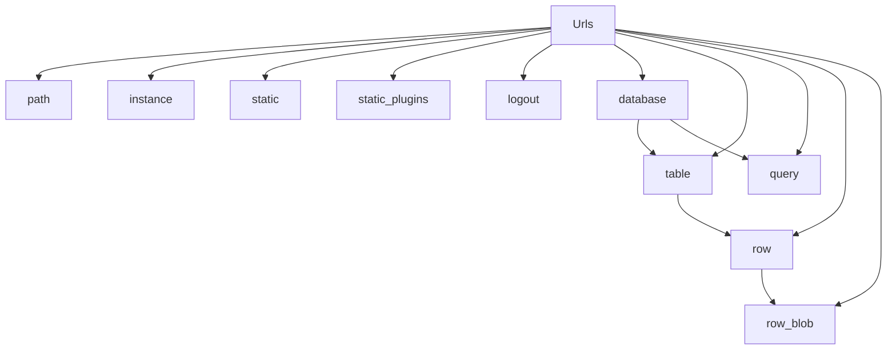

# `url_builder.py`

## `datasette.url_builder.Urls` · *class*

## Summary:
A URL builder class that generates properly formatted URLs for various components of a Datasette application.

## Description:
The Urls class provides a centralized mechanism for constructing URLs within a Datasette application. It takes a Datasette instance as input and offers methods to build URLs for different application components such as databases, tables, queries, and static resources. This abstraction ensures consistent URL formatting and handles special encoding requirements including tilde encoding for paths and proper base URL handling.

## State:
- ds: Datasette instance providing configuration and database access
  - Type: Datasette instance
  - Valid range: Any valid Datasette instance with setting() and get_database() methods
  - Invariant: Must have setting() method returning base_url configuration and get_database() method for database lookup

## Lifecycle:
- Creation: Instantiate with a Datasette instance (ds)
- Usage: Call various URL-building methods in appropriate sequence
- Destruction: No explicit cleanup required

## Method Map:


## Raises:
- No explicit exceptions documented in the constructor
- Methods may raise exceptions from underlying utilities (path_with_format, tilde_encode) or Datasette instance methods (ds.setting, ds.get_database)

## Example:
```python
# Create URL builder with Datasette instance
urls = Urls(datasette_instance)

# Build various URLs
instance_url = urls.instance()
static_url = urls.static("style.css")
db_url = urls.database("mydb")
table_url = urls.table("mydb", "mytable")
query_url = urls.query("mydb", "SELECT * FROM table")
row_url = urls.row("mydb", "mytable", "123")
blob_url = urls.row_blob("mydb", "mytable", "123", "image_column")
```

### `datasette.url_builder.Urls.__init__` · *method*

## Summary:
Initializes a URL builder instance with a Datasette application instance for generating properly formatted URLs.

## Description:
Constructs a Urls instance that serves as a centralized mechanism for building URLs within a Datasette application. This constructor accepts a Datasette instance and stores it internally, making the application's configuration and database services available to all URL-building methods.

## Args:
    ds: Datasette instance providing application configuration and database access
        - Type: Datasette instance
        - Valid range: Any valid Datasette instance with setting() and get_database() methods
        - Required: Yes

## Returns:
    None: This method initializes the instance state but does not return a value.

## Raises:
    None: This constructor does not explicitly raise exceptions.

## State Changes:
    Attributes READ: None
    Attributes WRITTEN: 
        - self.ds: Stores the provided Datasette instance for later use by URL-building methods

## Constraints:
    Preconditions:
        - The ds parameter must be a valid Datasette instance
        - The Datasette instance must have the required methods (setting(), get_database()) available
    Postconditions:
        - The instance is properly initialized with a reference to the Datasette application
        - All URL-building methods can access the Datasette instance via self.ds

## Side Effects:
    None: This method performs no I/O operations, external service calls, or mutations to objects outside the instance.

### `datasette.url_builder.Urls.path` · *method*

## Summary:
Constructs and returns a prefixed URL path string with optional format handling.

## Description:
This method processes a raw path string by normalizing it (removing leading slashes), prepending the configured base URL, and optionally appending a format extension. The result is wrapped in a PrefixedUrlString object for proper URL handling.

## Args:
    path (str or PrefixedUrlString): The raw path to process. If starting with "/", the leading slash is removed.
    format (str, optional): Optional format extension to append to the path. Defaults to None.

## Returns:
    PrefixedUrlString: A URL-safe path string with base URL prefix and optional format extension.

## Raises:
    None explicitly raised by this method.

## State Changes:
    Attributes READ: self.ds (Datasette instance), self.ds.setting("base_url")
    Attributes WRITTEN: None

## Constraints:
    Preconditions:
        - The path parameter must be either a string or PrefixedUrlString instance
        - The base_url setting must be properly configured in the Datasette instance
    Postconditions:
        - Returns a PrefixedUrlString instance
        - The returned path will have the base_url prepended
        - If format is provided, it will be appended to the path

## Side Effects:
    None - This method is pure and doesn't perform I/O or mutate external state.

### `datasette.url_builder.Urls.instance` · *method*

## Summary:
Returns a URL for the datasette instance root with optional format specification.

## Description:
Creates a URL pointing to the root of the Datasette instance, typically used for accessing the main dashboard or API endpoints. This method is a convenience wrapper around the path() method that specifically targets the root path.

## Args:
    format (str, optional): Output format extension (e.g., 'json', 'csv'). Defaults to None.

## Returns:
    PrefixedUrlString: A formatted URL string pointing to the instance root with optional format handling.

## Raises:
    None explicitly raised.

## State Changes:
    Attributes READ: self.ds (accessed via self.ds.setting("base_url"))
    Attributes WRITTEN: None

## Constraints:
    Preconditions: The Urls instance must be initialized with a valid Datasette instance (self.ds)
    Postconditions: Returns a PrefixedUrlString object containing the properly formatted instance URL

## Side Effects:
    None

### `datasette.url_builder.Urls.static` · *method*

## Summary:
Constructs a URL path for static assets by prefixing the input path with the standard static directory identifier.

## Description:
This method generates a URL path specifically for accessing static assets within the application's static directory structure. It takes a relative path and prepends the standard static prefix "-/static/" to create a proper URL path for static resources.

## Args:
    path (str): The relative path to a static asset, such as a CSS file, JavaScript file, or image.

## Returns:
    str: A URL path string prefixed with "-/static/" that can be used to reference static assets.

## Raises:
    None explicitly raised by this method.

## State Changes:
    Attributes READ: None
    Attributes WRITTEN: None

## Constraints:
    Preconditions: The input path should be a valid string representing a relative path to a static asset.
    Postconditions: The returned string will always begin with "-/static/" followed by the input path.

## Side Effects:
    None - this method performs no I/O operations or external service calls.

### `datasette.url_builder.Urls.static_plugins` · *method*

## Summary:
Constructs a URL path for accessing static plugin resources within the Datasette application.

## Description:
Generates a URL path for static plugin assets by combining a standard prefix with the specified plugin name and resource path. This method is part of the URL building utilities that help construct consistent paths for various application resources.

The method is called during the URL construction phase of the application lifecycle, particularly when generating links to static plugin files such as CSS, JavaScript, or other assets that are served through the Datasette static plugin system.

This logic is encapsulated in its own method rather than being inlined because it follows a consistent naming pattern for static plugin resources and ensures proper URL formatting throughout the application.

## Args:
    plugin (str): The name of the plugin providing the static resource
    path (str): The relative path to the specific static resource within the plugin

## Returns:
    PrefixedUrlString: A URL path string prefixed with the application's base URL, formatted as "-/static-plugins/{plugin}/{path}"

## Raises:
    None explicitly raised by this method

## State Changes:
    Attributes READ: None
    Attributes WRITTEN: None

## Constraints:
    Preconditions: 
    - The plugin name must be a valid string identifier
    - The path must be a valid string representing a resource location
    - The Urls instance must have been initialized with a valid Datasette instance
    
    Postconditions:
    - Returns a PrefixedUrlString object that can be used in URL contexts
    - The returned path follows the static plugin URL pattern

## Side Effects:
    None - this method is pure and does not perform I/O or mutate external state

### `datasette.url_builder.Urls.logout` · *method*

## Summary:
Returns a URL path for the logout endpoint by constructing a prefixed URL string.

## Description:
This method generates a URL path for the logout functionality by calling the internal `path` method with the "-/logout" route. It's part of the URL building utilities that help construct proper URLs for various Datasette endpoints.

## Args:
    None

## Returns:
    PrefixedUrlString: A URL path object representing the logout endpoint, properly prefixed with the base URL setting.

## Raises:
    None explicitly raised

## State Changes:
    Attributes READ: self.ds (accessed via self.path())
    Attributes WRITTEN: None

## Constraints:
    Preconditions: The Urls instance must have been initialized with a valid Datasette object (`ds`)
    Postconditions: The returned PrefixedUrlString object contains a properly formatted logout URL

## Side Effects:
    None

### `datasette.url_builder.Urls.database` · *method*

## Summary:
Constructs a URL path for accessing a specific database endpoint within the Datasette application.

## Description:
This method generates a properly formatted URL path for accessing a database resource. It retrieves the database object using the datasette service, encodes the database route for safe URL usage, and constructs the final path with appropriate base URL prefixing and optional format handling.

## Args:
    database (str): Name or identifier of the target database
    format (str, optional): Output format extension (e.g., 'json', 'csv'). Defaults to None

## Returns:
    PrefixedUrlString: A URL path string prefixed with the base URL and optionally formatted

## Raises:
    Exception: Any exceptions raised by self.ds.get_database(database) when the database doesn't exist or is inaccessible

## State Changes:
    Attributes READ: self.ds
    Attributes WRITTEN: None

## Constraints:
    Preconditions: 
    - The database parameter must correspond to an existing database in the datasette instance
    - self.ds must be properly initialized with a valid datasette service object
    - The database object returned by self.ds.get_database(database) must have a route attribute
    
    Postconditions:
    - Returns a PrefixedUrlString with proper base URL prefixing
    - If format is provided, the resulting path includes the appropriate format extension

## Side Effects:
    None

### `datasette.url_builder.Urls.table` · *method*

## Summary:
Constructs a URL path for accessing a specific table within a database in the Datasette application.

## Description:
Generates a properly formatted URL path for accessing a database table resource. This method combines the database path with the encoded table name to create a complete URL path. It leverages the existing database path construction logic and applies proper URL encoding to handle special characters in table names.

## Args:
    database (str): Name or identifier of the target database
    table (str): Name of the target table within the database
    format (str, optional): Output format extension (e.g., 'json', 'csv'). Defaults to None

## Returns:
    PrefixedUrlString: A URL path string prefixed with the base URL that points to the specified table resource

## Raises:
    Exception: Any exceptions raised by self.database() when the database doesn't exist or is inaccessible

## State Changes:
    Attributes READ: self.ds (through self.database())
    Attributes WRITTEN: None

## Constraints:
    Preconditions:
    - The database parameter must correspond to an existing database in the datasette instance
    - The table parameter must be a valid table name string
    - self.ds must be properly initialized with a valid datasette service object
    
    Postconditions:
    - Returns a PrefixedUrlString with proper base URL prefixing
    - The table name is properly URL-encoded using tilde encoding
    - If format is provided, the resulting path includes the appropriate format extension

## Side Effects:
    None

### `datasette.url_builder.Urls.query` · *method*

## Summary:
Constructs a URL path for executing SQL queries against a specified database.

## Description:
Generates a URL path that can be used to execute SQL queries in a Datasette database. This method is part of the URL building utilities that create proper paths for database operations. The method handles URL encoding of query strings and optional format specification for API responses.

## Args:
    database (str): Name of the database to query
    query (str): SQL query string to execute
    format (str, optional): Response format (e.g., 'json', 'csv'). Defaults to None

## Returns:
    PrefixedUrlString: A URL path string prefixed with the base URL that can be used to execute the query

## Raises:
    None explicitly raised - depends on underlying methods like self.database() and tilde_encode()

## State Changes:
    Attributes READ: self.ds (through self.database())
    Attributes WRITTEN: None

## Constraints:
    Preconditions: 
    - database parameter must reference an existing database in the Datasette instance
    - query parameter must be a valid SQL string
    - format parameter, if provided, must be a supported response format
    
    Postconditions:
    - Returned PrefixedUrlString is properly encoded and formatted
    - Database path prefix is correctly constructed via self.database()

## Side Effects:
    None - this method is pure and doesn't cause any I/O or external service calls

### `datasette.url_builder.Urls.row` · *method*

## Summary:
Constructs a URL path for accessing a specific row within a database table.

## Description:
This method generates a URL path string that identifies a particular row within a specified database table. It combines the table path (generated by the `table` method) with the provided row path identifier. When a format is specified, it applies appropriate formatting to the path for content negotiation.

## Args:
    database (str): Name of the database containing the table
    table (str): Name of the table containing the row
    row_path (str): Path identifier for the specific row
    format (str, optional): Output format for the row data (e.g., 'json', 'csv')

## Returns:
    PrefixedUrlString: A URL path string that uniquely identifies the row within the table

## Raises:
    None explicitly raised

## State Changes:
    Attributes READ: None
    Attributes WRITTEN: None

## Constraints:
    Preconditions: 
    - The `database` and `table` parameters must be valid identifiers
    - The `row_path` parameter must be a valid path identifier for the row
    - The `format` parameter, if provided, must be a recognized output format
    
    Postconditions:
    - Returns a properly formatted URL path string
    - The returned path follows the pattern: "{table_path}/{row_path}"

## Side Effects:
    None

### `datasette.url_builder.Urls.row_blob` · *method*

## Summary:
Constructs a URL for accessing a blob column value from a specific row in a database table.

## Description:
Generates a URL path that targets a specific blob column within a table row. This method is used to create URLs that can be accessed to retrieve binary data stored in blob columns of database tables. The resulting URL follows Datasette's standard URL pattern for blob access, including proper URL encoding of the column name.

This method is specifically designed to build URLs for blob data access, separate from other URL building methods like `row()` which handles regular row access. It leverages the existing `table()` method to construct the base path and adds the appropriate blob-specific suffix.

## Args:
    database (str): Name of the database containing the table
    table (str): Name of the table containing the row
    row_path (str): Path identifier for the specific row (typically a primary key or unique identifier)
    column (str): Name of the blob column to access

## Returns:
    str: A URL path string formatted as "{table_path}/{row_path}.blob?_blob_column={encoded_column_name}"

## Raises:
    None explicitly raised - however, underlying methods may raise exceptions if invalid parameters are provided

## State Changes:
    Attributes READ: None (method is pure function using self.table())
    Attributes WRITTEN: None

## Constraints:
    Preconditions:
    - database must be a valid database name registered with the Datasette instance
    - table must be a valid table name within the specified database
    - row_path must be a valid identifier for a row in the specified table
    - column must be a valid column name in the specified table
    
    Postconditions:
    - Returns a properly formatted URL string for blob access
    - Column name is URL-encoded to handle special characters
    - The returned URL follows Datasette's blob access pattern

## Side Effects:
    None - this is a pure function that only constructs and returns a URL string

