# `__init__.py`

## `datasette.utils.__init__.documented` · *function*

## Summary:
Decorator that registers functions in a global tracking list for documentation tracking.

## Description:
A decorator that appends the decorated function to a global list named `functions_marked_as_documented`. This decorator is used to mark functions as having been documented, likely for automated documentation systems or validation processes. The decorator returns the original function unchanged while ensuring it's registered in the tracking list.

## Args:
    fn (callable): The function to be registered in the documentation tracking list.

## Returns:
    callable: The original function unchanged.

## Raises:
    AttributeError: If the global variable `functions_marked_as_documented` does not exist or does not support the `append` method.

## Constraints:
    Preconditions:
    - The global variable `functions_marked_as_documented` must be defined as a mutable container (such as a list) before this decorator can be applied.
    - The input `fn` must be a callable object.

    Postconditions:
    - The decorated function is appended to the global `functions_marked_as_documented` list.
    - The returned function is identical to the input function.

## Side Effects:
    - Mutates the global variable `functions_marked_as_documented` by appending the decorated function.
    - No other side effects.

## Control Flow:
```mermaid
flowchart TD
    A[Apply @documented to function] --> B[Call documented(fn)]
    B --> C[functions_marked_as_documented.append(fn)]
    C --> D[Return fn]
```

## Examples:
```python
# Basic usage
@documented
def my_function():
    '''This function is documented.'''
    return "Hello"
```

## `datasette.utils.__init__.await_me_maybe` · *function*

## Summary:
Normalizes values by executing callables and awaiting awaitables, returning the resolved value.

## Description:
This utility function provides a uniform way to handle values that may be either synchronous callables, asynchronous awaitables, or plain values. It automatically detects the type of the input and processes it accordingly, making it easier to write code that works with both synchronous and asynchronous operations without explicit type checking.

## Args:
    value (typing.Any): The input value which can be a callable, awaitable, or any other value type.

## Returns:
    typing.Any: The resolved value after executing callables or awaiting awaitables. If the input is neither callable nor awaitable, it is returned unchanged.

## Raises:
    Exception: Any exceptions raised by the callable or awaitable execution will propagate up through this function.

## Constraints:
    Precondition: The input value can be of any type, but if it's callable, it must not raise exceptions when invoked with no arguments.
    Postcondition: The returned value is always the resolved result of processing the input value according to its type.

## Side Effects:
    None: This function does not perform any I/O operations or mutate external state.

## Control Flow:
```mermaid
flowchart TD
    A[Input value] --> B{Is callable?}
    B -- Yes --> C[Call value()]
    C --> D{Is awaitable?}
    D -- Yes --> E[Await result]
    D -- No --> F[Return result]
    B -- No --> G{Is awaitable?}
    G -- Yes --> H[Await value]
    G -- No --> I[Return value]
    E --> J[Return awaited result]
    H --> J
    F --> J
    I --> J
```

## Examples:
```python
# With a regular value
result = await await_me_maybe("hello")  # Returns "hello"

# With a callable
result = await await_me_maybe(lambda: "hello")  # Returns "hello"

# With an async function
async def async_func():
    return "hello"
result = await await_me_maybe(async_func())  # Returns "hello"

# With a coroutine
async def async_func():
    return "hello"
coro = async_func()
result = await await_me_maybe(coro)  # Returns "hello"
```

## `datasette.utils.__init__.urlsafe_components` · *function*

## Summary:
Splits a comma-delimited token string and decodes each component using tilde-decoding rules.

## Description:
Processes a comma-separated string by splitting on commas and applying tilde-decoding to each component. This function is commonly used to parse URL-safe encoded parameters that may contain forward slashes represented as ~2F sequences.

## Args:
    token (str): A comma-delimited string where each component may contain tilde-encoded sequences (e.g., ~2F for forward slashes)

## Returns:
    list[str]: A list of decoded strings with tilde-sequences converted to forward slashes and percent-encoded sequences properly handled

## Raises:
    None explicitly raised

## Constraints:
    Preconditions:
    - Input token must be a string
    - Each component after splitting should be a valid input for tilde_decode function
    
    Postconditions:
    - Output list contains decoded strings with proper forward slash representation
    - Empty components in the input result in empty strings in the output

## Side Effects:
    None

## Control Flow:
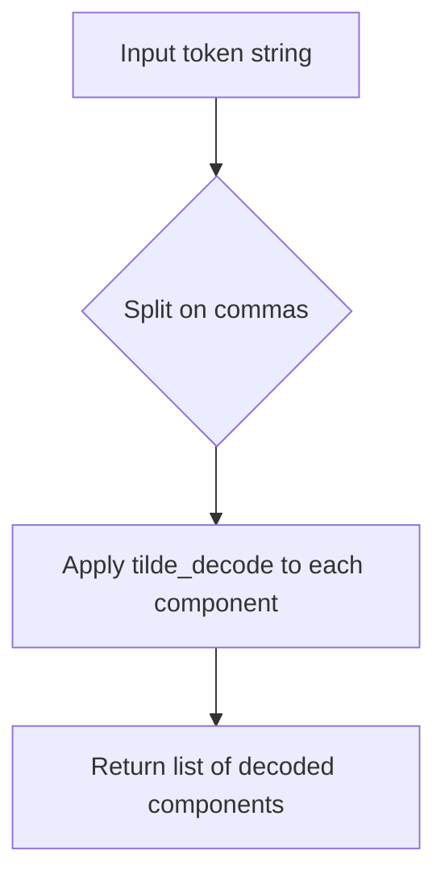

## Examples:
    >>> urlsafe_components("~2Ffoo~2Fbar,baz~2Fqux")
    ['/foo/bar', 'baz/qux']
    
    >>> urlsafe_components("")
    ['']
    
    >>> urlsafe_components("simple,~2Fencoded~2Fpath")
    ['simple', '/encoded/path']
```

## `datasette.utils.__init__.path_from_row_pks` · *function*

## Summary:
Generates a unique, optionally URL-safe identifier for a database row using its primary key values.

## Description:
Creates a comma-separated string representation of a row's primary key values, with optional tilde-based URL encoding for safe use in URLs or identifiers. This function serves as a utility for generating stable, unique paths or identifiers for database rows in Datasette's web interface.

## Args:
    row (dict): A dictionary-like object representing a database row, containing either primary key values or a 'rowid' field. Primary key values may be simple values or dictionaries with a 'value' key.
    pks (list[str]): A list of primary key column names to extract from the row.
    use_rowid (bool): If True, uses the row's 'rowid' field instead of primary key values.
    quote (bool, optional): If True, applies tilde encoding to each primary key value for URL safety. Defaults to True.

## Returns:
    str: A comma-separated string of primary key values (optionally tilde-encoded) that uniquely identifies the row.

## Raises:
    None explicitly raised by this function.

## Constraints:
    Preconditions:
    - The row parameter must be a dictionary-like object with accessible keys
    - When use_rowid=False, all pks must exist as keys in the row dictionary
    - When use_rowid=True, the row must contain a 'rowid' key
    - Each primary key value must be convertible to string
    - If a primary key value is a dictionary, it must have a 'value' key

    Postconditions:
    - Returns a string that can be used as a unique identifier for the row
    - If quote=True, returned string contains only alphanumeric characters and tilde characters
    - The returned string is comma-separated with primary key values in the order specified by pks

## Side Effects:
    None

## Control Flow:
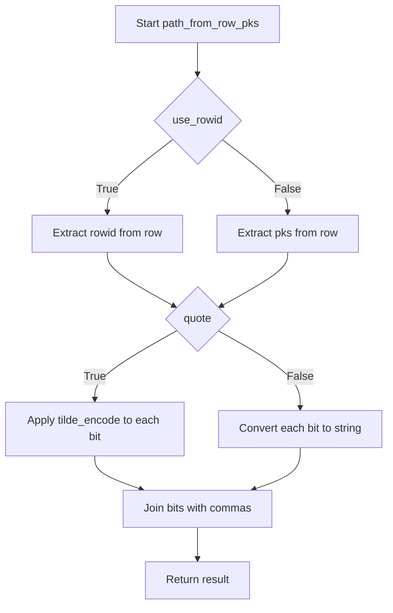

## Examples:
    >>> row = {"id": 123, "name": "test"}
    >>> path_from_row_pks(row, ["id"], False)
    '123'

    >>> row = {"id": 123, "name": "test"}
    >>> path_from_row_pks(row, ["id"], False, quote=False)
    '123'

    >>> row = {"id": 123, "name": "test"}
    >>> path_from_row_pks(row, ["id"], False, quote=True)
    '123'

    >>> row = {"rowid": 456}
    >>> path_from_row_pks(row, ["id"], True)
    '456'

    >>> row = {"id": 123, "name": "test/file"}
    >>> path_from_row_pks(row, ["id", "name"], False, quote=True)
    '123,~2Ftest~2Ffile'
    
    >>> row = {"id": {"value": 123}, "name": "test"}
    >>> path_from_row_pks(row, ["id"], False)
    '123'

## `datasette.utils.__init__.compound_keys_after_sql` · *function*

## Summary:
Generates SQL OR clauses for keyset pagination with compound primary keys.

## Description:
Constructs a SQL expression that implements keyset pagination for tables with compound primary keys. This function is used to build WHERE clauses that efficiently navigate through paginated results when the primary key consists of multiple columns. The implementation follows the pattern described in Datasette issue #190 for handling compound key pagination.

## Args:
    pks (list[str]): List of primary key column names that form a compound key
    start_index (int): Starting parameter index for SQL placeholders (default: 0)

## Returns:
    str: A SQL expression containing OR clauses that can be used in WHERE conditions for keyset pagination

## Raises:
    None explicitly raised

## Constraints:
    Preconditions:
    - pks must be a list of strings representing valid SQLite identifiers
    - start_index must be a non-negative integer
    
    Postconditions:
    - Returns a properly formatted SQL expression with appropriate escaping
    - The result is suitable for use in SQL WHERE clauses

## Side Effects:
    None

## Control Flow:
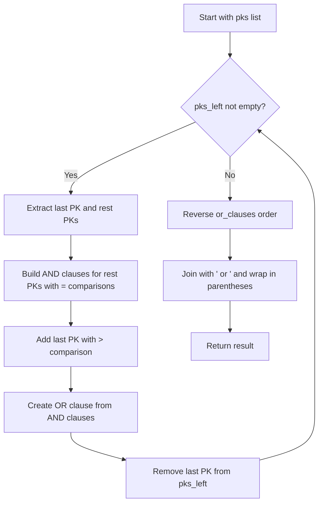

## Examples:
    # For compound primary keys ['id', 'created_at']:
    # Returns: "([id] > :p0) or ([id] = :p0 and [created_at] > :p1)"
    
    # For compound primary keys ['user_id', 'post_id', 'timestamp']:
    # Returns: "([user_id] > :p0) or ([user_id] = :p0 and [post_id] > :p1) or ([user_id] = :p0 and [post_id] = :p1 and [timestamp] > :p2)"

## `datasette.utils.__init__.CustomJSONEncoder` · *class*

## Summary:
A custom JSON encoder that extends the standard library's JSONEncoder to handle SQLite-specific data types and binary data.

## Description:
This class provides custom serialization behavior for JSON encoding when dealing with SQLite database objects and binary data. It is designed to work with Python's built-in `json` module and extends `json.JSONEncoder` to handle special data types that would normally cause serialization errors.

The encoder specifically handles:
- sqlite3.Row objects by converting them to tuples
- sqlite3.Cursor objects by converting them to lists
- bytes objects by attempting UTF-8 decoding, falling back to base64 encoding when that fails

This is particularly useful when serializing database query results or binary data that needs to be transmitted over JSON APIs.

## State:
- No instance attributes are defined beyond those inherited from json.JSONEncoder
- The class maintains no internal state that affects serialization behavior

## Lifecycle:
- Creation: Instances are created automatically when passed to json.dumps() with the cls parameter
- Usage: Called internally by the json module during serialization when encountering unsupported types
- Destruction: Managed automatically by Python's garbage collector

## Method Map:
```mermaid
graph TD
    A[json.dumps()] --> B[CustomJSONEncoder.default()]
    B --> C{isinstance(obj, sqlite3.Row)?}
    C -->|Yes| D[tuple(obj)]
    C -->|No| E{isinstance(obj, sqlite3.Cursor)?}
    E -->|Yes| F[list(obj)]
    E -->|No| G{isinstance(obj, bytes)?}
    G -->|Yes| H[try decode utf8]
    H -->|Success| I[obj.decode("utf8")]
    H -->|Failure| J[base64 encode]
    G -->|No| K[super().default(obj)]
```

## Raises:
- None explicitly raised by the constructor
- The underlying json.JSONEncoder.default method may raise TypeError for unserializable objects

## Example:
```python
import json
import sqlite3
from datasette.utils import CustomJSONEncoder

# Create a sample row
conn = sqlite3.connect(':memory:')
cursor = conn.execute('SELECT 1 as id, "test" as name')
row = cursor.fetchone()

# Serialize using the custom encoder
data = {"row": row}
json_string = json.dumps(data, cls=CustomJSONEncoder)
print(json_string)  # {"row": [1, "test"]}
```

### `datasette.utils.__init__.CustomJSONEncoder.default` · *method*

## Summary:
Handles serialization of SQLite-specific and binary data types to JSON-compatible formats.

## Description:
This method extends JSON serialization to handle special data types commonly encountered in database operations. It converts SQLite Row and Cursor objects to native Python types, and provides fallback handling for binary data that cannot be decoded as UTF-8 by encoding it in base64 format.

## Args:
    self: The CustomJSONEncoder instance
    obj: The object to serialize to JSON

## Returns:
    For sqlite3.Row: Returns a tuple representation of the row
    For sqlite3.Cursor: Returns a list of rows
    For bytes: Returns either the UTF-8 decoded string or a dictionary with base64-encoded data
    For other types: Delegates to the parent JSONEncoder.default method

## Raises:
    None explicitly raised - relies on parent class behavior for unsupported types

## State Changes:
    Attributes READ: None
    Attributes WRITTEN: None

## Constraints:
    Preconditions: 
    - The method assumes it's part of a CustomJSONEncoder subclass
    - Input obj must be of the supported types or compatible with parent JSONEncoder behavior
    
    Postconditions:
    - All supported types are converted to JSON-serializable Python types
    - Unsupported types are delegated to parent class for appropriate handling

## Side Effects:
    None - This method is purely functional and doesn't perform I/O or mutate external state

## `datasette.utils.__init__.sqlite_timelimit` · *function*

## Summary:
Sets up a time limit for SQLite queries by installing a progress handler that terminates long-running operations.

## Description:
This context manager installs a progress handler on a SQLite connection that monitors query execution time. When a query exceeds the specified time limit (in milliseconds), the handler terminates the query by returning 1. The function is designed to prevent runaway queries from blocking the application indefinitely.

The progress handler checks execution time periodically, with the frequency adjusted based on the timeout value. For very short timeouts (≤20ms), checks occur more frequently to ensure timely termination.

## Args:
    conn: A SQLite database connection object with set_progress_handler method
    ms: Timeout duration in milliseconds (positive integer)

## Returns:
    This function is a context manager that yields control to the wrapped code block.

## Raises:
    None explicitly raised - the timeout terminates the query rather than raising an exception.

## Constraints:
    Preconditions:
    - conn must be a valid SQLite connection object with set_progress_handler method
    - ms must be a positive number (though negative values will still work, they'll result in immediate timeout)
    
    Postconditions:
    - The progress handler is installed before yielding
    - The progress handler is reset to None after the context exits

## Side Effects:
    - Modifies the SQLite connection's progress handler setting
    - May interrupt long-running SQL queries with a timeout error

## Control Flow:
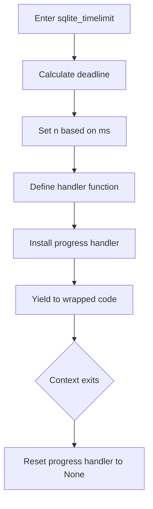

## Examples:
```python
# Basic usage
with sqlite_timelimit(conn, 1000):
    cursor.execute("SELECT * FROM large_table")

# With error handling
try:
    with sqlite_timelimit(conn, 500):
        cursor.execute("COMPLEX_QUERY")
except sqlite3.OperationalError as e:
    if "query timed out" in str(e):
        # Handle timeout gracefully
        pass
```

## `datasette.utils.__init__.InvalidSql` · *class*

## Summary:
Exception class raised when SQL operations encounter invalid syntax or structure.

## Description:
The InvalidSql exception is a specialized exception type used within the datasette framework to indicate that a SQL operation has failed due to invalid syntax or structural problems in the SQL query. This exception inherits from Python's built-in Exception class and provides semantic clarity for SQL-related error handling.

This exception serves as a domain-specific error indicator that helps distinguish SQL validation failures from other types of exceptions in the system.

## State:
- No instance attributes: This is a minimal exception class with no additional state
- No initialization parameters: Inherits directly from Exception with no custom constructor
- No internal state management: Pure exception signaling mechanism

## Lifecycle:
- Creation: Instantiated by raising the exception directly when SQL validation fails
- Usage: Typically caught by exception handlers in SQL processing code paths
- Destruction: Handled automatically by Python's exception and garbage collection mechanisms

## Method Map:
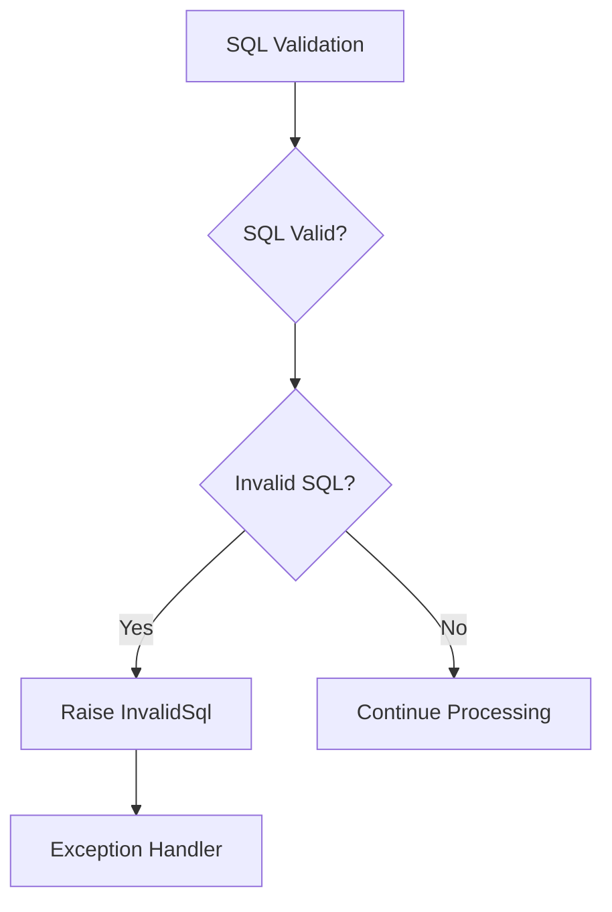

## Raises:
- InvalidSql: Raised when SQL validation detects syntactic or structural errors

## Example:
```python
# Typical usage pattern
try:
    # SQL execution that might fail
    result = database.execute("SELECT * FROM table WHERE invalid syntax")
except InvalidSql:
    # Handle SQL-specific error
    handle_sql_error("Invalid SQL detected in query")
```

## `datasette.utils.__init__.validate_sql_select` · *function*

## Summary:
Validates that SQL input is a SELECT statement and does not contain prohibited operations.

## Description:
The validate_sql_select function performs syntactic validation on SQL queries to ensure they are SELECT statements and do not contain potentially dangerous or unsupported operations. This function strips SQL comments, normalizes the input to lowercase, and applies pattern matching to verify the query conforms to allowed SQL operations while rejecting disallowed ones.

This validation is crucial for preventing unauthorized database operations and ensuring that only safe SELECT queries are processed. The function extracts this validation logic into a separate utility to promote code reuse and maintainability across different parts of the datasette application that process SQL queries.

## Args:
    sql (str): The SQL query string to validate. Must be a valid SQL statement.

## Returns:
    None: This function does not return a value. It raises an exception on validation failure.

## Raises:
    InvalidSql: Raised when the SQL query is not a SELECT statement or contains disallowed operations.

## Constraints:
    Preconditions:
    - Input SQL must be a non-empty string
    - Input SQL must be valid SQL syntax (though this function doesn't validate full syntax, only structure)
    
    Postconditions:
    - If no exception is raised, the SQL query is confirmed to be a SELECT statement
    - If no exception is raised, the SQL query does not contain any disallowed operations

## Side Effects:
    None: This function performs no I/O operations or external state mutations.

## Control Flow:
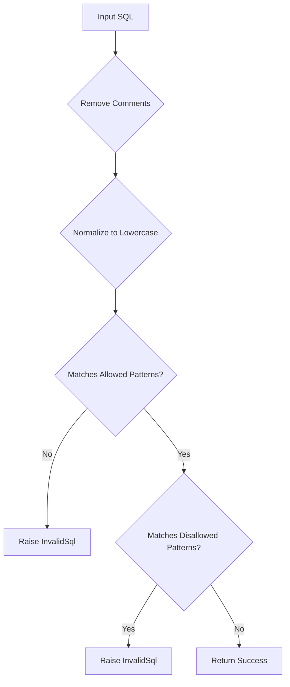

## Examples:
```python
# Valid SELECT statement
validate_sql_select("SELECT * FROM users")

# Invalid - not a SELECT statement  
try:
    validate_sql_select("INSERT INTO users VALUES ('John')")
except InvalidSql:
    print("Invalid SQL: Statement must be a SELECT")

# Invalid - contains disallowed operation
try:
    validate_sql_select("SELECT * FROM users; DELETE FROM users")
except InvalidSql:
    print("Invalid SQL: Contains disallowed operation")
```

## `datasette.utils.__init__.append_querystring` · *function*

## Summary:
Appends a query string to a URL with proper parameter separator handling.

## Description:
Constructs a valid URL by appending a query string to an existing URL, automatically selecting the appropriate separator ("?" or "&") based on whether the URL already contains query parameters. This ensures proper URL formatting when building dynamic queries.

## Args:
    url (str): The base URL to which the query string will be appended
    querystring (str): The query string to append (without leading "?" or "&")

## Returns:
    str: A new URL string with the query string properly appended

## Raises:
    None

## Constraints:
    Preconditions:
        - Both `url` and `querystring` must be strings
        - The `querystring` should not already begin with "?" or "&"
    
    Postconditions:
        - The returned URL will contain exactly one "?" separator if query parameters exist
        - Query parameters will be properly separated by "&" characters

## Side Effects:
    None

## Control Flow:
```mermaid
flowchart TD
    A[Start append_querystring] --> B{Does URL contain "?"?}
    B -- Yes --> C[Set op = "&"]
    B -- No --> D[Set op = "?"]
    C --> E[Return url + op + querystring]
    D --> E
```

## Examples:
    >>> append_querystring("https://example.com", "page=1")
    "https://example.com?page=1"
    
    >>> append_querystring("https://example.com?existing=param", "page=1")
    "https://example.com?existing=param&page=1"
    
    >>> append_querystring("https://example.com?", "page=1")
    "https://example.com?page=1"
```

## `datasette.utils.__init__.path_with_added_args` · *function*

## Summary:
Constructs a new URL path with updated query parameters by adding new arguments and removing specified ones.

## Description:
This utility function modifies a URL's query string by combining existing parameters with new arguments. It removes parameters whose values are None and adds new parameters with non-None values, returning a complete URL path with updated query string.

## Args:
    request: A request object with 'path' and 'query_string' attributes representing the current URL
    args: Either a dictionary mapping parameter names to values, or an iterable of (key, value) tuples containing new parameters to add or modify
    path: Optional string specifying the base path; defaults to request.path if not provided

## Returns:
    str: A URL path string with updated query parameters, formatted as 'path?query_string'

## Raises:
    None explicitly raised

## Constraints:
    Preconditions:
    - request must have 'path' and 'query_string' attributes
    - args must be either a dict or iterable of key-value pairs
    - All keys in args should be strings
    
    Postconditions:
    - Returns a properly formatted URL path with query string
    - Query string parameters are properly encoded using urllib.parse.urlencode

## Side Effects:
    None

## Control Flow:
```mermaid
flowchart TD
    A[Start] --> B{args is dict?}
    B -- Yes --> C[Convert args to items()]
    B -- No --> C
    C --> D[Create args_to_remove set]
    D --> E[Parse existing query string]
    E --> F[Filter out removed params]
    F --> G[Add new non-None params]
    G --> H[Encode combined params]
    H --> I[Format result path]
    I --> J[Return path]
```

## Examples:
    # Adding new parameters to existing URL
    path_with_added_args(request, {'page': 2, 'limit': 10})
    
    # Removing parameters by setting them to None
    path_with_added_args(request, {'sort': None, 'filter': 'active'})
    
    # Using custom path instead of request.path
    path_with_added_args(request, {'page': 1}, '/custom/path')
```

## `datasette.utils.__init__.path_with_removed_args` · *function*

## Summary:
Removes specified query arguments from a URL path and returns the modified path.

## Description:
This function filters query parameters from a URL path by removing specified keys or key-value pairs. It's commonly used in web applications to clean URLs when building navigation links or pagination controls. The function can work with either a request object (using its path and query string) or an explicit path parameter.

## Args:
    request: A request object containing path and query_string attributes
    args: Either a set of query parameter names to remove, or a dictionary mapping parameter names to specific values to remove
    path: Optional explicit path to process instead of using request.path

## Returns:
    str: The URL path with specified query arguments removed

## Raises:
    None explicitly raised

## Constraints:
    Preconditions:
    - request must have path and query_string attributes
    - args must be either a set or dict type
    - If path is provided, it should be a valid URL path string
    
    Postconditions:
    - Returned string is a valid URL path
    - Query parameters matching args criteria are removed
    - Path structure is preserved

## Side Effects:
    None

## Control Flow:
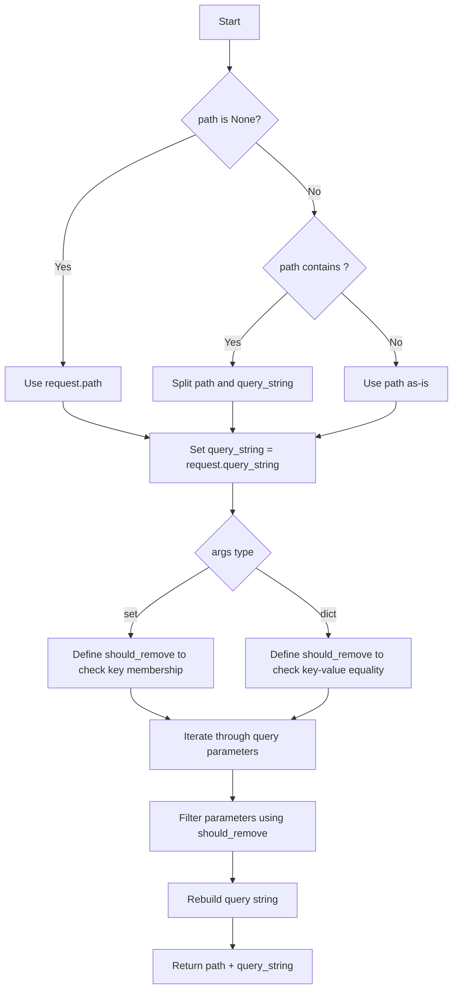

## Examples:
    # Remove specific query parameters by key
    filtered_path = path_with_removed_args(request, {"page", "sort"})
    
    # Remove specific key-value pairs
    filtered_path = path_with_removed_args(request, {"page": "1", "sort": "name"})
    
    # With explicit path
    filtered_path = path_with_removed_args(request, {"filter"}, "/search?q=test&filter=active")
``

## `datasette.utils.__init__.path_with_replaced_args` · *function*

## Summary:
Constructs a URL path with updated query parameters, replacing specified keys while preserving existing ones.

## Description:
This function builds a URL path by combining a base path with updated query parameters. It replaces specified query parameters while preserving all other existing parameters from the request. This utility is commonly used in web applications to modify URL query strings while maintaining navigation context.

## Args:
    request: HTTP request object containing path and query_string attributes
    args: Dictionary or iterable of (key, value) pairs representing query parameters to update or add
    path: Optional string specifying the base path. If None, uses request.path

## Returns:
    str: A URL path string with updated query parameters, formatted as "path?query=value&..."

## Raises:
    None explicitly raised

## Constraints:
    Preconditions:
    - request must have path and query_string attributes
    - args should be either a dictionary or iterable of (key, value) pairs
    - path, if provided, should be a valid URL path string
    
    Postconditions:
    - Returned string is a valid URL path with proper query string formatting
    - Query parameters from args that are None are excluded from the result
    - Existing query parameters not in args are preserved in their original order

## Side Effects:
    None

## Control Flow:
```mermaid
flowchart TD
    A[Start] --> B{args is dict?}
    B -- Yes --> C[Convert args to items()]
    B -- No --> C
    C --> D[Extract keys to replace]
    D --> E[Parse existing query string]
    E --> F[Filter out keys to replace]
    F --> G[Add new args (exclude None values)]
    G --> H[Encode combined parameters]
    H --> I[Format query string prefix]
    I --> J[Return path + query string]
```

## Examples:
    # Basic usage with dict args
    path_with_replaced_args(request, {"page": "2", "sort": "name"})
    
    # Usage with iterable args
    path_with_replaced_args(request, [("page", "2"), ("sort", "name")])
    
    # With custom path
    path_with_replaced_args(request, {"filter": "active"}, "/custom/path")
    
    # Excluding None values
    path_with_replaced_args(request, {"page": "1", "filter": None})
    # Result excludes filter parameter

## `datasette.utils.__init__.escape_css_string` · *function*

## Summary:
Escapes special characters in a string for safe use in CSS contexts by applying Unicode hex escaping to matched characters.

## Description:
This function processes a string to make it safe for use in CSS contexts by escaping special characters that could interfere with CSS parsing. It first normalizes Windows-style line endings (`\r\n`) to Unix-style line endings (`\n`), then applies a regex-based substitution to escape specific characters using Unicode hex escape sequences.

## Args:
    s (str): The input string to escape for CSS usage. Must be a valid string.

## Returns:
    str: A CSS-safe version of the input string where characters matching the internal CSS regex pattern have been escaped using Unicode hex escape sequences (e.g., `\00000A` for newline characters).

## Raises:
    TypeError: If the input parameter `s` is not a string type.

## Constraints:
    Preconditions:
        - Input parameter `s` must be a string type
    Postconditions:
        - All line endings are normalized from CRLF to LF
        - Characters matching the internal CSS regex pattern are escaped as Unicode hex sequences
        - Return value is a valid string containing only printable ASCII and escaped Unicode characters

## Side Effects:
    None: This function is pure and has no side effects.

## Control Flow:
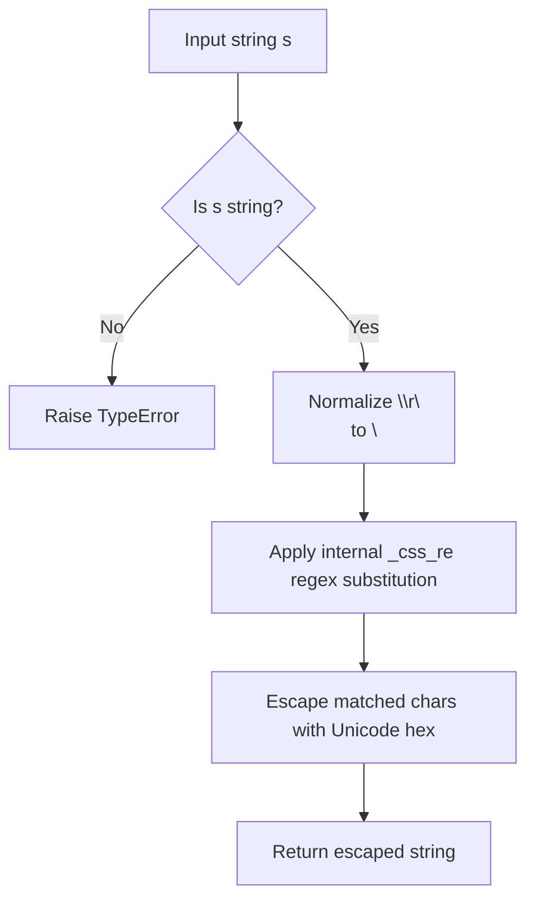

## Examples:
```python
# Basic usage
escaped = escape_css_string("hello world")
# Returns: "hello world"

# With line endings
escaped = escape_css_string("hello\r\nworld")
# Returns: "hello\nworld" (CRLF normalized to LF)

# With special characters (behavior depends on _css_re pattern)
# The exact result depends on what characters match the internal CSS regex
```

## `datasette.utils.__init__.escape_sqlite` · *function*

## Summary:
Escapes SQLite identifiers by wrapping them in square brackets when they fail validation checks.

## Description:
This utility function escapes SQLite identifiers to prevent parsing errors in SQL queries. It implements a conditional escaping mechanism that determines whether an identifier needs to be wrapped in square brackets based on two criteria: whether the identifier matches a specific regex pattern (_boring_keyword_re) AND whether it's not in a set of reserved words. If both conditions are satisfied, the identifier is returned unchanged; otherwise, it is wrapped in square brackets.

## Args:
    s (str): The string to escape, typically representing an SQLite identifier such as a table name or column name.

## Returns:
    str: The escaped string. If the input satisfies both validation criteria (matches boring keyword pattern AND not in reserved words), it's returned unchanged. Otherwise, it's wrapped in square brackets.

## Raises:
    None explicitly raised by this function.

## Constraints:
    Preconditions:
    - Input must be a string
    - Module-level global variables `_boring_keyword_re` (regex pattern) and `reserved_words` must be defined and accessible
    
    Postconditions:
    - The returned string is suitable for use as an SQLite identifier in SQL queries
    - The function provides consistent escaping behavior for identifiers

## Side Effects:
    None

## Control Flow:
```mermaid
flowchart TD
    A[Input string s] --> B{Matches _boring_keyword_re?}
    B -- Yes --> C{s.lower() not in reserved_words?}
    C -- Yes --> D[Return s]
    C -- No --> E[Return [s]]
    B -- No --> E
    D --> F[End]
    E --> F
    F[Output] --> G[Escaped identifier]
```

## Examples:
    # When input satisfies validation criteria
    escape_sqlite("name")  # Returns "name" (assuming "name" matches boring pattern and is not reserved)
    
    # When input fails validation criteria  
    escape_sqlite("select")  # Returns "[select]" (assuming "select" is reserved)
    
    # When input fails first validation criteria
    escape_sqlite("my-table")  # Returns "[my-table]" (assuming "my-table" doesn't match boring pattern)
```

## `datasette.utils.__init__.make_dockerfile` · *function*

## Summary:
Generates a Dockerfile content string for running a Datasette application with configured options and dependencies.

## Description:
This function constructs a complete Dockerfile that can be used to containerize a Datasette application. It configures the base image, copies application files, installs dependencies, sets up environment variables, and defines the command to run the Datasette server with specified options.

## Args:
    files (list[str]): List of SQLite database filenames to be served by Datasette
    metadata_file (str, optional): Path to metadata YAML file for Datasette configuration
    extra_options (str, optional): Additional command-line options to pass to datasette serve
    branch (str, optional): Git branch name to install Datasette from GitHub instead of PyPI
    template_dir (str, optional): Directory containing custom Jinja templates
    plugins_dir (str, optional): Directory containing custom Datasette plugins
    static (list[tuple], optional): List of (mount_point, path) tuples for static file serving
    install (list[str]): Additional packages to install via pip
    spatialite (bool): Whether to enable Spatialite support
    version_note (str, optional): Version note to display in Datasette UI
    secret (str): Secret key for Datasette authentication
    environment_variables (dict[str, str], optional): Additional environment variables to set
    port (int, default=8001): Port number to expose and run Datasette on
    apt_get_extras (list[str], optional): Additional apt packages to install

## Returns:
    str: A formatted Dockerfile content string ready for use in containerization

## Raises:
    None explicitly raised

## Constraints:
    Preconditions:
    - The `secret` parameter must be provided and not empty
    - Files in the `files` parameter should exist in the build context
    - If `branch` is specified, it should be a valid GitHub branch name
    
    Postconditions:
    - Returns a valid Dockerfile content string with proper formatting
    - All required environment variables are set
    - Command arguments are properly quoted for shell execution

## Side Effects:
    None

## Control Flow:
```mermaid
flowchart TD
    A[Start make_dockerfile] --> B[Initialize command array]
    B --> C[Set environment variables]
    C --> D[Process files list]
    D --> E[Add basic datasette serve args]
    E --> F{metadata_file provided?}
    F -->|Yes| G[Add --metadata option]
    G --> H[Add template_dir option]
    H --> I{template_dir provided?}
    I -->|Yes| J[Add --template-dir option]
    J --> K[Add plugins_dir option]
    K --> L{plugins_dir provided?}
    L -->|Yes| M[Add --plugins-dir option]
    M --> N[Add version_note option]
    N --> O{version_note provided?}
    O -->|Yes| P[Add --version-note option]
    P --> Q[Process static mounts]
    Q --> R{static provided?}
    R -->|Yes| S[Add --static options]
    S --> T[Process extra_options]
    T --> U{extra_options provided?}
    U -->|Yes| V[Add extra options to command]
    V --> W[Quote command parts]
    W --> X[Add port argument]
    X --> Y[Build install list]
    Y --> Z{branch specified?}
    Z -->|Yes| AA[Install from GitHub branch]
    AA --> AB[Else install from PyPI]
    AB --> AC[Process spatialite requirements]
    AC --> AD{spatialite enabled?}
    AD -->|Yes| AE[Add spatialite apt packages]
    AE --> AF[Set SQLITE_EXTENSIONS env var]
    AF --> AG[Format Dockerfile template]
    AG --> AH[Return Dockerfile content]
```

## Examples:
```python
# Basic usage with a single database file
dockerfile_content = make_dockerfile(
    files=["data.db"],
    secret="my-secret-key",
    install=[],
    spatialite=False
)

# Advanced usage with multiple configurations
dockerfile_content = make_dockerfile(
    files=["db1.db", "db2.db"],
    metadata_file="metadata.yaml",
    template_dir="templates/",
    plugins_dir="plugins/",
    static=[("/static", "static/")],
    install=["datasette-cluster-map"],
    spatialite=True,
    version_note="Production deployment",
    secret="secure-secret-key",
    port=8080
)
```

## `datasette.utils.__init__.temporary_docker_directory` · *function*

## Summary:
Creates a temporary directory structure containing all necessary files for building a Datasette Docker image, including a generated Dockerfile and configured assets.

## Description:
This generator function prepares a temporary directory workspace with all required files and configurations to build a Datasette Docker image. It creates a structured directory layout with a Dockerfile, metadata configuration, database files, and supporting directories. The function is designed to be used in contexts where Datasette applications need to be containerized, such as deployment to platforms like Now.sh or Docker registries.

The function extracts the complex directory setup and file management logic into a reusable component to avoid duplication and ensure consistent temporary directory creation patterns throughout the codebase.

## Args:
    files (list[str]): List of SQLite database file paths to include in the Docker image
    name (str): Name of the datasette directory within the temporary directory
    metadata (file-like object, optional): File handle containing metadata configuration (JSON/YAML format) - must support .read() method
    extra_options (str, optional): Additional command-line options to pass to datasette serve
    branch (str, optional): Git branch name to install Datasette from GitHub instead of PyPI
    template_dir (str, optional): Path to directory containing custom Jinja templates
    plugins_dir (str, optional): Path to directory containing custom Datasette plugins
    static (list[tuple], optional): List of (mount_point, path) tuples for static file serving
    install (list[str]): Additional pip packages to install in the Docker image
    spatialite (bool): Whether to enable Spatialite support in the Docker image
    version_note (str, optional): Version note to display in Datasette UI
    secret (str): Secret key for Datasette authentication and security
    extra_metadata (dict, optional): Additional metadata key-value pairs to merge with parsed metadata
    environment_variables (dict, optional): Environment variables to set in the Docker image
    port (int, default=8001): Port number to expose and run Datasette on
    apt_get_extras (list[str], optional): Additional apt packages to install in the Docker image

## Returns:
    contextmanager: A context manager that yields a string path to the temporary datasette directory containing all Docker build artifacts

## Raises:
    BadMetadataError: When metadata content cannot be parsed as valid JSON or YAML format
    OSError: When file system operations fail during directory creation, file copying, or linking

## Constraints:
    Preconditions:
    - The `secret` parameter must be provided and not empty
    - All file paths in `files` must exist and be readable
    - If `metadata` is provided, it must be a file-like object that supports .read() method
    - The `name` parameter should be a valid directory name
    - If `template_dir`, `plugins_dir`, or static paths are provided, they must exist and be readable
    
    Postconditions:
    - A temporary directory is created with a subdirectory named according to the `name` parameter
    - The returned directory contains a properly formatted Dockerfile
    - All specified database files are copied or linked to the directory
    - Metadata file is written if provided
    - Template, plugin, and static directories are copied if specified
    - The temporary directory is automatically cleaned up after yielding

## Side Effects:
    - Creates temporary directory structure on the filesystem
    - Changes current working directory during execution
    - Writes Dockerfile and metadata.json to the temporary directory
    - Copies or links files from the host filesystem to the temporary directory
    - Modifies process working directory temporarily

## Control Flow:
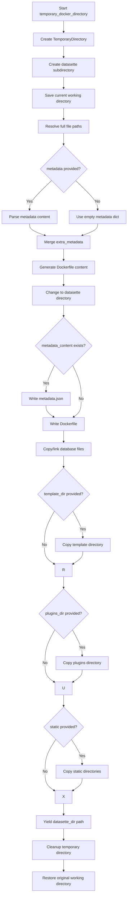

## Examples:
```python
# Basic usage with a single database file
import tempfile
from datasette.utils import temporary_docker_directory

files = ["data.db"]
with temporary_docker_directory(
    files=files,
    name="my-datasette-app",
    metadata=None,
    extra_options="",
    branch=None,
    template_dir=None,
    plugins_dir=None,
    static=[],
    install=[],
    spatialite=False,
    version_note=None,
    secret="my-secret-key"
) as datasette_dir:
    print(f"Docker build context: {datasette_dir}")
    # Use datasette_dir to build Docker image
    # Files will be cleaned up automatically after this block

# Advanced usage with multiple configurations
with temporary_docker_directory(
    files=["db1.db", "db2.db"],
    name="advanced-datasette",
    metadata=open("metadata.yaml"),
    extra_options="--host 0.0.0.0",
    branch=None,
    template_dir="templates/",
    plugins_dir="plugins/",
    static=[("/static", "static/")],
    install=["datasette-cluster-map"],
    spatialite=True,
    version_note="Production deployment",
    secret="secure-secret-key",
    extra_metadata={"title": "My Datasette App"}
) as datasette_dir:
    # Build Docker image from datasette_dir
    # All files and configurations are properly set up
    pass
```

## `datasette.utils.__init__.detect_primary_keys` · *function*

## Summary:
Determines and returns the names of primary key columns for a specified database table.

## Description:
Analyzes column metadata from a SQLite table to identify and extract the names of columns designated as primary keys. This function processes the output of `table_column_details` to filter for primary key columns and returns them in a consistent order.

The function is typically used during database introspection operations when application code needs to understand table schema details, particularly for identifying key columns that uniquely identify records. This logic is extracted into its own function rather than being inlined to provide a clean abstraction layer for primary key detection that can be reused throughout the application.

## Args:
    conn (sqlite3.Connection): An active SQLite database connection object
    table (str): The name of the table to query for primary key information

## Returns:
    list[str]: A list of column names that serve as primary keys for the specified table. Returns an empty list if no primary keys are defined. The list preserves the order of primary key columns as they appear in the table schema, since the sorting operation (by `column.is_pk`) is effectively a no-op.

## Raises:
    sqlite3.Error: When the specified table does not exist or when there are issues executing the underlying PRAGMA queries against the database connection

## Constraints:
    Preconditions:
    - The `conn` parameter must be a valid SQLite database connection
    - The `table` parameter must be a string representing an existing table name
    - The database connection must have appropriate permissions to query the table schema
    
    Postconditions:
    - Returns a list of strings representing primary key column names
    - The returned list maintains the order of primary key columns as they appear in the table schema

## Side Effects:
    None

## Control Flow:
```mermaid
flowchart TD
    A[Start detect_primary_keys] --> B[Call table_column_details(conn, table)]
    B --> C[Filter columns where column.is_pk is True]
    C --> D[Sort primary key columns by column.is_pk (no-op)]
    D --> E[Extract column names from primary key columns]
    E --> F[Return list of primary key column names]
```

## Examples:
    # Basic usage with a table that has primary keys
    import sqlite3
    conn = sqlite3.connect('example.db')
    pk_columns = detect_primary_keys(conn, 'users')
    print(pk_columns)  # Output might be ['id'] or ['id', 'username'] if composite PK
    
    # Usage with a table that has no primary keys
    pk_columns = detect_primary_keys(conn, 'some_table')
    print(pk_columns)  # Output: []

## `datasette.utils.__init__.get_outbound_foreign_keys` · *function*

## Summary:
Extracts outbound foreign key relationships from a SQLite table, filtering out compound foreign keys.

## Description:
Retrieves foreign key constraint information for a given table and returns a simplified list of outbound foreign key relationships. This function specifically filters out compound foreign keys (where multiple columns participate in the same foreign key relationship) by eliminating entries where the foreign key ID is not unique.

## Args:
    conn: A SQLite database connection object
    table (str): Name of the table to query for foreign key information

## Returns:
    list[dict]: A list of dictionaries, each containing:
        - column (str): The local column name that references another table
        - other_table (str): The name of the referenced table
        - other_column (str): The column in the referenced table being referenced

## Raises:
    None explicitly raised - depends on underlying SQLite connection behavior

## Constraints:
    Preconditions:
        - conn must be a valid SQLite database connection
        - table must be a valid table name in the database
    Postconditions:
        - Returns a list of dictionaries describing simple (non-compound) foreign key relationships
        - All returned foreign keys are from the specified table to other tables

## Side Effects:
    - Executes a PRAGMA foreign_key_list SQL query against the database
    - May cause database I/O operations

## Control Flow:
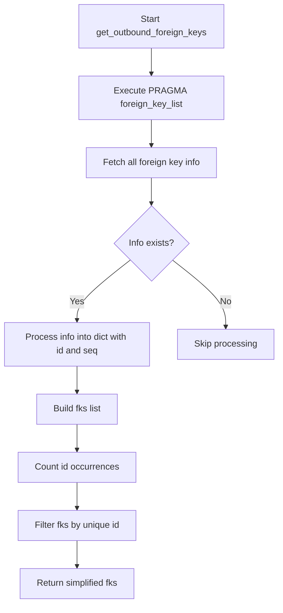

## Examples:
```python
# Basic usage
foreign_keys = get_outbound_foreign_keys(db_connection, "posts")
# Returns [{'column': 'author_id', 'other_table': 'authors', 'other_column': 'id'}, ...]

# With compound foreign keys filtered out
foreign_keys = get_outbound_foreign_keys(db_connection, "orders")
# Returns only simple foreign keys, excluding compound ones
```

## `datasette.utils.__init__.get_all_foreign_keys` · *function*

## Summary:
Collects and organizes all inbound and outbound foreign key relationships for tables in a SQLite database.

## Description:
Analyzes all tables in a SQLite database to identify foreign key relationships, building a comprehensive mapping of incoming and outgoing references between tables. This function processes each table's outbound foreign keys and constructs bidirectional relationship information, making it easy to understand table dependencies and navigation paths.

## Args:
    conn: A SQLite database connection object used to query table and foreign key information

## Returns:
    dict: A dictionary mapping table names to their foreign key relationships with the following structure:
        - Keys: Table names (str)
        - Values: Dictionary objects with two keys:
          - "incoming" (list): Foreign key relationships pointing to this table
          - "outgoing" (list): Foreign key relationships originating from this table
        Each relationship entry is a dictionary with:
        - "other_table" (str): Name of the related table
        - "column" (str): Column name in the current table
        - "other_column" (str): Column name in the related table

## Raises:
    None explicitly raised - depends on underlying SQLite connection behavior

## Constraints:
    Preconditions:
        - conn must be a valid SQLite database connection
    Postconditions:
        - Returns a complete mapping of all tables and their foreign key relationships
        - Incoming and outgoing relationships are properly bidirectionally linked
        - Tables that reference non-existent tables are gracefully handled

## Side Effects:
    - Executes SQL queries against the database to retrieve table names and foreign key information
    - May cause database I/O operations

## Control Flow:
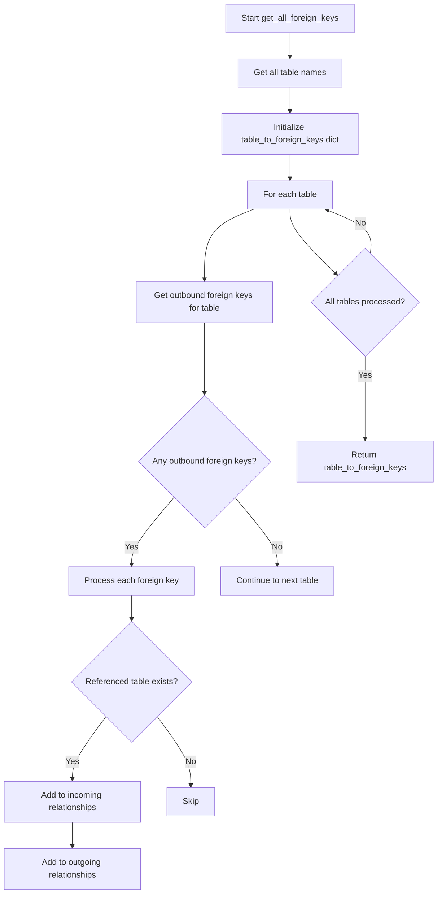

## Examples:
```python
# Basic usage
foreign_keys = get_all_foreign_keys(db_connection)
# Returns {'users': {'incoming': [...], 'outgoing': [...]}, ...}

# Accessing relationships
user_table_fks = foreign_keys['users']
incoming_fks = user_table_fks['incoming']  # Foreign keys pointing to users table
outgoing_fks = user_table_fks['outgoing']  # Foreign keys from users table
```

## `datasette.utils.__init__.detect_spatialite` · *function*

## Summary:
Determines whether a SQLite database has Spatialite extensions enabled by checking for the existence of the geometry_columns table.

## Description:
This function tests if a SQLite database connection has Spatialite support by querying the sqlite_master system table for the presence of a geometry_columns table. Spatialite adds this table to track spatial data columns in databases. The function returns True if Spatialite is detected, False otherwise.

## Args:
    conn: A SQLite database connection object that supports execute() and fetchall() methods

## Returns:
    bool: True if the geometry_columns table exists (indicating Spatialite is available), False otherwise

## Raises:
    None explicitly raised, but may raise exceptions from the underlying database connection if the connection is invalid or the query fails

## Constraints:
    Preconditions:
        - The conn parameter must be a valid SQLite database connection object
        - The connection must be open and functional
    Postconditions:
        - The function returns a boolean value without modifying the database state
        - The database connection remains open after the function call

## Side Effects:
    - Executes a read-only SQL query against the database
    - May cause a brief database I/O operation during query execution

## Control Flow:
```mermaid
flowchart TD
    A[Start detect_spatialite] --> B[Execute SQL query]
    B --> C{Rows returned?}
    C -->|Yes| D[Return True]
    C -->|No| E[Return False]
```

## Examples:
```python
# Check if a database has Spatialite support
import sqlite3
conn = sqlite3.connect('my_database.db')
has_spatialite = detect_spatialite(conn)
if has_spatialite:
    print("Spatialite is available")
else:
    print("Spatialite not available")
```

## `datasette.utils.__init__.detect_fts` · *function*

## Summary:
Detects if a SQLite table has a corresponding Full Text Search (FTS) table by checking for the existence of a table named "{table}_fts".

## Description:
This utility function checks whether a given table in a SQLite database has an associated Full Text Search table. It first verifies that the original table exists, then looks for a table with the naming convention "{table}_fts" which is the standard pattern for SQLite FTS tables. This function is used internally by Datasette to determine if search capabilities are available for a particular table.

## Args:
    conn: sqlite3.Connection
        A SQLite database connection object used to execute queries against the database schema.
    table: str
        The name of the original table to check for FTS table correspondence.

## Returns:
    str or None
        Returns the name of the FTS table (formatted as "{table}_fts") if both the original table and FTS table exist, otherwise returns None.

## Raises:
    None explicitly raised, but may raise sqlite3 exceptions if the connection is invalid or queries fail.

## Constraints:
    Preconditions:
        - The conn parameter must be a valid SQLite connection object
        - The table parameter must be a string containing a valid table name
    Postconditions:
        - Function returns either a string (FTS table name) or None
        - No modifications are made to the database

## Side Effects:
    - Executes SQL queries against the SQLite database
    - Reads from the sqlite_master table (schema inspection)
    - No writes or modifications to the database

## Control Flow:
```mermaid
flowchart TD
    A[Start detect_fts] --> B{Original table exists?}
    B -- Yes --> C[Construct FTS table name]
    C --> D{FTS table exists?}
    D -- Yes --> E[Return FTS table name]
    D -- No --> F[Return None]
    B -- No --> G[Return None]
    E --> H[End]
    F --> H
    G --> H
```

## Examples:
    # Check if 'my_table' has an FTS table
    fts_table = detect_fts(db_connection, 'my_table')
    if fts_table:
        print(f"Found FTS table: {fts_table}")
    else:
        print("No FTS table found")

## `datasette.utils.__init__.detect_fts_sql` · *function*

## Summary:
Generates a SQL query to detect Full Text Search (FTS) virtual tables in SQLite databases.

## Description:
This function creates a SQL query that searches the sqlite_master table to identify virtual tables that use Full Text Search (FTS) functionality. The query looks for tables with specific patterns in their SQL definition that indicate FTS usage, including various content specification formats. This utility is used internally by Datasette to identify FTS-enabled tables when processing database metadata.

## Args:
    table (str): The name of the table to search for FTS usage. Single quotes in the table name are properly escaped to prevent SQL injection.

## Returns:
    str: A formatted SQL query string that can be executed against an SQLite database to find FTS virtual tables matching the specified table name.

## Raises:
    AttributeError: If the `table` parameter does not have a `replace` method (i.e., if it's not a string-like object).

## Constraints:
    Preconditions:
        - The input `table` parameter should be string-like (supporting the `replace` method)
        - The function assumes the target database uses SQLite with FTS support
    
    Postconditions:
        - The returned SQL query is properly formatted with the table name inserted
        - All single quotes in the table name are escaped to prevent SQL injection
        - The query follows SQLite FTS pattern matching conventions

## Side Effects:
    None: This function has no side effects. It only constructs and returns a SQL query string.

## Control Flow:
```mermaid
flowchart TD
    A[Input table name] --> B[Escape single quotes]
    B --> C[Format SQL template]
    C --> D[Return SQL query]
```

## Examples:
```python
# Basic usage to detect FTS tables
sql_query = detect_fts_sql("documents")
print(sql_query)
# Returns SQL that searches for FTS tables named "documents"

# With table name containing single quotes
sql_query = detect_fts_sql("my'table")
# Escapes the single quote properly to avoid SQL errors

# Typical usage in Datasette context
fts_query = detect_fts_sql("search_index")
# Used internally to identify FTS-enabled search indexes
```

## `datasette.utils.__init__.detect_json1` · *function*

## Summary:
Determines whether the SQLite database connection supports the JSON1 extension by attempting to execute a JSON-related SQL statement.

## Description:
This utility function tests if a SQLite database connection has JSON1 extension support by executing a basic JSON operation. It's commonly used to conditionally enable JSON-related features in Datasette's database operations. The function creates an in-memory database connection if none is provided, making it suitable for testing JSON support without requiring an existing database connection.

## Args:
    conn (sqlite3.Connection, optional): An existing SQLite database connection. If None, a new in-memory connection is created. Defaults to None.

## Returns:
    bool: True if the SQLite connection supports JSON1 extension (the json('{}') statement executes successfully), False otherwise.

## Raises:
    Exception: Any exception that might occur during SQLite execution or connection creation is caught and results in a False return value.

## Constraints:
    Preconditions:
        - The function can be called with or without an existing database connection
        - If a connection is provided, it must be a valid SQLite connection object
    
    Postconditions:
        - The function always returns a boolean value (True or False)
        - No modifications are made to the database state

## Side Effects:
    - Creates an in-memory SQLite database connection if none is provided
    - Executes a SQL statement against the database connection
    - May cause temporary database resource allocation

## Control Flow:
```mermaid
flowchart TD
    A[Start detect_json1] --> B{conn is None?}
    B -- Yes --> C[Create in-memory connection]
    B -- No --> D[Use provided connection]
    C --> E[Try SELECT json('{}')]
    D --> E
    E --> F{Execute succeeds?}
    F -- Yes --> G[Return True]
    F -- No --> H[Return False]
    G --> I[End]
    H --> I
```

## Examples:
```python
# Check JSON1 support with default in-memory connection
has_json_support = detect_json1()
print(has_json_support)  # True or False

# Check JSON1 support with existing connection
import sqlite3
conn = sqlite3.connect('example.db')
supports_json = detect_json1(conn)
print(supports_json)  # True or False
```

## `datasette.utils.__init__.table_columns` · *function*

## Summary:
Retrieves the names of all columns in a specified SQLite table by extracting column names from detailed column metadata.

## Description:
Fetches column names from a SQLite database table by leveraging the `table_column_details` utility function to retrieve full column metadata and then extracting just the name field from each column. This function provides a simplified interface for accessing table column names while maintaining compatibility with both modern and legacy SQLite versions.

The function is typically called during database introspection operations when application code needs quick access to column names for display, validation, or processing purposes. It's commonly used in Datasette's internal systems for rendering table views and managing database metadata.

This logic is extracted into its own function rather than being inlined because it provides a clean abstraction layer that separates the concern of column name extraction from the complexity of column metadata retrieval, making it reusable across different parts of the application.

## Args:
    conn (sqlite3.Connection): An active SQLite database connection object
    table (str): The name of the table to query for column names

## Returns:
    list[str]: A list of column names (as strings) for the specified table, ordered according to column position in the table

## Raises:
    sqlite3.Error: When the specified table does not exist or when there are issues executing the PRAGMA commands against the database connection

## Constraints:
    Preconditions:
    - The `conn` parameter must be a valid SQLite database connection
    - The `table` parameter must be a string representing an existing table name
    - The database connection must have appropriate permissions to query the table schema
    
    Postconditions:
    - Returns a list of column names in the same order as they appear in the table
    - The returned list is empty if the table has no columns

## Side Effects:
    None

## Control Flow:
```mermaid
flowchart TD
    A[Start table_columns] --> B[Call table_column_details(conn, table)]
    B --> C[Iterate through Column objects]
    C --> D[Extract column.name for each Column]
    D --> E[Return list of column names]
```

## Examples:
    # Basic usage with a valid table
    import sqlite3
    conn = sqlite3.connect('example.db')
    columns = table_columns(conn, 'users')
    print(columns)  # Output: ['id', 'username', 'email', 'created_at']
    
    # Handling non-existent table
    try:
        columns = table_columns(conn, 'nonexistent_table')
    except sqlite3.Error as e:
        print(f"Database error: {e}")

## `datasette.utils.__init__.table_column_details` · *function*

## Summary:
Retrieves detailed column information for a specified SQLite table, supporting both modern and legacy SQLite versions.

## Description:
Fetches comprehensive column metadata from a SQLite database table using appropriate PRAGMA commands based on SQLite version compatibility. This function serves as a unified interface for accessing column details regardless of the underlying SQLite version, automatically selecting between `PRAGMA table_xinfo()` (for SQLite 3.26.0+) and `PRAGMA table_info()` (for older versions).

The function is typically called during database introspection operations when schema information is needed for display, validation, or processing purposes. It's commonly used in Datasette's internal systems for rendering table views and managing database metadata.

This logic is extracted into its own function rather than being inlined to provide version compatibility abstraction and encapsulate the complexity of choosing between different SQLite pragma commands.

## Args:
    conn (sqlite3.Connection): An active SQLite database connection object
    table (str): The name of the table to query for column information

## Returns:
    list[Column]: A list of Column namedtuples containing detailed metadata for each column in the specified table. The Column namedtuple structure varies based on SQLite version:
    - For SQLite 3.26.0+: Contains fields returned by `PRAGMA table_xinfo()` including column ID, name, type, not null constraint, default value, and hidden flag
    - For older versions: Contains fields returned by `PRAGMA table_info()` plus an additional hidden flag set to 0 for all columns

## Raises:
    sqlite3.Error: When the specified table does not exist or when there are issues executing the PRAGMA commands against the database connection

## Constraints:
    Preconditions:
    - The `conn` parameter must be a valid SQLite database connection
    - The `table` parameter must be a string representing an existing table name
    - The database connection must have appropriate permissions to query the table schema
    
    Postconditions:
    - Returns a list of Column objects with consistent structure for the given SQLite version
    - The returned list is ordered according to column position in the table

## Side Effects:
    None

## Control Flow:
```mermaid
flowchart TD
    A[Start table_column_details] --> B{supports_table_xinfo()?}
    B -- Yes --> C[Execute PRAGMA table_xinfo()]
    B -- No --> D[Execute PRAGMA table_info()]
    C --> E[Create Column objects from table_xinfo results]
    D --> E
    E --> F[Return list of Column objects]
```

## Examples:
    # Basic usage with a valid table
    import sqlite3
    conn = sqlite3.connect('example.db')
    columns = table_column_details(conn, 'users')
    for col in columns:
        print(f"Column: {col.name}, Type: {col.type}")
    
    # Error handling for non-existent table
    try:
        columns = table_column_details(conn, 'nonexistent_table')
    except sqlite3.Error as e:
        print(f"Database error: {e}")
```

## `datasette.utils.__init__.filters_should_redirect` · *function*

## Summary:
Processes special filter arguments and generates redirect parameter tuples for URL rewriting.

## Description:
Transforms legacy filter argument formats (_filter_column, _filter_op, _filter_value) and multi-filter formats (_filter_column_1, _filter_op_1, _filter_value_1) into standardized parameter tuples suitable for URL redirection. This function extracts filter information from special arguments and prepares them for proper routing or redirection logic. The function depends on a global regex pattern `filter_column_re` to identify multi-filter column keys.

## Args:
    special_args (dict): Dictionary containing special filter arguments such as _filter_column, _filter_op, _filter_value, and their numbered variants.

## Returns:
    list[tuple[str, str or None]]: List of parameter tuples in the form (parameter_name, parameter_value) where parameter_value can be None to indicate removal of parameters. Each tuple represents either a new parameter to add or an old parameter to remove.

## Raises:
    None explicitly raised

## Constraints:
    Preconditions:
    - Input special_args should be a dictionary-like object
    - Filter operations may contain "__" separator for compound operations
    - A global regex pattern `filter_column_re` must be defined and accessible
    
    Postconditions:
    - Returns a list of tuples representing parameters to redirect or remove
    - All returned tuples follow the format (param_name, param_value)
    - For compound operations, the "__" separator is split into operation and value components

## Side Effects:
    None

## Control Flow:
```mermaid
flowchart TD
    A[Start filters_should_redirect] --> B{Has _filter_column?}
    B -- Yes --> C[Extract filter_op, filter_value]
    B -- No --> D[Skip single filter processing]
    C --> E{Has __ in filter_op?}
    E -- Yes --> F[Split filter_op, filter_value at first __]
    E -- No --> G[Continue with original values]
    F --> H[Add (column__op, value) to redirect_params]
    G --> H
    H --> I[Add (_filter_column, None) to redirect_params]
    I --> J[Add (_filter_op, None) to redirect_params]
    J --> K[Add (_filter_value, None) to redirect_params]
    K --> L[Find column_keys with filter_column_re]
    L --> M{Any column_keys?}
    M -- Yes --> N[Process each column_key]
    N --> O[Extract number from column_key]
    O --> P[Get column, op, value]
    P --> Q{Has __ in op?}
    Q -- Yes --> R[Split op, value at first __]
    Q -- No --> S[Continue with original values]
    R --> T[Add (column__op, value) to redirect_params]
    S --> T
    T --> U[Add (_filter_column_n, None) to redirect_params]
    U --> V[Add (_filter_op_n, None) to redirect_params]
    V --> W[Add (_filter_value_n, None) to redirect_params]
    W --> X[Return redirect_params]
    M -- No --> X
```

## Examples:
    >>> filters_should_redirect({
    ...     "_filter_column": "name",
    ...     "_filter_op": "exact",
    ...     "_filter_value": "John"
    ... })
    [('name__exact', 'John'), ('_filter_column', None), ('_filter_op', None), ('_filter_value', None)]
    
    >>> filters_should_redirect({
    ...     "_filter_column_1": "category",
    ...     "_filter_op_1": "contains",
    ...     "_filter_value_1": "tech"
    ... })
    [('category__contains', 'tech'), ('_filter_column_1', None), ('_filter_op_1', None), ('_filter_value_1', None)]
    
    >>> filters_should_redirect({
    ...     "_filter_column": "status",
    ...     "_filter_op": "startswith__prefix",
    ...     "_filter_value": ""
    ... })
    [('status__startswith', 'prefix'), ('_filter_column', None), ('_filter_op', None), ('_filter_value', None)]

## `datasette.utils.__init__.is_url` · *function*

## Summary:
Validates whether a string is a properly formatted HTTP or HTTPS URL without whitespace.

## Description:
This function performs strict validation on a string to determine if it constitutes a valid URL starting with "http://" or "https://". It ensures the URL contains no whitespace characters and is exactly a URL with no additional content. This validation is commonly used in Datasette to sanitize user-provided URLs before processing them.

## Args:
    value (Any): The value to validate as a URL. Expected to be a string.

## Returns:
    bool: True if the value is a string that starts with "http://" or "https://" and contains no whitespace; False otherwise.

## Raises:
    None: This function does not raise any exceptions.

## Constraints:
    Preconditions:
    - The input value must be hashable (since isinstance check is performed)
    
    Postconditions:
    - Returns boolean value indicating URL validity
    - Input value is not modified

## Side Effects:
    None: This function has no side effects.

## Control Flow:
```mermaid
flowchart TD
    A[Start is_url()] --> B{Is value a string?}
    B -- No --> C[Return False]
    B -- Yes --> D{Starts with http://?}
    D -- No --> E[Return False]
    D -- Yes --> F{Starts with https://?}
    F -- No --> G[Return False]
    F -- Yes --> H{Contains whitespace?}
    H -- Yes --> I[Return False]
    H -- No --> J[Return True]
```

## Examples:
    >>> is_url("http://example.com")
    True
    >>> is_url("https://example.com/path")
    True
    >>> is_url("http://example.com with space")
    False
    >>> is_url("ftp://example.com")
    False
    >>> is_url(123)
    False
    >>> is_url("https://example.com")
    True
```

## `datasette.utils.__init__.to_css_class` · *function*

## Summary:
Converts a string into a valid CSS class identifier by sanitizing invalid characters and ensuring uniqueness.

## Description:
Transforms arbitrary strings (such as table names) into valid CSS class names that can be safely used in HTML/CSS. When the input string matches a predefined validation pattern for CSS classes, it is returned unchanged. Otherwise, the string is processed to remove invalid characters, normalize whitespace, and append a 6-character MD5 hash suffix to ensure uniqueness.

This function centralizes CSS class generation logic, providing a consistent approach to converting potentially problematic strings into valid CSS identifiers while maintaining backward compatibility for already-valid inputs.

## Args:
    s (str): Input string to convert into a CSS class name. Must be a valid string.

## Returns:
    str: A valid CSS class name derived from the input string. If the input matches the internal CSS class validation pattern, it's returned unchanged. Otherwise, it returns a sanitized version with an MD5 suffix appended.

## Raises:
    None explicitly raised

## Constraints:
    Preconditions:
    - Input must be a string
    - Input should not be None
    
    Postconditions:
    - Return value is always a valid CSS class name according to internal validation rules
    - Return value is unique for different inputs (with high probability due to MD5 suffix)
    - Return value contains only valid CSS class characters

## Side Effects:
    None

## Control Flow:
```mermaid
flowchart TD
    A[Input string s] --> B{Matches internal CSS class pattern?}
    B -- Yes --> C[Return s]
    B -- No --> D[Generate 6-char MD5 suffix]
    D --> E[Strip leading _ and -]
    E --> F[Replace whitespace with -]
    F --> G[Remove invalid characters]
    G --> H[Join with MD5 suffix]
    H --> I[Return result]
```

## Examples:
    >>> to_css_class("valid-class")
    'valid-class'
    
    >>> to_css_class("table_name")
    'table-name-a1b2c3'
    
    >>> to_css_class("invalid-class-name")
    'invalid-class-name-d4e5f6'
```

## `datasette.utils.__init__.link_or_copy` · *function*

## Summary:
Attempts to create a hard link between two files, falling back to copying if linking fails.

## Description:
This utility function is designed for populating temporary directories by creating hard links when possible, which saves disk space and preserves file metadata. When the source and destination are on different filesystems, hard linking fails with an OSError, so the function gracefully falls back to copying the file instead. This approach optimizes performance while maintaining compatibility across different storage configurations.

## Args:
    src (str): Path to the source file to be linked or copied
    dst (str): Path to the destination file where the link/copy will be created

## Returns:
    None: This function does not return any value

## Raises:
    OSError: Raised when both hard linking and file copying operations fail, though typically the fallback to copying handles most failure cases

## Constraints:
    Preconditions:
    - The source file must exist and be readable
    - The parent directory of the destination must exist and be writable
    - The destination file must not already exist (or the behavior is undefined)
    
    Postconditions:
    - The destination file will exist and contain the same data as the source file
    - If successful, the destination will be a hard link to the source (same inode) when possible

## Side Effects:
    - Creates a file at the destination path
    - May modify filesystem state through file creation operations
    - No external state mutations or service calls

## Control Flow:
```mermaid
flowchart TD
    A[Start link_or_copy] --> B{os.link() succeeds?}
    B -- Yes --> C[Return (hard link created)]
    B -- No --> D[shutil.copyfile() called]
    D --> E[Return (file copied)]
```

## Examples:
```python
# Basic usage for temporary directory population
link_or_copy("/path/to/source.txt", "/tmp/destination.txt")

# Usage in a temporary directory context
import tempfile
with tempfile.TemporaryDirectory() as tmpdir:
    src_path = "/some/real/file.txt"
    dst_path = os.path.join(tmpdir, "copied_file.txt")
    link_or_copy(src_path, dst_path)
```

## `datasette.utils.__init__.link_or_copy_directory` · *function*

## Summary:
Attempts to efficiently copy a directory tree by creating hard links when possible, falling back to regular copying if hard linking fails.

## Description:
This utility function provides an efficient way to copy directory trees by first attempting to create hard links between files in the source and destination directories. This approach saves disk space and is faster than copying when the source and destination are on the same filesystem. If hard linking fails (typically due to cross-device restrictions), it gracefully falls back to regular file copying.

The function is designed to be used internally by Datasette for efficiently managing file operations, particularly when dealing with large directory structures that need to be duplicated or moved.

## Args:
    src (str): Path to the source directory to be copied
    dst (str): Path to the destination directory where files will be copied

## Returns:
    None: This function does not return any value

## Raises:
    OSError: When the copy operation fails completely, either during the hard link attempt or the fallback copy operation

## Constraints:
    Preconditions:
    - The source directory must exist and be readable
    - The destination directory path must be writable
    - Both paths must be valid directory paths
    
    Postconditions:
    - The destination directory will contain a copy of all files from the source directory
    - If hard linking succeeds, the files will share inode references (space efficient)
    - If hard linking fails, the files will be copied normally

## Side Effects:
    - Creates files and directories in the destination path
    - May modify filesystem metadata (timestamps, permissions)
    - Writes to the filesystem

## Control Flow:
```mermaid
flowchart TD
    A[Start link_or_copy_directory] --> B{Try hard link copy with os.link}
    B -->|Success| C[Return None]
    B -->|OSError| D[Retry with regular copy]
    D --> E{Copy succeeds}
    E -->|Yes| F[Return None]
    E -->|No| G[Propagate OSError]
```

## Examples:
```python
# Basic usage
link_or_copy_directory('/path/to/source', '/path/to/destination')

# This will create hard links when possible, or copy files when hard linking fails
```

## `datasette.utils.__init__.module_from_path` · *function*

## Summary:
Dynamically creates and loads a Python module from a file path.

## Description:
Creates a new Python module instance from a file located at the specified path, executes the file's code within the module's namespace, and returns the loaded module. This function enables dynamic loading of Python modules without requiring them to be in the Python path or installed as packages.

## Args:
    path (str): Absolute or relative file system path to the Python file to load.
    name (str): Name to assign to the created module object.

## Returns:
    types.ModuleType: A module object containing the code and definitions from the specified file.

## Raises:
    FileNotFoundError: When the specified file path does not exist.
    SyntaxError: When the file contains invalid Python syntax.
    Exception: Any exception that occurs during execution of the file's code.

## Constraints:
    Preconditions:
        - The path argument must point to a valid existing file.
        - The file must contain valid Python code.
        - The name argument must be a valid string identifier for a module.
    
    Postconditions:
        - A new module object is returned with its __file__ attribute set to the provided path.
        - The module's namespace contains all definitions from the loaded file.

## Side Effects:
    - Reads from the file system at the specified path.
    - Executes arbitrary Python code from the loaded file.
    - May modify global state if the loaded file contains side effects.

## Control Flow:
```mermaid
flowchart TD
    A[Start module_from_path] --> B{File exists?}
    B -- No --> C[raise FileNotFoundError]
    B -- Yes --> D[Create ModuleType with name]
    D --> E[Open file at path]
    E --> F[Read file content]
    F --> G[Compile code with dont_inherit=True]
    G --> H[Execute code in module.__dict__]
    H --> I[Return module]
```

## Examples:
```python
# Load a configuration module
config_module = module_from_path("/path/to/config.py", "config")
value = config_module.some_setting

# Load a plugin module
plugin_module = module_from_path("./plugins/my_plugin.py", "my_plugin")
plugin_module.initialize()
```

## `datasette.utils.__init__.path_with_format` · *function*

## Summary:
Constructs a URL path with format extension and merges query parameters.

## Description:
This utility function builds a URL path that includes a format extension (such as .json or .csv) and properly handles merging of query parameters. It's commonly used in web applications to generate URLs for different output formats while preserving existing query string parameters.

The function accepts either a request object (with path and query_string attributes) or a direct path string, processes format extensions according to specified rules, and returns a properly formatted URL.

## Args:
    request (object, optional): HTTP request object containing 'path' and 'query_string' attributes. Defaults to None.
    path (str, optional): Direct path string to process. Must be provided if request is None. Defaults to None.
    format (str, optional): Format extension to append to the path (e.g., 'json', 'csv'). Defaults to None.
    extra_qs (dict, optional): Additional query parameters to merge with existing ones. Defaults to None.
    replace_format (str, optional): Format extension to remove from the path before adding the new format. Defaults to None.

## Returns:
    str: A properly formatted URL path with format extension and merged query parameters.

## Raises:
    None explicitly raised.

## Constraints:
    Preconditions:
    - Either request or path must be provided (mutually exclusive)
    - When replace_format is provided, it should match the format extension at the end of the path
    - format parameter should be a valid string representing a file extension
    
    Postconditions:
    - The returned path will always contain a valid format extension if format is provided
    - Query parameters are properly encoded and merged
    - The path maintains proper URL formatting with '?' separator for query strings

## Side Effects:
    None.

## Control Flow:
```mermaid
flowchart TD
    A[Start path_with_format] --> B{request provided?}
    B -- Yes --> C[Set path = request.path]
    B -- No --> D[Set path = path parameter]
    C --> E{replace_format provided AND path ends with .replace_format?}
    D --> E
    E -- Yes --> F[Remove .replace_format from path]
    E -- No --> G[Continue with path]
    G --> H{period in path?}
    H -- Yes --> I[Add _format to qs]
    H -- No --> J[Append .format to path]
    I --> K[Check if qs not empty]
    J --> K
    K -- Yes --> L[Encode qs and merge with existing query_string]
    K -- No --> M{request and request.query_string?}
    L --> N[Return path with merged query]
    M -- Yes --> O[Append existing query_string to path]
    M -- No --> P[Return path]
    O --> N
    P --> N
```

## Examples:
    # Basic usage with format extension
    result = path_with_format(path="/data", format="json")
    # Returns: "/data.json"
    
    # Usage with existing query parameters
    result = path_with_format(request=request_obj, format="csv")
    # Returns: "/data.csv?existing_param=value"
    
    # Usage with extra query parameters
    result = path_with_format(path="/search", format="json", extra_qs={"limit": "10"})
    # Returns: "/search.json?limit=10"
    
    # Usage with format replacement
    result = path_with_format(path="/data.csv", format="json", replace_format="csv")
    # Returns: "/data.json"
```

## `datasette.utils.__init__.CustomRow` · *class*

## Summary:
A dictionary-like container that provides both index-based and key-based access to row data, mimicking sqlite3.Row behavior.

## Description:
The CustomRow class extends OrderedDict to provide flexible access patterns for database row data. It allows accessing values using either column indices (integers) or column names (strings), making it compatible with both positional and named access patterns commonly used in database operations. This class is particularly useful when working with database query results where column information is available alongside the data.

## State:
- columns: list of column names in order, type=list[str], valid range=all column names in the row
- values: dictionary of column-value pairs, type=dict, valid range=any valid key-value pairs matching the column schema

## Lifecycle:
- Creation: Instantiate with columns list and optional values dict
- Usage: Access elements via __getitem__ using either integer indices or string column names
- Destruction: Inherits standard OrderedDict cleanup behavior

## Method Map:
```mermaid
graph TD
    A[CustomRow.__init__] --> B[CustomRow.__getitem__]
    A --> C[CustomRow.__iter__]
    B --> D[OrderedDict.__getitem__]
    C --> E[CustomRow.__getitem__]
```

## Raises:
- None explicitly raised by __init__ or __getitem__
- May raise KeyError from parent OrderedDict methods when accessing non-existent keys

## Example:
```python
# Create a CustomRow with column names and values
columns = ['id', 'name', 'email']
values = {'id': 1, 'name': 'Alice', 'email': 'alice@example.com'}
row = CustomRow(columns, values)

# Access by key (string)
name = row['name']  # Returns 'Alice'

# Access by index (integer)
id_value = row[0]   # Returns 1

# Iterate over values
for value in row:
    print(value)  # Prints 1, 'Alice', 'alice@example.com'
```

### `datasette.utils.__init__.CustomRow.__init__` · *method*

## Summary:
Initializes a CustomRow instance with column definitions and optional data values.

## Description:
Constructs a CustomRow object that provides flexible access to database row data through both index-based and key-based lookup mechanisms. This method sets up the internal column structure and optionally populates the row with initial values.

## Args:
    columns (list[str]): A list of column names defining the structure of this row
    values (dict[str, Any], optional): A dictionary mapping column names to their corresponding values. Defaults to None.

## Returns:
    None: This method initializes the object state and returns nothing.

## Raises:
    None explicitly raised by this method.

## State Changes:
    Attributes READ: None
    Attributes WRITTEN: 
    - self.columns: Set to the provided columns parameter
    - self.values: Updated with provided values via self.update() call

## Constraints:
    Preconditions:
    - columns must be a list of strings representing valid column names
    - values, if provided, must be a dictionary mapping column names to their values
    - All keys in values must correspond to entries in columns list
    
    Postconditions:
    - self.columns is set to the provided columns parameter
    - If values are provided, the row contains the specified data values
    - The object maintains internal consistency for column-based access

## Side Effects:
    None: This method performs no I/O operations or external service calls.

### `datasette.utils.__init__.CustomRow.__getitem__` · *method*

## Summary:
Retrieves a value from the row using either column index or column name as key.

## Description:
Provides dual access mechanism for row data, supporting both positional indexing and named access. When an integer is provided as key, it retrieves the value at that position using the associated column names. When a string is provided, it retrieves the value by column name directly.

## Args:
    key (int or str): Column index (integer) or column name (string) to retrieve value for

## Returns:
    Any: Value associated with the specified column index or name

## Raises:
    KeyError: When the specified column name doesn't exist in the row
    IndexError: When the specified column index is out of bounds

## State Changes:
    Attributes READ: self.columns
    Attributes WRITTEN: None

## Constraints:
    Preconditions: 
    - If key is an integer, it must be within the valid range [0, len(self.columns))
    - If key is a string, it must correspond to an existing column name in self.columns
    Postconditions: 
    - Returns the value associated with the requested column
    - Does not modify the row's state

## Side Effects:
    None

### `datasette.utils.__init__.CustomRow.__iter__` · *method*

## Summary:
Returns an iterator that yields values from the row in column order.

## Description:
This method enables iteration over the row's values in the same order as the columns. It's designed to work with the CustomRow class which provides both index-based and key-based access to row data. The iterator follows the column ordering defined in the row's `columns` attribute, making it suitable for scenarios where you need to process all values in a consistent order.

## Args:
    None

## Returns:
    generator: A generator that yields values from the row in column order, maintaining the same sequence as defined in self.columns

## Raises:
    KeyError: When a column name in self.columns does not exist as a key in the underlying OrderedDict
    IndexError: When accessing a column by index would result in an out-of-bounds error

## State Changes:
    Attributes READ: self.columns
    Attributes WRITTEN: None

## Constraints:
    Preconditions:
    - The `self.columns` attribute must be iterable and contain valid column names
    - Each column name in `self.columns` must exist as a key in the underlying OrderedDict
    - The underlying OrderedDict must support the key-based lookup operations
    Postconditions:
    - The generator yields values in the same order as `self.columns`
    - The row's state remains unchanged

## Side Effects:
    None

## `datasette.utils.__init__.value_as_boolean` · *function*

## Summary:
Converts string representations of boolean values into Python boolean objects.

## Description:
Transforms common string representations of boolean values ("on", "off", "true", "false", "1", "0") into their corresponding Python boolean equivalents (True or False). This utility function provides a standardized way to parse boolean-like strings from configuration files, URL parameters, or user input.

The function is extracted into its own utility to centralize boolean parsing logic and ensure consistent behavior across the application. It prevents implicit type conversions that could lead to unexpected results by requiring explicit boolean string representations.

## Args:
    value (str): A string representing a boolean value. Must be one of "on", "off", "true", "false", "1", "0" (case-insensitive). The function will call .lower() on this value.

## Returns:
    bool: True for values "on", "true", or "1"; False for values "off", "false", or "0".

## Raises:
    ValueAsBooleanError: When the input value is not one of the recognized boolean string representations.

## Constraints:
    Preconditions:
        - Input value must be convertible to string (typically a string)
        - Input value must be one of the supported boolean string representations
    
    Postconditions:
        - Returns a Python boolean object (True or False)
        - Raises ValueAsBooleanError for invalid inputs

## Side Effects:
    None

## Control Flow:
```mermaid
flowchart TD
    A[Input value] --> B{Is value in valid set?}
    B -- No --> C[raise ValueAsBooleanError]
    B -- Yes --> D[value.lower() in ("on", "true", "1")?]
    D -- Yes --> E[return True]
    D -- No --> F[return False]
```

## Examples:
```python
# Valid conversions
value_as_boolean("true")   # Returns: True
value_as_boolean("1")      # Returns: True
value_as_boolean("off")    # Returns: False
value_as_boolean("false")  # Returns: False

# Case insensitive
value_as_boolean("TRUE")   # Returns: True
value_as_boolean("FALSE")  # Returns: False

# Invalid input raises exception
value_as_boolean("maybe")  # Raises: ValueAsBooleanError
```

## `datasette.utils.__init__.ValueAsBooleanError` · *class*

## Summary:
Represents an error that occurs when attempting to convert a value to a boolean representation.

## Description:
A custom exception type that extends ValueError, specifically designed to indicate when a conversion from a non-boolean value to a boolean fails. This exception is raised when code attempts to interpret a value as a boolean but encounters an incompatible type or invalid string representation that cannot be meaningfully converted to True or False.

## State:
This class has no instance attributes beyond those inherited from ValueError. It serves purely as an exception type marker.

## Lifecycle:
- Creation: Instantiated like any standard exception, typically with `raise ValueAsBooleanError("message")`
- Usage: Raised by functions that attempt to convert values to boolean representations
- Destruction: Automatically cleaned up by Python's exception handling mechanism

## Method Map:
```mermaid
graph TD
    A[Function Attempting Boolean Conversion] --> B{Value Valid?}
    B -- Yes --> C[Return Boolean]
    B -- No --> D[raise ValueAsBooleanError]
```

## Raises:
- ValueAsBooleanError: Raised when a value cannot be converted to a boolean representation

## Example:
```python
# Raising the exception
raise ValueAsBooleanError("Cannot convert 'invalid' to boolean")

# Catching the exception
try:
    # Some operation that might fail
    result = convert_to_boolean("invalid")
except ValueAsBooleanError as e:
    print(f"Boolean conversion failed: {e}")
```

## `datasette.utils.__init__.WriteLimitExceeded` · *class*

## Summary:
Custom exception raised when a write operation exceeds configured limits.

## Description:
The WriteLimitExceeded exception is used to signal that a write operation has exceeded predetermined resource limits, such as maximum file size, write duration, or other configurable thresholds. This exception serves as a clear indicator to callers that a write operation was intentionally restricted due to system constraints.

This class acts as a domain-specific exception that allows the calling code to distinguish between general write failures and write failures specifically caused by exceeding imposed limits.

## State:
- Inherits from: Exception
- No additional attributes or parameters
- No constructor arguments required

## Lifecycle:
- Creation: Instantiated directly with `raise WriteLimitExceeded()` or `raise WriteLimitExceeded("message")`
- Usage: Raised by write operations when limits are exceeded
- Destruction: Handled by exception handlers; no special cleanup required

## Method Map:
```mermaid
graph TD
    A[Write Operation] --> B{Check Limits}
    B --> C{Limit Exceeded?}
    C -->|Yes| D[Raise WriteLimitExceeded]
    C -->|No| E[Continue Write]
```

## Raises:
- WriteLimitExceeded: Raised when write operations exceed configured limits

## Example:
```python
try:
    # Attempt a write operation that might exceed limits
    perform_write_operation(data)
except WriteLimitExceeded:
    # Handle the case where write limits were exceeded
    logger.warning("Write operation exceeded configured limits")
    # Implement fallback or error handling logic
```

## `datasette.utils.__init__.LimitedWriter` · *class*

## Summary:
An asynchronous writer wrapper that enforces a maximum byte limit on write operations.

## Description:
The LimitedWriter class provides a mechanism to restrict the total number of bytes that can be written to an underlying writer. It is designed to prevent excessive data output, particularly useful for controlling CSV export sizes or similar operations where large outputs need to be capped. This class acts as a decorator/wrapper around another async writer object.

## State:
- writer: The underlying writer object that handles actual write operations
- limit_bytes: Maximum allowed bytes before raising WriteLimitExceeded exception
- bytes_count: Current count of bytes written to the writer

## Lifecycle:
- Creation: Instantiate with a writer object and a limit in megabytes
- Usage: Call the async write() method repeatedly to write data
- Destruction: No explicit cleanup required; depends on underlying writer's lifecycle

## Method Map:
```mermaid
graph TD
    A[LimitedWriter.__init__] --> B[LimitedWriter.write]
    B --> C[Underlying writer.write]
```

## Raises:
- WriteLimitExceeded: Raised when attempting to write bytes that would exceed the configured limit

## Example:
```python
# Create a limited writer with 1MB limit
limited_writer = LimitedWriter(writer_object, limit_mb=1)

# Write data (will succeed if under 1MB)
await limited_writer.write(b"some data")

# Write data that exceeds limit (will raise WriteLimitExceeded)
await limited_writer.write(b"more data that exceeds 1MB limit")
```

### `datasette.utils.__init__.LimitedWriter.__init__` · *method*

## Summary:
Initializes a LimitedWriter instance that wraps an underlying writer with byte limit enforcement.

## Description:
Configures a LimitedWriter object to wrap an underlying writer while enforcing a maximum byte limit. This constructor establishes the internal tracking mechanism that monitors total bytes written and prevents exceeding the specified limit during write operations. The LimitedWriter acts as a protective wrapper that safeguards against excessive data output, particularly useful for controlling CSV export sizes or similar operations where large outputs need to be capped.

## Args:
    writer: The underlying writer object that handles actual write operations (must support write method)
    limit_mb (int): Maximum allowed bytes expressed in megabytes (non-negative integer)

## Returns:
    None: This method initializes the object state but does not return a value

## Raises:
    None: This method does not raise exceptions directly

## State Changes:
    Attributes READ: None
    Attributes WRITTEN: 
    - self.writer: Stores the underlying writer object for future write operations
    - self.limit_bytes: Converts limit_mb to bytes (limit_mb * 1024 * 1024) for comparison during writes
    - self.bytes_count: Initializes to 0 to track cumulative bytes written

## Constraints:
    Preconditions:
    - The limit_mb parameter should be a non-negative integer
    - The writer parameter should be a valid writer object that supports write operations
    Postconditions:
    - self.writer is assigned the provided writer object
    - self.limit_bytes is set to limit_mb multiplied by 1024 * 1024 (converting MB to bytes)
    - self.bytes_count is initialized to 0

## Side Effects:
    None: This method performs only initialization and has no external side effects

## Why Separate Method:
This logic is implemented as a dedicated __init__ method rather than being inlined because:
1. It follows standard Python object-oriented design patterns
2. It allows for clear separation of object construction from operational behavior
3. It enables reuse of the initialization logic across different instantiation contexts
4. It makes testing and debugging easier by isolating the setup phase

### `datasette.utils.__init__.LimitedWriter.write` · *method*

## Summary:
Writes bytes to the underlying writer while tracking total bytes and enforcing size limits.

## Description:
This asynchronous method writes the provided bytes to the wrapped writer instance, maintains an internal count of total bytes written, and raises an exception if the configured byte limit is exceeded. This method serves as a protective layer that prevents excessive data output during CSV generation or similar operations.

## Args:
    bytes (bytes): The byte sequence to write to the underlying writer

## Returns:
    None: This method does not return a value

## Raises:
    WriteLimitExceeded: When the cumulative bytes written exceeds the configured limit in bytes

## State Changes:
    Attributes READ: self.bytes_count, self.limit_bytes, self.writer
    Attributes WRITTEN: self.bytes_count (incremented by len(bytes))

## Constraints:
    Preconditions: 
    - The LimitedWriter instance must be properly initialized with a valid writer and limit
    - The bytes argument must be a valid bytes object
    Postconditions:
    - self.bytes_count is incremented by the length of the bytes parameter
    - If limit is exceeded, WriteLimitExceeded is raised before writing to the underlying writer

## Side Effects:
    I/O: Writes to the underlying writer object
    Exception: Raises WriteLimitExceeded when byte limit is exceeded

## `datasette.utils.__init__.EscapeHtmlWriter` · *class*

## Summary:
Wraps a writer to automatically escape HTML content before writing.

## Description:
The EscapeHtmlWriter class serves as a decorator/wrapper around another writer object, ensuring that all content written through it is HTML-escaped before being passed to the underlying writer. This prevents XSS (Cross-Site Scripting) vulnerabilities when writing user-generated content to HTML contexts.

This class is particularly useful in web applications where content needs to be safely rendered in HTML templates or responses. It provides a clean abstraction for HTML escaping without requiring explicit escaping calls throughout the application code.

## State:
- writer: The underlying writer object that will receive the escaped content. Type: Any writer-like object with a write method. No specific constraints on the type, but must support the write method interface.

## Lifecycle:
- Creation: Instantiate with a writer object that implements a write method
- Usage: Call the async write() method with content to be written
- Destruction: No explicit cleanup required - relies on the underlying writer's lifecycle

## Method Map:
```mermaid
graph TD
    A[EscapeHtmlWriter] --> B[write(content)]
    B --> C[markupsafe.escape(content)]
    C --> D[writer.write(escaped_content)]
```

## Raises:
- Any exceptions raised by the underlying writer's write method
- No specific exceptions are raised by EscapeHtmlWriter itself

## Example:
```python
# Create a writer instance (could be a file, stream, or other writer)
output_writer = SomeWriter()

# Wrap it with EscapeHtmlWriter
html_escaping_writer = EscapeHtmlWriter(output_writer)

# Write content (HTML will be escaped automatically)
await html_escaping_writer.write("<script>alert('xss')</script>")
# The content will be written as &lt;script&gt;alert(&#x27;xss&#x27;)&lt;/script&gt;
```

### `datasette.utils.__init__.EscapeHtmlWriter.__init__` · *method*

## Summary:
Initializes an EscapeHtmlWriter instance with a delegate writer object.

## Description:
The constructor for EscapeHtmlWriter accepts a writer object and stores it as an instance attribute. This writer will be used by the class's write method to actually perform the output operation after HTML escaping the content. The EscapeHtmlWriter acts as a decorator/wrapper that adds HTML escaping functionality to any writer object that implements a write method.

## Args:
    writer: Any object that implements a write method. This can be a file handle, stream, or any other writer-like object that accepts string content for writing.

## Returns:
    None

## Raises:
    None

## State Changes:
    Attributes READ: None
    Attributes WRITTEN: self.writer

## Constraints:
    Preconditions:
    - The writer parameter must be an object that supports the write method interface
    - While no specific type checking is performed, the writer must be callable with string arguments
    
    Postconditions:
    - The writer parameter is stored in self.writer for later use by the write method
    - The EscapeHtmlWriter instance is ready to process content through its write method

## Side Effects:
    None

### `datasette.utils.__init__.EscapeHtmlWriter.write` · *method*

## Summary:
Writes escaped HTML content to the underlying writer asynchronously.

## Description:
This method serves as an asynchronous wrapper that escapes HTML characters in the provided content before writing it to the underlying writer. It ensures that any potentially dangerous HTML or JavaScript content is properly escaped to prevent XSS vulnerabilities. The method is part of the EscapeHtmlWriter class, which implements a decorator pattern to add HTML escaping functionality to any writer object.

## Args:
    content (str): The HTML content to be escaped and written. This can contain arbitrary text that may include HTML tags or special characters that need escaping.

## Returns:
    Awaitable: An awaitable object that resolves when the underlying writer completes its write operation.

## Raises:
    Exception: Any exceptions that may be raised by the underlying writer's write method, such as I/O errors or connection issues.

## State Changes:
    Attributes READ: self.writer
    Attributes WRITTEN: None

## Constraints:
    Preconditions: 
    - The `self.writer` attribute must be initialized and callable with a string argument
    - The `content` parameter must be a string or convertible to string
    
    Postconditions:
    - The content is properly HTML-escaped before being written to the underlying writer
    - The underlying writer's write method is called with the escaped content

## Side Effects:
    I/O: Writes content to the underlying writer, which may involve file I/O, network I/O, or other output operations depending on the type of writer provided during initialization.

## `datasette.utils.__init__.remove_infinites` · *function*

## Summary:
Replaces infinite floating-point values in a row with None.

## Description:
Processes a row (sequence of values) and replaces any infinite float values with None. This utility function helps clean data that may contain infinity values which could cause issues in database operations or downstream processing. The function optimizes performance by first checking if any infinite values exist before performing the replacement operation.

## Args:
    row (iterable): A sequence of values that may contain floating-point numbers, including infinite values defined in the module's _infinities constant.

## Returns:
    list: A new list with infinite float values replaced by None. If no infinite values are found, returns the original row unchanged.

## Raises:
    None explicitly raised

## Constraints:
    Preconditions:
    - The input row should be iterable
    - Values in the row can be of any type
    - The module must define a global _infinities constant containing infinite float values
    
    Postconditions:
    - All infinite float values in the returned list are replaced with None
    - Non-infinite values remain unchanged
    - If no infinite values exist, the original row is returned unchanged

## Side Effects:
    None

## Control Flow:
```mermaid
flowchart TD
    A[Start remove_infinites] --> B{Any infinite floats in row?}
    B -- Yes --> C[Create new list with replacements]
    C --> D{Is current value infinite float?}
    D -- Yes --> E[Replace with None]
    D -- No --> F[Keep original value]
    E --> G[Continue processing]
    F --> G
    G --> H[Return new list]
    B -- No --> I[Return original row]
```

## Examples:
    # Basic usage with infinite values
    >>> remove_infinites([1.0, float('inf'), 3.0])
    [1.0, None, 3.0]
    
    # Usage with negative infinity  
    >>> remove_infinites([1.0, float('-inf'), 3.0])
    [1.0, None, 3.0]
    
    # Usage with no infinite values
    >>> remove_infinites([1.0, 2.0, 3.0])
    [1.0, 2.0, 3.0]
```

## `datasette.utils.__init__.StaticMount` · *class*

## Summary:
A Click parameter type for parsing mount point specifications in the format "mountpoint:directory".

## Description:
This class implements a custom Click parameter type that validates and parses mount point specifications for static file directories. It expects input in the format "mountpoint:directory" where the mountpoint is a path prefix and the directory is an absolute path to a valid directory. This is commonly used in Datasette applications to serve static files from specific paths.

## State:
- `name`: str - Class attribute set to "mount:directory" indicating the parameter type name for Click's help text
- Parameters processed by `convert()` method:
  - `value`: str - Input string in format "mountpoint:directory"
  - `param`: click.Parameter - The Click parameter being processed
  - `ctx`: click.Context - The Click context during parameter processing

## Lifecycle:
- Creation: Instantiated automatically by Click when parsing command-line arguments
- Usage: Called internally by Click's argument parsing system when encountering a parameter of this type
- Destruction: Managed automatically by Python's garbage collection

## Method Map:
```mermaid
graph TD
    A[Click Parameter Parsing] --> B[StaticMount.convert]
    B --> C{Contains colon?}
    C -->|No| D[Fail with error]
    C -->|Yes| E[Split by colon]
    E --> F[Normalize directory path]
    F --> G{Directory exists?}
    G -->|No| H[Fail with error]
    G -->|Yes| I[Return (mountpoint, dirpath)]
```

## Raises:
- `click.BadParameter`: Raised when the input value doesn't contain a colon separator
- `click.BadParameter`: Raised when the directory part doesn't exist or isn't a directory

## Example:
```python
# When used in a Click command:
@click.option('--mount', type=StaticMount(), help='Mount point specification')
def my_command(mount):
    # If user provides "--mount /static:/path/to/static/files"
    # mount will be ('/static', '/absolute/path/to/static/files')
    pass
```

### `datasette.utils.__init__.StaticMount.convert` · *method*

## Summary:
Parses and validates a mountpoint:directory string argument into a tuple of (path, absolute_directory_path).

## Description:
Converts a string value in the format "mountpoint:directory" into a tuple containing the mountpoint path and the absolute path to the directory. This method is used as a Click parameter converter to validate mount configuration arguments for static file serving.

## Args:
    value (str): The input string in format "mountpoint:directory"
    param (click.Parameter): The Click parameter being processed
    ctx (click.Context): The Click context for the command

## Returns:
    tuple[str, str]: A tuple containing (mountpoint_path, absolute_directory_path)

## Raises:
    click.UsageError: When the value doesn't contain a colon separator or when the directory path doesn't exist or is not a directory

## State Changes:
    Attributes READ: None
    Attributes WRITTEN: None

## Constraints:
    Preconditions:
        - The value parameter must be a string
        - The value must contain a colon character ":"
        - The directory portion must refer to an existing directory
    Postconditions:
        - Returns a tuple with the mountpoint and absolute directory path
        - Directory path is converted to absolute form using os.path.abspath()

## Side Effects:
    None

## `datasette.utils.__init__.LoadExtension` · *class*

## Summary:
A Click parameter type for parsing extension specifications that can include an optional entrypoint.

## Description:
This class implements a custom Click parameter type designed to parse extension specifications in the format "path:entrypoint?" where the entrypoint part is optional. It is used to process command-line arguments that specify database extensions. When an extension specification contains a colon, it splits the string into a path and entrypoint component. Otherwise, it returns the entire string as the path.

## State:
- name: str - Set to "path:entrypoint?" indicating the expected format of the parameter
- No other instance attributes

## Lifecycle:
- Creation: Instantiated automatically by Click when used as a parameter type annotation
- Usage: Called by Click's parameter processing system during command argument parsing via the convert method
- Destruction: Managed by Python's garbage collection

## Method Map:
```mermaid
graph TD
    A[Click processes parameter] --> B[convert method called]
    B --> C{Contains colon?}
    C -->|No| D[Return value as path]
    C -->|Yes| E[Split on first colon]
    E --> F[Return (path, entrypoint) tuple]
```

## Raises:
- No explicit exceptions raised by this class
- May raise exceptions from Click's internal processing if invalid parameters are passed

## Example:
```python
# When used as a Click parameter:
@click.option('--extension', type=LoadExtension())
def my_command(extension):
    # If called with --extension "/path/to/ext.so"
    # extension = "/path/to/ext.so"
    
    # If called with --extension "/path/to/ext.so:my_entrypoint"
    # extension = ("/path/to/ext.so", "my_entrypoint")
```

### `datasette.utils.__init__.LoadExtension.convert` · *method*

## Summary:
Converts a string value into either a plain string or a tuple of (path, entrypoint) based on colon delimiter presence.

## Description:
This method implements the Click parameter conversion logic for the LoadExtension parameter type. It accepts a string value that may contain a colon separator, where the portion before the colon represents a path and the portion after represents an entrypoint. If no colon is present, the original string is returned unchanged. This allows flexible specification of extension paths with optional entrypoints for datasette extensions.

## Args:
    value (str): The input string value to convert, potentially containing a colon separator
    param (click.Parameter): The Click parameter being processed
    ctx (click.Context): The Click context for the current command invocation

## Returns:
    str or tuple[str, str]: If no colon is present in value, returns the original string. If a colon is present, returns a tuple containing (path, entrypoint) where path is the portion before the first colon and entrypoint is the portion after.

## Raises:
    None explicitly raised

## State Changes:
    Attributes READ: None
    Attributes WRITTEN: None

## Constraints:
    Preconditions: The value parameter must be a string
    Postconditions: 
    - If value contains no colon: returns the original string unchanged
    - If value contains colon: returns tuple of (path, entrypoint) where path is the substring before first colon and entrypoint is the substring after first colon

## Side Effects:
    None

## `datasette.utils.__init__.format_bytes` · *function*

## Summary:
Formats a byte count into a human-readable string with appropriate units.

## Description:
Converts a raw byte count into a formatted string that uses the largest appropriate unit (bytes, KB, MB, GB, or TB) with proper formatting. This utility function helps display file sizes and memory usage in a more readable format.

## Args:
    bytes (int or float): The number of bytes to format. Must be a non-negative number.

## Returns:
    str: A formatted string representing the byte count with appropriate unit. Examples include "1024 bytes", "1.0 KB", "2.5 MB", etc.

## Raises:
    None explicitly raised, but will raise TypeError if bytes parameter is not convertible to float.

## Constraints:
    Preconditions:
        - The input must be convertible to a float
        - The input should represent a non-negative byte count
    
    Postconditions:
        - Returns a string with exactly one unit (bytes, KB, MB, GB, or TB)
        - For byte values, returns integer precision
        - For larger values, returns one decimal place precision

## Side Effects:
    None

## Control Flow:
```mermaid
flowchart TD
    A[Start format_bytes(bytes)] --> B{Convert to float}
    B --> C{Iterate through units}
    C --> D{current < 1024?}
    D -->|Yes| E[Break loop]
    D -->|No| F[current = current / 1024]
    F --> C
    E --> G{unit == "bytes"?}
    G -->|Yes| H[Return "{int(current)} {unit}"]
    G -->|No| I[Return "{current:.1f} {unit}"]
```

## Examples:
    >>> format_bytes(1024)
    '1.0 KB'
    
    >>> format_bytes(512)
    '512 bytes'
    
    >>> format_bytes(1048576)
    '1.0 MB'
    
    >>> format_bytes(0)
    '0 bytes'
```

## `datasette.utils.__init__.escape_fts` · *function*

## Summary:
Escapes Full Text Search (FTS) query terms by normalizing quotes and splitting on whitespace delimiters.

## Description:
This function prepares FTS (Full Text Search) query strings for database operations by ensuring proper quote handling and tokenization. It addresses unbalanced quotes by appending a closing quote when needed, splits the query using an internal regex pattern, removes empty tokens, and formats individual terms with proper quoting.

## Args:
    query (str): The FTS query string to escape and format.

## Returns:
    str: A properly escaped and formatted FTS query string suitable for database operations.

## Raises:
    None explicitly raised by this function.

## Constraints:
    Preconditions:
    - Input query must be a string
    - The function depends on `_escape_fts_re` regex pattern being defined in the same module (implementation detail)
    
    Postconditions:
    - Output string contains properly quoted FTS terms
    - Unbalanced quotes in input are corrected by adding a closing quote
    - Empty tokens are filtered out
    - Individual terms are wrapped in double quotes when not already quoted

## Side Effects:
    None.

## Control Flow:
```mermaid
flowchart TD
    A[Start escape_fts] --> B{Query has odd number of quotes?}
    B -- Yes --> C[Append closing quote]
    B -- No --> D[Skip quote correction]
    C --> E[Split query using _escape_fts_re]
    D --> E
    E --> F[Filter out empty strings and \"\" tokens]
    F --> G[Format tokens: wrap non-quoted in quotes]
    G --> H[Join formatted tokens with spaces]
    H --> I[Return result]
```

## Examples:
    >>> escape_fts('hello world')
    '"hello" "world"'
    
    >>> escape_fts('hello "world')
    '"hello" "world"'
    
    >>> escape_fts('"hello world"')
    '"hello world"'
```

## `datasette.utils.__init__.MultiParams` · *class*

## Summary:
A container class for handling multi-valued parameters, normalizing input data into a dictionary mapping keys to lists of values.

## Description:
The MultiParams class provides a convenient interface for working with parameter data where keys may have multiple associated values. It accepts input in two formats: a dictionary mapping keys to lists/tuples of values, or a list of [key, value] pairs. This abstraction is commonly used for HTTP query parameters, form data, or similar multi-valued data structures.

The class normalizes all input into a consistent internal representation (dictionary of key => list) and provides methods to access individual values or complete value lists while maintaining backward compatibility with standard dictionary-like operations.

## State:
- `_data`: dict[str, list] - Internal storage containing keys mapped to lists of values. This is the normalized representation of input data.
  - Valid range: Keys are strings, values are lists of values (typically strings)
  - Invariant: All values in _data are lists (never None or scalar values)

## Lifecycle:
- Creation: Instantiate with either a dictionary of key => [list] mappings or a list of [key, value] pairs
- Usage: Access via standard dictionary methods like __getitem__, get(), getlist(), keys(), etc.
- Destruction: No special cleanup required; uses standard Python garbage collection

## Method Map:
```mermaid
graph TD
    A[MultiParams.__init__] --> B[Normalize data to dict[key] -> list[value]]
    B --> C[MultiParams.__contains__]
    B --> D[MultiParams.__getitem__]
    B --> E[MultiParams.get]
    B --> F[MultiParams.getlist]
    B --> G[MultiParams.keys]
    B --> H[MultiParams.__iter__]
    B --> I[MultiParams.__len__]
```

## Raises:
- AssertionError: When input data doesn't conform to expected formats (dictionary values not list/tuple, or list items not [key, value] pairs)
- KeyError: When accessing a non-existent key via __getitem__
- TypeError: When get() method encounters unexpected data types

## Example:
```python
# Create from dictionary
params = MultiParams({"name": ["john", "jane"], "city": ["ny", "la"]})

# Create from list of pairs
params = MultiParams([["name", "john"], ["name", "jane"], ["city", "ny"]])

# Access first value
first_name = params["name"]  # Returns "john"

# Get all values
all_names = params.getlist("name")  # Returns ["john", "jane"]

# Get first value with default
city = params.get("city", "unknown")  # Returns "ny"
```

### `datasette.utils.__init__.MultiParams.__init__` · *method*

## Summary:
Initializes a MultiParams object with query parameter data in either dictionary or list format.

## Description:
Constructs a MultiParams instance by normalizing input data into a consistent internal dictionary format where each key maps to a list of values. This allows handling of HTTP query parameters that may have multiple values for the same key.

## Args:
    data (dict or list or tuple): Input data containing query parameters. If a dictionary, keys map to lists of values. If a list or tuple, contains [key, value] pairs.

## Returns:
    None: This method initializes the object's internal state and returns nothing.

## Raises:
    AssertionError: When dictionary data contains values that are not lists or tuples, or when list/tuple data contains items that are not 2-element lists or tuples.

## State Changes:
    Attributes READ: None
    Attributes WRITTEN: self._data

## Constraints:
    Preconditions: 
    - If data is a dict, each value must be a list or tuple
    - If data is a list or tuple, each item must be a 2-element list or tuple
    - Data must not be None
    
    Postconditions:
    - self._data will be a dictionary mapping keys to lists of values
    - All values in self._data will be lists

## Side Effects:
    None

### `datasette.utils.__init__.MultiParams.__repr__` · *method*

## Summary:
Returns a string representation of the MultiParams object showing its internal data structure.

## Description:
This method provides a developer-friendly string representation of the MultiParams instance, displaying the class name followed by its internal `_data` dictionary. It is automatically called when the object is printed or converted to a string in debugging contexts.

## Args:
    None

## Returns:
    str: A string in the format "<MultiParams: {self._data}>" where {self._data} is the internal dictionary structure.

## Raises:
    None

## State Changes:
    Attributes READ: self._data
    Attributes WRITTEN: None

## Constraints:
    Preconditions: The object must be initialized with valid data (either a dict mapping keys to lists, or a list of [key, value] pairs)
    Postconditions: The returned string accurately reflects the internal _data structure

## Side Effects:
    None

### `datasette.utils.__init__.MultiParams.__contains__` · *method*

## Summary:
Checks if a parameter key exists in the MultiParams collection.

## Description:
This method implements the Python `__contains__` special method (used by the `in` operator) to determine whether a given parameter key exists within the MultiParams collection. It provides a convenient way to test for the presence of a parameter without retrieving its value.

The method is implemented as a separate method rather than being inlined because it follows Python's special method conventions and provides a clean interface for the `in` operator. This allows users to write intuitive code like `if 'param_name' in multiparams:` instead of having to handle potential KeyError exceptions or use alternative lookup methods.

## Args:
    key (str): The parameter key to search for in the collection

## Returns:
    bool: True if the key exists in the collection, False otherwise

## State Changes:
    Attributes READ: self._data
    Attributes WRITTEN: None

## Constraints:
    Preconditions: The method assumes self._data is properly initialized as a dictionary
    Postconditions: The method returns a boolean value indicating key existence without modifying the object state

## Side Effects:
    None: This method performs no I/O operations, external service calls, or mutations to objects outside self

### `datasette.utils.__init__.MultiParams.__getitem__` · *method*

## Summary:
Returns the first value associated with a given parameter key from the MultiParams collection.

## Description:
Implements the Python `__getitem__` special method (used by bracket notation `[]`) to retrieve the first value from the list of values associated with a parameter key. This method provides convenient access to the primary value of a parameter when multiple values might exist for the same key.

The method is implemented as a separate method rather than being inlined because it follows Python's standard collection interface conventions and enables intuitive usage patterns like `params['key']` to access the first value of a parameter.

## Args:
    key (str): The parameter key to retrieve the first value for

## Returns:
    Any: The first value in the list of values associated with the key, or raises KeyError if the key doesn't exist

## Raises:
    KeyError: When the specified key does not exist in the MultiParams collection

## State Changes:
    Attributes READ: self._data
    Attributes WRITTEN: None

## Constraints:
    Preconditions: The key must exist in self._data, and self._data[key] must be a non-empty list
    Postconditions: The method returns the first element of the list associated with the key without modifying the object state

## Side Effects:
    None: This method performs no I/O operations, external service calls, or mutations to objects outside self

### `datasette.utils.__init__.MultiParams.keys` · *method*

## Summary:
Returns an iterable of all keys stored in the MultiParams collection.

## Description:
This method provides access to all the unique keys currently stored in the MultiParams instance. It delegates to the underlying `_data` dictionary's keys() method, making it easy to iterate over or check membership of all keys in the collection.

## Args:
    None

## Returns:
    dict_keys: An iterable view of all keys in the internal `_data` dictionary.

## Raises:
    None

## State Changes:
    Attributes READ: self._data
    Attributes WRITTEN: None

## Constraints:
    Preconditions: The MultiParams instance must be properly initialized with valid data.
    Postconditions: The returned keys view reflects the current state of the internal `_data` dictionary.

## Side Effects:
    None

### `datasette.utils.__init__.MultiParams.__iter__` · *method*

## Summary:
Returns an iterator over the parameter names (keys) stored in the MultiParams collection.

## Description:
This method implements Python's iterator protocol, allowing instances of MultiParams to be iterated over directly. When used in a for-loop or other iteration contexts, it yields each parameter name (key) from the internal data structure. This enables convenient iteration over all unique parameter names regardless of how many values each parameter may have.

## Args:
    None

## Returns:
    An iterator yielding string parameter names (keys) from the internal _data dictionary.

## Raises:
    None

## State Changes:
    Attributes READ: self._data
    Attributes WRITTEN: None

## Constraints:
    Preconditions: The instance must be properly initialized with valid _data structure (dictionary mapping keys to lists of values)
    Postconditions: The iterator will yield exactly one entry per unique parameter name in the collection

## Side Effects:
    None

### `datasette.utils.__init__.MultiParams.__len__` · *method*

## Summary:
Returns the count of unique parameter names in the MultiParams collection.

## Description:
Implements Python's special `__len__` method to provide the number of unique parameter names stored in the MultiParams collection. This allows the use of Python's built-in `len()` function on MultiParams instances, returning the total number of distinct parameter keys regardless of how many values each parameter may have.

This method is implemented as a separate method rather than being inlined because it follows Python's standard collection interface conventions and enables intuitive usage patterns like `len(multiparams)` to quickly determine the size of the parameter collection.

## Args:
    None

## Returns:
    int: The number of unique parameter names (keys) in the internal _data dictionary

## Raises:
    None

## State Changes:
    Attributes READ: self._data
    Attributes WRITTEN: None

## Constraints:
    Preconditions: The instance must be properly initialized with valid _data structure (dictionary mapping keys to lists of values)
    Postconditions: The method returns an integer count without modifying the object state

## Side Effects:
    None: This method performs no I/O operations, external service calls, or mutations to objects outside self

### `datasette.utils.__init__.MultiParams.get` · *method*

## Summary:
Returns the first value from a list of values associated with a given key in the MultiParams collection.

## Description:
Retrieves the first element from the list of values stored under the specified key. This method is designed to handle multi-value parameters while providing convenient access to the first value when only a single value is needed. The method safely handles cases where the key doesn't exist or when the value is None.

## Args:
    name (str): The key to look up in the MultiParams collection
    default (Any, optional): The default value to return if the key is not found or has no values. Defaults to None

## Returns:
    Any: The first value in the list associated with the key, or the default value if the key doesn't exist or has no values

## Raises:
    None: This method does not raise exceptions directly, though it may propagate exceptions from underlying operations

## State Changes:
    Attributes READ: self._data
    Attributes WRITTEN: None

## Constraints:
    Preconditions: The MultiParams instance must be properly initialized with valid data structure
    Postconditions: The method returns either the first value from the list or the default value without modifying the instance state

## Side Effects:
    None: This method performs no I/O operations or external service calls, and does not mutate any objects outside the instance

### `datasette.utils.__init__.MultiParams.getlist` · *method*

## Summary:
Returns all values associated with a given key as a list, or an empty list if the key is not present.

## Description:
This method retrieves the complete list of values stored for a specific key in the MultiParams collection. Unlike the `get` method which returns only the first value, `getlist` provides access to all values associated with a key. This is particularly useful when dealing with HTTP query parameters or form data where multiple values might be associated with the same key.

The method is part of the MultiParams class which wraps data in either a dictionary format (key => [list of values]) or a list of key-value pairs, normalizing the data structure internally.

## Args:
    name (str): The key to look up in the data store

## Returns:
    list: A list of all values associated with the given key, or an empty list if the key does not exist

## Raises:
    None

## State Changes:
    Attributes READ: self._data
    Attributes WRITTEN: None

## Constraints:
    Preconditions: The method assumes self._data is properly initialized as a dictionary-like structure
    Postconditions: The returned list is a direct reference to the internal data structure, so modifications to the returned list will affect the internal state

## Side Effects:
    None

## `datasette.utils.__init__.ConnectionProblem` · *class*

## Summary:
Represents a problem or failure related to establishing or maintaining a database connection.

## Description:
A specialized exception type used throughout the datasette application to signal connection-related issues. This exception serves as a distinct error type that allows the application to handle connection failures differently from other types of errors. It inherits from Python's built-in Exception class and provides a semantic marker for connection-specific problems.

## State:
- No instance attributes: This is a bare exception class with no additional state
- No initialization parameters: The constructor accepts no special arguments beyond those inherited from Exception

## Lifecycle:
- Creation: Instantiated like any standard exception, typically with `raise ConnectionProblem("message")`
- Usage: Raised when connection operations fail, caught by exception handlers that specifically deal with connectivity issues
- Destruction: Automatically cleaned up by Python's garbage collector after being handled

## Method Map:
```mermaid
graph TD
    A[Code raises ConnectionProblem] --> B[Exception handling catches ConnectionProblem]
    B --> C[Application handles connection failure]
```

## Raises:
- None: This class itself does not raise any exceptions during instantiation or usage
- Raised when: Code that encounters connection problems raises this exception to signal the issue

## Example:
```python
# Raising the exception
raise ConnectionProblem("Failed to connect to database after 3 attempts")

# Catching the exception
try:
    # Database connection code
    connect_to_database()
except ConnectionProblem as e:
    # Handle connection-specific error
    log_error(f"Connection failed: {e}")
    retry_connection()
```

## `datasette.utils.__init__.SpatialiteConnectionProblem` · *class*

## Summary:
A specialized exception type for Spatialite database connection problems, inheriting from ConnectionProblem.

## Description:
`SpatialiteConnectionProblem` is a semantically distinct exception class that extends `ConnectionProblem` specifically for handling connection-related issues with Spatialite databases. Unlike the base `ConnectionProblem`, this exception type provides a clear indication that the connection failure is specifically related to Spatialite functionality.

This exception is raised when Spatialite-specific database operations encounter connection problems such as missing Spatialite extensions, incompatible database formats, or other Spatialite-specific connectivity issues that differ from general database connection failures.

## State:
- Inherits all instance attributes and behavior from `ConnectionProblem`
- No additional instance variables or constructor parameters
- Maintains identical interface to `ConnectionProblem` while providing semantic clarity

## Lifecycle:
- Creation: Instantiated using standard exception syntax: `raise SpatialiteConnectionProblem("message")`
- Usage: Caught by exception handlers designed to process Spatialite connection failures
- Destruction: Managed automatically by Python's garbage collection after handling

## Method Map:
```mermaid
graph TD
    A[Code detects Spatialite connection issue] --> B[Raise SpatialiteConnectionProblem]
    B --> C[Exception handler catches SpatialiteConnectionProblem]
    C --> D[Handle Spatialite-specific failure]
    E[Inherits ConnectionProblem behavior] --> C
```

## Raises:
- None: This class does not raise exceptions during construction or usage
- Raised when: Code encounters Spatialite-specific connection failures that require distinct handling

## Example:
```python
# Raising the exception for Spatialite-specific issues
raise SpatialiteConnectionProblem("Spatialite extension not loaded in database file")

# Handling Spatialite connection problems specifically
try:
    # Attempt to connect to Spatialite database
    connect_to_spatialite_db()
except SpatialiteConnectionProblem:
    # Handle Spatialite-specific connection failure
    logger.error("Spatialite database connection failed")
    return {"error": "Spatialite database unavailable"}
except ConnectionProblem:
    # Handle general connection problems
    logger.error("General database connection failed")
    return {"error": "Database connection failed"}
```

## `datasette.utils.__init__.check_connection` · *function*

## Summary:
Validates a SQLite database connection by checking all tables for accessibility and raising specialized exceptions for Spatialite-specific issues.

## Description:
The `check_connection` function performs a comprehensive validation of a SQLite database connection by enumerating all tables in the database and attempting to retrieve metadata for each table using PRAGMA commands. This ensures that the database connection is not only established but also functional for all tables. The function specifically handles Spatialite database connections by detecting Spatialite-specific errors and raising appropriate specialized exceptions.

This function is extracted from inline code to provide a reusable validation mechanism that separates connection validation logic from the primary database operations. Its responsibility is to ensure database integrity and proper connectivity before proceeding with database operations, particularly important for Spatialite databases which have special requirements.

## Args:
    conn: A SQLite database connection object that supports execute() method and fetchall() method for querying. Must be a valid connection to a SQLite database.

## Returns:
    None: This function does not return any value. It either completes successfully or raises an exception.

## Raises:
    SpatialiteConnectionProblem: Raised when a SQLite OperationalError occurs with the specific message "no such module: VirtualSpatialIndex", indicating Spatialite-specific connection issues.
    ConnectionProblem: Raised for all other SQLite OperationalError exceptions that occur during table metadata retrieval, indicating general database connection problems.

## Constraints:
    Preconditions:
    - The `conn` parameter must be a valid SQLite database connection object with execute() and fetchall() methods
    - The connection must be established and accessible
    - The database must contain at least one table (or be empty)
    
    Postconditions:
    - All tables in the database have been validated for accessibility
    - Either all tables are accessible or an appropriate exception is raised

## Side Effects:
    None: This function performs read-only operations on the database connection and does not modify any external state.

## Control Flow:
```mermaid
flowchart TD
    A[Start check_connection] --> B[Query for all table names]
    B --> C[Iterate through each table name]
    C --> D[Execute PRAGMA table_info for table]
    D --> E{OperationalError raised?}
    E -- Yes --> F{Error message = "no such module: VirtualSpatialIndex"?}
    F -- Yes --> G[Raise SpatialiteConnectionProblem]
    F -- No --> H[Raise ConnectionProblem]
    E -- No --> I[Continue to next table]
    G --> J[Exit with SpatialiteConnectionProblem]
    H --> J
    I --> K{More tables?}
    K -- Yes --> C
    K -- No --> J
    J[Exit function]
```

## Examples:
```python
# Basic usage - successful validation
try:
    check_connection(db_connection)
    print("Database connection is valid")
except ConnectionProblem:
    print("Database connection failed")

# Handling Spatialite-specific errors
try:
    check_connection(spatialite_connection)
    print("Spatialite database is accessible")
except SpatialiteConnectionProblem:
    print("Spatialite extension not properly loaded")
except ConnectionProblem:
    print("General database connection issue")

# Typical usage in a database initialization context
def initialize_database(db_path):
    conn = sqlite3.connect(db_path)
    try:
        check_connection(conn)
        return conn
    except ConnectionProblem as e:
        print(f"Failed to validate database connection: {e}")
        raise
```

## `datasette.utils.__init__.BadMetadataError` · *class*

## Summary:
Represents an error that occurs when metadata in a Datasette database is invalid or malformed.

## Description:
The `BadMetadataError` exception is raised when Datasette encounters metadata that fails validation checks or contains invalid data structures. This custom exception provides a specific error type for metadata-related issues, allowing callers to distinguish metadata problems from other types of errors in the system.

This class serves as a distinct abstraction for metadata validation failures, enforcing a clear boundary between general exceptions and those specifically related to metadata integrity.

## State:
- Inherits all state from the built-in `Exception` class
- No additional instance attributes are defined
- The exception object itself carries no additional state beyond standard exception information (message, args, etc.)

## Lifecycle:
- Creation: Instantiated like any other Exception subclass, typically with an error message string
- Usage: Raised during metadata processing operations when validation fails
- Destruction: Handled by standard Python exception handling mechanisms

## Method Map:
```mermaid
graph LR
    A[Metadata Validation] --> B[BadMetadataError raised]
    B --> C[Exception Handler]
```

## Raises:
- Raised during metadata validation operations when metadata fails validation checks
- Triggered when metadata contains invalid structures, missing required fields, or violates expected formats

## Example:
```python
try:
    # Attempt to process database metadata
    if not validate_metadata_format(metadata_dict):
        raise BadMetadataError("Database metadata contains invalid format")
except BadMetadataError as e:
    logger.error(f"Metadata validation failed: {e}")
    # Handle metadata-specific error appropriately
```

## `datasette.utils.__init__.parse_metadata` · *function*

## Summary:
Parses metadata content that can be either JSON or YAML format into a Python dictionary.

## Description:
The `parse_metadata` function provides a unified interface for parsing metadata that may be formatted as either JSON or YAML. It attempts to parse the input content as JSON first, falling back to YAML parsing if the JSON parsing fails. This design allows flexibility in metadata format while maintaining strict validation.

The function is extracted into its own utility to centralize metadata parsing logic and enforce a consistent approach across the Datasette codebase for handling metadata files or configuration data that could be in either format.

## Args:
    content (str): The metadata content to parse, which can be either valid JSON or YAML format.

## Returns:
    dict: A Python dictionary representation of the parsed metadata content.

## Raises:
    BadMetadataError: When the content cannot be parsed as either valid JSON or YAML format.

## Constraints:
    Preconditions:
        - The `content` parameter must be a string
        - The string must represent valid JSON or YAML structure
    
    Postconditions:
        - If successful, returns a dictionary representing the parsed metadata
        - If unsuccessful, raises `BadMetadataError` with descriptive message

## Side Effects:
    None

## Control Flow:
```mermaid
flowchart TD
    A[Start parse_metadata] --> B{Try JSON parse}
    B -->|Success| C[Return JSON dict]
    B -->|Failure| D[Try YAML parse]
    D -->|Success| E[Return YAML dict]
    D -->|Failure| F[Raise BadMetadataError]
```

## Examples:
```python
# Valid JSON metadata
metadata_json = '{"name": "test", "version": "1.0"}'
parsed = parse_metadata(metadata_json)
# Returns: {'name': 'test', 'version': '1.0'}

# Valid YAML metadata  
metadata_yaml = "name: test\nversion: 1.0"
parsed = parse_metadata(metadata_yaml)
# Returns: {'name': 'test', 'version': '1.0'}

# Invalid metadata (will raise BadMetadataError)
invalid_metadata = "{invalid: json}"
try:
    parse_metadata(invalid_metadata)
except BadMetadataError as e:
    print(f"Metadata error: {e}")
```

## `datasette.utils.__init__._gather_arguments` · *function*

*No documentation generated.*

## `datasette.utils.__init__.call_with_supported_arguments` · *function*

## Summary:
Calls a function with only the arguments it supports, validating that all parameters are provided.

## Description:
This utility function enables calling functions with keyword arguments while automatically filtering out any arguments that the target function doesn't accept. It ensures that all parameters for the target function are provided, preventing runtime errors from missing arguments.

## Args:
    fn (callable): The function to be called
    **kwargs: Keyword arguments to be passed to the function

## Returns:
    The return value of the called function `fn`

## Raises:
    TypeError: When any parameter of the function `fn` is missing from kwargs

## Constraints:
    Preconditions:
    - The function `fn` must be callable
    - All parameters of `fn` must be present in kwargs
    - The function signature must be inspectable using `inspect.signature()`

    Postconditions:
    - The function `fn` is called with only the arguments it expects
    - The return value of `fn` is returned unchanged

## Side Effects:
    None

## Control Flow:
```mermaid
flowchart TD
    A[call_with_supported_arguments] --> B{Get function signature}
    B --> C{Validate all parameters present in kwargs}
    C --> D{Filter kwargs to supported args}
    D --> E[Call fn with filtered args]
    E --> F[Return fn result]
```

## Examples:
```python
def greet(name, greeting="Hello"):
    return f"{greeting}, {name}!"

# This works - all parameters are provided
result = call_with_supported_arguments(greet, name="Alice", greeting="Hi")
# Returns: "Hi, Alice!"

# This raises TypeError - required parameter missing
try:
    call_with_supported_arguments(greet, greeting="Hi")
except TypeError as e:
    print(e)  # Error message indicating missing 'name' parameter

# This also works - providing default value for optional parameter
result = call_with_supported_arguments(greet, name="Bob")
# Returns: "Hello, Bob!"
```

## `datasette.utils.__init__.async_call_with_supported_arguments` · *function*

## Summary:
Asynchronously calls a function with validated arguments, ensuring only supported parameters are passed.

## Description:
This utility function provides a mechanism to asynchronously invoke another function while performing argument validation to ensure all required parameters are present. It extracts only the arguments that the target function accepts from the provided keyword arguments and passes them to the function.

The function is particularly useful in scenarios where you need to dynamically call functions with varying signatures while maintaining type safety and preventing invalid parameter passing.

## Args:
    fn (callable): The asynchronous function to be called
    **kwargs: Keyword arguments to be filtered and passed to the function

## Returns:
    Any: The result of the asynchronous function call

## Raises:
    TypeError: When the function requires parameters that are not provided in kwargs

## Constraints:
    Preconditions:
    - The function `fn` must be callable
    - All required parameters for `fn` must be provided in kwargs
    - The function `fn` must be an async function
    
    Postconditions:
    - The returned value is the result of awaiting the function call
    - All provided arguments are validated against the function signature

## Side Effects:
    None

## Control Flow:
```mermaid
flowchart TD
    A[Start async_call_with_supported_arguments] --> B{Validate function signature}
    B --> C{Check if all required args provided}
    C -->|No| D[Raise TypeError]
    C -->|Yes| E[Gather valid arguments]
    E --> F[Call function with gathered args]
    F --> G[Return awaited result]
```

## Examples:
```python
# Basic usage
async def sample_function(a, b, c=10):
    return a + b + c

result = await async_call_with_supported_arguments(sample_function, a=1, b=2)
# Returns 13 (1 + 2 + 10)

# Error case - missing required argument
try:
    await async_call_with_supported_arguments(sample_function, a=1)
except TypeError as e:
    print(e)  # Shows missing 'b' parameter
```

## `datasette.utils.__init__.actor_matches_allow` · *function*

## Summary:
Determines if an actor (user or client) satisfies authorization requirements based on allow rules.

## Description:
This function evaluates whether a given actor (typically representing a user or client) meets the authorization criteria defined in the allow configuration. It's commonly used in access control systems to validate permissions for authenticated or unauthenticated users.

The function supports flexible matching rules including exact value matching, wildcard matching with "*", and list-based matching for both actor attributes and allowed values.

## Args:
    actor (dict or None): Dictionary containing actor attributes such as roles, groups, or permissions. May be None for unauthenticated requests.
    allow (dict, bool, or None): Authorization configuration specifying which actors are permitted. Can be:
        - True: All actors allowed
        - False: No actors allowed  
        - None: All actors allowed (default behavior)
        - dict: Mapping of attribute names to allowed values (can be single values, lists, or "*")

## Returns:
    bool: True if the actor matches the allow rules, False otherwise.

## Raises:
    None: This function does not raise any exceptions.

## Constraints:
    Preconditions:
        - actor parameter should be a dictionary or None
        - allow parameter should be a boolean, dict, or None
    Postconditions:
        - Always returns a boolean value (True or False)

## Side Effects:
    None: This function has no side effects and is pure.

## Control Flow:
```mermaid
flowchart TD
    A[Start actor_matches_allow] --> B{allow is True?}
    B -- Yes --> C[Return True]
    B -- No --> D{allow is False?}
    D -- Yes --> E[Return False]
    D -- No --> F{allow is None?}
    F -- Yes --> G[Return True]
    F -- No --> H{actor is None AND allow has "unauthenticated"=True?}
    H -- Yes --> I[Return True]
    H -- No --> J[Set actor = actor or {}]
    J --> K[Iterate allow.items()]
    K --> L{values == "*" AND key in actor?}
    L -- Yes --> M[Return True]
    L -- No --> N{isinstance(values, list)?}
    N -- No --> O[values = [values]]
    O --> P[actor_values = actor.get(key)]
    P --> Q{actor_values is None?}
    Q -- Yes --> R[Continue loop]
    Q -- No --> S{isinstance(actor_values, list)?}
    S -- No --> T[actor_values = [actor_values]]
    T --> U[actor_values = set(actor_values)]
    U --> V{actor_values.intersection(values)?}
    V -- Yes --> W[Return True]
    V -- No --> X[Continue loop]
    X --> Y[End loop]
    Y --> Z[Return False]
```

## Examples:
    # Allow all actors
    result = actor_matches_allow({"role": "admin"}, True)  # Returns True
    
    # Deny all actors  
    result = actor_matches_allow({"role": "user"}, False)  # Returns False
    
    # Allow specific role
    result = actor_matches_allow({"role": "admin"}, {"role": "admin"})  # Returns True
    
    # Allow multiple roles
    result = actor_matches_allow({"role": "user"}, {"role": ["admin", "user"]})  # Returns True
    
    # Wildcard matching
    result = actor_matches_allow({"role": "admin"}, {"role": "*"})  # Returns True
    
    # Unauthenticated access
    result = actor_matches_allow(None, {"unauthenticated": True})  # Returns True
```

## `datasette.utils.__init__.resolve_env_secrets` · *function*

## Summary:
Recursively resolves environment variable and file placeholders in configuration data by replacing special keys with actual values from the environment or file system.

## Description:
This function processes nested configuration data structures, replacing special placeholder objects with actual values. It supports two types of placeholders: {"$env": "VAR_NAME"} which gets replaced with the value from the environment, and {"$file": "PATH"} which gets replaced with the content of the specified file. The function operates recursively on nested dictionaries and lists while preserving all other data types unchanged.

## Args:
    config (dict, list, or other): Configuration data structure that may contain special placeholder objects
    environ (dict): Environment variables mapping as key-value pairs

## Returns:
    The processed configuration data with placeholders replaced by their actual values. Returns:
    - For {"$env": "VAR_NAME"}: The value from environ.get("VAR_NAME") or None if not found
    - For {"$file": "PATH"}: The content of the file at PATH as a string
    - For nested dicts: recursively processed dictionary
    - For lists: recursively processed list
    - For other types: unchanged value

## Raises:
    FileNotFoundError: When a file placeholder references a non-existent file
    KeyError: When an environment variable placeholder references a non-existent environment variable (though this is handled gracefully by environ.get())

## Constraints:
    Preconditions:
    - config parameter should be a valid data structure (dict, list, or primitive)
    - environ parameter should be a dictionary-like object with string keys and values
    - Placeholder objects must have exactly one key that is either "$env" or "$file"
    
    Postconditions:
    - The returned data structure is a deep copy of the input config with placeholders resolved
    - All non-placeholder data remains unchanged
    - File operations are performed synchronously

## Side Effects:
    - File I/O operations when processing "$file" placeholders
    - No external state mutations or global variable changes

## Control Flow:
```mermaid
flowchart TD
    A[Start resolve_env_secrets] --> B{config is dict?}
    B -- Yes --> C{keys == ["$env"]?}
    C -- Yes --> D[Return environ.get(value)]
    C -- No --> E{keys == ["$file"]?}
    E -- Yes --> F[Return open(file_path).read()]
    E -- No --> G[Process dict recursively]
    B -- No --> H{config is list?}
    H -- Yes --> I[Process list recursively]
    H -- No --> J[Return config unchanged]
```

## Examples:
    # Environment variable replacement
    config = {"database_url": {"$env": "DATABASE_URL"}}
    environ = {"DATABASE_URL": "postgresql://localhost/mydb"}
    result = resolve_env_secrets(config, environ)
    # Returns: {"database_url": "postgresql://localhost/mydb"}

    # File content replacement
    config = {"ssl_cert": {"$file": "/path/to/cert.pem"}}
    result = resolve_env_secrets(config, environ)
    # Returns: {"ssl_cert": "<content of cert.pem>"}

    # Nested structures
    config = {
        "server": {
            "host": {"$env": "HOST"},
            "port": {"$file": "/etc/port.txt"}
        },
        "features": [{"$env": "FEATURE_1"}, {"$env": "FEATURE_2"}]
    }
    result = resolve_env_secrets(config, environ)
    # Returns: { ... with resolved values ... }

## `datasette.utils.__init__.display_actor` · *function*

## Summary:
Extracts a human-readable display name from an actor dictionary by checking for common identifying keys in priority order.

## Description:
This utility function attempts to find the most appropriate display name for an actor (such as a user or entity) by checking for specific keys in the following order: "display", "name", "username", "login", "id". If any of these keys exist with a truthy value, the corresponding value is returned. If none are found, the string representation of the entire actor dictionary is returned as a fallback.

## Args:
    actor (dict): A dictionary representing an actor that may contain various identifying fields

## Returns:
    str: The preferred display name from the actor dictionary, or the string representation of the actor if no suitable name field is found

## Raises:
    None explicitly raised

## Constraints:
    - Preconditions: The actor parameter must be a dictionary-like object that supports the .get() method
    - Postconditions: Always returns a string value

## Side Effects:
    None

## Control Flow:
```mermaid
flowchart TD
    A[Start display_actor] --> B{actor.get(key) exists?}
    B -- Yes --> C[Return actor[key]]
    B -- No --> D[Check next key]
    D --> E{All keys checked?}
    E -- No --> B
    E -- Yes --> F[Return str(actor)]
```

## Examples:
    >>> display_actor({"name": "John Doe", "id": 123})
    'John Doe'
    
    >>> display_actor({"username": "johndoe", "id": 123})
    'johndoe'
    
    >>> display_actor({"id": 123})
    '123'
    
    >>> display_actor({"email": "john@example.com"})
    "{'email': 'john@example.com'}"

## `datasette.utils.__init__.SpatialiteNotFound` · *class*

## Summary:
Represents an exception raised when Spatialite (SQLite spatial extension) is required but not found in the system.

## Description:
This exception is raised when operations requiring Spatialite functionality are attempted but the Spatialite extension is not available in the SQLite installation. It serves as a clear indicator to callers that spatial database capabilities are not accessible due to missing dependencies.

## State:
- Inherits from: Exception
- No instance attributes or state
- No initialization parameters required

## Lifecycle:
- Creation: Instantiated automatically when Spatialite is not found during spatial database operations
- Usage: Raised by functions that require spatial database capabilities
- Destruction: Standard exception cleanup when handled or allowed to propagate

## Method Map:
```mermaid
graph TD
    A[Function requiring Spatialite] --> B{Check for Spatialite}
    B -- Not Found --> C[SpatialiteNotFound]
    B -- Found --> D[Continue with spatial operations]
    C --> E[Exception handling]
```

## Raises:
- SpatialiteNotFound: Raised when spatial database operations are attempted but Spatialite extension is not available

## Example:
```python
try:
    # Attempt to use spatial database features
    result = perform_spatial_query(database_path)
except SpatialiteNotFound:
    print("Spatialite extension not found. Install spatial extensions for full functionality.")
```

## `datasette.utils.__init__.find_spatialite` · *function*

## Summary:
Attempts to locate the spatialite library file by checking predefined system paths.

## Description:
Searches through a collection of predefined system paths to find the spatialite library file. This utility function is used to locate the SQLite spatial extension required for geospatial database operations. The function iterates through a predetermined list of potential locations where spatialite might be installed and returns the first path that exists on the filesystem.

## Args:
    None

## Returns:
    str: The absolute path to the spatialite library file when found among the predefined paths.

## Raises:
    SpatialiteNotFound: When the spatialite library cannot be located in any of the predefined system paths.

## Constraints:
    Preconditions:
    - The SPATIALITE_PATHS constant must be defined and contain a list/tuple of filesystem paths to check
    - Each path in SPATIALITE_PATHS must be a string representing a valid filesystem location
    
    Postconditions:
    - If successful, returns the first matching path from SPATIALITE_PATHS that exists on the filesystem
    - If no paths exist, raises SpatialiteNotFound exception

## Side Effects:
    None

## Control Flow:
```mermaid
flowchart TD
    A[find_spatialite called] --> B{Iterate through SPATIALITE_PATHS}
    B --> C{Does path exist?}
    C -- Yes --> D[Return path]
    C -- No --> B
    B --> E{End of paths?}
    E -- Yes --> F[Raise SpatialiteNotFound]
    E -- No --> B
```

## Examples:
```python
# Basic usage
try:
    spatialite_path = find_spatialite()
    print(f"Spatialite found at: {spatialite_path}")
except SpatialiteNotFound:
    print("Spatialite extension not found. Install spatial extensions for full functionality.")

# Typical usage in spatial database context
def setup_spatial_database(db_path):
    try:
        spatialite_lib = find_spatialite()
        # Use spatialite_lib to load spatial extensions
        return connect_to_spatial_database(db_path, spatialite_lib)
    except SpatialiteNotFound:
        raise RuntimeError("Spatialite extension required for geospatial operations")
```

## `datasette.utils.__init__.initial_path_for_datasette` · *function*

## Summary:
Returns the suggested initial navigation path for a Datasette instance based on database and table configuration.

## Description:
This asynchronous function determines the most appropriate starting URL path for opening a Datasette instance. When exactly one non-internal database exists and that database contains exactly one table, it returns a direct link to that table. Otherwise, it returns a path to either the database list or the main instance view, depending on the configuration.

## Args:
    datasette: An instance of the Datasette application containing database configurations and URL routing capabilities.

## Returns:
    str: A URL path string representing the recommended initial view for the Datasette instance. Possible return values include:
    - Direct table path: "/database_name/table_name" 
    - Database path: "/database_name"
    - Instance path: "/"

## Raises:
    None explicitly raised by this function.

## Constraints:
    Preconditions:
    - The datasette parameter must be a valid Datasette instance with accessible databases attribute
    - The datasette.databases attribute must be iterable and contain database entries
    - The datasette.urls object must have database(), table(), and instance() methods available
    
    Postconditions:
    - Returns a valid URL path string
    - The returned path corresponds to an existing resource in the Datasette instance

## Side Effects:
    None

## Control Flow:
```mermaid
flowchart TD
    A[Start initial_path_for_datasette] --> B{Number of databases == 1?}
    B -- Yes --> C[Get database name]
    B -- No --> D[Return instance URL]
    C --> E[Get database object]
    E --> F[Get table names]
    F --> G{Number of tables == 1?}
    G -- Yes --> H[Return table URL]
    G -- No --> I[Return database URL]
    D --> J[Return instance URL]
    H --> K[End]
    I --> K
    J --> K
```

## Examples:
```python
# Example 1: Single database with single table
# Input: datasette with one database containing one table
# Output: "/mydb/mytable" (direct table view)

# Example 2: Single database with multiple tables  
# Input: datasette with one database containing multiple tables
# Output: "/mydb" (database view)

# Example 3: Multiple databases
# Input: datasette with multiple databases
# Output: "/" (main instance view)
```

## `datasette.utils.__init__.PrefixedUrlString` · *class*

## Summary:
A string subclass that preserves its type through string operations, ensuring that methods return instances of the same class rather than plain strings.

## Description:
The PrefixedUrlString class extends Python's built-in str class to maintain type consistency during string manipulations. When string methods are called or operations performed, the result remains a PrefixedUrlString instance rather than reverting to a standard Python str. This is particularly useful for URL construction where prefixes need to be preserved through various string operations.

The class achieves this by overriding `__getattribute__` to intercept all string method calls and automatically wrap their return values back into PrefixedUrlString instances. This ensures that operations like concatenation, slicing, and method invocations maintain the type consistency.

## State:
- Inherits all attributes from str class
- No additional instance attributes beyond those inherited from str
- Maintains all string invariants of the parent str class
- Preserves the original string value through all operations

## Lifecycle:
- Creation: Instantiate directly with a string value or through string operations
- Usage: Can be used anywhere a regular string is expected, with the added benefit of type preservation
- Destruction: Standard Python garbage collection applies

## Method Map:
```mermaid
graph TD
    A[PrefixedUrlString] --> B[__add__]
    A --> C[__str__]
    A --> D[__getattribute__]
    D --> E[str methods]
    E --> F[type(self)()]
```

## Raises:
- No explicit exceptions raised by __init__ (inherits from str)
- All exceptions from underlying str methods are propagated normally

## Example:
```python
# Creating a PrefixedUrlString
url = PrefixedUrlString("https://example.com/")
# Performing operations maintains type
path = url + "/api/v1"
# path is still a PrefixedUrlString
query = path + "?param=value"
# query is still a PrefixedUrlString
# Using string methods also preserves type
upper_path = path.upper()
# upper_path is still a PrefixedUrlString
# List/tuple return values are also wrapped
parts = path.split("/")
# parts contains PrefixedUrlString instances
```

### `datasette.utils.__init__.PrefixedUrlString.__add__` · *method*

## Summary:
Returns a new PrefixedUrlString instance by concatenating this string with another value.

## Description:
Overrides the standard string addition operation to ensure that when a PrefixedUrlString is added to another value, the result maintains the PrefixedUrlString type. This method is part of the immutable type subclassing pattern where operations on the subclass return instances of the same subclass type.

## Args:
    other (str or object): Another string-like object to concatenate with this PrefixedUrlString

## Returns:
    PrefixedUrlString: A new PrefixedUrlString instance containing the concatenated result

## Raises:
    TypeError: If other is not a string-like object and cannot be converted to string for concatenation

## State Changes:
    Attributes READ: None
    Attributes WRITTEN: None

## Constraints:
    Preconditions: 
    - The `other` parameter must be convertible to a string for concatenation
    - This method should only be called on PrefixedUrlString instances
    
    Postconditions:
    - The returned object is always an instance of PrefixedUrlString
    - The result contains the concatenation of self and other

## Side Effects:
    None

### `datasette.utils.__init__.PrefixedUrlString.__str__` · *method*

## Summary:
Returns the string representation of this PrefixedUrlString instance, preserving the underlying string content.

## Description:
This method provides the string representation of the PrefixedUrlString object by delegating to the parent str class's __str__ method. While PrefixedUrlString overrides many string methods to maintain type consistency (ensuring operations return PrefixedUrlString instances), this method specifically returns the standard string representation. This is useful when the raw string value is needed, such as in contexts where a plain str is required or when the object needs to be displayed as a regular string.

## Args:
    None

## Returns:
    str: The string representation of this PrefixedUrlString instance, which contains the same content as the underlying string value.

## Raises:
    None

## State Changes:
    Attributes READ: None
    Attributes WRITTEN: None

## Constraints:
    Preconditions: The PrefixedUrlString instance must be properly initialized with a string value.
    Postconditions: The returned value is a standard Python str object containing the same content as the PrefixedUrlString instance.

## Side Effects:
    None

### `datasette.utils.__init__.PrefixedUrlString.__getattribute__` · *method*

## Summary:
Intercepts string method calls and wraps their return values in the same PrefixedUrlString type to maintain type consistency.

## Description:
This method implements a proxy pattern for string methods, ensuring that when string methods are called on a PrefixedUrlString instance, their return values remain as PrefixedUrlString objects rather than standard Python strings. This maintains the type consistency of the custom string subclass throughout method chaining operations.

## Args:
    name (str): The name of the attribute being accessed

## Returns:
    Various: Either a bound method that wraps string return values in PrefixedUrlString type, or the result of the parent class's __getattribute__ method for non-string methods

## Raises:
    AttributeError: When accessing non-existent attributes that aren't string methods

## State Changes:
    Attributes READ: None - this method doesn't modify any instance attributes
    Attributes WRITTEN: None - this method doesn't modify any instance attributes

## Constraints:
    Preconditions: The method must be called on a PrefixedUrlString instance
    Postconditions: String-returning methods will return PrefixedUrlString instances, while non-string-returning methods return their original types

## Side Effects:
    None - this method performs no I/O, external service calls, or mutations to objects outside self

## `datasette.utils.__init__.StartupError` · *class*

## Summary:
A custom exception type used to indicate errors that occur during application startup.

## Description:
StartupError is a specialized exception class that extends Python's built-in Exception class. It serves as a distinct error type for failures that occur during the Datasette application's initialization phase, allowing the system to differentiate startup errors from runtime errors.

This exception type enables more precise error handling during application boot-up, providing better diagnostics and error recovery strategies for initialization failures such as configuration issues, database connection problems, or other setup-time errors.

## State:
This class inherits all standard Exception behavior:
- message: Error message string (from Exception)
- args: Tuple of arguments passed to constructor (from Exception)

No additional instance attributes are defined.

## Lifecycle:
Creation: Instantiated by raising `raise StartupError("error message")` or by calling `StartupError("error message")`.

Usage: Caught by startup error handlers to provide appropriate feedback during application initialization.

Destruction: Standard exception cleanup when out of scope.

## Method Map:
```mermaid
graph TD
    A[Startup Process] --> B{Initialize Components}
    B --> C{Validate Configuration}
    C --> D{Connect to Database}
    D --> E{StartupError Raised}
    E --> F[Error Handler]
```

## Raises:
This class doesn't raise exceptions itself. It is raised by other components during startup when initialization fails.

## Example:
```python
# Typical usage during startup
if not validate_config(config):
    raise StartupError("Invalid configuration provided")

# Or when database connection fails
try:
    db.connect()
except ConnectionError:
    raise StartupError("Database connection failed during startup")
```

## `datasette.utils.__init__.derive_named_parameters` · *function*

## Summary:
Extracts the names of actually used named parameters from an SQL query by analyzing the SQLite execution plan.

## Description:
This asynchronous function determines which named parameters (e.g., `:param`) in an SQL query are actually referenced during query execution by utilizing SQLite's EXPLAIN command. It first attempts to parse the SQL to find all potential named parameters, then executes an EXPLAIN query to identify which ones are actually used. If the EXPLAIN fails due to a database error, it falls back to returning all possible parameters.

## Args:
    db: An asynchronous database connection object supporting an execute method
    sql (str): A SQL query string potentially containing named parameters in the format `:parameter_name`

## Returns:
    list[str]: A list of parameter names (without the leading colon) that are actually used in the SQL query. If the database operation fails, returns all possible parameter names found in the SQL.

## Raises:
    sqlite3.DatabaseError: When the EXPLAIN query fails, causing the function to fall back to basic parameter detection

## Constraints:
    Preconditions:
        - The db parameter must be a valid database connection object with an execute method
        - The sql parameter must be a valid SQL string
    Postconditions:
        - Returns a list of parameter names that are actually referenced in the SQL query
        - All returned parameter names will not have a leading colon prefix

## Side Effects:
    - Executes a database query (EXPLAIN statement) on the provided database connection
    - May cause database I/O operations

## Control Flow:
```mermaid
flowchart TD
    A[Start derive_named_parameters] --> B{Can parse SQL for params?}
    B -- Yes --> C[Execute EXPLAIN query]
    C --> D{EXPLAIN succeeds?}
    D -- Yes --> E[Filter rows for Variable opcode]
    E --> F[Return used parameter names]
    D -- No --> G[Return all possible params]
    B -- No --> G
```

## Examples:
```python
# Basic usage
params = await derive_named_parameters(db_connection, "SELECT * FROM users WHERE id = :user_id AND status = :status")
# Returns: ['user_id', 'status']

# With unused parameter
params = await derive_named_parameters(db_connection, "SELECT * FROM users WHERE id = :user_id")
# Returns: ['user_id'] even if :status was in the SQL but not used

# Fallback behavior on error
params = await derive_named_parameters(bad_db_connection, "SELECT * FROM users WHERE id = :user_id")
# Returns: ['user_id'] (fallback behavior)
```

## `datasette.utils.__init__.add_cors_headers` · *function*

## Summary:
Adds Cross-Origin Resource Sharing (CORS) headers to a headers dictionary for HTTP responses.

## Description:
This function configures CORS headers to enable cross-origin requests by setting the appropriate Access-Control-Allow headers. It modifies the provided headers dictionary in-place to include the necessary CORS configuration for web applications making requests from different origins.

## Args:
    headers (dict): A dictionary containing HTTP headers that will be modified in-place to include CORS configuration. The dictionary should support item assignment operations.

## Returns:
    None: This function modifies the headers dictionary in-place and does not return a value.

## Raises:
    None: This function does not explicitly raise any exceptions.

## Constraints:
    Preconditions:
    - The headers parameter must be a mutable dictionary-like object that supports item assignment
    - The headers dictionary should be initialized before calling this function
    
    Postconditions:
    - The headers dictionary will contain three additional keys: "Access-Control-Allow-Origin", "Access-Control-Allow-Headers", and "Access-Control-Expose-Headers"
    - The values for these keys will be set to "*", "Authorization", and "Link" respectively

## Side Effects:
    - Modifies the input headers dictionary in-place by adding new key-value pairs
    - No external I/O operations or state mutations beyond modifying the provided dictionary

## Control Flow:
```mermaid
flowchart TD
    A[Start add_cors_headers] --> B[Set Access-Control-Allow-Origin = "*"]
    B --> C[Set Access-Control-Allow-Headers = "Authorization"]
    C --> D[Set Access-Control-Expose-Headers = "Link"]
    D --> E[End]
```

## Examples:
```python
# Basic usage
headers = {}
add_cors_headers(headers)
print(headers)
# Output: {'Access-Control-Allow-Origin': '*', 'Access-Control-Allow-Headers': 'Authorization', 'Access-Control-Expose-Headers': 'Link'}

# Usage with existing headers
headers = {'Content-Type': 'application/json'}
add_cors_headers(headers)
print(headers)
# Output: {'Content-Type': 'application/json', 'Access-Control-Allow-Origin': '*', 'Access-Control-Allow-Headers': 'Authorization', 'Access-Control-Expose-Headers': 'Link'}
```

## `datasette.utils.__init__.TildeEncoder` · *class*

## Summary:
A byte-to-string encoder that maps bytes to URL-safe string representations using a caching mechanism.

## Description:
The TildeEncoder class extends Python's built-in dict to provide efficient encoding of byte values into string representations. It implements a caching strategy through the `__missing__` method, which automatically handles encoding for new byte values and stores results for reuse. This is particularly useful for encoding binary data into URL-safe formats where certain byte values require special handling.

The encoder follows these rules:
- Bytes in a predefined safe set are converted directly to their character representation using `chr()`
- The space byte (typically 32) is encoded as "+"
- All other bytes are encoded as "~XX" where XX is the uppercase hexadecimal representation

## State:
- Internal cache: A dictionary that stores previously encoded byte values (integers) mapped to their string representations
- `_TILDE_ENCODING_SAFE`: A collection of byte values that can be safely converted to characters using `chr()` 
- `_space`: The byte value representing a space character (typically 32)
- All byte values are stored as integers in the cache

## Lifecycle:
- Creation: Instantiate with `TildeEncoder()` - no arguments required
- Usage: Access using integer byte values as keys (e.g., `encoder[65]`) 
- The first access of any byte value triggers the `__missing__` method which performs encoding and caches the result
- Subsequent accesses return cached results for performance
- No explicit cleanup required - relies on Python's garbage collection

## Method Map:
```mermaid
graph TD
    A[Access encoder[key]] --> B{Key exists in cache?}
    B -->|No| C[__missing__ method invoked]
    C --> D{Byte in _TILDE_ENCODING_SAFE?}
    D -->|Yes| E[Return chr(byte)]
    D -->|No| F{Byte equals _space?}
    F -->|Yes| G[Return "+"]
    F -->|No| H[Return "~{hex:02X}"]
    H --> I[Store in cache]
    E --> I
    G --> I
    I --> J[Return encoded string]
    B -->|Yes| K[Return cached value]
```

## Raises:
- No explicit exceptions are raised by the constructor or __missing__ method
- Standard Python dictionary operations may raise KeyError or other dict-related exceptions if the underlying dict behavior changes
- String formatting operations may raise ValueError if formatting fails (though this is unlikely with byte values)

## Example:
```python
# Create encoder instance
encoder = TildeEncoder()

# Encode various byte values
encoded_space = encoder[32]     # Returns "+" (space character)
encoded_a = encoder[97]         # Returns "a" (assuming 97 is in _TILDE_ENCODING_SAFE)
encoded_255 = encoder[255]      # Returns "~FF" (hex representation)

# Subsequent accesses return cached results for performance
cached_result = encoder[32]     # Returns "+" from cache, no re-encoding needed

# The encoder maintains state between calls
print(len(encoder))             # Shows number of cached entries
```

### `datasette.utils.__init__.TildeEncoder.__missing__` · *method*

## Summary:
Handles cache misses in the TildeEncoder dictionary by encoding bytes to their string representations and storing them in the cache.

## Description:
This special method of the TildeEncoder dictionary subclass is automatically invoked when a byte key is not found in the cache. It implements a lazy caching mechanism for byte-to-string encoding operations.

When a byte is not found in the cache, this method determines the appropriate string representation:
- If the byte is in the predefined safe set (_TILDE_ENCODING_SAFE), it converts the byte to its character representation using `chr()`
- If the byte equals the space character (_space), it uses "+" as the representation
- Otherwise, it formats the byte as "~XX" where XX is the uppercase hexadecimal representation

The resulting string representation is stored in the cache (`self[b] = res`) and returned to the caller.

## Args:
    b (int): The byte value (0-255) that was not found in the cache.

## Returns:
    str: The string representation of the byte, either as a direct character, "+", or "~XX" format.

## Raises:
    None explicitly raised.

## State Changes:
    Attributes READ: None (accesses module-level constants _TILDE_ENCODING_SAFE and _space)
    Attributes WRITTEN: self (the dictionary cache is updated with the new key-value pair)

## Constraints:
    Preconditions: The input `b` must be an integer in the range 0-255 representing a byte value.
    Postconditions: The byte `b` is stored in `self` with its string representation as the value.

## Side Effects:
    None

## `datasette.utils.__init__.tilde_encode` · *function*

## Summary:
Encodes a string using tilde-based URL-safe encoding where special characters are represented as ~XX hexadecimal sequences.

## Description:
This function transforms a string into a tilde-encoded format suitable for URL-safe transmission. Each character in the input string is converted to its UTF-8 byte representation, and each byte is encoded as ~XX where XX is the uppercase hexadecimal representation of the byte value. This encoding prevents issues with special characters in URLs or identifiers.

## Args:
    s (str): The input string to encode. Must be a valid Unicode string.

## Returns:
    str: A tilde-encoded string where special characters are represented as ~XX hexadecimal sequences. For example, forward slashes become ~2F.

## Raises:
    None explicitly raised by this function.

## Constraints:
    Preconditions:
    - Input must be a valid string
    - The internal _tilde_encoder function must be properly implemented
    
    Postconditions:
    - Output contains only alphanumeric characters and tilde characters
    - The encoding maintains semantic equivalence of the original string

## Side Effects:
    None

## Control Flow:
```mermaid
flowchart TD
    A[Input string s] --> B[UTF-8 encode string]
    B --> C[Process each byte through _tilde_encoder]
    C --> D[Concatenate encoded byte representations]
    D --> E[Return tilde-encoded string]
```

## Examples:
    >>> tilde_encode("/foo/bar")
    '~2Ffoo~2Fbar'
    
    >>> tilde_encode("hello world")
    'hello~20world'
    
    >>> tilde_encode("café")
    'caf~C3~A9'
```

## `datasette.utils.__init__.tilde_decode` · *function*

## Summary:
Decodes tilde-encoded strings by converting ~2F sequences to forward slashes while safely handling percent-encoded sequences.

## Description:
This function converts tilde-encoded strings (where ~2F represents a forward slash) back to their original form. It specifically addresses a potential conflict where %2F sequences (URL-encoded forward slashes) could be incorrectly decoded when processing tilde-encoded strings. The function temporarily masks percent characters during processing to prevent this collision.

## Args:
    s (str): A tilde-encoded string that may contain ~2F sequences to be converted to / characters

## Returns:
    str: The decoded string with tilde sequences converted to forward slashes and percent-encoded sequences properly handled

## Raises:
    None explicitly raised

## Constraints:
    Preconditions:
    - Input must be a string
    - Function assumes the input follows tilde-encoding conventions
    
    Postconditions:
    - Output string contains forward slashes in place of ~2F sequences
    - Percent-encoded sequences are preserved correctly
    - No side effects occur

## Side Effects:
    None

## Control Flow:
```mermaid
flowchart TD
    A[Input string s] --> B{Replace % with temp token}
    B --> C[Replace ~ with %]
    C --> D[Unquote plus decode]
    D --> E[Replace temp token with %]
    E --> F[Return decoded string]
```

## Examples:
    >>> tilde_decode("~2Ffoo~2Fbar")
    '/foo/bar'
    
    >>> tilde_decode("test%2Fwith%2Fpercent")
    'test%2Fwith%2Fpercent'
    
    >>> tilde_decode("~2Fpath~2Fwith%2Fpercent~2Fend")
    '/path/with%2Fpercent/end'
```

## `datasette.utils.__init__.resolve_routes` · *function*

## Summary:
Matches a URL path against a list of route patterns and returns the first matching pattern and associated view.

## Description:
This utility function performs route resolution by iterating through a list of regex patterns and views, attempting to match the provided path against each pattern. It's commonly used in web routing systems to determine which handler should process a given URL.

## Args:
    routes (list[tuple[re.Pattern, callable]]): A list of tuples where each tuple contains a compiled regex pattern and a corresponding view function or handler.
    path (str): The URL path to match against the route patterns.

## Returns:
    tuple[re.Match | None, callable | None]: A tuple containing the regex match object and the matched view function if a match is found, otherwise (None, None).

## Raises:
    None: This function does not explicitly raise exceptions.

## Constraints:
    Preconditions:
        - routes must be an iterable of tuples containing (regex_pattern, view_function)
        - regex_pattern must be a compiled regular expression object (from re.compile())
        - path must be a string
    Postconditions:
        - If a match is found, returns the first matching regex match and corresponding view
        - If no match is found, returns (None, None)

## Side Effects:
    None: This function has no side effects.

## Control Flow:
```mermaid
flowchart TD
    A[Start resolve_routes] --> B{Iterate through routes}
    B --> C[Get regex, view from route]
    C --> D[regex.match(path)]
    D --> E{Match found?}
    E -->|Yes| F[Return (match, view)]
    E -->|No| G[Continue loop]
    G --> H{End of routes?}
    H -->|Yes| I[Return (None, None)]
    H -->|No| B
```

## Examples:
    # Basic usage with compiled regex patterns
    import re
    routes = [
        (re.compile(r'^/users/(\d+)$'), user_detail_view),
        (re.compile(r'^/posts/(\w+)$'), post_detail_view)
    ]
    match, view = resolve_routes(routes, '/users/123')
    # Returns (match_object, user_detail_view)
    
    # No match case
    match, view = resolve_routes(routes, '/unknown/path')
    # Returns (None, None)

## `datasette.utils.__init__.truncate_url` · *function*

## Summary:
Truncates a URL to a specified maximum length while attempting to preserve file extensions.

## Description:
This function reduces the length of a URL to fit within a specified limit. When the URL contains a file extension (1-4 characters, not containing forward slashes), it attempts to preserve the extension by truncating the main part of the URL while maintaining the extension. Otherwise, it simply truncates the URL at the specified length.

## Args:
    url (str): The URL string to truncate
    length (int or None): Maximum allowed length of the returned URL. If None or 0, the original URL is returned unchanged.

## Returns:
    str: The truncated URL. If the original URL is shorter than or equal to the specified length, it is returned unchanged. Otherwise, it is truncated with an ellipsis character ('…') appended.

## Raises:
    None explicitly raised

## Constraints:
    Precondition: url must be a string
    Precondition: length must be a numeric value or None
    Postcondition: The returned string will not exceed the specified length
    Postcondition: If the URL contains a valid extension (1-4 chars, no slashes), it will be preserved in the truncated result

## Side Effects:
    None

## Control Flow:
```mermaid
flowchart TD
    A[Start truncate_url] --> B{length is None or 0?}
    B -- Yes --> C[Return original url]
    B -- No --> D{url length ≤ length?}
    D -- Yes --> C
    D -- No --> E[Split url by last dot]
    E --> F{Has extension?}
    F -- Yes --> G{Extension length 1-4 and no slashes?}
    G -- Yes --> H[Truncate main part + preserve extension]
    G -- No --> I[Truncate entire url]
    F -- No --> I
    I --> J[Return truncated url with ellipsis]
    H --> J
```

## Examples:
    >>> truncate_url("https://example.com/image.png", 20)
    'https://example.com/im…png'
    
    >>> truncate_url("https://example.com/page.html", 15)
    'https://example.com/…html'
    
    >>> truncate_url("https://example.com/short", 50)
    'https://example.com/short'
    
    >>> truncate_url("https://example.com/file.ext", 10)
    'https://exa…ext'
    
    >>> truncate_url("https://example.com/document", 15)
    'https://example.com/docu…'
    
    >>> truncate_url("https://example.com/file.with.many.dots.txt", 25)
    'https://example.com/file.with.many…txt'
    
    >>> truncate_url("https://example.com/path/file.php?query=value", 25)
    'https://example.com/path/file.ph…'
    
    >>> truncate_url("https://example.com/noextension", 15)
    'https://example.com/noext…'
``

