# `asgi.py`

## `datasette.utils.asgi.Base400` · *class*

## Summary:
Base400 is an exception class representing HTTP 400 Bad Request errors in ASGI applications.

## Description:
This exception class extends Python's built-in Exception class and is specifically designed for handling HTTP 400 Bad Request errors in ASGI-based web applications. It provides a standardized way to represent client-side request errors that should result in a 400 status code being returned to the client. The class serves as a base for more specific 400-level error types in the application's error handling system.

## State:
- status (int): Class attribute set to 400, indicating the HTTP status code associated with this exception type. This value is immutable as it's defined at class level.

## Lifecycle:
- Creation: Instantiated like any standard Python exception, typically with an optional error message as the first argument to the constructor.
- Usage: Raised when a client makes a malformed or invalid request that cannot be processed by the server. The exception should be caught by the ASGI application's error handling middleware to return an appropriate HTTP 400 response.
- Destruction: Handled automatically by Python's garbage collection when the exception goes out of scope.

## Method Map:
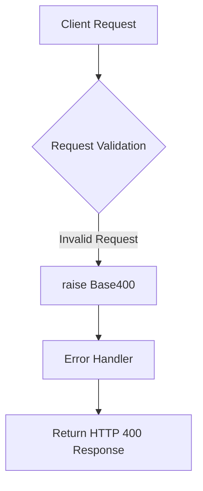

## Raises:
- Base400: Raised when a client request fails validation or contains invalid data that prevents proper processing.

## Example:
```python
# Raising the exception
try:
    # Some validation logic
    if not user_input:
        raise Base400("User input is required")
except Base400 as e:
    # Handle the 400 error
    print(f"HTTP {e.status}: {str(e)}")
    # Return HTTP 400 response to client
```

## `datasette.utils.asgi.NotFound` · *class*

## Summary:
NotFound is an exception class representing HTTP 404 Not Found errors in ASGI applications.

## Description:
This exception class extends Base400 and is specifically designed for handling HTTP 404 Not Found errors in ASGI-based web applications. It represents situations where a requested resource cannot be found on the server. The class follows the same pattern as other HTTP error exceptions in the ASGI module, providing a standardized way to represent server-side resource availability errors that should result in a 404 status code being returned to the client.

## State:
- status (int): Class attribute set to 404, indicating the HTTP status code associated with this exception type. This value is immutable as it's defined at class level and cannot be changed by instances.

## Lifecycle:
- Creation: Instantiated like any standard Python exception, typically with an optional error message as the first argument to the constructor. The class inherits the constructor behavior from Base400, which means it can accept a message string as its first argument.
- Usage: Raised when a client requests a resource that does not exist on the server. The exception should be caught by the ASGI application's error handling middleware to return an appropriate HTTP 404 response.
- Destruction: Handled automatically by Python's garbage collection when the exception goes out of scope.

## Method Map:
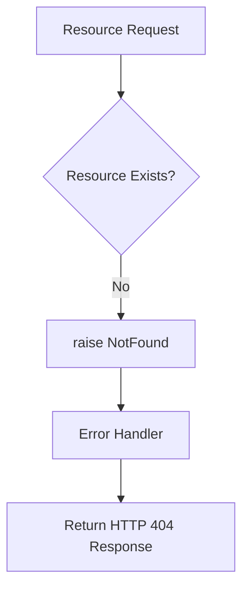

## Raises:
- NotFound: Raised when a requested resource cannot be located on the server, typically triggered by routing logic or database queries that return no results.

## Example:
```python
# Raising the exception
try:
    # Some resource lookup logic
    if not resource_exists:
        raise NotFound("Database record not found")
except NotFound as e:
    # Handle the 404 error
    print(f"HTTP {e.status}: {str(e)}")
    # Return HTTP 404 response to client
```

## `datasette.utils.asgi.Forbidden` · *class*

## Summary:
Forbidden is an exception class representing HTTP 403 Forbidden errors in ASGI applications, inheriting from Base400 with status code 403.

## Description:
This exception class represents HTTP 403 Forbidden errors in ASGI-based web applications. It inherits from Base400, which provides the foundational structure for HTTP 400-level errors, and overrides the status code to 403. When raised, this exception indicates that the server understands the request but refuses to authorize it due to insufficient permissions.

## State:
- status (int): Class attribute set to 403, indicating the HTTP status code associated with this exception type. This value is inherited from the class definition and is immutable.

## Lifecycle:
- Creation: Instantiated like any standard Python exception, typically with an optional error message as the first argument to the constructor. The constructor behavior is inherited from Base400.
- Usage: Raised when a client attempts to access a resource they don't have permission to access. The exception should be caught by the ASGI application's error handling middleware to return an appropriate HTTP 403 response.
- Destruction: Handled automatically by Python's garbage collection when the exception goes out of scope.

## Method Map:
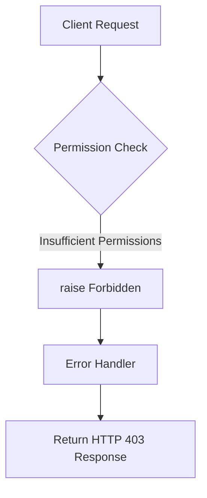

## Raises:
- Forbidden: Raised when a client attempts to access a resource they don't have permission to access, resulting in an HTTP 403 Forbidden response.

## Example:
```python
# Raising the exception
try:
    # Some authorization logic
    if not user.has_permission(resource):
        raise Forbidden("Access denied to this resource")
except Forbidden as e:
    # Handle the 403 error
    print(f"HTTP {e.status}: {str(e)}")
    # Return HTTP 403 response to client
```

## `datasette.utils.asgi.BadRequest` · *class*

## Summary:
BadRequest is an exception class representing HTTP 400 Bad Request errors in ASGI applications.

## Description:
This exception class extends Base400 and is specifically designed for handling client-side request errors that should result in a 400 status code being returned to the client. It follows the established pattern in the datasette ASGI utilities where different HTTP error status codes are represented as distinct exception classes for standardized error handling.

The class is typically raised when a client makes a malformed or invalid request that cannot be processed by the server. It should be caught by the ASGI application's error handling middleware to return an appropriate HTTP 400 response to the client.

## State:
- status (int): Class attribute set to 400, indicating the HTTP status code associated with this exception type. This value is immutable as it's defined at class level and inherited from Base400.

## Lifecycle:
- Creation: Instantiated like any standard Python exception, typically with an optional error message as the first argument to the constructor. The class inherits the standard Exception initialization behavior.
- Usage: Raised during request processing when validation fails or when the request contains invalid data that prevents proper processing. The exception should be handled by ASGI error middleware to return an HTTP 400 response.
- Destruction: Handled automatically by Python's garbage collection when the exception goes out of scope.

## Method Map:
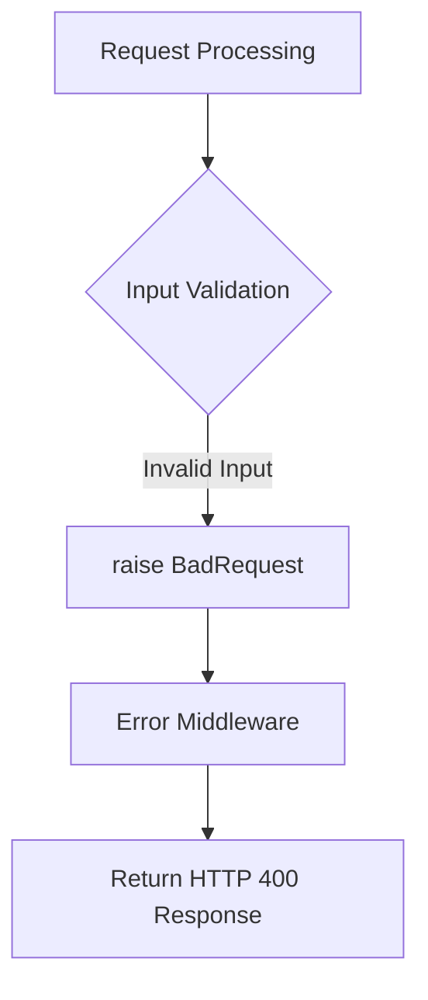

## Raises:
- BadRequest: Raised when a client request fails validation or contains invalid data that prevents proper processing. The exception inherits the standard Exception behavior while maintaining the 400 status code.

## Example:
```python
# Raising the exception
try:
    # Some validation logic
    if not user_input:
        raise BadRequest("User input is required")
except BadRequest as e:
    # Handle the 400 error
    print(f"HTTP {e.status}: {str(e)}")
    # Return HTTP 400 response to client
```

## `datasette.utils.asgi.Request` · *class*

## Summary:
ASGI Request wrapper that provides convenient access to HTTP request properties and methods for ASGI-compatible web applications.

## Description:
The Request class serves as a wrapper around ASGI scope and receive objects, providing a standardized interface for accessing HTTP request data. It abstracts the underlying ASGI protocol details to make working with HTTP requests more intuitive. This class is typically instantiated by ASGI servers or middleware when processing incoming HTTP requests, and is used throughout Datasette's ASGI-based web application to access request data.

The class provides properties for common HTTP request elements such as method, URL, headers, cookies, query parameters, and POST data, along with utility methods for parsing request bodies.

## State:
- scope: dict - ASGI scope dictionary containing request metadata including method, path, headers, query string, and other HTTP details
  - Type: dict
  - Valid range: ASGI scope compliant dictionary with required keys like "method", "path", "headers"
  - Invariant: Must contain required ASGI scope fields for proper operation
- receive: callable - ASGI receive callable for receiving request body chunks
  - Type: callable
  - Valid range: Function that returns ASGI messages when called
  - Invariant: Should be None for fake requests or properly initialized for real requests

## Lifecycle:
- Creation: Instances are created by passing an ASGI scope dictionary and receive callable to the constructor, or via the `fake()` class method for testing
- Usage: Properties and methods are accessed in any order to retrieve request data
- Destruction: No special cleanup required; uses standard Python garbage collection

## Method Map:
```mermaid
graph TD
    A[Request.__init__] --> B[Request.method]
    A[Request.__init__] --> C[Request.url]
    A[Request.__init__] --> D[Request.url_vars]
    A[Request.__init__] --> E[Request.scheme]
    A[Request.__init__] --> F[Request.headers]
    A[Request.__init__] --> G[Request.host]
    A[Request.__init__] --> H[Request.cookies]
    A[Request.__init__] --> I[Request.path]
    A[Request.__init__] --> J[Request.query_string]
    A[Request.__init__] --> K[Request.full_path]
    A[Request.__init__] --> L[Request.args]
    A[Request.__init__] --> M[Request.actor]
    A[Request.__init__] --> N[Request.post_body]
    A[Request.__init__] --> O[Request.post_vars]
    A[Request.__init__] --> P[Request.fake]
```

## Raises:
- AssertionError: Raised in `post_body()` method when receiving unexpected ASGI message types
- KeyError: May be raised when accessing non-existent keys in cookie parsing or header access
- UnicodeDecodeError: May occur when decoding bytes to strings with incorrect encodings

## Example:
```python
# Creating a real request instance
request = Request(scope, receive)

# Accessing request properties
method = request.method
url = request.url
path = request.path
query_params = request.args
cookies = request.cookies

# Processing POST data
post_data = await request.post_vars()

# Creating a fake request for testing
fake_request = Request.fake("/search?q=test&category=books")
```

### `datasette.utils.asgi.Request.__init__` · *method*

## Summary:
Initializes an ASGI Request wrapper with scope and receive callable for HTTP request handling.

## Description:
Constructs a Request instance by storing the ASGI scope dictionary and receive callable. This constructor serves as the entry point for creating Request objects that wrap ASGI protocol details to provide a standardized interface for HTTP request data access.

The method is called during the ASGI request processing lifecycle when an HTTP request is received by the server. It sets up the fundamental ASGI communication objects needed for subsequent request property access and data retrieval operations.

## Args:
    scope (dict): ASGI scope dictionary containing HTTP request metadata including method, path, headers, and query string
    receive (callable): ASGI receive callable for retrieving request body chunks and other ASGI messages

## Returns:
    None: This method initializes instance attributes but does not return a value

## Raises:
    None: This method does not raise any exceptions

## State Changes:
    Attributes READ: None
    Attributes WRITTEN: 
        - self.scope: Stores the ASGI scope dictionary for later request data access
        - self.receive: Stores the ASGI receive callable for retrieving request body data

## Constraints:
    Preconditions:
        - scope must be a valid ASGI scope dictionary with required HTTP request fields
        - receive must be a callable that conforms to ASGI specification for receiving messages
    Postconditions:
        - self.scope contains the provided scope dictionary unchanged
        - self.receive contains the provided receive callable unchanged

## Side Effects:
    None: This method performs no I/O operations or external service calls. It only stores reference to provided parameters.

### `datasette.utils.asgi.Request.__repr__` · *method*

## Summary:
Returns a string representation of the Request object showing its HTTP method and URL.

## Description:
This method provides a human-readable string representation of the Request object, useful for debugging and logging purposes. It displays the HTTP method and URL of the request in a standardized format.

## Args:
    None

## Returns:
    str: A formatted string in the pattern '&lt;asgi.Request method="{}" url="{}"&gt;' where {} represents the method and URL values respectively.

## Raises:
    None

## State Changes:
    Attributes READ: self.method, self.url
    Attributes WRITTEN: None

## Constraints:
    Preconditions: The Request object must have been initialized with a valid ASGI scope containing method and path information.
    Postconditions: The returned string follows a consistent format for debugging and logging purposes.

## Side Effects:
    None

### `datasette.utils.asgi.Request.method` · *method*

## Summary:
Returns the HTTP method of the ASGI request.

## Description:
This property extracts and returns the HTTP method (such as GET, POST, PUT, DELETE) from the ASGI scope dictionary. It provides convenient access to the request method without requiring direct dictionary access to the scope.

## Args:
    None

## Returns:
    str: The HTTP method as a string (e.g., "GET", "POST", "PUT", "DELETE").

## Raises:
    KeyError: If the "method" key is not present in the scope dictionary.

## State Changes:
    Attributes READ: self.scope
    Attributes WRITTEN: None

## Constraints:
    Preconditions: The Request instance must have been initialized with a valid scope dictionary containing a "method" key.
    Postconditions: The returned value is always a string representing the HTTP method.

## Side Effects:
    None

### `datasette.utils.asgi.Request.url` · *method*

## Summary:
Returns the full URL representation of the HTTP request by combining scheme, host, path, and query string components.

## Description:
This property constructs and returns the complete URL for the HTTP request by combining the request's scheme, host, path, and query string components using `urlunparse`. It provides a convenient way to access the full URL without manually constructing it from individual components.

## Args:
    None

## Returns:
    str: A complete URL string in the format "scheme://host/path?query_string"

## Raises:
    None

## State Changes:
    Attributes READ: self.scheme, self.host, self.path, self.query_string
    Attributes WRITTEN: None

## Constraints:
    Preconditions: The Request object must have valid scheme, host, path, and query_string properties
    Postconditions: Returns a properly formatted URL string with all components correctly assembled

## Side Effects:
    None

### `datasette.utils.asgi.Request.url_vars` · *method*

## Summary:
Returns URL route parameters extracted from the ASGI scope's URL routing information.

## Description:
Provides access to URL route variables (path parameters) that were captured during URL routing. This property extracts the `kwargs` dictionary from the ASGI scope's `url_route` section, which contains named parameters from URL patterns like `/users/{user_id}/posts/{post_id}`.

The method is called during request processing when URL parameters need to be accessed by view handlers or middleware. It's part of the ASGI Request object's interface for retrieving routing information.

## Args:
    None: This is a property method that takes no arguments beyond `self`.

## Returns:
    dict: A dictionary containing URL route parameters (kwargs) from the ASGI scope's url_route section. Returns an empty dictionary if no URL route information is available.

## Raises:
    None: This method does not raise any exceptions.

## State Changes:
    Attributes READ: 
    - self.scope: Reads the scope attribute to extract URL route information
    - self.scope.get("url_route"): Accesses the url_route key from scope dictionary
    - (self.scope.get("url_route") or {}).get("kwargs"): Accesses kwargs from url_route dictionary

    Attributes WRITTEN: None

## Constraints:
    Preconditions:
    - The Request instance must have been properly initialized with a valid ASGI scope
    - The scope dictionary should contain a url_route key (though this is optional)
    
    Postconditions:
    - Always returns a dictionary (empty or populated)
    - Does not modify any instance state

## Side Effects:
    None: This method performs no I/O operations or external service calls. It only accesses internal state.

### `datasette.utils.asgi.Request.scheme` · *method*

## Summary:
Returns the URL scheme (http or https) from the ASGI request scope, defaulting to "http" when not specified.

## Description:
This property extracts the scheme component from the ASGI request scope dictionary. It's commonly used to construct complete URLs and determine whether a request was made over HTTP or HTTPS. The method serves as a reliable accessor for the scheme information, providing a sensible default when the scheme isn't explicitly set in the ASGI scope.

## Args:
    None

## Returns:
    str: The URL scheme, either "http" or "https" from the ASGI scope, or "http" as default fallback.

## Raises:
    None

## State Changes:
    Attributes READ: self.scope
    Attributes WRITTEN: None

## Constraints:
    Preconditions: The Request instance must have been initialized with a valid scope dictionary containing the "scheme" key or be able to fall back to default behavior.
    Postconditions: Always returns a string representing a valid URL scheme ("http" or "https").

## Side Effects:
    None

### `datasette.utils.asgi.Request.headers` · *method*

## Summary:
Returns a dictionary of HTTP headers with lowercase keys and decoded string values.

## Description:
This property extracts HTTP headers from the ASGI scope and processes them into a standard dictionary format. It decodes byte-encoded header names and values using latin-1 encoding and converts all header names to lowercase for consistent access.

## Args:
    None

## Returns:
    dict[str, str]: A dictionary mapping lowercase header names to their string values. Returns an empty dictionary if no headers are present in the scope.

## Raises:
    None

## State Changes:
    Attributes READ: self.scope
    Attributes WRITTEN: None

## Constraints:
    Preconditions: The Request instance must have been initialized with a valid ASGI scope containing headers.
    Postconditions: The returned dictionary contains only lowercase header names and properly decoded string values.

## Side Effects:
    None

### `datasette.utils.asgi.Request.host` · *method*

## Summary:
Returns the host header from the HTTP request or defaults to "localhost" if not present.

## Description:
This property extracts the "host" header from the HTTP request's headers. It's designed to provide a reliable host value even when the host header is missing from the request, ensuring consistent behavior in applications that depend on host information.

## Args:
    None

## Returns:
    str: The value of the "host" header from the HTTP request, or "localhost" if the header is not present.

## Raises:
    None

## State Changes:
    Attributes READ: self.headers
    Attributes WRITTEN: None

## Constraints:
    Preconditions: The Request instance must have been initialized with a valid ASGI scope containing headers.
    Postconditions: Always returns a string value (either the host header value or "localhost").

## Side Effects:
    None

### `datasette.utils.asgi.Request.cookies` · *method*

## Summary:
Extracts and parses HTTP cookies from the request headers into a dictionary mapping cookie names to their values.

## Description:
This method provides convenient access to HTTP cookies sent by the client in the request. It parses the "cookie" header using Python's `http.cookies.SimpleCookie` class and returns a dictionary containing all parsed cookies. This method is designed to be a clean interface for accessing cookie data without requiring manual parsing.

The method is typically called during request processing when the application needs to access client-side cookie information for session management, user preferences, or authentication purposes.

## Args:
    None

## Returns:
    dict[str, str]: A dictionary mapping cookie names (str) to cookie values (str). Returns an empty dictionary if no cookie header is present or if no valid cookies are found.

## Raises:
    None

## State Changes:
    Attributes READ: 
    - self.headers: Reads the "cookie" header from the request headers dictionary
    
    Attributes WRITTEN: 
    - None

## Constraints:
    Preconditions:
    - The Request instance must have been properly initialized with a valid ASGI scope
    - The headers property must be accessible and return a dictionary-like object
    
    Postconditions:
    - Returns a dictionary with string keys and string values
    - Always returns a dictionary, even when no cookies are present

## Side Effects:
    None

### `datasette.utils.asgi.Request.path` · *method*

## Summary:
Returns the URL path component from the ASGI request scope, handling both encoded byte and string representations.

## Description:
Extracts and normalizes the path portion of an ASGI HTTP request. This property provides a consistent interface for accessing the request path regardless of whether it's stored as raw bytes or a UTF-8 string in the ASGI scope. The method handles the common case where paths may be represented differently depending on the ASGI server implementation. Query parameters are automatically stripped from the returned path.

## Args:
    self: The Request instance containing the ASGI scope

## Returns:
    str: The URL path component without query parameters, normalized to a UTF-8 string

## Raises:
    UnicodeDecodeError: When the raw_path bytes cannot be decoded using latin-1 encoding, or when path bytes cannot be decoded using utf-8 encoding

## State Changes:
    Attributes READ: self.scope
    Attributes WRITTEN: None

## Constraints:
    Preconditions: 
    - The Request instance must have a valid scope attribute containing either 'raw_path' or 'path'
    - If 'raw_path' is present, it must be bytes that can be decoded with latin-1 encoding
    - If 'path' is present, it must be either a string or bytes that can be decoded with utf-8 encoding
    
    Postconditions:
    - Returns a string representation of the path component
    - Query parameters are stripped from the returned path using partition("?")[0]
    - The returned string is properly UTF-8 decoded

## Side Effects:
    None

### `datasette.utils.asgi.Request.query_string` · *method*

## Summary:
Returns the decoded HTTP query string from the ASGI request scope.

## Description:
Extracts and decodes the query string component from the ASGI request scope, returning it as a UTF-8 string. This property provides a consistent interface for accessing HTTP query parameters regardless of how they're represented internally in the ASGI scope.

The method handles the case where the query_string might be missing from the ASGI scope by defaulting to an empty byte string before decoding. This ensures robust operation even when query parameters are not present in the request.

This logic is encapsulated in its own method rather than being inlined because:
- It provides a clean abstraction for accessing query strings consistently
- It centralizes the decoding logic for consistency across the application
- It makes testing easier by providing a well-defined interface
- It allows for future enhancements to query string handling without changing calling code

## Args:
    None

## Returns:
    str: The decoded HTTP query string, or an empty string if no query parameters are present.

## Raises:
    None explicitly raised

## State Changes:
    Attributes READ: 
    - self.scope: Accesses the underlying ASGI scope to retrieve query_string
    - self.scope.get("query_string"): Gets the query string from the ASGI scope
    
    Attributes WRITTEN: None

## Constraints:
    Preconditions:
    - The Request instance must have been properly initialized with a valid ASGI scope
    - The query_string in the scope must be decodable using latin-1 encoding
    
    Postconditions:
    - Returns a properly decoded UTF-8 string representation of the query parameters
    - Empty query strings are handled gracefully by returning an empty string

## Side Effects:
    None

### `datasette.utils.asgi.Request.full_path` · *method*

## Summary:
Returns the full URL path including query string parameters.

## Description:
Constructs and returns the complete URL path by combining the request path with its query string parameters. This method is useful for generating complete URLs for redirects, links, or when the full path including query parameters is needed for processing.

## Args:
    None

## Returns:
    str: The full URL path including query string parameters. If there are no query parameters, only the path is returned.

## Raises:
    None

## State Changes:
    Attributes READ: self.path, self.query_string
    Attributes WRITTEN: None

## Constraints:
    Preconditions: The Request object must have valid path and query_string properties.
    Postconditions: The returned string will always be a valid URL path representation, properly formatted with or without query parameters.

## Side Effects:
    None

### `datasette.utils.asgi.Request.args` · *method*

## Summary:
Returns parsed HTTP query parameters as a MultiParams object for easy access to multi-valued parameters.

## Description:
This property extracts and parses the HTTP query string from the request, converting it into a structured format that handles parameters with multiple values. The parsed parameters are normalized into a MultiParams container, allowing convenient access to both single values and complete value lists.

The method leverages Python's `urllib.parse.parse_qs()` with `keep_blank_values=True` to ensure that empty parameter values are preserved in the parsing process. This is particularly important for handling form data and URL parameters that may legitimately have empty values.

This logic is encapsulated in its own method rather than being inlined because:
- It provides a clean abstraction for accessing query parameters
- It centralizes the parsing logic for consistency across the application
- It allows for future enhancements to parameter handling without changing calling code
- It makes testing easier by providing a well-defined interface

## Args:
    None

## Returns:
    MultiParams: A container object mapping query parameter names to lists of values. Each parameter name maps to a list of strings representing all values for that parameter, even if there's only one value.

## Raises:
    None explicitly raised

## State Changes:
    Attributes READ: 
    - self.query_string: Reads the raw query string from the ASGI scope
    - self.scope: Accesses the underlying ASGI scope for query_string extraction
    
    Attributes WRITTEN: None

## Constraints:
    Preconditions:
    - The Request instance must have been properly initialized with a valid ASGI scope
    - The query_string property must be accessible and decodeable to a string
    
    Postconditions:
    - Returns a MultiParams object with normalized parameter data
    - Parameter values are always returned as lists (even single values)
    - Empty parameter values are preserved due to keep_blank_values=True

## Side Effects:
    None

### `datasette.utils.asgi.Request.actor` · *method*

## Summary:
Returns the actor associated with the current ASGI request scope, or None if no actor is defined.

## Description:
This property provides access to the "actor" field stored in the ASGI scope dictionary, which typically represents the authenticated user or client making the request. It's commonly used in Datasette's authentication and authorization systems to determine the identity of the requesting party.

## Args:
    None

## Returns:
    Any: The actor value stored in the request scope under the "actor" key, or None if the key is not present.

## Raises:
    None

## State Changes:
    Attributes READ: self.scope
    Attributes WRITTEN: None

## Constraints:
    Preconditions: The Request instance must have been initialized with a valid scope dictionary containing the "actor" key if it's expected to be present.
    Postconditions: The returned value is either the actor from scope or None, with no modification to the Request object's state.

## Side Effects:
    None

### `datasette.utils.asgi.Request.post_body` · *method*

## Summary:
Collects and returns the complete HTTP request body from ASGI messages.

## Description:
This method asynchronously reads all available HTTP request body data from ASGI messages by repeatedly calling the instance's `receive()` method until all body chunks are received. It implements the standard ASGI protocol for handling chunked request bodies.

## Args:
    None

## Returns:
    bytes: The complete HTTP request body as a byte string, containing all data from potentially multiple ASGI "http.request" messages.

## Raises:
    AssertionError: When an ASGI message of unexpected type is received (specifically when message["type"] != "http.request").

## State Changes:
    Attributes READ: None
    Attributes WRITTEN: None

## Constraints:
    Preconditions: 
    - The instance must have a valid `receive` callable that conforms to the ASGI specification
    - The HTTP request must be in progress and have a body to read
    - The method should only be called when processing an HTTP request
    
    Postconditions:
    - All body data from the ASGI request stream is accumulated and returned
    - The method completes only when all body chunks have been received (more_body=False)

## Side Effects:
    I/O: Asynchronously awaits messages from the ASGI server via the `receive()` method
    External service calls: None (relies on ASGI server implementation)

### `datasette.utils.asgi.Request.post_vars` · *method*

## Summary:
Parses the HTTP POST request body as URL-encoded form data and returns a dictionary of parameters.

## Description:
This asynchronous method retrieves the raw POST request body, decodes it from UTF-8, and parses it as URL-encoded form data (similar to query string format) into a dictionary. This is commonly used to extract form data sent via HTTP POST requests with Content-Type application/x-www-form-urlencoded.

The method is typically called during the request processing pipeline when handling form submissions or API endpoints that expect form-encoded data.

## Args:
    None

## Returns:
    dict[str, str]: A dictionary mapping form field names to their corresponding values. Empty dictionary if no form data is present.

## Raises:
    UnicodeDecodeError: If the POST body cannot be decoded as UTF-8.
    AttributeError: If the Request instance does not have a post_body() method.

## State Changes:
    Attributes READ: None
    Attributes WRITTEN: None

## Constraints:
    Preconditions: 
    - The Request instance must have a working post_body() method that returns bytes
    - The POST body must be valid URL-encoded form data
    
    Postconditions:
    - Returns a dictionary with string keys and string values
    - Empty dictionary returned if no form data is present

## Side Effects:
    None

### `datasette.utils.asgi.Request.fake` · *method*

## Summary:
Creates a fake ASGI Request object for testing purposes by constructing a minimal ASGI scope.

## Description:
This class method generates a mock ASGI request scope that can be used for testing ASGI-compatible components without requiring a real HTTP server. It parses a URL string into its constituent parts and builds the required ASGI scope dictionary that represents an HTTP request.

## Args:
    cls: The Request class (used for instantiation)
    path_with_query_string (str): Full URL path including optional query string (e.g., "/search?q=test")
    method (str): HTTP method, defaults to "GET"
    scheme (str): URL scheme, defaults to "http"
    url_vars (dict, optional): URL route parameters to include in the scope

## Returns:
    Request: An instance of the Request class initialized with the constructed ASGI scope

## Raises:
    None explicitly raised

## State Changes:
    Attributes READ: None
    Attributes WRITTEN: None (the method doesn't modify any instance attributes directly)

## Constraints:
    Preconditions: 
    - path_with_query_string must be a valid string
    - method must be a valid HTTP method string
    - scheme must be a valid URL scheme string
    
    Postconditions:
    - Returns a properly formatted ASGI scope dictionary
    - The returned Request object will have the correct path, method, and query parameters

## Side Effects:
    None

## `datasette.utils.asgi.AsgiLifespan` · *class*

## Summary:
ASGI middleware that handles lifespan events for ASGI applications, managing startup and shutdown hooks.

## Description:
The AsgiLifespan class implements the ASGI lifespan protocol, allowing an ASGI application to register startup and shutdown handlers. It acts as a wrapper around another ASGI application, intercepting lifespan messages to execute registered callbacks before delegating normal requests to the wrapped application.

This class is typically used in ASGI applications to manage application lifecycle events such as database connections, cache initialization, or cleanup operations that need to happen when the application starts or stops.

## State:
- app: The wrapped ASGI application that receives normal requests
- on_startup: List of async callable functions to execute during application startup
- on_shutdown: List of async callable functions to execute during application shutdown

## Lifecycle:
- Creation: Instantiate with an ASGI app and optional startup/shutdown callback lists
- Usage: When used as an ASGI middleware, it processes lifespan messages and delegates regular requests to the wrapped app
- Destruction: Cleanup occurs during shutdown handler execution

## Method Map:
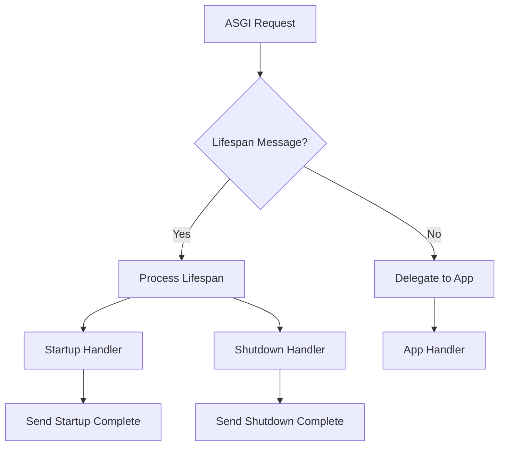

## Raises:
- None explicitly raised by __init__
- Exceptions from startup/shutdown callbacks will propagate up

## Example:
```python
# Create an ASGI app
app = ... # Some ASGI application

# Define startup and shutdown handlers
async def startup_handler():
    print("Application starting up")

async def shutdown_handler():
    print("Application shutting down")

# Wrap the app with lifespan middleware
lifespan = AsgiLifespan(app, on_startup=[startup_handler], on_shutdown=[shutdown_handler])

# Use as middleware in ASGI server
# The lifespan handlers will be called automatically during application lifecycle
```

### `datasette.utils.asgi.AsgiLifespan.__init__` · *method*

## Summary:
Initializes an ASGI lifespan handler with an application and optional startup/shutdown callback lists.

## Description:
Constructs an AsgiLifespan instance that wraps an ASGI application and manages application lifecycle events. This method sets up the internal state for handling ASGI lifespan messages during application startup and shutdown phases.

## Args:
    app: The ASGI application to wrap and delegate requests to
    on_startup: Optional list of async callable functions to execute during application startup, or a single async callable
    on_shutdown: Optional list of async callable functions to execute during application shutdown, or a single async callable

## Returns:
    None

## Raises:
    None

## State Changes:
    Attributes READ: None
    Attributes WRITTEN: self.app, self.on_startup, self.on_shutdown

## Constraints:
    Preconditions: 
    - app must be a valid ASGI application
    - on_startup and on_shutdown must be either None, a list of async callables, or a single async callable
    Postconditions:
    - self.app is set to the provided app
    - self.on_startup is guaranteed to be a list of async callables
    - self.on_shutdown is guaranteed to be a list of async callables

## Side Effects:
    None

### `datasette.utils.asgi.AsgiLifespan.__call__` · *method*

## Summary:
Handles ASGI lifespan events by executing startup/shutdown callbacks and delegating non-lifespan requests to the wrapped application.

## Description:
This method implements the ASGI lifespan protocol, processing startup and shutdown events while delegating regular HTTP requests to the wrapped application. It serves as the entry point for ASGI lifespan management in Datasette's ASGI application stack.

## Args:
    scope (dict): ASGI scope dictionary containing request information including the "type" field
    receive (callable): ASGI receive callable for receiving messages
    send (callable): ASGI send callable for sending responses

## Returns:
    None: This method does not return a value directly, though it may return early during shutdown handling

## Raises:
    Any exceptions raised by functions in self.on_startup or self.on_shutdown lists
    Any exceptions raised by the underlying self.app when handling non-lifespan requests

## State Changes:
    Attributes READ: self.on_startup, self.on_shutdown, self.app
    Attributes WRITTEN: None

## Constraints:
    Preconditions:
        - scope must be a valid ASGI scope dictionary
        - receive must be a callable that returns ASGI messages
        - send must be a callable that accepts ASGI response messages
        - self.on_startup and self.on_shutdown must contain callable functions or lists of callable functions
    Postconditions:
        - All startup callbacks in self.on_startup are executed exactly once during startup
        - All shutdown callbacks in self.on_shutdown are executed exactly once during shutdown
        - Non-lifespan requests are properly delegated to self.app

## Side Effects:
    - Executes registered startup callback functions from self.on_startup
    - Executes registered shutdown callback functions from self.on_shutdown
    - Makes asynchronous calls to the underlying ASGI application via self.app
    - Sends ASGI messages to the server via the send callable
    - May perform I/O operations during callback execution

## `datasette.utils.asgi.AsgiStream` · *class*

*No documentation generated.*

### `datasette.utils.asgi.AsgiStream.__init__` · *method*

## Summary:
Initializes an AsgiStream instance with streaming response configuration including status code, headers, content type, and a stream function.

## Description:
Configures an AsgiStream object to manage streaming HTTP responses in ASGI applications. This constructor sets up the fundamental properties needed to define the response characteristics and establish the streaming mechanism that will be executed later when the asgi_send method is called.

## Args:
    stream_fn (callable): A function that accepts an AsgiWriter instance and generates response content asynchronously. This function is called during response transmission to produce the streaming content.
    status (int): HTTP status code for the response. Defaults to 200 (OK).
    headers (dict, optional): Additional HTTP headers to include in the response. Defaults to None, which results in an empty headers dictionary.
    content_type (str): MIME content type for the response. Defaults to "text/plain".

## Returns:
    None: This method initializes the object's state but does not return a value.

## Raises:
    None explicitly raised: The constructor itself does not raise exceptions, though the stream_fn may raise exceptions during execution.

## State Changes:
    Attributes READ: None
    Attributes WRITTEN: 
    - self.stream_fn: Stores the provided stream function for later execution
    - self.status: Stores the HTTP status code
    - self.headers: Stores the headers dictionary (or empty dict if None provided)
    - self.content_type: Stores the content type string

## Constraints:
    Preconditions:
    - The stream_fn parameter must be callable and accept an AsgiWriter instance as its argument
    - The status parameter should be a valid HTTP status code (typically 100-599)
    - The headers parameter, if provided, must be a dictionary-like object
    - The content_type parameter should be a valid MIME type string

    Postconditions:
    - The AsgiStream instance is properly initialized with all provided parameters
    - The stream_fn is stored for later execution
    - The status, headers, and content_type are stored as instance attributes

## Side Effects:
    None: This method performs no I/O operations or external service calls. It only stores the provided parameters as instance attributes.

### `datasette.utils.asgi.AsgiStream.asgi_send` · *method*

## Summary:
Sends an HTTP response using the ASGI protocol by starting the response, streaming content, and ending the response.

## Description:
This method implements the ASGI response sending protocol for streaming HTTP responses. It prepares and sends the HTTP response headers, initiates content streaming via the provided stream function, and completes the response. The method is designed to work with ASGI applications and follows the standard ASGI response pattern.

## Args:
    send (Callable[[dict], Awaitable[None]]): An ASGI send function that accepts ASGI message dictionaries and returns a coroutine. This function is responsible for transmitting ASGI messages to the client.

## Returns:
    None: This method does not return a value.

## Raises:
    Any exceptions raised by the underlying ASGI send function or stream_fn.

## State Changes:
    Attributes READ: 
    - self.headers: Headers dictionary from the AsgiStream instance
    - self.content_type: Content type string from the AsgiStream instance  
    - self.status: HTTP status code from the AsgiStream instance
    - self.stream_fn: Stream function from the AsgiStream instance

    Attributes WRITTEN: None

## Constraints:
    Preconditions:
    - The `send` parameter must be a valid ASGI send callable
    - The `self.stream_fn` must be a callable that accepts an AsgiWriter instance
    - All header keys and values must be convertible to UTF-8 strings
    - The AsgiStream instance must be properly initialized with valid status, headers, and content_type

    Postconditions:
    - An HTTP response start message is sent with proper headers and status
    - The stream_fn is executed with an AsgiWriter instance to generate response content
    - An empty HTTP response body message is sent to complete the response

## Side Effects:
    - Sends HTTP response data via the ASGI send function
    - May perform asynchronous I/O operations through the ASGI protocol
    - Invokes the stream_fn callback which may perform additional I/O operations

## `datasette.utils.asgi.AsgiWriter` · *class*

## Summary:
A lightweight ASGI response writer that sends HTTP response body chunks using the ASGI send protocol.

## Description:
The AsgiWriter class provides a simplified interface for writing HTTP response body chunks in ASGI applications. It wraps an ASGI send function and handles the encoding of string content to UTF-8 bytes, making it easier to send response data incrementally. This class is typically used in ASGI web applications to stream response content to clients.

## State:
- send: callable, an ASGI send function that accepts ASGI message dictionaries
  - Type: Callable[[dict], Awaitable[None]]
  - Valid range: Must be a valid ASGI send callable that handles "http.response.body" messages
  - Invariant: Must be provided during initialization and remain valid throughout the object's lifetime

## Lifecycle:
- Creation: Instantiate with an ASGI send function as the sole parameter
- Usage: Call the async write() method with string content to send chunks
- Destruction: No explicit cleanup required; object is lightweight and stateless

## Method Map:
```mermaid
graph TD
    A[create AsgiWriter] --> B[call write()]
    B --> C[send ASGI message]
    C --> D[http.response.body with more_body=True]
```

## Raises:
- TypeError: If chunk parameter is not a string that can be encoded to UTF-8
- Any exceptions raised by the underlying ASGI send function

## Example:
```python
# Typical usage in an ASGI application
async def app(scope, receive, send):
    writer = AsgiWriter(send)
    await writer.write("Hello ")
    await writer.write("World!")
```

### `datasette.utils.asgi.AsgiWriter.__init__` · *method*

## Summary:
Initializes an AsgiWriter instance with an ASGI send function for streaming HTTP response data.

## Description:
Configures the AsgiWriter with the ASGI send function that will be used to transmit HTTP response body chunks. This constructor establishes the communication channel with the ASGI server for sending response data incrementally.

## Args:
    send (Callable[[dict], Awaitable[None]]): An ASGI send function that accepts ASGI message dictionaries and returns an awaitable. Must handle "http.response.body" messages for proper ASGI protocol compliance.

## Returns:
    None: This method does not return a value.

## Raises:
    None: This method does not raise any exceptions.

## State Changes:
    Attributes READ: None
    Attributes WRITTEN: self.send - stores the provided ASGI send function for later use in response streaming

## Constraints:
    Preconditions: 
    - The send parameter must be a valid ASGI send callable that accepts ASGI message dictionaries
    - The send function must be capable of handling "http.response.body" ASGI messages
    Postconditions: 
    - The AsgiWriter instance is properly initialized with the provided send function
    - The send function is stored in self.send for subsequent use in write operations

## Side Effects:
    None: This method performs no I/O operations or external service calls. It only stores the provided send function reference.

### `datasette.utils.asgi.AsgiWriter.write` · *method*

## Summary:
Writes a chunk of response data to the HTTP response body stream.

## Description:
This method sends a chunk of data as part of an HTTP response body using the ASGI protocol. It encodes the provided string chunk to UTF-8 bytes and transmits it as part of the response stream with the "more_body" flag set to True, indicating that additional body data will follow.

## Args:
    chunk (str): The response data chunk to send as part of the HTTP response body.

## Returns:
    None: This method does not return a value.

## Raises:
    Any exceptions raised by the underlying `self.send()` method when transmitting the ASGI message.

## State Changes:
    Attributes READ: self.send
    Attributes WRITTEN: None

## Constraints:
    Preconditions: 
    - The AsgiWriter instance must have been initialized with a valid ASGI send callable
    - The chunk parameter must be a string that can be encoded to UTF-8
    Postconditions: 
    - The chunk data is transmitted via the ASGI interface
    - The HTTP response body stream continues with more data to be sent

## Side Effects:
    - Performs asynchronous I/O operation through the ASGI send interface
    - May cause network transmission of response data to the client

## `datasette.utils.asgi.asgi_send_json` · *function*

## Summary:
Serializes data to JSON and sends it as an HTTP response with appropriate JSON content type headers.

## Description:
This asynchronous function takes structured data, serializes it to JSON format, and sends it as an HTTP response using the ASGI protocol. It provides a convenient way to send JSON responses while automatically setting the correct content type header. The function delegates the actual ASGI response sending to the `asgi_send` helper function.

## Args:
    send (callable): ASGI send function that accepts ASGI messages and returns a coroutine for transmitting HTTP response data
    info (Any): Data structure to be serialized to JSON and sent as the response body
    status (int, optional): HTTP status code for the response. Defaults to 200
    headers (dict, optional): Dictionary of additional HTTP headers to include in the response. Defaults to None

## Returns:
    None: This function does not return a value but sends an ASGI HTTP response message

## Raises:
    Exception: May raise exceptions from the underlying `asgi_send` function if transmission fails

## Constraints:
    Preconditions:
        - The `send` parameter must be a callable that accepts ASGI messages
        - The `info` parameter must be serializable to JSON format
        - Status must be a valid HTTP status code integer
        - Headers dictionary keys and values must be strings if provided
    Postconditions:
        - An ASGI "http.response.start" message is sent with proper JSON content type
        - An ASGI "http.response.body" message is sent with the JSON-encoded content

## Side Effects:
    - Sends ASGI messages to the client via the send function
    - No file I/O, network calls, or external state mutations beyond the ASGI communication

## Control Flow:
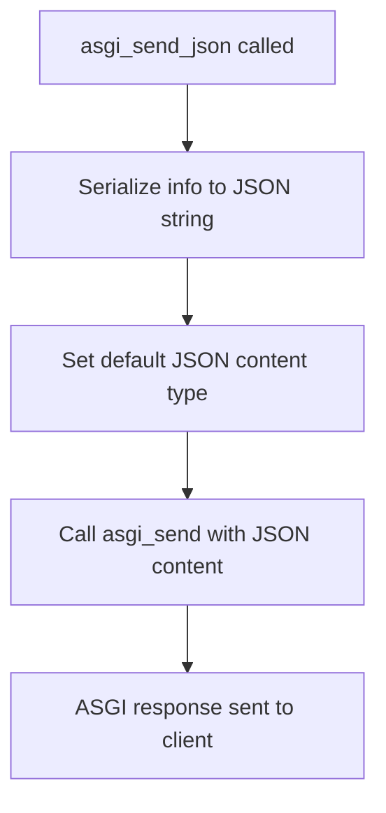

## Examples:
```python
# Basic usage with default status and headers
await asgi_send_json(send_func, {"message": "Hello World"})

# Usage with custom status and headers
await asgi_send_json(send_func, {"error": "Not found"}, 404, 
                     {"Cache-Control": "no-cache"})
```

## `datasette.utils.asgi.asgi_send_html` · *function*

## Summary:
Sends an ASGI HTTP response containing HTML content with appropriate content-type header.

## Description:
This function provides a convenient way to send HTML responses in ASGI applications by automatically setting the content-type header to "text/html; charset=utf-8". It wraps the generic `asgi_send` function to simplify HTML response creation while maintaining full control over status codes and additional headers.

Known callers within the codebase:
- This function is likely called by various ASGI handlers throughout Datasette that need to return HTML content to clients
- It would typically be used in route handlers that render HTML templates or serve HTML pages

Why this logic is extracted into its own function:
- Provides type safety and consistency for HTML responses
- Reduces boilerplate code by automatically setting the correct content-type
- Maintains separation of concerns by having dedicated functions for different response types
- Enables easier testing and mocking of HTML-specific response handling

## Args:
    send (callable): ASGI send function used to transmit HTTP response messages
    html (str): The HTML content to send as the response body
    status (int): HTTP status code for the response. Defaults to 200
    headers (dict, optional): Dictionary of additional HTTP headers to include in the response. Defaults to None

## Returns:
    None: This function doesn't return any value but sends ASGI messages through the send function

## Raises:
    Exception: May raise exceptions from the underlying ASGI send function if transmission fails

## Constraints:
    Preconditions:
        - The send parameter must be a callable that accepts ASGI messages
        - Status must be a valid HTTP status code integer
        - HTML content must be a string that can be encoded to UTF-8
        - Headers dictionary keys and values must be strings if provided
    Postconditions:
        - An ASGI "http.response.start" message is sent with proper formatting including content-type
        - An ASGI "http.response.body" message is sent with the provided HTML content

## Side Effects:
    - Sends ASGI messages to the client via the send function
    - No file I/O, network calls, or external state mutations

## Control Flow:
```mermaid
flowchart TD
    A[asgi_send_html called] --> B[Initialize headers if None]
    B --> C[Call asgi_send with html, status, headers, content_type="text/html; charset=utf-8"]
    C --> D[asgi_send handles response start and body transmission]
    D --> E[End]
```

## Examples:
```python
# Basic usage with default status and no extra headers
await asgi_send_html(send_func, "<html><body>Hello World</body></html>")

# With custom status and additional headers
await asgi_send_html(send_func, "<h1>Error</h1>", 404, {"Cache-Control": "no-cache"})
```

## `datasette.utils.asgi.asgi_send_redirect` · *function*

## Summary:
Sends an ASGI HTTP redirect response with the specified location and status code.

## Description:
Creates and sends an HTTP redirect response using the ASGI protocol. This function is a convenience wrapper that sets up the appropriate HTTP headers for a redirect response, specifically the Location header, and sends it using the underlying ASGI send mechanism.

The function is commonly used in ASGI applications to redirect clients to a different URL, typically in response to form submissions, authentication redirects, or navigation requests. It defaults to a 302 (temporary) redirect status code, which is the standard for most web redirects.

This function extracts the common pattern of sending redirect responses into a dedicated utility, promoting code reuse and ensuring consistent redirect response formatting throughout the application.

## Args:
    send (callable): ASGI send function that accepts ASGI messages and returns a coroutine. Used to transmit the HTTP response to the client.
    location (str): The URL to redirect to. This becomes the value of the Location header in the HTTP response.
    status (int, optional): HTTP status code for the redirect. Defaults to 302 (Found). Common alternatives include 301 (Moved Permanently) for permanent redirects.

## Returns:
    None: This function does not return a value but sends an ASGI HTTP response message.

## Raises:
    Exception: May raise exceptions from the underlying ASGI send function if transmission fails.

## Constraints:
    Preconditions:
        - The `send` parameter must be a callable that accepts ASGI messages
        - The `location` parameter must be a valid string representing a URL
        - The `status` parameter must be a valid HTTP status code integer (typically 301, 302, 303, 307, or 308)
    Postconditions:
        - An ASGI "http.response.start" message is sent with proper redirect headers
        - An ASGI "http.response.body" message is sent with an empty body
        - The response includes a Location header pointing to the specified location

## Side Effects:
    - Sends ASGI messages to the client via the send function
    - No file I/O, network calls, or external state mutations beyond the ASGI communication

## Control Flow:
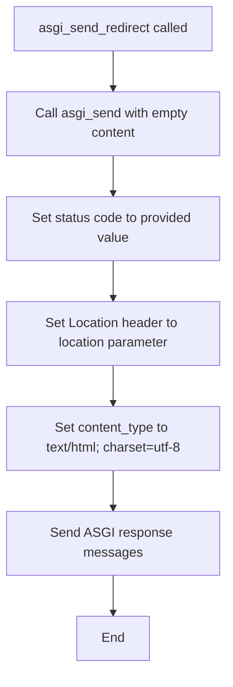

## Examples:
```python
# Basic redirect to another page
await asgi_send_redirect(send_func, "/login")

# Permanent redirect to a new location
await asgi_send_redirect(send_func, "/new-page", status=301)

# Redirect with a relative path
await asgi_send_redirect(send_func, "../profile", status=302)
```

## `datasette.utils.asgi.asgi_send` · *function*

## Summary:
Sends an ASGI HTTP response with specified content, status, and headers.

## Description:
This function initializes an ASGI HTTP response using the provided status code and headers, then sends the response body content. It serves as a convenience wrapper that combines the functionality of `asgi_start` with sending the response body in a single operation.

## Args:
    send (callable): ASGI send function used to transmit HTTP response messages
    content (str): The response body content to send
    status (int): HTTP status code for the response
    headers (dict, optional): Dictionary of HTTP headers to include in the response. Defaults to None
    content_type (str): MIME content type for the response body. Defaults to "text/plain"

## Returns:
    None: This function doesn't return any value but sends ASGI messages through the send function

## Raises:
    Exception: May raise exceptions from the underlying ASGI send function if transmission fails

## Constraints:
    Preconditions:
        - The send parameter must be a callable that accepts ASGI messages
        - Status must be a valid HTTP status code integer
        - Content must be a string that can be encoded to UTF-8
        - Headers dictionary keys and values must be strings if provided
    Postconditions:
        - An ASGI "http.response.start" message is sent with proper formatting
        - An ASGI "http.response.body" message is sent with the provided content

## Side Effects:
    - Sends ASGI messages to the client via the send function
    - No file I/O, network calls, or external state mutations

## Control Flow:
```mermaid
flowchart TD
    A[asgi_send called] --> B[Call asgi_start with status, headers, content_type]
    B --> C[asgi_start handles header setup and sends response start]
    C --> D[Send response body with content.encode("utf-8")]
    D --> E[End]
```

## Examples:
```python
# Basic usage with default content type
await asgi_send(send_func, "Hello World", 200)

# With custom headers and content type
await asgi_send(send_func, '{"error": "Not found"}', 404, 
                {"Content-Type": "application/json", "Cache-Control": "no-cache"}, 
                "application/json")
```

## `datasette.utils.asgi.asgi_start` · *function*

## Summary:
Initializes an ASGI HTTP response with specified status code and headers.

## Description:
This function prepares and sends the initial HTTP response message in ASGI protocol format. It handles header processing by removing any existing content-type header and setting a new one, then encodes all headers to latin1 format before sending them through the ASGI send interface.

## Args:
    send (callable): ASGI send function used to transmit the HTTP response start message
    status (int): HTTP status code for the response
    headers (dict, optional): Dictionary of HTTP headers to include in the response. Defaults to None
    content_type (str): MIME content type for the response body. Defaults to "text/plain"

## Returns:
    None: This function doesn't return any value but sends an ASGI message

## Raises:
    None explicitly raised: The function delegates to the send function which may raise exceptions

## Constraints:
    Preconditions:
        - The send parameter must be a callable that accepts ASGI messages
        - Status must be a valid HTTP status code integer
        - Headers dictionary keys and values must be strings
    Postconditions:
        - An ASGI "http.response.start" message is sent with proper formatting
        - Content-Type header is set to the specified content_type parameter
        - Any existing Content-Type header in input headers is overwritten

## Side Effects:
    - Sends an ASGI message to the client via the send function
    - No file I/O, network calls, or external state mutations

## Control Flow:
```mermaid
flowchart TD
    A[asgi_start called] --> B{headers provided?}
    B -- No --> C[Set headers = {}]
    B -- Yes --> D[Use provided headers]
    C --> E[Filter out content-type headers]
    D --> E
    E --> F[Set content-type = content_type]
    F --> G[Encode headers to latin1]
    G --> H[Send ASGI message]
    H --> I[End]
```

## Examples:
```python
# Basic usage
await asgi_start(send_func, 200, content_type="application/json")

# With custom headers
await asgi_start(send_func, 404, {"Cache-Control": "no-cache"}, "text/html")
```

## `datasette.utils.asgi.asgi_send_file` · *function*

## Summary:
Sends a file asynchronously over ASGI by reading it in chunks and transmitting each chunk via the ASGI send interface.

## Description:
This function reads a file asynchronously in configurable-sized chunks and transmits the content through the ASGI protocol using the provided send function. It automatically sets appropriate HTTP headers including content length, content type, and content disposition when a filename is provided. The function handles the complete ASGI response lifecycle including sending the initial response headers followed by the file content in chunks.

## Args:
    send (callable): ASGI send function used to transmit HTTP response messages
    filepath (str or Path): Path to the file to be sent
    filename (str, optional): Name to use for the Content-Disposition header. Defaults to None
    content_type (str, optional): MIME content type for the response. If not provided, inferred from the file extension. Defaults to None
    chunk_size (int): Size of chunks to read from the file at a time. Defaults to 4096
    headers (dict, optional): Additional HTTP headers to include in the response. Defaults to None

## Returns:
    None: This function doesn't return any value but sends ASGI messages through the send function

## Raises:
    None explicitly raised: Exceptions from file operations or the send function are not caught and will propagate

## Constraints:
    Preconditions:
        - The send parameter must be a callable that accepts ASGI messages
        - The filepath must point to an existing readable file
        - The chunk_size must be a positive integer
    Postconditions:
        - An ASGI "http.response.start" message is sent with proper headers
        - All file content is transmitted via "http.response.body" messages
        - The file is read completely and closed properly

## Side Effects:
    - Reads from the filesystem asynchronously
    - Sends multiple ASGI messages through the provided send function
    - No external state mutations or network calls

## Control Flow:
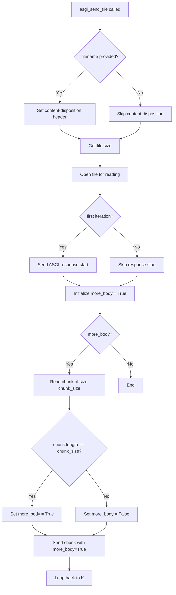

## Examples:
```python
# Send a file with automatic content type detection
await asgi_send_file(send, "/path/to/file.txt")

# Send a file with custom content type and filename
await asgi_send_file(send, "/path/to/data.json", filename="export.json", content_type="application/json")

# Send a file with custom chunk size and additional headers
await asgi_send_file(send, "/path/to/large_file.zip", chunk_size=8192, headers={"X-Custom-Header": "value"})
```

## `datasette.utils.asgi.asgi_static` · *function*

## Summary:
Creates an ASGI middleware handler for serving static files from a specified directory with security validation.

## Description:
This function generates an ASGI-compatible middleware handler that serves static files from a configured root directory. It validates that requested paths are within the allowed root path and prevents directory traversal attacks. The handler supports asynchronous file serving with configurable chunk sizes and can be integrated into ASGI applications like Datasette.

Known callers within the codebase:
- This function is used internally by Datasette's routing system to set up static file serving endpoints
- It would typically be called during application startup when configuring routes for static assets
- The returned handler is registered with ASGI routers to handle requests matching specific URL patterns

Why this logic is extracted into its own function rather than inlined:
- Provides reusable static file serving capability across different parts of the application
- Enforces security boundaries by centralizing path validation logic
- Separates concerns between route configuration and file serving implementation
- Allows for easy customization of serving parameters like chunk size and headers

## Args:
    root_path (str or Path): Root directory path from which static files will be served
    chunk_size (int): Size of file chunks to read and send at a time. Defaults to 4096
    headers (dict, optional): Additional HTTP headers to include in responses. Defaults to None
    content_type (str, optional): Default content type for files. Defaults to None

## Returns:
    callable: An ASGI async handler function that processes incoming requests and serves static files

## Raises:
    None explicitly raised: The function itself doesn't raise exceptions, but the inner handler may raise exceptions from underlying file operations

## Constraints:
    Preconditions:
        - root_path must be a valid directory path that exists on the filesystem
        - chunk_size must be a positive integer
        - headers, if provided, must be a dictionary with string keys and values
    Postconditions:
        - The returned function is an ASGI-compatible async handler
        - All path validation checks are performed before attempting to serve files
        - Security restrictions prevent access outside the root_path directory

## Side Effects:
    - None directly caused by the function call itself
    - The returned handler will perform filesystem I/O when processing requests
    - The handler will send ASGI messages to the client during request processing

## Control Flow:
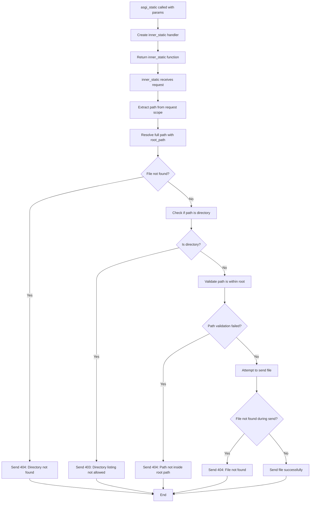

## Examples:
```python
# Basic usage - create static file handler for a directory
static_handler = asgi_static("/var/www/static")

# Usage with custom chunk size
static_handler = asgi_static("/var/www/static", chunk_size=8192)

# Usage with additional headers
static_handler = asgi_static("/var/www/static", headers={"Cache-Control": "public, max-age=3600"})
```

## `datasette.utils.asgi.Response` · *class*

## Summary:
ASGI Response class for creating and sending HTTP responses in asynchronous web applications.

## Description:
The Response class encapsulates HTTP response data for ASGI applications, providing methods to construct responses with different content types (HTML, text, JSON) and manage cookies. It implements the ASGI response protocol by converting its internal state into the appropriate ASGI message format for transmission.

## State:
- body: The response body content, can be string or bytes
- status: HTTP status code (default: 200)
- headers: Dictionary of HTTP headers (default: empty dict)
- _set_cookie_headers: List of formatted Set-Cookie header strings (managed internally)
- content_type: MIME type of the response body (default: "text/plain")

## Lifecycle:
Creation: Instantiate with constructor parameters or use class methods (html, text, json, redirect)
Usage: Call asgi_send() method with ASGI send callable to transmit the response
Destruction: No explicit cleanup required; response is sent once and discarded

## Method Map:
```mermaid
graph TD
    A[Response.__init__] --> B[Response.set_cookie]
    A --> C[Response.html]
    A --> D[Response.text]
    A --> E[Response.json]
    A --> F[Response.redirect]
    B --> G[Response.asgi_send]
    C --> G
    D --> G
    E --> G
    F --> G
    G --> H[send()]
```

## Raises:
- AssertionError: When set_cookie is called with invalid samesite parameter value (expects one of predefined SAMESITE_VALUES)

## Example:
```python
# Create HTML response
response = Response.html("<h1>Hello World</h1>")

# Create JSON response with custom headers
response = Response.json({"message": "success"}, headers={"X-Custom": "value"})

# Create redirect response
response = Response.redirect("/login", status=301)

# Set cookie and send response
response = Response.text("Hello")
response.set_cookie("session_id", "abc123", secure=True, httponly=True)
await response.asgi_send(send)
```

### `datasette.utils.asgi.Response.__init__` · *method*

## Summary:
Initializes an HTTP response object with body content, status code, headers, and content type.

## Description:
Constructs a Response instance that represents an HTTP response with configurable body content, status code, headers, and content type. This method sets up the basic structure for an HTTP response that can be sent back to a client via ASGI.

## Args:
    body (bytes, str, or None): The response body content. Defaults to None.
    status (int): The HTTP status code. Defaults to 200.
    headers (dict or None): HTTP headers as key-value pairs. Defaults to None.
    content_type (str): The MIME content type of the response. Defaults to "text/plain".

## Returns:
    None: This method initializes instance attributes and does not return a value.

## Raises:
    None: This method does not explicitly raise exceptions.

## State Changes:
    Attributes READ: None
    Attributes WRITTEN: 
        - self.body: Set to the provided body parameter
        - self.status: Set to the provided status parameter  
        - self.headers: Set to the provided headers parameter or empty dict
        - self._set_cookie_headers: Initialized as empty list
        - self.content_type: Set to the provided content_type parameter

## Constraints:
    Preconditions: None
    Postconditions: 
        - self.body is set to the provided body parameter
        - self.status is set to the provided status parameter
        - self.headers is initialized as a dictionary (empty if None provided)
        - self._set_cookie_headers is initialized as an empty list
        - self.content_type is set to the provided content_type parameter

## Side Effects:
    None: This method performs only local attribute assignments and has no external side effects.

### `datasette.utils.asgi.Response.asgi_send` · *method*

## Summary:
Sends an ASGI HTTP response by serializing headers, content-type, and cookies, then transmitting the response start and body messages.

## Description:
This method implements the ASGI response protocol by converting the Response object's properties into the appropriate ASGI message format. It handles header serialization, content-type setting, and cookie management before sending the HTTP response start and body messages to the ASGI server via the provided send callable.

## Args:
    send (callable): ASGI send callable that accepts ASGI messages and returns a coroutine

## Returns:
    None: This method does not return a value

## Raises:
    None explicitly raised: The method relies on the underlying ASGI send callable for error handling

## State Changes:
    Attributes READ: self.headers, self.content_type, self._set_cookie_headers, self.status, self.body
    Attributes WRITTEN: None

## Constraints:
    Preconditions:
        - The `send` parameter must be a callable that accepts ASGI messages
        - The Response object must have valid status, headers, and body attributes
        - Content-type should be properly set in the Response object
    Postconditions:
        - The ASGI server receives a complete HTTP response with proper headers and body
        - The response body is encoded as UTF-8 bytes if it's a string

## Side Effects:
    - Invokes the ASGI send callable to transmit HTTP response messages
    - Performs UTF-8 encoding of string body content
    - May cause network I/O when sending response data to client

### `datasette.utils.asgi.Response.set_cookie` · *method*

## Summary:
Sets an HTTP cookie on the response by adding a formatted cookie header to the response's internal cookie tracking list.

## Description:
This method constructs an HTTP Set-Cookie header from the provided parameters and appends it to the response's internal `_set_cookie_headers` list. The cookie will be sent to the client when the response is serialized and sent via ASGI. This method provides a clean interface for setting cookies with various attributes like expiration, domain, security flags, and SameSite policy.

## Args:
    key (str): The name of the cookie to set.
    value (str): The value of the cookie. Defaults to empty string.
    max_age (int, optional): Number of seconds until the cookie expires. Defaults to None.
    expires (str, optional): Absolute expiration date for the cookie. Defaults to None.
    path (str): Path for which the cookie is valid. Defaults to "/".
    domain (str, optional): Domain for which the cookie is valid. Defaults to None.
    secure (bool): If True, cookie is only sent over HTTPS. Defaults to False.
    httponly (bool): If True, cookie is not accessible via JavaScript. Defaults to False.
    samesite (str): SameSite cookie policy ('lax', 'strict', or 'none'). Defaults to 'lax'.

## Returns:
    None: This method does not return a value.

## Raises:
    AssertionError: If the samesite parameter is not one of the valid values ('lax', 'strict', 'none').

## State Changes:
    Attributes READ: None
    Attributes WRITTEN: self._set_cookie_headers (appends a new cookie header string)

## Constraints:
    Preconditions: 
    - The samesite parameter must be one of 'lax', 'strict', or 'none'
    - The Response instance must have been initialized (so _set_cookie_headers exists)
    
    Postconditions:
    - The cookie header string is appended to self._set_cookie_headers list
    - The cookie will be included in the final HTTP response headers when asgi_send is called

## Side Effects:
    None: This method only modifies the internal state of the Response object and does not perform any I/O operations or external service calls.

### `datasette.utils.asgi.Response.html` · *method*

## Summary:
Creates a Response instance configured for HTML content with UTF-8 encoding.

## Description:
A class method that provides a convenient way to create HTTP responses containing HTML content. This method initializes a Response object with the appropriate content type header set to "text/html; charset=utf-8", making it easier to return HTML pages from ASGI handlers without manually specifying the content type.

This method serves as part of a family of convenience factory methods in the Response class, alongside `text()`, `json()`, and `redirect()`, providing consistent interfaces for different response types. As a classmethod, it can be called directly on the Response class without needing an instance.

## Args:
    cls: The Response class (automatically passed by Python's classmethod decorator)
    body (str): The HTML content to be returned in the response body
    status (int): HTTP status code for the response. Defaults to 200
    headers (dict, optional): Additional HTTP headers to include in the response

## Returns:
    Response: A Response instance configured for HTML content with the specified body, status, and headers

## Raises:
    None: This method does not raise any exceptions directly

## State Changes:
    Attributes READ: None
    Attributes WRITTEN: None

## Constraints:
    Preconditions: 
    - The `body` parameter should be a string containing valid HTML content
    - The `status` parameter should be a valid HTTP status code
    - The `headers` parameter, if provided, should be a dictionary of header names and values
    
    Postconditions:
    - Returns a Response instance with content_type set to "text/html; charset=utf-8"
    - The returned Response instance preserves the provided body, status, and headers

## Side Effects:
    None: This method performs no I/O operations or external service calls. It only creates and returns a Response object.

### `datasette.utils.asgi.Response.text` · *method*

## Summary:
Creates a Response instance configured for plain text content with UTF-8 encoding.

## Description:
A class method that provides a convenient way to create HTTP responses containing plain text content. This method initializes a Response object with the appropriate content type header set to "text/plain; charset=utf-8", making it easier to return plain text content from ASGI handlers without manually specifying the content type.

This method serves as part of a family of convenience factory methods in the Response class, alongside `html()`, `json()`, and `redirect()`, providing consistent interfaces for different response types. As a classmethod, it can be called directly on the Response class without needing an instance.

## Args:
    cls: The Response class (automatically passed by Python's classmethod decorator)
    body (Any): The content to be returned in the response body. Will be converted to string using str().
    status (int): HTTP status code for the response. Defaults to 200
    headers (dict, optional): Additional HTTP headers to include in the response

## Returns:
    Response: A Response instance configured for plain text content with the specified body, status, and headers

## Raises:
    None: This method does not raise any exceptions directly

## State Changes:
    Attributes READ: None
    Attributes WRITTEN: None

## Constraints:
    Preconditions: 
    - The `body` parameter can be any object that can be converted to a string using str()
    - The `status` parameter should be a valid HTTP status code
    - The `headers` parameter, if provided, should be a dictionary of header names and values
    
    Postconditions:
    - Returns a Response instance with content_type set to "text/plain; charset=utf-8"
    - The returned Response instance preserves the provided body (converted to string), status, and headers

## Side Effects:
    None: This method performs no I/O operations or external service calls. It only creates and returns a Response object.

### `datasette.utils.asgi.Response.json` · *method*

## Summary:
Creates a JSON response by serializing the provided body to JSON format and setting the appropriate content type header.

## Description:
This class method constructs a Response object with JSON-formatted body content. It serializes the input body using Python's standard json.dumps() function and sets the Content-Type header to application/json; charset=utf-8. This method is typically used in ASGI applications to return structured JSON data to HTTP clients.

## Args:
    body (Any): The data structure to serialize to JSON. Can be any JSON-serializable Python object.
    status (int): HTTP status code for the response. Defaults to 200.
    headers (dict, optional): Additional HTTP headers to include in the response.
    default (callable, optional): A function to handle non-JSON-serializable objects during serialization.

## Returns:
    Response: A new Response instance configured with JSON body content and appropriate headers.

## Raises:
    TypeError: If the body contains non-serializable objects and no default handler is provided.

## State Changes:
    Attributes READ: None
    Attributes WRITTEN: None

## Constraints:
    Preconditions: The body parameter must be serializable to JSON, or a default handler must be provided.
    Postconditions: The returned Response object will have content_type set to "application/json; charset=utf-8".

## Side Effects:
    None

### `datasette.utils.asgi.Response.redirect` · *method*

## Summary:
Creates an HTTP redirect response with the specified location and status code.

## Description:
Returns a new Response instance configured as an HTTP redirect. This method sets the Location header to the provided path and creates a response with empty content and the specified HTTP status code. It's commonly used to redirect users to different URLs within an ASGI application.

## Args:
    path (str): The URL path or absolute URL to redirect to.
    status (int): HTTP status code for the redirect. Defaults to 302 (temporary redirect).
    headers (dict, optional): Additional HTTP headers to include in the response.

## Returns:
    Response: A new Response instance configured as an HTTP redirect with empty body content.

## Raises:
    None: This method does not raise any exceptions.

## State Changes:
    None: This method is immutable and does not modify any existing object state.

## Constraints:
    Preconditions: The path argument must be a valid string representing a URL or URL path.
    Postconditions: The returned Response object will have a Location header set to the provided path.

## Side Effects:
    None: This method performs no I/O operations or external service calls. It only constructs and returns a Response object.

## `datasette.utils.asgi.AsgiFileDownload` · *class*

## Summary:
A wrapper class for managing ASGI file downloads that encapsulates file metadata and provides an ASGI-compatible send interface.

## Description:
The AsgiFileDownload class serves as a container for file download parameters and implements the ASGI protocol interface for sending files. It is designed to work with ASGI web servers to efficiently stream files to clients while maintaining proper HTTP headers and response formatting. This class abstracts the file delivery details and provides a clean interface for asynchronous file transmission through the ASGI send function.

## State:
- filepath (str or Path): Absolute or relative path to the file to be downloaded. Must reference an existing readable file.
- filename (str, optional): Name to use for the Content-Disposition header. When provided, this enables browsers to suggest a filename for saving the file.
- content_type (str): MIME content type for the HTTP response. Defaults to "application/octet-stream" for binary data.
- headers (dict): Additional HTTP headers to include in the response. Defaults to an empty dictionary.

## Lifecycle:
- Creation: Instantiate with a filepath and optional filename, content_type, and headers parameters
- Usage: Call the asgi_send() method with an ASGI send function to initiate the file transfer
- Destruction: No explicit cleanup required; the object is lightweight and stateless after instantiation

## Method Map:
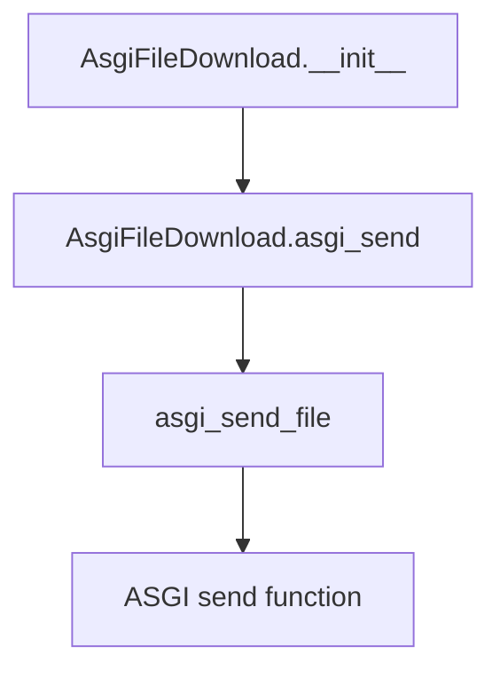

## Raises:
- No explicit exceptions raised by __init__
- Exceptions from file operations or the ASGI send function will propagate from the asgi_send method

## Example:
```python
# Create a file download handler
download = AsgiFileDownload(
    filepath="/path/to/data.csv",
    filename="report.csv",
    content_type="text/csv"
)

# Send the file via ASGI
await download.asgi_send(send_function)
```

### `datasette.utils.asgi.AsgiFileDownload.__init__` · *method*

## Summary:
Initializes an AsgiFileDownload object with file path, optional filename, content type, and HTTP headers for ASGI file serving.

## Description:
This constructor creates a file download handler that stores file metadata and configuration options needed to serve a file via ASGI. It prepares the object's state for subsequent ASGI file sending operations through the `asgi_send` method.

## Args:
    filepath (str): Absolute or relative path to the file to be served for download
    filename (str, optional): Override the filename sent in Content-Disposition header. Defaults to None
    content_type (str): MIME content type for the file. Defaults to "application/octet-stream"
    headers (dict, optional): Additional HTTP headers to include in the response. Defaults to None

## Returns:
    None: This is an initialization method that sets instance attributes

## Raises:
    None explicitly raised: The method itself doesn't raise exceptions, though underlying filesystem operations may fail

## State Changes:
    Attributes READ: None
    Attributes WRITTEN: 
    - self.headers: Set to provided headers or empty dict
    - self.filepath: Set to provided filepath
    - self.filename: Set to provided filename or None
    - self.content_type: Set to provided content_type or default

## Constraints:
    Preconditions:
    - filepath should be a valid path to an existing file
    - If filename is provided, it should be a valid string
    - content_type should be a valid MIME type string
    
    Postconditions:
    - All instance attributes are properly initialized
    - self.headers is always a dictionary (empty if None was provided)
    - self.filepath, self.filename, and self.content_type are set to provided values

## Side Effects:
    None: This method performs no I/O operations or external service calls. It only initializes object state.

### `datasette.utils.asgi.AsgiFileDownload.asgi_send` · *method*

## Summary:
Sends an ASGI response containing the file content using the provided ASGI send callable.

## Description:
This asynchronous method serves as an ASGI handler that sends a file download response. It delegates the actual file sending logic to the `asgi_send_file` utility function, passing along the file path, filename, content type, and custom headers stored in the instance.

## Args:
    send (callable): ASGI send callable used to send the HTTP response

## Returns:
    Awaitable: Result of the delegated `asgi_send_file` call

## Raises:
    Any exceptions potentially raised by `asgi_send_file` function

## State Changes:
    Attributes READ: self.filepath, self.filename, self.content_type, self.headers

## Constraints:
    Preconditions: 
    - Instance must have valid filepath, filename, content_type, and headers attributes set
    - The file at self.filepath must exist and be readable
    - The send parameter must be a valid ASGI send callable

## Side Effects:
    - Initiates file I/O operations to read the file content
    - Sends HTTP response via the ASGI send callable
    - May perform filesystem operations to access the file

## `datasette.utils.asgi.AsgiRunOnFirstRequest` · *class*

## Summary:
ASGI middleware that executes startup hooks exactly once before the first request is processed.

## Description:
This class serves as an ASGI middleware component that ensures startup hooks are executed only once during the application lifecycle, specifically on the first HTTP request. It wraps another ASGI application and manages initialization state to prevent duplicate execution of startup procedures.

The class is typically used in Datasette's ASGI application stack to handle one-time setup operations such as database connections, cache initialization, or configuration loading that should occur before serving requests but only once per application instance.

## State:
- `asgi`: ASGI application callable to wrap
- `on_startup`: List of async functions to execute during first request
- `_started`: Boolean flag tracking whether startup hooks have been executed

## Lifecycle:
- Creation: Instantiate with an ASGI application and list of startup hook functions
- Usage: Call the instance as an ASGI application with standard ASGI parameters (scope, receive, send)
- Destruction: No explicit cleanup required; relies on ASGI server lifecycle management

## Method Map:
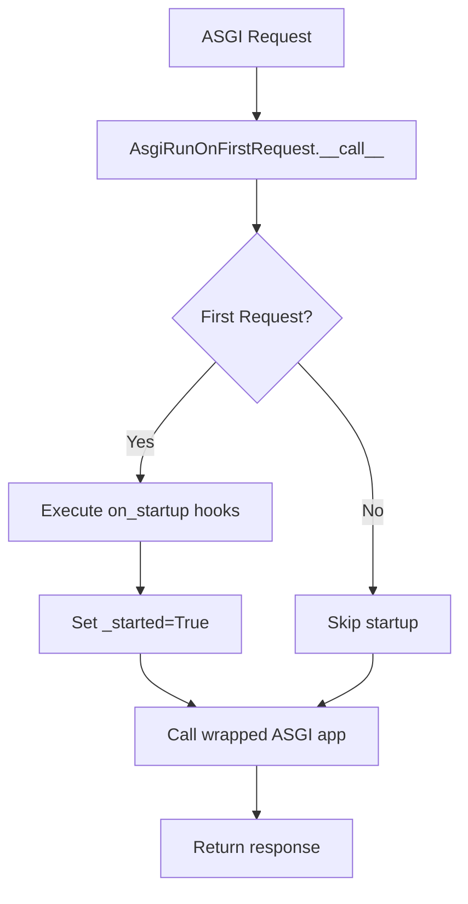

## Raises:
- AssertionError: If `on_startup` parameter is not a list

## Example:
```python
# Create startup hooks
async def initialize_database():
    # Database connection setup
    pass

async def load_cache():
    # Cache initialization
    pass

# Wrap ASGI app with startup runner
startup_hooks = [initialize_database, load_cache]
wrapped_app = AsgiRunOnFirstRequest(my_asgi_app, startup_hooks)

# Use in ASGI server - hooks execute only on first request
```

### `datasette.utils.asgi.AsgiRunOnFirstRequest.__init__` · *method*

## Summary:
Initializes an ASGI middleware that executes startup hooks exactly once before the first request.

## Description:
Configures the ASGI middleware instance with the wrapped ASGI application and startup hook functions. Sets up internal state tracking to ensure startup procedures execute only once during the application lifecycle.

## Args:
    asgi (callable): ASGI application to wrap and delegate requests to
    on_startup (list): List of async functions to execute during first request processing

## Returns:
    None: This method initializes instance attributes and performs validation

## Raises:
    AssertionError: If the on_startup parameter is not a list

## State Changes:
    Attributes READ: None
    Attributes WRITTEN: 
    - self.asgi: Stores the wrapped ASGI application
    - self.on_startup: Stores the list of startup hook functions  
    - self._started: Initializes to False to indicate startup hooks haven't executed yet

## Constraints:
    Preconditions:
    - on_startup must be a list of callable async functions
    - asgi must be a valid ASGI application callable
    
    Postconditions:
    - Instance is properly initialized with all required attributes set
    - _started flag is initialized to False

## Side Effects:
    None: This method performs no I/O, external service calls, or mutations beyond setting instance attributes

### `datasette.utils.asgi.AsgiRunOnFirstRequest.__call__` · *method*

## Summary:
Executes ASGI request handling while ensuring startup hooks are executed exactly once before the first request.

## Description:
This method implements the ASGI callable interface for the `AsgiRunOnFirstRequest` middleware. It serves as the entry point for ASGI requests, executing startup hooks only on the first request and then delegating to the wrapped ASGI application. This pattern prevents redundant initialization operations across multiple requests, making it suitable for applications that require one-time setup before handling HTTP requests.

The middleware ensures that initialization logic (such as database connections, cache warming, or configuration loading) happens exactly once during the application lifetime, rather than on every request.

## Args:
    scope (dict): ASGI scope dictionary containing request information including HTTP headers, method, path, etc.
    receive (callable): ASGI receive callable for receiving messages from the client
    send (callable): ASGI send callable for sending responses back to the client

## Returns:
    Awaitable: The result of the wrapped ASGI application's handling of the request, enabling proper ASGI protocol compliance

## Raises:
    Any exceptions raised by the startup hooks (which may occur during initialization) or the wrapped ASGI application (during request processing)

## State Changes:
    Attributes READ: self._started (to check if hooks have been executed), self.on_startup (to iterate over hooks), self.asgi (the wrapped application)
    Attributes WRITTEN: self._started (set to True after first execution to prevent duplicate hook execution)

## Constraints:
    Preconditions: 
    - The instance must be properly initialized with valid asgi and on_startup parameters
    - The on_startup parameter must be a list of awaitable functions (coroutines)
    Postconditions:
    - The _started flag is set to True after the first invocation
    - All startup hooks in on_startup are executed exactly once during the application lifetime

## Side Effects:
    - Executes startup hook functions (which may perform I/O operations, database connections, or other initialization tasks)
    - Delegates to the wrapped ASGI application for actual request processing
    - Modifies internal state by setting _started flag to True after first invocation

