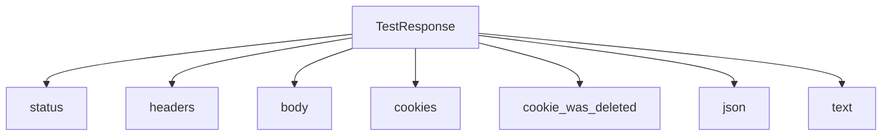
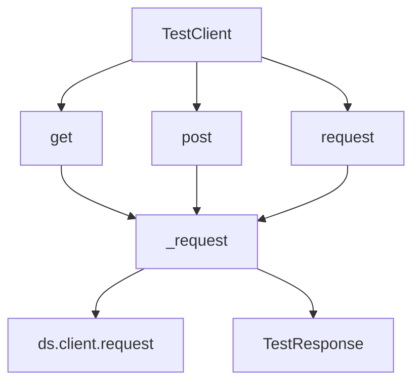

# `testing.py`

## `datasette.utils.testing.TestResponse` · *class*

## Summary:
Wrapper class that provides convenient accessors for testing HTTP responses from httpx client requests.

## Description:
The TestResponse class serves as a testing utility that wraps an httpx Response object, providing simplified property accessors and helper methods for examining HTTP response data during testing. It abstracts away the underlying httpx response structure to make test assertions more readable and concise.

This class is typically instantiated by test frameworks or test clients when making HTTP requests during integration tests. It enables developers to easily access response status codes, headers, body content, cookies, and JSON data without dealing directly with httpx's response interface.

## State:
- httpx_response: The wrapped httpx.Response object containing the actual HTTP response data
  - Type: httpx.Response (from the httpx library)
  - Valid range: Any valid httpx Response instance
  - Invariant: Must be set during initialization and remain immutable throughout the object's lifetime

## Lifecycle:
- Creation: Instantiate with an httpx.Response object via __init__
- Usage: Access properties and methods to examine response data
- Destruction: Automatic cleanup when object goes out of scope

## Method Map:


## Raises:
- None explicitly raised by __init__
- All property accessors and methods delegate to the underlying httpx_response object
- Any exceptions from httpx_response operations will propagate through to the caller

## Example:
```python
# Assuming httpx_response is a real httpx.Response object from a test request
response = TestResponse(httpx_response)

# Access response data
status_code = response.status
headers = response.headers
body_content = response.body
cookies = response.cookies
json_data = response.json
text_content = response.text

# Check if a cookie was deleted
was_deleted = response.cookie_was_deleted('session_id')
```

### `datasette.utils.testing.TestResponse.__init__` · *method*

## Summary:
Initializes a TestResponse wrapper with an httpx Response object for testing HTTP interactions.

## Description:
Constructs a TestResponse instance that wraps an httpx Response object, enabling convenient access to HTTP response data during testing. This constructor stores the provided httpx response for use by other methods in the TestResponse class that provide simplified accessors for status codes, headers, body content, cookies, and JSON data.

The TestResponse class is designed to simplify HTTP response inspection in test environments by abstracting away direct access to httpx's response interface. This constructor is typically called by test frameworks or test clients when making HTTP requests during integration tests.

## Args:
    httpx_response (httpx.Response): A valid httpx Response object containing the actual HTTP response data to be wrapped. This parameter is required and must be an instance of httpx.Response.

## Returns:
    None: This method initializes the instance and does not return a value.

## Raises:
    None: This method does not explicitly raise exceptions, though invalid httpx_response objects may cause downstream errors in other TestResponse methods.

## State Changes:
    Attributes READ: None
    Attributes WRITTEN: self.httpx_response

## Constraints:
    Preconditions: 
    - The httpx_response parameter must be a valid httpx.Response instance
    - The httpx_response object must not be None
    - The httpx_response object should contain valid HTTP response data for proper operation of other TestResponse methods
    
    Postconditions:
    - The instance will store the httpx_response parameter as self.httpx_response
    - The stored httpx_response will be used by all other TestResponse methods for data access

## Side Effects:
    None: This method performs no I/O operations or external service calls. It only stores a reference to the provided httpx_response object.

### `datasette.utils.testing.TestResponse.status` · *method*

## Summary:
Returns the HTTP status code from the wrapped httpx response object.

## Description:
Provides convenient access to the HTTP status code of an HTTP response within the testing framework. This property serves as a clean abstraction layer over the underlying httpx response object, allowing test code to easily verify HTTP response codes without direct access to the httpx library internals.

## Args:
    None

## Returns:
    int: The HTTP status code (e.g., 200, 404, 500) from the wrapped httpx response.

## Raises:
    AttributeError: If the underlying httpx_response object does not have a status_code attribute.

## State Changes:
    Attributes READ: self.httpx_response
    Attributes WRITTEN: None

## Constraints:
    Preconditions: The TestResponse instance must have been initialized with a valid httpx response object.
    Postconditions: The returned value is guaranteed to be an integer representing a valid HTTP status code.

## Side Effects:
    None

### `datasette.utils.testing.TestResponse.headers` · *method*

## Summary:
Returns the HTTP headers from the underlying httpx response object.

## Description:
Provides access to the HTTP response headers by delegating to the wrapped httpx_response object's headers attribute. This method allows test code to inspect HTTP response metadata such as content-type, status codes, and custom headers without directly accessing the underlying httpx response.

This method is typically used in testing contexts to examine HTTP response headers programmatically.

## Args:
    None

## Returns:
    httpx.Headers: An httpx Headers object containing all HTTP response headers

## Raises:
    None

## State Changes:
    Attributes READ: self.httpx_response
    Attributes WRITTEN: None

## Constraints:
    Preconditions: The TestResponse instance must have been initialized with a valid httpx_response object
    Postconditions: The returned Headers object is a direct reference to the underlying httpx response headers

## Side Effects:
    None

### `datasette.utils.testing.TestResponse.body` · *method*

## Summary:
Returns the raw binary content of the HTTP response.

## Description:
Provides access to the raw byte content of the HTTP response received during testing. This method serves as a convenient accessor for the underlying httpx response's content attribute, allowing test code to examine the raw response body without needing to access the internal httpx response object directly.

## Args:
    None

## Returns:
    bytes: The raw binary content of the HTTP response body.

## Raises:
    AttributeError: If the underlying httpx_response object does not have a content attribute.

## State Changes:
    Attributes READ: self.httpx_response
    Attributes WRITTEN: None

## Constraints:
    Preconditions: The TestResponse instance must have been initialized with a valid httpx response object that has a content attribute.
    Postconditions: The returned bytes object is immutable and represents the exact binary content of the HTTP response.

## Side Effects:
    None

### `datasette.utils.testing.TestResponse.cookies` · *method*

## Summary:
Returns a dictionary representation of the HTTP response cookies.

## Description:
Provides access to the cookies sent by the server in the HTTP response. This property extracts all cookies from the underlying httpx response object and returns them as a standard Python dictionary mapping cookie names to their values. The returned dictionary is a copy of the cookies data, so modifications to it won't affect the original response cookies.

## Args:
    None

## Returns:
    dict[str, str]: A dictionary containing all cookies from the HTTP response, where keys are cookie names and values are cookie values. Returns an empty dictionary if no cookies are present.

## Raises:
    None

## State Changes:
    Attributes READ: self.httpx_response.cookies
    Attributes WRITTEN: None

## Constraints:
    Preconditions: The TestResponse instance must have been initialized with a valid httpx_response object that has a cookies attribute.
    Postconditions: The returned dictionary is a copy of the cookies data and modifications to it won't affect the original response cookies.

## Side Effects:
    None

### `datasette.utils.testing.TestResponse.cookie_was_deleted` · *method*

## Summary:
Checks whether a specific cookie was deleted in the HTTP response by examining Set-Cookie headers.

## Description:
This method determines if a cookie was explicitly deleted by checking if any Set-Cookie header in the response contains a directive that sets the cookie to an empty string. This is a common pattern for deleting cookies in HTTP responses.

## Args:
    cookie (str): The name of the cookie to check for deletion.

## Returns:
    bool: True if a Set-Cookie header exists that starts with '{cookie}=""', indicating the cookie was deleted; False otherwise.

## State Changes:
    Attributes READ: self.httpx_response.headers, self.httpx_response.headers.get_list

## Constraints:
    Preconditions: 
    - self.httpx_response must be a valid HTTP response object with headers
    - self.httpx_response.headers must support the get_list method
    - The cookie parameter must be a non-empty string

    Postconditions:
    - The method does not modify any object state
    - Returns a boolean value indicating cookie deletion status

## Side Effects:
    None - This method only reads existing response data and performs string operations.

### `datasette.utils.testing.TestResponse.json` · *method*

## Summary:
Parses and returns the JSON content from the HTTP response body as a Python dictionary or list.

## Description:
This property provides convenient access to the JSON-decoded content of an HTTP response. It internally uses `json.loads()` to parse the response text, making it easy to work with JSON API responses in tests. This method is part of the test utilities for Datasette's testing framework.

## Args:
    None

## Returns:
    Union[dict, list, str, int, float, bool, None]: The parsed JSON content as a Python object. Returns a dictionary for JSON objects, list for JSON arrays, or primitive types for other JSON values.

## Raises:
    json.JSONDecodeError: When the response body contains invalid JSON that cannot be parsed.

## State Changes:
    Attributes READ: self.text
    Attributes WRITTEN: None

## Constraints:
    Preconditions: The response body must contain valid UTF-8 encoded text that represents valid JSON.
    Postconditions: The returned object is a Python representation of the JSON structure, with proper type mapping (objects → dicts, arrays → lists, etc.).

## Side Effects:
    None

### `datasette.utils.testing.TestResponse.text` · *method*

## Summary:
Returns the response body as a UTF-8 decoded string.

## Description:
Provides access to the HTTP response body content as a UTF-8 encoded string. This method decodes the raw bytes from the underlying HTTP response into a readable string format. It is commonly used in testing scenarios to examine the textual content of HTTP responses returned by Datasette's test client.

## Args:
    None

## Returns:
    str: The response body content decoded from UTF-8 bytes to a string.

## Raises:
    UnicodeDecodeError: If the response body contains invalid UTF-8 sequences that cannot be decoded.

## State Changes:
    Attributes READ: self.body
    Attributes WRITTEN: None

## Constraints:
    Preconditions: 
    - self.body must be bytes-like object containing valid UTF-8 encoded data
    - The TestResponse instance must have been initialized with a valid httpx_response
    
    Postconditions:
    - Returns a string representation of the response body
    - The returned string is equivalent to decoding self.body with UTF-8 encoding

## Side Effects:
    None

## `datasette.utils.testing.TestClient` · *class*

## Summary:
A test client for making HTTP requests to a Datasette instance during testing.

## Description:
The TestClient provides a convenient interface for making HTTP requests to a Datasette application during testing. It wraps asynchronous HTTP requests with synchronous helpers and handles common testing scenarios like redirects, CSRF tokens, and cookie management. This class is typically used in test suites to simulate HTTP interactions with a Datasette instance.

## State:
- ds: Datasette instance used for making requests and invoking startup
- max_redirects: Class attribute set to 5, limiting redirect following attempts

## Lifecycle:
- Creation: Instantiate with a Datasette instance (ds)
- Usage: Call get(), post(), or request() methods to make HTTP requests
- Destruction: No explicit cleanup required; relies on Python garbage collection

## Method Map:


## Raises:
- AssertionError: When both post_data and body are provided to post()
- AssertionError: When body is provided with csrftoken_from in post()
- AssertionError: When redirect count exceeds max_redirects during redirect handling

## Example:
```python
# Create test client with datasette instance
client = TestClient(datasette_instance)

# Make GET request
response = client.get("/data.json")

# Make POST request with form data
response = client.post("/submit", post_data={"key": "value"})

# Make POST request with custom body and headers
response = client.post(
    "/api/data",
    body='{"key": "value"}',
    headers={"Content-Type": "application/json"}
)

# Make request with custom method and cookies
response = client.request(
    "/api/data",
    method="PUT",
    cookies={"session_id": "abc123"}
)

# Create actor cookie for authentication
cookie = client.actor_cookie("user@example.com")
response = client.get("/admin", cookies={"ds_actor": cookie})
```

### `datasette.utils.testing.TestClient.__init__` · *method*

## Summary:
Initializes a TestClient instance with a Datasette application for making HTTP requests during testing.

## Description:
Configures the TestClient with a Datasette instance that will be used to handle HTTP requests during testing. This constructor establishes the core dependency relationship between the test client and the Datasette application being tested.

## Args:
    ds: Datasette instance used for making HTTP requests and invoking application startup routines during tests

## Returns:
    None: This method initializes the object's state but does not return a value

## Raises:
    None: This method does not raise any exceptions

## State Changes:
    Attributes READ: None
    Attributes WRITTEN: self.ds (assigned to the provided Datasette instance)

## Constraints:
    Preconditions: The ds parameter must be a valid Datasette instance
    Postconditions: The TestClient instance will have self.ds set to the provided Datasette instance

## Side Effects:
    None: This method performs no I/O operations or external service calls

### `datasette.utils.testing.TestClient.actor_cookie` · *method*

## Summary:
Creates a signed cookie token for the specified actor identity.

## Description:
Generates a cryptographically signed token that can be used as a cookie to authenticate as the given actor. This method is typically used in testing scenarios to simulate authenticated user sessions.

## Args:
    actor (str): The actor identifier to sign, typically representing a user or role in the application.

## Returns:
    str: A signed cookie string that can be used to authenticate requests as the specified actor.

## Raises:
    Exception: May raise exceptions from the underlying signing mechanism if the actor parameter is invalid or if signing fails.

## State Changes:
    Attributes READ: self.ds
    Attributes WRITTEN: None

## Constraints:
    Preconditions: The TestClient instance must have been initialized with a valid Datasette instance (self.ds).
    Postconditions: The returned string is a properly formatted signed token that follows the application's authentication scheme.

## Side Effects:
    None

### `datasette.utils.testing.TestClient.get` · *method*

## Summary:
Performs an HTTP GET request to the specified path and returns a TestResponse object for examination.

## Description:
This method executes an asynchronous HTTP GET request against the Datasette test server. It serves as a convenience wrapper around the internal `_request` method, specifically setting the HTTP method to "GET" while preserving all other request configuration options. The method is primarily used in testing scenarios to make GET requests to Datasette endpoints and inspect their responses.

The method handles redirects automatically when `follow_redirects=True` (default) and tracks redirect counts to prevent infinite loops. It supports various request customization options including cookies, headers, and conditional requests via the `if_none_match` parameter.

## Args:
    path (str): The URL path to request, e.g., "/database/table.json"
    follow_redirects (bool): Whether to follow HTTP redirects (301, 302). Defaults to False
    redirect_count (int): Internal counter tracking redirect depth to prevent infinite loops. Defaults to 0
    method (str): HTTP method to use. Hardcoded to "GET" in this wrapper. Defaults to "GET"
    cookies (dict): HTTP cookies to include in the request. Defaults to None
    if_none_match (str): Value for the If-None-Match header for conditional requests. Defaults to None

## Returns:
    TestResponse: An object wrapping the HTTP response that provides convenient accessors for status codes, headers, body content, cookies, and JSON data.

## Raises:
    AssertionError: When redirect count exceeds the maximum allowed redirects (defined by TestClient.max_redirects)
    Any exceptions raised by the underlying httpx client or Datasette's request handling

## State Changes:
    Attributes READ: self.max_redirects (used for redirect limit checking)
    Attributes WRITTEN: None

## Constraints:
    Preconditions: 
    - The TestClient must be properly initialized with a Datasette instance
    - The path parameter must be a valid URL path string
    - If follow_redirects is True, redirect_count must not exceed self.max_redirects
    
    Postconditions:
    - Returns a TestResponse object with populated response data
    - If follow_redirects is True and a redirect occurs, the final response is returned after all redirects are processed

## Side Effects:
    - Makes asynchronous HTTP requests to the Datasette test server
    - May trigger Datasette's startup hooks via self.ds.invoke_startup()
    - May perform multiple HTTP requests when following redirects
    - Uses the Datasette client's async request mechanism

### `datasette.utils.testing.TestClient.post` · *method*

*No documentation generated.*

### `datasette.utils.testing.TestClient.request` · *method*

## Summary:
Makes an asynchronous HTTP request to the specified path with configurable options and returns a TestResponse object.

## Description:
The request method provides a flexible interface for making HTTP requests during testing. It acts as a wrapper around the internal `_request` method, allowing callers to specify various HTTP parameters such as method, headers, cookies, and body content. This method is designed to be used in test suites to simulate HTTP interactions with a Datasette application.

The method handles redirects automatically when follow_redirects=True (default), up to a maximum number of redirects defined by the TestClient's max_redirects attribute. It also ensures proper startup of the datasette application before making requests.

## Args:
    path (str): The URL path to request
    follow_redirects (bool): Whether to follow HTTP redirects (301, 302). Defaults to True
    redirect_count (int): Internal counter tracking redirect depth. Defaults to 0
    method (str): HTTP method to use (GET, POST, etc.). Defaults to "GET"
    cookies (dict): HTTP cookies to send with the request. Defaults to None
    headers (dict): HTTP headers to send with the request. Defaults to None
    post_body (str): Raw body content for POST/PUT requests. Defaults to None
    content_type (str): Content-Type header value. Defaults to None
    if_none_match (str): If-None-Match header value for conditional requests. Defaults to None

## Returns:
    TestResponse: A wrapper object containing the HTTP response data including status code, headers, body, and cookies

## Raises:
    AssertionError: When redirect count exceeds max_redirects limit during redirect handling

## State Changes:
    Attributes READ: self.max_redirects
    Attributes WRITTEN: None

## Constraints:
    Preconditions: 
    - The TestClient must be properly initialized with a Datasette instance
    - If follow_redirects is True, redirect_count must be less than max_redirects to avoid assertion error
    
    Postconditions:
    - The Datasette application is initialized via invoke_startup() before making the request
    - A TestResponse object is returned with the complete HTTP response data

## Side Effects:
    - Invokes Datasette application startup via invoke_startup()
    - Makes asynchronous HTTP requests through the Datasette client
    - May perform recursive calls when handling redirects

### `datasette.utils.testing.TestClient._request` · *method*

## Summary:
Makes an asynchronous HTTP request to the specified path with optional redirect handling and returns a TestResponse object.

## Description:
This method serves as the core implementation for making HTTP requests in the test client. It invokes the dataset startup process, prepares request headers, makes the actual HTTP request through the dataset's client, and handles redirects recursively up to a configured maximum. The method is designed to be called internally by other HTTP methods like GET, POST, and REQUEST.

## Args:
    path (str): The URL path to request
    follow_redirects (bool): Whether to follow HTTP redirects (301, 302). Defaults to True
    redirect_count (int): Current redirect count for recursion tracking. Defaults to 0
    method (str): HTTP method to use (GET, POST, etc.). Defaults to "GET"
    cookies (dict): Cookies to send with the request. Defaults to None
    headers (dict): Additional headers to send with the request. Defaults to None
    post_body (str): Raw body content for POST requests. Defaults to None
    content_type (str): Content-Type header value. Defaults to None
    if_none_match (str): If-None-Match header value for conditional requests. Defaults to None

## Returns:
    TestResponse: A wrapper object containing the HTTP response data including status code, headers, body, and cookies

## Raises:
    AssertionError: When redirect count exceeds the maximum allowed redirects (default 5)

## State Changes:
    Attributes READ: self.ds, self.max_redirects
    Attributes WRITTEN: None

## Constraints:
    Preconditions: 
    - self.ds must be a valid Datasette instance with a client attribute
    - redirect_count must be non-negative integer
    - path must be a valid URL path string
    
    Postconditions:
    - The dataset startup process is invoked before making the request
    - If follow_redirects is True and response is 301/302, the redirect chain is followed up to max_redirects limit
    - A TestResponse object is always returned

## Side Effects:
    - Invokes dataset startup process via self.ds.invoke_startup()
    - Makes asynchronous HTTP request via self.ds.client.request()
    - May make multiple recursive calls to self._request() when following redirects

