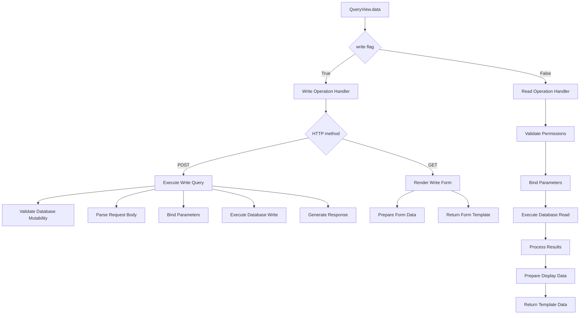
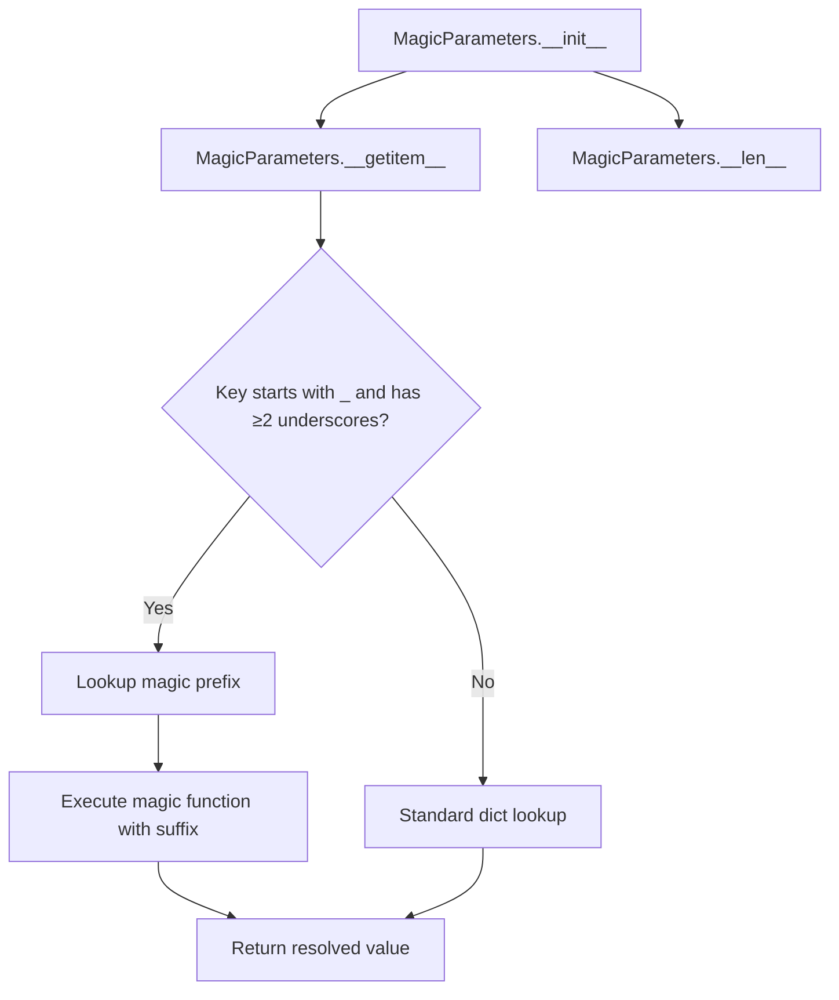

# `database.py`

## `datasette.views.database.DatabaseView` · *class*

## Summary:
A view class that handles database-level HTTP requests, providing structured data for rendering database-specific pages including tables, views, and queries.

## Description:
DatabaseView is a specialized view handler that processes HTTP requests for database information in the Datasette application. It serves as the backend for database pages, gathering metadata about database contents including tables, views, and canned queries while enforcing appropriate access controls. The class is designed to work with Datasette's permission system and provides data structures suitable for template rendering.

This class is typically instantiated by Datasette's routing system when handling requests to database endpoints, such as `/database-name` or `/database-name?sql=...`. It supports both regular database browsing and direct SQL query execution.

## State:
- `name`: Class attribute set to "database", identifying this view type
- `ds`: Datasette instance inherited from DataView parent class
- All state is derived from request processing rather than persistent attributes

## Lifecycle:
- Creation: Instantiated automatically by Datasette's routing mechanism when handling database URLs
- Usage: Called via `data()` method when handling HTTP requests to database endpoints
- Destruction: No explicit cleanup required, managed by Python garbage collection

## Method Map:
```mermaid
graph TD
    A[request] --> B[DatabaseView.data()]
    B --> C{sql parameter present?}
    C -->|Yes| D[QueryView.data()] --> G[Return result]
    C -->|No| E[Gather database metadata]
    E --> F[Gather tables with visibility checks]
    F --> H[Gather views with visibility checks]
    H --> I[Gather queries with visibility checks]
    I --> J[Build final context]
    J --> G[Return structured data tuple]
```

## Raises:
- `NotFound`: When the requested database route doesn't exist (KeyError from get_database)
- `Forbidden`: When the user lacks permission to view the database

## Example:
```python
# Typical usage would be handled by Datasette's routing system
# This creates a DatabaseView instance and calls data() method
# with a request object containing URL variables and query parameters

# Example request structure:
# request.url_vars["database"] = "my_database"
# request.args.get("sql") = "SELECT * FROM my_table"
# request.actor = {"id": "user123"}

# The data() method returns a 3-tuple:
# (context_dict, template_context_dict, template_name_tuple)
# 
# context_dict contains:
# - database: database name
# - private: boolean indicating if database is private
# - path: URL path to database
# - size: database file size
# - tables: list of visible tables with metadata
# - hidden_count: count of hidden tables
# - views: list of visible views
# - queries: list of visible canned queries
# - allow_execute_sql: boolean indicating if SQL execution is allowed
#
# template_context_dict contains:
# - database_actions: async function returning additional action links
# - show_hidden: boolean indicating if hidden items should be shown
# - editable: always True
# - metadata: database metadata
# - allow_download: boolean indicating if download is allowed
# - attached_databases: list of attached database names
```

### `datasette.views.database.DatabaseView.data` · *method*

## Summary:
Retrieves and structures database metadata, tables, views, and queries for display in the Datasette web interface.

## Description:
The `data` method in `DatabaseView` serves as the primary data provider for database-specific pages in Datasette. It gathers comprehensive information about a database including its tables, views, and canned queries, while enforcing proper access controls and permissions. The method handles both regular database browsing and SQL query execution paths, making it central to Datasette's database exploration functionality.

This method is called during the HTTP request lifecycle when users navigate to database-specific URLs (like `/database`) or execute SQL queries against databases. It orchestrates permission checking, data gathering from the database, and prepares structured data for template rendering.

## Args:
    request: ASGI request object containing URL parameters, query arguments, and authentication information
    default_labels: Boolean flag for default label handling (default: False)
    _size: Internal parameter for size calculation (default: None)

## Returns:
    tuple: A 3-tuple containing:
        - Dictionary with database metadata including name, path, size, tables, views, queries, and permissions
        - Dictionary with rendering context including database actions, visibility settings, and configuration
        - Tuple of template names for rendering the database page

## Raises:
    Forbidden: When the requesting actor lacks permission to view the database
    NotFound: When the requested database route does not exist

## State Changes:
    Attributes READ:
        - self.ds: Datasette instance for database access and permission checking
    Attributes WRITTEN:
        - None: This method is read-only and doesn't modify instance state

## Constraints:
    Preconditions:
        - Request must contain a valid database route in url_vars["database"]
        - User must be authenticated (request.actor must be available)
        - Database must exist and be accessible through self.ds.get_database()
        
    Postconditions:
        - All returned data respects user permissions and visibility settings
        - Tables and views are filtered based on user access rights
        - SQL query execution path is properly validated when requested

## Side Effects:
    - Database queries to fetch table counts, column information, foreign keys
    - Permission checking calls to self.ds.check_visibility()
    - Plugin hook invocations via pm.hook.database_actions()
    - Potential I/O operations for database metadata retrieval

## `datasette.views.database.DatabaseDownload` · *class*

## Summary:
Handles HTTP requests to download SQLite database files from a Datasette instance.

## Description:
The DatabaseDownload class implements a view that allows authorized users to download SQLite database files from the Datasette application. It performs comprehensive permission checks, validates database properties, and streams the database file to the client using ASGI file download mechanisms. This view is typically accessed via URL patterns ending in `/download`.

## State:
- name (str): Class attribute set to "database_download" identifying this view
- self.ds: Datasette instance providing access to databases, settings, and permission management
- database (str): Decoded database name from URL variables using tilde_decode function
- db: Database object retrieved from Datasette instance containing database metadata including path, hash, and mutability status

## Lifecycle:
- Creation: Automatically instantiated by Datasette's routing system for matching URL patterns
- Usage: Called via HTTP GET request to database download endpoint (e.g., `/database.db/download`)
- Destruction: No explicit cleanup required; object is ephemeral per request

## Method Map:
```mermaid
flowchart TD
    A[HTTP GET request] --> B[DatabaseDownload.get]
    B --> C[Decode database name from URL]
    C --> D[Check permissions for view-database-download, view-database, and view-instance]
    D --> E[Retrieve database object by route]
    E --> F[Validate database is not in-memory]
    F --> G[Validate download is allowed and database is not mutable]
    G --> H[Validate database has a file path]
    H --> I[Setup HTTP headers (CORS, ETag)]
    I --> J[Check for conditional request (304 Not Modified)]
    J --> K[Create AsgiFileDownload with file path and headers]
    K --> L[Return AsgiFileDownload for file streaming]
```

## Raises:
- DatasetteError: Raised when database doesn't exist (404), is in-memory (404), or cannot be downloaded (404)
- Forbidden: Raised when download permissions are denied due to configuration (allow_download=False) or database mutability

## Example:
```python
# Typical usage via HTTP request:
# GET /my_database.db/download

# This would:
# 1. Decode the database name from URL (handling tilde encoding)
# 2. Validate user permissions for viewing database and downloading
# 3. Locate the database file on disk
# 4. Check if download is permitted (based on settings and database properties)
# 5. Stream the file with appropriate HTTP headers including ETag and CORS support
```

### `datasette.views.database.DatabaseDownload.get` · *method*

## Summary:
Handles HTTP GET requests to download database files by validating permissions, checking database properties, and returning a streaming file download response.

## Description:
This asynchronous method processes incoming GET requests to download SQLite database files from the Datasette instance. It performs comprehensive validation including permission checks, database existence verification, and download restrictions. The method supports conditional requests via ETags and CORS headers, and returns a streaming file download response for large database files.

## Args:
    request (Request): ASGI request object containing URL variables and headers, including database name in url_vars["database"]

## Returns:
    AsgiFileDownload: Response object configured for streaming database file download with appropriate headers

## Raises:
    DatasetteError: When database is invalid, in-memory, or cannot be downloaded due to configuration
    Forbidden: When database download is forbidden due to settings or database mutability
    NotFound: When database is not found (inherited from KeyError handling)

## State Changes:
    Attributes READ:
    - self.ds: Datasette instance for permission checking and database access
    - self.ds.cors: CORS configuration flag
    - self.ds.setting(): Configuration settings access
    - db.is_memory: Database property indicating if it's an in-memory database
    - db.is_mutable: Database property indicating if it's mutable
    - db.path: Database file path
    - db.hash: Database hash for ETag generation
    - request.url_vars["database"]: URL variable containing database name
    - request.headers: HTTP headers including if-none-match for conditional requests

    Attributes WRITTEN:
    - None: This method doesn't modify any instance attributes

## Constraints:
    Preconditions:
    - Request must contain a valid database name in url_vars["database"]
    - User must have view-database-download, view-database, and view-instance permissions
    - Database must exist and be accessible
    - Database must not be in-memory
    - Database must have a valid file path
    - Instance must allow downloads (allow_download setting enabled)
    - Database must not be mutable

    Postconditions:
    - If ETag matches, returns 304 Not Modified response
    - If successful, returns AsgiFileDownload with proper headers
    - All headers are properly configured for CORS and transfer encoding

## Side Effects:
    - Performs permission checks against Datasette instance
    - Reads database file from disk (I/O operation)
    - May return early with HTTP 304 response for conditional requests
    - Sets CORS headers when enabled
    - Sets ETag header for caching support
    - Configures Transfer-Encoding header for chunked transfer

## `datasette.views.database.QueryView` · *class*

## Summary:
Handles SQL query execution and rendering for Datasette database views, supporting both read-only and write operations with parameter binding and template-based responses.

## Description:
QueryView is a specialized view handler that processes SQL queries submitted through HTTP requests. It manages database access control, validates SQL queries, binds named parameters, executes queries against SQLite databases, and renders results using Jinja2 templates. The class supports both read-only queries (SELECT statements) and write operations (INSERT, UPDATE, DELETE) with appropriate security checks and user feedback mechanisms.

The view handles both GET and POST requests, where GET requests typically render forms or results, and POST requests execute write operations. It supports canned queries defined in metadata, parameter validation, and various query options like time limits and page sizes. The class returns structured data that can be used by Datasette's template rendering system to generate appropriate HTTP responses.

## State:
- `ds`: Datasette instance providing access to databases, permissions, and settings
- `request`: ASGI request object containing HTTP request data
- `sql`: SQL query string to be executed
- `editable`: Boolean flag indicating if the query can be edited (default: True)
- `canned_query`: Name of predefined query if applicable (default: None)
- `metadata`: Configuration metadata for the query (default: None)
- `write`: Boolean flag indicating if operation is write vs read (default: False)

## Lifecycle:
- Creation: Instantiated by Datasette's routing system when handling database query endpoints
- Usage: Called via the `data()` method with request and SQL parameters
- Method execution flow:
  1. Validate database access and permissions
  2. Parse and validate SQL query parameters
  3. Execute query (read or write) based on flags
  4. Process results and prepare template data
  5. Return tuple of (template_context, async_template_function, template_names, status_code)

## Method Map:


## Raises:
- Forbidden: When user lacks permission to view/query or execute SQL
- NotFound: When requested database is not found
- sqlite3.DatabaseError: When SQL query execution fails

## Example:
```python
# Read query execution
# GET /database.sql?sql=SELECT+*+FROM+users
# Returns HTML template with query results

# Write query execution  
# POST /database.sql?sql=UPDATE+users+SET+name=:name
# With form data: name=John
# Returns JSON response with success/failure status

# Canned query execution
# GET /database.sql?sql=SELECT+*+FROM+users&canned_query=top_users
# Uses predefined query configuration from metadata

# Write with JSON response
# POST /database.sql?sql=DELETE+FROM+users+WHERE+id=:id&_json=1
# With form data: id=123
# Returns JSON response: {"ok": true, "message": "Query executed, 1 row affected"}
```

### `datasette.views.database.QueryView.data` · *method*

## Summary:
Processes SQL queries for database views, handling both read and write operations with permission checks, parameter management, and template rendering.

## Description:
This asynchronous method serves as the core handler for executing SQL queries in Datasette's database views. It manages both read-only queries and write operations (INSERT, UPDATE, DELETE), performs comprehensive permission checks, processes query parameters, and prepares data for template rendering. The method supports both HTML and JSON responses and handles various query execution scenarios including canned queries and custom SQL.

## Args:
    self: The QueryView instance
    request: ASGI request object containing URL variables, query parameters, and HTTP headers
    sql (str): The SQL query string to execute
    editable (bool): Whether the query is editable, defaults to True
    canned_query (str, optional): Name of a predefined query if this is a canned query
    metadata (dict, optional): Metadata associated with the query
    _size (int, optional): Page size limit for query results
    named_parameters (list, optional): List of named parameters in the SQL query
    write (bool): Whether this is a write operation, defaults to False

## Returns:
    For write operations (when write=True):
        - When POST request: Response object with JSON result or redirects
        - When GET request: Tuple containing context dictionary, async template function, and template list
    
    For read operations (when write=False):
        - Tuple containing:
          * Context dictionary with query results and metadata
          * Async template function for rendering additional template data
          * Template list for rendering
          * HTTP status code (400 for errors, 200 for success)

## Raises:
    Forbidden: When user lacks permission to view/query database or execute SQL
    NotFound: When requested database is not found
    Exception: Various exceptions during query execution or parameter processing

## State Changes:
    Attributes READ:
        - self.ds (Datasette instance)
        - self.ds.get_database()
        - self.ds.check_visibility()
        - self.ds.ensure_permissions()
        - self.ds.execute()
        - self.ds.permission_allowed()
        - self.ds.settings_dict()
        - self.ds.urls
        - self.ds.add_message()
        - self.ds.INFO
        - self.ds.ERROR
    
    Attributes WRITTEN:
        - self.ds.add_message() (side effect of adding messages to request)
        - self.redirect() (side effect of redirecting)

## Constraints:
    Preconditions:
        - Valid request object with proper URL variables and parameters
        - Database route must be valid and accessible
        - User must have appropriate permissions for the requested operation
        - SQL query must be properly formatted
    
    Postconditions:
        - For read operations: Results are properly formatted for display
        - For write operations: Database changes are applied or error is reported
        - Appropriate HTTP status codes are returned
        - Template contexts are properly constructed

## Side Effects:
    - Database query execution (read/write operations)
    - HTTP response generation (JSON or HTML)
    - Redirects to other URLs
    - Message addition to request context
    - Template rendering preparation
    - Potential file downloads for binary data

## `datasette.views.database.MagicParameters` · *class*

## Summary:
A dictionary subclass that provides special handling for "magic" parameters through plugin hooks.

## Description:
MagicParameters extends Python's built-in dict to support dynamic parameter resolution. When accessing parameters with keys that start with "_" and contain at least two underscores (like "_prefix_suffix"), it attempts to resolve them using registered magic functions from Datasette plugins. This allows plugins to define custom parameter processing logic that can transform or compute values dynamically.

The class is typically instantiated by Datasette's view system when processing HTTP requests that contain special parameter patterns requiring plugin-defined behavior.

## State:
- `_request`: HTTP request object passed during initialization
- `_magics`: Dictionary mapping magic prefixes to their resolver functions, populated from plugin hooks
- `data`: The underlying dictionary data inherited from the parent dict class

## Lifecycle:
- Creation: Instantiated with data (dict), request (ASGI request), and datasette (Datasette instance)
- Usage: Parameters are accessed via standard dictionary access (`__getitem__`) which triggers special magic resolution logic
- Destruction: Inherits standard dict cleanup behavior

## Method Map:


## Raises:
- None explicitly raised by __init__
- KeyError may be raised by parent dict operations when keys don't exist

## Example:
```python
# Typical instantiation (internal to Datasette)
params = MagicParameters({'table': 'users'}, request, datasette)

# Accessing regular parameter
table_name = params['table']  # Returns 'users'

# Accessing magic parameter (if plugin registers '_foo_bar' magic)
magic_value = params['_foo_bar']  # Resolves using registered magic function
```

### `datasette.views.database.MagicParameters.__init__` · *method*

## Summary:
Initializes a MagicParameters instance by setting up request handling and collecting magic parameter definitions from plugins.

## Description:
This constructor initializes the MagicParameters object by calling the parent DataView constructor, storing the HTTP request object, and gathering magic parameter definitions from all registered plugins through the plugin hook system. Magic parameters are special query parameters that provide enhanced functionality beyond standard SQL queries.

## Args:
    data: Data passed to the parent DataView constructor, typically containing database connection and query information
    request: HTTP request object containing query parameters and request context from the ASGI framework
    datasette: Datasette application instance used to query plugin hooks for magic parameter definitions

## Returns:
    None

## Raises:
    None explicitly raised

## State Changes:
    Attributes READ: None
    Attributes WRITTEN: 
        - self._request: Stores the provided request object for later parameter processing
        - self._magics: Dictionary mapping magic parameter names to their definitions/processing functions collected from plugins

## Constraints:
    Preconditions:
        - datasette parameter must be a valid Datasette application instance with plugin system initialized
        - data parameter should be compatible with DataView initialization
        - request parameter should be a valid HTTP request object with query parameters available
    
    Postconditions:
        - self._request is set to the provided request object
        - self._magics contains a dictionary of magic parameter definitions from all plugins, where keys are parameter names and values are their configuration

## Side Effects:
    - Calls plugin hook system (pm.hook.register_magic_parameters) which may involve plugin loading and execution
    - May trigger plugin initialization or setup processes during hook execution

### `datasette.views.database.MagicParameters.__len__` · *method*

## Summary:
Returns the length of the MagicParameters collection, ensuring a minimum length of 1.

## Description:
Implements Python's special `__len__` method to provide the number of key-value pairs in the MagicParameters collection. Unlike standard dictionary length behavior, this method returns `super().__len__() or 1`, which means it will return the actual count of parameters unless that count is 0 or None, in which case it defaults to 1.

This special behavior ensures that even empty parameter collections report a length of 1, which is likely required by downstream systems that expect a minimum parameter count for proper processing or display purposes.

The method is implemented as a separate method rather than being inlined because it provides specialized behavior that differs from standard dictionary length semantics, and it follows Python's standard collection interface conventions to enable intuitive usage patterns like `len(magic_params)`.

## Args:
    None

## Returns:
    int: The number of key-value pairs in the collection, or 1 if the collection is empty (length 0).

## Raises:
    None

## State Changes:
    Attributes READ: None (reads no instance attributes)
    Attributes WRITTEN: None (modifies no instance attributes)

## Constraints:
    Preconditions: The instance must be properly initialized with valid dictionary data
    Postconditions: The method returns an integer count without modifying the object state

## Side Effects:
    None: This method performs no I/O operations, external service calls, or mutations to objects outside self

### `datasette.views.database.MagicParameters.__getitem__` · *method*

## Summary:
Handles dictionary-style access to magic parameters by delegating to registered magic handlers when keys follow the "_prefix_suffix" pattern.

## Description:
This method implements custom dictionary key access for the MagicParameters class, enabling special "magic" parameter handling. When a key follows the pattern of starting with "_" followed by at least two underscores (e.g., "_format_json"), it attempts to process the key using registered magic handlers. This allows for dynamic parameter interpretation and transformation without requiring explicit handling in the main parameter processing logic.

The method is typically called during HTTP request parameter processing in Datasette's web framework, where special parameters need to be interpreted dynamically rather than treated as literal values.

## Args:
    key (str): The dictionary key being accessed

## Returns:
    Any: The value associated with the key, either from magic processing or the parent class implementation

## Raises:
    KeyError: When a magic parameter key is not found in the magic handlers and the parent class also doesn't find it

## State Changes:
    Attributes READ: self._magics, self._request
    Attributes WRITTEN: None

## Constraints:
    Preconditions: 
    - The key must be a string
    - The class must have _magics and _request attributes initialized
    - Magic handlers in _magics must accept (suffix, request) parameters
    
    Postconditions:
    - Returns appropriate value for valid keys
    - Falls back to parent class behavior for invalid or non-magic keys

## Side Effects:
    None

