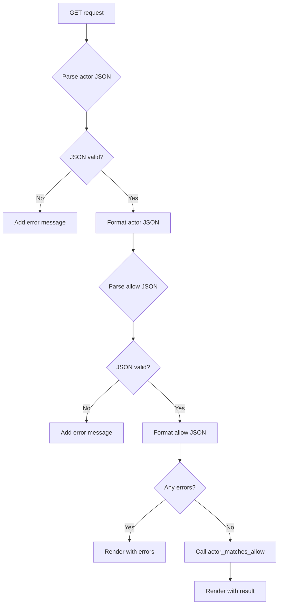

# `special.py`

## `datasette.views.special.JsonDataView` · *class*

## Summary:
JsonDataView is a specialized view class that serves JSON-formatted data either as a direct JSON response or rendered in an HTML template, depending on the request format.

## Description:
This class implements a view for serving JSON data in Datasette. It provides flexibility in how JSON data is delivered - either as a raw JSON response for API consumption or as an HTML-rendered page for human readability. The view requires a callback function to generate the actual data and supports conditional request handling based on whether the callback needs the request object.

## State:
- ds (Datasette instance): Reference to the Datasette application instance
- filename (str): Name of the JSON file/resource being served
- data_callback (callable): Function that generates the JSON data; can be called with or without a request parameter based on needs_request flag
- needs_request (bool): Flag indicating whether the data_callback requires a request parameter; defaults to False

## Lifecycle:
- Creation: Instantiate with datasette, filename, data_callback, and optional needs_request flag
- Usage: Call the get() method with an ASGI request object to handle HTTP GET requests
- Destruction: No explicit cleanup required; relies on Python garbage collection

## Method Map:
```mermaid
graph TD
    A[get(request)] --> B{as_format}
    B -->|True| C[ensure_permissions]
    B -->|False| D[ensure_permissions]
    C --> E[data_callback(request)]
    D --> F[data_callback()]
    E --> G[JSON Response]
    F --> G
    G --> H[Return JSON Response]
    D --> I[Render HTML Template]
    I --> J[Return HTML Response]
```

## Raises:
- Forbidden: Raised by ensure_permissions when the requesting actor doesn't have view-instance permission
- Any exceptions raised by data_callback function during data generation

## Example:
```python
# Create a JSON data view
def my_data_callback():
    return {"message": "Hello World", "count": 42}

view = JsonDataView(datasette_instance, "example.json", my_data_callback)

# In a request handler, call:
# await view.get(request)
# This would either return JSON directly or render HTML based on request format
```

### `datasette.views.special.JsonDataView.__init__` · *method*

## Summary:
Initializes a JsonDataView instance with datasette reference, filename, data callback function, and request requirement flag.

## Description:
Configures the JsonDataView instance with essential components for serving JSON data. This method establishes the core dependencies needed for the view to function, including the Datasette application instance, resource identifier, data generation callback, and request handling preferences.

## Args:
    datasette: Datasette instance providing application context and utilities
    filename (str): Name of the JSON file/resource being served
    data_callback: Callable function that generates the JSON data to be served
    needs_request (bool): Flag indicating whether the data_callback requires a request parameter; defaults to False

## Returns:
    None: This method initializes instance attributes and does not return a value

## Raises:
    None: This method does not raise exceptions directly

## State Changes:
    Attributes READ: No attributes are read from self
    Attributes WRITTEN: 
    - self.ds: Assigned the datasette parameter
    - self.filename: Assigned the filename parameter  
    - self.data_callback: Assigned the data_callback parameter
    - self.needs_request: Assigned the needs_request parameter

## Constraints:
    Preconditions:
    - datasette must be a valid Datasette instance
    - filename must be a string identifying the resource
    - data_callback must be callable
    - needs_request must be a boolean value

    Postconditions:
    - All instance attributes are properly initialized
    - The view is ready for use in the get() method

## Side Effects:
    None: This method performs only attribute assignment with no external I/O or side effects

### `datasette.views.special.JsonDataView.get` · *method*

## Summary:
Returns JSON-formatted data either as a direct HTTP JSON response or rendered in an HTML template based on URL format parameter.

## Description:
This asynchronous method handles requests for JSON data, supporting both direct JSON output and HTML rendering modes. When the URL contains a format parameter, it returns JSON data directly as an HTTP response with appropriate CORS headers. Otherwise, it renders the JSON data in an HTML template for display in a web browser. The method performs permission checking before accessing the data.

## Args:
    request (Request): ASGI request object containing URL variables and actor information
    - request.url_vars["format"] (str, optional): Format specifier that determines response type

## Returns:
    Response: HTTP response object containing either:
    - Raw JSON data with content-type "application/json; charset=utf-8" when format parameter exists
    - Rendered HTML template showing formatted JSON data when no format parameter exists

## Raises:
    Forbidden: When the requesting actor lacks the "view-instance" permission

## State Changes:
    Attributes READ: 
    - self.ds (Datasette instance)
    - self.needs_request (boolean flag indicating if data_callback requires request argument)
    - self.data_callback (callable method returning JSON data)
    - self.filename (string filename for HTML template context)
    - self.ds.cors (boolean flag for CORS header inclusion)

## Constraints:
    Preconditions:
    - Request must contain a "format" URL variable in url_vars
    - Request actor must have "view-instance" permission
    - Data callback method must be callable with or without arguments based on needs_request flag
    
    Postconditions:
    - If format parameter exists: returns Response with JSON content-type and CORS headers if enabled
    - If no format parameter exists: returns rendered HTML template with formatted JSON data

## Side Effects:
    - Makes asynchronous call to datasette instance for permission checking via ensure_permissions
    - Calls data_callback method which may perform database queries or other operations
    - May add CORS headers to response when self.ds.cors is True
    - Renders HTML template with JSON data using self.render method

## `datasette.views.special.PatternPortfolioView` · *class*

## Summary:
A view class that handles HTTP GET requests for the pattern portfolio page, requiring instance view permission.

## Description:
This class implements a special view handler for displaying pattern-related content in the Datasette application. It serves as a dedicated endpoint for accessing pattern portfolio functionality and requires appropriate authorization before rendering the patterns.html template. The view is registered under the name "patterns" and does not support JSON alternate formats.

## State:
- name: str = "patterns" - The identifier used to register this view in the routing system
- has_json_alternate: bool = False - Indicates this view does not support JSON response format

## Lifecycle:
- Creation: Instantiated automatically by the Datasette framework when setting up special views
- Usage: Called by the ASGI framework when handling GET requests to the /patterns endpoint
- Destruction: Managed by the framework's view lifecycle

## Method Map:
```mermaid
graph TD
    A[GET request to /patterns] --> B[get()]
    B --> C[ensure_permissions(actor, ["view-instance"])]
    C --> D[render(["patterns.html"], request)]
    D --> E[Response]
```

## Raises:
- Forbidden: Raised when the request actor does not have the "view-instance" permission

## Example:
```python
# Framework-created instance (automatically handled by Datasette)
# When a user accesses /patterns endpoint:
# 1. Request arrives to GET /patterns
# 2. PatternPortfolioView.get() is invoked
# 3. Permission check occurs for "view-instance" 
# 4. patterns.html template is rendered with request context
# 5. Response is returned to client
```

### `datasette.views.special.PatternPortfolioView.get` · *method*

## Summary:
Handles GET requests for the pattern portfolio view by validating permissions and rendering the patterns template.

## Description:
This method serves as the HTTP GET handler for the pattern portfolio endpoint. It validates that the requesting actor has permission to view the instance before rendering the patterns.html template. This separation allows for proper access control while delegating the presentation logic to the template rendering system.

## Args:
    request: ASGI request object containing the client's request information

## Returns:
    Response object returned by the render method

## Raises:
    Exception: May raise exceptions from ensure_permissions or render methods

## State Changes:
    Attributes READ: self.ds (datasette instance)
    Attributes WRITTEN: None

## Constraints:
    Preconditions: The method assumes self.ds exists and has an ensure_permissions method
    Postconditions: Returns a Response object from the render method

## Side Effects:
    I/O: Calls the datasette instance's ensure_permissions method which may involve database queries
    External service calls: May invoke permission checking mechanisms that could involve external services

## `datasette.views.special.AuthTokenView` · *class*

## Summary:
Handles authentication token validation and session establishment for Datasette admin access.

## Description:
The AuthTokenView class provides endpoint functionality for authenticating users via a root token. When a valid token is provided, it establishes an authenticated session by setting a secure cookie and redirecting to the main instance page. This view is typically used during initial setup or manual authentication flows where administrators need to gain access to Datasette's administrative features.

This class serves as a security mechanism to allow trusted users to authenticate without going through a full login process, by providing a pre-established root token.

## State:
- name: str = "auth_token" - Identifies this view in the routing system
- has_json_alternate: bool = False - Indicates this view doesn't support JSON responses
- ds._root_token: str or None - Internal root token stored in the datasette instance; becomes None after use
- request.args.get("token"): str - Token parameter extracted from the HTTP GET request

## Lifecycle:
- Creation: Instantiated automatically by Datasette's routing system when a request matches the auth_token route
- Usage: Called via HTTP GET requests containing a "token" parameter
- Destruction: No explicit cleanup required; view is stateless and ephemeral

## Method Map:
```mermaid
graph TD
    A[GET request with token] --> B[AuthTokenView.get()]
    B --> C{Root token exists?}
    C -->|No| D[Forbidden("Root token has already been used")]
    C -->|Yes| E[Compare token securely]
    E --> F{Tokens match?}
    F -->|No| G[Forbidden("Invalid token")]
    F -->|Yes| H[Clear root token]
    H --> I[Set ds_actor cookie]
    I --> J[Redirect to instance]
```

## Raises:
- Forbidden: Raised when the root token has already been used or when an invalid token is provided
- Forbidden("Root token has already been used"): Triggered when self.ds._root_token is None
- Forbidden("Invalid token"): Triggered when the provided token doesn't match the expected root token

## Example:
```python
# User visits: /-/auth_token?token=abc123xyz
# If token matches self.ds._root_token:
#   - Sets ds_actor cookie with root actor signature
#   - Redirects to main instance page (/)
#   - Clears the root token so it can't be reused
# If token doesn't match:
#   - Raises Forbidden("Invalid token")
```

### `datasette.views.special.AuthTokenView.get` · *method*

## Summary:
Validates a root authentication token and establishes a session for root access.

## Description:
Processes authentication requests by validating a provided root token against the stored root token. On successful validation, it invalidates the root token, sets an authentication cookie, and redirects to the main instance page. This method serves as the endpoint for root token-based authentication in the Datasette application.

## Args:
    request: ASGI request object containing query parameters with the token

## Returns:
    Response: Redirect response to the instance URL with authentication cookie set

## Raises:
    Forbidden: When the root token has already been used or when the provided token is invalid

## State Changes:
    Attributes READ: self.ds._root_token
    Attributes WRITTEN: self.ds._root_token (set to None)

## Constraints:
    Preconditions: The method assumes self.ds._root_token exists and contains the valid root token
    Postconditions: After successful authentication, the root token is invalidated and a session cookie is established

## Side Effects:
    I/O: Sets a cookie on the response object
    External service calls: Uses datasette's sign method for cookie signing
    Mutations: Modifies the datasette instance's _root_token attribute

## `datasette.views.special.LogoutView` · *class*

## Summary:
LogoutView handles user logout functionality by processing GET and POST requests to invalidate session cookies and redirect users.

## Description:
This view manages the logout process for authenticated users in the Datasette application. When accessed via GET request, it displays a logout confirmation page if the user is authenticated, or redirects to the main instance page if not authenticated. When accessed via POST request, it invalidates the authentication cookie and redirects back to the main instance page.

The view is registered under the name "logout" and is part of the special views in Datasette's routing system.

## State:
- name: str - Set to "logout", identifying this view in the routing system
- has_json_alternate: bool - Set to False, indicating this view doesn't support JSON responses
- ds: Datasette instance - Provides access to application services such as URL generation and messaging
- request.actor: Actor object or None - Contains authentication information for the current user

## Lifecycle:
- Creation: Instantiated automatically by the framework when routing matches the "logout" view name
- Usage: Framework calls either get() or post() method based on HTTP request method
- Destruction: No explicit cleanup required, managed by framework lifecycle

## Method Map:
```mermaid
graph TD
    A[GET request] --> B{request.actor}
    B -- No actor --> C[Response.redirect(self.ds.urls.instance())]
    B -- Has actor --> D[self.render(logout.html, request, {"actor": request.actor})]
    A --> E[POST request]
    E --> F[Response.redirect(self.ds.urls.instance())]
    F --> G[response.set_cookie("ds_actor", "", expires=0, max_age=0)]
    G --> H[self.ds.add_message(request, "You are now logged out", self.ds.WARNING)]
```

## Raises:
- None explicitly raised by LogoutView.__init__
- Response.redirect() may raise exceptions in edge cases (framework-specific)
- The render method may raise exceptions if template rendering fails

## Example:
```python
# Framework automatically instantiates this view
# GET /-/logout (when authenticated) -> renders logout.html with actor context
# GET /-/logout (when not authenticated) -> redirects to /
# POST /-/logout -> clears ds_actor cookie, adds logout message, redirects to /
```

### `datasette.views.special.LogoutView.get` · *method*

## Summary:
Handles GET requests for the logout page, redirecting unauthenticated users or rendering the logout template for authenticated users.

## Description:
This method processes HTTP GET requests to the logout endpoint. It verifies if a user is currently authenticated via the request.actor attribute. If no actor is present (user not logged in), it redirects to the main instance page. If an actor exists (user is logged in), it renders the logout.html template with the current actor's information.

## Args:
    request: ASGI request object containing the HTTP request data and authentication context

## Returns:
    Response object: Either a redirect response to the instance page or a rendered HTML response with the logout template

## Raises:
    None explicitly raised in this method

## State Changes:
    Attributes READ: 
    - request.actor: Used to determine authentication status
    - self.ds: Used to access urls instance
    - self: Used to access render method

## Constraints:
    Preconditions:
    - request must be a valid ASGI request object
    - request.actor must be accessible (can be None)
    - self.ds must be initialized with urls attribute
    - self.render method must be available

    Postconditions:
    - Returns a Response object appropriate for the authentication state
    - If authenticated, the logout template is rendered with actor data
    - If not authenticated, redirects to the main instance page

## Side Effects:
    I/O: May involve HTTP response generation and redirection
    External service calls: Potentially involves URL generation through self.ds.urls.instance()

### `datasette.views.special.LogoutView.post` · *method*

## Summary:
Handles user logout by clearing authentication cookies and redirecting to the main instance page.

## Description:
This asynchronous method processes POST requests to log out users. It performs the logout operation by clearing the authentication cookie, adding a success message, and redirecting the user back to the main instance page. This method is designed as a dedicated endpoint for logout functionality rather than being inlined in other views.

## Args:
    request: ASGI request object containing the logout request details

## Returns:
    Response: HTTP redirect response to the instance URL with cleared authentication cookie

## Raises:
    None explicitly raised, but may propagate exceptions from underlying methods like Response.redirect()

## State Changes:
    Attributes READ: 
        - self.ds (Datasette instance)
        - self.ds.urls (URL generation utilities)
        - self.ds.WARNING (warning message constant)
    Attributes WRITTEN: 
        - None directly modified on self

## Constraints:
    Preconditions:
        - Method must be called via POST request
        - self.ds must be initialized and accessible
        - Request object must be valid ASGI request
    Postconditions:
        - Authentication cookie "ds_actor" is cleared
        - User receives a logout confirmation message
        - User is redirected to the main instance page

## Side Effects:
    - Sets HTTP cookie "ds_actor" with expiration to clear authentication state
    - Adds a message to the request context for display to user
    - Performs HTTP redirect to instance URL

## `datasette.views.special.PermissionsDebugView` · *class*

## Summary:
A view that displays debug information about permission checks performed by the Datasette instance.

## Description:
The PermissionsDebugView class provides a special endpoint that allows authorized users to inspect the permission checking process. It's designed to help developers troubleshoot authentication and authorization issues by showing the sequence of permission checks that have been performed.

This view requires the user to have both "view-instance" permission and "permissions-debug" permission to access the debug information. It renders a template showing the most recent permission checks in reverse chronological order.

## State:
- name: str - Set to "permissions_debug", identifying this view in the routing system
- has_json_alternate: bool - Set to False, indicating this view doesn't support JSON output
- ds: Datasette instance - Inherited from BaseView, provides access to permission checking methods and metadata
- _permission_checks: list - Internal attribute of Datasette instance containing the history of permission checks (accessed via self.ds._permission_checks)

## Lifecycle:
- Creation: Instantiated automatically by the Datasette framework when routing requests to the "permissions_debug" endpoint
- Usage: Called via HTTP GET requests to the permissions_debug endpoint
- Destruction: No explicit cleanup required, managed by the web framework lifecycle

## Method Map:
```mermaid
graph TD
    A[GET request to /-/permissions-debug] --> B[PermissionsDebugView.get]
    B --> C[ensure_permissions("view-instance")]
    C --> D[permission_allowed("permissions-debug")]
    D --> E[render("permissions_debug.html")]
    E --> F[Return HTML response]
```

## Raises:
- Forbidden: Raised when the requesting actor does not have the "permissions-debug" permission, even if they have "view-instance" permission

## Example:
```python
# Accessing the debug view requires:
# 1. Having "view-instance" permission (typically requires login)
# 2. Having "permissions-debug" permission (typically restricted to root user)

# Example URL: http://localhost:8001/-/permissions-debug

# The view will display:
# - A list of recent permission checks in reverse chronological order
# - Each check shows the action, resource, and result
# - Only accessible to authenticated users with appropriate permissions

# Typical usage scenario:
# 1. User makes GET request to /-/permissions-debug endpoint
# 2. System verifies user has "view-instance" permission
# 3. System verifies user has "permissions-debug" permission  
# 4. System renders permissions_debug.html template with permission check history
```

### `datasette.views.special.PermissionsDebugView.get` · *method*

## Summary:
Handles GET requests to display detailed permission checking history for debugging purposes.

## Description:
This asynchronous method processes HTTP GET requests to the permissions debug endpoint. It first ensures the requesting actor has "view-instance" permission, then verifies the actor has "permissions-debug" permission before rendering a template showing the most recent permission checks in reverse chronological order. This endpoint is intended for development and debugging to inspect how permission validations are processed.

The method follows Datasette's standard permission validation workflow by checking required permissions before allowing access to sensitive debugging information.

## Args:
    request: ASGI request object containing HTTP request details including the actor (user/client) information

## Returns:
    Response: An ASGI Response object containing the rendered permissions_debug.html template with permission check history

## Raises:
    Forbidden: When the requesting actor lacks either the "view-instance" permission or the "permissions-debug" permission

## State Changes:
    Attributes READ:
        - self.ds._permission_checks: Internal list tracking permission checks performed by the datasette instance
    Attributes WRITTEN: None

## Constraints:
    Preconditions:
        - The datasette instance (self.ds) must be properly initialized with permission checking capabilities
        - The request object must contain a valid actor attribute
        - The datasette instance must have a _permission_checks attribute that tracks permission checks
        - The datasette instance must support the ensure_permissions and permission_allowed methods
    Postconditions:
        - The method will either return a rendered HTML response or raise a Forbidden exception
        - The returned response will contain permission check history in reverse chronological order (most recent first)
        - The permission check history excludes the most recent check (the current permissions-debug check)

## Side Effects:
    - Makes asynchronous calls to the datasette instance's permission checking methods (ensure_permissions, permission_allowed)
    - Renders an HTML template with permission debug information
    - May involve database queries or other internal operations during permission validation

## `datasette.views.special.AllowDebugView` · *class*

## Summary:
A debug view for testing actor/allow permission matching logic in Datasette.

## Description:
The AllowDebugView class provides a web interface for debugging authorization rules by testing actor/allow permission matching. It accepts actor and allow parameters as JSON strings, validates them, and displays whether the actor matches the allow rules using the actor_matches_allow utility function.

This view is primarily intended for development and debugging purposes to help administrators test their authorization configurations without having to make actual requests through the application.

## State:
- name (str): Class attribute set to "allow_debug" identifying this view
- has_json_alternate (bool): Class attribute set to False, indicating no JSON alternative endpoint
- actor_input (str): Processed actor JSON input, defaults to '{"id": "root"}' when not provided
- allow_input (str): Processed allow JSON input, defaults to '{"id": "*"}' when not provided
- errors (list): Collection of validation errors encountered during JSON parsing

## Lifecycle:
- Creation: Instantiated automatically by Datasette's view routing system
- Usage: Called via HTTP GET requests to the /allow_debug endpoint
- Parameters: Accepts "actor" and "allow" query parameters as JSON strings
- Response: Returns HTML response with formatted JSON inputs and matching results

## Method Map:


## Raises:
- No explicit exceptions are raised by the constructor
- JSON parsing errors are caught and converted to error messages
- The underlying render() method may raise exceptions related to template rendering or response handling

## Example:
```python
# Accessing the debug view
# GET /allow_debug?actor={"id":"user123","role":"admin"}&allow={"role":"admin"}

# Result would show:
# - Formatted actor input: {"id": "user123", "role": "admin"}
# - Formatted allow input: {"role": "admin"}  
# - Result: "True" (indicating the actor matches the allow rules)
```

### `datasette.views.special.AllowDebugView.get` · *method*

## Summary:
Processes actor/allow permission debugging by validating JSON inputs and checking if an actor matches specified authorization rules.

## Description:
Handles the debug endpoint for testing actor/allow permission logic. This asynchronous method accepts actor and allow parameters via URL query arguments, validates their JSON format, and determines whether the actor would be granted access according to the allow rules. The results are rendered in a debug HTML template showing the evaluation outcome.

This method serves as a diagnostic tool for developers to test and verify authorization configurations without making actual authenticated requests. It's part of the AllowDebugView class that provides debugging capabilities for Datasette's authorization system.

## Args:
    request: ASGI request object containing query parameters for actor and allow configuration
        - actor (str): JSON string representing actor attributes, defaults to '{"id": "root"}' if not provided
        - allow (str): JSON string representing allow rules, defaults to '{"id": "*"}' if not provided

## Returns:
    Response: ASGI response rendering the allow_debug.html template with processing results including:
        - result: String representation of boolean result from actor_matches_allow() or None if errors
        - error: Error messages if JSON parsing failed, empty string if no errors
        - actor_input: Original or default actor JSON string (formatted with indentation)
        - allow_input: Original or default allow JSON string (formatted with indentation)

## Raises:
    None: This method does not explicitly raise exceptions, though underlying JSON parsing may raise exceptions that are caught and reported as errors.

## State Changes:
    Attributes READ: None - this method doesn't modify instance attributes
    Attributes WRITTEN: None - this method doesn't modify instance attributes

## Constraints:
    Preconditions:
        - Request object must be valid ASGI request with .args attribute
        - Actor and allow parameters should be valid JSON strings when provided
    Postconditions:
        - Returns a properly formatted ASGI Response object
        - Template variables are populated with either validation results or error messages

## Side Effects:
    None: This method performs no I/O operations or external service calls beyond standard HTTP response rendering.

## `datasette.views.special.MessagesDebugView` · *class*

## Summary:
A special view class for managing debug messages in Datasette, enabling display and creation of INFO, WARNING, ERROR, and all-message types through HTTP GET and POST endpoints.

## Description:
The MessagesDebugView class implements a special administrative view in Datasette for debugging purposes. It allows authorized users to view existing debug messages and submit new ones of various severity levels (INFO, WARNING, ERROR, or ALL). This view is automatically registered with Datasette's special views system under the name "messages_debug" and requires the "view-instance" permission to access.

## State:
- name: str - Class attribute set to "messages_debug", used for routing identification
- has_json_alternate: bool - Class attribute set to False, indicating no JSON response alternative
- ds: Datasette instance - Inherited from BaseView, provides access to Datasette application functionality
- request: ASGI request object - Passed to method handlers for HTTP request information

## Lifecycle:
- Creation: Automatically instantiated by Datasette's view routing system when the "/-/messages_debug" URL is accessed
- Usage: HTTP GET requests render the messages_debug.html template, while POST requests process form submissions
- Method invocation order: 
  1. GET method when accessing the view URL with GET request
  2. POST method when submitting the message form with POST request
- Destruction: Managed automatically by Python's garbage collection

## Method Map:
```mermaid
graph TD
    A[GET request] --> B[ensure_permissions]
    B --> C[render(messages_debug.html)]
    C --> D[Response]
    
    E[POST request] --> F[ensure_permissions]
    F --> G[post_vars()]
    G --> H[message_type validation]
    H --> I{message_type == "all"}
    I -- Yes --> J[add_message x3]
    I -- No --> K[add_message]
    J --> L[redirect to instance]
    K --> L
    L --> M[Response.redirect]
```

## Raises:
- Forbidden: Raised by ensure_permissions when the requesting actor lacks the "view-instance" permission
- AssertionError: Raised in POST method when message_type is not one of ("INFO", "WARNING", "ERROR", "all")

## Example:
```python
# Accessing the view via GET to see messages
# URL: /-/messages_debug
# Returns rendered HTML template showing existing messages

# Submitting a message via POST
# POST data: {"message": "Test message", "message_type": "WARNING"}
# Redirects back to main instance page after adding message

# Submitting all message types at once
# POST data: {"message": "Test message", "message_type": "all"}
# Adds INFO, WARNING, and ERROR messages with the same content
```

### `datasette.views.special.MessagesDebugView.get` · *method*

## Summary:
Validates instance viewing permissions and renders messages debug template.

## Description:
This asynchronous GET method serves as the endpoint handler for accessing debug information about message handling in Datasette. It first verifies that the requesting actor has the required "view-instance" permission using the datasette instance's permission system, then renders the messages_debug.html template with the provided request context.

## Args:
    request: ASGI request object containing actor information and request context

## Returns:
    Response object containing rendered HTML template for messages debug information

## Raises:
    Forbidden: When the requesting actor lacks the "view-instance" permission

## State Changes:
    Attributes READ: self.ds (datasette instance)
    Attributes WRITTEN: None

## Constraints:
    Preconditions: 
    - The request must contain a valid actor attribute
    - The datasette instance (self.ds) must be properly initialized
    - The "view-instance" permission must be defined in the permission system
    
    Postconditions:
    - The returned response contains the rendered messages_debug.html template
    - The actor has been validated for instance viewing permissions

## Side Effects:
    - Makes an asynchronous call to check permissions via self.ds.ensure_permissions
    - Renders an HTML template via self.render
    - May involve I/O operations for template rendering

### `datasette.views.special.MessagesDebugView.post` · *method*

## Summary:
Adds debug messages to the Datasette instance based on POST request parameters and redirects to the instance page.

## Description:
This asynchronous method handles POST requests to the debug messages endpoint, allowing users to add informational, warning, or error messages to the Datasette instance. It validates user permissions before processing, extracts message content and type from the request, and adds messages using the datasette instance's message system. The method supports adding a single message or all three message types (INFO, WARNING, ERROR) simultaneously when "all" is specified as the message type. This method is designed as a dedicated handler for debug message management within the special views module.

## Args:
    request: ASGI request object containing POST data with 'message' and 'message_type' fields

## Returns:
    Response object performing an HTTP redirect to the instance URL

## Raises:
    AssertionError: When message_type is not one of "INFO", "WARNING", "ERROR", or "all"

## State Changes:
    Attributes READ: None
    Attributes WRITTEN: None

## Constraints:
    Preconditions: 
    - User must have "view-instance" permission
    - Request must contain POST data with optional 'message' and 'message_type' fields
    - message_type must be one of "INFO", "WARNING", "ERROR", or "all"
    
    Postconditions:
    - Message(s) are added to the datasette instance's message queue
    - User is redirected to the instance URL

## Side Effects:
    - Performs permission check via datasette.ensure_permissions()
    - Adds messages to datasette instance via datasette.add_message()
    - Makes HTTP redirect response to instance URL

