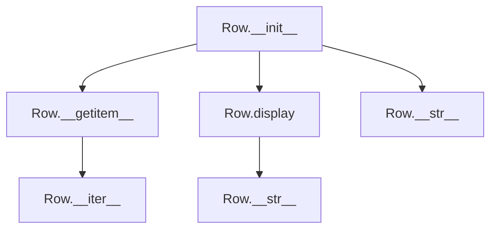
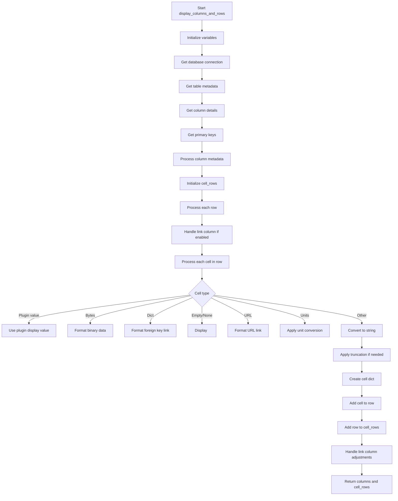

# `table.py`

## `datasette.views.table.Row` · *class*

## Summary:
Represents a single row of data with named cells, providing access to raw and display values.

## Description:
The Row class encapsulates a collection of data cells from a database query result. It provides convenient access patterns for retrieving cell values by column name, supporting both raw database values and formatted display values. This class is typically instantiated by Datasette's table view processing logic when representing individual rows from database queries.

## State:
- cells: list[dict], where each dict represents a data cell with the following structure:
  - "column" (str): The column name
  - "raw" (any): The raw database value
  - "value" (any): The formatted/display value
  - Optional "is_special_link_column" (bool): Flag indicating special link handling
- The cells list is ordered and represents the row's data in column order

## Lifecycle:
- Creation: Instantiate with a list of cell dictionaries containing "column", "raw", and "value" keys
- Usage: Access raw values via indexing (`row[column_name]`) or display values via `display(column_name)` method
- Destruction: No explicit cleanup required; relies on Python's garbage collection

## Method Map:


## Raises:
- KeyError: When accessing a non-existent column via `__getitem__`

## Example:
```python
# Creating a Row instance
cells = [
    {"column": "id", "raw": 1, "value": "1"},
    {"column": "name", "raw": "Alice", "value": "Alice"}
]
row = Row(cells)

# Accessing values
raw_id = row["id"]  # Returns 1 (raw database value)
display_name = row.display("name")  # Returns "Alice" (formatted value)

# Iterating over cells
for cell in row:
    print(cell["column"], cell["raw"])

# String representation
print(row)  # JSON dump of all non-special-link columns
```

### `datasette.views.table.Row.__init__` · *method*

## Summary:
Initializes a Row object with cell data representing a database row.

## Description:
Creates a Row instance that encapsulates cell data for a single database row. This method serves as the constructor that stores the provided cells collection, which typically contains column names and their associated raw values for database records. The Row class provides convenient access to row data through various methods like __getitem__ and display().

## Args:
    cells (list[dict]): A list of cell dictionaries, where each dictionary contains at least "column" and "raw" keys representing column metadata and raw data values. Each cell dictionary may also contain additional keys like "value" for formatted display.

## Returns:
    None: This method initializes the object state but does not return a value.

## Raises:
    None: This method does not explicitly raise exceptions.

## State Changes:
    Attributes READ: None
    Attributes WRITTEN: self.cells - stores the provided cells collection

## Constraints:
    Preconditions: The cells parameter must be a list of dictionaries containing at least "column" and "raw" keys.
    Postconditions: The Row instance will have its self.cells attribute set to the provided cells parameter.

## Side Effects:
    None: This method performs no I/O operations or external service calls.

### `datasette.views.table.Row.__iter__` · *method*

## Summary:
Returns an iterator over the row's cells, enabling iteration through each cell in the row.

## Description:
This method implements Python's iterator protocol for the Row class, making Row instances iterable. When called, it returns an iterator over the internal `self.cells` collection, which contains dictionaries representing individual cells in the row. This allows users to loop over all cells in a row using standard Python iteration patterns.

The method is designed to be used in for-loops or other iteration contexts where you want to process each cell in the row individually rather than accessing them by column name.

## Args:
    None

## Returns:
    iterator: An iterator object over the list of cell dictionaries stored in `self.cells`.

## Raises:
    None

## State Changes:
    Attributes READ: self.cells
    Attributes WRITTEN: None

## Constraints:
    Preconditions: The Row instance must have been properly initialized with a valid list of cell dictionaries in `self.cells`.
    Postconditions: The returned iterator is a view of the current state of `self.cells` and will reflect any changes made to `self.cells` before iteration completes.

## Side Effects:
    None

### `datasette.views.table.Row.__getitem__` · *method*

## Summary:
Retrieves the raw value of a cell from the row by column name using dictionary-style access.

## Description:
Enables dictionary-style access to row data using square bracket notation (e.g., `row['column_name']`). This method implements Python's `__getitem__` special method to allow accessing row data by column name. It searches through the row's internal cells collection to find a matching column and returns its raw value.

## Args:
    key (str): The column name to search for within the row's cells collection.

## Returns:
    The raw value stored in the matching cell dictionary, or raises KeyError if no matching column is found.

## Raises:
    KeyError: When the specified column name does not exist in the row's cells collection.

## State Changes:
    Attributes READ: self.cells
    Attributes WRITTEN: None

## Constraints:
    Preconditions: The row must have a cells attribute containing a list of dictionaries with 'column' and 'raw' keys.
    Postconditions: Returns the raw value of the matching cell or raises KeyError.

## Side Effects:
    None

### `datasette.views.table.Row.display` · *method*

## Summary:
Returns the formatted display value for a specified column from the row's cell data.

## Description:
This method retrieves the display-formatted value associated with a given column name from the row's collection of cells. It is designed to provide easy access to formatted column values while maintaining a clean interface for table view rendering.

## Args:
    key (str): The column name to search for within the row's cells.

## Returns:
    Any: The display-formatted value associated with the specified column, or None if the column is not found.

## Raises:
    None explicitly raised.

## State Changes:
    Attributes READ: self.cells
    Attributes WRITTEN: None

## Constraints:
    Preconditions: The Row instance must have been initialized with a cells list containing dictionaries with "column" and "value" keys.
    Postconditions: The method will always return either a value from a matching cell or None, never raises an exception for invalid keys.

## Side Effects:
    None.

### `datasette.views.table.Row.__str__` · *method*

## Summary:
Converts the row data to a formatted JSON string representation, excluding special link columns.

## Description:
Returns a JSON-formatted string representation of the row's data, filtering out cells designated as special link columns. This method enables easy serialization of row data for display or API responses while maintaining clean presentation by omitting special navigation elements.

## Args:
    None

## Returns:
    str: A JSON-formatted string with indented output (2-space indentation) containing all non-special-link-column data from the row.

## Raises:
    KeyError: When accessing a column that doesn't exist in the row's cells collection (inherited from __getitem__).

## State Changes:
    Attributes READ: self.cells
    Attributes WRITTEN: None

## Constraints:
    Preconditions: The row must have a cells attribute containing a list of dictionaries with 'column' and 'raw' keys, and optionally 'is_special_link_column'.
    Postconditions: Returns a valid JSON string representation of filtered row data.

## Side Effects:
    None

## `datasette.views.table.TableView` · *class*

*No documentation generated.*

### `datasette.views.table.TableView.sortable_columns_for_table` · *method*

## Summary:
Determines the set of columns that can be used for sorting a table, optionally including the rowid column.

## Description:
This asynchronous method retrieves the list of sortable columns for a given table by checking table metadata first, falling back to the actual table columns if no explicit sortable columns are defined. It can optionally include the "rowid" column in the sortable columns list when requested.

The method is called during table data retrieval to validate sort parameters and determine which columns can be used for ordering results. It's used in the table view's data processing pipeline to ensure sorting operations are performed on valid columns.

## Args:
    database_name (str): Name of the database containing the table
    table_name (str): Name of the table to check for sortable columns
    use_rowid (bool): Whether to include "rowid" as a sortable column when the table has no primary keys

## Returns:
    set[str]: A set of column names that are considered sortable for the specified table

## Raises:
    Exception: May propagate exceptions from underlying database operations such as database connection errors or table access failures

## State Changes:
    Attributes READ: self.ds (Datasette instance)
    Attributes WRITTEN: None

## Constraints:
    Preconditions: 
    - database_name must reference an existing database in self.ds.databases
    - table_name must reference an existing table in the specified database
    - The method assumes the database and table exist and are accessible
    
    Postconditions:
    - Returns a set of column names that can be used for sorting
    - The returned set will always include the "rowid" column if use_rowid is True and the table has no primary keys

## Side Effects:
    None - this method only performs lookups and computations, no I/O or external service calls

### `datasette.views.table.TableView.expandable_columns` · *method*

## Summary:
Retrieves expandable column information for a table by gathering foreign key relationships and their associated label columns.

## Description:
This method identifies foreign key columns in a specified table that can be expanded to show human-readable label values from referenced tables. It collects foreign key definitions along with the appropriate label columns from the tables they reference.

## Args:
    database_name (str): Name of the database containing the table
    table_name (str): Name of the table to analyze for expandable columns

## Returns:
    list[tuple]: A list of tuples where each tuple contains (foreign_key_definition, label_column_name)
        - foreign_key_definition: Dictionary containing foreign key metadata
        - label_column_name: String representing the label column name from the referenced table

## Raises:
    KeyError: If database_name or table_name do not exist in the database structure
    Exception: Any exceptions raised by database operations like foreign_keys_for_table or label_column_for_table

## State Changes:
    Attributes READ: self.ds (Datasette instance)
    Attributes WRITTEN: None

## Constraints:
    Preconditions: 
    - database_name must correspond to an existing database in self.ds.databases
    - table_name must correspond to an existing table in the specified database
    - The method assumes foreign key relationships exist and can be queried
    
    Postconditions:
    - Returns a list of tuples with foreign key information and associated label columns
    - Each returned tuple contains valid foreign key definition and label column name

## Side Effects:
    - Makes asynchronous database queries to retrieve foreign key information
    - Makes asynchronous database queries to retrieve label column information
    - May involve I/O operations for database access

### `datasette.views.table.TableView.post` · *method*

## Summary:
Handles POST requests to execute canned SQL queries against database tables, returning structured query results or execution status.

## Description:
Processes HTTP POST requests to execute predefined SQL queries (canned queries) stored in database metadata. This method validates the database and table existence, retrieves the specified canned query configuration, and delegates execution to QueryView.data() for proper query handling and response generation. The method is specifically designed for executing write operations or read operations that are pre-defined in database metadata.

## Args:
    request: ASGI request object containing URL variables and request data with:
        - request.url_vars["database"]: Database route identifier (decoded from tilde-encoded format)
        - request.url_vars["table"]: Table name (decoded from tilde-encoded format)
        - request.actor: Actor identifier for permission checking

## Returns:
    Response object from QueryView.data() method, typically containing:
        - For write operations: JSON response with execution status and affected rows
        - For read operations: HTML template with query results or JSON response
        - HTTP status codes appropriate to the operation outcome

## Raises:
    NotFound: When the specified database route does not exist in Datasette configuration
    AssertionError: When the requested table is not configured as a valid canned query (assertion fails)

## State Changes:
    Attributes READ:
        - self.ds (Datasette instance for database access and query execution)
        - request.url_vars["database"] (URL variable for database name)
        - request.url_vars["table"] (URL variable for table name)
        - request.actor (request actor for permission checking)

## Constraints:
    Preconditions:
        - Request must contain valid database and table URL variables
        - Database route must exist in Datasette configuration
        - Table must be configured as a canned query in database metadata
        - User must have appropriate permissions for the database and query

    Postconditions:
        - If successful, returns appropriate response for canned query execution
        - If database not found, raises NotFound exception
        - If not a canned query, raises AssertionError
        - Query execution follows standard Datasette security and permission models

## Side Effects:
    - Database query execution (read/write operations) through Datasette's database interface
    - Potential HTTP redirects to other URLs (handled by QueryView.data)
    - Template rendering preparation for results display (handled by QueryView.data)
    - Message addition to request context (handled by QueryView.data)
    - Access to database resources through Datasette instance

### `datasette.views.table.TableView.columns_to_select` · *method*

## Summary:
Determines the list of columns to select from a table based on request parameters for inclusion/exclusion.

## Description:
This method processes request arguments to determine which columns should be selected from a table. It supports two query parameters: `_col` to explicitly include columns and `_nocol` to exclude specific columns. The method ensures that requested columns exist in the table and that excluded columns are not primary keys.

## Args:
    table_columns (list[str]): List of all available column names in the table
    pks (list[str]): List of primary key column names
    request (ASGI Request): HTTP request object containing query parameters

## Returns:
    list[str]: List of column names to select from the table

## Raises:
    DatasetteError: When invalid columns are specified in `_col` or `_nocol` parameters

## State Changes:
    Attributes READ: None
    Attributes WRITTEN: None

## Constraints:
    Preconditions:
        - table_columns must contain all valid column names for the table
        - pks must contain the primary key column names
        - request must be a valid ASGI request object with args attribute
    Postconditions:
        - Returned list contains only valid column names from table_columns
        - Excluded columns (via _nocol) are not present in returned list
        - Primary keys are always included when _col is used

## Side Effects:
    None

### `datasette.views.table.TableView.data` · *method*

## Summary
Asynchronously retrieves and processes table data for display, delegating to the traced data processing method.

## Description
This asynchronous method serves as the main entry point for retrieving table data in Datasette's web interface. It wraps the core data processing logic in a tracing context and delegates to the `_data_traced` method. The method is part of the `TableView` class and handles the initial setup and tracing of the data retrieval process.

The `data` method is designed to be a thin wrapper that ensures proper tracing of child tasks during data processing, while the actual complex logic is implemented in `_data_traced`. This separation allows for clean monitoring and debugging of data retrieval operations.

Known callers:
- Direct HTTP request handlers that process table view requests
- Called during the lifecycle of table data retrieval in Datasette's web interface

This logic is its own method rather than being inlined because it provides a centralized point for tracing and ensures consistent error handling and request processing patterns across all table data retrieval operations.

## Args
- request: ASGI request object containing URL variables and query parameters
- default_labels: Boolean flag indicating whether to enable labels by default (default: False)
- _next: String representing the next page offset or sort value (default: None)
- _size: String or integer specifying page size or "max" (default: None)

## Returns
Returns the result of `self._data_traced()` which is a tuple containing:
1. Dictionary with table data and metadata
2. Async function that generates additional template context
3. Tuple of template names to try for rendering

## Raises
- All exceptions that can be raised by `self._data_traced()` method
- NotFound: When database or table is not found
- Forbidden: When user lacks permission to view the table
- BadRequest: When invalid parameters are provided
- DatasetteError: When conflicting sort parameters are provided or invalid sort columns are requested

## State Changes
Attributes READ:
- self.ds: Datasette instance for database access and settings
- self.ds.databases: Database connections
- self.ds.inspect_data: Cached inspection data
- self.ds.max_returned_rows: Maximum rows allowed to be returned
- self.ds.page_size: Default page size setting
- self.ds.settings: Configuration settings

Attributes WRITTEN:
- None: Method is read-only and doesn't modify instance state

## Constraints
Preconditions:
- Request must contain valid database and table URL variables
- User must have appropriate permissions to view the database/table
- Database route must exist in datasette instance
- Table must exist or be a valid view

Postconditions:
- Returned data dictionary contains all required metadata for table rendering
- Template context function can be called to generate additional rendering context
- Pagination logic correctly handles next page calculation
- Filtering and sorting parameters are properly validated

## Side Effects
- Database queries executed for table data, metadata, and counts
- External service calls for facet generation via plugin hooks
- Potential I/O operations for expanding foreign key labels
- HTTP redirects may occur for parameter normalization

### `datasette.views.table.TableView._data_traced` · *method*

## Summary
Retrieves and processes table data for display, handling filtering, sorting, pagination, facets, and column expansion.

## Description
This asynchronous method orchestrates the retrieval and processing of table data for display in Datasette's web interface. It handles database access, query building with filters and sorting, pagination logic, facet generation, and column expansion for foreign key relationships. The method performs extensive validation of user inputs and permissions before executing database queries.

The method is designed to be called internally by the `data` method and provides a complete data pipeline for table views, returning structured data that can be rendered by templates along with a template context generator function.

Known callers:
- `TableView.data()` method which serves as the main entry point for table data requests
- Called within the context of HTTP request handling for table views

This logic is separated into its own method to encapsulate the complex data processing pipeline while keeping the main `data` method clean and focused on request routing and tracing.

## Args
- request: ASGI request object containing URL variables and query parameters
- default_labels: Boolean flag indicating whether to enable labels by default (default: False)
- _next: String representing the next page offset or sort value (default: None)
- _size: String or integer specifying page size or "max" (default: None)

## Returns
Tuple containing:
1. Dictionary with table data and metadata:
   - database (str): Database name
   - table (str): Table name  
   - is_view (bool): Boolean indicating if table is a view
   - human_description_en (str): Human-readable description of applied filters/sorting
   - rows (list): List of row data (limited to page size)
   - truncated (bool): Boolean indicating if results were truncated
   - filtered_table_rows_count (int): Total count of filtered rows
   - expanded_columns (list): List of columns with expanded foreign key labels
   - expandable_columns (list): List of foreign key relationships available for expansion
   - columns (list): List of column names
   - primary_keys (list): List of primary key column names
   - units (dict): Unit mapping for columns
   - query (dict): Dictionary containing SQL query and parameters
   - facet_results (dict): Dictionary of facet results
   - suggested_facets (list): List of suggested facets
   - next (str or None): Next page identifier or None
   - next_url (str or None): URL for next page or None
   - private (bool): Boolean indicating if table is private
   - allow_execute_sql (bool): Boolean indicating if SQL execution is allowed
2. Async function that generates additional template context
3. Tuple of template names to try for rendering

## Raises
- NotFound: When database or table is not found
- Forbidden: When user lacks permission to view the table
- BadRequest: When invalid parameters are provided (e.g., _size not a positive integer, _facet= not allowed)
- DatasetteError: When conflicting sort parameters are provided or invalid sort columns are requested

## State Changes
Attributes READ:
- self.ds: Datasette instance for database access and settings
- self.ds.databases: Database connections
- self.ds.inspect_data: Cached inspection data
- self.ds.max_returned_rows: Maximum rows allowed to be returned
- self.ds.page_size: Default page size setting
- self.ds.settings: Configuration settings

Attributes WRITTEN:
- None: Method is read-only and doesn't modify instance state

## Constraints
Preconditions:
- Request must contain valid database and table URL variables
- User must have appropriate permissions to view the database/table
- Database route must exist in datasette instance
- Table must exist or be a valid view

Postconditions:
- Returned data dictionary contains all required metadata for table rendering
- Template context function can be called to generate additional rendering context
- Pagination logic correctly handles next page calculation
- Filtering and sorting parameters are properly validated

## Side Effects
- Database queries executed for table data, metadata, and counts
- External service calls for facet generation via plugin hooks
- Potential I/O operations for expanding foreign key labels
- HTTP redirects may occur for parameter normalization

## `datasette.views.table._sql_params_pks` · *function*

## Summary:
Constructs a parameterized SQL SELECT query and associated parameters for retrieving a specific table row by its primary key values.

## Description:
This asynchronous utility function generates a properly escaped SQL SELECT statement that retrieves a specific row from a database table based on provided primary key values. It handles both tables with explicit primary keys and tables that rely on SQLite's implicit rowid. The function returns the SQL query string, parameter dictionary, and the list of primary key column names used in the query.

## Args:
    db (Database): Database connection object with async method `primary_keys()`
    table (str): Name of the database table to query
    pk_values (list): List of primary key values corresponding to the table's primary key columns

## Returns:
    tuple[str, dict, list]: A tuple containing:
        - SQL query string with parameter placeholders
        - Dictionary mapping parameter names to their values
        - List of primary key column names used in the query

## Raises:
    None explicitly raised - depends on underlying database operations

## Constraints:
    Preconditions:
        - The `db` parameter must be a valid database connection object with a `primary_keys()` method
        - The `table` parameter must reference an existing table in the database
        - The `pk_values` list length must match the number of primary key columns for the table
        - Primary key values must be compatible with the column data types

    Postconditions:
        - Returned SQL query is properly escaped to prevent SQL injection
        - Parameters dictionary contains one entry for each primary key value
        - Primary key list contains the actual column names used in the query

## Side Effects:
    None

## Control Flow:
```mermaid
flowchart TD
    A[Start _sql_params_pks] --> B{Has primary keys?}
    B -- Yes --> C[Set select="*"]
    B -- No --> D[Set select="rowid, *"]
    D --> E[Set pks=["rowid"]]
    C --> E
    E --> F[Build WHERE clauses]
    F --> G[Construct SQL query]
    G --> H[Build params dict]
    H --> I[Return (sql, params, pks)]
```

## Examples:
```python
# Example usage for a table with composite primary keys
db = datasette.get_database("mydb")
table_name = "users"
primary_key_values = ["123", "abc"]

sql, params, pks = await _sql_params_pks(db, table_name, primary_key_values)
# Returns:
# sql = 'select *, from "users" where "id"=:p0 AND "username"=:p1'
# params = {'p0': '123', 'p1': 'abc'}
# pks = ['id', 'username']

# Example usage for a table with rowid
db = datasette.get_database("mydb")
table_name = "simple_table"
primary_key_values = [42]

sql, params, pks = await _sql_params_pks(db, table_name, primary_key_values)
# Returns:
# sql = 'select rowid, * from "simple_table" where "rowid"=:p0'
# params = {'p0': 42}
# pks = ['rowid']
```

## `datasette.views.table.display_columns_and_rows` · *function*

## Summary
Formats database table rows and column metadata for web display, handling various data types including foreign keys, binary data, URLs, and unit conversions.

## Description
Processes raw database query results into a structured format suitable for rendering in web table views. This function handles complex formatting logic for different data types, applies plugins for custom cell rendering, and manages special display cases like primary key linking, foreign key relationships, and URL detection.

The function extracts column metadata from database schema information and table configuration, then processes each row to create properly formatted display values while preserving raw data for programmatic access. It supports optional features like truncating long cell values, adding primary key links, and applying unit conversions.

Known callers within the codebase:
- Table view handlers that render database table data in web interfaces
- Data export functionality that needs formatted table representations
- API endpoints that serve structured table data

This logic is extracted into its own function to separate data formatting concerns from view rendering logic, enabling reuse across different presentation contexts and maintaining clean separation between database access, data processing, and UI generation.

## Args
- datasette (Datasette): The Datasette application instance containing configuration and database connections
- database_name (str): Name of the database containing the target table
- table_name (str): Name of the table to process
- description (list[tuple]): Database column description tuples from cursor.description
- rows (list[tuple]): Raw database row data as tuples
- link_column (bool, optional): Whether to include a primary key link column. Defaults to False
- truncate_cells (int, optional): Maximum character length for cell values before truncation. Defaults to 0 (no truncation)
- sortable_columns (set, optional): Set of column names that should be marked as sortable. Defaults to None

## Returns
- tuple[list[dict], list[Row]]: A tuple containing:
  - columns: List of column metadata dictionaries with keys: "name", "sortable", "is_pk", "type", "notnull", "description"
  - cell_rows: List of Row objects, each containing formatted display values for the row's cells

## Raises
- None explicitly raised in the function body

## Constraints
- Preconditions:
  - datasette must be a valid Datasette instance with configured databases
  - database_name must reference an existing database in datasette.databases
  - table_name must reference an existing table in the specified database
  - description must be a valid list of column description tuples from sqlite cursor
  - rows must be a list of tuples matching the column structure described in description

- Postconditions:
  - Returned columns list contains metadata for all columns in the table
  - Returned cell_rows list contains Row objects with properly formatted display values
  - All Row objects have cells with consistent column ordering
  - When link_column=True, the first column in returned columns represents the link column

## Side Effects
- None explicitly stated, though the function accesses database metadata and performs async operations

## Control Flow


## Examples
```python
# Basic usage with minimal options
columns, rows = await display_columns_and_rows(
    datasette,
    "mydb",
    "users",
    cursor.description,
    [(1, "Alice", "alice@example.com"), (2, "Bob", "bob@example.com")]
)

# Usage with link column and truncation
columns, rows = await display_columns_and_rows(
    datasette,
    "mydb",
    "products",
    cursor.description,
    [(1, "Laptop", b"binary_data", "https://example.com")],
    link_column=True,
    truncate_cells=50
)
```

