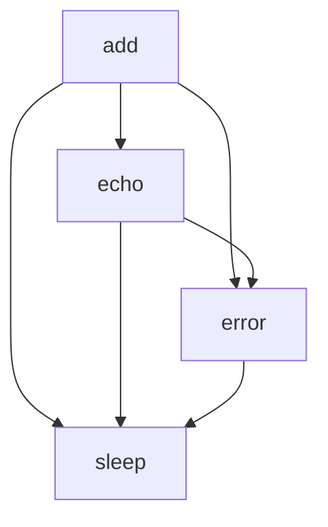

# `examples`

## Tree:
examples/
└── tasks.py

## Role:
Provides fundamental utility functions for distributed task processing and simulation

## Description:
This module contains essential utility functions designed for use in distributed task processing systems, particularly those utilizing Celery. The functions serve as building blocks for creating and managing asynchronous tasks, providing basic mathematical operations, messaging capabilities, error handling, and timing controls.

## Components:
- add(x: int or float, y: int or float) -> int or float: Performs addition of two numeric values
- echo(msg: str, timestamp: bool = False) -> str: Formats and optionally timestamps a message string
- error(msg: str) -> None: Raises an exception with the specified error message
- sleep(seconds: float) -> None: Pauses execution for a specified number of seconds

## Public API:
- add(x: int or float, y: int or float) -> int or float: Performs addition of two numeric values
- echo(msg: str, timestamp: bool = False) -> str: Formats and optionally timestamps a message string  
- error(msg: str) -> None: Raises an exception with the specified error message
- sleep(seconds: float) -> None: Pauses execution for a specified number of seconds

## Dependencies:
- None: This module has no internal or external dependencies

## Constraints:
- All functions are designed to be lightweight and suitable for use in distributed task environments
- The add function requires numeric inputs that support the + operator
- The sleep function expects non-negative time values
- The error function always raises an exception and never returns normally

---

## Files

- [`tasks.py`](examples/tasks.md)

