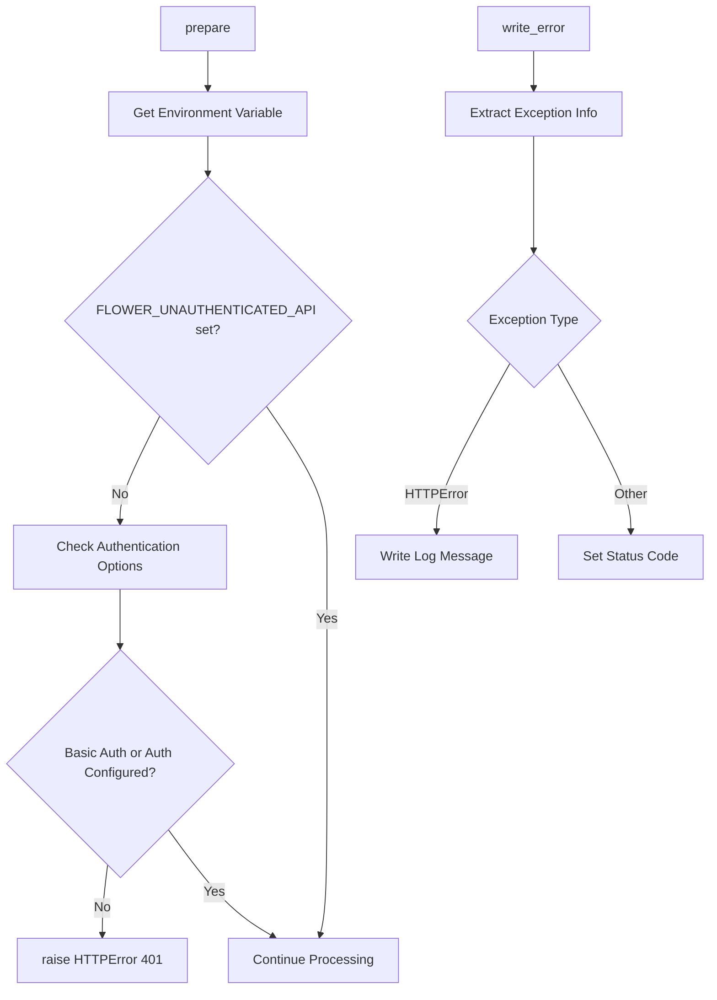

# `__init__.py`

## `flower.api.__init__.BaseApiHandler` · *class*

## Summary:
BaseApiHandler is an API endpoint handler that enforces authentication requirements and customizes error responses for API requests.

## Description:
This class extends BaseHandler to provide API-specific functionality. It ensures that API endpoints require proper authentication unless explicitly enabled via the FLOWER_UNAUTHENTICATED_API environment variable. The class serves as a base class for implementing API handlers that need to enforce authentication policies and provide consistent error handling.

The class is typically instantiated automatically by the Tornado web framework when processing API requests, rather than being created directly by application code.

## State:
- Inherits all state from BaseHandler including request context, application reference, and session management
- No additional instance attributes beyond those inherited from BaseHandler
- Relies on self.application.options for authentication configuration checking

## Lifecycle:
- Creation: Instantiated automatically by Tornado web framework when matching API routes
- Usage: Framework calls prepare() before request processing and write_error() when exceptions occur
- Destruction: Managed by Tornado framework lifecycle

## Method Map:


## Raises:
- tornado.web.HTTPError(401): Raised in prepare() method when both basic_auth and auth application options are falsy and FLOWER_UNAUTHENTICATED_API environment variable is not set to a truthy value

## Example:
```python
# This class would be used as a base for API handlers
class MyApiHandler(BaseApiHandler):
    def get(self):
        # API logic here
        self.write({"status": "success"})

# When accessed without proper authentication:
# If FLOWER_UNAUTHENTICATED_API=false (default) and no auth configured:
#   HTTP 401 Unauthorized response with message
#   "FLOWER_UNAUTHENTICATED_API environment variable is required to enable API without authentication"

# When FLOWER_UNAUTHENTICATED_API=true and no auth configured:
#   API request proceeds normally
```

### `flower.api.__init__.BaseApiHandler.prepare` · *method*

## Summary:
Validates that API access is permitted by checking authentication configuration and environment settings.

## Description:
This method ensures that API endpoints can only be accessed when proper authentication is configured or when the unauthenticated API environment variable is explicitly enabled. It's called during the request preparation phase to enforce access control policies.

## Args:
    None

## Returns:
    None

## Raises:
    tornado.web.HTTPError: Raised with status code 401 when neither authentication methods (basic_auth or auth) are configured and the FLOWER_UNAUTHENTICATED_API environment variable is not set to an enabled value.

## State Changes:
    Attributes READ: 
        - self.application.options.basic_auth
        - self.application.options.auth
    Attributes WRITTEN: 
        - None

## Constraints:
    Preconditions:
        - The method assumes self.application.options contains basic_auth and auth attributes
        - The FLOWER_UNAUTHENTICATED_API environment variable should be a string representation of a boolean value
    Postconditions:
        - If authentication is properly configured or unauthenticated API is enabled, the method completes normally
        - If authentication is not configured and unauthenticated API is disabled, an HTTP 401 error is raised

## Side Effects:
    - Raises an HTTP error which terminates the request processing
    - Reads from environment variables

### `flower.api.__init__.BaseApiHandler.write_error` · *method*

## Summary:
Handles HTTP error responses by writing error messages and setting appropriate status codes.

## Description:
This method overrides Tornado's default error handling mechanism to provide customized error responses. It extracts error information from the exception stack trace and writes the log message to the response if available. This method is called automatically by Tornado when an HTTP error occurs during request processing, allowing for consistent error formatting across the API.

## Args:
    status_code (int): The HTTP status code to set for the response
    **kwargs: Additional keyword arguments containing error information, specifically 'exc_info'

## Returns:
    None: This method does not return a value

## Raises:
    AttributeError: When exc_info is None or does not contain the expected structure
    AttributeError: When exc_info[1] does not have a log_message attribute

## State Changes:
    Attributes READ: 
    - self.write() method (used to write response content)
    - self.set_status() method (used to set HTTP status)
    - self.finish() method (used to complete the response)
    
    Attributes WRITTEN: 
    - Response content via self.write()
    - HTTP status code via self.set_status()
    - Response completion via self.finish()

## Constraints:
    Preconditions:
    - The method assumes that kwargs contains 'exc_info' key with exception information
    - The exception in exc_info[1] must have a 'log_message' attribute
    - exc_info must not be None
    
    Postconditions:
    - The HTTP response will have the specified status_code set
    - The response will either contain the log_message or be empty
    - The response will be properly finished and sent to the client

## Side Effects:
    - Writes content to the HTTP response stream
    - Sets HTTP status code on the response
    - Finishes the HTTP response cycle

