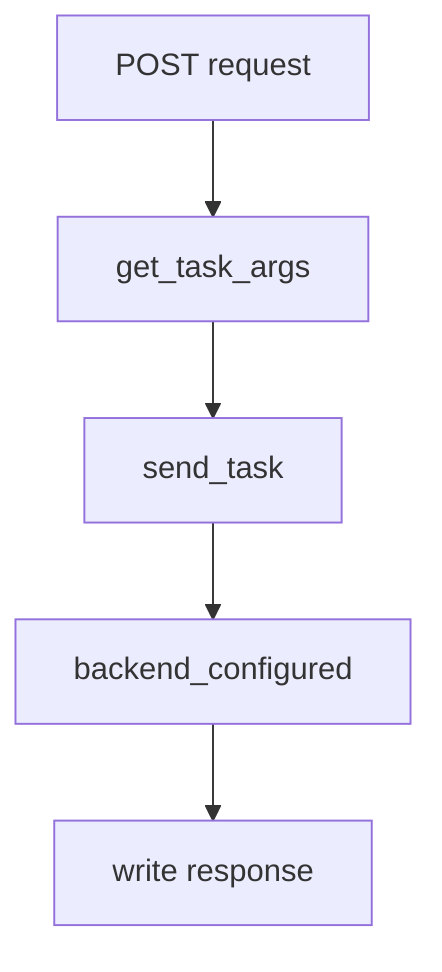
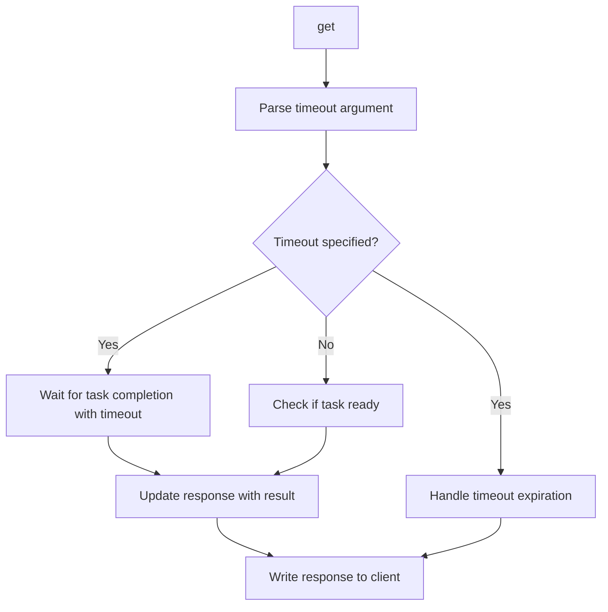
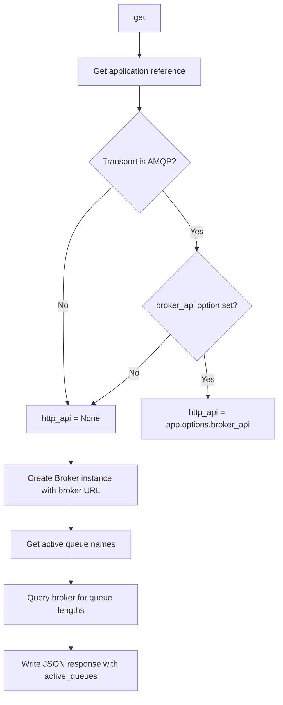

# `tasks.py`

## `flower.api.tasks.BaseTaskHandler` · *class*

## Summary:
BaseTaskHandler is an abstract base class for API endpoints that manage Celery task operations, providing common utilities for parsing task arguments, handling results, and normalizing task options.

## Description:
This class extends BaseApiHandler to provide specialized functionality for task management APIs. It serves as a foundation for concrete task handler implementations that need to process task submissions, handle task results, and manage task scheduling options. The class encapsulates common patterns for working with Celery tasks in a web API context.

The class is typically instantiated by the Tornado web framework when processing API requests, rather than being created directly by application code. Concrete implementations would inherit from this class to handle specific task operations like task submission, cancellation, or status checking.

## State:
- DATE_FORMAT (str): Class constant defining the date format string used for parsing datetime values ('%Y-%m-%d %H:%M:%S.%f')
- Inherits all state from BaseApiHandler including request context, application reference, and session management
- No additional instance attributes beyond those inherited from BaseApiHandler

## Lifecycle:
- Creation: Instantiated automatically by Tornado web framework when matching API routes
- Usage: Framework calls prepare() method before request processing, followed by specific handler methods like get(), post(), etc.
- Destruction: Managed by Tornado framework lifecycle

## Method Map:
```mermaid
graph TD
    A[get_task_args] --> B[Parse JSON body]
    B --> C{JSON parsing successful?}
    C -->|No| D[HTTPError 400]
    C -->|Yes| E[Validate options type]
    E --> F{Valid dict?}
    F -->|No| G[HTTPError 400]
    F -->|Yes| H[Extract args, kwargs, options]
    H --> I{Args valid type?}
    I -->|No| J[HTTPError 400]
    I -->|Yes| K[Return args, kwargs, options]

    A --> L[update_response_result] --> M{Task failed?}
    M -->|Yes| N[Include traceback]
    M -->|No| O[Only include result]

    L --> P[normalize_options] --> Q{Has eta?}
    Q -->|Yes| R[Convert to datetime]
    Q -->|No| S{Has countdown?}
    S -->|Yes| T[Convert to float]
    S -->|No| U{Has expires?}
    U -->|Yes| V[Convert to float or datetime]
    U -->|No| W[Done]

    P --> X[safe_result] --> Y{Try JSON serialize}
    Y --> Z{Success?}
    Z -->|No| AA[Use repr()]
    Z -->|Yes| AB[Return result]
```

## Raises:
- tornado.web.HTTPError(400): Raised in get_task_args() when JSON parsing fails, options is not a dictionary, or args is not a list/tuple
- tornado.web.HTTPError(401): Inherited from BaseApiHandler when authentication requirements are not met (handled by framework)

## Example:
```python
class SubmitTaskHandler(BaseTaskHandler):
    def post(self):
        args, kwargs, options = self.get_task_args()
        # Process task submission with parsed arguments
        task_result = self.submit_task(args, kwargs, options)
        response = {'task_id': task_result.id}
        self.update_response_result(response, task_result)
        self.write(response)
```

### `flower.api.tasks.BaseTaskHandler.get_task_args` · *method*

## Summary:
Parses JSON request data to extract task arguments, keyword arguments, and additional options for task execution.

## Description:
Extracts task execution parameters from the HTTP request body by parsing JSON data. This method serves as a utility for processing task submission requests in the Flower web interface, separating task arguments, keyword arguments, and additional configuration options from the request payload.

## Args:
    None

## Returns:
    tuple[list, dict, dict]: A tuple containing:
        - args (list): Positional arguments for the task
        - kwargs (dict): Keyword arguments for the task  
        - options (dict): Additional task configuration options

## Raises:
    HTTPError: Raised with status code 400 when:
        - JSON parsing fails due to malformed request body
        - The parsed options are not a dictionary
        - The args field is not a list or tuple

## State Changes:
    Attributes READ: 
        - self.request.body: The raw HTTP request body containing JSON data
    Attributes WRITTEN: 
        - None

## Constraints:
    Preconditions:
        - The request body must be valid JSON or empty
        - The parsed JSON must represent a dictionary structure
        - The 'args' field, if present, must be a list or tuple
    Postconditions:
        - Returns a tuple with exactly three elements: [args, kwargs, options]
        - The returned args and kwargs are extracted from the original options dictionary
        - The options dictionary contains all remaining fields after extracting args and kwargs

## Side Effects:
    None

### `flower.api.tasks.BaseTaskHandler.backend_configured` · *method*

## Summary:
Determines whether a Celery task result has a configured backend for storing task information.

## Description:
Checks if the provided Celery task result object has a backend configured that is not disabled. This utility function is used to verify that task results can be stored and retrieved from a backend system, such as Redis or database, rather than being stored in memory only.

## Args:
    result (celery.result.AsyncResult): A Celery task result object whose backend configuration needs to be checked.

## Returns:
    bool: True if the result has a configured backend (not DisabledBackend), False if the backend is disabled.

## Raises:
    None: This function does not raise any exceptions.

## State Changes:
    None: This function does not modify any object state.

## Constraints:
    Preconditions: The result parameter must be a valid Celery AsyncResult object.
    Postconditions: The function returns a boolean indicating backend configuration status.

## Side Effects:
    None: This function performs no I/O operations or external service calls.

### `flower.api.tasks.BaseTaskHandler.write_error` · *method*

## Summary:
Sets the HTTP status code for error responses in task API handlers, overriding the parent class's error handling.

## Description:
Overrides the parent BaseApiHandler's write_error method to provide minimal error handling for task-related API endpoints. This simplified implementation is used when task operations encounter errors that should simply return an HTTP status code without additional error message formatting.

This method is automatically invoked by the Tornado web framework when an HTTP error occurs during task API request processing, ensuring that appropriate HTTP status codes are returned to clients. It provides a streamlined error response mechanism specifically tailored for task operations.

## Args:
    status_code (int): The HTTP status code to set for the response (e.g., 400, 404, 500)
    **kwargs: Additional keyword arguments (typically containing exception information, though unused in this implementation)

## Returns:
    None: This method does not return a value

## Raises:
    None: This method does not explicitly raise exceptions

## State Changes:
    Attributes READ: 
    - self.set_status() method (called to set HTTP status)
    
    Attributes WRITTEN: 
    - HTTP response status code via self.set_status()

## Constraints:
    Preconditions:
    - The status_code parameter must be a valid HTTP status code integer
    - This method should only be called by the Tornado framework during error handling
    - The method assumes the framework will handle response completion
    
    Postconditions:
    - The HTTP response will have the specified status_code set
    - The response will be properly formatted with the correct status code
    - The error handling flow will continue appropriately

## Side Effects:
    - Sets HTTP status code on the response
    - Communicates error state to the client via HTTP status code

### `flower.api.tasks.BaseTaskHandler.update_response_result` · *method*

## Summary:
Updates a response dictionary with task execution results, including traceback information when the task fails.

## Description:
This method processes a Celery task result and updates a response dictionary with the appropriate result data. When a task fails (result.state == states.FAILURE), it includes both the result and traceback information; otherwise, it only includes the result. This method is designed to standardize how task execution results are formatted in API responses.

The method is typically called during the processing of API requests that involve task status queries or task execution results, ensuring consistent response formatting regardless of task success or failure states. It is commonly used in task-related API endpoints within the Flower monitoring interface.

## Args:
    response (dict): Dictionary to be updated with task result information
    result (AsyncResult): Celery task result object containing state and result data with attributes: state, result, and traceback

## Returns:
    None: This method modifies the response dictionary in-place

## Raises:
    None explicitly raised: The method handles all potential errors internally through the safe_result wrapper

## State Changes:
    Attributes READ: 
    - self.safe_result (method)
    - result.state
    - result.result
    - result.traceback
    
    Attributes WRITTEN:
    - response (via update method)

## Constraints:
    Preconditions:
    - response must be a mutable dictionary-like object
    - result must be a Celery AsyncResult or compatible object with state, result, and traceback attributes
    - result.state must be comparable with celery.states.FAILURE
    
    Postconditions:
    - response dictionary will contain a 'result' key with processed result data
    - If result.state equals celery.states.FAILURE, response will also contain a 'traceback' key
    - The result data will be safely processed through self.safe_result() method

## Side Effects:
    None: This method only modifies the provided response dictionary in-place and does not perform any I/O operations or external service calls

### `flower.api.tasks.BaseTaskHandler.normalize_options` · *method*

## Summary:
Normalizes task execution options by converting string representations of dates and numeric values to appropriate Python types.

## Description:
Processes task options dictionary to convert string date/time values and numeric strings to their proper Python types. This method is called during task submission to ensure that time-related and numeric parameters are properly formatted for Celery task execution. The normalization handles three specific fields: 'eta' (estimated time of arrival), 'countdown' (time delay), and 'expires' (expiration time).

## Args:
    options (dict): Dictionary containing task execution options with potential string representations of dates and numbers

## Returns:
    None: Modifies the options dictionary in-place

## Raises:
    ValueError: When 'eta' or 'expires' fields contain invalid date format strings that cannot be parsed using self.DATE_FORMAT

## State Changes:
    Attributes READ: self.DATE_FORMAT
    Attributes WRITTEN: options dictionary is modified in-place

## Constraints:
    Preconditions: 
    - options parameter must be a dictionary
    - 'eta' and 'expires' fields, if present, must be valid date strings matching self.DATE_FORMAT pattern
    - 'countdown' field, if present, must be convertible to float
    
    Postconditions:
    - 'eta' field, if present, will be a datetime.datetime object
    - 'countdown' field, if present, will be a float
    - 'expires' field, if present, will be either a float (if originally numeric) or datetime.datetime object

## Side Effects:
    None: This method only modifies the input options dictionary in-place and does not perform any I/O operations or external service calls.

### `flower.api.tasks.BaseTaskHandler.safe_result` · *method*

## Summary:
Converts a task result to a JSON-serializable format, falling back to string representation if needed.

## Description:
This method ensures that task results can be safely serialized to JSON for API responses. When a task result contains non-serializable objects (like custom classes, datetime objects, etc.), attempting to serialize them with json.dumps() raises a TypeError. In such cases, the method falls back to using repr() to obtain a string representation of the object.

The method is primarily used in API response construction to prevent serialization errors when returning task results to clients.

## Args:
    result: Any Python object representing a task result that may or may not be JSON serializable

## Returns:
    The original result if it's JSON serializable, otherwise a string representation of the result obtained via repr()

## Raises:
    None explicitly raised, but may propagate exceptions from json.dumps() or repr() in edge cases

## State Changes:
    Attributes READ: None
    Attributes WRITTEN: None

## Constraints:
    Preconditions: The result parameter can be any Python object
    Postconditions: The returned value is either the original result (if JSON serializable) or a string representation of the result

## Side Effects:
    None

## `flower.api.tasks.TaskApply` · *class*

## Summary:
TaskApply is a Tornado web handler that processes POST requests to invoke Celery tasks asynchronously and return their results.

## Description:
This class implements a RESTful API endpoint for submitting and executing Celery tasks via HTTP POST requests. It serves as part of the Flower monitoring interface, allowing users to trigger tasks with specified arguments and options. The handler validates task existence, normalizes execution parameters, executes tasks asynchronously, and waits for completion to return results.

The class is designed to be used with the Tornado web framework and inherits from BaseTaskHandler, which provides common utilities for task argument parsing, option normalization, and result handling. It's typically invoked automatically by the web framework when matching API routes. The handler requires authentication via the @web.authenticated decorator.

## State:
- Inherits all state from BaseTaskHandler including request context, application reference, and session management
- No additional instance attributes beyond those inherited from BaseTaskHandler
- The class relies on the parent class's logger (typically configured at module level)

## Lifecycle:
- Creation: Instantiated automatically by Tornado web framework when matching API routes
- Usage: Framework calls the authenticated post() method when receiving a POST request to the task endpoint. The taskname parameter comes from URL routing (e.g., /api/task/apply/{taskname})
- Destruction: Managed by Tornado framework lifecycle

## Method Map:
```mermaid
graph TD
    A[post(taskname)] --> B[get_task_args()]
    B --> C{Task exists?}
    C -->|No| D[HTTPError 404]
    C -->|Yes| E[normalize_options()]
    E --> F{Options valid?}
    F -->|No| G[HTTPError 400]
    F -->|Yes| H[task.apply_async()]
    H --> I[await run_in_executor(wait_results())]
    I --> J[write(response)]
```

## Raises:
- tornado.web.HTTPError(400): Raised when task options are invalid or when JSON parsing fails
- tornado.web.HTTPError(404): Raised when the requested task name is not found in the Celery app
- tornado.web.HTTPError(401): Inherited from BaseApiHandler when authentication requirements are not met (handled by framework)

## Example:
```python
# POST /api/task/apply/my_task_name
# Request body:
# {
#   "args": ["arg1", "arg2"],
#   "kwargs": {"key": "value"},
#   "options": {"countdown": 5}
# }
#
# Response:
# {
#   "task-id": "abc123-def456-ghi789",
#   "result": "task_result_value",
#   "state": "SUCCESS"
# }
```

### `flower.api.tasks.TaskApply.post` · *method*

## Summary:
Invokes a Celery task asynchronously and returns the task ID along with execution results.

## Description:
Handles POST requests to execute Celery tasks by parsing request arguments, validating task existence, normalizing execution options, and initiating task execution. The method supports asynchronous task invocation and waits for initial task completion before returning a response containing the task ID and execution results.

This method is part of the TaskApply class and is typically invoked during API requests to submit tasks for execution in a Flower monitoring interface. It serves as the main entry point for task submission through the web API.

## Args:
    taskname (str): Name of the Celery task to be invoked

## Returns:
    None: Response is written directly to the HTTP response via self.write()

## Raises:
    HTTPError: Raised with status code 404 when the specified task name is not found in the Celery app registry
    HTTPError: Raised with status code 400 when task options contain invalid values or when JSON parsing fails

## State Changes:
    Attributes READ:
        - self.capp: Celery application instance containing registered tasks
        - self.request.body: Raw HTTP request body containing JSON-encoded task parameters
        - self.DATE_FORMAT: Class constant for date format parsing
    Attributes WRITTEN:
        - None: This method doesn't modify instance state directly

## Constraints:
    Preconditions:
        - The task name must exist in self.capp.tasks dictionary
        - The request body must contain valid JSON with task arguments and options
        - Task options must be valid for Celery task execution
    Postconditions:
        - A task is successfully submitted to Celery for execution
        - The response contains a 'task-id' field with the unique identifier of the submitted task
        - If backend is configured, the response also includes the task state

## Side Effects:
    - Makes synchronous blocking calls to Celery task execution via apply_async()
    - Performs I/O operations through the Tornado IOLoop.run_in_executor() mechanism
    - May make external service calls through Celery backend if configured
    - Writes HTTP response directly via self.write()

### `flower.api.tasks.TaskApply.wait_results` · *method*

## Summary:
Waits for a Celery task result and updates the response with task execution data and state information.

## Description:
This method blocks until a Celery task completes (using result.get(propagate=False)), processes the task result to populate response data, and optionally includes the task state if a backend is configured. It's designed to be called asynchronously in the TaskApply handler to ensure task completion before returning a response to the client.

The method is specifically used in the TaskApply.post() handler to wait for task completion and prepare a standardized response that includes task results and state information. It's called via run_in_executor to avoid blocking the main event loop.

## Args:
    result (AsyncResult): Celery task result object representing the asynchronous task execution
    response (dict): Dictionary to be updated with task result and state information

## Returns:
    dict: The updated response dictionary containing task results and potentially state information

## Raises:
    None: This method doesn't explicitly raise exceptions, though underlying Celery operations may raise exceptions

## State Changes:
    Attributes READ:
    - self.backend_configured (method)
    - result.state
    
    Attributes WRITTEN:
    - response (via update method)

## Constraints:
    Preconditions:
    - result must be a valid Celery AsyncResult object
    - response must be a mutable dictionary-like object
    - The task represented by result must eventually complete (either successfully or fail)
    
    Postconditions:
    - The response dictionary will be updated with task result data via update_response_result
    - If backend is configured, the response will include the task state
    - The method will block until the task completes (though propagate=False prevents exception propagation)

## Side Effects:
    - Calls result.get(propagate=False) which blocks until task completion
    - May perform I/O operations when accessing task backend for result data
    - Modifies the provided response dictionary in-place

## `flower.api.tasks.TaskAsyncApply` · *class*

## Summary:
TaskAsyncApply is a Tornado web handler that processes asynchronous task execution requests by submitting Celery tasks and returning their identifiers.

## Description:
This class implements a POST endpoint for submitting Celery tasks asynchronously through Flower's web API. It serves as part of the monitoring interface that allows clients to invoke Celery tasks programmatically via HTTP requests. The handler validates that the requested task exists in the Celery application, normalizes execution options, submits the task asynchronously, and returns a JSON response containing the task identifier.

The class inherits from BaseTaskHandler, which provides common utilities for task argument parsing, option normalization, and result handling. It enforces authentication through the @web.authenticated decorator and integrates with Flower's application context to access the Celery task registry via self.capp.

## State:
- Inherits all state from BaseTaskHandler including request context, application reference, and session management
- `self.capp`: Celery application instance (typically configured in Flower's web application) that provides access to registered tasks via `self.capp.tasks`
- No additional instance attributes beyond those inherited from BaseTaskHandler

## Lifecycle:
- Creation: Automatically instantiated by Tornado web framework when matching API route `/api/task/async-apply/<taskname>` is accessed
- Usage: Framework invokes `post(taskname)` method when HTTP POST request is received with task name parameter
- Destruction: Managed by Tornado framework lifecycle

## Method Map:
```mermaid
graph TD
    A[post(taskname)] --> B[get_task_args()]
    B --> C{Task exists in self.capp.tasks?}
    C -->|No| D[HTTPError 404: Unknown task]
    C -->|Yes| E[normalize_options(options)]
    E --> F{Options valid?}
    F -->|No| G[HTTPError 400: Invalid option]
    F -->|Yes| H[task.apply_async(args, kwargs, **options)]
    H --> I[response = {'task-id': result.task_id}]
    I --> J[backend_configured(result)?]
    J -->|Yes| K[response.update(state=result.state)]
    K --> L[write(response)]
    J -->|No| L
```

## Raises:
- tornado.web.HTTPError(400): Raised when task options are invalid during normalize_options call, or when JSON parsing fails in get_task_args
- tornado.web.HTTPError(404): Raised when the requested task name is not found in self.capp.tasks
- tornado.web.HTTPError(401): Inherited from BaseApiHandler when authentication requirements are not met (handled by framework)

## Example:
```python
# Client makes POST request to /api/task/async-apply/add_numbers
# Request body: {"args": [1, 2], "kwargs": {"verbose": true}, "options": {"priority": 5}}

# Server responds with:
{
    "task-id": "abc123-def456-ghi789",
    "state": "PENDING"
}

# If backend is not configured:
{
    "task-id": "abc123-def456-ghi789"
}

# If task doesn't exist:
# HTTP 404 error with message "Unknown task 'nonexistent_task'"
```

### `flower.api.tasks.TaskAsyncApply.post` · *method*

## Summary:
Invokes a Celery task asynchronously and returns the task identifier along with its initial state if a result backend is configured.

## Description:
Handles POST requests to submit Celery tasks for asynchronous execution. This method parses incoming task arguments from the request body, validates the requested task exists in the Celery application, normalizes task execution options, and submits the task asynchronously. The response includes the task ID and, if a result backend is configured, the initial task state.

This method is part of the TaskAsyncApply class in the Flower API, which provides RESTful endpoints for managing Celery tasks. It's designed to be called during the task submission phase of the workflow, allowing clients to dispatch tasks without waiting for completion.

## Args:
    taskname (str): Name of the Celery task to invoke. Must correspond to a registered task in the application.

## Returns:
    None: The method writes the response directly to the HTTP response stream via self.write()

## Raises:
    tornado.web.HTTPError: 
        - 404: When the specified taskname is not found in the Celery application's task registry
        - 400: When task options contain invalid values that cannot be normalized

## State Changes:
    Attributes READ:
        - self.capp: Reference to the Celery application instance containing task registry
        - self.request.body: Raw HTTP request body containing JSON-encoded task arguments
    Attributes WRITTEN:
        - None: This method doesn't modify instance state directly

## Constraints:
    Preconditions:
        - The taskname parameter must correspond to a registered task in self.capp.tasks
        - The request body must contain valid JSON with task arguments, keyword arguments, and options
        - Task options must be compatible with Celery's apply_async() method
    Postconditions:
        - A task is submitted to Celery for asynchronous execution
        - Response is written to HTTP response stream with task ID
        - If backend is configured, initial task state is included in response

## Side Effects:
    - Makes a call to Celery's apply_async() method to schedule task execution
    - Writes JSON response to HTTP response stream via self.write()
    - May perform I/O operations when accessing task backend for state information

## `flower.api.tasks.TaskSend` · *class*

## Summary:
A Tornado handler that processes POST requests to invoke Celery tasks asynchronously.

## Description:
This class implements a REST endpoint for submitting Celery tasks to the broker. It handles authenticated requests, parses task arguments from the request body, sends the task to Celery via the application's send_task method, and returns the task ID and optional state information. The handler is designed to work within the Flower monitoring interface for managing Celery tasks.

## State:
- Inherits all state from BaseTaskHandler parent class
- `taskname` (str): The name of the Celery task to invoke, passed as a URL parameter
- Uses `self.capp` (Celery app instance) for task submission
- Uses `self.logger` for debug logging
- Uses `self.backend_configured` method to check if result backend is configured
- Uses `self.get_task_args()` to parse request arguments

## Lifecycle:
- Creation: Instantiated by Tornado framework when handling HTTP requests matching the route pattern
- Usage: Automatically invoked by Tornado when a POST request is made to the task sending endpoint
- Requires: Authentication via @web.authenticated decorator
- Destruction: Managed by Tornado framework lifecycle

## Method Map:


## Raises:
- HTTPError: When authentication fails (handled by @web.authenticated decorator)
- Any exceptions raised by self.capp.send_task() or self.get_task_args()
- HTTPError: When task arguments cannot be parsed properly

## Example:
```python
# POST /api/task/send/my_task_name
# Request body: {"args": [1, 2], "kwargs": {"key": "value"}, "options": {"priority": 5}}
# Response: {"task-id": "abc123-def456", "state": "PENDING"}
```

### `flower.api.tasks.TaskSend.post` · *method*

## Summary:
Sends a Celery task with the specified name and arguments, returning the task identifier and optional state information.

## Description:
Processes a POST request to submit a Celery task with the given task name and parameters. This method parses the request body to extract task arguments, sends the task through the Celery application, and returns a JSON response containing the task identifier. If a backend is configured for the task result, the current task state is also included in the response.

This method is typically called during the task submission phase of the Flower web UI workflow, where users submit tasks through the API endpoint. The separation into its own method allows for consistent task submission logic while maintaining clean code organization.

## Args:
    taskname (str): The name of the Celery task to be executed

## Returns:
    None: This method writes the response directly using self.write()

## Raises:
    HTTPError: May be raised by underlying methods when:
        - JSON parsing fails in get_task_args()
        - Invalid argument types are detected in get_task_args()
        - Authentication fails (handled by framework through BaseApiHandler)

## State Changes:
    Attributes READ:
        - self.request.body: Raw request body containing JSON task data
        - self.capp: Celery application instance for task submission (inherited from parent class)
        - self.logger: Logger instance for debug messages (inherited from parent class)
    Attributes WRITTEN:
        - None: This method doesn't modify instance attributes directly

## Constraints:
    Preconditions:
        - The request body must contain valid JSON with task parameters
        - The taskname must correspond to a registered Celery task
        - Authentication must be successful (handled by framework)
    Postconditions:
        - A JSON response is written to the HTTP response
        - The response always contains 'task-id' key
        - The response optionally contains 'state' key if backend is configured

## Side Effects:
    - Makes a call to the Celery application's send_task method
    - Writes JSON response data to the HTTP response
    - Logs debug information about the task invocation using logger.debug()

## `flower.api.tasks.TaskResult` · *class*

## Summary:
TaskResult is an API endpoint handler that retrieves and returns the current state and result data for a specified Celery task.

## Description:
This class implements a GET endpoint for the Flower web interface that allows users to query the status and results of Celery tasks by their unique task ID. It supports optional timeout parameters to wait for task completion and handles various task states including pending, running, successful, and failed tasks. The endpoint requires proper authentication and validates that the Celery backend is properly configured for result storage.

The class is part of the Flower monitoring interface for Celery task queues and provides real-time visibility into task execution status and outcomes. It's typically invoked by the Tornado web framework when processing API requests to retrieve task information.

## State:
- Inherits all state from BaseApiHandler and BaseTaskHandler including request context, application reference, and session management
- No additional instance attributes beyond those inherited from parent classes
- The response dictionary constructed during request processing contains:
  - 'task-id' (str): The unique identifier of the requested task
  - 'state' (str): Current state of the task (e.g., 'PENDING', 'SUCCESS', 'FAILURE')
  - 'result' (any): Task result data when available
  - 'traceback' (str, optional): Full traceback when task fails

## Lifecycle:
- Creation: Instantiated automatically by Tornado web framework when matching API routes
- Usage: Framework calls the get() method with taskid parameter when processing HTTP GET requests
- Destruction: Managed by Tornado framework lifecycle

## Method Map:


## Raises:
- tornado.web.HTTPError(503): Raised when the Celery backend is not properly configured for result storage (when backend_configured returns False)
- tornado.web.HTTPError(401): Inherited from BaseApiHandler when authentication requirements are not met (handled by framework)

## Example:
```python
# Example API request
GET /api/task/result/abc123def456

# Response for a completed task:
{
    "task-id": "abc123def456",
    "state": "SUCCESS",
    "result": {"processed_count": 100}
}

# Response for a failed task:
{
    "task-id": "abc123def456",
    "state": "FAILURE",
    "result": "Task failed due to timeout",
    "traceback": "Traceback (most recent call last):\n..."
}

# With timeout parameter:
GET /api/task/result/abc123def456?timeout=30.0

# Response for a task that completes within timeout:
{
    "task-id": "abc123def456",
    "state": "SUCCESS",
    "result": {"processed_count": 100}
}

# Response for a task that doesn't complete within timeout:
{
    "task-id": "abc123def456",
    "state": "PENDING"
}

# Response for a task that is ready but not yet completed:
{
    "task-id": "abc123def456",
    "state": "SUCCESS",
    "result": {"processed_count": 100}
}
```

### `flower.api.tasks.TaskResult.get` · *method*

## Summary:
Retrieves and returns the current state and result data for a specified Celery task.

## Description:
This method handles HTTP GET requests to fetch the status and result of a Celery task identified by its task ID. It supports optional timeout parameter for waiting on task completion. The method validates backend configuration and constructs a JSON response containing task metadata and results.

## Args:
    taskid (str): Unique identifier of the Celery task to retrieve

## Returns:
    None: Response is written directly to the HTTP response via self.write()

## Raises:
    HTTPError: Raised with status code 503 when the Celery backend is not properly configured

## State Changes:
    Attributes READ: 
        - self.backend_configured (method call)
        - self.update_response_result (method call)
        - self.write (method call)
        - self.get_argument (method call)

## Constraints:
    Preconditions:
        - The task with the given taskid must exist in the Celery task registry
        - The Celery backend must be properly configured for result storage
    Postconditions:
        - A JSON response containing task metadata is sent to the client
        - If timeout is specified, the method waits for task completion up to the specified timeout
        - If task is ready, result data is included in the response

## Side Effects:
    - Makes blocking calls to Celery backend when timeout is specified or task is ready
    - Writes HTTP response data to the client connection
    - May block execution while waiting for task completion if timeout is specified

## `flower.api.tasks.TaskAbort` · *class*

## Summary:
TaskAbort handles HTTP POST requests to cancel or terminate running Celery tasks that support abortion.

## Description:
This class implements an API endpoint for aborting Celery tasks that have been submitted to the Flower monitoring system. It provides a mechanism to interrupt tasks that support abortion functionality, typically those that have been submitted with the abortable=True option. The endpoint requires authentication and validates that the task's backend is properly configured before attempting to abort the task.

## State:
- Inherits all state from BaseTaskHandler including request context, application reference, and session management
- No additional instance attributes beyond those inherited from BaseApiHandler

## Lifecycle:
- Creation: Instantiated automatically by Tornado web framework when processing API requests matching the route pattern
- Usage: Framework calls the post() method when a POST request is made to the task abortion endpoint with a task ID parameter
- Destruction: Managed by Tornado framework lifecycle

## Method Map:
```mermaid
graph TD
    A[post] --> B[Log task abortion attempt]
    B --> C[Create AbortableAsyncResult with taskid]
    C --> D[Check backend configuration]
    D --> E{Backend configured?}
    E -->|No| F[Raise HTTPError 503]
    E -->|Yes| G[Call result.abort()]
    G --> H[Write success response]
```

## Raises:
- tornado.web.HTTPError(503): Raised when the task result's backend is not properly configured, indicating that task abortion cannot be performed
- tornado.web.HTTPError(401): Inherited from BaseApiHandler when authentication requirements are not met (handled by framework)

## Example:
```python
# POST /api/task/abort/{task_id}
# Response: {"message": "Aborted 'task-12345'"}

# This endpoint would be called to abort a running task
# The task must support abortion (submitted with abortable=True)
# and have a configured backend for the abort operation to succeed
```

### `flower.api.tasks.TaskAbort.post` · *method*

## Summary:
Aborts a running Celery task identified by its task ID and returns a confirmation message.

## Description:
Handles HTTP POST requests to abort a currently executing Celery task. This method validates that the task result has a configured backend before attempting to abort the task. It is typically called during the task management workflow when a user wishes to cancel a running task operation.

The method separates the abortion logic from inline code to ensure proper error handling for backend configuration issues and to maintain clean separation of concerns in the task management API.

## Args:
    taskid (str): The unique identifier of the Celery task to be aborted.

## Returns:
    None: This method does not return a value directly, but writes a JSON response to the HTTP client containing a success message.

## Raises:
    tornado.web.HTTPError: Raised with status code 503 when the Celery task result does not have a configured backend for storing task information.

## State Changes:
    Attributes READ: 
    - None explicitly read from self
    
    Attributes WRITTEN:
    - None explicitly written to self

## Constraints:
    Preconditions:
    - The task identified by taskid must be a valid Celery task that supports abortion (i.e., it must be an AbortableAsyncResult)
    - The task must be currently running or queued (not already completed or failed)
    - The Celery backend must be properly configured for the task result to allow abortion tracking
    
    Postconditions:
    - If successful, the task will be marked as aborted in the Celery backend
    - The HTTP response will contain a JSON object with a success message confirming the abortion

## Side Effects:
    - Makes a call to the Celery backend to update the task state to aborted
    - Writes a JSON response to the HTTP client
    - Logs an info message about the abortion attempt

## `flower.api.tasks.GetQueueLengths` · *class*

## Summary:
Retrieves and returns the current length information for active Celery queues from the message broker.

## Description:
This class implements a Tornado web handler that provides queue length statistics by querying the message broker. It's designed to be used as part of the Flower web interface API to monitor queue activity. The handler specifically supports AMQP brokers with optional HTTP API access and retrieves queue information for all currently active queues in the Celery setup.

The class is typically invoked by the Tornado web framework when making GET requests to the appropriate API endpoint, rather than being instantiated directly by application code. It requires authentication through the @web.authenticated decorator.

## State:
- Inherits all state from BaseTaskHandler and BaseHandler including request context, application reference, and session management
- No additional instance attributes beyond those inherited from the parent classes
- Accesses application configuration through self.application and self.capp properties
- The broker instance is created dynamically based on the broker URL scheme (AMQP, Redis, etc.)

## Lifecycle:
- Creation: Automatically instantiated by Tornado web framework when matching API routes
- Usage: Framework calls the get() method when processing GET requests to the queue length endpoint after authentication
- Destruction: Managed by Tornado framework lifecycle

## Method Map:


## Raises:
- tornado.web.HTTPError(401): Raised by @web.authenticated decorator when authentication requirements are not met
- Various exceptions may be raised by the Broker implementation during queue querying operations
- tornado.web.HTTPError(400): May be raised by parent classes during argument processing (though not directly in this method)

## Example:
```python
# This endpoint would typically be accessed via:
# GET /api/queues/lengths

# Response format:
{
    "active_queues": {
        "queue_name": {
            "messages": 5,
            "consumers": 2
        }
    }
}

# When broker is not AMQP, the response will still contain active_queues 
# but with potentially different structure based on broker implementation
# The actual structure depends on the specific Broker subclass implementation
```

### `flower.api.tasks.GetQueueLengths.get` · *method*

## Summary:
Retrieves queue length information from the message broker for active queues.

## Description:
This asynchronous GET method fetches queue statistics from the message broker (currently supporting AMQP/RabbitMQ and Redis) for all active queues in the Celery setup. It constructs a Broker instance based on the application's broker configuration and queries queue information using the broker's queues() method.

The method is typically called during API requests to retrieve real-time queue status information, often used by monitoring tools or dashboard applications to display current queue lengths and statuses.

## Args:
    self: The instance of GetQueueLengths class, automatically provided by Tornado framework

## Returns:
    None

## Raises:
    None explicitly raised by this method, though underlying broker operations may raise exceptions during HTTP requests or connection failures.

## State Changes:
    Attributes READ:
        - self.application: Used to access transport configuration and broker API settings
        - self.capp.conf: Used to access broker transport options and SSL settings
        - self.get_active_queue_names(): Called to retrieve list of active queue names
    Attributes WRITTEN:
        - self.write(): Writes the JSON response containing active_queues data

## Constraints:
    Preconditions:
        - Application must have a valid broker connection configuration
        - For AMQP brokers, app.options.broker_api must be configured if transport is 'amqp'
        - Active queues must be available in the application's worker information
    Postconditions:
        - Response is written as JSON containing active_queues array
        - The returned queues data reflects current broker state

## Side Effects:
    - Makes asynchronous HTTP requests to broker management API (for AMQP brokers)
    - Reads application configuration properties
    - Writes JSON response to HTTP client
    - May perform network I/O operations when communicating with message broker

## `flower.api.tasks.ListTasks` · *class*

*No documentation generated.*

### `flower.api.tasks.ListTasks.get` · *method*

## Summary:
Retrieves and filters task information from Celery events, returning results as a JSON-serialized ordered dictionary.

## Description:
Handles HTTP GET requests to list tasks with optional filtering and sorting capabilities. This method serves as the endpoint for retrieving task data from the Flower monitoring interface, processing query parameters to filter tasks by worker, type, state, date ranges, and search terms, then formats and returns the results. Called during the HTTP request handling phase of the Flower web application when clients request task listings.

## Args:
    limit (str, optional): Maximum number of tasks to return (converted to integer)
    offset (int, optional): Number of tasks to skip (default: 0)  
    workername (str, optional): Filter tasks by worker hostname ('All' means no filter)
    taskname (str, optional): Filter tasks by task type/name ('All' means no filter)
    state (str, optional): Filter tasks by execution state ('All' means no filter)
    received_start (str, optional): Filter tasks received after this timestamp
    received_end (str, optional): Filter tasks received before this timestamp
    sort_by (str, optional): Sort field for results
    search (str, optional): Search term to filter task details

## Returns:
    None (writes JSON response directly via self.write() as OrderedDict)

## Raises:
    HTTPError: May raise Tornado HTTPError for malformed request parameters

## State Changes:
    Attributes READ: self.application (accesses .events attribute), self.request.arguments
    Attributes WRITTEN: None (writes response directly)

## Constraints:
    Preconditions:
    - self.application must have an 'events' attribute containing Celery event stream
    - Query parameters must be properly formatted strings
    - Task data must be available in the Celery event stream
    
    Postconditions:
    - Response is written as JSON-serialized OrderedDict containing task data
    - All returned tasks conform to the filtering criteria specified in query parameters
    - Returned task data includes worker hostname information (when available)
    - Special handling for 'All' values in workername, taskname, and state parameters removes filters

## Side Effects:
    - Reads from Celery event stream via self.application.events
    - Writes HTTP response via self.write() as JSON-serialized OrderedDict
    - Processes task data from Celery backend
    - Parses and validates HTTP request query parameters
    - Converts string parameters to appropriate types (integers, etc.)

## `flower.api.tasks.ListTaskTypes` · *class*

## Summary:
ListTaskTypes is a Tornado web handler that retrieves and returns task types tracked by the Flower monitoring service.

## Description:
This class implements a GET endpoint that provides access to task type information collected by Flower's event monitoring system. It serves as part of the Flower API for monitoring Celery task execution and exposes a list of task types that have been observed by the monitoring service.

The handler inherits from BaseTaskHandler and requires authentication via the @web.authenticated decorator. When a GET request is made to this endpoint, it retrieves task types from the application's event state and returns them in a JSON response.

## State:
- Inherits all state from BaseTaskHandler including request context and application reference
- No additional instance attributes beyond those inherited from BaseApiHandler
- The task types are retrieved dynamically from self.application.events.state.task_types() at runtime

## Lifecycle:
- Creation: Automatically instantiated by Tornado web framework when matching API routes
- Usage: Framework calls the get() method when a GET request is made to the associated endpoint
- Destruction: Managed by Tornado framework lifecycle

## Method Map:
```mermaid
graph TD
    A[ListTaskTypes.get] --> B[Authenticate Request]
    B --> C[Get task types from self.application.events.state.task_types()]
    C --> D[Create response dictionary with 'task-types' key]
    D --> E[Write JSON response]
```

## Raises:
- tornado.web.HTTPError(401): Raised when authentication requirements are not met (handled by @web.authenticated decorator)

## Example:
```python
# GET /api/task/types
# Response:
{
    "task-types": ["task_type_1", "task_type_2", ...]
}
```

### `flower.api.tasks.ListTaskTypes.get` · *method*

## Summary:
Retrieves and returns a list of all task types that have been observed by the Flower monitoring system.

## Description:
This method serves as a GET endpoint that provides clients with information about all task types that have been registered or encountered in the Celery task queue. It is part of the ListTaskTypes handler class and is decorated with @web.authenticated, requiring proper authentication before execution.

The method accesses the Flower application's event tracking system to gather information about task types, then formats this information into a JSON response containing a 'task-types' key with the list of observed task types.

Known callers:
- Tornado web framework when processing GET requests to the /api/task/types endpoint
- Called during the HTTP GET request lifecycle when users query for available task types

This logic is separated into its own method to provide a clean API endpoint for retrieving task type information, following the principle of single responsibility and enabling reuse of the task type gathering logic.

## Args:
    None

## Returns:
    None (writes JSON response directly via self.write())

## Raises:
    tornado.web.HTTPError: May be raised by the @web.authenticated decorator if authentication fails

## State Changes:
    Attributes READ: 
    - self.application.events.state.task_types() (accesses the event tracking system)
    - self.write() (writes response to client)

## Constraints:
    Preconditions:
    - The Flower application must be running with event tracking enabled
    - The user must be authenticated (enforced by @web.authenticated decorator)
    - The self.application.events.state attribute must be properly initialized
    
    Postconditions:
    - A JSON response containing the 'task-types' key is sent to the client
    - The response contains a list of task type strings representing observed Celery task names

## Side Effects:
    - Makes a read-only query against the Flower application's event tracking system
    - Writes a JSON response to the HTTP client
    - May trigger authentication checks that could involve external services or session validation

## `flower.api.tasks.TaskInfo` · *class*

## Summary:
TaskInfo is an API endpoint handler that retrieves and returns detailed information about a specific Celery task by its ID.

## Description:
This class implements a GET endpoint that fetches a Celery task from the event state and returns its serialized representation as a JSON response. It is designed to provide task status, metadata, and execution details for monitoring purposes. The handler requires authentication and will return a 404 error if the specified task ID does not exist.

The class is part of the Flower web interface's API for monitoring Celery task execution. It leverages the event-based task tracking system to retrieve real-time task information without needing to query backend storage directly.

## State:
- Inherits all state from BaseTaskHandler including request context, application reference, and session management
- No additional instance attributes beyond those inherited from BaseApiHandler and BaseTaskHandler
- The task object is expected to be a Celery task instance with an as_dict() method that returns a dictionary representation containing task metadata
- The worker attribute is expected to be a worker node object with a hostname property, or None if not assigned

## Lifecycle:
- Creation: Instantiated automatically by Tornado web framework when matching API routes
- Usage: Framework calls the get() method with taskid parameter when a GET request is made to /api/task/info/{taskid}
- Destruction: Managed by Tornado framework lifecycle

## Method Map:
```mermaid
graph TD
    A[GET request] --> B[get(taskid)]
    B --> C[get_task_by_id(events, taskid)]
    C --> D{Task found?}
    D -->|No| E[HTTPError 404]
    D -->|Yes| F[task.as_dict()]
    F --> G{task.worker exists?}
    G -->|No| H[Return response]
    G -->|Yes| I[response['worker'] = task.worker.hostname]
    I --> H
    H --> J[self.write(response)]
```

## Raises:
- tornado.web.HTTPError(404): Raised when the specified task ID does not exist in the event state
- tornado.web.HTTPError(401): Inherited from BaseApiHandler when authentication requirements are not met (handled by framework)

## Example:
```python
# GET /api/task/info/12345678-1234-1234-1234-123456789012
# Response (example structure):
{
    "task_id": "12345678-1234-1234-1234-123456789012",
    "name": "myapp.tasks.my_task",
    "state": "SUCCESS",
    "args": ["arg1", "arg2"],
    "kwargs": {"key": "value"},
    "result": "task completed successfully",
    "date_done": "2023-01-01 12:00:00.000000",
    "worker": "celery@worker1"
}

# If task is not assigned to a worker:
{
    "task_id": "12345678-1234-1234-1234-123456789012",
    "name": "myapp.tasks.my_task",
    "state": "PENDING",
    "args": [],
    "kwargs": {},
    "result": null,
    "date_done": null
}
```

### `flower.api.tasks.TaskInfo.get` · *method*

## Summary:
Retrieves and returns detailed information about a specific Celery task identified by its task ID.

## Description:
This method serves as a GET endpoint for the task information API, allowing clients to fetch comprehensive details about a particular Celery task. It retrieves the task from the application's event state, converts it to a dictionary representation via task.as_dict(), and optionally includes worker hostname information if the task is assigned to a worker.

The method is typically invoked during API requests to retrieve task status and metadata, such as when monitoring task execution progress or debugging task failures. It's part of the TaskInfo class which provides RESTful access to Celery task information through the Flower web interface.

## Args:
    taskid (str): The unique identifier of the Celery task to retrieve

## Returns:
    dict: A dictionary containing task information including standard task metadata fields from task.as_dict(). If the task is assigned to a worker, the dictionary will also include a 'worker' key with the worker's hostname value.

## Raises:
    tornado.web.HTTPError(404): When the specified task ID does not correspond to any known task in the application's event state

## State Changes:
    Attributes READ: 
    - self.application.events (to access task state)
    - task.worker (to check worker assignment)
    
    Attributes WRITTEN:
    - self.write() (writes response data to HTTP response)

## Constraints:
    Preconditions:
    - The task with the specified taskid must exist in the application's event state
    - The application must have events tracking enabled
    
    Postconditions:
    - A valid task information dictionary is returned in the HTTP response
    - If the task is assigned to a worker, the worker hostname is included in the response

## Side Effects:
    - Makes a read operation on the application's event state to retrieve task information
    - Writes JSON response data to the HTTP response stream

