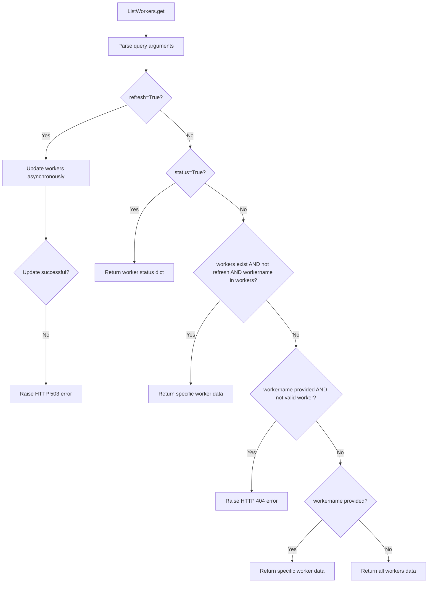

# `workers.py`

## `flower.api.workers.ListWorkers` · *class*

## Summary:
ListWorkers is a Tornado web handler that provides endpoints for retrieving information about Celery workers in the Flower monitoring interface.

## Description:
This class implements a GET endpoint for listing Celery workers managed by the Flower application. It serves as part of the Flower API for monitoring and controlling Celery workers. The handler supports various query parameters to customize the response, including refreshing worker data, checking worker status, and filtering by specific worker names.

The class inherits from ControlHandler, which provides worker validation utilities and integrates with the Flower application's worker management system. It requires authentication before processing requests.

## State:
- Inherits all state from ControlHandler including request context and application reference
- `self.application.workers`: Dictionary mapping worker names to their metadata
- `self.application.events.state.workers`: Dictionary containing worker event state information
- Query arguments processed during request handling:
  - `refresh` (bool): When True, updates worker information from the broker
  - `status` (bool): When True, returns only alive status of workers
  - `workername` (str): Optional worker name to filter results

## Lifecycle:
- Creation: Automatically instantiated by Tornado web framework when matching API routes
- Usage: Framework calls get() method with HTTP request parameters
- Destruction: Managed by Tornado framework lifecycle

## Method Map:


## Raises:
- web.HTTPError(503): Raised when worker refresh operation fails
- web.HTTPError(404): Raised when a specific worker name is requested but not found

## Example:
```python
# Request to refresh worker data
GET /api/workers?refresh=true

# Request to get worker status
GET /api/workers?status=true

# Request to get specific worker data
GET /api/workers?workername=worker1

# Request to get all workers
GET /api/workers
```

### `flower.api.workers.ListWorkers.get` · *method*

## Summary:
Retrieves worker information from the application, supporting refresh, status, and specific worker queries.

## Description:
Handles HTTP GET requests to fetch worker data from the Flower monitoring application. This method supports multiple query parameters to customize the response, including refreshing worker data, retrieving worker status, or fetching specific worker information.

The method orchestrates different response strategies based on query parameters:
1. When 'refresh' is True, it updates worker information from the Celery inspector
2. When 'status' is True, it returns alive status for all workers
3. When 'workername' is specified, it returns either specific worker data or raises a 404 error for unknown workers

This logic is encapsulated in its own method to provide a clean separation of concerns between request parameter handling and business logic, making the code more testable and maintainable.

## Args:
    self: Instance of ListWorkers class inheriting from ControlHandler

## Returns:
    None: Response is written directly to the HTTP response via self.write()

## Raises:
    web.HTTPError: 
        - 404: When a specific workername is requested but not found in application workers
        - 503: When worker refresh operation fails due to underlying exceptions

## State Changes:
    Attributes READ: 
    - self.application.workers: Collection of registered worker information
    - self.application.events.state.workers: Current worker status information
    - self.application.update_workers: Method to refresh worker data
    - self.is_worker: Method to validate worker existence
    - self.get_argument: Method to parse query parameters

## Constraints:
    Preconditions:
    - self.application must be properly initialized with workers and events attributes
    - self.application.update_workers must be callable with optional workername parameter
    - self.is_worker must be callable for worker validation
    
    Postconditions:
    - Response is written to HTTP response via self.write()
    - No modifications to object state occur

## Side Effects:
    - I/O operations: Calls to self.application.update_workers() which likely involves network communication with Celery inspectors
    - External service calls: Communication with Celery broker/inspectors for worker status updates
    - Potential logging: Error messages logged via logger.error() when refresh fails

