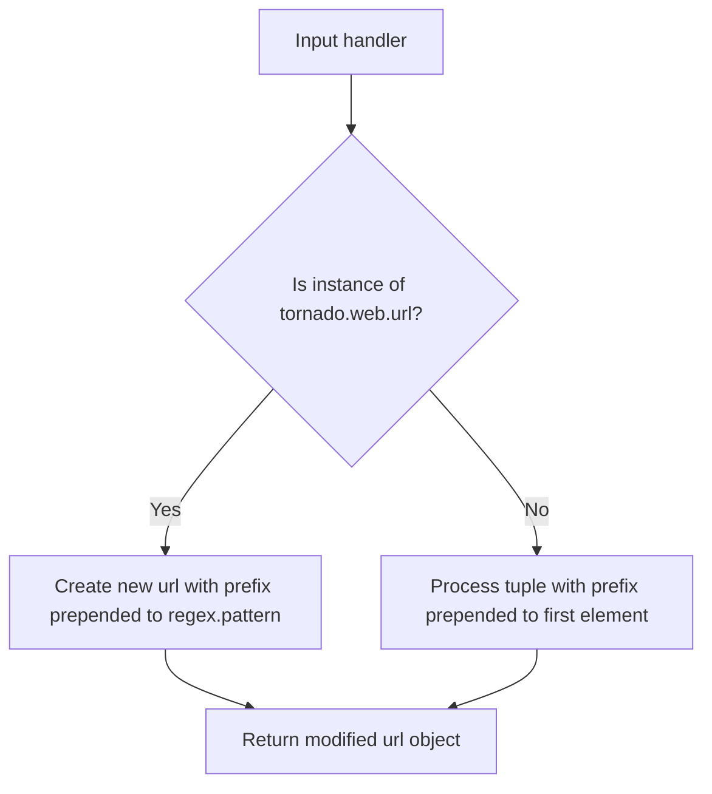
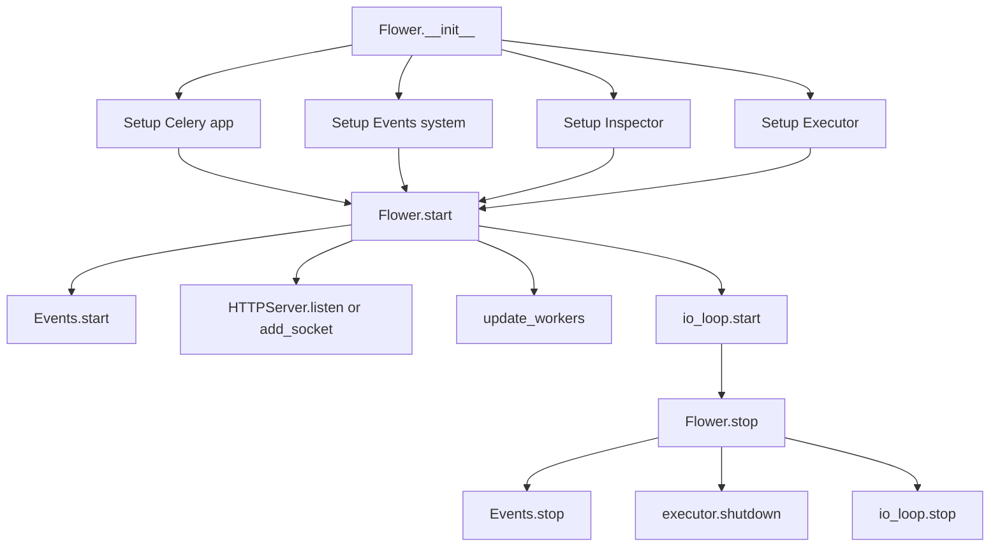

# `app.py`

## `flower.app.rewrite_handler` · *function*

## Summary:
Rewrites URL handlers by prepending a URL prefix to route patterns for proper URL routing.

## Description:
This utility function modifies URL handlers to prepend a specified prefix to their URL patterns. It handles both tornado.web.url objects and tuple-based URL configurations, ensuring consistent URL routing when applications are mounted under sub-paths. The function is extracted to provide a clean abstraction for URL pattern manipulation without duplicating prefix logic throughout the application.

## Args:
    handler (Union[tornado.web.url, tuple]): The URL handler to rewrite. Can be either a tornado.web.url object or a tuple of (pattern, handler_class).
    url_prefix (str): The URL prefix to prepend to the handler's URL pattern. Leading and trailing slashes are removed before prepending.

## Returns:
    Union[tornado.web.url, tuple]: A rewritten URL handler with the prefix applied to its URL pattern. Returns a tornado.web.url object if the input was a url object, otherwise returns a tuple.

## Raises:
    None explicitly raised by this function.

## Constraints:
    Preconditions:
    - url_prefix should be a string
    - handler should be either a tornado.web.url object or a tuple with at least one element (URL pattern)
    
    Postconditions:
    - The returned handler maintains the same handler class/function
    - The URL pattern in the returned handler will have the prefix prepended
    - If the original handler was a url object, the returned value will also be a url object with updated pattern
    - The prefix is stripped of leading and trailing slashes before being prepended

## Side Effects:
    None.

## Control Flow:


## Examples:
    # Example 1: With tornado.web.url object
    original_url = url(r'/api/users', UserHandler)
    prefixed_url = rewrite_handler(original_url, '/v1')
    # Result: url(r'/v1/api/users', UserHandler)
    
    # Example 2: With tuple handler
    original_tuple = (r'/users', UserHandler)
    prefixed_tuple = rewrite_handler(original_tuple, '/api')
    # Result: ('/api/users', UserHandler)
    
    # Example 3: With prefix containing slashes
    original_url = url(r'/users', UserHandler)
    prefixed_url = rewrite_handler(original_url, '/v1/')
    # Result: url(r'/v1/users', UserHandler) - note the trailing slash is stripped

## `flower.app.Flower` · *class*

## Summary:
Flower is a Tornado web application that provides a web-based monitoring interface for Celery task queues.

## Description:
The Flower class serves as the main application controller for the Flower monitoring tool. It integrates with Celery to monitor task queues, workers, and events, exposing this information through a web interface. The class manages the lifecycle of the monitoring application, including starting/stopping the web server, managing worker inspection, and handling event collection from Celery workers.

This class is typically instantiated by the Flower application startup process and serves as the central coordination point for all monitoring activities. It creates and manages the underlying Celery app, event monitoring system, worker inspector, and Tornado web server components.

## State:
- options: Configuration options for the application (options.Options), defaults to default_options if not provided
- io_loop: Tornado I/O loop instance for asynchronous operations (tornado.ioloop.IOLoop), defaults to the global instance  
- ssl_options: SSL configuration options for the web server (dict or None), inherited from parent tornado.web.Application class
- capp: Celery application instance (celery.Celery), defaults to a new Celery() instance
- executor: Thread pool executor for handling blocking operations (concurrent.futures.ThreadPoolExecutor)
- inspector: Inspector instance for collecting worker information (inspector.Inspector)
- events: Events instance for capturing and processing Celery events (events.Events)
- started: Boolean flag indicating whether the application has been started (bool), initially False
- workers: Property that returns worker inspection data (collections.defaultdict(dict)), accessed via inspector

## Lifecycle:
Creation: Instantiate with optional configuration parameters (options, capp, events, io_loop). The constructor sets up all required components including the Celery app, event monitoring system, worker inspector, and thread pool executor. The class inherits from tornado.web.Application.

Usage: Call start() to begin serving HTTP requests and monitoring Celery events. The application will run indefinitely until stop() is called.

Destruction: Call stop() to gracefully shut down the application, which stops event monitoring, shuts down executors, and stops the IOLoop.

## Method Map:


## Raises:
- AttributeError: When accessing attributes that don't exist on the underlying Celery app or other components
- ValueError: Potentially raised during initialization if invalid configuration options are provided
- RuntimeError: If attempting to stop an already stopped application or start an already started application

## Example:
```python
# Create a Flower instance with default settings
app = Flower()

# Start the monitoring application
app.start()

# The application will run indefinitely until stopped
# To stop it programmatically:
# app.stop()

# Access worker information
# workers = app.workers
```

### `flower.app.Flower.__init__` · *method*

## Summary:
Initializes a Flower application instance with configuration options, Celery integration, event handling, and asynchronous execution capabilities.

## Description:
Configures the Flower web application by setting up core components including options parsing, Celery application initialization, I/O loop management, thread pool execution, inspector service, and event handling system. This method serves as the primary constructor that establishes the application's runtime environment and initializes all required subsystems for monitoring Celery workers and tasks.

## Args:
    options (object, optional): Application configuration options. Defaults to None, which uses default_options.
    capp (celery.Celery, optional): Celery application instance. Defaults to None, which creates a new Celery instance.
    events (Events, optional): Event handling system instance. Defaults to None, which creates a new Events instance.
    io_loop (tornado.ioloop.IOLoop, optional): Tornado I/O loop instance. Defaults to None, which uses the default IOLoop instance.
    **kwargs: Additional keyword arguments passed to the parent class constructor.

## Returns:
    None: This method initializes the object's state and does not return a value.

## Raises:
    None explicitly raised by this method.

## State Changes:
    Attributes WRITTEN:
    - self.options: Set to provided options or default_options
    - self.io_loop: Set to provided io_loop or default IOLoop instance
    - self.ssl_options: Set from kwargs or None
    - self.capp: Set to provided capp or new Celery instance
    - self.executor: Set to ThreadPoolExecutor instance
    - self.inspector: Set to Inspector instance
    - self.events: Set to provided events or new Events instance
    - self.started: Set to False

## Constraints:
    Preconditions:
    - The default_handlers variable must be available in scope
    - The rewrite_handler function must be available in scope
    - The class must have a parent class that accepts the kwargs passed to super().__init__()
    
    Postconditions:
    - self.options is properly initialized with either provided options or defaults
    - self.capp is initialized with default modules imported
    - self.executor is configured with appropriate worker count
    - self.inspector is initialized with correct timeout settings
    - self.events is initialized with appropriate configuration parameters
    - self.started flag is set to False

## Side Effects:
    - Creates and configures a new Celery application instance
    - Initializes a thread pool executor for concurrent operations
    - Sets the default executor on the I/O loop
    - Creates an Inspector service for monitoring
    - Creates an Events system for tracking task events
    - May modify global I/O loop configuration

### `flower.app.Flower.start` · *method*

## Summary:
Starts the Flower web application server and initializes all required components for monitoring Celery tasks.

## Description:
This method initializes and starts the Flower web application server. It begins the events monitoring system, configures the HTTP server to listen on either a TCP port or Unix socket based on configuration, marks the application as started, updates worker information, and begins the IOLoop to handle requests. This method represents the main entry point for launching the Flower monitoring interface.

## Args:
    None

## Returns:
    None

## Raises:
    None explicitly raised

## State Changes:
    Attributes READ: self.events, self.options, self.ssl_options, self.io_loop
    Attributes WRITTEN: self.started, self.inspector

## Constraints:
    Preconditions: 
    - The Flower instance must be properly initialized with all required attributes
    - The io_loop must be available and ready
    - The events system must be properly configured
    
    Postconditions:
    - self.started flag is set to True
    - Events monitoring is active
    - HTTP server is configured and listening
    - Worker information is updated

## Side Effects:
    - Starts background threads for event monitoring
    - Creates network socket connections (TCP or Unix)
    - Begins IOLoop execution which blocks indefinitely
    - May create or modify filesystem resources (Unix socket permissions)

### `flower.app.Flower.stop` · *method*

## Summary:
Stops the Flower application by shutting down event handling, executors, and the event loop.

## Description:
This method gracefully terminates a running Flower application instance. It is designed to be called when the application needs to be stopped, ensuring proper cleanup of resources such as event handlers, thread pools, and the Tornado I/O loop. The method only executes its shutdown logic if the application was previously started.

## Args:
    None

## Returns:
    None

## Raises:
    None explicitly raised

## State Changes:
    Attributes READ: self.started, self.events, self.executor, self.io_loop
    Attributes WRITTEN: self.started

## Constraints:
    Preconditions: The method should only be called on a Flower instance that has been started (self.started = True)
    Postconditions: The Flower instance is marked as not started (self.started = False), and all associated resources are shut down

## Side Effects:
    I/O operations: Calls shutdown on ThreadPoolExecutor which may involve closing file descriptors or other resources
    External service calls: Calls stop() on Events instance which may involve stopping background threads and timers
    Mutations to objects outside self: Stops the Tornado I/O loop which affects the entire application's event processing

### `flower.app.Flower.transport` · *method*

## Summary:
Returns the driver type identifier for the Celery broker connection transport.

## Description:
This property retrieves the driver type of the underlying transport mechanism used by Celery for communication with the message broker. It provides insight into what type of broker connection is being used (e.g., Redis, RabbitMQ, etc.) by examining the transport layer configuration.

## Args:
    None

## Returns:
    str or None: The driver type string (e.g., 'redis', 'amqp') if available, or None if the transport or driver_type attribute is not accessible.

## Raises:
    AttributeError: If the connection or transport structure doesn't support the expected attributes.

## State Changes:
    Attributes READ: self.capp
    Attributes WRITTEN: None

## Constraints:
    Preconditions: The Flower instance must have been initialized with a valid Celery app (capp) that has a working connection.
    Postconditions: The returned value is either a string representing the transport driver type or None.

## Side Effects:
    None

### `flower.app.Flower.workers` · *method*

## Summary:
Returns the worker inspection data collected by the application's inspector.

## Description:
This property provides access to the worker inspection data that has been collected and updated by the application's Inspector instance. The data is maintained as a dictionary where each key is a worker name and each value is a dictionary containing various inspection results for that worker.

## Args:
    None

## Returns:
    collections.defaultdict(dict): A dictionary-like structure where keys are worker names and values are dictionaries containing inspection data for each worker.

## Raises:
    None

## State Changes:
    Attributes READ: self.inspector.workers
    Attributes WRITTEN: None

## Constraints:
    Preconditions: The Flower application must be initialized with an Inspector instance
    Postconditions: The returned value is a reference to the internal workers storage, not a copy

## Side Effects:
    None

### `flower.app.Flower.update_workers` · *method*

## Summary:
Updates worker inspection data by querying Celery worker information.

## Description:
Delegates to the Inspector instance to collect comprehensive information about Celery workers. This method initiates asynchronous inspection operations for all registered worker inspection methods (stats, active_queues, registered, scheduled, active, reserved, revoked, conf) and returns a list of concurrent futures representing these operations.

## Args:
    workername (str, optional): Specific worker name to inspect. If None, inspects all workers. Defaults to None.

## Returns:
    list: A list of concurrent futures representing the asynchronous inspection operations for each worker inspection method.

## Raises:
    None explicitly raised by this method. Exceptions may occur in underlying inspector operations.

## State Changes:
    Attributes READ: self.inspector
    Attributes WRITTEN: None directly modified by this method (though self.inspector.workers may be updated indirectly through callback mechanisms)

## Constraints:
    Preconditions: 
    - self.inspector must be initialized (should be set during Flower.__init__)
    - The Flower application must be running (though this is not enforced by the method itself)
    
    Postconditions:
    - Returns a list of futures that will eventually contain worker inspection results
    - The actual worker data is stored in self.inspector.workers via callbacks

## Side Effects:
    - Initiates asynchronous network calls to connected Celery workers
    - May trigger logging messages during inspection operations
    - Triggers callbacks that update internal worker state in self.inspector.workers

