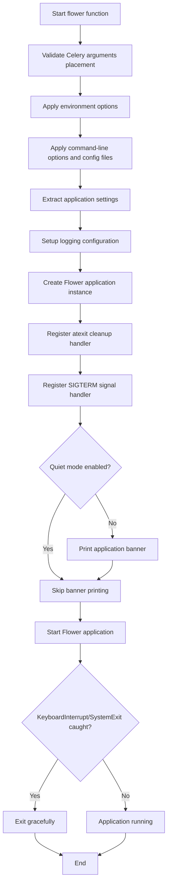
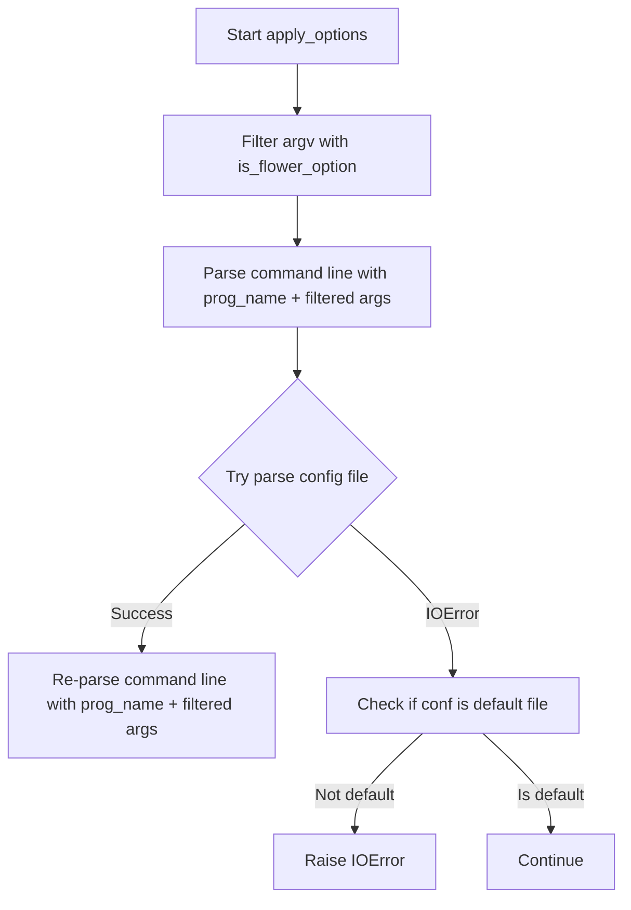
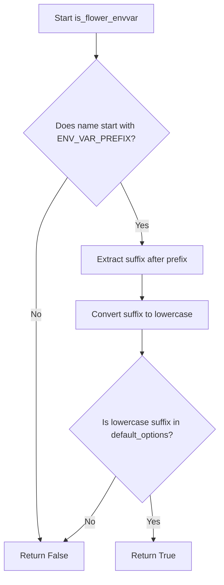

# `command.py`

## `flower.command.sigterm_handler` · *function*

## Summary:
Handles termination signals by logging the signal and exiting the application gracefully.

## Description:
This function serves as a signal handler for termination signals (such as SIGTERM) to ensure graceful shutdown of the Flower application. It logs the detected signal number and terminates the process with exit code 0.

The function is typically registered with Python's signal module using `signal.signal()` to catch termination signals sent to the process.

## Args:
    signum (int): The signal number that triggered this handler (e.g., 15 for SIGTERM)
    _ (Any): Placeholder for the frame argument required by signal handlers, not used in implementation

## Returns:
    None: This function does not return a value as it calls sys.exit(0) which terminates the process.

## Raises:
    SystemExit: Raised when sys.exit(0) is called, causing the program to terminate.

## Constraints:
    Preconditions:
    - The function must be registered as a signal handler using signal.signal() before it can be invoked
    - A logger instance must be available in the module scope for logging purposes
    
    Postconditions:
    - The application will terminate with exit code 0 upon successful execution
    - A log message will be written indicating the signal that triggered shutdown

## Side Effects:
    - Writes an informational log message to the application's logger
    - Terminates the current process with exit code 0 via sys.exit()

## Control Flow:
```mermaid
flowchart TD
    A[Signal Received] --> B{sigterm_handler invoked}
    B --> C[Log signal number]
    C --> D[Call sys.exit(0)]
    D --> E[Process terminates]
```

## Examples:
```python
import signal
import sys

# Register the signal handler
signal.signal(signal.SIGTERM, sigterm_handler)

# Application runs normally...
# When SIGTERM is received, sigterm_handler is called:
# INFO: SIGTERM detected, shutting down
# Process exits with code 0
```

## `flower.command.flower` · *function*

## Summary:
Initializes and starts the Flower web application for monitoring Celery task queues.

## Description:
The flower function serves as the main entry point for launching the Flower web application. It orchestrates the complete startup sequence including argument validation, configuration loading, logging setup, and application initialization. The function creates a Flower application instance with the specified Celery app, options, and settings, then starts the web server to provide a real-time dashboard for monitoring Celery tasks.

This function is extracted from inline logic to provide a clean separation between application startup orchestration and the core application functionality, making it easier to test and maintain the startup process independently. It handles the complete lifecycle of starting the Flower web application, including proper cleanup registration and signal handling.

## Args:
    ctx: Click context object providing access to command structure and parent command parameters. Must have a properly initialized obj attribute containing a Celery app instance at ctx.obj.app.
    tornado_argv: List of command-line arguments to be processed by Tornado's option parser. These arguments are filtered to only include valid Flower options.

## Returns:
    None: This function does not return any value. It manages the application lifecycle directly.

## Raises:
    KeyboardInterrupt: Raised when the user interrupts the application with Ctrl+C. This exception is caught internally and allows for graceful shutdown.
    SystemExit: Raised when the application receives a system exit signal. This exception is caught internally and allows for graceful shutdown.

## Constraints:
    Preconditions:
    - ctx must be a valid Click context object with a properly initialized obj attribute
    - ctx.obj.app must be a valid Celery application instance
    - tornado_argv must be a list of string arguments for Tornado option parsing
    - All supporting functions (warn_about_celery_args_used_in_flower_command, apply_env_options, etc.) must be properly implemented and available
    - The global tornado.options module must be properly initialized
    
    Postconditions:
    - The Flower web application is initialized and ready to serve requests
    - Signal handlers are registered for graceful shutdown (SIGTERM, atexit)
    - Logging is configured according to application settings
    - The application will be running until interrupted or stopped
    - The application's event loop is started

## Side Effects:
    - Modifies global state through Tornado options system
    - Registers signal handlers for SIGTERM and atexit cleanup
    - Prints banner information to console when not in quiet mode (ctx.obj.quiet is False)
    - Starts the Tornado web server and event loop
    - May read configuration files from disk
    - Configures logging system
    - Calls methods on the Flower application instance (start, stop)

## Control Flow:


## Examples:
    # Typical usage in command line:
    # flower --port=5555 --broker=redis://localhost:6379/0
    
    # With configuration file:
    # flower --conf=myconfig.cfg --port=5555
    
    # Quiet mode (no banner):
    # flower --quiet --port=5555
    
    # With SSL:
    # flower --port=5555 --certfile=cert.pem --keyfile=key.pem
    
    # Error handling example:
    # Ctrl+C during execution will trigger KeyboardInterrupt and shut down gracefully

## `flower.command.apply_env_options` · *function*

## Summary:
Processes environment variables with a specific prefix and applies their values to Tornado application options.

## Description:
This function filters environment variables to identify those that correspond to Flower configuration options, extracts their values, converts them to appropriate types, and sets them as attributes on the global Tornado options object. It enables configuration of the Flower web application through environment variables rather than just command-line arguments or config files.

The function is extracted from inline logic to provide a clean separation between environment variable processing and application startup, allowing for easier testing and reuse of the environment variable parsing functionality.

## Args:
    None

## Returns:
    None

## Raises:
    KeyError: When an environment variable name maps to an option that doesn't exist in the options registry (both with and without underscores).

## Constraints:
    Preconditions:
    - Environment variables must follow the naming convention with a specific prefix (ENV_VAR_PREFIX)
    - The global constant `ENV_VAR_PREFIX` must be defined in the module scope
    - The global function `is_flower_envvar` must be defined to identify valid configuration environment variables
    - The global variable `options` from `tornado.options` must be initialized with valid option definitions
    - The global function `strtobool` must be available for boolean conversion
    - The `options._options` dictionary must contain the option definitions being referenced

    Postconditions:
    - All matching environment variables are processed and applied to the global options object
    - Option values are properly converted to their expected types (including boolean conversion)
    - Multiple-value options are split and converted appropriately
    - Invalid environment variables that don't map to existing options are silently ignored

## Side Effects:
    - Modifies the global `options` object from `tornado.options` by setting attributes
    - May cause side effects in the application if option changes affect runtime behavior

## Control Flow:
```mermaid
flowchart TD
    A[Start apply_env_options] --> B[Filter env vars with is_flower_envvar]
    B --> C{Any matching env vars?}
    C -- No --> D[Return]
    C -- Yes --> E[Process each env var]
    E --> F[Extract option name (remove prefix, lowercase)]
    F --> G{Tries to find option in options._options[name]}
    G -- KeyError --> H[Try options._options[name.replace('_', '-')]]
    H --> I{Found option?}
    I -- No --> J[Skip invalid option]
    I -- Yes --> K[Process value based on option type]
    K --> L{Is multiple value option?}
    L -- Yes --> M[Split by comma, convert each item]
    L -- No --> N{Is boolean option?}
    N -- Yes --> O[Convert with strtobool]
    N -- No --> P[Convert with option.type]
    P --> Q[Set attribute on options object]
    M --> Q
    O --> Q
    Q --> R[Continue to next env var]
    J --> R
    R --> S{More env vars?}
    S -- Yes --> E
    S -- No --> T[End]
```

## Examples:
    # Assuming ENV_VAR_PREFIX = "FLOWER_"
    # Set broker URL via environment variable
    # export FLOWER_BROKER_URL="redis://localhost:6379/0"
    # apply_env_options() would set options.broker_url = "redis://localhost:6379/0"
    
    # Set auto refresh via environment variable
    # export FLOWER_AUTO_REFRESH=true
    # apply_env_options() would set options.auto_refresh = True
    
    # Set multiple hosts via comma-separated environment variable
    # export FLOWER_ALLOWED_HOSTS="localhost,127.0.0.1"
    # apply_env_options() would set options.allowed_hosts = ["localhost", "127.0.0.1"]
    
    # Invalid environment variable (non-existent option) is silently ignored
    # export FLOWER_INVALID_OPTION="some_value"
    # apply_env_options() would skip this without error

## `flower.command.apply_options` · *function*

## Summary:
Processes command-line arguments and configuration files for the Flower web application, setting up application options and configuration.

## Description:
Parses command-line arguments to configure the Flower application and loads configuration from a specified file. This function filters command-line arguments to only process valid Flower options using the `is_flower_option` helper function, then parses command-line arguments using Tornado's option parsing system. It attempts to load a configuration file and re-parses command-line arguments afterward to ensure proper option precedence. The function handles cases where configuration files may not exist by raising appropriate errors for non-default configuration files.

This logic is extracted into its own function to encapsulate the complex process of command-line argument and configuration file processing, providing a clean interface for initializing the Flower application's runtime configuration while maintaining proper option precedence and error handling. The function is typically called during the early stages of application startup to establish the initial configuration state.

## Args:
    prog_name (str): The name of the program being executed, used as the first argument when parsing command-line options.
    argv (list[str]): List of command-line arguments to process, excluding the program name.

## Returns:
    None: This function does not return a value. It modifies global state through the Tornado options system.

## Raises:
    IOError: Raised when a specified configuration file cannot be read, but only if the file is not the default configuration file (`DEFAULT_CONFIG_FILE`).

## Constraints:
    Preconditions:
    - The `tornado.options` module must be properly initialized and imported
    - The `is_flower_option` function must be available in the same module scope
    - Command-line arguments should be properly formatted strings
    
    Postconditions:
    - Global `tornado.options` will be updated with parsed command-line arguments and configuration file values
    - Configuration file parsing will have occurred if specified in options

## Side Effects:
    - Modifies global state in the `tornado.options` module
    - May read from the filesystem when parsing configuration files
    - Sets up logging configuration via `tornado.log.enable_pretty_logging`

## Control Flow:


## Examples:
    >>> apply_options('flower', ['--port=5555', '--conf=myconfig.cfg'])
    # Processes command-line arguments and loads configuration from myconfig.cfg
    
    >>> apply_options('flower', ['--invalid-option'])
    # Only processes valid Flower options, ignores invalid ones

## `flower.command.warn_about_celery_args_used_in_flower_command` · *function*

## Summary:
Validates proper positioning of Celery arguments in command line when using flower command.

## Description:
This function validates that Celery command-line arguments are correctly positioned after the 'celery' command rather than after the 'flower' command. It prevents common user errors where Celery-specific flags are mistakenly placed after the flower command, which would cause them to be ignored.

## Args:
    ctx: Click context object providing access to command structure and parent command parameters
    flower_args: Iterable of string arguments passed to the flower command (e.g., ['--port=5555', '--broker=redis://localhost'])

## Returns:
    None: This function does not return any value

## Raises:
    None: This function does not explicitly raise exceptions

## Constraints:
    Preconditions:
    - ctx must be a Click context object with a parent command having a params attribute
    - ctx.parent.command.params must contain parameter objects with opts attribute (list of option strings)
    - flower_args must be iterable containing string arguments in format "key=value" or "--key"
    - Each argument string should be parseable by arg.partition("=") method
    
    Postconditions:
    - Input parameters remain unmodified
    - Only warning messages are logged via the logger when invalid argument positions are detected

## Side Effects:
    - Logs warning message to application logger when incorrectly positioned Celery arguments are detected
    - No external state mutations or I/O operations beyond standard logging

## Control Flow:
```mermaid
flowchart TD
    A[Start function] --> B{flower_args not empty?}
    B -- Yes --> C[Extract all celery option strings from ctx.parent.command.params]
    B -- No --> F[End]
    C --> D[Initialize empty incorrectly_used_args list]
    D --> E[For each arg in flower_args]
    E --> G[Split arg using partition("=") to extract arg_name]
    G --> H{arg_name in celery_options?}
    H -- Yes --> I[Append arg_name to incorrectly_used_args]
    H -- No --> J[Continue to next arg]
    E --> K[End loop over flower_args]
    K --> L{incorrectly_used_args not empty?}
    L -- Yes --> M[Log warning with incorrectly_used_args list]
    L -- No --> F
    M --> F
```

## Examples:
    # Example usage in command line context:
    # Incorrect usage: celery --broker=redis://localhost flower --port=5555 --broker=redis://localhost
    # This would trigger a warning because --broker is a Celery argument used after flower command
    # Correct usage would be: celery --broker=redis://localhost flower --port=5555

## `flower.command.setup_logging` · *function*

## Summary:
Configures logging settings for the Flower web application based on debug mode and logging level options.

## Description:
This function adjusts logging configuration for the Flower application. When debug mode is enabled and logging is set to 'info', it promotes the logging level to 'debug' and enables pretty logging. In all other cases, it configures the tornado.access logger to use a NullHandler to suppress access logs.

## Args:
    None

## Returns:
    None

## Raises:
    None explicitly raised

## Constraints:
    Preconditions:
    - The `tornado.options.options` object must be properly initialized with 'debug' and 'logging' attributes
    - The 'debug' attribute should be a boolean value
    - The 'logging' attribute should be a string representing log level

    Postconditions:
    - Logging configuration is adjusted according to the debug and logging options
    - The tornado.access logger is either configured with pretty logging or NullHandler

## Side Effects:
    - Modifies global logging configuration via `logging.getLogger("tornado.access")`
    - May enable pretty logging through `tornado.log.enable_pretty_logging()`
    - Sets `options.logging` to 'debug' when conditions are met

## Control Flow:
```mermaid
flowchart TD
    A[setup_logging called] --> B{options.debug AND options.logging == 'info'}
    B -- Yes --> C[options.logging = 'debug']
    C --> D[enable_pretty_logging()]
    B -- No --> E[Get tornado.access logger]
    E --> F[Add NullHandler]
    F --> G[Set propagate = False]
```

## Examples:
```python
# Typical usage in application startup
from tornado.options import options
options.debug = True
options.logging = 'info'
setup_logging()  # Will enable pretty logging

# Another usage pattern
options.debug = False
options.logging = 'warning'
setup_logging()  # Will configure tornado.access logger with NullHandler
```

## `flower.command.extract_settings` · *function*

*No documentation generated.*

## `flower.command.is_flower_option` · *function*

## Summary:
Determines whether a command-line argument is a valid Flower configuration option.

## Description:
Checks if a given command-line argument corresponds to a recognized configuration option in the Flower application. This function is used to distinguish between valid Flower options and arguments that should be passed through to other components or ignored.

The function processes command-line arguments by removing leading dashes, splitting on '=', converting hyphens to underscores, and checking if the resulting name exists as an attribute in the global `tornado.options` object.

This logic is extracted into its own function to provide a clean interface for validating command-line arguments before processing them, ensuring that only valid Flower options are handled by the application's configuration system.

## Args:
    arg (str): A command-line argument string that may represent a Flower option. Expected to start with one or two dashes followed by an option name.

## Returns:
    bool: True if the argument corresponds to a valid Flower option (i.e., the processed option name exists as an attribute in `tornado.options`), False otherwise.

## Raises:
    None: This function does not raise any exceptions under normal operation.

## Constraints:
    Preconditions:
    - The argument must be a string
    - The `tornado.options` module must be properly initialized and imported
    
    Postconditions:
    - The function returns a boolean value indicating option validity
    - No side effects occur during execution

## Side Effects:
    None: This function performs only attribute lookup operations and has no observable side effects.

## Control Flow:
```mermaid
flowchart TD
    A[Input arg] --> B{arg.lstrip('-')}
    B --> C{partition("=")}
    C --> D[name.replace('-', '_')]
    D --> E{hasattr(options, name)}
    E --> F{Return result}
```

## Examples:
    >>> is_flower_option("--port=5555")
    True
    
    >>> is_flower_option("--invalid-option")
    False
    
    >>> is_flower_option("-v")
    True  # Assuming 'v' is a valid tornado option

## `flower.command.is_flower_envvar` · *function*

## Summary:
Checks if an environment variable name corresponds to a recognized Flower configuration option.

## Description:
This function determines whether a given environment variable name follows the Flower configuration naming convention. It verifies if the environment variable name begins with a specific prefix and if the portion following that prefix exists in the set of default configuration options (case-insensitively).

This utility function is used to filter and identify environment variables that should be processed as Flower configuration parameters, separating them from other environment variables that may be unrelated to the application's configuration.

## Args:
    name (str): The name of the environment variable to evaluate.

## Returns:
    bool: True if the environment variable name starts with the Flower environment variable prefix and the suffix (after removing the prefix) exists in the default configuration options when converted to lowercase. False otherwise.

## Raises:
    None explicitly raised.

## Constraints:
    Preconditions:
    - The `name` parameter must be a string.
    - The global constant `ENV_VAR_PREFIX` must be defined in the module scope.
    - The global variable `default_options` must be defined in the module scope and contain a collection of valid configuration option names.

    Postconditions:
    - The function returns a boolean value indicating whether the environment variable name matches the Flower configuration naming pattern.
    - The comparison of the suffix with default_options is case-insensitive.

## Side Effects:
    None.

## Control Flow:


## Examples:
    # Assuming ENV_VAR_PREFIX = "FLOWER_" and "broker_url" is in default_options
    # Valid case
    is_flower_envvar("FLOWER_BROKER_URL")  # Returns True
    
    # Invalid case  
    is_flower_envvar("NON_FLOWER_VAR")  # Returns False
    
    # Case insensitive check
    is_flower_envvar("flower_broker_url")  # Returns True if "broker_url" is in default_options
```

## `flower.command.print_banner` · *function*

## Summary:
Displays application connection information and configuration details in the log output.

## Description:
Prints key information about the Flower web application's configuration including the URL where it's accessible, broker connection details, and registered tasks. This function is typically called during application startup to provide users with access information.

## Args:
    app (Flower): The Flower application instance containing task information and connection details
    ssl (bool): Flag indicating whether SSL/TLS is enabled for the connection

## Returns:
    None: This function does not return any value

## Raises:
    None explicitly raised: The function doesn't contain try/except blocks or explicit raise statements

## Constraints:
    Preconditions:
    - The `options` object from `tornado.options` must be properly initialized with required fields
    - The `app` parameter must be a valid Flower instance with a working connection
    - The `logger` must be configured for logging to work properly
    
    Postconditions:
    - Log messages are written to the configured logger at INFO and DEBUG levels
    - No state changes occur outside of logging operations

## Side Effects:
    - Writes formatted log messages to the configured logger at INFO and DEBUG levels
    - No external state mutations or I/O operations beyond logging

## Control Flow:
```mermaid
flowchart TD
    A[Start print_banner] --> B{unix_socket set?}
    B -- No --> C{url_prefix set?}
    C -- Yes --> D[Set prefix_str = /{url_prefix}/]
    C -- No --> E[Set prefix_str = ""]
    D --> F[Log HTTP URL with prefix]
    E --> F
    B -- Yes --> G[Log Unix socket path]
    F --> H[Log Broker URI]
    G --> H
    H --> I[Log Registered Tasks]
    I --> J[Log Settings (DEBUG)]
    J --> K[End]
```

## Examples:
    # Typical usage during application startup
    from app import Flower
    app = Flower()
    print_banner(app, ssl=True)
    
    # Output would include:
    # Visit me at https://0.0.0.0:5555/
    # Broker: redis://localhost:6379/0
    # Registered tasks: 
    # ['task1', 'task2', 'task3']
    # Settings: {...}

