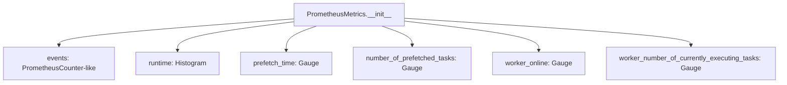

# `events.py`

## `flower.events.get_prometheus_metrics` · *function*

## Summary:
Returns the singleton instance of PrometheusMetrics for monitoring Celery task events and worker statistics.

## Description:
Implements a lazy singleton pattern to ensure only one instance of PrometheusMetrics exists throughout the application lifecycle. This function provides centralized access to monitoring metrics that track Celery task execution, worker status, and system performance.

The function is typically called by various components in the Flower monitoring system that need to record or expose Prometheus metrics. It ensures that all parts of the application reference the same metrics instance, maintaining consistency in monitoring data collection.

This logic is extracted into its own function rather than being inlined because it encapsulates the singleton instantiation logic and provides a clean interface for accessing the global metrics registry, separating concerns between metric creation and usage.

## Args:
    None

## Returns:
    PrometheusMetrics: A singleton instance of the PrometheusMetrics class containing all registered Prometheus metrics for monitoring Celery events and worker statistics.

## Raises:
    None explicitly raised. However, the underlying PrometheusMetrics constructor may raise exceptions during metric registration if the Prometheus client library encounters issues.

## Constraints:
    Preconditions:
    - The Prometheus client library must be properly configured
    - The tornado.options module must be initialized with required configuration
    - The global PROMETHEUS_METRICS variable must be either None or already initialized
    
    Postconditions:
    - Returns a valid PrometheusMetrics instance
    - The returned instance is the same across all calls (singleton guarantee)
    - All metrics are properly initialized and registered with Prometheus

## Side Effects:
    None directly. However, the first call may result in:
    - Initialization of Prometheus metrics via the PrometheusMetrics constructor
    - Potential registration of metrics with the Prometheus client library
    - Access to tornado.options for configuration values

## Control Flow:
```mermaid
flowchart TD
    A[get_prometheus_metrics called] --> B{PROMETHEUS_METRICS is None?}
    B -- Yes --> C[PROMETHEUS_METRICS = PrometheusMetrics()]
    B -- No --> D[Return PROMETHEUS_METRICS]
    C --> D
```

## Examples:
```python
# Typical usage in monitoring components
metrics = get_prometheus_metrics()
metrics.events.inc(worker='worker1', type='task_received', task='my_task')
metrics.runtime.observe(worker='worker1', task='my_task', duration=0.5)

# Multiple calls return the same instance
metrics1 = get_prometheus_metrics()
metrics2 = get_prometheus_metrics()
assert metrics1 is metrics2  # Singleton behavior confirmed
```

## `flower.events.PrometheusMetrics` · *class*

## Summary:
A class that initializes and manages Prometheus metrics for monitoring Celery task events and worker statistics.

## Description:
The PrometheusMetrics class serves as a centralized registry for Prometheus metrics used to monitor Celery task execution, worker status, and system performance. It encapsulates the creation and management of various metric types (counters, histograms, gauges) that track different aspects of the distributed task processing system.

This class provides a clean abstraction layer for metric management, separating monitoring concerns from business logic and ensuring consistent metric naming and labeling conventions throughout the Flower application.

## State:
- events: PrometheusCounter-like metric tracking total number of events with labels ['worker', 'type', 'task']
- runtime: Histogram metric measuring task runtime in seconds with labels ['worker', 'task'] and buckets from options.task_runtime_metric_buckets
- prefetch_time: Gauge metric tracking time tasks spend waiting to be executed with labels ['worker', 'task']
- number_of_prefetched_tasks: Gauge metric tracking number of prefetched tasks per worker and task type with labels ['worker', 'task']
- worker_online: Gauge metric tracking worker online status with label ['worker']
- worker_number_of_currently_executing_tasks: Gauge metric tracking currently executing tasks per worker with label ['worker']

All metrics are initialized during object construction with appropriate names, descriptions, and label schemas.

## Lifecycle:
- Creation: Instantiated without arguments; automatically initializes all Prometheus metrics
- Usage: Metrics are accessed and updated by other components in the system through direct metric manipulation
- Destruction: No explicit cleanup required; relies on Prometheus client library's automatic cleanup mechanisms

## Method Map:


## Raises:
None explicitly raised in __init__. The constructor relies on the Prometheus client library and tornado.options, which may raise exceptions during metric registration or option access.

## Example:
```python
# Create metrics instance
metrics = PrometheusMetrics()

# Metrics are automatically available for use:
# metrics.events.inc()  # Increment event counter
# metrics.runtime.observe(duration)  # Record task runtime
# metrics.prefetch_time.set(time_spent)  # Set prefetch time
```

### `flower.events.PrometheusMetrics.__init__` · *method*

## Summary:
Initializes Prometheus metrics for monitoring Celery task events and worker statistics.

## Description:
Configures and creates various Prometheus client metrics to track Celery task execution, worker status, and performance metrics. This method establishes the foundational monitoring infrastructure for the Flower application's Prometheus integration. It is called during object instantiation to set up all required metrics for collecting telemetry data.

## Args:
    None

## Returns:
    None

## Raises:
    None

## State Changes:
    Attributes READ: None
    Attributes WRITTEN: 
    - self.events: Prometheus Counter for tracking total events by worker, type, and task
    - self.runtime: Prometheus Histogram for measuring task runtime in seconds by worker and task
    - self.prefetch_time: Prometheus Gauge for tracking time tasks spend waiting to be executed by worker and task
    - self.number_of_prefetched_tasks: Prometheus Gauge for tracking number of prefetched tasks by worker and task
    - self.worker_online: Prometheus Gauge for tracking worker online status by worker
    - self.worker_number_of_currently_executing_tasks: Prometheus Gauge for tracking currently executing tasks by worker

## Constraints:
    Preconditions: 
    - The class must be instantiated as part of the Prometheus monitoring system
    - The tornado.options module must be properly configured with task_runtime_metric_buckets
    - The prometheus_client library must be available and properly imported
    
    Postconditions:
    - All Prometheus metrics are initialized and registered with the Prometheus client
    - Instance attributes are set to appropriate metric objects ready for use

## Side Effects:
    None

## `flower.events.EventsState` · *class*

## Summary:
A Celery event state tracker that monitors task execution and worker status by extending the base State class with Prometheus metrics collection.

## Description:
The EventsState class extends the standard Celery State class to provide comprehensive monitoring capabilities for Celery task execution and worker management. It processes incoming Celery events to track task lifecycles (received, started, succeeded, failed) and worker states (online, offline, heartbeat), while simultaneously updating Prometheus metrics for real-time observability.

This class is specifically designed for monitoring systems like Flower that require detailed insights into task execution patterns, worker performance, and system resource utilization. It maintains event counters and updates various Prometheus metrics including task execution times, prefetch timing, worker activity levels, and task success/failure rates.

## State:
- counter: collections.defaultdict(collections.Counter)
  - Type: Nested defaultdict structure for counting events by worker and event type
  - Valid range/values: Tracks counts for all event types (task-received, task-started, task-succeeded, task-failed, etc.) per worker
  - Invariant: Maintains event count aggregation across all workers and event types
- metrics: PrometheusMetrics instance
  - Type: Instance returned by get_prometheus_metrics() function
  - Valid range/values: Contains all registered Prometheus metrics for monitoring
  - Invariant: Singleton instance maintained by get_prometheus_metrics() function
- tasks: inherited from State class
  - Type: Dictionary mapping task IDs to task objects (from parent State)
  - Valid range/values: Contains all currently tracked tasks
  - Invariant: Maintained by parent State class

## Lifecycle:
- Creation: Instantiate with standard State constructor arguments (passed to parent)
- Usage: Call event() method with Celery event dictionaries containing 'type', 'hostname', and other relevant fields
- Destruction: No explicit cleanup required; relies on garbage collection

## Method Map:
```mermaid
graph TD
    A[EventsState.event] --> B[super().event(event)]
    B --> C[Extract worker_name and event_type]
    C --> D[Update counter[worker_name][event_type]]
    D --> E{event_type starts with 'task-'}
    E -->|Yes| F[Process task-specific metrics]
    E -->|No| G[Process worker-specific metrics]
    F --> H[Update events metric]
    F --> I[Update runtime metric if present]
    F --> J[Update prefetch metrics based on event type]
    G --> K[Update worker online/offline metrics]
    K --> L[Update executing tasks metric if present]
```

## Raises:
- No explicit exceptions raised by __init__
- Exceptions from parent State.__init__ may propagate
- Exceptions from get_prometheus_metrics() may propagate if Prometheus client fails

## Example:
```python
# Create an EventsState instance
events_state = EventsState()

# Process a task received event
task_received_event = {
    'type': 'task-received',
    'hostname': 'worker1@hostname',
    'uuid': 'task-uuid-123',
    'name': 'myapp.tasks.my_task'
}
events_state.event(task_received_event)

# Process a worker heartbeat event
heartbeat_event = {
    'type': 'worker-heartbeat',
    'hostname': 'worker1@hostname',
    'active': 2
}
events_state.event(heartbeat_event)

# Process a task completion event
task_completed_event = {
    'type': 'task-succeeded',
    'hostname': 'worker1@hostname',
    'uuid': 'task-uuid-123',
    'runtime': 0.5
}
events_state.event(task_completed_event)
```

### `flower.events.EventsState.__init__` · *method*

## Summary:
Initializes the EventsState instance by calling the parent State constructor and setting up Prometheus metrics tracking and event counting structures.

## Description:
This constructor initializes the EventsState object by first delegating to the parent State class constructor to establish the base event tracking functionality. It then sets up two key monitoring components: a nested defaultdict structure for counting events by worker and event type, and a Prometheus metrics instance for collecting observability data.

The method is separated from inline initialization to ensure proper inheritance chain execution and to clearly separate the setup of monitoring infrastructure from the core event processing logic that occurs in the event() method.

## Args:
    *args: Variable length argument list passed to the parent State.__init__ method
    **kwargs: Arbitrary keyword arguments passed to the parent State.__init__ method

## Returns:
    None: This is a constructor method that initializes instance attributes

## Raises:
    Exception: May propagate exceptions from parent State.__init__() or get_prometheus_metrics() if initialization fails

## State Changes:
    Attributes READ: None
    Attributes WRITTEN: 
    - self.counter: Initialized as collections.defaultdict(collections.Counter) for event counting
    - self.metrics: Initialized as the singleton PrometheusMetrics instance from get_prometheus_metrics()

## Constraints:
    Preconditions:
    - Parent State class must be properly initialized
    - get_prometheus_metrics() function must be callable and return a valid PrometheusMetrics instance
    - Arguments passed to parent constructor must be valid for State.__init__()

    Postconditions:
    - self.counter is initialized as a nested defaultdict structure
    - self.metrics is initialized as a valid PrometheusMetrics singleton instance
    - Parent State initialization is complete

## Side Effects:
    None directly. However, the first call to get_prometheus_metrics() may result in:
    - Initialization of Prometheus metrics registry
    - Registration of metric collectors with the Prometheus client library

### `flower.events.EventsState.event` · *method*

## Summary:
Processes Celery events to maintain task execution metrics, worker status tracking, and prefetch statistics.

## Description:
This method serves as the primary event processor for the Flower monitoring system, extending the parent State class functionality to handle Celery worker and task events. It processes incoming events to update Prometheus metrics for monitoring task execution performance, worker availability, and prefetch behavior. The method categorizes events by type and applies specific logic for task lifecycle events (task-received, task-started, task-succeeded, task-failed) and worker status events (worker-online, worker-heartbeat, worker-offline).

## Args:
    event (dict): Celery event dictionary containing keys such as 'hostname', 'type', 'uuid', 'name', 'runtime', and optionally 'active' for heartbeat events.

## Returns:
    None: This method performs side effects and does not return a value.

## Raises:
    KeyError: When required keys ('hostname', 'type') are missing from the event dictionary.
    AttributeError: When accessing attributes on task objects that don't exist (e.g., task.started, task.received).

## State Changes:
    Attributes READ: self.counter, self.tasks, self.metrics
    Attributes WRITTEN: self.counter[worker_name][event_type], various Prometheus metric labels

## Constraints:
    Preconditions: 
    - The event dictionary must contain 'hostname' and 'type' keys
    - For task events, the event must contain 'uuid' key
    - Task objects in self.tasks must have 'started', 'received', and 'eta' attributes
    - Metrics must be properly initialized before calling this method
    
    Postconditions:
    - Event counters are incremented for the worker and event type
    - Prometheus metrics for events, runtime, prefetch time, and worker status are updated
    - Worker online/offline status is tracked via metrics
    - Task execution timing and prefetch metrics are maintained

## Side Effects:
    - Updates Prometheus metrics through the metrics object
    - Modifies internal counter dictionaries
    - May trigger metric collection updates in the monitoring system

## `flower.events.Events` · *class*

## Summary:
Manages Celery event capturing and state tracking in a background thread for Flower monitoring.

## Description:
The Events class extends threading.Thread to continuously capture Celery events from a message broker. It maintains event state using an EventsState object and provides optional persistent storage capabilities. The class is designed to run in the background, periodically enabling events and optionally saving state to disk.

## State:
- io_loop: Tornado IOLoop instance for asynchronous operations
- capp: Celery application instance used for event connections and control commands
- db: Path to persistent storage file (when persistent=True)  
- persistent: Boolean flag indicating whether to load/save state from/to disk
- enable_events: Boolean flag controlling whether to enable events on the Celery app
- state: EventsState instance managing captured event data and state tracking
- state_save_timer: PeriodicCallback for saving state to disk at configured intervals
- timer: PeriodicCallback for periodically enabling events (default interval 5000ms)

## Lifecycle:
Creation: Instantiate with capp (Celery app), io_loop (Tornado IOLoop), and optional parameters for persistence and event control.
Usage: Call start() to begin event capture loop, which internally starts timers and begins capturing events. Call stop() to halt operations and save state if persistent.
Destruction: Thread terminates when run() completes, or via explicit stop() call.

## Method Map:
```mermaid
graph TD
    A[Events.__init__] --> B[Events.start]
    B --> C[Events.run]
    C --> D[EventReceiver.capture]
    D --> E[Events.on_event]
    E --> F[state.event]
    B --> G[timer.start]
    B --> H[state_save_timer.start]
    A --> I[state initialization]
    I --> J[EventsState.__init__]
    G --> K[Events.on_enable_events]
    K --> L[capp.control.enable_events]
    H --> M[Events.save_state]
    M --> N[shelve.open]
    N --> O[shelve['events'] = self.state]
    O --> P[shelve.close]
```

## Raises:
- Exception: Raised when event capture fails due to connection issues, with exponential backoff retry logic

## Example:
```python
# Create Events instance with persistent storage
events = Events(
    capp=celery_app, 
    io_loop=tornado_ioloop,
    db='/tmp/flower_events.db', 
    persistent=True,
    enable_events=True,
    state_save_interval=30000  # Save every 30 seconds
)

# Start event capture
events.start()

# Later, stop event capture
events.stop()
```

### `flower.events.Events.__init__` · *method*

## Summary:
Initializes an Events object that manages Celery event capturing and state tracking in a background thread for Flower monitoring.

## Description:
The Events.__init__ method sets up the foundational configuration for event capture, including establishing connections to the Celery application, configuring persistent storage options, and initializing the event state tracking mechanism. This method prepares the object for background execution by setting up necessary timers and state management components.

## Args:
    capp (celery.Celery): Celery application instance used for event connections and control commands
    io_loop (tornado.ioloop.IOLoop): Tornado IOLoop instance for asynchronous operations
    db (str, optional): Path to persistent storage file for saving/loading event state. Defaults to None
    persistent (bool): Boolean flag indicating whether to load/save state from/to disk. Defaults to False
    enable_events (bool): Boolean flag controlling whether to enable events on the Celery app. Defaults to True
    state_save_interval (int): Interval in milliseconds for periodically saving state to disk. Defaults to 0 (disabled)
    **kwargs: Additional keyword arguments passed to EventsState constructor

## Returns:
    None: This method initializes the object's state and does not return a value.

## Raises:
    None explicitly raised by this method.

## State Changes:
    Attributes READ: None
    Attributes WRITTEN: 
    - self.io_loop: Set to provided io_loop parameter
    - self.capp: Set to provided capp parameter
    - self.db: Set to provided db parameter
    - self.persistent: Set to provided persistent parameter
    - self.enable_events: Set to provided enable_events parameter
    - self.state: Initialized to None, later set to EventsState instance
    - self.state_save_timer: Initialized to None, later set to PeriodicCallback if state_save_interval > 0
    - self.timer: Initialized to PeriodicCallback for enabling events

## Constraints:
    Preconditions:
    - capp must be a valid Celery application instance
    - io_loop must be a valid Tornado IOLoop instance
    - db must be a valid file path string if persistent=True
    - state_save_interval must be a non-negative integer
    
    Postconditions:
    - The object is properly configured for background event capture
    - If persistent=True, state is loaded from the specified database file
    - If persistent=True and state_save_interval > 0, a periodic save timer is created
    - An EventsState instance is created and assigned to self.state
    - A timer for enabling events is created and ready to start

## Side Effects:
    - Creates a new thread that will run in daemon mode
    - May perform file I/O operations when loading/saving persistent state
    - Uses shelve module for serialization/deserialization of state data
    - Sets up periodic callbacks for state saving and event enabling

### `flower.events.Events.start` · *method*

## Summary:
Starts the event handling thread and initializes associated periodic timers for event processing and state persistence.

## Description:
This method extends the standard threading.Thread.start() functionality by additionally starting periodic timers required for event processing. It is typically called during the initialization phase of the Flower monitoring application to begin capturing and processing Celery task events. The method ensures that event-related timers are started only when enabled, and state-saving timers are activated when persistence is configured.

## Args:
    None: This method takes no arguments beyond the implicit self parameter.

## Returns:
    None: This method does not return a value.

## Raises:
    None explicitly raised by this method.

## State Changes:
    Attributes READ:
    - self.enable_events: Boolean flag indicating whether event processing is enabled
    - self.timer: PeriodicCallback instance for enabling events
    - self.state_save_timer: PeriodicCallback instance for saving state (when persistent mode is enabled)

    Attributes WRITTEN:
    - None: This method does not modify any instance attributes directly.

## Constraints:
    Preconditions:
    - The object must be properly initialized with all required attributes (capp, io_loop, etc.)
    - The threading.Thread base class must be properly initialized
    - self.timer and self.state_save_timer must be valid PeriodicCallback instances if they are to be started

    Postconditions:
    - The underlying thread is started via threading.Thread.start()
    - If self.enable_events is True, self.timer is started
    - If self.state_save_timer exists, it is started
    - The thread begins executing the event capture loop in the run() method

## Side Effects:
    - Starts the underlying threading.Thread execution
    - Initiates periodic callback execution for event processing
    - Initiates periodic callback execution for state saving (when configured)
    - May cause logging messages to be emitted at debug level

### `flower.events.Events.stop` · *method*

*No documentation generated.*

### `flower.events.Events.run` · *method*

## Summary:
Continuously captures and processes Celery events with exponential backoff retry logic.

## Description:
This method implements a persistent event capturing loop that monitors Celery events using an EventReceiver. It handles connection failures gracefully with exponential backoff retry mechanism and provides proper signal handling for graceful shutdown.

## Args:
    None

## Returns:
    None

## Raises:
    KeyboardInterrupt: When Ctrl+C is pressed, interrupts the main thread
    SystemExit: When system exit is requested, interrupts the main thread
    Exception: When unexpected errors occur during event capture

## State Changes:
    Attributes READ: 
        - self.capp: Celery application instance for connection management
        - self.on_event: Event handler method for processing captured events
    Attributes WRITTEN: 
        - None

## Constraints:
    Preconditions:
        - self.capp must be initialized with a valid Celery application instance
        - self.on_event must be a callable method that can handle Celery events
        - Logger must be configured for proper error reporting
    Postconditions:
        - The method runs indefinitely until interrupted by SIGINT/SIGTERM
        - Event capturing continues with exponential backoff on connection failures

## Side Effects:
    - Establishes and maintains connections to the Celery broker
    - Processes incoming Celery events through the registered handler
    - Logs error messages when connection attempts fail
    - May interrupt the main thread on SIGINT/SIGTERM signals

### `flower.events.Events.save_state` · *method*

## Summary:
Saves the current event state to a persistent shelve database file.

## Description:
This method serializes the current state object to a shelve database file, overwriting any existing data. It's typically called during periodic state persistence operations to ensure event data is durably stored.

## Args:
    None

## Returns:
    None

## Raises:
    None explicitly raised

## State Changes:
    Attributes READ: self.db, self.state
    Attributes WRITTEN: None

## Constraints:
    Preconditions: 
    - self.db must be a valid file path string
    - self.state must be serializable by shelve
    - The directory containing self.db must be writable
    
    Postconditions:
    - The shelve database file at self.db contains the serialized state object under the key 'events'
    - The database file is properly closed after writing

## Side Effects:
    - Writes to disk at the location specified by self.db
    - May create a new file if it doesn't exist
    - Uses the shelve module for serialization

### `flower.events.Events.on_enable_events` · *method*

## Summary:
Enables Celery events periodically to maintain event capture functionality.

## Description:
This method is responsible for periodically enabling Celery events to ensure continuous event capture. It's invoked by a periodic callback timer every 5 seconds and runs the Celery control command to enable events in a background executor to avoid blocking the main I/O loop.

## Args:
    None

## Returns:
    None

## Raises:
    None explicitly raised

## State Changes:
    Attributes READ: self.io_loop, self.capp
    Attributes WRITTEN: None

## Constraints:
    Preconditions: 
    - self.io_loop must be a valid Tornado IOLoop instance
    - self.capp must be a valid Celery application instance with control interface
    - The method should only be called when events are meant to be enabled
    
    Postconditions:
    - Celery events are enabled via the control interface
    - Method execution doesn't block the main I/O loop due to async execution

## Side Effects:
    - Invokes Celery's control.enable_events command asynchronously
    - May cause network I/O when communicating with the Celery broker
    - Uses thread pool executor for asynchronous execution

### `flower.events.Events.on_event` · *method*

## Summary:
Schedules asynchronous processing of incoming events through the state event handler.

## Description:
Handles events captured by the Celery event receiver by scheduling their processing on the I/O loop. This method serves as the primary event handler for all captured events and ensures non-blocking event processing through asynchronous callbacks.

## Args:
    event (dict): The event dictionary containing event metadata and data from Celery

## Returns:
    None: This method does not return a value

## Raises:
    None explicitly raised: The method delegates to underlying components that may raise exceptions

## State Changes:
    Attributes READ: 
    - self.io_loop: The Tornado I/O loop used for scheduling callbacks
    - self.state: The EventsState instance responsible for event processing
    
    Attributes WRITTEN: 
    - None: This method doesn't modify object state directly

## Constraints:
    Preconditions:
    - self.io_loop must be initialized and running
    - self.state must be initialized and contain a valid event method
    - event must be a valid dictionary containing event data
    
    Postconditions:
    - The event will be processed asynchronously by the state's event handler
    - Event processing occurs on the I/O loop thread

## Side Effects:
    - Schedules a callback on the I/O loop for asynchronous event processing
    - May trigger metric updates through the EventsState's event handler
    - May cause state changes in the EventsState instance through event processing

