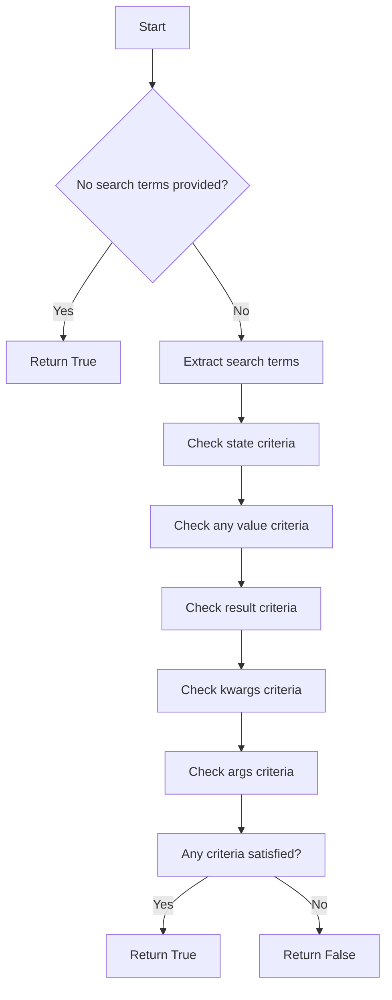
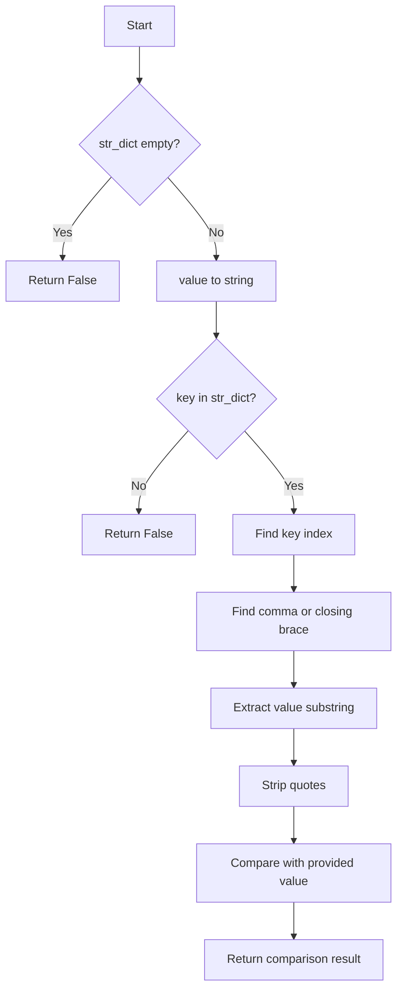
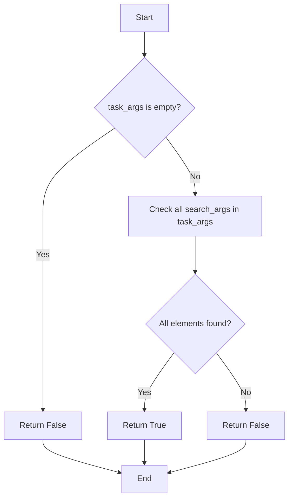

# `search.py`

## `flower.utils.search.parse_search_terms` · *function*

## Summary:
Parses a raw search string into structured components based on prefixed keywords and quoted string handling.

## Description:
Processes a search query string by splitting it into components using regex that respects quoted substrings, then categorizes each component based on prefix keywords. The function supports special prefixes like 'result:', 'args:', 'kwargs:', and 'state:' to organize search terms into structured data. All values are preprocessed to remove surrounding quotes and whitespace.

## Args:
    raw_search_value (str): The raw search query string to parse. Can be empty or None.

## Returns:
    dict: A dictionary containing parsed search components with keys:
        - 'result': Single value for result: prefix
        - 'args': List of values for args: prefix  
        - 'kwargs': Dictionary of key-value pairs for kwargs: prefix
        - 'state': List of values for state: prefix
        - 'any': Single fallback value for un-prefixed terms
    Returns empty dict {} if input is falsy.

## Raises:
    None: This function does not explicitly raise exceptions.

## Constraints:
    Preconditions:
        - Input can be any string or None/empty value
        - The function assumes `preprocess_search_value` is available in scope
        
    Postconditions:
        - Output dictionary always contains valid string values (processed by preprocess_search_value)
        - All quoted strings are properly handled by regex pattern
        - Unprefixed terms are stored under 'any' key
        - Multiple values for same prefix are accumulated in lists/dictionaries

## Side Effects:
    None: This function has no side effects.

## Control Flow:
```mermaid
flowchart TD
    A[Start: parse_search_terms] --> B{raw_search_value is falsy?}
    B -- Yes --> C[Return {}]
    B -- No --> D[Initialize parsed_search = {}]
    D --> E[Apply regex to split query_parts]
    E --> F[For each query_part]
    F --> G{query_part starts with 'result:'?}
    G -- Yes --> H[parsed_search['result'] = preprocess_search_value()]
    G -- No --> I{query_part starts with 'args:'?}
    I -- Yes --> J[Ensure 'args' key exists, append to list]
    I -- No --> K{query_part starts with 'kwargs:'?}
    K -- Yes --> L[Try split by '=', handle ValueError]
    K -- No --> M{query_part starts with 'state:'?}
    M -- Yes --> N[Ensure 'state' key exists, append to list]
    M -- No --> O[Store under 'any' key]
    H --> P[Continue loop]
    J --> P
    L --> P
    N --> P
    O --> P
    P --> Q{End of query_parts?}
    Q -- No --> F
    Q -- Yes --> R[Return parsed_search]
```

## Examples:
    >>> parse_search_terms('result:success args:1 args:2')
    {'result': 'success', 'args': ['1', '2']}
    
    >>> parse_search_terms('kwargs:key=value state:pending any:search_term')
    {'kwargs': {'key': 'value'}, 'state': ['pending'], 'any': 'search_term'}
    
    >>> parse_search_terms('"quoted term" args:"another quoted"')
    {'any': 'quoted term', 'args': ['another quoted']}
    
    >>> parse_search_terms('')
    {}

## `flower.utils.search.satisfies_search_terms` · *function*

## Summary:
Determines whether a task matches specified search criteria across multiple dimensions including state, result, arguments, and keyword arguments.

## Description:
This function evaluates whether a given task satisfies various search terms by checking multiple criteria simultaneously. It's designed to support flexible task filtering in monitoring and management systems. The function processes search terms for state, result content, arguments, keyword arguments, and general value matching across task properties.

The logic is extracted into its own function to provide a centralized, reusable mechanism for task filtering that can be applied consistently across different parts of the application. This approach separates the filtering logic from the calling code, improving maintainability and testability.

## Args:
    task (object): A task object containing properties like name, uuid, state, worker, args, kwargs, and result
    search_terms (dict): Dictionary containing optional search criteria with keys:
        - 'any' (str, optional): Search term to match against any task property
        - 'result' (str, optional): Search term to match against task result content
        - 'args' (list, optional): List of arguments to search for in task arguments
        - 'kwargs' (dict, optional): Dictionary of key-value pairs to search for in task keyword arguments
        - 'state' (list, optional): List of states to match against task state

## Returns:
    bool: True if the task satisfies any of the specified search criteria, False otherwise. Returns True when no search terms are provided.

## Raises:
    None explicitly raised

## Constraints:
    Preconditions:
        - task should be a valid object with attributes: name, uuid, state, worker, args, kwargs, and result
        - search_terms should be a dictionary with valid structure for the supported keys
        - task.worker should be either None or have a hostname attribute if used in search
        
    Postconditions:
        - Function returns a boolean value indicating match status
        - Input parameters are not modified
        - All search criteria are evaluated according to their specific rules

## Side Effects:
    None

## Control Flow:


## Examples:
    # Match any task (no search terms)
    result = satisfies_search_terms(task, {})
    # Returns True
    
    # Match by state
    result = satisfies_search_terms(task, {'state': ['SUCCESS', 'FAILURE']})
    # Returns True if task state is SUCCESS or FAILURE
    
    # Match by result content
    result = satisfies_search_terms(task, {'result': 'error'})
    # Returns True if task result contains 'error'
    
    # Match by any value
    result = satisfies_search_terms(task, {'any': 'worker1'})
    # Returns True if 'worker1' appears in any task property
    
    # Match by arguments
    result = satisfies_search_terms(task, {'args': ['arg1', 'arg2']})
    # Returns True if all arguments are present in task args
```

## `flower.utils.search.stringified_dict_contains_value` · *function*

## Summary:
Checks if a stringified dictionary contains a specific key-value pair by parsing the string representation.

## Description:
This function examines a stringified dictionary representation to determine if it contains a given key with a matching value. It's designed to work with dictionaries serialized as strings, commonly used in message queues or configuration systems where data needs to be transmitted as strings.

The function extracts the value associated with a specified key from the stringified dictionary and compares it with the provided value. It handles various edge cases including empty dictionaries, missing keys, and malformed string representations.

This logic is extracted into its own function to encapsulate the complex string parsing and comparison logic, making the calling code cleaner and more readable while providing a reusable component for similar operations.

## Args:
    key (str): The key to search for in the stringified dictionary
    value (Any): The value to compare against the value found for the key
    str_dict (str): The stringified dictionary to search within

## Returns:
    bool: True if the key exists in the stringified dictionary and its value matches the provided value, False otherwise

## Raises:
    None explicitly raised

## Constraints:
    Preconditions:
    - str_dict should be a valid string representation of a dictionary with key-value pairs in the format {"key": "value"}
    - key should be a string that could potentially exist in the dictionary
    - The stringified dictionary should contain properly formatted JSON-like syntax

    Postconditions:
    - Returns a boolean value indicating the presence and match of the key-value pair
    - Does not modify the input parameters

## Side Effects:
    None

## Control Flow:


## Examples:
    # Basic usage
    result = stringified_dict_contains_value("status", "active", '{"status": "active", "type": "user"}')
    # Returns True
    
    # Non-matching value
    result = stringified_dict_contains_value("status", "inactive", '{"status": "active", "type": "user"}')
    # Returns False
    
    # Missing key
    result = stringified_dict_contains_value("priority", "high", '{"status": "active", "type": "user"}')
    # Returns False
    
    # Empty dictionary
    result = stringified_dict_contains_value("any_key", "any_value", "")
    # Returns False
    
    # Integer value comparison
    result = stringified_dict_contains_value("count", 5, '{"status": "active", "count": 5}')
    # Returns True

## `flower.utils.search.preprocess_search_value` · *function*

## Summary:
Strips quotation marks and whitespace from the beginning and end of a search value string.

## Description:
Processes raw search input by removing leading and trailing quotation marks and whitespace characters. This utility function ensures consistent formatting of search terms before further processing or indexing.

## Args:
    raw_value (str, optional): The raw search input string to process. May be None or empty.

## Returns:
    str: The processed search value with surrounding quotes and whitespace removed. Returns empty string if input is falsy.

## Raises:
    None: This function does not raise any exceptions.

## Constraints:
    Preconditions:
        - Input can be any string or None/empty value
        - No validation is performed on input type beyond truthiness check
    
    Postconditions:
        - Output is always a string
        - Leading and trailing quotation marks ('"') are removed
        - Leading and trailing whitespace characters are removed

## Side Effects:
    None: This function has no side effects.

## Control Flow:
```mermaid
flowchart TD
    A[Start: preprocess_search_value] --> B{raw_value is truthy?}
    B -- Yes --> C[raw_value.strip('" ')]
    B -- No --> D["'' (empty string)"]
    C --> E[Return result]
    D --> E
```

## Examples:
    >>> preprocess_search_value(' "hello world" ')
    'hello world'
    
    >>> preprocess_search_value('"test"')
    'test'
    
    >>> preprocess_search_value('   spaced   ')
    'spaced'
    
    >>> preprocess_search_value(None)
    ''
    
    >>> preprocess_search_value('')
    ''

## `flower.utils.search.task_args_contains_search_args` · *function*

## Summary:
Determines whether all specified search arguments are present in the task arguments collection.

## Description:
This function evaluates whether every element in the search arguments list exists within the task arguments collection. It serves as a utility for validating argument sets in task processing workflows. The function is commonly used in task filtering and validation scenarios where it's necessary to ensure that a task contains all required arguments before proceeding with execution.

## Args:
    task_args (iterable): Collection of task arguments to search within. Can be a list, tuple, or other iterable containing string-like elements.
    search_args (iterable): Collection of arguments to look for within task_args. Can be a list, tuple, or other iterable containing string-like elements.

## Returns:
    bool: True if all elements in search_args are found in task_args, False otherwise. Returns False immediately if task_args is empty or None.

## Raises:
    None: This function does not raise any exceptions.

## Constraints:
    Preconditions:
        - Both task_args and search_args should be iterable objects
        - Elements within both collections should be comparable (typically strings)
    Postconditions:
        - The function returns a boolean value indicating membership of all search arguments in task arguments
        - No modifications are made to either input collection

## Side Effects:
    None: This function has no side effects. It only performs read operations on the input parameters.

## Control Flow:


## Examples:
    # Basic usage with lists
    >>> task_args_contains_search_args(['arg1', 'arg2', 'arg3'], ['arg1', 'arg2'])
    True
    
    # Missing argument case
    >>> task_args_contains_search_args(['arg1', 'arg2'], ['arg1', 'arg3'])
    False
    
    # Empty task args
    >>> task_args_contains_search_args([], ['arg1'])
    False
    
    # Empty search args (returns True as all zero elements are present)
    >>> task_args_contains_search_args(['arg1', 'arg2'], [])
    True
```

