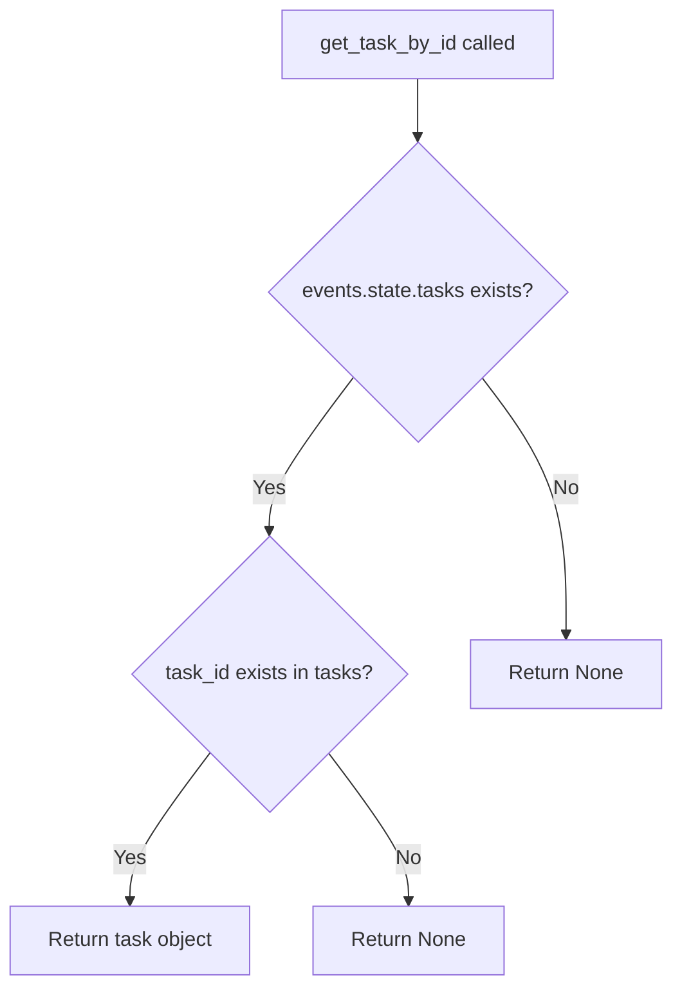

# `tasks.py`

## `flower.utils.tasks.iter_tasks` · *function*

## Summary:
Generates filtered and sorted task records from event data, supporting pagination and multiple filter criteria.

## Description:
Provides a generator interface for iterating over task records with comprehensive filtering capabilities. This function extracts tasks from event data, applies various filters (type, worker, state, date ranges, search terms), and supports sorting and pagination. The function is designed to efficiently process large numbers of tasks while maintaining memory efficiency through lazy evaluation.

## Args:
    events (object): Event data container with state attribute providing access to tasks.
    limit (int, optional): Maximum number of tasks to yield. Defaults to None (no limit).
    offset (int): Number of initial tasks to skip before yielding results. Defaults to 0.
    type (str, optional): Filter tasks by task name/type. Defaults to None.
    worker (str, optional): Filter tasks by worker hostname. Defaults to None.
    state (str, optional): Filter tasks by task state. Defaults to None.
    sort_by (str, optional): Attribute name to sort tasks by. Prefix with '-' for descending order. Defaults to None.
    received_start (str, optional): Filter tasks received after this datetime ('YYYY-MM-DD HH:MM'). Defaults to None.
    received_end (str, optional): Filter tasks received before this datetime ('YYYY-MM-DD HH:MM'). Defaults to None.
    started_start (str, optional): Filter tasks started after this datetime ('YYYY-MM-DD HH:MM'). Defaults to None.
    started_end (str, optional): Filter tasks started before this datetime ('YYYY-MM-DD HH:MM'). Defaults to None.
    search (dict, optional): Search terms to filter tasks by content. Defaults to None.

## Returns:
    generator: Generator yielding tuples of (uuid, task) for matching tasks, where uuid is the task identifier and task is the task object.

## Raises:
    None: This function does not explicitly raise exceptions.

## Constraints:
    Preconditions:
        - The events parameter must have a state attribute with a tasks_by_timestamp() method
        - If sort_by is specified, it must be a valid key supported by the sort_tasks function (imported from same module)
        - Date filter strings must be in 'YYYY-MM-DD HH:MM' format
        - Search terms must be compatible with the parse_search_terms and satisfies_search_terms functions (imported from search module)
    
    Postconditions:
        - Generator yields tasks in the specified order (sorted if sort_by is provided)
        - Generator respects pagination limits (limit and offset)
        - All filtering criteria are applied consistently
        - Tasks are yielded in chronological order (by timestamp) unless sorted differently

## Side Effects:
    None: This function has no side effects.

## Control Flow:
```mermaid
flowchart TD
    A[Start iter_tasks] --> B[Initialize counter i=0]
    B --> C[Get tasks from events.state.tasks_by_timestamp()]
    C --> D{sort_by provided?}
    D -- Yes --> E[Sort tasks using sort_tasks()]
    D -- No --> F[Skip sorting]
    E --> F
    F --> G[Parse search terms]
    G --> H[Iterate through tasks]
    H --> I{Filter by type?}
    I -- Yes --> J[Skip if type mismatch]
    I -- No --> K{Filter by worker?}
    K -- Yes --> L[Skip if worker mismatch]
    K -- No --> M{Filter by state?}
    M -- Yes --> N[Skip if state mismatch]
    M -- No --> O{Filter by received_start?}
    O -- Yes --> P[Skip if received < start]
    O -- No --> Q{Filter by received_end?}
    Q -- Yes --> R[Skip if received > end]
    Q -- No --> S{Filter by started_start?}
    S -- Yes --> T[Skip if started < start]
    S -- No --> U{Filter by started_end?}
    U -- Yes --> V[Skip if started > end]
    U -- No --> W{Search terms provided?}
    W -- Yes --> X[Skip if search terms not satisfied]
    W -- No --> Y[Check offset condition]
    Y --> Z{i >= offset?}
    Z -- Yes --> AA[Yield task]
    Z -- No --> AB[Skip]
    AB --> AC{i += 1}
    AC --> AD{Limit specified?}
    AD -- Yes --> AE{i == limit + offset?}
    AE -- Yes --> AF[Break loop]
    AE -- No --> AG[Continue]
    AD -- No --> AG
    AG --> AH[Loop back to H]
    AF --> AI[End]
    AH --> AI
```

## Examples:
    # Get all tasks with pagination
    for uuid, task in iter_tasks(events, limit=10, offset=20):
        print(f"Task {uuid}: {task.name}")
    
    # Get tasks of specific type received in last 24 hours
    yesterday = (datetime.datetime.now() - datetime.timedelta(days=1)).strftime('%Y-%m-%d %H:%M')
    for uuid, task in iter_tasks(events, type='my_task_type', received_start=yesterday):
        print(f"Recent task: {task.name}")
    
    # Get sorted tasks with search filter
    search_terms = {'any': 'error', 'state': ['failed']}
    for uuid, task in iter_tasks(events, sort_by='-received', search=search_terms):
        print(f"Latest failed task: {task.name}")

## `flower.utils.tasks.sort_tasks` · *function*

## Summary:
Generates tasks in sorted order based on a specified attribute, supporting both ascending and descending sort orders.

## Description:
This function provides a reusable mechanism for sorting task objects by various attributes. It accepts a collection of tasks and a sort specification, then yields the tasks in the appropriate sorted order. The sorting supports both ascending and descending orders through a prefix '-' in the sort specification.

## Args:
    tasks (iterable): An iterable of task objects, where each task is expected to be a tuple with the second element being the object to sort by attribute.
    sort_by (str): A string specifying the attribute name to sort by. If prefixed with '-', sorting will be in descending order.

## Returns:
    generator: A generator yielding task objects in sorted order according to the specified sort criteria.

## Raises:
    AssertionError: When the specified sort_by attribute is not found in the predefined sort_keys dictionary.

## Constraints:
    Preconditions:
        - The `sort_by` parameter must be a valid key in the global `sort_keys` dictionary
        - Each item in `tasks` must be a tuple where the second element has the attribute specified by `sort_by`
    Postconditions:
        - The returned generator will yield all input tasks exactly once
        - Tasks are yielded in sorted order based on the specified attribute

## Side Effects:
    None

## Control Flow:
```mermaid
flowchart TD
    A[sort_tasks called] --> B{sort_by starts with -}
    B -- Yes --> C[Set reverse=True, remove - prefix]
    B -- No --> C
    C --> D[Validate sort_by in sort_keys]
    D --> E[Get sort_by attribute from task[1]]
    E --> F{Attribute exists?}
    F -- No --> G[Use sort_keys fallback]
    F -- Yes --> G
    G --> H[Sort tasks with key function]
    H --> I[Yield sorted tasks]
```

## Examples:
    # Sort tasks by creation date (ascending)
    sorted_tasks = sort_tasks(task_list, 'created_at')
    
    # Sort tasks by priority (descending)
    sorted_tasks = sort_tasks(task_list, '-priority')
```

## `flower.utils.tasks.get_task_by_id` · *function*

## Summary:
Retrieves a task object from the events state by its unique identifier.

## Description:
This function provides access to a specific task stored within the events state's task collection. It serves as a centralized accessor for task retrieval, abstracting the underlying data structure used to store tasks.

The function is typically called when a component needs to access or manipulate a specific task identified by its unique ID. This abstraction allows the system to change the internal representation of tasks without affecting code that depends on retrieving tasks by ID.

## Args:
    events: An object containing state information, specifically a tasks collection
    task_id: The unique identifier of the task to retrieve

## Returns:
    The task object associated with the given task_id, or None if no such task exists

## Raises:
    None explicitly raised - relies on the underlying dict.get() method behavior

## Constraints:
    Preconditions:
    - The events parameter must have a state attribute
    - The events.state must have a tasks attribute that supports the .get() method
    - The task_id parameter should be of a type compatible with the tasks dictionary keys
    
    Postconditions:
    - The function returns either a task object or None
    - No modification is made to the underlying tasks collection

## Side Effects:
    None - this function performs only read operations

## Control Flow:


## Examples:
```python
# Basic usage
task = get_task_by_id(events, "task_123")
if task:
    print(f"Found task: {task.name}")
else:
    print("Task not found")

# In a search context
search_results = []
for task_id in task_ids:
    task = get_task_by_id(events, task_id)
    if task and satisfies_search_terms(task, search_terms):
        search_results.append(task)
```

## `flower.utils.tasks.as_dict` · *function*

## Summary:
Converts a task object into a dictionary representation.

## Description:
This function serves as a simple delegation wrapper that converts a task object into its dictionary representation by calling the task's built-in `as_dict()` method. The function abstracts away the direct method call and provides a consistent interface for retrieving task data as a dictionary.

## Args:
    task (object): A task object that implements an `as_dict()` method. The task object typically contains metadata and state information about a specific operation or process.

## Returns:
    dict: A dictionary representation of the task object, containing all relevant task data and metadata. The exact structure depends on the implementation of the task's `as_dict()` method.

## Raises:
    AttributeError: If the provided task object does not have an `as_dict()` method.

## Constraints:
    Preconditions:
        - The `task` parameter must be a valid object that implements the `as_dict()` method
        - The task object should be properly initialized and contain valid data
    
    Postconditions:
        - The returned dictionary is a copy of the task's internal data representation
        - The original task object remains unchanged

## Side Effects:
    None: This function does not perform any I/O operations or modify external state.

## Control Flow:
```mermaid
flowchart TD
    A[as_dict(task)] --> B{task.has_as_dict_method?}
    B -- Yes --> C[task.as_dict()]
    B -- No --> D[AttributeError]
    C --> E[Return dict]
    D --> F[Raise AttributeError]
```

## Examples:
```python
# Basic usage
task = SomeTaskClass()
task_dict = as_dict(task)
print(task_dict)  # Outputs dictionary representation of the task

# Typical usage in a task processing pipeline
processed_tasks = [as_dict(task) for task in task_queue]
```

