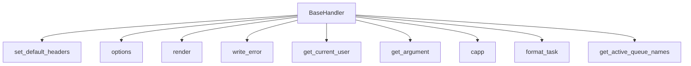

# `__init__.py`

## `flower.views.__init__.BaseHandler` · *class*

## Summary:
BaseHandler is a foundational request handler class that extends Tornado's RequestHandler to provide common functionality for web views in the Flower monitoring application.

## Description:
This class serves as the base class for all web request handlers in the Flower application. It provides standardized behavior for CORS handling, template rendering, error management, authentication, and utility methods for working with Celery tasks. The class is designed to be extended by specific view handlers that implement particular functionality.

The BaseHandler manages authentication through both Basic Auth and OAuth2 mechanisms, handles cross-origin resource sharing, and provides utilities for processing arguments and formatting Celery tasks. It also implements proper error handling with customized responses for different HTTP status codes.

## State:
- `application`: Reference to the Tornado application instance containing configuration and shared resources
- `capp`: Property that returns the Celery application object from the application instance  
- `request`: Inherited from RequestHandler, contains the HTTP request information
- `response`: Inherited from RequestHandler, contains the HTTP response information

## Lifecycle:
Creation: Instances are automatically created by Tornado's routing mechanism when HTTP requests are received. The constructor is inherited from RequestHandler and doesn't require special instantiation.

Usage: The class follows standard Tornado request lifecycle:
1. Request arrives and Tornado instantiates BaseHandler subclass
2. Methods like get(), post(), put(), delete() are called based on HTTP method
3. The handler processes the request and generates a response

Destruction: Cleanup is handled automatically by Tornado's request lifecycle management.

## Method Map:


## Raises:
- tornado.web.HTTPError: Raised in several methods when authentication fails (401), invalid arguments are provided (400), or other HTTP errors occur
- ValueError: Raised during Basic Auth header parsing when Authorization header is malformed
- Exception: Raised during task formatting when custom formatting functions fail

## Example:
```python
# Typical usage would be extending this class
class MyView(BaseHandler):
    def get(self):
        # Access Celery app via capp property
        celery_app = self.capp
        
        # Get authenticated user
        user = self.get_current_user()
        
        # Process arguments with type conversion
        page = self.get_argument('page', type=int)
        
        # Render template
        self.render('my_template.html', data='example')
```

### `flower.views.__init__.BaseHandler.set_default_headers` · *method*

## Summary:
Sets Cross-Origin Resource Sharing (CORS) headers for API responses when authentication is disabled.

## Description:
Configures CORS headers to allow cross-origin requests from any domain when basic authentication or token-based authentication is not enabled. This method is typically called during the HTTP response preparation phase to ensure proper CORS handling for API endpoints.

## Args:
    self: The BaseHandler instance

## Returns:
    None

## Raises:
    None explicitly raised

## State Changes:
    Attributes READ: 
        - self.application.options.basic_auth
        - self.application.options.auth
    Attributes WRITTEN:
        - HTTP response headers via self.set_header()

## Constraints:
    Preconditions:
        - self must be an instance of BaseHandler class
        - self.application must be initialized with options attribute
        - self.application.options must contain basic_auth and auth attributes
    Postconditions:
        - If authentication is disabled, CORS headers are set on the response
        - If authentication is enabled, no CORS headers are set

## Side Effects:
    - Modifies HTTP response headers by calling self.set_header()

### `flower.views.__init__.BaseHandler.options` · *method*

## Summary:
Sets the HTTP status to 204 (No Content) and finishes the response for OPTIONS requests.

## Description:
This method handles HTTP OPTIONS requests, typically used for CORS preflight requests. It sets the response status to 204 (No Content) and completes the HTTP response without sending any content back to the client.

## Args:
    *_ (tuple): Arbitrary positional arguments that are ignored.
    **__ (dict): Arbitrary keyword arguments that are ignored.

## Returns:
    None: This method does not return any value.

## Raises:
    None: This method does not explicitly raise any exceptions.

## State Changes:
    Attributes READ: None
    Attributes WRITTEN: None

## Constraints:
    Preconditions: None
    Postconditions: The HTTP response status is set to 204 and the response is completed.

## Side Effects:
    None: This method does not perform any I/O operations or mutate external state beyond setting the HTTP response status and finishing the response.

### `flower.views.__init__.BaseHandler.render` · *method*

## Summary:
Renders a template with enhanced context including utility functions and URL prefix.

## Description:
This method extends the standard rendering functionality by automatically injecting template utility functions and application URL prefix into the rendering context. It prevents naming conflicts between template utility functions and user-provided arguments, then delegates to the parent class's render method for actual template processing.

This method is typically invoked during HTTP request handling when a view needs to render an HTML template or other templated content to the client. It serves as a common entry point for all view rendering in the application.

## Args:
    *args: Positional arguments passed to the parent render method (typically the template name)
    **kwargs: Keyword arguments passed to the parent render method, which may include template variables

## Returns:
    None: This method doesn't return a value directly, but renders content to the HTTP response

## Raises:
    AssertionError: When any of the template utility function names conflict with existing keyword arguments provided by the caller

## State Changes:
    Attributes READ: 
    - self.application.options (to access url_prefix)
    Attributes WRITTEN: 
    - None: This method doesn't modify any instance attributes directly

## Constraints:
    Preconditions:
    - self.application must be initialized and have an options attribute with url_prefix
    - template module must be available and contain callable functions
    - The parent class must implement a render method that accepts *args and **kwargs
    Postconditions:
    - The rendering context will include all template utility functions and url_prefix
    - No naming conflicts will exist between template functions and provided kwargs

## Side Effects:
    - Calls super().render(), which performs I/O operations to send HTTP response
    - May raise exceptions from the parent render method if template rendering fails

### `flower.views.__init__.BaseHandler.write_error` · *method*

## Summary:
Handles HTTP error responses by rendering appropriate templates or setting specific headers based on the status code.

## Description:
Overrides Tornado's default error handling to provide customized responses for different HTTP status codes. This method is automatically called by the Tornado framework when an HTTP error occurs during request processing. The method renders specific HTML templates for common errors (404, 403, 500) or sets appropriate headers and responses for authentication (401) and other errors.

## Args:
    status_code (int): The HTTP status code that triggered this error handler
    **kwargs: Additional keyword arguments, typically containing 'exc_info' with exception information

## Returns:
    None: This method doesn't return a value but modifies the HTTP response

## Raises:
    None explicitly raised: The method handles exceptions internally through Tornado's framework

## State Changes:
    Attributes READ: 
    - self.application.options.debug
    - self.application.options (for debug flag)
    Attributes WRITTEN:
    - HTTP response headers and body via self.set_header(), self.set_status(), self.write(), self.finish()
    - Response rendered via self.render()

## Constraints:
    Preconditions:
    - Must be called from within a Tornado web request context
    - The status_code parameter must be an integer representing a valid HTTP status code
    - When exc_info is provided, it should contain exception information in the format (exception_type, exception_instance, traceback)
    
    Postconditions:
    - HTTP response is properly formatted according to the status code
    - Appropriate template is rendered or response is sent for the given status code

## Side Effects:
    - Sets HTTP response headers and status codes
    - Renders HTML templates using the application's template engine
    - Writes response content directly to the client connection
    - May include stack trace information in debug mode

### `flower.views.__init__.BaseHandler.get_current_user` · *method*

## Summary:
Determines the authenticated user for the current request by checking both Basic Authentication and OAuth2 session-based authentication.

## Description:
This method implements authentication logic for the web application by first validating Basic Authentication credentials if configured, then falling back to OAuth2-style session validation using secure cookies. It serves as the core authentication handler that integrates with Tornado's web framework authentication system.

The method is typically called by Tornado's authentication mechanisms during request processing to determine if a user is authenticated and who that user is.

## Args:
    self: The BaseHandler instance containing request context and application configuration

## Returns:
    bool or str or None: 
    - True if Basic Authentication is enabled but no specific user validation is required
    - The username string if OAuth2 authentication succeeds
    - None if authentication fails or no authentication is configured

## Raises:
    tornado.web.HTTPError: Raised with status code 401 when authentication fails due to invalid Basic Authentication credentials or malformed Authorization header

## State Changes:
    Attributes READ: 
    - self.application.options.basic_auth
    - self.application.options.auth
    - self.request.headers
    - self.get_secure_cookie()

## Constraints:
    Preconditions:
    - The method assumes self.application.options contains basic_auth and auth configuration
    - The method assumes self.request contains headers with Authorization if Basic Auth is enabled
    - The method assumes self.get_secure_cookie is available for OAuth2 session handling
    
    Postconditions:
    - Returns a boolean, string, or None value indicating authentication status
    - Does not modify any instance state directly

## Side Effects:
    - Reads HTTP request headers
    - Reads secure cookie data from the client
    - May raise HTTPError exceptions which terminate the request processing

### `flower.views.__init__.BaseHandler.get_argument` · *method*

## Summary:
Retrieves HTTP request arguments with XSS escaping and optional type conversion.

## Description:
Retrieves arguments from the HTTP request, applies HTML escaping to prevent XSS attacks, and optionally converts the argument to a specified type. This method enhances security by sanitizing input while providing convenient type conversion for request parameters.

## Args:
    name (str): Name of the argument to retrieve from the HTTP request.
    default (list, optional): Default value if argument is not present. Defaults to [].
    strip (bool, optional): Whether to strip whitespace from the argument. Defaults to True.
    type (callable, optional): Type to convert the argument to. Can be bool, int, float, etc. Defaults to None.

## Returns:
    The argument value, HTML-escaped if it's a string, and optionally converted to the specified type. Returns None if the argument is not found and default is None.

## Raises:
    tornado.web.HTTPError: Raised when type conversion fails and neither the argument nor default is None, with status code 400.

## State Changes:
    Attributes READ: None
    Attributes WRITTEN: None

## Constraints:
    Preconditions: Must be called within a Tornado web request context where the parent handler's get_argument method is available.
    Postconditions: The returned value is either the original argument, HTML-escaped, or converted to the requested type. If type conversion fails and both arg and default are not None, an HTTPError is raised.

## Side Effects:
    None

### `flower.views.__init__.BaseHandler.capp` · *method*

## Summary:
Returns the Celery application object associated with the current request handler.

## Description:
This property provides convenient access to the Celery application instance that is bound to the current web application. It serves as a shorthand for accessing `self.application.capp` throughout the handler's methods.

## Args:
    None

## Returns:
    The Celery application object (typically a `celery.Celery` instance) configured for this application.

## Raises:
    AttributeError: If `self.application` or `self.application.capp` is not properly initialized.

## State Changes:
    Attributes READ: `self.application.capp`
    Attributes WRITTEN: None

## Constraints:
    Preconditions: 
    - `self.application` must be initialized and not None
    - `self.application.capp` must be initialized and not None
    
    Postconditions:
    - Returns a valid Celery application instance
    - The returned object is the same instance referenced by `self.application.capp`

## Side Effects:
    None

### `flower.views.__init__.BaseHandler.format_task` · *method*

## Summary:
Formats a task using a custom formatting function if configured, returning the potentially modified task object.

## Description:
This method applies a custom task formatting function to a task object if one has been configured via the application options. The method creates a copy of the task before applying the formatting function to avoid modifying the original task data. If the custom formatting function raises an exception, it logs the error but continues execution.

## Args:
    task (Any): The task object to be formatted. Expected to have a 'uuid' attribute for logging purposes.

## Returns:
    Any: The formatted task object, either unchanged if no custom formatter is configured or modified by the custom formatter function.

## Raises:
    None explicitly raised, though exceptions from custom formatting functions are caught and logged.

## State Changes:
    Attributes READ: 
        - self.application.options.format_task
        - task.uuid (for logging purposes when custom formatting fails)
    Attributes WRITTEN: None

## Constraints:
    Preconditions:
        - The task object must have a 'uuid' attribute if a custom formatter fails (for logging purposes)
        - self.application.options.format_task must be callable if not None
    Postconditions:
        - Returns a task object (potentially modified by custom formatting)
        - Original task object remains unmodified due to use of copy.copy()

## Side Effects:
    - May invoke a custom formatting function provided by the application configuration
    - Logs exceptions to the application logger when custom formatting fails
    - Uses copy.copy() to create a shallow copy of the task object

### `flower.views.__init__.BaseHandler.get_active_queue_names` · *method*

## Summary:
Retrieves and returns a sorted list of all active queue names from workers and fallback configuration.

## Description:
This method aggregates active queue names from all registered workers in the application and falls back to default queue configurations when no active queues are found. It serves as a utility for retrieving available queues for task processing and monitoring.

The method is typically called during view rendering or API responses where queue information is needed for display or filtering purposes. It's separated into its own method to avoid code duplication and provide a centralized way to retrieve queue information across different handler classes.

## Args:
    None

## Returns:
    list[str]: A sorted list of unique queue names. Returns a list containing only the default queue if no active queues are found in workers.

## Raises:
    None explicitly raised

## State Changes:
    Attributes READ: 
    - self.application.workers: Iterated over to find worker information containing active_queues
    - self.capp.conf.task_default_queue: Used as fallback default queue name when no active queues found
    - self.capp.conf.task_queues: Used to extract queue names as fallback when no active queues found

    Attributes WRITTEN: None

## Constraints:
    Preconditions:
    - self.application.workers should be a dictionary-like structure where values contain worker information
    - Each worker info should have an 'active_queues' key that is iterable (or missing/None)
    - Each queue in active_queues should be a dictionary with a 'name' key
    - self.capp.conf.task_default_queue should be a string or None
    - self.capp.conf.task_queues should be iterable or None
    
    Postconditions:
    - Returns a sorted list of unique queue names
    - Always returns at least the default queue if no active queues are found in workers

## Side Effects:
    None

