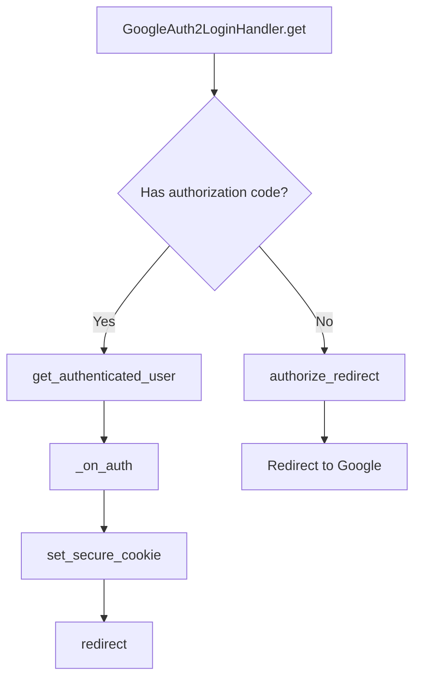
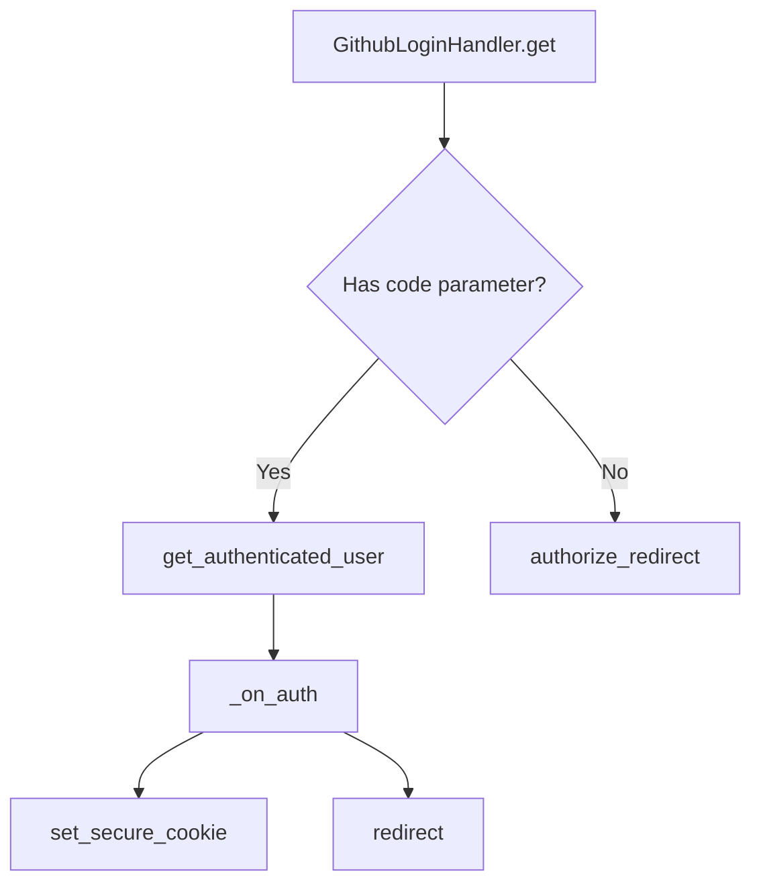
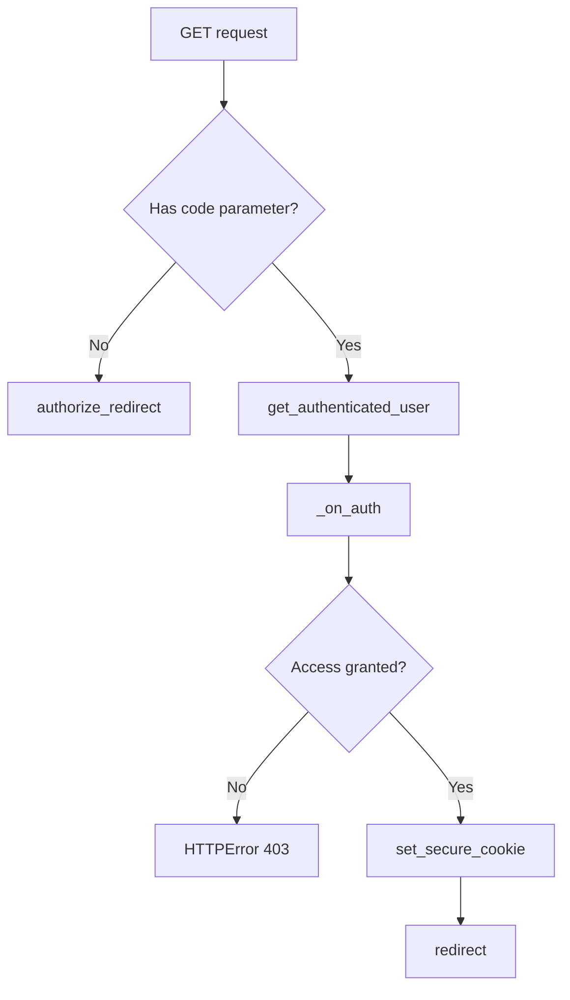

# `auth.py`

## `flower.views.auth.authenticate` · *function*

## Summary:
Validates an email address against various pattern matching rules including exact match, pipe-separated lists, and wildcard patterns.

## Description:
This utility function provides flexible email validation by supporting three different pattern matching approaches. It's designed to be used in authentication contexts where email-based access control is needed. The function extracts the validation logic from inline code to promote reusability and maintainability.

## Args:
    pattern (str): The authentication pattern to match against. Can be one of three formats:
        - Exact match: Simple string comparison
        - Pipe-separated list: Multiple email addresses separated by '|'
        - Wildcard pattern: String containing '*' characters for partial matching
    email (str): The email address to validate against the pattern

## Returns:
    bool: True if the email matches the pattern according to the specified rule, False otherwise.

## Raises:
    None explicitly raised

## Constraints:
    Preconditions:
        - Both pattern and email must be strings
        - Pattern should not be empty for meaningful validation
    
    Postconditions:
        - Always returns a boolean value
        - Email matching follows the specified pattern rules consistently

## Side Effects:
    None

## Control Flow:
```mermaid
flowchart TD
    A[Start authenticate] --> B{Pattern contains '|'?}
    B -- Yes --> C[Split pattern by '|']
    C --> D{Email in split list?}
    D -- Yes --> E[Return True]
    D -- No --> F[Return False]
    B -- No --> G{Pattern contains '*'?}
    G -- Yes --> H[Escape pattern, replace '*']
    H --> I[Apply fullmatch regex]
    I --> J{Regex match?}
    J -- Yes --> K[Return True]
    J -- No --> L[Return False]
    G -- No --> M[Exact string comparison]
    M --> N{Pattern == Email?}
    N -- Yes --> O[Return True]
    N -- No --> P[Return False]
```

## Examples:
    # Exact match
    authenticate("user@example.com", "user@example.com")  # Returns True
    authenticate("user@example.com", "other@example.com")  # Returns False
    
    # Pipe-separated list
    authenticate("user1@example.com|user2@example.com", "user1@example.com")  # Returns True
    authenticate("user1@example.com|user2@example.com", "user3@example.com")  # Returns False
    
    # Wildcard pattern
    authenticate("*.example.com", "user@example.com")  # Returns True
    authenticate("user.*@example.com", "user.name@example.com")  # Returns True
```

## `flower.views.auth.validate_auth_option` · *function*

## Summary:
Validates authentication pattern formats to ensure proper syntax and structure.

## Description:
Checks that authentication patterns follow valid formatting rules, preventing malformed patterns that could cause issues in authentication systems. This function ensures patterns containing special characters like asterisks and pipes are properly structured.

## Args:
    pattern (str): Authentication pattern string to validate, typically representing user identifiers or email domains

## Returns:
    bool: True if the pattern passes all validation checks, False otherwise

## Raises:
    None: This function does not raise exceptions

## Constraints:
    Preconditions:
    - Input must be a string
    - Pattern should not contain more than one asterisk character
    - Pattern should not contain both asterisk and pipe characters simultaneously
    - Asterisk should not appear in the domain portion of email-like patterns (after @ symbol)

    Postconditions:
    - Function returns a boolean value indicating pattern validity
    - Input string is not modified

## Side Effects:
    None: This function performs no I/O operations or external state mutations

## Control Flow:
```mermaid
flowchart TD
    A[Start validate_auth_option] --> B{pattern.count('*') > 1?}
    B -- Yes --> C[Return False]
    B -- No --> D{'*' in pattern AND '|' in pattern?}
    D -- Yes --> E[Return False]
    D -- No --> F{'*' in pattern.rsplit('@', 1)[-1]?}
    F -- Yes --> G[Return False]
    F -- No --> H[Return True]
```

## Examples:
    # Valid patterns
    validate_auth_option("user@domain.com")  # Returns True
    validate_auth_option("user*")  # Returns True
    validate_auth_option("*@domain.com")  # Returns True
    
    # Invalid patterns
    validate_auth_option("user**@domain.com")  # Returns False (more than one *)
    validate_auth_option("user*@domain.com|other")  # Returns False (* and | both present)
    validate_auth_option("user*@domain*.com")  # Returns False (* in domain part)
```

## `flower.views.auth.GoogleAuth2LoginHandler` · *class*

## Summary:
GoogleAuth2LoginHandler is a Tornado web handler that implements Google OAuth2 authentication for the Flower monitoring application.

## Description:
This class provides Google OAuth2 login functionality by implementing the OAuth2 authorization code flow. It handles the redirection to Google's authorization server, processes the callback with the authorization code, validates the authenticated user, and sets a secure cookie for session management. The handler integrates with the application's authentication system to restrict access based on configured email patterns.

The class is designed to be used as a route endpoint in the Tornado web application for handling Google OAuth2 authentication flows. It leverages Tornado's built-in GoogleOAuth2Mixin for OAuth2 operations and integrates with the existing BaseHandler infrastructure.

## State:
- `_OAUTH_SETTINGS_KEY` (str): Class constant defining the settings key for OAuth2 configuration in the application settings
- Inherits all state from `BaseHandler` including `application`, `capp`, `request`, and `response`
- Inherits OAuth2-related state from `tornado.auth.GoogleOAuth2Mixin`

## Lifecycle:
Creation: Instances are automatically created by Tornado's routing mechanism when HTTP GET requests are made to the associated URL endpoint. The constructor is inherited from RequestHandler and requires no special instantiation.

Usage: 
1. Client makes GET request to the handler's endpoint
2. Handler redirects user to Google OAuth2 authorization URL if no authorization code is present
3. After user authorizes, Google redirects back with authorization code
4. Handler exchanges code for access token and fetches user info
5. User email is validated against application authentication rules
6. Secure cookie is set for authenticated session
7. User is redirected to original requested URL or default location

Destruction: Cleanup is handled automatically by Tornado's request lifecycle management.

## Method Map:


## Raises:
- tornado.web.HTTPError(403): Raised when Google authentication fails, user email is not authorized, or HTTP request processing encounters errors
- Exception: Propagated from underlying HTTP client operations during user info fetching

## Example:
```python
# Typical usage in Tornado routing
app.add_handlers(r".*", [
    (r"/login/google", GoogleAuth2LoginHandler),
])

# When user accesses /login/google:
# 1. Redirects to Google OAuth2 consent screen
# 2. After consent, Google redirects back with authorization code
# 3. Handler validates user and sets secure cookie
# 4. User redirected to previous page or default URL
```

### `flower.views.auth.GoogleAuth2LoginHandler.get` · *method*

## Summary:
Handles Google OAuth2 authentication flow by either initiating the authorization redirect or processing the callback from Google's authentication service.

## Description:
This method implements the GET endpoint for Google OAuth2 login in the Flower monitoring application. It serves as the entry point for the OAuth2 flow, determining whether to redirect the user to Google's authorization server or process the authentication callback.

When a user accesses the Google login endpoint, this method checks for the presence of an authorization code in the request arguments. If present, it exchanges the code for user credentials and processes the authentication via `_on_auth`. If no code is present, it initiates the OAuth2 authorization flow by redirecting the user to Google's consent screen.

This method is specifically designed to handle the Google OAuth2 authentication flow and should not be mixed with other authentication mechanisms, maintaining clean separation of concerns. It's part of the `GoogleAuth2LoginHandler` class that inherits from both `BaseHandler` and `tornado.auth.GoogleOAuth2Mixin`.

## Args:
    None explicitly taken as parameters (inherits from Tornado's RequestHandler)

## Returns:
    None (method performs redirects or raises HTTP errors)

## Raises:
    tornado.web.HTTPError: Raised with status code 403 when Google authentication fails or when email validation fails

## State Changes:
    Attributes READ:
        - self.settings: Configuration dictionary containing OAuth settings
        - self._OAUTH_SETTINGS_KEY: Class constant defining the OAuth configuration key
        - self.get_argument: Method to extract URL parameters from the request
        - self.get_authenticated_user: Method inherited from GoogleOAuth2Mixin to exchange code for user info
        - self.authorize_redirect: Method inherited from GoogleOAuth2Mixin to initiate OAuth flow
        - self.set_secure_cookie: Method to set secure authentication cookies
        - self.redirect: Method to redirect users to specified URLs
        - self.application.options.auth: Authentication configuration from application options
        - self.application.options.url_prefix: URL prefix configuration from application options

    Attributes WRITTEN:
        - self.set_secure_cookie: Sets the "user" cookie upon successful authentication
        - self.redirect: Redirects to the appropriate next page after authentication

## Constraints:
    Preconditions:
        - The application must have OAuth2 settings configured in self.settings under the key defined by _OAUTH_SETTINGS_KEY
        - The OAuth2 settings must include 'redirect_uri' and 'key' fields
        - The application must have authentication options configured in self.application.options.auth
        - The application must have url_prefix option available for redirection

    Postconditions:
        - If authentication succeeds, a secure cookie is set and user is redirected to the next page
        - If authentication fails, an HTTP 403 error is raised
        - If no authorization code is present, the user is redirected to Google's OAuth2 consent screen

## Side Effects:
    - I/O operations: Makes HTTP requests to Google's OAuth2 endpoints
    - External service calls: Communicates with Google's OAuth2 servers for authentication
    - Cookie mutation: Sets a secure authentication cookie on successful login
    - HTTP redirects: Performs redirects to Google's authorization endpoint or back to the application

### `flower.views.auth.GoogleAuth2LoginHandler._on_auth` · *method*

## Summary:
Processes successful Google OAuth2 authentication responses by validating user email, setting secure session cookies, and redirecting to the appropriate URL.

## Description:
Handles the completion of Google OAuth2 authentication flow by validating the authenticated user's email address against configured authorization rules, establishing a secure session cookie, and redirecting the user to their requested destination or the application's root URL. This method serves as the callback handler for Google's OAuth2 authorization flow.

## Args:
    user (dict): Dictionary containing OAuth2 user information, specifically requiring an 'access_token' key for subsequent API calls.

## Returns:
    None: This method performs redirection and cookie setting but does not return a value.

## Raises:
    tornado.web.HTTPError: Raised with status code 403 in three scenarios:
        1. When the user parameter is falsy (indicating authentication failure)
        2. When the Google userinfo API request fails
        3. When the user's email fails authentication validation against configured rules

## State Changes:
    Attributes READ:
        - self.application.options.auth: Used to validate user email
        - self.application.options.url_prefix: Used for default redirect path
        - self.get_argument(): Used to retrieve 'next' parameter
    Attributes WRITTEN:
        - self.set_secure_cookie(): Sets 'user' cookie with email value
        - self.redirect(): Performs HTTP redirect to calculated URL

## Constraints:
    Preconditions:
        - The user parameter must contain an 'access_token' key
        - The method must be called within the context of a Tornado web request
        - The application must have proper OAuth2 configuration for Google authentication
        
    Postconditions:
        - A secure 'user' cookie is set with the authenticated email
        - The user is redirected to either the 'next' parameter value or the application's URL prefix

## Side Effects:
    - Makes an asynchronous HTTP request to Google's userinfo API
    - Sets a secure cookie in the HTTP response
    - Performs an HTTP redirect to a different URL
    - May raise HTTPError exceptions for authentication failures

## `flower.views.auth.LoginHandler` · *class*

## Summary:
LoginHandler is a factory class that dynamically instantiates authentication providers based on configuration, serving as the entry point for authentication flows in the Flower application.

## Description:
This class implements a factory pattern for authentication handling, allowing the application to support multiple authentication mechanisms through configuration rather than hardcoding specific implementations. When a login request is processed, the LoginHandler delegates to the configured authentication provider specified by the `options.auth_provider` setting.

The class inherits from BaseHandler, which provides common web request handling capabilities including CORS support, error management, and utility methods for working with Celery tasks. The factory pattern enables flexible authentication configuration where administrators can choose different authentication strategies (Basic Auth, OAuth2, etc.) without modifying application code.

## State:
- Inherits all state from BaseHandler including application reference, request/response objects, and Celery app access
- Uses `options.auth_provider` configuration to determine which authentication handler to instantiate
- Falls back to `NotFoundErrorHandler` when no authentication provider is configured
- The `__new__` method controls object creation rather than modifying existing object state

## Lifecycle:
Creation: LoginHandler instances are created automatically by Tornado's routing mechanism when HTTP requests arrive. The `__new__` method intercepts this process and returns an instance of the configured authentication provider instead, effectively replacing the LoginHandler with the actual authentication handler.

Usage: The factory pattern means that once created, the actual authentication handler (returned by `__new__`) handles the authentication flow through its own methods (get(), post(), etc.). The LoginHandler itself doesn't handle authentication logic directly.

Destruction: Cleanup is handled automatically by Tornado's request lifecycle management.

## Method Map:
```mermaid
graph TD
    A[LoginHandler.__new__] --> B{options.auth_provider set?}
    B -->|Yes| C[instantiate(options.auth_provider)]
    B -->|No| D[instantiate(NotFoundErrorHandler)]
    C --> E[Configured Auth Provider Instance]
    D --> E
    E --> F[get() or post()]
```

## Raises:
- May raise exceptions from the underlying `instantiate` function when the configured authentication provider cannot be imported or instantiated
- May raise exceptions from the configured authentication provider during normal operation
- May raise exceptions from BaseHandler parent class methods if authentication fails

## Example:
```python
# Configuration in app settings:
# options.auth_provider = "tornado.auth.GoogleOAuth2Mixin"

# When a login request arrives:
# 1. Tornado creates LoginHandler instance
# 2. LoginHandler.__new__ intercepts and returns GoogleOAuth2Mixin instance
# 3. The GoogleOAuth2Mixin handles the OAuth2 flow
# 4. Authentication results in either successful login or appropriate error handling

# Alternative configuration:
# options.auth_provider = None  # Falls back to NotFoundErrorHandler
```

### `flower.views.auth.LoginHandler.__new__` · *method*

## Summary:
Creates and returns an authentication handler instance based on the configured authentication provider, falling back to a not-found error handler when no provider is specified.

## Description:
This `__new__` method implements a factory pattern for creating authentication handler instances. It dynamically instantiates the appropriate authentication handler class based on the `options.auth_provider` configuration setting. When no authentication provider is configured, it defaults to using `NotFoundErrorHandler` to handle authentication attempts.

The method is part of the `LoginHandler` class and is invoked during the object creation phase to determine which specific authentication handler should be used for processing login requests. This allows the application to support multiple authentication mechanisms through configuration rather than hardcoding specific implementations.

## Args:
    cls: The class being instantiated (LoginHandler)
    *args: Variable length argument list passed to the authentication handler constructor
    **kwargs: Arbitrary keyword arguments passed to the authentication handler constructor

## Returns:
    An instance of the authentication handler class specified by `options.auth_provider` or `NotFoundErrorHandler` if no provider is configured

## Raises:
    None explicitly raised - the underlying `instantiate` function may raise exceptions if the class cannot be imported or instantiated

## State Changes:
    None - This is a `__new__` method that controls object creation rather than modifying existing object state

## Constraints:
    Preconditions:
    - The `options.auth_provider` setting must either be a valid string path to an authentication handler class or None
    - If provided, the authentication handler class must be importable and inherit from BaseHandler or compatible interface
    - The `NotFoundErrorHandler` class must be available and inherit from BaseHandler
    
    Postconditions:
    - Returns an instance of an authentication handler class
    - The returned instance is properly initialized with the provided arguments

## Side Effects:
    None - This method doesn't perform I/O operations or mutate external state
    However, the instantiated authentication handler may have side effects during its normal operation

## `flower.views.auth.GithubLoginHandler` · *class*

## Summary:
GithubLoginHandler is a Tornado web handler that implements GitHub OAuth2 authentication for the Flower monitoring application.

## Description:
This class handles the complete GitHub OAuth2 authentication flow for users wishing to log into the Flower web interface. It extends BaseHandler (which provides common web request handling functionality) and tornado.auth.OAuth2Mixin (which provides OAuth2 helper methods). The handler manages the redirect to GitHub for authorization, processes the callback with the authorization code, exchanges the code for an access token, validates the user's email against configured authentication rules, and sets a secure cookie for session management.

The class is designed to be used as a route endpoint in the Tornado web application for handling GitHub login requests. It respects environment variables for configuring the OAuth domain and uses the application's authentication settings to validate user access.

## State:
- `_OAUTH_DOMAIN`: Class variable set from environment variable FLOWER_GITHUB_OAUTH_DOMAIN or defaults to "github.com"
- `_OAUTH_AUTHORIZE_URL`: Class variable constructed from the OAuth domain for authorization endpoint
- `_OAUTH_ACCESS_TOKEN_URL`: Class variable constructed from the OAuth domain for token exchange endpoint
- `_OAUTH_NO_CALLBACKS`: Class variable indicating callbacks are supported (False)
- `_OAUTH_SETTINGS_KEY`: Class variable identifying the settings key for OAuth configuration

## Lifecycle:
Creation: Instances are automatically created by Tornado's routing mechanism when HTTP requests are received. The constructor is inherited from RequestHandler and doesn't require special instantiation.

Usage: The handler follows the standard Tornado request lifecycle:
1. GET request arrives to initiate OAuth flow or handle callback
2. If 'code' parameter is present, it exchanges the code for an access token and validates user
3. If no 'code' parameter, it redirects user to GitHub authorization URL
4. After successful authentication, sets secure cookie "user" with email and redirects to next page

Destruction: Cleanup is handled automatically by Tornado's request lifecycle management.

## Method Map:


## Raises:
- tornado.auth.AuthError: Raised when OAuth token exchange fails during get_authenticated_user method
- tornado.web.HTTPError: Raised with status 500 when OAuth authentication fails in _on_auth method, or status 403 when email validation fails in _on_auth method
- ValueError: May be raised by inherited methods during argument processing

## Example:
```python
# Typical usage in Tornado routing:
# app.add_handlers(r".*", [(r"/login/github", GithubLoginHandler)])

# When user visits /login/github:
# 1. If no 'code' parameter: redirects to GitHub authorization
# 2. After GitHub redirect with 'code': exchanges code for token
# 3. Validates user email against auth configuration
# 4. Sets secure cookie "user" with email
# 5. Redirects to next parameter or default URL prefix
```

### `flower.views.auth.GithubLoginHandler.get_authenticated_user` · *method*

## Summary:
Exchanges an OAuth2 authorization code for an access token from GitHub's OAuth service.

## Description:
This asynchronous method implements the second leg of the OAuth2 authorization code flow by exchanging the temporary authorization code received from GitHub for a permanent access token. It constructs the appropriate POST request with client credentials and the authorization code, sends it to GitHub's token endpoint, and parses the JSON response containing the access token and related metadata.

The method is called during the OAuth2 callback phase when a user has authorized the application with GitHub and been redirected back with an authorization code. This method is part of the authentication flow that enables users to log in via GitHub.

## Args:
    redirect_uri (str): The redirect URI that was registered with GitHub OAuth application
    code (str): The temporary authorization code received from GitHub after user consent

## Returns:
    dict: A dictionary containing the OAuth2 token response from GitHub, typically including 'access_token' (str), 'token_type' (str), and potentially other OAuth2 fields such as 'refresh_token' and 'expires_in'. The exact structure depends on GitHub's OAuth2 token endpoint response format.

## Raises:
    tornado.auth.AuthError: When the HTTP request to GitHub's token endpoint fails or returns an error response

## State Changes:
    Attributes READ: 
    - self.settings
    - self._OAUTH_SETTINGS_KEY
    - self._OAUTH_ACCESS_TOKEN_URL
    
    Attributes WRITTEN: None

## Constraints:
    Preconditions:
    - The method must be called during an OAuth2 callback flow
    - The redirect_uri must match the one registered with the GitHub OAuth application
    - The code parameter must be a valid temporary authorization code from GitHub
    - The OAuth settings must be properly configured in self.settings[self._OAUTH_SETTINGS_KEY]

    Postconditions:
    - On success, returns a parsed JSON dictionary containing OAuth2 token information
    - On failure, raises an AuthError with details about the authentication failure

## Side Effects:
    - Makes an outbound HTTPS request to GitHub's OAuth token endpoint
    - May result in network I/O delays during the HTTP request
    - Uses the application's HTTP client for making authenticated requests

### `flower.views.auth.GithubLoginHandler.get` · *method*

## Summary:
Handles GitHub OAuth2 authentication flow by redirecting users to GitHub for authorization or processing the OAuth callback.

## Description:
Implements the OAuth2 authorization code flow for GitHub authentication. When a user accesses the GitHub login endpoint, this method either redirects them to GitHub for authorization if no authorization code is present, or processes the OAuth callback by exchanging the authorization code for an access token and completing the authentication process.

This method is the entry point for the GitHub OAuth2 flow and orchestrates the entire authentication process by leveraging inherited OAuth2 functionality from Tornado's OAuth2Mixin.

## Args:
    None

## Returns:
    None

## Raises:
    tornado.web.HTTPError: Raised by _on_auth when authentication fails (500) or when no verified emails are found (403)
    tornado.auth.AuthError: Raised by get_authenticated_user when OAuth token exchange fails

## State Changes:
    Attributes READ:
        - self.settings: Used to access OAuth configuration
        - self._OAUTH_SETTINGS_KEY: Used as key to retrieve OAuth settings
        - self.get_argument: Used to check for 'code' parameter
    
    Attributes WRITTEN:
        - self.set_secure_cookie: Sets user authentication cookie upon successful login
        - self.redirect: Redirects user to appropriate location after authentication

## Constraints:
    Preconditions:
        - self.settings must contain the OAuth configuration under the key specified by self._OAUTH_SETTINGS_KEY
        - The OAuth configuration must include 'key', 'secret', and 'redirect_uri' fields
        - The application must have proper OAuth2 settings configured
    
    Postconditions:
        - If authentication succeeds, a secure cookie is set with the user's email
        - If authentication succeeds, the user is redirected to the next URL or application's default URL
        - If authentication fails, appropriate HTTP errors are raised

## Side Effects:
    - Makes HTTP requests to GitHub's OAuth endpoints to exchange authorization codes for tokens
    - Makes HTTP requests to GitHub's API to fetch user email information
    - Sets secure cookies in the HTTP response
    - Performs HTTP redirects to GitHub authorization endpoint or application URLs

### `flower.views.auth.GithubLoginHandler._on_auth` · *method*

## Summary:
Processes successful GitHub OAuth authentication by validating user emails and setting authentication cookies.

## Description:
Handles the post-authentication logic after successful GitHub OAuth completion. This private async method validates the authenticated user's email addresses against configured authorization patterns, sets a secure authentication cookie, and redirects the user to the appropriate destination. It serves as the final step in the OAuth2 authentication flow for GitHub login.

The method is called internally by the `get` method of `GithubLoginHandler` after successful OAuth token exchange and user information retrieval. It ensures only authorized users can access the Flower interface by validating their email addresses against the configured authentication patterns.

## Args:
    user (dict): Dictionary containing OAuth user information, including 'access_token' key. Must not be None or empty. Typically contains GitHub user data returned from the OAuth process.

## Returns:
    None: This async method performs redirection and cookie setting but does not return a value.

## Raises:
    tornado.web.HTTPError: 
        - 500: When user authentication fails (user parameter is None or empty)
        - 403: When no verified and authorized emails are found for the user

## State Changes:
    Attributes READ:
        - self._OAUTH_DOMAIN: Used to construct the GitHub API endpoint
        - self.application.options.auth: Used for email validation
        - self.application.options.url_prefix: Used for redirect URL construction
    
    Attributes WRITTEN:
        - None: This method doesn't modify instance attributes directly

## Constraints:
    Preconditions:
        - User parameter must contain an 'access_token' key
        - User parameter must not be None or empty
        - The OAuth domain must be properly configured
    
    Postconditions:
        - A secure cookie named "user" is set with the validated email
        - The user is redirected to either the 'next' argument or the application's URL prefix

## Side Effects:
    - Makes an asynchronous HTTP request to GitHub's user emails API
    - Sets a secure cookie in the HTTP response
    - Performs an HTTP redirect to a specified URL
    - May raise HTTPError exceptions for authentication failures

## `flower.views.auth.GitLabLoginHandler` · *class*

## Summary:
GitLabLoginHandler is a Tornado web handler that implements GitLab OAuth2 authentication for the Flower monitoring application.

## Description:
This class handles the complete GitLab OAuth2 authentication flow, including redirecting users to GitLab for authorization, processing the OAuth callback, validating user access through email and group membership checks, and establishing authenticated sessions via secure cookies. It integrates with the Flower application's authentication system and supports configurable GitLab domains, access groups, and minimum access levels.

The handler is designed to be used as part of a Tornado web application and expects proper OAuth2 configuration in the application settings. It leverages Tornado's built-in OAuth2 support while extending it with custom authorization logic for GitLab groups and email validation.

## State:
- `_OAUTH_GITLAB_DOMAIN`: Class constant for GitLab domain, defaults to "gitlab.com" but can be overridden via FLOWER_GITLAB_OAUTH_DOMAIN environment variable
- `_OAUTH_AUTHORIZE_URL`: Class constant constructed from the GitLab domain for OAuth authorization endpoint
- `_OAUTH_ACCESS_TOKEN_URL`: Class constant constructed from the GitLab domain for OAuth token endpoint
- `_OAUTH_NO_CALLBACKS`: Class constant set to False, indicating callbacks are supported

## Lifecycle:
Creation: Instances are automatically created by Tornado's routing mechanism when HTTP requests are processed. The handler requires no special instantiation parameters as it inherits configuration from the Tornado application settings through BaseHandler.

Usage: The handler follows the standard Tornado request lifecycle:
1. GET request to initiate OAuth flow or handle callback
2. If no authorization code is present, redirects user to GitLab authorization endpoint using `authorize_redirect` method from OAuth2Mixin
3. If authorization code is present, exchanges it for user information using `get_authenticated_user` method and validates access via `_on_auth`
4. On successful validation, sets secure session cookie using `set_secure_cookie` and redirects user to either the 'next' parameter or application's URL prefix

Destruction: Cleanup is handled automatically by Tornado's request lifecycle management.

## Method Map:


## Raises:
- tornado.web.HTTPError: Raised with status 403 when GitLab authentication fails or user access is denied due to email or group restrictions
- tornado.web.HTTPError: Raised with status 500 when OAuth authentication fails during callback processing
- tornado.auth.AuthError: Raised when OAuth token exchange fails during `get_authenticated_user` execution

## Example:
```python
# Typical usage in Tornado application configuration:
# app.add_handlers(r".*", [(r"/login/gitlab", GitLabLoginHandler)])

# Configuration required in application settings:
# settings = {
#     'oauth': {
#         'key': 'your-gitlab-client-id',
#         'secret': 'your-gitlab-client-secret',
#         'redirect_uri': 'http://your-app.com/login/gitlab'
#     }
# }

# Environment variables needed:
# FLOWER_GITLAB_OAUTH_DOMAIN="gitlab.example.com" (defaults to gitlab.com)
# FLOWER_GITLAB_AUTH_ALLOWED_GROUPS="group1/subgroup1,group2" (optional)
# FLOWER_GITLAB_MIN_ACCESS_LEVEL="20" (defaults to 20, optional)
# AUTH_PATTERN="user@example.com|admin@example.com" (configured via application.options.auth)
```

### `flower.views.auth.GitLabLoginHandler.get_authenticated_user` · *method*

## Summary:
Retrieves authenticated user information from GitLab OAuth by exchanging an authorization code for an access token.

## Description:
This asynchronous method performs the second leg of the OAuth 2.0 authorization code flow by exchanging the temporary authorization code received from GitLab for a permanent access token. It constructs and sends a POST request to GitLab's token endpoint with the necessary OAuth parameters including client credentials and the authorization code.

The method is called during the OAuth callback processing in the GitLabLoginHandler's GET method when an authorization code is present in the request parameters.

## Args:
    redirect_uri (str): The redirect URI that was used in the initial authorization request
    code (str): The temporary authorization code returned by GitLab after successful user authorization

## Returns:
    dict: A dictionary containing the OAuth token response from GitLab, typically including 'access_token', 'token_type', 'expires_in', and other OAuth metadata

## Raises:
    tornado.auth.AuthError: When the HTTP request to GitLab's token endpoint fails or returns an error response

## State Changes:
    Attributes READ: 
    - self.settings['oauth']['key']: Client ID for GitLab OAuth
    - self.settings['oauth']['secret']: Client secret for GitLab OAuth
    - self._OAUTH_ACCESS_TOKEN_URL: GitLab's OAuth token endpoint URL
    
    Attributes WRITTEN: None

## Constraints:
    Preconditions:
    - The redirect_uri must match the one registered with GitLab for the OAuth application
    - The code parameter must be a valid, unexpired authorization code from GitLab
    - The OAuth client credentials (key and secret) must be properly configured in self.settings['oauth']
    
    Postconditions:
    - On success, returns a dictionary with valid OAuth token information
    - On failure, raises an AuthError with detailed error information

## Side Effects:
    - Makes an external HTTP POST request to GitLab's OAuth token endpoint
    - May result in network I/O delays during the HTTP request
    - Uses the application's HTTP client for making authenticated requests

### `flower.views.auth.GitLabLoginHandler.get` · *method*

## Summary:
Handles GitLab OAuth2 authentication flow by either redirecting users to GitLab for authorization or processing the callback from GitLab after successful authentication.

## Description:
This method implements the OAuth2 authorization code flow for GitLab integration. When accessed without an authorization code parameter, it redirects the user to GitLab's authorization endpoint. When accessed with a code parameter (after GitLab redirects back), it exchanges the authorization code for user information and processes the authenticated user.

The method uses Tornado's OAuth2 capabilities to handle the authentication flow. It expects GitLab OAuth settings to be configured in self.settings['oauth'] including redirect_uri and client key.

## Args:
    None - This is an HTTP GET handler that processes request arguments internally

## Returns:
    None - This method directly writes HTTP responses and does not return values

## Raises:
    None explicitly raised - The underlying Tornado OAuth2 methods may raise exceptions, but these are handled by the framework

## State Changes:
    Attributes READ:
    - self.settings: Used to access OAuth configuration including redirect_uri and client key
    - self.request: Used to access request arguments through get_argument()

    Attributes WRITTEN:
    - None - This method doesn't modify instance state directly

## Constraints:
    Preconditions:
    - The application must be configured with GitLab OAuth settings in self.settings['oauth']
    - The redirect_uri must be properly configured in the OAuth settings
    - The client ID must be configured in the OAuth settings
    - The method assumes the class has access to OAuth2Mixin methods (get_authenticated_user, authorize_redirect)

    Postconditions:
    - On successful authentication, the user session is established (via _on_auth method)
    - On authorization redirect, the browser is redirected to GitLab's authorization endpoint

## Side Effects:
    - Makes HTTP redirects to GitLab's authorization endpoint
    - Makes HTTP requests to GitLab's token endpoint to exchange authorization code for tokens
    - Makes HTTP requests to GitLab's API to fetch user information
    - May set cookies or session data during authentication completion

### `flower.views.auth.GitLabLoginHandler._on_auth` · *method*

## Summary:
Processes GitLab OAuth authentication callback, validates user access, and establishes authenticated session.

## Description:
Handles the completion of GitLab OAuth authentication flow by validating the authenticated user, checking email permissions, and optionally verifying group membership. Sets a secure session cookie and redirects the user to their intended destination.

This method is called internally by the GitLab login flow after successful OAuth token exchange and is responsible for the final authorization step before establishing user session.

## Args:
    user (dict): OAuth user information dictionary containing access_token and other authentication details

## Returns:
    None: This method performs redirection and does not return a value

## Raises:
    tornado.web.HTTPError: Raised with status 500 when OAuth authentication fails (user is None)
    tornado.web.HTTPError: Raised with status 403 when GitLab API calls fail or user access is denied

## State Changes:
    Attributes READ:
        - self._OAUTH_GITLAB_DOMAIN: Used to construct GitLab API endpoints
        - self.settings: Access to OAuth configuration
        - self.application.options.auth: Used for email authentication validation
        - self.application.options.url_prefix: Used for redirect URL construction
    Attributes WRITTEN:
        - self._OAUTH_GITLAB_DOMAIN: Read-only access, but referenced in URL construction

## Constraints:
    Preconditions:
        - User parameter must contain valid OAuth user data with access_token key
        - GitLab API must be accessible from the server
        - Environment variables FLOWER_GITLAB_AUTH_ALLOWED_GROUPS and FLOWER_GITLAB_MIN_ACCESS_LEVEL must be properly formatted if used
        - Required environment variable FLOWER_GITLAB_OAUTH_DOMAIN must be set for domain configuration

    Postconditions:
        - If successful, a secure 'user' cookie is set with the user's email
        - If successful, user is redirected to either the 'next' parameter or application's URL prefix
        - If access is denied, HTTP 403 error is raised

## Side Effects:
    - Makes asynchronous HTTP requests to GitLab API endpoints
    - Sets a secure cookie named 'user' containing the authenticated user's email
    - Performs HTTP redirect to either the 'next' parameter or application URL prefix
    - May raise HTTPError exceptions with specific status codes

## `flower.views.auth.OktaLoginHandler` · *class*

## Summary:
OktaLoginHandler is a Tornado web handler that implements OAuth2 authentication with Okta, enabling secure login through Okta identity provider.

## Description:
This class handles the complete OAuth2 authentication flow with Okta, including initiating the authorization request, exchanging authorization codes for access tokens, and validating user information. It serves as the entry point for users to authenticate via Okta and is typically used in Flower monitoring applications that require centralized authentication.

The handler extends BaseHandler (which provides common web request handling functionality) and tornado.auth.OAuth2Mixin (which provides OAuth2 utility methods). It leverages environment variables for Okta configuration and uses secure cookies to manage OAuth2 state tokens during the authentication process.

## State:
- `base_url` (property): Returns the Okta base URL from the FLOWER_OAUTH2_OKTA_BASE_URL environment variable
- `_OAUTH_AUTHORIZE_URL` (property): Constructed URL for Okta authorization endpoint
- `_OAUTH_ACCESS_TOKEN_URL` (property): Constructed URL for Okta access token endpoint  
- `_OAUTH_USER_INFO_URL` (property): Constructed URL for Okta user info endpoint
- `_OAUTH_NO_CALLBACKS` (class attribute): Set to False, indicating callbacks are supported
- `_OAUTH_SETTINGS_KEY` (class attribute): Set to 'oauth', used to identify OAuth settings in application settings

## Lifecycle:
Creation: Instances are automatically created by Tornado's routing mechanism when HTTP requests are received to the authentication endpoint. No special instantiation is required.

Usage: The handler follows the standard Tornado request lifecycle:
1. GET request to the handler's endpoint initiates the OAuth2 flow
2. If authorization code is present, it validates the state token and exchanges code for access token
3. If successful, it validates user information and sets authentication cookie
4. Redirects user to the requested page or default location

Destruction: Cleanup is handled automatically by Tornado's request lifecycle management.

## Method Map:
```mermaid
graph TD
    A[OktaLoginHandler.get] --> B[get_argument(code)]
    B --> C{Has code?}
    C -->|Yes| D[get_secure_cookie(oauth_state)]
    D --> E[get_argument(state)]
    E --> F{State tokens match?}
    F -->|No| G[AuthError]
    F -->|Yes| H[get_access_token]
    H --> I[_on_auth]
    C -->|No| J[set_secure_cookie(oauth_state)]
    J --> K[authorize_redirect]
```

## Raises:
- tornado.auth.AuthError: Raised when OAuth2 state tokens don't match or when HTTP requests to OAuth endpoints fail
- tornado.web.HTTPError: Raised with status 403 when email verification fails, or status 500 when OAuth authentication fails
- tornado.auth.AuthError: Raised when HTTP response contains an error during token exchange

## Example:
```python
# Typical usage in Tornado routing
app.add_handlers(r".*", [
    (r"/login", OktaLoginHandler),
])

# User accesses /login, which:
# 1. Sets a secure state cookie
# 2. Redirects to Okta authorization endpoint
# 3. After Okta redirects back with code:
#    a. Validates state token
#    b. Exchanges code for access token
#    c. Fetches user info
#    d. Verifies email against configured auth pattern
#    e. Sets user cookie and redirects to next page
```

### `flower.views.auth.OktaLoginHandler.base_url` · *method*

## Summary:
Retrieves the Okta base URL from the FLOWER_OAUTH2_OKTA_BASE_URL environment variable for constructing OAuth2 endpoints.

## Description:
This property provides access to the base URL used for Okta OAuth2 authentication endpoints. It reads the configuration from the FLOWER_OAUTH2_OKTA_BASE_URL environment variable and returns it as a string. This base URL is used by other properties in the OktaLoginHandler class to construct complete OAuth2 endpoint URLs for authorization, token exchange, and user information retrieval.

The method is part of a standardized approach to configuring OAuth2 endpoints where the base URL is externalized as an environment variable for flexibility and security.

## Args:
    None

## Returns:
    str or None: The Okta base URL configured via the FLOWER_OAUTH2_OKTA_BASE_URL environment variable, or None if the environment variable is not set.

## Raises:
    None

## State Changes:
    Attributes READ: None
    Attributes WRITTEN: None

## Constraints:
    Preconditions:
    - The FLOWER_OAUTH2_OKTA_BASE_URL environment variable should contain a valid HTTP/HTTPS URL
    - The URL should not include a trailing slash to prevent double slashes in constructed endpoint URLs
    
    Postconditions:
    - Returns the raw value of the environment variable without modification
    - If the environment variable is not set, returns None

## Side Effects:
    None

### `flower.views.auth.OktaLoginHandler._OAUTH_AUTHORIZE_URL` · *method*

## Summary:
Constructs the OAuth 2.0 authorization endpoint URL for Okta authentication by appending "/v1/authorize" to the configured base URL.

## Description:
This property provides the OAuth authorization endpoint URL required for initiating the OAuth 2.0 authorization code flow with Okta. It is used internally by the authentication flow to redirect users to the Okta login page. The method combines the configured base URL (retrieved from the FLOWER_OAUTH2_OKTA_BASE_URL environment variable) with the standard "/v1/authorize" path to form the complete authorization endpoint.

## Args:
    None

## Returns:
    str: The complete OAuth authorization endpoint URL in the format "{base_url}/v1/authorize"

## Raises:
    None

## State Changes:
    Attributes READ: self.base_url
    Attributes WRITTEN: None

## Constraints:
    Preconditions: 
    - The `base_url` property must return a valid string URL (or None if environment variable is not set)
    - The method assumes `self.base_url` is properly configured for Okta authentication
    
    Postconditions:
    - Returns a properly formatted URL string with the "/v1/authorize" suffix appended to the base URL
    - If `self.base_url` is None, returns "/v1/authorize" (which would be invalid)

## Side Effects:
    None

### `flower.views.auth.OktaLoginHandler._OAUTH_ACCESS_TOKEN_URL` · *method*

## Summary:
Returns the OAuth2 token endpoint URL by combining the base authentication URL with the v1/token path for exchanging authorization codes for access tokens.

## Description:
This property constructs and returns the complete URL for the OAuth2 token endpoint used in the authorization code flow. It combines the base authentication URL (retrieved from the FLOWER_OAUTH2_OKTA_BASE_URL environment variable) with the standard "/v1/token" path required by Okta's OAuth2 implementation. This URL is used in the `get_access_token` method to exchange authorization codes for access tokens during the OAuth2 authentication process.

The method is part of a standardized OAuth2 URL property pattern that defines the complete OAuth2 flow endpoints for Okta authentication, including authorize, token, and userinfo endpoints. It ensures consistent URL construction across the authentication flow.

## Args:
    None

## Returns:
    str: A complete URL string in the format "{base_url}/v1/token" where base_url is obtained from the FLOWER_OAUTH2_OKTA_BASE_URL environment variable. If base_url is not configured, returns a URL with an empty base path.

## Raises:
    None

## State Changes:
    Attributes READ: 
    - self.base_url: Reads the base authentication URL from environment variable FLOWER_OAUTH2_OKTA_BASE_URL
    Attributes WRITTEN: 
    - None

## Constraints:
    Preconditions:
    - The `self.base_url` property should return a valid URL string or None if environment variable is not set
    - The base URL should not end with a forward slash to avoid double slashes in the constructed URL
    
    Postconditions:
    - Returns a properly formatted URL string with the "/v1/token" suffix appended
    - The returned URL is suitable for use in HTTP POST requests to obtain OAuth2 access tokens
    - If base_url is None, the result will be "/v1/token" (relative path)

## Side Effects:
    None

### `flower.views.auth.OktaLoginHandler._OAUTH_USER_INFO_URL` · *method*

## Summary:
Returns the Okta OAuth2 userinfo endpoint URL by combining the base URL with the /v1/userinfo path.

## Description:
This property constructs and returns the complete URL for the Okta userinfo endpoint, which is used to retrieve user profile information during the OAuth2 authentication flow. The method combines the configured base URL with the standard Okta userinfo endpoint path.

## Args:
    None

## Returns:
    str: A complete URL string in the format "{base_url}/v1/userinfo" where base_url is obtained from the FLOWER_OAUTH2_OKTA_BASE_URL environment variable.

## Raises:
    None

## State Changes:
    Attributes READ: self.base_url
    Attributes WRITTEN: None

## Constraints:
    Preconditions: 
    - The OktaLoginHandler instance must have a valid base_url property set via the FLOWER_OAUTH2_OKTA_BASE_URL environment variable
    - The base_url should be a valid HTTP/HTTPS URL without trailing slashes
    
    Postconditions:
    - Returns a properly formatted URL string for the Okta userinfo endpoint
    - The returned URL follows the pattern {base_url}/v1/userinfo

## Side Effects:
    None

### `flower.views.auth.OktaLoginHandler.get_access_token` · *method*

## Summary:
Exchanges an authorization code for an access token using OAuth2 authorization code flow with Okta.

## Description:
This asynchronous method implements the second leg of the OAuth2 authorization code flow by exchanging an authorization code obtained from the OAuth provider (Okta) for an access token. The method constructs a POST request to the OAuth2 token endpoint with required parameters including the authorization code, client credentials, and redirect URI.

The method is typically called during the OAuth callback phase when the user has been redirected back from Okta with an authorization code. It performs the server-side exchange to obtain the access token that can be used for subsequent API calls to Okta.

## Args:
    redirect_uri (str): The redirect URI that was used in the initial OAuth request
    code (str): The authorization code received from the OAuth provider

## Returns:
    dict: Parsed JSON response containing the access token and related OAuth information including token_type, expires_in, scope, and access_token

## Raises:
    tornado.auth.AuthError: When the OAuth provider returns an error response during the token exchange process

## State Changes:
    Attributes READ: 
    - self.settings
    - self._OAUTH_SETTINGS_KEY
    - self._OAUTH_ACCESS_TOKEN_URL
    
    Attributes WRITTEN: None

## Constraints:
    Preconditions:
    - The method assumes that self.settings contains the OAuth configuration under the key specified by self._OAUTH_SETTINGS_KEY
    - The authorization code must be valid and not expired
    - The redirect_uri must match the one used in the initial authorization request
    
    Postconditions:
    - On success, returns a dictionary containing OAuth token information
    - On failure, raises an AuthError with details about the OAuth error

## Side Effects:
    - Makes an outbound HTTP POST request to the OAuth provider's token endpoint
    - May result in network I/O delays depending on the OAuth provider's response time
    - Uses the authentication HTTP client configured in the handler

### `flower.views.auth.OktaLoginHandler.get` · *method*

## Summary:
Handles OAuth2 authentication flow for Okta login by either initiating the authorization process or processing the callback from the OAuth provider.

## Description:
This method implements the complete OAuth2 authorization code flow for Okta authentication. When called, it checks if an authorization code is present in the request arguments. If so, it validates the state parameter to prevent CSRF attacks and exchanges the authorization code for an access token, then processes the authentication via the `_on_auth` method. If no authorization code is present, it initiates the OAuth2 authorization flow by redirecting the user to the Okta authorization endpoint with a secure state parameter.

The method is part of the OktaLoginHandler class which inherits from BaseHandler and tornado.auth.OAuth2Mixin, providing OAuth2 authentication capabilities for the Flower monitoring application.

## Args:
    None

## Returns:
    None

## Raises:
    tornado.auth.AuthError: When OAuth state tokens do not match during callback processing
    tornado.web.HTTPError: When authentication fails due to email verification issues (403) or other OAuth errors (500)

## State Changes:
    Attributes READ:
        - self.settings
        - self._OAUTH_SETTINGS_KEY
        - self.get_argument
        - self.get_secure_cookie
    
    Attributes WRITTEN:
        - self.set_secure_cookie (for oauth_state)
        - self.clear_cookie (for oauth_state)
        - self.set_secure_cookie (for user)

## Constraints:
    Preconditions:
        - The handler must be properly initialized with OAuth settings in self.settings[self._OAUTH_SETTINGS_KEY]
        - The OAuth settings must include 'redirect_uri', 'key', and 'secret' fields
        - The application must have proper URL prefix configuration
        - The base_url property must be properly configured via environment variable FLOWER_OAUTH2_OKTA_BASE_URL
    
    Postconditions:
        - If authentication succeeds, a secure cookie named "user" is set with the authenticated user's email
        - If authentication fails, appropriate HTTP errors are raised
        - The oauth_state cookie is cleared after successful authentication
        - The user is redirected to the appropriate location after authentication

## Side Effects:
    - Makes HTTP requests to external OAuth endpoints (authorization and token exchange)
    - Sets secure cookies for state management and user authentication
    - Redirects the user to external OAuth provider or back to the application
    - May make additional HTTP requests to fetch user information from the OAuth provider

### `flower.views.auth.OktaLoginHandler._on_auth` · *method*

## Summary:
Processes OAuth authentication callback by validating user credentials and establishing authenticated session.

## Description:
Handles the completion of OAuth authentication flow by validating the access token response, fetching user information from the identity provider, verifying email authenticity against configured authorization rules, and setting up the authenticated user session via secure cookies. This method serves as the final step in the OAuth2 authentication process, transitioning from authentication to session management.

## Args:
    access_token_response (dict): Dictionary containing OAuth access token information with 'access_token' key. Must not be None or empty.

## Returns:
    None: This method performs redirection and cookie operations but does not return a value.

## Raises:
    tornado.web.HTTPError: Raised with status code 500 when access_token_response is invalid or missing, and with status code 403 when email verification fails.

## State Changes:
    Attributes READ:
        - self._OAUTH_USER_INFO_URL: Used to construct the user info endpoint URL
        - self.application.options.auth: Used for email verification
        - self.application.options.url_prefix: Used for redirect URL construction
        - self.get_argument(): Used to retrieve 'next' parameter
        - self.get_secure_cookie(): Used to retrieve OAuth state cookie
    
    Attributes WRITTEN:
        - self.set_secure_cookie(): Sets user authentication cookie
        - self.clear_cookie(): Clears OAuth state cookie
        - self.redirect(): Performs HTTP redirect to next page

## Constraints:
    Preconditions:
        - access_token_response must contain an 'access_token' key with valid OAuth token
        - OAuth authentication flow must have completed successfully
        - User must have valid email address from identity provider
        
    Postconditions:
        - Secure cookie named "user" will be set with user's email
        - OAuth state cookie will be cleared
        - User will be redirected to appropriate next page

## Side Effects:
    - Makes asynchronous HTTP request to OAuth user info endpoint
    - Sets secure cookie for user authentication
    - Clears OAuth state cookie
    - Performs HTTP redirect to specified next page

