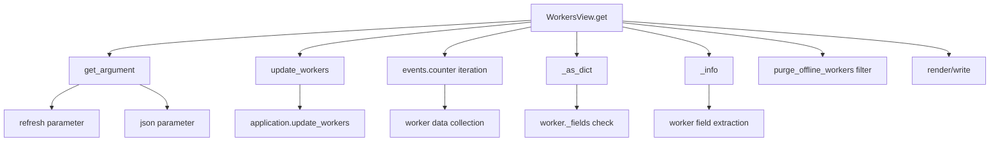

# `workers.py`

## `flower.views.workers.WorkerView` · *class*

## Summary:
WorkerView is a Tornado web handler responsible for displaying detailed information about a specific Celery worker in the Flower monitoring interface.

## Description:
This class implements a GET endpoint that retrieves and displays statistics for a specified Celery worker. It serves as part of the Flower web UI for monitoring distributed task queues. The view handles authentication, worker data retrieval, and template rendering while providing appropriate error responses for missing workers or unavailable statistics.

The view is designed to be accessed via URL routing that provides a worker name parameter, and it requires proper authentication before serving worker details. It integrates with the Flower application's worker management system to display real-time worker statistics.

## State:
- Inherits all state from BaseHandler including application reference and request/response objects
- `application`: Tornado application instance containing shared resources including workers data structure
- `application.workers`: Dictionary-like structure storing worker information with worker names as keys
- `application.update_workers()`: Method that refreshes worker data from the Celery broker
- `name` parameter: String identifier for the worker being requested (passed via URL routing)

## Lifecycle:
Creation: Automatically instantiated by Tornado's routing when a GET request matches the route pattern for worker views.

Usage: 
1. Tornado routes incoming GET request to WorkerView.get() method with worker name parameter
2. Authentication is verified via @web.authenticated decorator
3. Worker data is refreshed via self.application.update_workers(workername=name)
4. Worker information is retrieved from self.application.workers using the name parameter
5. If worker exists and has stats, renders worker.html template with worker data
6. If worker doesn't exist or lacks stats, raises 404 HTTP error

Destruction: Automatically managed by Tornado's request lifecycle.

## Method Map:
```mermaid
graph TD
    A[GET Request] --> B[WorkerView.get]
    B --> C[update_workers]
    C --> D[Application.update_workers]
    B --> E[workers.get]
    E --> F[Application.workers]
    B --> G{Worker Exists?}
    G -->|No| H[HTTPError 404: Unknown worker '{name}']
    G -->|Yes| I{Has Stats?}
    I -->|No| J[HTTPError 404: Unable to get stats for '{name}' worker]
    I -->|Yes| K[Render worker.html]
```

## Raises:
- tornado.web.HTTPError(404): Raised when the specified worker name is unknown or when worker statistics are unavailable
- tornado.web.HTTPError(401): Inherited from @web.authenticated decorator when authentication fails

## Example:
```python
# Typical usage scenario:
# 1. User makes GET request to /worker/my_worker_name
# 2. Authentication is verified
# 3. Application updates worker data
# 4. Worker information is retrieved and rendered
# 5. Template displays worker statistics

# Example URL pattern that would route to this view:
# /worker/(?P<name>[^/]+)
```

### `flower.views.workers.WorkerView.get` · *method*

## Summary:
Retrieves and displays detailed information for a specific Celery worker by name, updating worker data and rendering a worker detail page.

## Description:
Handles HTTP GET requests to retrieve information about a specific Celery worker. This method first updates the worker inspection data through the application's update_workers method, then fetches the worker details from the application's worker registry. It validates that the worker exists and has statistics available before rendering the worker detail template.

This method is separated from inline logic to provide a clean separation between data fetching/validation and presentation concerns, making it easier to test and extend. The method ensures proper error handling for missing workers and workers without available statistics.

## Args:
    name (str): The unique identifier/name of the target Celery worker

## Returns:
    None: This method doesn't return a value directly, but renders an HTTP response

## Raises:
    tornado.web.HTTPError: Raised with status code 404 when:
        - The specified worker name does not exist in the worker registry
        - The worker exists but does not have statistics available

## State Changes:
    Attributes READ: 
    - self.application.workers (to retrieve worker data)
    - self.application (for accessing update_workers method)
    - self.request (inherited from RequestHandler, used implicitly for request context)

    Attributes WRITTEN: 
    - None directly modified by this method

## Constraints:
    Preconditions:
    - The worker name parameter must be a non-empty string
    - The Flower application must be initialized with worker inspection capabilities
    - The worker must exist in the application's worker registry

    Postconditions:
    - If successful, the worker data is rendered in the worker.html template
    - If unsuccessful, appropriate HTTP 404 error is raised

## Side Effects:
    - Initiates asynchronous worker inspection operations through application.update_workers()
    - Makes network calls to connected Celery workers for statistics collection
    - Renders HTML template using Tornado's render method
    - Logs potential errors during worker update operations

## `flower.views.workers.WorkersView` · *class*

## Summary:
WorkersView is a Tornado web handler that displays and manages information about Celery workers in the Flower monitoring interface.

## Description:
This class implements a web endpoint that provides worker status information, including worker metadata, activity statistics, and health status. It supports both HTML rendering for browser display and JSON output for programmatic access. The view handles worker data refresh, filtering of offline workers based on configured thresholds, and authentication for secure access to monitoring information.

The class is designed to be used as part of the Flower web application's monitoring interface, providing real-time visibility into Celery worker operations and performance metrics.

## State:
- `application`: Reference to the Tornado application instance containing shared resources and configuration
- `request`: Inherited from RequestHandler, contains HTTP request information
- `response`: Inherited from RequestHandler, contains HTTP response information

## Lifecycle:
Creation: Instances are automatically created by Tornado's routing mechanism when HTTP GET requests are made to the workers endpoint. The constructor is inherited from BaseHandler and doesn't require special instantiation.

Usage: The handler processes HTTP GET requests with optional query parameters:
1. Request arrives and Tornado instantiates WorkersView
2. The `get()` method is invoked to process the request
3. Worker data is retrieved and optionally refreshed
4. Data is filtered and formatted for display
5. Response is rendered either as HTML or JSON based on query parameters

Destruction: Cleanup is handled automatically by Tornado's request lifecycle management.

## Method Map:


## Raises:
- tornado.web.HTTPError: May be raised by parent classes during authentication or argument processing
- Exception: Caught and logged when updating workers fails (no re-raised)

## Example:
```python
# Access via browser to view workers in HTML format
# http://localhost:5555/workers

# Access via API to get workers in JSON format  
# http://localhost:5555/workers?json=true

# Force refresh of worker data
# http://localhost:5555/workers?refresh=true

# Combined parameters
# http://localhost:5555/workers?refresh=true&json=true
```

### `flower.views.workers.WorkersView.get` · *method*

## Summary:
Retrieves and processes worker information, optionally refreshing worker data and returning results as JSON or HTML.

## Description:
Handles HTTP GET requests to fetch worker status information from the Celery cluster. This method supports dynamic refresh of worker data and can return results in either JSON format for API consumption or HTML format for browser display. The method integrates with the application's event system to gather worker statistics and applies configurable filtering for offline workers.

Known callers:
- Tornado framework during HTTP GET request processing to /workers endpoint
- Invoked during web interface navigation or AJAX requests for worker status

This logic is separated into its own method to encapsulate the complex worker data retrieval, processing, and formatting logic, making it reusable and testable while maintaining clean separation of concerns between data gathering and presentation layers.

## Args:
    None - Processes request arguments internally:
    - refresh (bool, optional): When True, forces refresh of worker data from the broker. Defaults to False.
    - json (bool, optional): When True, returns data as JSON instead of rendering HTML template. Defaults to False.

## Returns:
    None - Response is written directly to the HTTP response via self.write() or self.render()

## Raises:
    None - Exceptions during worker refresh are logged but not propagated

## State Changes:
    Attributes READ:
    - self.application.events.state
    - self.application.options.auto_refresh
    - self.application.capp
    - options.purge_offline_workers
    
    Attributes WRITTEN:
    - None - This method doesn't modify instance state directly

## Constraints:
    Preconditions:
    - self.application must have events and capp attributes properly initialized
    - Worker data must be available in self.application.events.state
    - options.purge_offline_workers must be either None or a positive integer
    
    Postconditions:
    - Response is written to HTTP response with either JSON data or rendered HTML template
    - Worker data is filtered according to purge configuration when applicable

## Side Effects:
    - May call self.application.update_workers() if refresh parameter is True
    - Writes HTTP response data via self.write() or self.render()
    - Makes external calls to self.application.capp.connection().as_uri()
    - Logs exceptions during worker refresh operations

### `flower.views.workers.WorkersView._as_dict` · *method*

## Summary:
Converts a worker object into a dictionary representation using either its _fields attribute or fallback to standard worker fields.

## Description:
This class method provides a flexible serialization mechanism for worker objects. It attempts to extract worker information using the worker's `_fields` attribute if present, falling back to a predefined set of standard worker fields when not available. This method is used in the WorkersView.get() method to prepare worker data for display or JSON responses.

The method exists as a separate utility to handle different worker object formats gracefully, avoiding code duplication and providing a consistent interface for worker data serialization regardless of the underlying worker object structure.

## Args:
    cls: The WorkersView class (used for accessing class methods)
    worker: A worker object that may have a `_fields` attribute or standard worker properties

## Returns:
    dict: Dictionary containing worker information. If worker has `_fields`, returns dict with keys from `_fields`. Otherwise, returns dict with standard worker fields: hostname, pid, freq, heartbeats, clock, active, processed, loadavg, sw_ident, sw_ver, sw_sys.

## Raises:
    AttributeError: If worker object doesn't have required attributes when accessing via getattr()

## State Changes:
    Attributes READ: None - this method only reads from the worker object
    Attributes WRITTEN: None - this method doesn't modify any instance attributes

## Constraints:
    Preconditions: 
    - worker object must be a valid object that can be inspected with hasattr() and getattr()
    - worker object should either have a `_fields` attribute or possess the standard worker properties
    
    Postconditions:
    - Returns a dictionary with worker information
    - The returned dictionary contains either field-based or fallback-based worker data

## Side Effects:
    None - this method performs no I/O operations or external service calls

### `flower.views.workers.WorkersView._info` · *method*

## Summary:
Extracts and serializes key worker metadata fields into a dictionary, filtering out None values.

## Description:
This class method retrieves predefined metadata fields from a worker object and returns them as a dictionary. It serves as a fallback serialization method when a worker object lacks a `_fields` attribute. The method is typically called from `_as_dict` to prepare worker information for JSON serialization or display in web templates.

## Args:
    cls: The class reference (used for consistency with classmethod decorator)
    worker: A worker object containing metadata attributes such as hostname, pid, clock, etc.

## Returns:
    dict: Dictionary mapping worker metadata field names to their values, excluding any fields with None values.

## Raises:
    None: This method does not explicitly raise exceptions, though underlying getattr calls may raise AttributeError if worker object is malformed.

## State Changes:
    Attributes READ: None - this method only reads from the worker object's attributes
    Attributes WRITTEN: None - this method does not modify any object state

## Constraints:
    Preconditions: 
    - The worker object must be a valid object with the expected metadata attributes
    - The worker object should support getattr() operations on the defined field names
    
    Postconditions:
    - Returns a dictionary with only non-None values from the specified fields
    - The returned dictionary will contain at most 11 key-value pairs (one for each field in _fields)

## Side Effects:
    None: This method performs no I/O operations, external service calls, or mutations to objects outside its scope.

