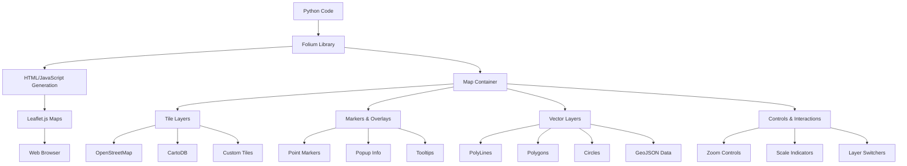

# `folium`

## Repository Overview

### Tree Structure
```
folium/
├── plugins/          # Optional extension components for enhanced functionality
├── elements.py       # Base Element class for map components
├── folium.py         # Main module containing core map elements and classes
├── map.py            # Map configuration and options management
├── utilities.py      # Coordinate transformation and utility functions
└── vector_layers.py  # Vector layer base classes and implementations
```

### Purpose
Folium is a Python library that provides an easy-to-use interface for creating interactive web maps using Leaflet.js technology. It enables developers to visualize geospatial data through customizable map layers, markers, and vector graphics. The library bridges the gap between Python data processing workflows and interactive web mapping, making it ideal for data scientists, GIS professionals, and web developers working with spatial data.

### Target Users
- Data scientists and analysts working with geospatial datasets
- GIS professionals requiring interactive map visualizations
- Web developers integrating maps into applications
- Researchers presenting spatial data findings
- Anyone needing to create interactive maps from Python code

### Position in Ecosystem
Folium operates as a standalone Python library that generates HTML/JavaScript output for interactive maps. It serves as a bridge between Python data processing environments and web-based visualization tools, making it particularly valuable in Jupyter notebooks, web applications, and data analysis pipelines.

### Architecture


### Entry Points
1. **Direct Import API** (`import folium`):
   - Provides access to core map classes: `Map`, `Marker`, `PolyLine`, `Polygon`, `Circle`, `TileLayer`, `GeoJson`
   - Enables programmatic map creation and customization
   - Target audience: Developers building interactive map applications

2. **Jupyter Notebook Integration**:
   - Direct rendering of maps in notebook cells
   - Automatic HTML display in notebook environments
   - Target audience: Data scientists and researchers

### Core Features
1. **Interactive Map Creation** (`folium.Map`):
   - Creates base map containers with customizable location, zoom, and dimensions
   - Supports multiple tile providers and custom tile sources

2. **Geospatial Elements** (`folium.Marker`, `folium.PolyLine`, `folium.Polygon`, `folium.Circle`):
   - Add point markers, lines, polygons, and circles to maps
   - Support for popups, tooltips, and custom styling

3. **GeoJSON Support** (`folium.GeoJson`):
   - Render complex geographic data from GeoJSON format
   - Apply custom styling functions to vector features

4. **Layer Management** (`folium.TileLayer`):
   - Configure base map tile providers with attribution
   - Support for multiple simultaneous tile layers

5. **Advanced Features** (`plugins/`):
   - Extended functionality through optional plugin components
   - Enhanced visualization capabilities beyond core features

### Dependencies
- **Internal Dependencies**:
  - `elements.py`: Provides base Element class for map components
  - `map.py`: Contains MapOptions and map layout management
  - `utilities.py`: Offers coordinate transformation and utility functions
  - `vector_layers.py`: Implements vector layer base classes
  - `plugins/`: Contains optional extension components for enhanced functionality

- **External Dependencies**:
  - `json`: Required for serializing map data to JSON format
  - `requests`: Used for fetching remote tile resources
  - `jinja2`: Template engine for generating HTML map output

### Configuration
- **Environment Variables**: May support map tile URL overrides or API keys for premium services
- **Runtime Parameters**: Map dimensions, location coordinates, tile provider URLs, styling options

### Extension Points
1. **Plugin System** (`plugins/` directory):
   - Extend functionality through additional modules in the plugins directory
   - Follow established patterns for new map components

2. **Custom Tile Providers**:
   - Implement custom TileLayer subclasses for proprietary or specialized map services

3. **Vector Layer Customization**:
   - Inherit from VectorLayer base classes to create custom geographic features

4. **Styling Extensions**:
   - Override styling functions for GeoJSON and vector layers

---

## Modules

- [`folium`](folium.md)

