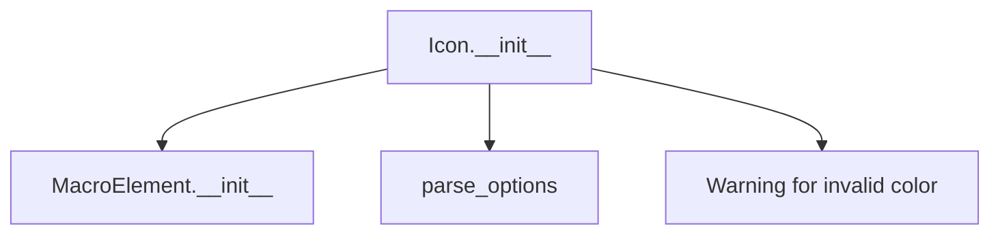
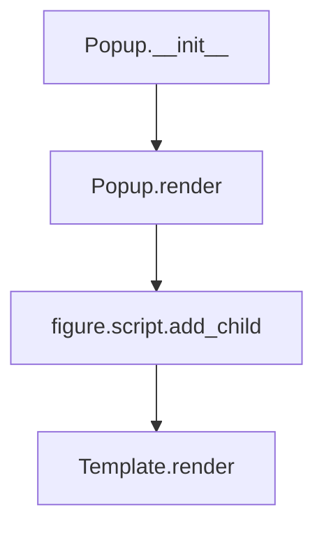
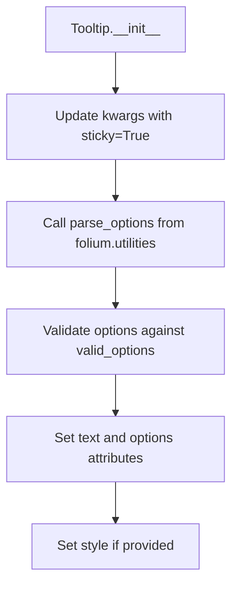

# `map.py`

## `folium.map.Layer` · *class*

## Summary:
Represents a base class for map layers in the Folium mapping library, providing common properties and behaviors for overlay layers.

## Description:
The Layer class serves as a foundational abstraction for all map layer types in Folium. It provides standardized properties for managing layer visibility, control display, and naming conventions that are essential for building interactive maps. This class is typically subclassed by specific layer implementations like TileLayer, MarkerCluster, etc.

The Layer class is designed to be instantiated by map constructors or layer factories, and it establishes the basic interface for layer management in Folium's map rendering system.

## State:
- layer_name (str): Unique identifier for the layer, automatically generated if not provided via the name parameter
- overlay (bool): Flag indicating whether this layer should be treated as an overlay (default: False)
- control (bool): Flag indicating whether this layer should appear in the map controls (default: True)
- show (bool): Flag indicating whether this layer should be initially visible (default: True)

The __init__ parameters have the following defaults and constraints:
- name: Optional string, defaults to None (uses auto-generated name via get_name())
- overlay: Boolean, defaults to False
- control: Boolean, defaults to True
- show: Boolean, defaults to True

Class invariants:
- layer_name must be a string representing a unique layer identifier
- overlay, control, and show must be boolean values

## Lifecycle:
Creation: Instantiate using Layer(name=None, overlay=False, control=True, show=True)
Usage: Typically used as a base class for inheritance; instances are managed by Map objects
Destruction: Cleanup is handled by the parent MacroElement class and folium's garbage collection

## Method Map:
```mermaid
graph TD
    A[Layer.__init__] --> B[super().__init__()]
    A --> C[layer_name = name if name is not None else self.get_name()]
    A --> D[self.overlay = overlay]
    A --> E[self.control = control]
    A --> F[self.show = show]
```

## Raises:
- No explicit exceptions are raised by the __init__ method based on the provided code
- However, the parent MacroElement.__init__() may raise exceptions if the inheritance chain has validation requirements

## Example:
```python
# Create a basic layer
layer = Layer(name="my_layer", overlay=True, control=True, show=True)

# Create a layer with auto-generated name
basic_layer = Layer(overlay=False, control=False)

# The layer would typically be added to a Map object
# map.add_child(layer)
```

### `folium.map.Layer.__init__` · *method*

## Summary:
Initializes a map layer with configurable naming, visibility, and control properties.

## Description:
Configures a map layer instance with customizable identification, overlay status, control visibility, and initial display settings. This constructor establishes the fundamental properties that govern how the layer behaves within a Folium map context.

## Args:
    name (str, optional): Unique identifier for the layer. If None, automatically generates a name using the get_name() method. Defaults to None.
    overlay (bool): Indicates whether this layer should be treated as an overlay. Defaults to False.
    control (bool): Controls whether this layer appears in the map's layer control interface. Defaults to True.
    show (bool): Determines if the layer is initially visible on the map. Defaults to True.

## Returns:
    None: This method initializes instance attributes and does not return a value.

## Raises:
    No explicit exceptions are raised by this method based on the provided implementation.

## State Changes:
    Attributes READ: None
    Attributes WRITTEN: 
    - self.layer_name: Set to the provided name or auto-generated name
    - self.overlay: Set to the provided overlay value
    - self.control: Set to the provided control value  
    - self.show: Set to the provided show value

## Constraints:
    Preconditions:
    - The parent MacroElement class initialization must succeed
    - All arguments must be of the correct type (name: str or None, overlay/control/show: bool)
    
    Postconditions:
    - self.layer_name is guaranteed to be a string
    - self.overlay, self.control, and self.show are guaranteed to be boolean values

## Side Effects:
    None: This method performs no I/O operations or external service calls.

## `folium.map.FeatureGroup` · *class*

## Summary:
A FeatureGroup is a specialized map layer that groups multiple map features together for collective management and display control.

## Description:
The FeatureGroup class serves as a container for organizing and managing multiple map features as a single logical unit. It inherits from the Layer base class and provides a mechanism to group various map elements (markers, polygons, lines, etc.) under a common identifier, allowing them to be shown, hidden, or controlled together through the map interface.

This class is particularly useful when working with complex maps where related features need to be managed collectively, such as grouping all markers for a specific category or organizing features by geographic regions. FeatureGroups are typically created by map constructors or manually instantiated when building custom map layouts.

## State:
- _name (str): Fixed string value "FeatureGroup" that identifies this layer type
- tile_name (str): The name used for this feature group, either explicitly provided via the name parameter or derived from the parent class naming mechanism
- options (dict): Dictionary of parsed options with camelCase keys, containing additional configuration parameters passed through **kwargs

The __init__ parameters have the following defaults and constraints:
- name (Optional[str]): User-defined name for the feature group, defaults to None (uses parent class naming mechanism)
- overlay (bool): Indicates if this is an overlay layer, defaults to True
- control (bool): Indicates if this appears in map controls, defaults to True
- show (bool): Indicates initial visibility, defaults to True
- **kwargs: Additional keyword arguments for feature group configuration

Class invariants:
- _name is always set to the literal string "FeatureGroup"
- tile_name is always a string representing the feature group identifier
- options is always a dictionary with camelCase keys and filtered None values

## Lifecycle:
Creation: Instantiate using FeatureGroup(name=None, overlay=True, control=True, show=True, **kwargs)
Usage: Typically used as a container for other map features; add child elements using map.add_child() or similar methods
Destruction: Cleanup is handled by the parent MacroElement class and folium's garbage collection

## Method Map:
```mermaid
graph TD
    A[FeatureGroup.__init__] --> B[super().__init__()]
    A --> C[_name = "FeatureGroup"]
    A --> D[tile_name = name if name is not None else self.get_name()]
    A --> E[self.options = parse_options(**kwargs)]
```

## Raises:
- No explicit exceptions are raised by the __init__ method based on the provided code
- The parent Layer.__init__() or MacroElement.__init__() may raise exceptions if validation fails

## Example:
```python
# Create a feature group with a custom name
feature_group = FeatureGroup(
    name="My Feature Group",
    overlay=True,
    control=True,
    show=True
)

# Create a feature group with auto-generated name
basic_group = FeatureGroup()

# Add features to the group
# map.add_child(feature_group)
# feature_group.add_child(marker1)
# feature_group.add_child(marker2)
```

### `folium.map.FeatureGroup.__init__` · *method*

## Summary:
Initializes a FeatureGroup element with configurable display properties and options.

## Description:
Configures a FeatureGroup instance by setting its name, visibility controls, and processing additional options for rendering. This method establishes the core configuration for feature grouping in folium maps, allowing users to organize map features into logical groups with customizable display behavior.

## Args:
    name (str, optional): Unique identifier for the feature group. Defaults to None.
    overlay (bool): Whether the feature group appears as an overlay. Defaults to True.
    control (bool): Whether to include the feature group in the map controls. Defaults to True.
    show (bool): Whether the feature group is initially visible. Defaults to True.
    **kwargs: Additional options passed to the underlying rendering engine, converted to camelCase format.

## Returns:
    None: This method initializes the object state and returns nothing.

## Raises:
    None: This method does not explicitly raise exceptions.

## State Changes:
    Attributes READ: 
        - self.get_name() (method call)
    Attributes WRITTEN:
        - self._name: Set to "FeatureGroup"
        - self.tile_name: Set based on name parameter or via get_name() method
        - self.options: Set to processed kwargs via parse_options()

## Constraints:
    Preconditions:
        - The parent class constructor must accept name, overlay, control, and show parameters
        - All kwargs must be valid for the parse_options function
    Postconditions:
        - self._name is always set to "FeatureGroup"
        - self.tile_name is always set to either the provided name or the result of get_name()
        - self.options is always a dictionary with camelCase keys

## Side Effects:
    None: This method performs no I/O operations or external service calls.

## `folium.map.LayerControl` · *class*

## Summary:
A control element that manages and displays map layers in a Folium map, allowing users to toggle base layers and overlays on and off.

## Description:
The LayerControl class provides an interactive layer control interface for Folium maps. It automatically detects and organizes map layers into base layers and overlays, creating a user-friendly interface for switching between different map layers. This class is typically instantiated by the Map class and integrated into the map's control system.

The LayerControl serves as a distinct abstraction because it encapsulates the logic for categorizing layers, determining which layers should be toggleable, and rendering the appropriate HTML/JavaScript control interface. It separates layer management concerns from the map rendering process.

## State:
- base_layers (OrderedDict): Maps layer names to their JavaScript identifiers for base layers
- overlays (OrderedDict): Maps layer names to their JavaScript identifiers for overlay layers  
- layers_untoggle (OrderedDict): Maps layer names to their JavaScript identifiers that should be untoggleable
- _name (str): Set to "LayerControl" to identify this element type
- options (dict): Configuration options processed through parse_options, including position, collapsed, and autoZIndex settings

The __init__ parameters have these defaults and constraints:
- position (str): Default "topright", determines where the control appears on the map
- collapsed (bool): Default True, indicates whether the control starts collapsed
- autoZIndex (bool): Default True, controls automatic z-index management
- **kwargs: Additional options passed through parse_options for further customization

Class invariants:
- base_layers, overlays, and layers_untoggle are always OrderedDict instances
- _name is always set to "LayerControl"
- options contains properly formatted camelCase keys from the initialization parameters

## Lifecycle:
Creation: Instantiate with LayerControl(position="topright", collapsed=True, autoZIndex=True, **kwargs)
Usage: Typically called by the Map class during rendering to update layer information and generate the control interface
Destruction: Handled by the parent MacroElement class lifecycle management

## Method Map:
```mermaid
graph TD
    A[LayerControl.__init__] --> B[super().__init__()]
    A --> C[self._name = "LayerControl"]
    A --> D[self.options = parse_options(...)]
    A --> E[self.base_layers = OrderedDict()]
    A --> F[self.overlays = OrderedDict()]
    A --> G[self.layers_untoggle = OrderedDict()]
    
    H[LayerControl.render] --> I[self.reset()]
    I --> J[for item in self._parent._children.values()]
    J --> K{isinstance(item, Layer) AND item.control?}
    K -- Yes --> L[key = item.layer_name]
    L --> M{not item.overlay?}
    M -- Yes --> N[self.base_layers[key] = item.get_name()]
    N --> O{len(self.base_layers) > 1?}
    O -- Yes --> P[self.layers_untoggle[key] = item.get_name()]
    M -- No --> Q[self.overlays[key] = item.get_name()]
    Q --> R{not item.show?}
    R -- Yes --> S[self.layers_untoggle[key] = item.get_name()]
    K -- No --> T[continue]
    
    T --> U[super().render()]
```

## Raises:
- No explicit exceptions are raised by LayerControl.__init__
- Exceptions may be raised by the parent MacroElement.__init__ or parse_options if invalid arguments are passed
- Exceptions from parent render() method may occur during template rendering

## Example:
```python
# Create a map with multiple layers
import folium

# Create base map
m = folium.Map(location=[45.5236, -122.6750], zoom_start=13)

# Add base layer
folium.TileLayer('OpenStreetMap').add_to(m)

# Add overlay layers
folium.TileLayer('CartoDB positron', name='CartoDB').add_to(m)
folium.Marker([45.5236, -122.6750], popup='Portland').add_to(m)

# The LayerControl is automatically created by the Map class
# but can also be manually instantiated and added
layer_control = folium.LayerControl(position='topright', collapsed=False)
m.add_child(layer_control)

# Render the map
m.save('map.html')
```

### `folium.map.LayerControl.__init__` · *method*

## Summary:
Initializes a LayerControl instance with configurable positioning and layer management capabilities.

## Description:
Configures the LayerControl object by setting up its positioning options, layer tracking structures, and initialization state. This method establishes the foundation for managing base layers and overlays in a Folium map visualization.

## Args:
    position (str): Position of the layer control on the map. Defaults to "topright". Valid values are typically "topleft", "topright", "bottomleft", "bottomright".
    collapsed (bool): Whether the layer control is initially collapsed. Defaults to True.
    autoZIndex (bool): Whether to automatically set z-index values for layers. Defaults to True.
    **kwargs: Additional keyword arguments passed to parse_options for further configuration.

## Returns:
    None: This method initializes the object's state and does not return a value.

## Raises:
    None: This method does not explicitly raise exceptions.

## State Changes:
    Attributes READ: None
    Attributes WRITTEN: 
        - self._name: Set to "LayerControl"
        - self.options: Set to parsed options dictionary
        - self.base_layers: Initialized as empty OrderedDict
        - self.overlays: Initialized as empty OrderedDict  
        - self.layers_untoggle: Initialized as empty OrderedDict

## Constraints:
    Preconditions:
        - The parent class MacroElement must be properly initialized
        - All keyword arguments passed to parse_options must be valid
    Postconditions:
        - The LayerControl instance is properly initialized with default layer tracking structures
        - The _name attribute is set to "LayerControl"
        - Options are processed and stored in camelCase format

## Side Effects:
    None: This method performs no I/O operations or external service calls. It only initializes internal state.

### `folium.map.LayerControl.reset` · *method*

## Summary:
Clears all layer tracking structures by resetting base_layers, overlays, and layers_untoggle to empty OrderedDict instances.

## Description:
Resets the internal state of the LayerControl by clearing all tracked base layers, overlays, and untoggleable layers. This method is typically called at the beginning of the render process to ensure clean state before rebuilding layer information from the parent map's children.

## Args:
    None: This method takes no arguments beyond the implicit self parameter.

## Returns:
    None: This method does not return a value.

## Raises:
    None: This method does not explicitly raise exceptions.

## State Changes:
    Attributes READ: None
    Attributes WRITTEN:
        - self.base_layers: Reassigned to empty OrderedDict
        - self.overlays: Reassigned to empty OrderedDict
        - self.layers_untoggle: Reassigned to empty OrderedDict

## Constraints:
    Preconditions:
        - The LayerControl instance must be properly initialized
        - All internal attributes must be valid OrderedDict instances
        
    Postconditions:
        - All three OrderedDict attributes are cleared and ready for new layer data
        - The LayerControl's layer tracking state is reset to initial empty state

## Side Effects:
    None: This method performs no I/O operations or external service calls. It only modifies internal state.

### `folium.map.LayerControl.render` · *method*

## Summary:
Scans parent map children to organize layers and prepares layer control state for rendering.

## Description:
Processes all child elements of the parent map to categorize them into base layers and overlays, and determines which layers should be marked as untoggleable. This method updates internal OrderedDicts (base_layers, overlays, layers_untoggle) that define the layer control's interface before calling the parent's render method.

The method is invoked during the map rendering process to ensure the layer control displays the current set of available layers. It filters child elements to include only Layer instances with control=True, then organizes them based on their overlay property and visibility state.

## Args:
    **kwargs: Additional keyword arguments passed to the parent render method.

## Returns:
    None: This method does not return a value.

## Raises:
    None explicitly raised by this method.

## State Changes:
    Attributes READ:
    - self._parent._children: Dictionary containing all child elements of the parent map
    - self._parent: Parent element (typically a Map instance) that contains this LayerControl
    
    Attributes WRITTEN:
    - self.base_layers: OrderedDict mapping layer names to their display names for base layers
    - self.overlays: OrderedDict mapping layer names to their display names for overlays  
    - self.layers_untoggle: OrderedDict tracking layers that should not be toggleable

## Constraints:
    Preconditions:
    - self._parent must be a valid parent element with a _children attribute
    - All child elements in self._parent._children must be instances of Layer or subclasses
    - Layer instances must have control=True to be considered for inclusion
    
    Postconditions:
    - self.base_layers, self.overlays, and self.layers_untoggle are populated with appropriate layer mappings
    - The internal state reflects the current set of layers in the parent map

## Side Effects:
    None: This method does not perform I/O operations or mutate external objects beyond updating its own state.

## `folium.map.Icon` · *class*

## Summary:
Represents an icon element for map markers in folium, allowing customization of color, icon style, and rotation.

## Description:
The Icon class is used to create customizable icon elements that can be added to map markers in folium visualizations. It serves as a distinct abstraction for managing icon properties such as color, icon type, and rotation angle, providing a standardized interface for marker icons in interactive maps.

This class should be instantiated when creating custom markers with specific visual styling requirements. It is typically used internally by other folium components when creating marker elements, but can also be created directly for advanced use cases.

## State:
- color: str, default "blue", must be one of the predefined color options in color_options
- icon_color: str, default "white", controls the color of the icon itself  
- icon: str, default "info-sign", specifies the icon type (e.g., "info-sign", "star", "home")
- angle: int, default 0, specifies rotation angle in degrees for the icon
- prefix: str, default "glyphicon", specifies the icon library prefix (e.g., "glyphicon", "fa")
- options: dict, processed configuration options from parse_options function
- _name: str, fixed value "Icon"
- _template: Template, Jinja2 template for rendering the icon element (empty in provided code)

The class maintains a set of valid color options that constrain the color parameter to predefined values. The angle parameter is converted to CSS classes for rotation.

## Lifecycle:
Creation: Instantiate with optional parameters for color, icon_color, icon, angle, and prefix. Invalid colors trigger a warning.
Usage: Typically used as part of marker creation in folium maps, where the options dictionary is processed by the rendering engine.
Destruction: No explicit cleanup required; inherits standard Python object lifecycle management.

## Method Map:


## Raises:
- UserWarning: When the color parameter is not in the valid color_options set

## Example:
```python
# Create a red icon with a star symbol
icon = Icon(color="red", icon="star", angle=45)

# Create a blue icon with default settings
icon = Icon()

# Create a green icon with custom icon and no rotation
icon = Icon(color="green", icon="home", angle=0)

# Create an icon using Font Awesome instead of Glyphicons
icon = Icon(color="purple", icon="heart", prefix="fa")
```

### `folium.map.Icon.__init__` · *method*

## Summary:
Initializes an Icon object with customizable color, icon style, and rotation properties for map markers.

## Description:
Configures an Icon instance with specified visual properties including color, icon type, and rotation angle. This constructor sets up the internal state of the icon element, validates the color parameter against predefined options, and processes all styling options for use in map rendering.

## Args:
    color (str): Background color of the icon, defaults to "blue". Must be one of the predefined color options.
    icon_color (str): Color of the icon symbol itself, defaults to "white".
    icon (str): Icon symbol identifier, defaults to "info-sign".
    angle (int): Rotation angle in degrees for the icon, defaults to 0.
    prefix (str): Icon library prefix, defaults to "glyphicon" (e.g., "glyphicon", "fa").
    **kwargs: Additional keyword arguments passed to the options processing function.

## Returns:
    None: This method initializes the object's state but does not return a value.

## Raises:
    UserWarning: When the color parameter is not in the valid color options set.

## State Changes:
    Attributes READ: None
    Attributes WRITTEN: 
    - self._name: Set to "Icon"
    - self.options: Set to the processed options dictionary from parse_options

## Constraints:
    Preconditions:
    - The color parameter must be one of the valid color options defined in the class
    - All parameters must be compatible with the underlying rendering system
    
    Postconditions:
    - The Icon instance is properly initialized with all specified properties
    - The options dictionary contains all processed styling parameters
    - The _name attribute is set to "Icon"

## Side Effects:
    - May emit a UserWarning if the color parameter is invalid
    - Calls the parent class constructor (super().__init__())
    - Processes all provided parameters through parse_options utility function

## `folium.map.Marker` · *class*

## Summary:
Represents an interactive marker element that can be placed on a folium map, supporting location, popup, tooltip, and icon customization.

## Description:
The Marker class creates interactive markers on folium maps that can be positioned at specific geographic coordinates. It serves as a visual representation of a point on the map and can include associated popup information, tooltips, and custom icons. This class is typically instantiated by map components when adding interactive markers to maps. It inherits from MacroElement, making it compatible with folium's map rendering system.

## State:
- location: list[float] or None - Geographic coordinates [latitude, longitude] validated by validate_location(), defaults to None
- options: dict - Parsed options for marker behavior including draggable and autoPan settings, processed by parse_options()
- icon: Icon instance or None - Custom icon for the marker, added as child element
- _name: str - Class identifier set to "Marker" for internal tracking

## Lifecycle:
Creation: Instantiate with optional location, popup, tooltip, icon, and draggable parameters. Location must be a valid coordinate pair or None. The constructor validates location and processes options.
Usage: Markers are typically added to maps using the add_child() method or similar attachment mechanisms. The render() method must be called to integrate the marker with the map's JavaScript.
Destruction: Managed automatically by folium's rendering system when the map is disposed.

## Method Map:
```mermaid
graph TD
    A[Marker.__init__] --> B[validate_location if location provided]
    B --> C[parse_options for draggable/autoPan settings]
    C --> D{icon provided?}
    D -- Yes --> E[add_child(icon)]
    D -- No --> F{popup provided?}
    E --> F
    F --> G[add_child(popup)]
    G --> H{tooltip provided?}
    H --> I[add_child(tooltip)]
    I --> J[Marker.render]
    J --> K[super().render()]
```

## Raises:
- ValueError: When render() is called and location is None, indicating the marker location must be assigned when added directly to map

## Example:
```python
# Create a basic marker at a location
marker = Marker([40.7128, -74.0060])

# Create a marker with popup and tooltip
popup = Popup('New York City')
tooltip = Tooltip('NYC Marker')
marker = Marker([40.7128, -74.0060], popup=popup, tooltip=tooltip)

# Create a draggable marker with custom icon
from folium.features import Icon
icon = Icon(color='red', icon='info-sign')
marker = Marker([40.7128, -74.0060], icon=icon, draggable=True)
```

### `folium.map.Marker.__init__` · *method*

## Summary:
Initializes a Marker object with geographic location, interactive elements, and configuration options for map display.

## Description:
Constructs a Marker instance that represents an interactive point on a folium map. This method sets up the marker's geographic position, draggable behavior, and associated interactive elements like popups and tooltips. The marker is initialized as a child element of a map and can be configured with various options for display and interaction.

## Args:
    location (list, tuple, or array-like, optional): Geographic coordinates as [latitude, longitude]. Defaults to None.
    popup (Popup or str, optional): Interactive popup element or string content to display when marker is clicked. Defaults to None.
    tooltip (Tooltip or str, optional): Interactive tooltip element or string content to display on hover. Defaults to None.
    icon (Icon, optional): Custom icon for the marker. Defaults to None.
    draggable (bool): Whether the marker can be dragged by the user. Defaults to False.
    **kwargs: Additional options passed to the marker's configuration, such as animation settings or custom properties.

## Returns:
    None: This method initializes the object's state and does not return a value.

## Raises:
    TypeError: If location is not a sized variable (doesn't support len()) or doesn't support indexing.
    ValueError: If location doesn't contain exactly two values, or if the values cannot be converted to floats, or if values contain NaN.

## State Changes:
    Attributes READ: None
    Attributes WRITTEN: 
        - self._name: Set to "Marker" to identify the element type
        - self.location: Set to validated location coordinates or None
        - self.options: Set to parsed options dictionary with camelCase keys

## Constraints:
    Preconditions:
        - If location is provided, it must contain exactly two numerical values
        - If popup is provided, it must be either a Popup instance or a string
        - If tooltip is provided, it must be either a Tooltip instance or a string
    Postconditions:
        - self._name is set to "Marker"
        - self.location contains validated coordinates or None
        - self.options contains processed configuration options
        - Child elements (popup, tooltip, icon) are properly attached if provided

## Side Effects:
    - Adds child elements (popup, tooltip, icon) to the marker via add_child() method
    - Calls validate_location() to normalize geographic coordinates
    - Calls parse_options() to process configuration options

### `folium.map.Marker._get_self_bounds` · *method*

## Summary:
Returns a degenerate bounding box for the marker by duplicating its location coordinate.

## Description:
This method implements the standard interface for spatial boundary calculation by returning a bounding box that encompasses the marker's location. For point markers, this creates a degenerate bounding box where both the minimum and maximum coordinates are identical to the marker's location. This method is typically called during map rendering or extent calculation processes to determine the spatial boundaries of map elements.

## Args:
    None

## Returns:
    list[list[float]]: A list containing two identical coordinate pairs representing the marker's location as a degenerate bounding box. Each coordinate pair is [latitude, longitude].

## Raises:
    None

## State Changes:
    Attributes READ: 
    - self.location: The geographic coordinate of the marker
    
    Attributes WRITTEN: None

## Constraints:
    Preconditions:
    - The self.location attribute must be a valid geographic coordinate (list or tuple of [latitude, longitude])
    - The location coordinates must be numeric values
    
    Postconditions:
    - Method returns a list of exactly two identical coordinate pairs
    - Both coordinate pairs represent the same geographic location

## Side Effects:
    None

### `folium.map.Marker.render` · *method*

## Summary:
Validates that the marker has a location assigned before rendering and calls the parent rendering logic.

## Description:
This method ensures that a marker has a valid location assigned before proceeding with the rendering process. It's called during the map rendering lifecycle when the marker needs to be rendered to HTML. The validation prevents rendering markers without locations, which would cause issues in the generated map output. This check is particularly important when markers are added directly to a map without proper initialization.

## Args:
    None

## Returns:
    None

## Raises:
    ValueError: When the marker's location attribute is None, indicating that the marker was added directly to a map without having a location assigned during initialization.

## State Changes:
    Attributes READ: self.location, self._name
    Attributes WRITTEN: None

## Constraints:
    Preconditions: The marker instance must have been initialized with a location or have its location attribute set before calling this method.
    Postconditions: If successful, the method proceeds to call the parent class's render method, which handles the actual HTML generation.

## Side Effects:
    None

## `folium.map.Popup` · *class*

## Summary:
Represents an interactive popup element that can be displayed on a map, containing HTML content and configurable display options.

## Description:
The Popup class creates interactive popups that appear on maps when users interact with markers or other map elements. It serves as a container for HTML content and provides configuration options for positioning, sizing, and behavior. This class is typically instantiated by map components when creating interactive markers or annotations. It inherits from Element, making it a proper leaf node in the map's element hierarchy.

## State:
- _name: str, set to "Popup" - identifies the element type
- header: Element instance - manages popup header content
- html: Element instance - manages popup body content  
- script: Element instance - manages JavaScript for popup functionality
- show: bool, default False - determines if popup is initially shown
- lazy: bool, default False - controls lazy loading behavior
- options: dict - parsed options for popup behavior including max_width, autoClose, closeOnClick
- _template: Template instance - Jinja2 template for rendering popup JavaScript (defined in parent class)

## Lifecycle:
Creation: Instantiate with optional HTML content and configuration parameters. HTML can be a string or Element object, or None. The constructor processes the HTML content and sets up internal elements, handling different input types appropriately.
Usage: Call render() method to add popup to a map's figure. The render process validates the figure context and integrates the popup with the map's JavaScript by adding it to the figure's script.
Destruction: Cleanup occurs automatically when the popup is removed from the map or when the map is destroyed.

## Method Map:


## Raises:
- AssertionError: When trying to render the popup outside of a Figure context

## Example:
```python
# Create a popup with HTML content
popup = Popup('<h3>Hello World</h3>', max_width=300, show=True)

# Create a popup with an Element object
html_content = Html('<p>This is a paragraph</p>')
popup = Popup(html_content, sticky=True)

# Create an empty popup
popup = Popup()

# Create popup with custom options
popup = Popup('Content', max_width=200, autoClose=False)
```

### `folium.map.Popup.__init__` · *method*

## Summary:
Initializes a Popup element with configurable HTML content and display options.

## Description:
Constructs a Popup object that can be attached to map markers or other interactive elements. This method sets up the internal structure for the popup, processes the provided HTML content (handling both string and Element inputs), and configures display behavior through various options. The popup is initialized with three internal Element containers (header, html, script) that manage different aspects of the popup's content and functionality.

## Args:
    html (str or Element, optional): HTML content for the popup. Can be a string or an Element object. Defaults to None.
    parse_html (bool): If True, treats HTML content as raw HTML without escaping. If False, escapes backticks in HTML string. Defaults to False.
    max_width (str): Maximum width of the popup in CSS units (e.g., "300px", "100%"). Defaults to "100%".
    show (bool): If True, displays the popup immediately upon creation. Defaults to False.
    sticky (bool): If True, prevents the popup from closing when clicking elsewhere on the map. Defaults to False.
    lazy (bool): If True, delays popup rendering until it's actually needed. Defaults to False.
    **kwargs: Additional options passed to the underlying JavaScript popup library, converted to camelCase keys.

## Returns:
    None: This method initializes the object's state and performs no return value.

## Raises:
    None: This method does not explicitly raise exceptions under normal operation.

## State Changes:
    Attributes READ: None
    Attributes WRITTEN:
    - self._name: Set to "Popup"
    - self.header: Initialized as an Element instance
    - self.html: Initialized as an Element instance  
    - self.script: Initialized as an Element instance
    - self.show: Set to the provided show parameter value
    - self.lazy: Set to the provided lazy parameter value
    - self.options: Set to parsed options dictionary

## Constraints:
    Preconditions:
    - The html parameter, if provided, must be either None, a string, or an Element instance
    - All keyword arguments in **kwargs must be valid option names for the JavaScript popup library
    - The parse_html parameter must be a boolean value
    
    Postconditions:
    - The popup object is properly initialized with internal Element containers
    - HTML content is processed and stored in the appropriate internal element
    - Options are parsed and stored in the options dictionary with proper camelCase formatting
    - Behavior flags (show, lazy) are set according to provided parameters

## Side Effects:
    None: This method performs no I/O operations or external service calls. It only initializes object state and internal element relationships.

### `folium.map.Popup.render` · *method*

## Summary:
Renders the popup element by processing child elements and adding the rendered template to the associated figure's script.

## Description:
This method orchestrates the rendering of a Popup element by first recursively rendering all child elements, then generating the HTML template representation of the popup and adding it to the figure's script container. This ensures proper hierarchical rendering of map elements.

## Args:
    **kwargs: Additional keyword arguments passed through to child rendering methods

## Returns:
    None: This method performs side effects and does not return a value

## Raises:
    AssertionError: When the popup element is not contained within a Figure instance

## State Changes:
    Attributes READ: 
    - self._children: Iterated to process child elements
    - self._template: Used to render the popup HTML template
    - self.get_name(): Called to retrieve the element's name for script registration
    
    Attributes WRITTEN:
    - figure.script: Modified by adding the rendered Element containing the popup template

## Constraints:
    Preconditions:
    - The popup must be contained within a Figure instance (via parent-child relationship)
    - The popup must have a valid _template attribute that can be rendered
    - All child elements must have valid render methods
    
    Postconditions:
    - Child elements are rendered in their proper order
    - The rendered popup template is added to the figure's script container
    - The popup element maintains its parent-child relationships

## Side Effects:
    - Modifies the figure's script container by adding a new Element
    - Recursively calls render methods on all child elements
    - May trigger additional rendering operations in child elements

## `folium.map.Tooltip` · *class*

## Summary:
A Tooltip class that creates interactive map tooltips with customizable styling and positioning options.

## Description:
The Tooltip class represents an interactive tooltip element that can be added to folium maps. It allows users to display additional information when hovering over map elements. The class inherits from MacroElement, making it compatible with folium's map rendering system. Tooltips can be customized with text content, styling, positioning options, and various display behaviors.

## State:
- text (str): The tooltip text content, converted to string during initialization
- style (str, optional): Inline HTML style properties for customizing tooltip appearance  
- options (dict): Dictionary of validated tooltip options including pane, offset, direction, permanent, sticky, interactive, opacity, attribution, and className
- _name (str): Class identifier set to "Tooltip" for internal tracking
- _template (Template): Empty Jinja2 template used for rendering the tooltip in the final HTML output

## Lifecycle:
- Creation: Instantiate with text content, optional style, and keyword arguments for tooltip options
- Usage: Tooltips are typically added to map elements like markers or polygons using the add_child() method or similar attachment mechanisms
- Destruction: Managed automatically by folium's rendering system when the map is disposed

## Method Map:


## Raises:
- AssertionError: Raised when style parameter is not a string
- AssertionError: Raised when an invalid option key is provided in kwargs (not in valid_options)
- AssertionError: Raised when an option value doesn't match the expected type for that option

## Example:
```python
# Create a basic tooltip
tooltip = Tooltip('This is a marker')

# Create a styled tooltip with options
styled_tooltip = Tooltip(
    'Marker Info',
    style='background-color: red; color: white;',
    permanent=True,
    direction='top'
)

# Add to a marker
marker.add_child(tooltip)
```

### `folium.map.Tooltip.__init__` · *method*

## Summary:
Initializes a Tooltip instance with text content, styling options, and display behavior settings.

## Description:
Creates a new Tooltip object that can be attached to map elements to display contextual information on hover. This method configures the tooltip's text content, styling properties, and behavioral options such as stickiness and positioning. The method processes keyword arguments to convert them to camelCase format suitable for JavaScript integration.

## Args:
    text (str): The text content to display in the tooltip. Converted to string during initialization.
    style (str, optional): Inline HTML style properties for customizing tooltip appearance. Must be a valid CSS style string. Defaults to None.
    sticky (bool): Whether the tooltip should remain visible when the mouse leaves the target element. Defaults to True.
    **kwargs: Additional keyword arguments for tooltip configuration options including pane, offset, direction, permanent, interactive, opacity, attribution, and className.

## Returns:
    None: This method initializes the object's attributes but does not return a value.

## Raises:
    AssertionError: Raised when the style parameter is provided but is not a string type.
    AssertionError: Raised when invalid option keys are provided in kwargs that don't match the valid options list for tooltips.

## State Changes:
    Attributes READ: None
    Attributes WRITTEN: 
    - self._name: Set to "Tooltip" for class identification
    - self.text: Set to string representation of the input text
    - self.options: Set to parsed and validated options dictionary with camelCase keys
    - self.style: Set to the provided style string if valid

## Constraints:
    Preconditions:
        - The text parameter must be convertible to a string
        - If style is provided, it must be a string type
        - All kwargs must contain valid option keys that match the Tooltip's valid_options list
    Postconditions:
        - self._name is set to "Tooltip"
        - self.text is a string representation of the input text
        - self.options contains properly formatted camelCase keys with validated values
        - self.style is either None or a valid string if provided

## Side Effects:
    None: This method performs no I/O operations or external service calls. It only initializes object attributes.

### `folium.map.Tooltip.parse_options` · *method*

## Summary:
Processes and validates keyword arguments for tooltip options, converting snake_case keys to camelCase and ensuring type compliance.

## Description:
Validates and transforms keyword arguments passed to the Tooltip constructor, converting snake_case parameter names to camelCase format and verifying that each option conforms to its expected type. This method ensures that tooltip configuration options meet the requirements before being stored as options.

## Args:
    kwargs (dict): Keyword arguments containing tooltip configuration options in snake_case format.

## Returns:
    dict: A dictionary with camelCase keys and validated values, ready for use as tooltip options.

## Raises:
    AssertionError: When an option key is not in the valid options list or when a value doesn't match the expected type for that option.

## State Changes:
    Attributes READ: self.valid_options
    Attributes WRITTEN: None

## Constraints:
    Preconditions:
        - All kwargs keys must be strings
        - All kwargs values must be of appropriate types for their respective options
    Postconditions:
        - All returned keys are in camelCase format
        - All returned values match their expected types
        - All returned keys are present in self.valid_options

## Side Effects:
    None: This method has no side effects and is pure.

## `folium.map.FitBounds` · *class*

## Summary:
A Folium map component that adjusts the map view to fit specified geographical bounds.

## Description:
The FitBounds class is used to programmatically adjust a Folium map's zoom level and center coordinates to ensure that a given set of geographical bounds are visible within the map viewport. This component is typically added to a folium.Map instance to automatically configure the initial view or to dynamically update the map view based on geographical data.

This class serves as a bridge between Python Folium code and the underlying Leaflet.js map functionality, translating Python configuration into JavaScript commands that control map bounds fitting. It is particularly useful when you want to display a specific area or region on the map without manually calculating the appropriate zoom level and center coordinates.

## State:
- bounds: list or tuple of two coordinate pairs [[lat1, lng1], [lat2, lng2]] representing the geographical boundaries to fit. Each coordinate pair should be in [latitude, longitude] format.
- options: dict containing configuration options for the bounds fitting operation, processed via parse_options. Includes:
  - max_zoom: integer specifying the maximum zoom level to use when fitting bounds
  - padding_top_left: tuple of (left, top) padding in pixels to apply to the bounds
  - padding_bottom_right: tuple of (right, bottom) padding in pixels to apply to the bounds
  - padding: tuple of (left, top, right, bottom) padding in pixels to apply to all sides
- _name: str with fixed value "FitBounds" indicating the component type
- _template: Jinja2 Template object (empty in source, likely overridden or handled by parent class)

## Lifecycle:
- Creation: Instantiate with bounds parameter and optional padding/max_zoom configurations
- Usage: Add to a folium.Map instance using the add_child() method
- Destruction: Automatically managed by the map's lifecycle management

## Method Map:
```mermaid
graph TD
    A[FitBounds.__init__] --> B[super().__init__()]
    B --> C[self._name = "FitBounds"]
    C --> D[self.bounds = bounds]
    D --> E[self.options = parse_options(...)]
```

## Raises:
- None explicitly raised by __init__, but underlying parse_options or MacroElement parent may raise exceptions

## Example:
```python
import folium

# Create a map
m = folium.Map(location=[45.5236, -122.6750], zoom_start=13)

# Define geographical bounds (southwest corner, northeast corner)
bounds = [[45.5, -122.7], [45.6, -122.6]]

# Add FitBounds to adjust map view with padding
fit_bounds = folium.FitBounds(
    bounds, 
    padding=(10, 10),
    max_zoom=15
)
m.add_child(fit_bounds)

# The map will automatically adjust to show the specified bounds
# with 10px padding on all sides and maximum zoom of 15
```

### `folium.map.FitBounds.__init__` · *method*

## Summary:
Initializes a FitBounds element that configures map bounds fitting behavior.

## Description:
Constructs a FitBounds object that controls how map bounds are adjusted to fit a specified geographic area. This element is typically used to automatically adjust the map view to encompass provided coordinates while applying optional padding and zoom constraints.

## Args:
    bounds (list or tuple): Geographic bounds to fit the map to, typically specified as [[lat_min, lng_min], [lat_max, lng_max]].
    padding_top_left (tuple, optional): Padding to apply to the top-left corner as (lat_padding, lng_padding). Defaults to None.
    padding_bottom_right (tuple, optional): Padding to apply to the bottom-right corner as (lat_padding, lng_padding). Defaults to None.
    padding (tuple, optional): Uniform padding to apply to all sides as (lat_padding, lng_padding). Defaults to None.
    max_zoom (int, optional): Maximum zoom level to constrain the fitted view. Defaults to None.

## Returns:
    None: This method initializes the object's state but does not return a value.

## Raises:
    None: This method does not explicitly raise exceptions.

## State Changes:
    Attributes READ: None
    Attributes WRITTEN: 
        - self._name: Set to "FitBounds"
        - self.bounds: Set to the provided bounds parameter
        - self.options: Set to processed options dictionary from parse_options

## Constraints:
    Preconditions:
        - bounds should be a valid geographic coordinate pair or bounding box
        - padding parameters, if provided, should be tuples of numeric values
        - max_zoom, if provided, should be a numeric value
    Postconditions:
        - The object is properly initialized as a MacroElement
        - self._name is set to "FitBounds"
        - self.bounds contains the provided bounds
        - self.options contains processed configuration options

## Side Effects:
    None: This method performs no I/O operations or external service calls.

## `folium.map.CustomPane` · *class*

## Summary:
CustomPane is a map pane component that enables custom layer organization in folium maps with configurable z-index and event handling.

## Description:
The CustomPane class creates a named pane for organizing map layers in folium visualizations. Panes allow developers to control the rendering order and event handling of different map elements through z-index values and pointer event settings. This component is typically used to create custom map overlays or layers that require specific positioning relative to other map components.

In folium's map architecture, panes provide a mechanism to separate different types of map elements (markers, polygons, HTML overlays) into distinct rendering layers, enabling better control over their visual hierarchy and interaction behavior.

## State:
- name (str): Unique identifier for the pane. Required parameter that determines the pane's name in the map.
- z_index (int): Z-index value controlling the rendering order of the pane. Higher values appear on top. Default is 625.
- pointer_events (bool): Controls whether mouse events are passed through to underlying elements. Default is False (events are handled by this pane).
- _name (str): Set internally to "Pane". This appears to be a convention for the parent MacroElement class.

## Lifecycle:
- Creation: Instantiate with a unique name, optional z_index (default 625), and optional pointer_events flag (default False)
- Usage: Add to a folium Map object to define custom layering behavior
- Destruction: Managed automatically by the folium map lifecycle

## Method Map:
```mermaid
graph TD
    A[CustomPane.__init__] --> B[MacroElement.__init__]
    A --> C[Set _name="Pane"]
    A --> D[Store name, z_index, pointer_events]
```

## Raises:
- None explicitly documented in constructor

## Example:
```python
import folium

# Create a custom pane with specific z-index
custom_pane = folium.map.CustomPane('overlay-pane', z_index=700)

# Create a map and add the custom pane
m = folium.Map([0, 0], zoom_start=2)
m.add_child(custom_pane)

# Add elements to the custom pane
folium.Marker([0, 0], pane='overlay-pane').add_to(m)
```

### `folium.map.CustomPane.__init__` · *method*

## Summary:
Initializes a CustomPane object with a specified name, z-index layer, and pointer event handling configuration.

## Description:
This constructor method creates a new CustomPane instance, setting up its visual properties and positioning within the map's layer stack. The pane serves as a container for map elements that need to be rendered at a specific z-index level, allowing for precise control over layer ordering and event handling.

## Args:
    name (str): Unique identifier for the pane, used to reference it in the map rendering process.
    z_index (int, optional): CSS z-index value determining the pane's layer position. Defaults to 625.
    pointer_events (bool, optional): Whether the pane should receive pointer events. Defaults to False.

## Returns:
    None: This method initializes the object's state and does not return a value.

## Raises:
    None explicitly raised in this method.

## State Changes:
    Attributes READ: None
    Attributes WRITTEN: 
    - self._name: Set to "Pane" string literal
    - self.name: Set to the provided name parameter
    - self.z_index: Set to the provided z_index parameter
    - self.pointer_events: Set to the provided pointer_events parameter

## Constraints:
    Preconditions:
    - The name parameter must be a string
    - The z_index parameter must be an integer
    - The pointer_events parameter must be a boolean
    
    Postconditions:
    - The object is properly initialized with the specified pane properties
    - The _name attribute is set to "Pane" regardless of input
    - All provided parameters are stored as instance attributes

## Side Effects:
    None: This method performs only local object initialization and has no external side effects.

