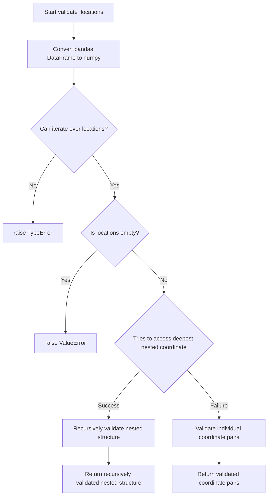
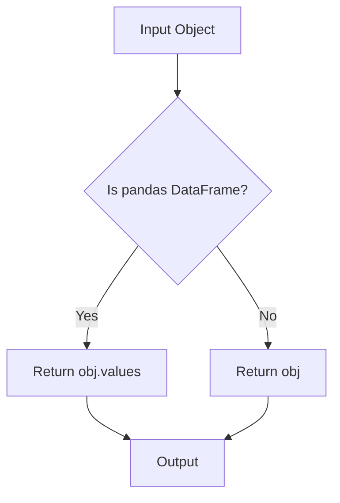
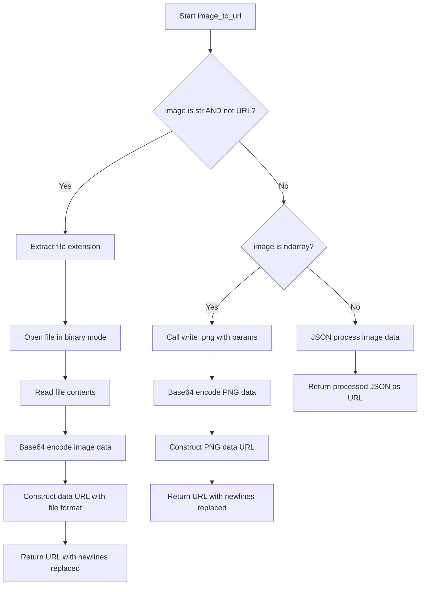
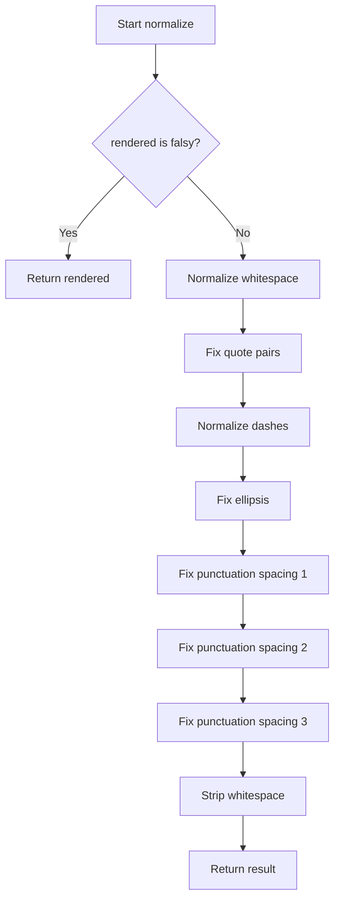
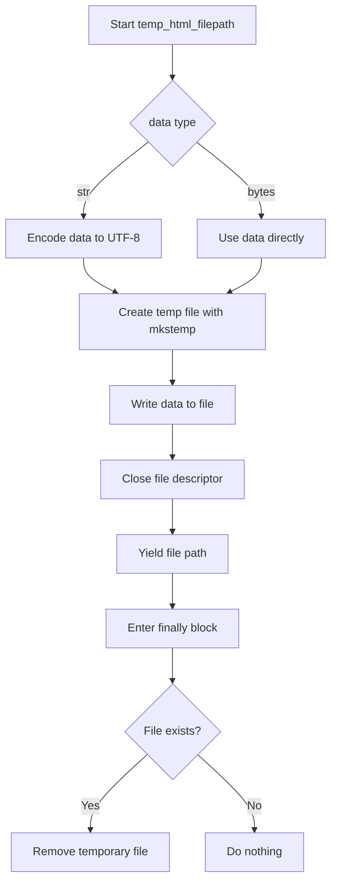
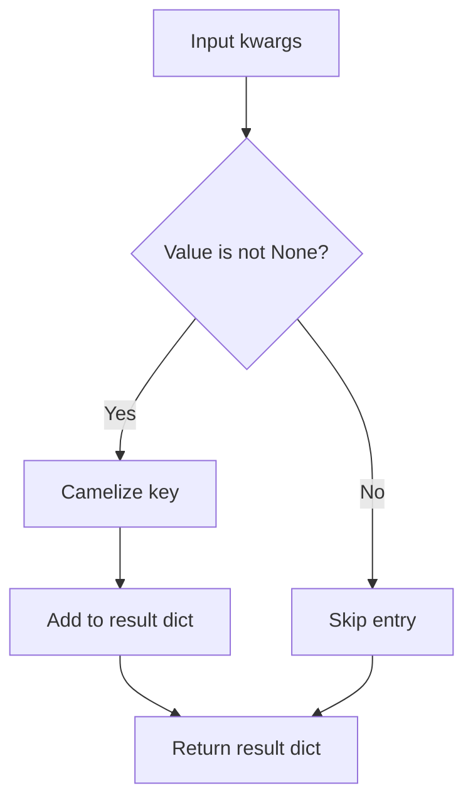

# `utilities.py`

## `folium.utilities.validate_location` · *function*

## Summary:
Validates and normalizes location coordinates into a list of two floating-point numbers representing latitude and longitude.

## Description:
This function ensures that location data conforms to the expected format of two numerical coordinates (latitude, longitude). It accepts various input types including lists, tuples, numpy arrays, and pandas DataFrames, converting them appropriately while validating their structure and content. This validation is crucial for geographic data processing to prevent downstream errors from malformed coordinates.

## Args:
    location: A location descriptor that should contain exactly two numerical values. Can be a list, tuple, numpy array, or pandas DataFrame.

## Returns:
    list[float]: A list containing two floating-point numbers representing latitude and longitude coordinates.

## Raises:
    TypeError: If location is not a sized variable (doesn't support len()) or doesn't support indexing.
    ValueError: If location doesn't contain exactly two values, or if the values cannot be converted to floats, or if values contain NaN.

## Constraints:
    Precondition: Location must be a sized variable with exactly two elements.
    Postcondition: Returns a list of exactly two float values representing valid geographic coordinates.

## Side Effects:
    None

## Control Flow:
```mermaid
flowchart TD
    A[Start validate_location] --> B{Is numpy array?}
    B -- Yes --> C[Convert to list with np.squeeze()]
    C --> D{Has __len__ attribute?}
    D -- No --> E[raise TypeError]
    D -- Yes --> F{len(location) == 2?}
    F -- No --> G[raise ValueError]
    F -- Yes --> H[Try indexing location[0], location[1]]
    H -- Success --> I[Validate each coordinate]
    H -- Exception --> J[raise TypeError]
    I --> K{Can convert to float?}
    K -- No --> L[raise ValueError]
    K -- Yes --> M{Is NaN?}
    M -- Yes --> N[raise ValueError]
    M -- No --> O[Return [float(x) for x in coords]]
```

## Examples:
    >>> validate_location([40.7128, -74.0060])
    [40.7128, -74.006]
    
    >>> validate_location((37.7749, 122.4194))
    [37.7749, 122.4194]
    
    >>> import numpy as np
    >>> validate_location(np.array([48.8566, 2.3522]))
    [48.8566, 2.3522]
    
    >>> validate_location([40.7128])
    ValueError: Expected two (lat, lon) values for location, instead got: [40.7128].
    
    >>> validate_location([40.7128, "invalid"])
    ValueError: Location should consist of two numerical values, but 'invalid' of type <class 'str'> is not convertible to float.
    
    >>> validate_location([40.7128, float('nan')])
    ValueError: Location values cannot contain NaNs.
```

## `folium.utilities.validate_locations` · *function*

## Summary:
Validates and normalizes nested location coordinate data structures into consistent list formats.

## Description:
Processes location data that may contain nested lists or arrays of coordinate pairs, ensuring all coordinate data conforms to a standardized format. This function distinguishes between flat lists of coordinate pairs and deeply nested structures by attempting to access deeply nested coordinates. It converts pandas DataFrames to numpy arrays before processing and raises appropriate errors for invalid data structures.

The function is designed to handle geographic coordinate data that may come in various formats (lists, tuples, numpy arrays, pandas DataFrames) and normalize them into consistent list representations for downstream processing.

## Args:
    locations: A collection of location data that may be:
        - A pandas DataFrame containing coordinate data
        - An iterable of coordinate pairs (each pair being a list, tuple, or array)
        - A nested structure of multiple levels of coordinate data
        - Any other iterable type containing coordinate information

## Returns:
    list: A list of validated coordinate pairs, where each pair is represented as a list of two floating-point numbers [latitude, longitude]. For nested structures, returns a recursively processed list matching the input structure.

## Raises:
    TypeError: If locations is not an iterable with coordinate pairs, or if coordinate data cannot be properly indexed.
    ValueError: If locations is empty, or if coordinate pairs don't contain exactly two numerical values.

## Constraints:
    Precondition: Locations must be an iterable structure containing coordinate data.
    Postcondition: Returns a list of normalized coordinate pairs, each with exactly two numeric values.

## Side Effects:
    None

## Control Flow:


## Examples:
    >>> validate_locations([[40.7128, -74.0060], [37.7749, 122.4194]])
    [[40.7128, -74.006], [37.7749, 122.4194]]
    
    >>> validate_locations([[[40.7128, -74.0060]], [[37.7749, 122.4194]]])
    [[[40.7128, -74.006]], [[37.7749, 122.4194]]]
    
    >>> validate_locations([])
    ValueError: Locations is empty.
    
    >>> validate_locations("not_iterable")
    TypeError: Locations should be an iterable with coordinate pairs, but instead got 'not_iterable'.
```

## `folium.utilities.if_pandas_df_convert_to_numpy` · *function*

## Summary:
Converts pandas DataFrame objects to numpy arrays while preserving other object types unchanged.

## Description:
This utility function checks if the input object is a pandas DataFrame and converts it to its underlying numpy array representation using the `.values` attribute. If the object is not a DataFrame, it is returned unchanged. This pattern is commonly used in libraries that need to handle both pandas and numpy data structures uniformly.

The function assumes that `pd` (pandas alias) is available in the function's scope, typically through `import pandas as pd` at the module level.

## Args:
    obj: Any object that may be a pandas DataFrame or other data type

## Returns:
    - If input is a pandas DataFrame: Returns the underlying numpy array via `.values` attribute
    - Otherwise: Returns the input object unchanged

## Raises:
    - AttributeError: If the input object doesn't have a `.values` attribute and is not a DataFrame (though this would be rare in normal usage)
    - NameError: If `pd` is not defined in the scope (potential issue with current implementation)

## Constraints:
    - Preconditions: Input can be any object type
    - Postconditions: Output is either a numpy array (when input was DataFrame) or identical to input (otherwise)

## Side Effects:
    - None

## Control Flow:


## Examples:
```python
# Convert DataFrame to numpy array
df = pd.DataFrame([[1, 2], [3, 4]])
result = if_pandas_df_convert_to_numpy(df)
# result is now a numpy array [[1, 2], [3, 4]]

# Pass through non-DataFrame object
data = [1, 2, 3]
result = if_pandas_df_convert_to_numpy(data)
# result is still [1, 2, 3]
```

## `folium.utilities.image_to_url` · *function*

## Summary:
Converts image data from various input formats into base64-encoded data URLs suitable for web display.

## Description:
Transforms different image input types (file paths, numpy arrays, or JSON data) into data URLs that can be embedded directly in HTML/CSS. This utility function enables folium to handle diverse image sources seamlessly by normalizing them into a consistent data URL format.

The function is designed to handle three distinct input categories:
1. File paths (as strings) - reads the file and encodes it as base64
2. NumPy arrays - converts to PNG format then encodes as base64  
3. Other data types - treats as JSON and processes accordingly

Known callers within the codebase include various overlay and visualization components that need to embed images in map displays.

## Args:
    image (str or array-like or other): Input image data which can be:
        - A string representing a file path to an image file
        - A NumPy array containing image pixel data
        - Any other data type that can be serialized to JSON and processed as such
    colormap (callable, optional): Function to map scalar values to RGBA colors when processing NumPy arrays. Defaults to None (grayscale).
    origin (str): Coordinate system origin for NumPy array processing, either "upper" or "lower". Defaults to "upper".

## Returns:
    str: A base64-encoded data URL string that can be used directly in HTML img tags or CSS background-image properties.

## Raises:
    None: This function does not explicitly raise exceptions, though underlying operations like file reading or JSON processing may raise exceptions.

## Constraints:
    Preconditions:
    - If image is a string, it must be a valid file path or a valid URL (which will be passed through unchanged)
    - If image is a NumPy array, it must be compatible with the write_png function's requirements
    - The image parameter must be a valid input type for the processing logic

    Postconditions:
    - Always returns a string containing a valid data URL format
    - All newline characters in the returned URL are replaced with spaces

## Side Effects:
    - Reads files from disk when image is a file path string
    - Performs base64 encoding operations
    - May involve temporary memory allocation for image processing

## Control Flow:


## Examples:
```python
# From file path
url = image_to_url("path/to/image.png")

# From NumPy array (grayscale)
import numpy as np
data = np.array([[0, 128, 255], [255, 128, 0]])
url = image_to_url(data)

# From NumPy array with colormap
def custom_colormap(x):
    return (x, 0, 0, 1)
url = image_to_url(data, colormap=custom_colormap)

# From existing data URL (passed through unchanged)
url = image_to_url("https://example.com/image.png")

# From JSON data
json_data = {"some": "data"}
url = image_to_url(json_data)
```

## `folium.utilities._is_url` · *function*

## Summary:
Determines whether a given string is a valid URL by checking if its scheme is among recognized valid URL schemes.

## Description:
This utility function validates URLs by parsing them with Python's standard library urlparse function and verifying that the resulting scheme is in a predefined set of valid URL schemes. It serves as a safe way to distinguish between absolute URLs and local paths or file references.

The function is designed to handle malformed URLs gracefully by catching all exceptions and returning False, making it suitable for use in contexts where URL validation is needed but robustness against invalid inputs is important.

## Args:
    url (str): The string to validate as a URL. May be an absolute URL, relative path, or any string that could potentially represent a URL.

## Returns:
    bool: True if the input string is a valid URL with a scheme contained in the predefined valid URL schemes, False otherwise. Returns False for any malformed URLs or when the scheme is not recognized.

## Raises:
    None: This function catches all exceptions internally and returns False, so no exceptions are raised.

## Constraints:
    Preconditions:
    - Input must be a string
    - The string should be a valid Python string object
    
    Postconditions:
    - Always returns a boolean value (True or False)
    - Never raises exceptions to the caller

## Side Effects:
    None: This function performs no I/O operations, external state mutations, or external service calls. It only performs string parsing and comparison operations.

## Control Flow:
```mermaid
flowchart TD
    A[Input URL] --> B{urlparse(url) succeeds?}
    B -- Yes --> C[Get scheme]
    C --> D{scheme in _VALID_URLS?}
    D -- Yes --> E[Return True]
    D -- No --> F[Return False]
    B -- No --> G[Return False]
```

## Examples:
    # Valid URLs (assuming http, https, ftp are in _VALID_URLS)
    _is_url("https://example.com")  # Returns True
    _is_url("http://maps.google.com")  # Returns True
    _is_url("ftp://files.example.com")  # Returns True
    
    # Invalid URLs
    _is_url("not_a_url")  # Returns False
    _is_url("/local/path/file.html")  # Returns False
    _is_url("")  # Returns False
    _is_url(None)  # Returns False (will raise AttributeError, but caught and returns False)
```

## `folium.utilities.write_png` · *function*

## Summary:
Converts multi-dimensional array data into a PNG image format byte string.

## Description:
Transforms numerical data arrays into portable network graphics (PNG) format. This utility function handles various input data types including mono, RGB, and RGBA images, automatically converting data to appropriate formats and applying color mappings when needed. The function is commonly used in folium for creating image overlays and visualizations.

## Args:
    data (array-like): Input data array that can be 2D (NxM), 3D (NxMx1), NxMx3 (RGB), or NxMx4 (RGBA) dimensions.
    origin (str): Coordinate origin reference, either "upper" (default) or "lower". Controls vertical flipping of the image data.
    colormap (callable, optional): Function that maps scalar values to RGBA tuples. If None, uses grayscale mapping.

## Returns:
    bytes: PNG formatted image data as a byte string containing the complete PNG file structure.

## Raises:
    ValueError: When input data dimensions are invalid (not NxM, NxMx3, or NxMx4) or when colormap produces invalid color values.

## Constraints:
    Preconditions:
        - Data must be convertible to a numpy array
        - If colormap is provided, it must map scalar values to sequences of length 3 (RGB) or 4 (RGBA)
        - Input data dimensions must be compatible with PNG format requirements
    
    Postconditions:
        - Output is always a valid PNG byte string
        - Data is converted to uint8 format with proper scaling
        - Image orientation respects the origin parameter

## Side Effects:
    None: This function is pure and does not modify external state or perform I/O operations.

## Control Flow:
```mermaid
flowchart TD
    A[Start write_png] --> B{colormap None?}
    B -- Yes --> C[Set grayscale colormap]
    B -- No --> D[Use provided colormap]
    C --> E[arr = np.atleast_3d(data)]
    D --> E
    E --> F{data shape}
    F --> G{N, M, 1 layer?}
    G -- Yes --> H[Apply colormap to data]
    G -- No --> I{N, M, 3 layers?}
    H --> J{colormap result length}
    J -- 3 or 4 --> K[Reshape array]
    J -- Otherwise --> L[ValueError]
    I -- Yes --> M[Add alpha channel]
    I -- No --> N[Validate 4 layers]
    M --> O[Validate 4 layers]
    O --> P[Validate dtype]
    P --> Q{dtype != uint8?}
    Q -- Yes --> R[Scale and convert to uint8]
    Q -- No --> S[Skip conversion]
    R --> S
    S --> T{origin == "lower"?}
    T -- Yes --> U[Flip vertically]
    T -- No --> V[Keep as-is]
    U --> V
    V --> W[Prepare raw data]
    W --> X[Pack PNG chunks]
    X --> Y[Return PNG bytes]
```

## Examples:
```python
# Basic grayscale image
import numpy as np
data = np.array([[0, 128, 255], [255, 128, 0]])
png_bytes = write_png(data)

# RGB image
rgb_data = np.random.rand(100, 100, 3)
png_bytes = write_png(rgb_data, origin="upper")

# With custom colormap
def red_colormap(x):
    return (x, 0, 0, 1)
data = np.array([[0.0, 0.5, 1.0]])
png_bytes = write_png(data, colormap=red_colormap)
```

## `folium.utilities.mercator_transform` · *function*

## Summary:
Transforms geographic data using mercator projection while preserving spatial relationships and handling coordinate system conversions.

## Description:
Performs mercator projection transformation on geographic data arrays, mapping latitude coordinates from regular spherical coordinates to mercator projection space. This function is essential for creating properly scaled map visualizations that maintain accurate geographic proportions. The transformation accounts for the non-linear nature of mercator projection where latitude distortion increases toward the poles.

The function handles coordinate system differences between upper-left and lower-left origin conventions, making it suitable for various map rendering backends. It also validates and clamps latitude bounds to the valid mercator projection range (-85.051128779806589 to 85.051128779806589 degrees).

## Args:
    data (array-like): Input geographic data array with shape (height, width, layers) or compatible dimensions. Data can be 1D, 2D, or 3D.
    lat_bounds (tuple): Latitude bounds as (min_lat, max_lat) in degrees. Values are clamped to valid mercator range [-85.051128779806589, 85.051128779806589].
    origin (str, optional): Coordinate system origin convention. Defaults to "upper". Valid values are "upper" (top-left origin) and implicitly "lower" (bottom-left origin).
    height_out (int, optional): Output height dimension. If None, matches input height. Used to control output resolution.

## Returns:
    numpy.ndarray: Transformed data array with shape (height_out, width, nblayers) where the latitude dimension has been remapped according to mercator projection. The returned array maintains the same width and layer dimensions as input.

## Raises:
    None explicitly raised. However, underlying numpy operations may raise exceptions for invalid inputs such as incompatible array shapes or invalid data types.

## Constraints:
    Preconditions:
    - Input data must be convertible to a numpy array with at least 3 dimensions
    - lat_bounds must be a tuple/list with two numeric values representing latitude bounds
    - lat_bounds values must be within valid geographic range (-90, 90)
    - If provided, height_out must be a positive integer
    
    Postconditions:
    - Output array has shape (height_out, width, nblayers) where width and nblayers match input dimensions
    - Latitude coordinates in output array are mapped according to mercator projection formula
    - Origin handling preserves coordinate system conventions

## Side Effects:
    None. This function is pure and does not modify external state or perform I/O operations.

## Control Flow:
```mermaid
flowchart TD
    A[Start mercator_transform] --> B{Input data conversion}
    B --> C{Origin == "upper"}
    C -->|True| D[Reverse array vertically]
    C -->|False| D
    D --> E[Validate lat_bounds]
    E --> F[Calculate input latitudes]
    F --> G[Calculate output latitudes]
    G --> H[Initialize output array]
    H --> I[Iterate over width dimension]
    I --> J[Iterate over layer dimension]
    J --> K[Interpolate data]
    K --> L[Apply reverse origin transform if needed]
    L --> M[Return transformed array]
```

## Examples:
    # Basic usage with default parameters
    data = [[[1, 2], [3, 4]], [[5, 6], [7, 8]]]  # 2x2x2 array
    lat_bounds = (-45, 45)
    result = mercator_transform(data, lat_bounds)
    
    # Usage with custom output height
    result = mercator_transform(data, lat_bounds, height_out=100)
    
    # Usage with lower origin
    result = mercator_transform(data, lat_bounds, origin="lower")
``

## `folium.utilities.none_min` · *function*

## Summary:
Returns the minimum of two values, safely handling cases where one or both values might be None.

## Description:
This utility function computes the minimum of two values while gracefully handling None values. When either argument is None, it returns the other value. Only when both arguments are non-None does it compute the actual minimum using Python's built-in min() function.

## Args:
    x (Any): First value to compare, can be None
    y (Any): Second value to compare, can be None

## Returns:
    Any: The minimum of x and y if both are non-None, otherwise returns the non-None value. If both are None, returns None.

## Raises:
    TypeError: If both x and y are non-None but not comparable (e.g., comparing str and int)

## Constraints:
    Preconditions: Both arguments can be any type, including None
    Postconditions: Returns the minimum value when both inputs are non-None, otherwise returns whichever input is not None

## Side Effects:
    None

## Control Flow:
```mermaid
flowchart TD
    A[none_min(x,y)] --> B{x is None?}
    B -->|Yes| C[Return y]
    B -->|No| D{y is None?}
    D -->|Yes| E[Return x]
    D -->|No| F[Return min(x,y)]
```

## Examples:
    >>> none_min(5, 3)
    3
    >>> none_min(None, 5)
    5
    >>> none_min(5, None)
    5
    >>> none_min(None, None)
    None
    >>> none_min("apple", "banana")
    "apple"

## `folium.utilities.none_max` · *function*

## Summary:
Returns the maximum of two values, treating None as less than any non-None value.

## Description:
This utility function provides a safe way to compute the maximum of two values that may be None. It is commonly used in folium when comparing numeric values or coordinates where some values might be missing or undefined.

## Args:
    x (Any): First value to compare, can be None or any comparable type
    y (Any): Second value to compare, can be None or any comparable type

## Returns:
    Any: The maximum of x and y, or the non-None value if one is None. Returns None only if both inputs are None.

## Raises:
    None explicitly raised by this function, but may propagate TypeError from underlying max() call when both arguments are non-None and not comparable

## Constraints:
    Preconditions: Both arguments must be comparable using the max() function when both are non-None
    Postconditions: The returned value is either x, y, or None (only when both inputs are None)

## Side Effects:
    None

## Control Flow:
```mermaid
flowchart TD
    A[none_max(x,y)] --> B{x is None?}
    B -->|Yes| C{y is None?}
    C -->|Yes| D[Return None]
    C -->|No| E[Return y]
    B -->|No| F{y is None?}
    F -->|Yes| G[Return x]
    F -->|No| H[Return max(x,y)]
```

## Examples:
    >>> none_max(5, 3)
    5
    >>> none_max(None, 3)
    3
    >>> none_max(5, None)
    5
    >>> none_max(None, None)
    None

## `folium.utilities.iter_coords` · *function*

## Summary:
Generates coordinate tuples from various GeoJSON-like data structures, processing nested coordinate arrays recursively.

## Description:
Extracts coordinate data from different GeoJSON formats and yields them as tuples. This utility function handles multiple coordinate representations including lists, tuples, and nested GeoJSON geometries. It recursively processes nested structures to flatten coordinate data into individual coordinate tuples. The function has special handling for flat coordinate lists where it yields the entire coordinate set once before breaking out of processing.

## Args:
    obj: A GeoJSON-like object that can be a list, tuple, dict with coordinates, or dict with geometry/geometries fields.

## Returns:
    Generator yielding coordinate tuples from the input object. In cases where the first element is a numeric coordinate, it yields the entire coordinate collection once before terminating further recursion.

## Raises:
    KeyError: If expected keys like "features", "geometry", "coordinates" are missing from dictionary objects.
    TypeError: If input object is not a supported type or contains incompatible data structures.

## Constraints:
    Preconditions:
    - Input object must be a valid GeoJSON-like structure or list/tuple of coordinates
    - Coordinate values must be numeric (float or int) for proper tuple generation
    
    Postconditions:
    - Function returns a generator that yields coordinate tuples
    - All coordinate values are converted to tuples

## Side Effects:
    None

## Control Flow:
```mermaid
flowchart TD
    A[Start iter_coords] --> B{isinstance(obj, (tuple,list))}
    B -- Yes --> C[coords = obj]
    B -- No --> D{features in obj}
    D -- Yes --> E[coords = [geom["geometry"]["coordinates"] for geom in obj["features"]]]
    D -- No --> F{geometry in obj}
    F -- Yes --> G[coords = obj["geometry"]["coordinates"]]
    F -- No --> H{geometries in obj AND coordinates in obj["geometries"][0]}
    H -- Yes --> I[coords = obj["geometries"][0]["coordinates"]]
    H -- No --> J[coords = obj.get("coordinates", obj)]
    J --> K[for coord in coords]
    K --> L{isinstance(coord, (float,int))}
    L -- Yes --> M[yield tuple(coords); break]
    L -- No --> N[yield from iter_coords(coord)]
```

## Examples:
    # Basic usage with list of coordinates
    coords = [[10, 20], [30, 40]]
    for coord in iter_coords(coords):
        print(coord)  # Outputs: ([10, 20], [30, 40]) - note: this is the entire list as a tuple
    
    # Usage with GeoJSON FeatureCollection
    geojson = {
        "type": "FeatureCollection",
        "features": [
            {
                "type": "Feature",
                "geometry": {
                    "type": "Point",
                    "coordinates": [10, 20]
                }
            }
        ]
    }
    for coord in iter_coords(geojson):
        print(coord)  # Outputs: [10, 20] (the coordinates list itself)
```

## `folium.utilities._locations_mirror` · *function*

## Summary:
Reverses the order of elements in iterable geographic coordinate data structures while preserving nested structures.

## Description:
Processes geographic location data by reversing element order in flat iterables while recursively applying the same logic to nested structures. This utility is commonly used to transform coordinate representations, such as converting between latitude-longitude and longitude-latitude ordering conventions. It's particularly useful when working with geographic libraries that expect coordinates in different orders.

## Args:
    x: Input data that may be iterable (list, tuple, etc.) containing geographic coordinates or nested coordinate structures

## Returns:
    - If input is iterable and first element is iterable: recursively processed nested structure
    - If input is iterable and first element is not iterable: reversed version of the input
    - If input is not iterable: unchanged input value

## Raises:
    IndexError: When input is an empty iterable, as accessing x[0] would fail
    TypeError: When input is not iterable or when indexing fails due to incompatible types

## Constraints:
    - Precondition: Input must be compatible with Python's `hasattr(x, "__iter__")` check
    - Precondition: If input is iterable, it must support indexing (`x[0]`) and contain at least one element
    - Postcondition: Output maintains the same nesting structure as input but with element orders potentially reversed

## Side Effects:
    None

## Control Flow:
```mermaid
flowchart TD
    A[Input x] --> B{hasattr(x,"__iter__")}
    B -- Yes --> C{hasattr(x[0],"__iter__")}
    C -- Yes --> D[map(_locations_mirror, x)]
    C -- No --> E[x[::-1]]
    B -- No --> F[Return x]
    D --> G[Return list]
    E --> G
    F --> G
    G --> H[Output]
```

## Examples:
```python
# Simple coordinate reversal (common use case)
_locations_mirror([40.7128, -74.0060])  # Returns [-74.0060, 40.7128] (lng,lat instead of lat,lng)

# Nested coordinate arrays
_locations_mirror([[40.7128, -74.0060], [34.0522, -118.2437]])  
# Returns [[-74.0060, 40.7128], [-118.2437, 34.0522]]

# Non-iterable input (unchanged)
_locations_mirror(42)  # Returns 42

# Mixed structure
_locations_mirror([1, [2, 3], 4])  # Returns [4, [3, 2], 1]

# Empty list (raises IndexError)
# _locations_mirror([])  # IndexError: list index out of range
```

## `folium.utilities.get_bounds` · *function*

## Summary:
Computes the bounding box coordinates for a set of geographic locations.

## Description:
Calculates the minimum and maximum latitude/longitude coordinates that encompass all provided geographic locations. This function is commonly used to determine map view extents or spatial boundaries for visualization purposes.

## Args:
    locations: A GeoJSON-like object or list of coordinates that can be processed by iter_coords(). Supports various formats including lists of coordinate pairs, GeoJSON geometries, and FeatureCollections.
    lonlat (bool): When True, reverses the coordinate order from [lat, lng] to [lng, lat]. Defaults to False.

## Returns:
    list[list[float]]: A bounding box represented as [[min_lat, min_lng], [max_lat, max_lng]]. Returns [[None, None], [None, None]] when no valid coordinates are found.

## Raises:
    KeyError: If expected keys like "features", "geometry", "coordinates" are missing from dictionary objects during coordinate extraction.
    TypeError: If input object is not a supported type or contains incompatible data structures during coordinate processing.
    IndexError: When _locations_mirror is called on empty iterables.
    TypeError: When coordinate values are not comparable during min/max operations.

## Constraints:
    Preconditions:
    - Input locations must be a valid GeoJSON-like structure or list/tuple of coordinates
    - Coordinate values must be numeric (float or int) for proper bounding box calculation
    - When lonlat=True, coordinate order must be compatible with _locations_mirror processing
    
    Postconditions:
    - Function returns a list of two coordinate pairs representing the bounding box
    - All coordinate values are numeric or None when no valid coordinates exist

## Side Effects:
    None

## Control Flow:
```mermaid
flowchart TD
    A[get_bounds(locations, lonlat=False)] --> B[Initialize bounds = [[None,None],[None,None]]]
    B --> C[for point in iter_coords(locations)]
    C --> D{point exists?}
    D -->|Yes| E[Update bounds with none_min/none_max]
    E --> F{lonlat=True?}
    F -->|Yes| G[Apply _locations_mirror(bounds)]
    F -->|No| H[Return bounds]
    D -->|No| I[Return bounds]
```

## Examples:
    # Basic usage with list of coordinates
    coords = [[40.7128, -74.0060], [34.0522, -118.2437]]
    bounds = get_bounds(coords)
    # Returns: [[34.0522, -118.2437], [40.7128, -74.0060]]
    
    # With lonlat=True parameter
    bounds = get_bounds(coords, lonlat=True)
    # Returns: [[-118.2437, 34.0522], [-74.0060, 40.7128]]
    
    # Using with GeoJSON FeatureCollection
    geojson = {
        "type": "FeatureCollection",
        "features": [
            {
                "type": "Feature",
                "geometry": {
                    "type": "Point",
                    "coordinates": [40.7128, -74.0060]
                }
            }
        ]
    }
    bounds = get_bounds(geojson)
    # Returns: [[40.7128, -74.0060], [40.7128, -74.0060]]
```

## `folium.utilities.camelize` · *function*

## Summary:
Converts a snake_case string to camelCase format by capitalizing subsequent words.

## Description:
Transforms identifiers from snake_case convention (words separated by underscores) to camelCase convention (first word lowercase, subsequent words capitalized). This utility function is commonly used when interfacing with JavaScript libraries or APIs that expect camelCase naming conventions.

## Args:
    key (str): A string identifier in snake_case format that needs to be converted to camelCase.

## Returns:
    str: The input string converted to camelCase format where the first word remains lowercase and subsequent words are capitalized.

## Raises:
    None: This function does not raise any exceptions under normal circumstances.

## Constraints:
    Preconditions:
        - The input `key` must be a string
        - The input may contain underscores separating words
    Postconditions:
        - The returned string maintains the same semantic meaning as the input
        - The first character of the result is lowercase
        - All subsequent words have their first character capitalized

## Side Effects:
    None: This function has no side effects and is pure.

## Control Flow:
```mermaid
flowchart TD
    A[Input key] --> B{Is key string?}
    B -- Yes --> C[Split by "_"]
    C --> D[Enumerate parts]
    D --> E{Index > 0?}
    E -- Yes --> F[Capitalize part]
    E -- No --> G[Keep part lowercase]
    F --> H[Join parts]
    G --> H
    H --> I[Return result]
    B -- No --> J[Return unchanged]
```

## Examples:
    >>> camelize("foo_bar_baz")
    'fooBarBaz'
    
    >>> camelize("my_variable_name")
    'myVariableName'
    
    >>> camelize("single")
    'single'
    
    >>> camelize("a_b_c_d_e")
    'aBCDE'
```

## `folium.utilities._parse_size` · *function*

## Summary:
Parses a size value into a numeric amount and its unit type (pixels or percentage).

## Description:
Converts a size specification into a standardized format consisting of a numeric value and its unit type. This function handles two input formats: numeric values (interpreted as pixels) and percentage strings (e.g., "50%"). The function extracts the numeric portion from percentage strings and validates the range of values.

## Args:
    value (int, float, or str): Size specification that can be either a numeric value (interpreted as pixels) or a percentage string ending with '%' (e.g., "50%").

## Returns:
    tuple[float, str]: A tuple containing:
        - value (float): The parsed numeric size value
        - value_type (str): Either "px" for pixels or "%" for percentage

## Raises:
    ValueError: When the input value cannot be parsed as either a numeric pixel value or a valid percentage string.

## Constraints:
    - Precondition: Input must be convertible to a numeric value
    - Postcondition: Returned value is always positive for pixel values, and between 0-100 for percentages

## Side Effects:
    None

## Control Flow:
```mermaid
flowchart TD
    A[Input value] --> B{Is instance int/float?}
    B -- Yes --> C[Set value_type = "px"]
    B -- No --> D[Set value_type = "%"]
    C --> E[Convert value to float]
    D --> F[Strip % and convert to float]
    E --> G{Assert value > 0}
    F --> H{Assert 0 <= value <= 100}
    G -- Fail --> I[Raise ValueError]
    H -- Fail --> I
    G -- Pass --> J[Return (value, "px")]
    H -- Pass --> K[Return (value, "%")]
    I --> L[Exception handling]
```

## Examples:
    >>> _parse_size(100)
    (100.0, 'px')
    
    >>> _parse_size("50%")
    (50.0, '%')
    
    >>> _parse_size("75.5%")
    (75.5, '%')
    
    >>> _parse_size(-10)
    ValueError: Cannot parse value -10 as 'px'
    
    >>> _parse_size("120%")
    ValueError: Cannot parse value 120.0 as '%'

## `folium.utilities.compare_rendered` · *function*

## Summary:
Compares two objects by normalizing their representations before performing equality comparison.

## Description:
This function normalizes both input objects using the normalize utility function and then compares them for equality. It's designed to handle cases where two objects might have different formatting or representation but should be considered equivalent in content.

## Args:
    obj1 (Any): First object to compare, typically a rendered output or text representation
    obj2 (Any): Second object to compare, typically a rendered output or text representation

## Returns:
    bool: True if both objects normalize to identical representations, False otherwise

## Raises:
    None explicitly raised

## Constraints:
    Preconditions:
        - Both arguments can be any type that is compatible with the normalize function
        - The normalize function should handle the normalization process appropriately
    Postconditions:
        - Returns a boolean value indicating equality of normalized representations
        - No side effects occur during comparison

## Side Effects:
    None

## Control Flow:
```mermaid
flowchart TD
    A[Start compare_rendered] --> B[Call normalize(obj1)]
    B --> C[Call normalize(obj2)]
    C --> D[Compare normalized values]
    D --> E{Normalized values equal?}
    E -- Yes --> F[Return True]
    E -- No --> G[Return False]
```

## Examples:
    >>> compare_rendered("Hello   world", "Hello world")
    True
    
    >>> compare_rendered("Test", "Different")
    False
    
    >>> compare_rendered(None, None)
    True
```

## `folium.utilities.normalize` · *function*

## Summary:
Normalizes text formatting by cleaning up whitespace, quotes, dashes, and punctuation spacing.

## Description:
Processes rendered text to standardize formatting by removing extra whitespace, fixing quote pairs, normalizing dash characters, and correcting spacing around punctuation marks. This utility ensures consistent text output regardless of source formatting variations.

## Args:
    rendered (str or None): Text string to normalize, or None/empty value to return as-is

## Returns:
    str or None: Normalized text string with standardized formatting, or the original value if None/empty

## Raises:
    None explicitly raised

## Constraints:
    Preconditions:
        - Input should be a string or None/empty value
    Postconditions:
        - All consecutive whitespace characters replaced with single spaces
        - Quote pairs are normalized to standard double/single quotes
        - Dash characters are unified to hyphens
        - Ellipsis is converted to period
        - Punctuation spacing is corrected

## Side Effects:
    None

## Control Flow:


## Examples:
    >>> normalize("Hello   world")
    'Hello world'
    
    >>> normalize('He said ""hello"" to me')
    'He said "hello" to me'
    
    >>> normalize("This is—great")
    'This is-great'
    
    >>> normalize("What???")
    'What?'
    
    >>> normalize(None)
    None

## `folium.utilities.temp_html_filepath` · *function*

## Summary:
Creates a temporary HTML file with the provided data and ensures automatic cleanup using a context manager pattern.

## Description:
A generator function that creates a temporary HTML file containing the specified data. The function uses Python's `tempfile.mkstemp()` to create a uniquely named temporary file with ".html" suffix and "folium_" prefix. It yields the file path so the caller can use the temporary file, and automatically removes it when exiting the context. This function is designed to be used with a `with` statement or similar context management patterns.

## Args:
    data (str or bytes): The HTML content to write to the temporary file. If a string is provided, it will be encoded to UTF-8 bytes before writing.

## Returns:
    Generator[str]: A generator that yields the absolute path to the temporary HTML file that was created.

## Raises:
    OSError: If file operations fail during creation, writing, or cleanup.

## Constraints:
    Preconditions:
    - The data parameter must be either a string or bytes object
    - The system must have write permissions to the temporary directory
    
    Postconditions:
    - A temporary HTML file is created with the provided data
    - The file is automatically deleted after use

## Side Effects:
    - Creates a temporary file on the filesystem
    - Writes data to the temporary file
    - Removes the temporary file when the context exits
    - Uses the system's temporary directory

## Control Flow:


## Examples:
```python
# Basic usage with string data
html_content = "<html><body>Hello World</body></html>"
with temp_html_filepath(html_content) as filepath:
    # Use the temporary file
    print(f"Created temporary file: {filepath}")
    # File is automatically cleaned up when exiting the context

# Usage with bytes data
html_bytes = b"<html><body>Hello World</body></html>"
with temp_html_filepath(html_bytes) as filepath:
    # Use the temporary file
    pass
```

## `folium.utilities.deep_copy` · *function*

## Summary:
Creates a deep copy of a hierarchical object structure while preserving parent-child relationships and assigning new unique identifiers.

## Description:
This function performs a deep copy operation on objects that follow a hierarchical structure with parent-child relationships. It creates a shallow copy of the original object, generates a new unique identifier, and recursively copies child elements while properly establishing parent references. This ensures that modifications to the copied structure don't affect the original.

The function is designed for folium map components and similar hierarchical data structures where objects can contain child elements and maintain parent references. It's particularly useful when duplicating map components such as layers, markers, or groups that need to maintain their structural integrity.

## Args:
    item_original (object): The original object to be deep copied. Must have an `_id` attribute and optionally a `_children` attribute that is dictionary-like with child objects. The object should also have a `get_name()` method for naming child elements.

## Returns:
    object: A deep copy of the input object with a new unique identifier and properly linked child objects. The returned object maintains the same structure and properties as the original but is completely independent in terms of identity and state.

## Raises:
    AttributeError: If the input object doesn't have the expected attributes (_id, _children) when accessed, though the function handles this gracefully through hasattr checks. Also raised if child objects don't have a `get_name()` method.

## Constraints:
    Preconditions:
    - The input object should be compatible with Python's copy.copy() function
    - Objects with `_children` attribute must have a `get_name()` method that returns a string key
    - The `_children` attribute should be dictionary-like or support .values() iteration
    - Objects should have an `_id` attribute that can be overwritten
    
    Postconditions:
    - The returned object is a separate instance from the original
    - The returned object has a new unique `_id` value generated by uuid.uuid4().hex
    - All child objects are recursively copied with proper parent references
    - Parent-child relationships are preserved in the copied structure
    - The original object remains unchanged

## Side Effects:
    None: This function does not perform any I/O operations or modify external state. It only operates on the objects passed to it and returns a new object.

## Control Flow:
```mermaid
flowchart TD
    A[Start deep_copy] --> B{Has _children?}
    B -- Yes --> C[Initialize children_new]
    C --> D{len(_children) > 0?}
    D -- Yes --> E[Iterate _children.values()]
    E --> F[deep_copy(subitem_original)]
    F --> G[Set subitem._parent = item]
    G --> H[Add to children_new with get_name()]
    H --> I[Assign children_new to item._children]
    I --> J[Return item]
    D -- No --> J
    B -- No --> J
```

## Examples:
```python
# Basic usage with a folium map component
original_map = folium.Map(location=[0, 0])
copied_map = deep_copy(original_map)
# copied_map is a complete independent copy with new _id
# but maintains all child elements with proper parent references

# Usage in a scenario where you want to duplicate a map layer
layer = folium.TileLayer(name="My Layer")
duplicated_layer = deep_copy(layer)
# The duplicated layer has a new _id and can be safely added to another map

# When working with nested components
group = folium.FeatureGroup(name="Group")
marker = folium.Marker(location=[1, 1])
group.add_child(marker)
duplicated_group = deep_copy(group)
# Both group and duplicated_group have the same structure but independent instances
```

## `folium.utilities.get_obj_in_upper_tree` · *function*

## Summary:
Recursively searches upward through a tree hierarchy to find the nearest ancestor object of a specified class.

## Description:
This function traverses upward through a hierarchical tree structure by following `_parent` references until it locates an object of the specified class or reaches the root of the tree. It's designed for navigating folium's internal tree structure where elements maintain parent-child relationships through `_parent` attributes.

## Args:
    element: An object that must have a `_parent` attribute, representing a node in a tree hierarchy
    cls: The class type to search for among parent objects in the tree hierarchy

## Returns:
    The first parent object in the tree hierarchy that is an instance of the specified class `cls`

## Raises:
    ValueError: When the top of the tree is reached without finding an object of the specified class `cls`

## Constraints:
    Preconditions:
        - The `element` parameter must have a `_parent` attribute
        - The tree structure must eventually lead to an object of type `cls` or reach a root node
    Postconditions:
        - If successful, returns an object that is an instance of `cls`
        - If unsuccessful, raises a ValueError indicating the class was not found

## Side Effects:
    None

## Control Flow:
```mermaid
flowchart TD
    A[get_obj_in_upper_tree(element, cls)] --> B{element has _parent?}
    B -- No --> C[Raise ValueError: "The top of the tree was reached without finding a {cls}"]
    B -- Yes --> D[parent = element._parent]
    D --> E{isinstance(parent, cls)?}
    E -- No --> F[return get_obj_in_upper_tree(parent, cls)]
    E -- Yes --> G[return parent]
```

## Examples:
```python
# Find the parent Map object for a marker
marker = folium.Marker([0, 0])
map_obj = get_obj_in_upper_tree(marker, folium.Map)

# Find the parent Layer object for a feature group
feature_group = folium.FeatureGroup()
layer_obj = get_obj_in_upper_tree(feature_group, folium.Layer)
```

## `folium.utilities.parse_options` · *function*

## Summary:
Converts keyword arguments to a dictionary with camelCase keys, filtering out None values.

## Description:
Processes keyword arguments by converting snake_case keys to camelCase format using the camelize utility function, while excluding any key-value pairs where the value is None. This utility function is commonly used when preparing options for JavaScript libraries or APIs that expect camelCase naming conventions.

## Args:
    **kwargs: Arbitrary keyword arguments where keys are in snake_case format and values can be any type.

## Returns:
    dict: A dictionary with camelCase keys and their corresponding values, excluding any entries where the value is None.

## Raises:
    None: This function does not raise any exceptions under normal circumstances.

## Constraints:
    Preconditions:
        - All keyword argument keys must be strings
        - Values can be of any type, including None
    Postconditions:
        - All returned keys are in camelCase format
        - No key-value pairs with None values are included in the result
        - The returned dictionary maintains the same semantic meaning as the input arguments

## Side Effects:
    None: This function has no side effects and is pure.

## Control Flow:


## Examples:
    >>> parse_options(foo_bar=True, baz_qux=None, hello_world="test")
    {'fooBar': True, 'helloWorld': 'test'}
    
    >>> parse_options(single_value=42, another_value=None)
    {'singleValue': 42}
    
    >>> parse_options()
    {}
```

## `folium.utilities.escape_backticks` · *function*

## Summary:
Escapes backticks in text by adding backslash prefixes to unescaped backticks.

## Description:
This function processes text to escape backticks that are not already escaped. It ensures that backticks in the input text are properly escaped for contexts where backticks have special meaning (such as markdown formatting). The function specifically targets backticks that are not preceded by a backslash, leaving already-escaped backticks unchanged.

## Args:
    text (str): The input text containing backticks that may need escaping.

## Returns:
    str: The text with unescaped backticks escaped by prepending a backslash.

## Raises:
    None: This function does not raise any exceptions.

## Constraints:
    Preconditions:
        - Input must be a string
    Postconditions:
        - All unescaped backticks in the input are escaped with backslashes
        - Already escaped backticks remain unchanged

## Side Effects:
    None: This function has no side effects.

## Control Flow:
```mermaid
flowchart TD
    A[Input text] --> B{Backtick found?}
    B -->|Yes| C{Preceded by backslash?}
    C -->|No| D[Escape backtick]
    C -->|Yes| E[Keep unchanged]
    B -->|No| F[End]
    D --> F
    E --> F
```

## Examples:
    >>> escape_backticks("This is `code` text")
    "This is \\`code\\` text"
    
    >>> escape_backticks("Already \\`escaped\\` text")
    "Already \\`escaped\\` text"
    
    >>> escape_backticks("Mixed `unescaped` and \\`escaped\\` backticks")
    "Mixed \\`unescaped\\` and \\`escaped\\` backticks"

## `folium.utilities.escape_double_quotes` · *function*

## Summary:
Escapes double quotation marks in text by replacing them with backslash-escaped equivalents.

## Description:
This function takes a string input and replaces all occurrences of double quotation marks (") with their escaped version (\"). This is commonly needed when preparing text for use in contexts where double quotes have special meaning, such as HTML attributes or JSON strings.

The function is extracted as a separate utility to provide a clear, reusable mechanism for escaping double quotes throughout the folium codebase, ensuring consistent handling of this common string manipulation task.

## Args:
    text (str): The input string that may contain unescaped double quotation marks.

## Returns:
    str: A new string with all double quotation marks replaced by backslash-escaped versions.

## Raises:
    None: This function does not raise any exceptions.

## Constraints:
    Preconditions:
        - The input `text` must be a string type
    Postconditions:
        - The returned string will have all '"' characters replaced with '\"'
        - The original string remains unchanged (immutable operation)

## Side Effects:
    None: This function has no side effects beyond returning a transformed string.

## Control Flow:
```mermaid
flowchart TD
    A[Input text] --> B{Is text a string?}
    B -->|No| C[Return unchanged]
    B -->|Yes| D[Replace " with \\"]
    D --> E[Return escaped string]
```

## Examples:
    >>> escape_double_quotes('He said "Hello"')
    'He said \\"Hello\\"'
    
    >>> escape_double_quotes('A "quoted" string')
    'A \\"quoted\\" string'
    
    >>> escape_double_quotes('No quotes here')
    'No quotes here'
```

## `folium.utilities.javascript_identifier_path_to_array_notation` · *function*

## Summary:
Converts a dotted JavaScript path notation into equivalent array bracket notation with proper quote escaping.

## Description:
Transforms a dot-separated path string (e.g., "property.subproperty") into JavaScript array notation (e.g., ["property"]["subproperty"]) while properly escaping any double quotes in the path components. This utility is commonly used when generating JavaScript code that accesses nested object properties dynamically.

## Args:
    path (str): A dot-separated string representing a JavaScript object property path.

## Returns:
    str: A JavaScript expression using bracket notation for accessing nested properties, with each component properly quoted and escaped.

## Raises:
    None explicitly raised in the function implementation.

## Constraints:
    Preconditions:
        - Input path must be a string type
        - Path components should not contain unescaped double quotes (handled by escape_double_quotes)
    
    Postconditions:
        - Output is valid JavaScript bracket notation
        - All path components are properly quoted with double quotes
        - Double quotes within path components are escaped

## Side Effects:
    None

## Control Flow:
```mermaid
flowchart TD
    A[Input path string] --> B{Split by "."}
    B --> C[For each component]
    C --> D[Apply escape_double_quotes]
    D --> E[Wrap in ["component"]]
    E --> F[Join all parts]
    F --> G[Return result]
```

## Examples:
    >>> javascript_identifier_path_to_array_notation("data.items")
    '["data"]["items"]'
    
    >>> javascript_identifier_path_to_array_notation("config.options.debug")
    '["config"]["options"]["debug"]'
    
    >>> javascript_identifier_path_to_array_notation('data."quoted".field')
    '["data"]["\\"quoted\\""]["field"]'

