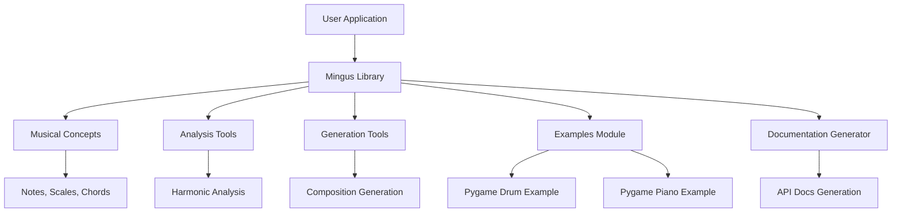

# `mingus`

## Repository Structure

```
mingus/
├── mingus/                 # Core music theory library (primary module)
├── mingus_examples/        # Example applications demonstrating mingus usage
│   ├── pygame-drum/        # Drum instrument simulation example
│   └── pygame-piano/       # Piano instrument simulation example
└── scripts/                # Documentation generation tools
    └── api_doc_generator.py # API documentation generator
```

## Purpose

The mingus repository is a Python-based music theory library that provides tools for working with musical concepts programmatically. It enables programmatic composition, analysis, and manipulation of musical elements such as notes, scales, chords, and progressions.

### Target Users and Scenarios

This repository serves developers who need to work with musical theory in their applications, including:
- Music software developers creating applications that require musical theory computations
- Educational institutions teaching music theory through programming
- Interactive music application builders
- Research projects investigating algorithmic composition or music analysis

### Position in Ecosystem

Mingus is a standalone music theory library that can be integrated into larger music applications. It provides foundational tools for developers working in music technology, offering core musical concepts without requiring external dependencies beyond standard Python libraries.

## Architecture



The architecture follows a modular design pattern where the core library provides fundamental musical concepts, while examples demonstrate practical usage patterns. The documentation generator supports maintaining comprehensive API documentation.

## Entry Points

### CLI Commands
- `python scripts/api_doc_generator.py` - Generates comprehensive API documentation for the mingus library
- Example applications can be run directly from their respective directories

### Importable APIs
- Primary module: `mingus` (core library)
- Submodules: `mingus.core`, `mingus.midi`, `mingus.containers` (likely)
- These provide access to musical concepts, MIDI functionality, and container classes

### Service Endpoints
None - This is primarily a library rather than a service-oriented system

## Core Features

1. **Musical Theory Foundation** - Core musical concepts like notes, scales, and chords
2. **Harmonic Analysis** - Tools for analyzing musical harmony and progressions  
3. **Composition Generation** - Algorithms for generating musical compositions
4. **MIDI Integration** - Support for MIDI file creation and manipulation
5. **Interactive Examples** - Demonstrations showing practical usage with pygame
6. **Automated Documentation** - Tools for generating comprehensive API documentation

## Dependencies

### Key External Dependencies
- **Python Standard Library**: Used for core functionality (os, sys, inspect, etc.)
- **pygame** (for examples): Required for GUI rendering and audio playback in example applications
- **Sphinx** (indirectly): Used by documentation generator for API documentation

### Compatibility Requirements
- Python 3.x (likely 3.6+)
- Standard library modules for introspection and file operations
- pygame 1.9+ (for running examples)

## Configuration

### Environment Variables
None - The library uses sensible defaults for most configurations

### Runtime Parameters
- Command-line arguments for documentation generator script
- Path specifications for example applications

## Extension Points

### Plugin System
The library supports extension through:
- Custom musical concept implementations
- Additional analysis modules
- New generation algorithms

### Hooks and Customization
- Extensible musical container classes
- Modular design allows replacement of core components
- Example applications demonstrate integration patterns

### Subclassing
Developers can extend core classes to add custom functionality:
- Note classes can be extended for custom note behaviors
- Scale classes can be subclassed for domain-specific scales
- Generator classes can be overridden for custom composition rules

---

## Modules

- [`mingus/containers`](mingus/containers.md)
- [`mingus/core`](mingus/core.md)
- [`mingus/extra`](mingus/extra.md)
- [`mingus/midi`](mingus/midi.md)
- [`mingus_examples`](mingus_examples.md)
- [`mingus_examples/pygame-drum`](mingus_examples/pygame-drum.md)
- [`mingus_examples/pygame-piano`](mingus_examples/pygame-piano.md)
- [`scripts`](scripts.md)

