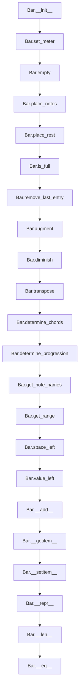

# `bar.py`

## `mingus.containers.bar.Bar` · *class*

## Summary
A musical bar container that manages notes and rests within a specific meter and key, supporting musical composition and analysis operations.

## Description
The Bar class represents a musical bar or measure with a specific key and meter. It serves as a container for musical elements (notes and rests) positioned in time according to the bar's meter specification. The class provides methods for placing musical elements, analyzing their harmonic content, and transforming musical properties like pitch and duration.

Bar instances are commonly created during musical composition workflows where musicians need to construct bars of music with specific rhythmic and tonal characteristics. The class integrates with other mingus components like keys, meter, and note containers to provide a complete musical notation system.

**Important Implementation Notes**: 
- The `__eq__` method contains a bug where it only compares elements from index 0 to len(self.bar) - 2, excluding the last element from comparison, which can lead to incorrect equality results
- The `place_notes_at` method has a bug where it attempts to access `x[0][2]` which will fail when `x[0]` is a float (the beat position) rather than a list structure
- The internal bar structure is a list of entries, each entry being [beat_position, duration, note_container] where beat_position is a float and note_container can be None for rests

## State
- key (keys.Key or str): The musical key of the bar, defaults to "C". When a string is provided, it's converted to a keys.Key object.
- meter (tuple): The time signature of the bar in the form (beats_per_measure, beat_unit), defaults to (4, 4).
- current_beat (float): The current position in the bar measured in beats, starts at 0.0.
- length (float): The total length of the bar in beats, calculated from meter as beats_per_measure * (1.0 / beat_unit).
- bar (list): Internal storage of musical entries, each entry is a list [beat_position, duration, note_container] where beat_position is a float, duration is a numeric value, and note_container is a NoteContainer object or None for rests.

## Lifecycle
- Creation: Instantiate with optional key and meter parameters. The constructor validates the key and meter, then calls empty() to initialize the bar.
- Usage: Place musical elements using methods like place_notes(), place_rest(), or the + operator. Analyze content with methods like determine_chords() or determine_progression().
- Destruction: Standard Python garbage collection handles cleanup.

## Method Map


## Raises
- MeterFormatError: Raised in set_meter() when the meter argument is not a valid representation of a meter, specifically when the beat unit is not a valid beat duration or when the meter tuple doesn't conform to expected format.

## Example
```python
# Create a bar with default settings
bar = Bar()

# Place notes in the bar
bar.place_notes("C4 E4 G4", 4)  # Place a C major triad for one beat
bar.place_rest(2)               # Place a half note rest

# Add notes using the + operator (uses bar's meter)
note_container = NoteContainer().from_chord_shorthand("Am")
bar + note_container  # Adds the Am chord using the bar's meter

# Analyze the bar
chords = bar.determine_chords()  # Get chord names
progressions = bar.determine_progression()  # Get harmonic progressions

# Transform the bar
bar.augment()  # Raise all notes by one semitone
bar.transpose("P5")  # Transpose all notes up a perfect fifth

# Check if bar is full
if bar.is_full():
    print("Bar is full")

# Get information about the bar
print(len(bar))  # Number of entries
print(bar.space_left())  # Remaining space in beats

# Access bar contents
for i in range(len(bar)):
    entry = bar[i]
    print(f"Beat {entry[0]}, Duration {entry[1]}, Notes: {entry[2]}")
```

### `mingus.containers.bar.Bar.__init__` · *method*

## Summary:
Initializes a Bar object with a musical key and meter, setting up the bar's musical context and clearing any existing content.

## Description:
The Bar.__init__ method constructs a new bar with the specified musical key and meter. It handles conversion of string key representations to proper Key objects and initializes the bar's musical properties. This method serves as the primary constructor for Bar objects, establishing the fundamental musical context and preparing the bar for note placement.

## Args:
    key (str or Key, optional): The musical key of the bar. Defaults to "C". If a string is provided, it will be converted to a keys.Key object.
    meter (tuple, optional): The meter of the bar in the form (beats_per_measure, beat_unit). Defaults to (4, 4).

## Returns:
    None: This method initializes the object and does not return a value.

## Raises:
    MeterFormatError: Raised when the meter argument is not a valid representation of a meter (i.e., not a tuple with valid beat duration).

## State Changes:
    Attributes READ: None
    Attributes WRITTEN: 
    - self.key: Set to the provided key (converted to Key object if string)
    - self.meter: Set by calling self.set_meter()
    - self.current_beat: Reset by calling self.empty()
    - self.length: Set by calling self.set_meter()
    - self.bar: Cleared by calling self.empty()

## Constraints:
    Preconditions:
    - The key parameter must be either a string representing a musical key or a keys.Key object
    - The meter parameter must be a tuple representing a valid meter format
    - The meter tuple's second element must represent a valid beat duration
    
    Postconditions:
    - self.key is properly initialized (converted to Key object if needed)
    - self.meter is properly set according to the provided meter
    - self.length is calculated based on the meter
    - self.current_beat is reset to 0.0
    - self.bar is emptied (reset to empty list)

## Side Effects:
    None: This method does not perform any I/O operations or mutate external objects. It only initializes the Bar object's internal state.

### `mingus.containers.bar.Bar.empty` · *method*

## Summary:
Resets the bar to an empty state by clearing all musical elements and resetting the beat position.

## Description:
Clears the internal bar storage and resets the current beat counter to zero. This method is typically used to initialize a new bar or reset an existing bar to its pristine state before adding new musical elements. The method is automatically called during Bar initialization and can also be invoked manually to clear existing content.

## Args:
    None

## Returns:
    list: An empty list representing the cleared bar storage.

## Raises:
    None

## State Changes:
    Attributes READ: None
    Attributes WRITTEN: 
        - self.bar: Set to an empty list []
        - self.current_beat: Set to 0.0

## Constraints:
    Preconditions: None
    Postconditions: 
        - self.bar is an empty list
        - self.current_beat is 0.0
        - The bar is ready to accept new musical elements

## Side Effects:
    None

### `mingus.containers.bar.Bar.set_meter` · *method*

## Summary:
Sets the meter and calculates the bar length based on the provided meter specification.

## Description:
Configures the bar's time signature by setting the meter tuple and computing the total bar length. This method is called during Bar initialization and can be used to dynamically change a bar's meter. The method validates that the beat duration is valid and computes the bar's total length as beats_per_measure divided by beat_unit.

## Args:
    meter (tuple): A tuple specifying the meter in the form (beats_per_measure, beat_unit). The beat_unit must be a valid beat duration according to the meter module.

## Returns:
    None: This method modifies the object's state in-place and does not return a value.

## Raises:
    MeterFormatError: Raised when the meter argument is not a valid representation of a meter. This occurs when:
        - The meter is not a tuple
        - The beat_unit is not a valid beat duration according to _meter.valid_beat_duration()
        - The meter tuple does not conform to expected format

## State Changes:
    Attributes READ: None
    Attributes WRITTEN: 
    - self.meter: Set to the provided meter tuple (meter[0], meter[1])
    - self.length: Calculated as meter[0] * (1.0 / meter[1]) when meter is valid

## Constraints:
    Preconditions:
    - The meter parameter must be a tuple
    - For valid meters, the second element (beat_unit) must be a valid beat duration
    - The first element (beats_per_measure) must be a numeric value
    
    Postconditions:
    - self.meter is set to the provided meter tuple
    - self.length is calculated as beats_per_measure divided by beat_unit
    - For special case (0, 0), both self.meter and self.length are set to (0, 0) and 0.0 respectively

## Side Effects:
    None: This method only modifies the internal state of the Bar object and performs no I/O or external operations.

### `mingus.containers.bar.Bar.place_notes` · *method*

## Summary:
Places musical notes into a bar at the current beat position, advancing the beat counter if space is available.

## Description:
The place_notes method adds musical notes to a bar's timeline at the current beat position. It normalizes various input formats for notes (objects with notes attribute, Note objects, string representations, or lists) into NoteContainer objects, then attempts to place them in the bar's timeline. The method respects the bar's time signature constraints by checking if there's sufficient space for the notes before placing them.

The placement logic evaluates whether the notes can fit within the bar's time constraints: either the bar has unlimited length (length == 0.0) OR the notes would fit within the existing bar length when added to the current beat position.

## Args:
    notes: Musical notes to be placed in the bar. Can be:
        - An object with a "notes" attribute (assumed to be a NoteContainer or similar)
        - A Note object with a "name" attribute
        - A string representation of notes (passed to NoteContainer constructor)
        - A list of notes (passed to NoteContainer constructor)
    duration (float): The duration of the notes being placed, used to calculate the next beat position

## Returns:
    bool: True if notes were successfully placed at the current beat position, False if there's insufficient space in the bar

## Raises:
    None explicitly raised by this method

## State Changes:
    Attributes READ: self.current_beat, self.length, self.bar
    Attributes WRITTEN: self.current_beat, self.bar

## Constraints:
    Preconditions:
        - self.current_beat must be a numeric value representing the current position in the bar
        - self.length must be a numeric value representing the total length of the bar (or 0.0 for unlimited)
        - self.bar must be a mutable sequence that supports append operations
        - duration must be a positive number (though not explicitly validated)
    Postconditions:
        - If successful, self.bar contains a new entry [current_beat, duration, notes] 
        - If successful, self.current_beat is incremented by 1.0/duration
        - If unsuccessful, neither self.bar nor self.current_beat is modified

## Side Effects:
    None

### `mingus.containers.bar.Bar.place_notes_at` · *method*

## Summary:
Attempts to add notes to an existing note container at a specified beat position in the bar.

## Description:
This method searches through the bar's note containers to find an entry at the specified beat position and attempts to add the provided notes to that entry. The method has a bug in its implementation where it tries to access `x[0][2]` which would fail if `x[0]` is a float (the beat position). This method is likely intended to modify existing note containers at specific positions.

## Args:
    notes: The notes to be added to an existing note container. Can be a Note object, string representation of a note, list of notes, or NoteContainer.
    at (float): The beat position where notes should be added. Must correspond to an existing note container's position.

## Returns:
    None: This method modifies the bar in-place and does not return a value.

## Raises:
    TypeError: When attempting to access `x[0][2]` where `x[0]` is a float, causing an indexing error.

## State Changes:
    Attributes READ: self.bar
    Attributes WRITTEN: self.bar (would modify note containers at matching positions if the bug were fixed)

## Constraints:
    Preconditions: 
    - The bar must contain at least one note container at the specified beat position
    - The notes parameter must be compatible with NoteContainer operations
    - The 'at' parameter must match an existing beat position in self.bar
    
    Postconditions:
    - If a matching beat position exists and the bug is fixed, the notes are added to the existing note container at that position
    - If no matching beat position exists, no changes are made to the bar
    - If the bug exists, a TypeError will be raised

## Side Effects:
    None: This method only modifies the internal state of the Bar object when successfully executed.

### `mingus.containers.bar.Bar.place_rest` · *method*

## Summary:
Places a rest of the specified duration at the current beat position in the bar.

## Description:
The place_rest method adds a rest to the bar at the current beat position. It serves as a convenience wrapper around place_notes that specifically handles rest placement by passing None as the notes parameter. This allows for clean, readable code when inserting rests into musical bars without having to explicitly pass None.

This method is typically called during the construction of musical bars when rests need to be inserted at specific positions in the timeline. It integrates seamlessly with the bar's timing system and respects the bar's meter constraints.

## Args:
    duration (float): The duration of the rest to be placed in the bar. This determines how much of the beat the rest occupies.

## Returns:
    bool: True if the rest was successfully placed at the current beat position, False if there's insufficient space in the bar for the rest.

## Raises:
    None

## State Changes:
    Attributes READ: self.current_beat, self.length, self.bar
    Attributes WRITTEN: self.current_beat, self.bar

## Constraints:
    Preconditions:
        - The bar must have a valid meter configuration
        - self.current_beat must be a numeric value representing the current position in the bar
        - self.length must be a numeric value representing the total length of the bar (or 0.0 for unlimited)
        - self.bar must be a mutable sequence that supports append operations
        - duration must be a positive number
    Postconditions:
        - If successful, self.bar contains a new entry [current_beat, duration, None] 
        - If successful, self.current_beat is incremented by 1.0/duration
        - If unsuccessful, neither self.bar nor self.current_beat is modified

## Side Effects:
    None

### `mingus.containers.bar.Bar.remove_last_entry` · *method*

## Summary:
Removes the last musical entry from the bar and adjusts the current beat position accordingly.

## Description:
This method removes the most recently added musical entry from the bar's internal list of entries and updates the current beat position by subtracting the duration of the removed entry. This is useful for undoing the last placement operation or correcting musical notation construction.

## Args:
    None

## Returns:
    float: The updated current beat position after removing the last entry.

## Raises:
    IndexError: When attempting to remove an entry from an empty bar.

## State Changes:
    Attributes READ: self.bar, self.current_beat
    Attributes WRITTEN: self.bar, self.current_beat

## Constraints:
    Preconditions: The bar must contain at least one entry (self.bar must not be empty)
    Postconditions: The bar will contain one fewer entry, and self.current_beat will be reduced by 1.0 / self.bar[-1][1]

## Side Effects:
    None

### `mingus.containers.bar.Bar.is_full` · *method*

## Summary:
Determines whether the bar has reached its maximum capacity based on beat positioning.

## Description:
Checks if the current beat position has reached or exceeded the bar's maximum length, accounting for floating-point precision errors. This method is used to determine if more musical elements can be added to the bar.

## Args:
    None

## Returns:
    bool: True if the bar is considered full (current beat >= length - 0.001), False otherwise.

## Raises:
    None

## State Changes:
    Attributes READ: self.length, self.bar, self.current_beat
    Attributes WRITTEN: None

## Constraints:
    Preconditions: The Bar instance must be properly initialized with valid meter and length values.
    Postconditions: Returns a boolean indicating whether the bar has reached its capacity limit.

## Side Effects:
    None

### `mingus.containers.bar.Bar.change_note_duration` · *method*

## Summary:
Changes the duration of a note at a specified position within the bar, adjusting subsequent note positions accordingly.

## Description:
Modifies the duration of a note located at a specific position in the bar structure. When a note's duration is changed, the method adjusts the positioning of all subsequent notes to maintain proper musical timing. This method is typically called during musical composition or editing operations when note durations need to be modified dynamically.

The method assumes that each entry in `self.bar` has a structure where the first element (`x[0]`) contains positional information that can be treated as a list with at least two elements: position and duration. However, there may be inconsistencies in the bar structure handling throughout the codebase.

## Args:
    at (float): The position in the bar where the note duration should be changed
    to (float): The new duration value to apply to the note at position `at`

## Returns:
    None: This method modifies the object in-place and does not return a value

## Raises:
    None explicitly raised: The method relies on `_meter.valid_beat_duration(to)` for validation but doesn't explicitly raise exceptions

## State Changes:
    Attributes READ: self.bar, self.meter
    Attributes WRITTEN: self.bar (modifies note duration and potentially position values of subsequent notes)

## Constraints:
    Preconditions:
        - The position `at` must exist in the bar structure
        - The new duration `to` must be a valid beat duration according to the meter module
        - The bar must contain at least one note entry
        - The bar structure must have entries where `x[0]` can be treated as a list with at least two elements
    Postconditions:
        - The note at position `at` will have its duration updated to `to`
        - Subsequent notes in the bar will have their positions adjusted to maintain proper timing
        - The total bar length remains consistent with the meter constraints

## Side Effects:
    None: This method only modifies the internal state of the Bar object

### `mingus.containers.bar.Bar.get_range` · *method*

## Summary:
Returns the range of MIDI note values contained within the bar by finding the minimum and maximum notes across all note containers.

## Description:
This method analyzes all notes stored in the bar's note containers and determines the lowest and highest MIDI note numbers present. It iterates through each note container in the bar and examines every note within those containers to compute the complete range of pitches. The method returns a tuple containing the note with the lowest MIDI value and the note with the highest MIDI value.

## Args:
    None

## Returns:
    tuple[Note, Note]: A tuple containing two Note objects where the first is the note with the lowest MIDI value and the second is the note with the highest MIDI value. If the bar contains no notes, it returns (100000, -1) which represents an invalid range.

## Raises:
    None

## State Changes:
    Attributes READ: 
    - self.bar: The list of note containers stored in the bar
    - Each note container's notes: Iterated through to find min/max values
    
    Attributes WRITTEN: 
    - None

## Constraints:
    Preconditions:
    - The bar must be initialized and contain valid note containers
    - Each note container must contain valid Note objects that can be converted to integers
    
    Postconditions:
    - Returns a tuple of Note objects representing the pitch range
    - If no notes exist, returns (100000, -1) as a sentinel value indicating empty range

## Side Effects:
    None

### `mingus.containers.bar.Bar.space_left` · *method*

## Summary:
Calculates the remaining space in the bar in beats.

## Description:
Returns the difference between the bar's total length and the current beat position, indicating how much more space is available in the bar. This method is used internally by the Bar class to determine if there is sufficient space to add new musical elements.

## Args:
    None

## Returns:
    float: The remaining space in the bar measured in beats. Returns a negative value if the bar has exceeded its length (though this should not normally occur due to validation in other methods).

## Raises:
    None

## State Changes:
    Attributes READ: self.length, self.current_beat
    Attributes WRITTEN: None

## Constraints:
    Preconditions: The Bar instance must be properly initialized with valid meter and length values.
    Postconditions: The returned value represents the mathematical difference between length and current_beat, with no modification to the object's state.

## Side Effects:
    None

### `mingus.containers.bar.Bar.value_left` · *method*

## Summary:
Returns the reciprocal of the remaining space in the bar, providing a normalized measure of available space.

## Description:
This method calculates the inverse of the space remaining in the bar by taking the reciprocal of `self.space_left()`. It provides a normalized representation of how much of the bar's capacity remains, where a higher value indicates more space available. This method is typically used for calculating proportional values or determining if a bar has sufficient space for additional musical elements.

## Args:
    None

## Returns:
    float: The reciprocal of the remaining space in the bar. Returns positive infinity when no space is left (when space_left() returns 0.0), and a large positive number when very little space remains.

## Raises:
    None

## State Changes:
    Attributes READ: self.length, self.current_beat (through space_left())
    Attributes WRITTEN: None

## Constraints:
    Preconditions: The Bar instance must be properly initialized with valid meter and length values.
    Postconditions: The returned value is mathematically equivalent to 1.0 / (self.length - self.current_beat), with no modification to the object's state.

## Side Effects:
    None

### `mingus.containers.bar.Bar.augment` · *method*

## Summary:
Applies the augmentation operation to all note containers within the bar, raising the pitch of each note by one semitone.

## Description:
The augment method processes each musical entry in the bar by calling the augment() method on the associated note container. This operation raises the pitch of all notes in each container by one semitone, effectively converting flats to sharps or adding sharps to natural notes. The method operates on the internal structure of the bar where each entry consists of [beat_position, duration, note_container].

This method is part of the musical transformation suite alongside diminish() and transpose(), providing consistent interface for manipulating note collections within a bar.

## Args:
    None

## Returns:
    None

## Raises:
    AttributeError: If any note_container in self.bar does not have an augment() method
    TypeError: If self.bar contains entries that don't follow the [beat_position, duration, note_container] structure

## State Changes:
    Attributes READ: self.bar
    Attributes WRITTEN: Each note_container's notes are modified through the note_container.augment() method calls

## Constraints:
    Preconditions:
        - self.bar must be a list of lists with each inner list having at least 3 elements
        - Each note_container (cont[2]) must support the augment() method call
        - Note containers must contain valid Note objects that support the augment() operation
    Postconditions:
        - All notes in each note_container within the bar will be augmented by one semitone
        - The bar structure and timing information remain unchanged

## Side Effects:
    None

### `mingus.containers.bar.Bar.diminish` · *method*

## Summary:
Reduces the pitch of all notes in the bar by one semitone each.

## Description:
Applies the diminishing operation to all note containers within the bar, lowering each note's pitch by one semitone. This method systematically processes each musical entry in the bar and flattens all notes contained within them.

## Args:
    None

## Returns:
    None

## Raises:
    None

## State Changes:
    Attributes READ: self.bar
    Attributes WRITTEN: Each note's name attribute in the note containers stored in self.bar is modified through calls to note_container.diminish()

## Constraints:
    Preconditions:
        - The bar must contain valid note containers at index 2 of each entry
        - Each note container must support the diminish() method call
    Postconditions:
        - All notes in all containers within the bar will have their pitch lowered by one semitone
        - The structure and timing of entries in the bar remain unchanged

## Side Effects:
    None

### `mingus.containers.bar.Bar.transpose` · *method*

## Summary:
Transposes all notes in the bar by the specified interval, modifying the pitch of each note in-place.

## Description:
Applies pitch transposition to all musical notes contained within the bar's note containers. This method operates on each note container stored in the bar's internal structure, calling the transpose operation on each container to shift all contained notes by the specified musical interval.

The method is typically called during musical composition or arrangement workflows when pitch modification is needed across an entire bar of music. It enables transposition operations that maintain proper musical relationships between notes while updating their pitch classes.

## Args:
    interval (str): The musical interval by which to transpose (e.g., 'm3', 'P5', 'M2'). Must be a valid interval specification recognized by the underlying Note.transpose method.
    up (bool): Direction of transposition. True for upward transposition, False for downward. Defaults to True.

## Returns:
    None: This method modifies the bar's note containers in-place and does not return a value.

## Raises:
    None explicitly raised by this method. Exceptions may occur if the underlying NoteContainer or Note.transpose methods encounter invalid inputs.

## State Changes:
    Attributes READ: self.bar
    Attributes WRITTEN: Each note_container's internal note list (modified in-place through NoteContainer.transpose)

## Constraints:
    Preconditions: The bar must contain valid note containers in its internal structure, with each container having a valid transpose method
    Postconditions: All notes within the bar's containers have been transposed by the specified interval in the specified direction

## Side Effects:
    None

### `mingus.containers.bar.Bar.determine_chords` · *method*

## Summary:
Determines chord names for all note containers in the bar at their respective beat positions.

## Description:
Processes each note container in the bar and identifies the chord name(s) for each collection of notes. This method is used to analyze musical content within a bar and extract chord information for further processing or display.

The method iterates through all entries in `self.bar`, which contains note containers grouped by beat position and duration. For each note container, it calls the container's `determine()` method to identify chord names, returning both the beat position and the determined chord information.

## Args:
    shorthand (bool): When True, returns abbreviated chord names (e.g., "Cm"). When False, returns full descriptive names with inversion information (e.g., "C, first inversion"). Defaults to False.

## Returns:
    list: A list of lists, where each inner list contains [beat_position, chord_determination_result]. The chord_determination_result is a list of chord name representations returned by the NoteContainer.determine() method.

## Raises:
    None: This method does not explicitly raise exceptions, though underlying methods may raise exceptions from the chord determination process.

## State Changes:
    Attributes READ: self.bar
    Attributes WRITTEN: None

## Constraints:
    Preconditions: The bar must contain valid note containers in the format [beat_position, duration, note_container].
    Postconditions: Returns a list of chord determinations for all note containers in the bar.

## Side Effects:
    None: This method has no side effects beyond accessing the bar's contents.

### `mingus.containers.bar.Bar.determine_progression` · *method*

## Summary:
Determines the musical progression for each note container in the bar relative to the bar's key.

## Description:
Processes each note container stored in the bar's internal structure to identify the harmonic progression (tonic, supertonic, etc.) represented by the notes at each beat position. This method is used to analyze the harmonic content of musical phrases by mapping note combinations to standard musical progressions.

The method is typically called during musical analysis phases when converting note sequences into harmonic interpretations. It's part of the Bar class's analytical toolkit for understanding musical structure.

## Args:
    shorthand (bool): When True, returns abbreviated progression labels (e.g., "I", "iv"). When False, returns full descriptive labels (e.g., "tonic", "subdominant"). Defaults to False.

## Returns:
    list[list]: A list of lists where each inner list contains [beat_position, progression_label]. The beat_position is a float representing the timing of the notes in the bar (e.g., 0.0, 0.5, 1.0), and progression_label is a string indicating the harmonic function of those notes (e.g., "tonic", "subdominant", "I", "iv").

## Raises:
    None explicitly raised by this method, though underlying functions may raise exceptions from the progressions module.

## State Changes:
    Attributes READ: self.bar, self.key.key
    Attributes WRITTEN: None

## Constraints:
    Preconditions: 
    - The Bar object must have a valid key assigned (self.key.key must be accessible)
    - The bar must contain note containers in the expected format ([beat_position, duration, note_container])
    - Each note container must have a valid get_note_names() method that returns a list of note names
    
    Postconditions:
    - The returned list maintains the same order as the original bar entries
    - Each progression label accurately reflects the harmonic function of the notes at that beat position

## Side Effects:
    None: This method performs no I/O operations or external service calls. It only processes internal data structures.

### `mingus.containers.bar.Bar.get_note_names` · *method*

## Summary:
Retrieves a list of unique note names from all note containers within the bar, preserving the order of first appearance.

## Description:
This method aggregates note names from all musical entries in the bar's internal container structure. It processes each entry in the bar, extracts note names from the associated NoteContainer objects, and returns a deduplicated list while maintaining the order of first occurrence. This is useful for analyzing the complete set of notes present in a musical bar without duplicates.

The method is designed to be separate from other bar processing methods to provide a clean interface for retrieving all unique notes in the bar's musical content, making it suitable for chord analysis, musical transcription, or general musical content inspection.

## Args:
    None

## Returns:
    list[str]: A list of unique note name strings in the order of their first appearance across all note containers in the bar. Returns an empty list if the bar contains no notes.

## Raises:
    None

## State Changes:
    Attributes READ: self.bar
    Attributes WRITTEN: None

## Constraints:
    Preconditions: The bar must contain valid note containers with properly initialized note objects.
    Postconditions: The returned list contains only unique note names, with duplicates removed while preserving order.

## Side Effects:
    None: This method has no side effects and does not modify the bar's state.

### `mingus.containers.bar.Bar.__add__` · *method*

## Summary:
Places a note container in the bar at the appropriate beat position according to the bar's meter specification.

## Description:
This special method enables the use of the `+` operator to add note containers to a Bar instance. It determines the placement position based on the bar's meter configuration, allowing for proper musical timing and rhythm construction. The method delegates to `place_notes` with either the meter's beat duration or a default value of 4.

## Args:
    note_container: A note container object that can be processed by the `place_notes` method, typically containing musical notes or rests

## Returns:
    bool: True if the note container was successfully placed within the bar's capacity, False otherwise

## Raises:
    None explicitly raised, though underlying `place_notes` method may raise exceptions

## State Changes:
    Attributes READ: self.meter, self.length, self.current_beat, self.bar
    Attributes WRITTEN: self.bar, self.current_beat (through calls to place_notes)

## Constraints:
    Preconditions: The bar object must be properly initialized with a valid meter configuration
    Postconditions: If successful, the note container is added to the bar's internal representation and current beat position is updated

## Side Effects:
    Mutates the bar's internal state by adding entries to self.bar and updating self.current_beat

### `mingus.containers.bar.Bar.__getitem__` · *method*

*No documentation generated.*

### `mingus.containers.bar.Bar.__setitem__` · *method*

## Summary:
Sets a note container at a specific position in the bar, converting various input types to NoteContainer format.

## Description:
This method implements the `__setitem__` magic method for the Bar class, allowing assignment of note containers to specific positions in the bar using bracket notation. It processes different input types (objects with "notes" attribute, objects with "name" attribute, string representations, and lists) and converts them to NoteContainer instances before storing them in the bar structure.

## Args:
    index (int): The position in the bar where the note container should be set
    value: The value to assign, which can be one of:
        - An object with a "notes" attribute (passed through unchanged)
        - An object with a "name" attribute (converted to NoteContainer)
        - A string representation (converted to NoteContainer)
        - A list of note representations (converted to NoteContainer)

## Returns:
    None: This method modifies the object in-place and does not return a value

## Raises:
    IndexError: When the index is out of bounds for the bar list, causing failure when accessing self.bar[index]

## State Changes:
    Attributes READ: self.bar
    Attributes WRITTEN: self.bar[index][2] (modifies the note container portion of a bar entry)

## Constraints:
    Preconditions:
        - The index must be a valid integer within the bounds of the bar list
        - The bar entry at the specified index must exist (not None)
    Postconditions:
        - The note container at position `index` in `self.bar` is replaced with a NoteContainer instance
        - The beat position and duration remain unchanged

## Side Effects:
    None: This method only modifies the internal state of the Bar object

### `mingus.containers.bar.Bar.__repr__` · *method*

## Summary:
Returns a string representation of the bar's internal note container list for debugging and development purposes.

## Description:
This method provides a string representation of the Bar object's internal storage structure, which contains musical note information. It is automatically called by Python's built-in repr() function and when the object is displayed in interactive environments. The method serves as a debugging aid to visualize the internal state of the bar, showing all musical notes and their timing information as [beat_position, duration, NoteContainer].

## Args:
    None

## Returns:
    str: A string representation of the internal bar list structure containing musical note information.

## Raises:
    None

## State Changes:
    Attributes READ: self.bar
    Attributes WRITTEN: None

## Constraints:
    Preconditions: The Bar object must be initialized and self.bar must be a valid list structure.
    Postconditions: The returned string representation accurately reflects the current state of self.bar.

## Side Effects:
    None

### `mingus.containers.bar.Bar.__len__` · *method*

## Summary:
Returns the number of musical entries currently stored in the bar.

## Description:
This method implements Python's magic `__len__` protocol, allowing instances of the Bar class to be used with the built-in `len()` function. It returns the count of musical entries (notes, rests, etc.) that have been placed in the bar using methods like `place_notes()` or `place_rest()`. The method provides a convenient way to determine how many musical elements are currently contained within the bar.

## Args:
    None

## Returns:
    int: The number of entries currently stored in the bar's internal list.

## Raises:
    None

## State Changes:
    Attributes READ: self.bar
    Attributes WRITTEN: None

## Constraints:
    Preconditions: The Bar instance must be properly initialized with a valid bar list.
    Postconditions: The method does not modify the Bar instance's state.

## Side Effects:
    None

### `mingus.containers.bar.Bar.__eq__` · *method*

## Summary:
Compares two Bar objects for equality by checking if their note containers match up to the second-to-last element, with significant implementation flaws.

## Description:
This method attempts to implement equality comparison between two Bar instances by comparing their internal note container arrays element by element. However, due to a critical implementation bug, it only compares elements from index 0 to len(self.bar) - 2 (inclusive), thereby excluding the last element from comparison. This creates incorrect equality results when the last elements differ.

## Args:
    other (object): Another object to compare with this Bar instance

## Returns:
    bool: True if all compared elements match, False otherwise. Note: This returns True even when bars have different lengths or when the last element differs.

## Raises:
    AttributeError: If other does not have a bar attribute
    IndexError: If other.bar has fewer elements than self.bar

## State Changes:
    Attributes READ: self.bar, other.bar
    Attributes WRITTEN: None

## Constraints:
    Preconditions: 
    - self.bar must be a list-like object
    - other must have a bar attribute that is list-like
    - Both bars should ideally have the same length for meaningful comparison
    
    Postconditions:
    - Returns boolean indicating equality of elements 0 to len(self.bar)-2
    - Does not modify either bar's state

## Side Effects:
    None

## Implementation Details:
    - Iterates from index 0 to len(self.bar) - 2 inclusive
    - Compares self.bar[b] with other.bar[b] for each b in the range
    - Returns True if all comparisons pass, regardless of array lengths
    - Does not validate that other is a Bar instance
    - Does not compare the last element of the arrays

