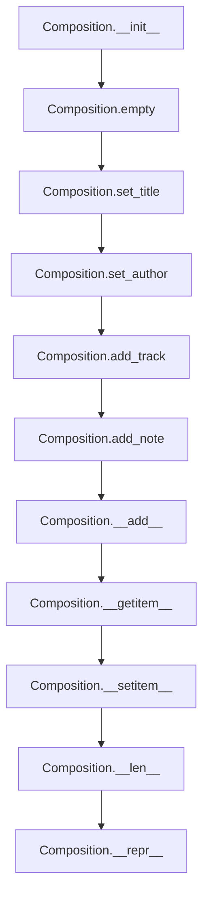

# `composition.py`

## `mingus.containers.composition.Composition` · *class*

## Summary:
Represents a musical composition containing multiple tracks and metadata such as title, author, and description.

## Description:
The Composition class serves as a container for organizing musical tracks within a composition. It maintains metadata like title, author, and description, while managing a collection of Track objects. This class provides methods for adding tracks and notes, setting composition metadata, and accessing tracks by index. It acts as the central hub for building and manipulating musical compositions in the mingus framework.

## State:
- title (str): The main title of the composition, defaults to "Untitled"
- subtitle (str): The subtitle of the composition, defaults to empty string
- author (str): The author of the composition, defaults to empty string
- email (str): The author's email address, defaults to empty string
- description (str): A description of the composition, defaults to empty string
- tracks (list): List of Track objects contained in the composition, defaults to empty list
- selected_tracks (list): Indices of currently selected tracks for note addition, defaults to empty list

The __init__ method initializes the composition by calling empty(), which sets tracks to an empty list. The selected_tracks is automatically updated when tracks are added via add_track().

Class invariants:
- tracks is always a list of Track objects (validated in add_track)
- selected_tracks contains valid indices for tracks list
- title and subtitle are always strings

## Lifecycle:
Creation: Instantiate with Composition() to create an empty composition with default metadata.
Usage: Add tracks using add_track() or the + operator, select tracks for note addition, modify metadata with set_title() and set_author().
Destruction: No explicit cleanup required; Python's garbage collector handles memory management.

## Method Map:


## Raises:
- UnexpectedObjectError: Raised in add_track() when attempting to add an object that doesn't have a "bars" attribute, indicating it's not a valid Track object.

## Example:
```python
# Create a new composition
comp = Composition()

# Set composition metadata
comp.set_title("My Masterpiece", "A beautiful symphony")
comp.set_author("John Doe", "john@example.com")

# Add tracks (assuming Track objects exist)
from mingus.containers import Track
track1 = Track()
comp.add_track(track1)

# Add notes to selected tracks using + operator
from mingus.containers import Note
note = Note("C", 4)
comp + note  # Adds note to last added track

# Access tracks
first_track = comp[0]
print(len(comp))  # Shows number of tracks
```

### `mingus.containers.composition.Composition.__init__` · *method*

## Summary:
Initializes a new musical composition with empty tracks and default metadata.

## Description:
The Composition.__init__ method sets up a new musical composition instance by resetting its internal state. It calls the empty() method to initialize the tracks list to an empty list and sets default values for metadata fields such as title, subtitle, author, and email. This method ensures that every new Composition object starts with a clean slate containing no tracks but with proper default metadata.

## Args:
    None

## Returns:
    None

## Raises:
    None

## State Changes:
    Attributes READ: None
    Attributes WRITTEN: 
    - self.tracks: Set to an empty list
    - self.title: Set to "Untitled" (default class attribute)
    - self.subtitle: Set to "" (default class attribute)
    - self.author: Set to "" (default class attribute)
    - self.email: Set to "" (default class attribute)
    - self.description: Set to "" (default class attribute)
    - self.selected_tracks: Set to [] (default class attribute)

## Constraints:
    Preconditions: None
    Postconditions: 
    - The Composition instance has an empty tracks list
    - All metadata fields have their default values
    - The selected_tracks list is initialized as empty

## Side Effects:
    None

### `mingus.containers.composition.Composition.empty` · *method*

## Summary:
Clears all tracks from the composition, resetting it to an empty state.

## Description:
This method removes all tracks from the composition by setting the tracks attribute to an empty list. It provides a clean way to reset a composition to its initial state without creating a new instance.

## Args:
    self: The Composition instance whose tracks will be cleared.

## Returns:
    None: This method does not return any value.

## Raises:
    None: This method does not raise any exceptions.

## State Changes:
    Attributes READ: None
    Attributes WRITTEN: self.tracks

## Constraints:
    Preconditions: The Composition instance must exist and have a tracks attribute.
    Postconditions: The tracks attribute will be an empty list.

## Side Effects:
    None: This method only modifies the internal state of the Composition instance.

### `mingus.containers.composition.Composition.reset` · *method*

## Summary:
Resets the composition to its initial state by clearing all tracks and restoring default title and author information.

## Description:
This method provides a convenient way to reset a composition to its pristine state. It clears all tracks, sets the title back to "Untitled" with an empty subtitle, and resets author information to empty strings. This method is typically used when starting a new composition or when wanting to clear all existing content while preserving the object instance.

## Args:
    self: The Composition instance to reset.

## Returns:
    None: This method does not return any value.

## Raises:
    None: This method does not raise any exceptions.

## State Changes:
    Attributes READ: None
    Attributes WRITTEN: self.tracks, self.title, self.subtitle, self.author, self.email

## Constraints:
    Preconditions: The Composition instance must exist and have the required attributes (tracks, title, subtitle, author, email).
    Postconditions: The composition will have an empty tracks list, title set to "Untitled", subtitle set to "", author set to "", and email set to "".

## Side Effects:
    None: This method only modifies the internal state of the Composition instance.

### `mingus.containers.composition.Composition.add_track` · *method*

## Summary:
Adds a track to the composition and selects it as the currently active track.

## Description:
This method appends a track to the composition's track collection and automatically selects it as the sole selected track. It validates that the provided object is a proper Track instance by checking for the required "bars" attribute.

## Args:
    track: A track object that must have a "bars" attribute. This should be an instance of mingus.containers.Track.

## Returns:
    None: This method does not return any value.

## Raises:
    UnexpectedObjectError: Raised when the provided track object does not have a "bars" attribute, indicating it is not a valid Track instance.

## State Changes:
    Attributes READ: self.tracks, self.selected_tracks
    Attributes WRITTEN: self.tracks, self.selected_tracks

## Constraints:
    Preconditions: The track parameter must be an object with a "bars" attribute.
    Postconditions: The track is appended to self.tracks and self.selected_tracks contains the index of the newly added track.

## Side Effects:
    None: This method only modifies internal state attributes and does not perform I/O or external service calls.

### `mingus.containers.composition.Composition.add_note` · *method*

## Summary:
Adds a note to all selected tracks in the composition.

## Description:
This method appends a note to each track identified in the composition's selected_tracks list. It is typically invoked through the composition's `+` operator when adding note-like objects to a composition. The method operates on the currently selected tracks, allowing for targeted note addition without affecting all tracks in the composition.

## Args:
    note: A note-like object that supports the `+` operator with track objects. This is typically a musical note representation that can be added to a track's bar structure.

## Returns:
    None

## Raises:
    None explicitly raised, but may propagate exceptions from the underlying track addition operation when attempting to add the note to individual tracks.

## State Changes:
    Attributes READ: self.selected_tracks, self.tracks
    Attributes WRITTEN: self.tracks (modifies track objects by adding notes through the `+` operator)

## Constraints:
    Preconditions: The composition must have tracks in the selected_tracks list, and each track in selected_tracks must support the `+` operator with note objects. The note parameter must be compatible with the track's addition interface.
    Postconditions: Notes are added to all tracks listed in selected_tracks, potentially modifying the bar structure of those tracks.

## Side Effects:
    Mutates track objects in self.tracks by adding notes to them through the track's `+` operator implementation. No external I/O or service calls occur.

### `mingus.containers.composition.Composition.set_title` · *method*

## Summary:
Sets the title and subtitle metadata for the musical composition.

## Description:
Configures the title and subtitle attributes of a Composition object. This method allows users to assign meaningful names to compositions and optionally provide descriptive subtitles. The method is typically called during composition initialization or reset operations to establish default or custom metadata.

## Args:
    title (str): The main title of the composition. Defaults to "Untitled".
    subtitle (str): An optional subtitle for the composition. Defaults to "".

## Returns:
    None: This method does not return any value.

## Raises:
    None: This method does not raise any exceptions.

## State Changes:
    Attributes READ: None
    Attributes WRITTEN: 
    - self.title: Set to the provided title parameter
    - self.subtitle: Set to the provided subtitle parameter

## Constraints:
    Preconditions: The Composition instance must exist and be properly initialized.
    Postconditions: The title and subtitle attributes of the composition are updated to the provided values.

## Side Effects:
    None: This method only modifies the internal state of the Composition instance.

### `mingus.containers.composition.Composition.set_author` · *method*

## Summary:
Sets the author and email information for the musical composition.

## Description:
Configures the author metadata for a musical composition by setting both the author name and email address. This method allows users to associate attribution information with a composition, which can be useful for copyright purposes or tracking contributions. The method is typically called during composition initialization or reset operations to establish default author information.

## Args:
    self: The Composition instance being modified.
    author (str): The name of the composition's author. Defaults to an empty string.
    email (str): The email address of the composition's author. Defaults to an empty string.

## Returns:
    None: This method does not return any value.

## Raises:
    None: This method does not raise any exceptions.

## State Changes:
    Attributes READ: None
    Attributes WRITTEN: 
    - self.author: Set to the provided author value
    - self.email: Set to the provided email value

## Constraints:
    Preconditions: The Composition instance must exist and have the author and email attributes defined.
    Postconditions: The author and email attributes of the composition will be updated to the provided values.

## Side Effects:
    None: This method only modifies the internal state of the Composition instance.

### `mingus.containers.composition.Composition.__add__` · *method*

## Summary:
Adds a track or note to the composition using the `+` operator.

## Description:
This special method enables the use of the `+` operator with Composition objects. When adding an object to a composition, it determines whether the object is a track (by checking for a "bars" attribute) or a note, then delegates to the appropriate method. This method provides a clean interface for building compositions incrementally.

## Args:
    value: Either a Track object (with "bars" attribute) or a note-like object that can be added to selected tracks.

## Returns:
    The result of either `add_track(value)` or `add_note(value)` depending on the type of value provided.

## Raises:
    UnexpectedObjectError: When attempting to add a track that doesn't have a "bars" attribute to a composition.

## State Changes:
    Attributes READ: None (reads no self attributes directly)
    Attributes WRITTEN: Modifies self.tracks and self.selected_tracks through calls to add_track or add_note

## Constraints:
    Preconditions: The value parameter must be either a Track object with a "bars" attribute or a note-like object that can be processed by add_note.
    Postconditions: The composition's tracks list is updated with the new track or notes are added to selected tracks.

## Side Effects:
    None

### `mingus.containers.composition.Composition.__getitem__` · *method*

*No documentation generated.*

### `mingus.containers.composition.Composition.__setitem__` · *method*

## Summary:
Sets a track at the specified index position in the composition's track list.

## Description:
This method enables assignment to tracks in the composition using bracket notation (e.g., `composition[index] = track`). It directly modifies the internal `tracks` list by assigning the provided value at the specified index position. This is a magic method that supports Python's item assignment syntax.

## Args:
    index (int): The zero-based index position where the track should be placed
    value: The track object to assign at the specified index position

## Returns:
    None: This method does not return a value

## Raises:
    IndexError: When the index is out of bounds for the tracks list (when trying to assign to a non-existent position)

## State Changes:
    Attributes READ: self.tracks
    Attributes WRITTEN: self.tracks

## Constraints:
    Preconditions: 
    - The index must be a valid integer within the bounds of the tracks list for existing positions
    - The value should be a valid track object (no explicit validation is performed)
    
    Postconditions:
    - The track at the specified index is replaced with the provided value
    - The tracks list maintains its structure and length

## Side Effects:
    None: This method only modifies the internal state of the Composition object

### `mingus.containers.composition.Composition.__len__` · *method*

## Summary:
Returns the number of tracks contained in the composition.

## Description:
This method implements the Python special method `__len__` to allow the use of the built-in `len()` function on Composition objects. It provides a convenient way to determine how many tracks are currently in the composition by returning the length of the internal tracks list.

The method is called during various lifecycle stages when the composition needs to be queried for its size, such as:
- When iterating over tracks in a loop
- When checking composition size before adding new tracks
- During serialization or display operations that need to know the composition's extent

This logic is encapsulated in its own method rather than being inlined because it follows Python's protocol for implementing length queries and allows for consistent behavior with other Python containers.

## Returns:
    int: The number of tracks in the composition's tracks list.

## State Changes:
    Attributes READ: self.tracks
    Attributes WRITTEN: None

## Constraints:
    Preconditions: The composition object must have a tracks attribute that supports the `len()` function (i.e., it should be a list or similar sequence type).
    Postconditions: The method returns an integer representing the count of tracks without modifying the composition's state.

## Side Effects:
    None

### `mingus.containers.composition.Composition.__repr__` · *method*

## Summary:
Returns a string representation of the composition by concatenating all track representations.

## Description:
This special method provides a string representation of the Composition object by iterating through all tracks and concatenating their string representations. It is automatically called when using `repr()` on a Composition instance or when the object is printed in interactive environments.

This method serves as the primary means of displaying a composition's contents as a string, making it easier to debug and inspect composition objects. The method is implemented as its own separate function rather than being inlined because it follows Python's standard `__repr__` protocol and allows for consistent behavior with other Python container objects.

## Returns:
    str: A concatenated string containing the string representations of all tracks in the composition. Returns an empty string if the composition contains no tracks.

## State Changes:
    Attributes READ: self.tracks
    Attributes WRITTEN: None

## Constraints:
    Preconditions: The composition object must have a tracks attribute that is iterable.
    Postconditions: The method returns a string representation without modifying the composition's state.

## Side Effects:
    None

