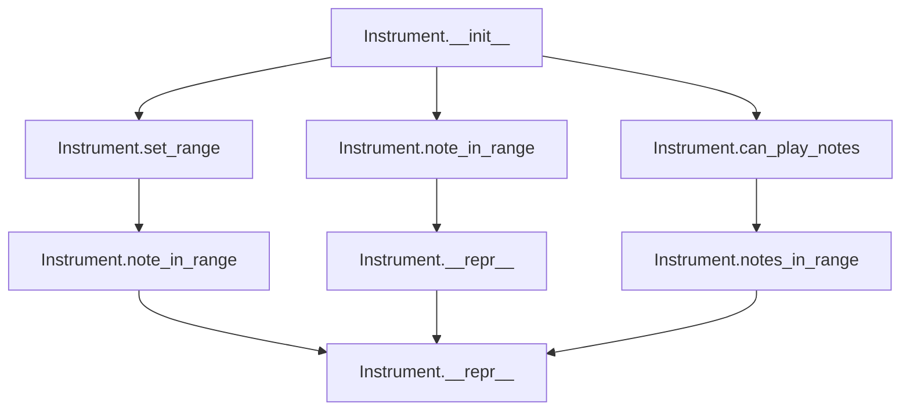
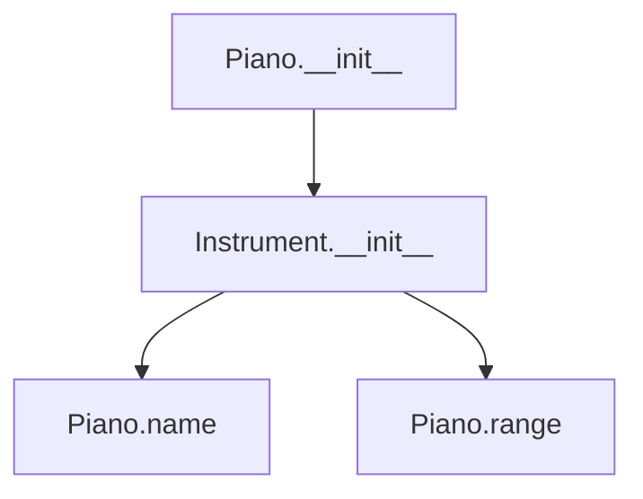
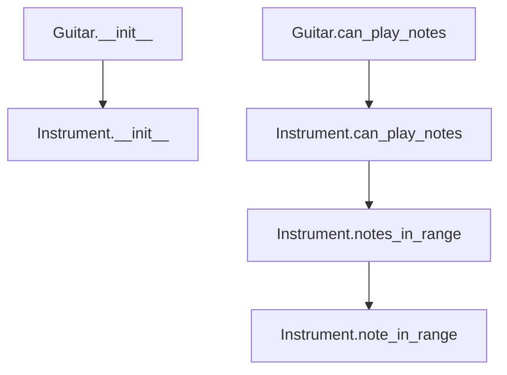
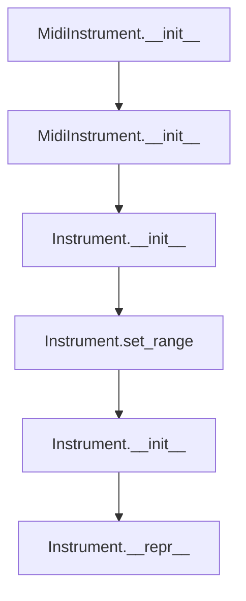

# `instrument.py`

## `mingus.containers.instrument.Instrument` · *class*

## Summary:
Base class representing a musical instrument with configurable range and note validation capabilities.

## Description:
The Instrument class serves as a foundation for musical instrument representations, providing core functionality for defining instrument ranges, validating notes against those ranges, and determining whether specific notes or collections of notes can be played by the instrument. It is designed to be subclassed by specific instrument types (like Piano, Guitar, etc.) that would override the default properties and potentially add instrument-specific behavior.

This class enforces a clear boundary between instrument definition and note validation logic, making it easy to create different instrument types while maintaining consistent interfaces for range checking and note validation.

## State:
- name (str): The name of the instrument, defaults to "Instrument"
- range (tuple): A tuple containing two Note objects defining the minimum and maximum playable notes, defaults to (Note("C", 0), Note("C", 8))
- clef (str): The musical clef associated with the instrument, defaults to "bass and treble"
- tuning (StringTuning or None): Optional tuning information for stringed instruments, defaults to None

## Lifecycle:
- Creation: Instantiate directly or via subclass constructors. No required arguments for basic instantiation.
- Usage: Typically used by calling methods like note_in_range() or can_play_notes() to validate musical notes against the instrument's capabilities.
- Destruction: No special cleanup required; standard Python garbage collection applies.

## Method Map:


## Raises:
- UnexpectedObjectError: Raised by set_range() and note_in_range() when invalid objects (non-Note objects) are passed as arguments.

## Example:
```python
# Create a basic instrument
instrument = Instrument()

# Set a custom range
instrument.set_range(("C4", "C6"))

# Check if individual notes are in range
print(instrument.note_in_range("D5"))  # True
print(instrument.note_in_range("C3"))  # False

# Check if collections of notes can be played
notes_list = ["C4", "D4", "E4"]
print(instrument.can_play_notes(notes_list))  # True

# Display instrument representation
print(instrument)  # Instrument [C-4 - C-6]
```

### `mingus.containers.instrument.Instrument.__init__` · *method*

## Summary:
Initializes an Instrument instance with default configuration values for musical range validation.

## Description:
The Instrument.__init__ method serves as the constructor for Instrument objects, ensuring proper object instantiation with default attribute values. Although the implementation contains only a pass statement, this method establishes the foundation for musical note validation operations by preparing the instrument with its default configuration:
- name: "Instrument" (str)
- range: (Note("C", 0), Note("C", 8)) (tuple of Note objects)
- clef: "bass and treble" (str)
- tuning: None (StringTuning or None)

This method is automatically invoked during object creation and enables subsequent use of validation methods like note_in_range() and can_play_notes(). The minimal implementation indicates that attribute initialization occurs through the class hierarchy or other mechanisms, but this constructor ensures proper object creation.

## Args:
    None: This method takes no explicit arguments beyond the implicit self parameter.

## Returns:
    None: This method does not return a value.

## Raises:
    None: This method does not explicitly raise any exceptions.

## State Changes:
    Attributes READ: None
    Attributes WRITTEN: None

## Constraints:
    Preconditions: 
    - The Instrument class must be properly defined with default attribute values
    - The object creation process must be valid
    
    Postconditions:
    - An Instrument instance is created with appropriate default attribute values
    - The object is ready for use with other Instrument methods

## Side Effects:
    None: This method performs no I/O operations or external service calls. It only participates in the standard Python object initialization process.

### `mingus.containers.instrument.Instrument.set_range` · *method*

## Summary:
Sets the playable range of the instrument by assigning a tuple of two Note objects representing the lowest and highest notes.

## Description:
Configures the musical range that the instrument can play by setting the range attribute. This method accepts either Note objects or string representations of notes and automatically converts string inputs to Note objects. The range is stored as a tuple containing two Note objects: the first represents the lowest playable note, and the second represents the highest playable note.

This method is designed as a dedicated setter to encapsulate the logic for validating and converting range inputs, ensuring that the instrument's range attribute always contains properly formatted Note objects.

## Args:
    range (tuple): A tuple containing two elements representing the range boundaries. Each element can be either a Note object or a string representation of a note (e.g., "C4", "Bb3").

## Returns:
    None: This method does not return a value.

## Raises:
    UnexpectedObjectError: When the first element of the range does not have a "name" attribute, indicating it's not a valid Note object or convertible to one.

## State Changes:
    Attributes READ: None
    Attributes WRITTEN: self.range

## Constraints:
    Preconditions: 
    - The range parameter must be a tuple-like object with exactly two elements
    - Both elements must be convertible to Note objects
    - The first element must have a "name" attribute after processing
    
    Postconditions:
    - self.range is assigned the validated range tuple
    - Both elements of self.range are Note objects

## Side Effects:
    None: This method performs no I/O operations or external service calls. It only modifies the object's internal state.

### `mingus.containers.instrument.Instrument.note_in_range` · *method*

## Summary:
Checks whether a given note falls within the instrument's playable range.

## Description:
Determines if a musical note (specified as a Note object or string) lies within the instrument's defined playable range. This method serves as a core validation mechanism for ensuring musical notes are compatible with an instrument's capabilities. It handles both Note objects and string representations of notes, converting strings to Note objects internally.

The method is primarily used by higher-level methods like `can_play_notes` and `notes_in_range` to validate musical note compatibility with instrument ranges.

## Args:
    note: A musical note represented either as a Note object or a string (e.g., "C4", "D#5"). When provided as a string, it will be converted to a Note object.

## Returns:
    bool: True if the note is within the instrument's range (inclusive bounds), False otherwise.

## Raises:
    UnexpectedObjectError: When the input is not a valid Note object or convertible string representation of a note.

## State Changes:
    Attributes READ: self.range
    Attributes WRITTEN: None

## Constraints:
    Preconditions: 
    - The instrument must have a properly initialized range attribute containing two Note objects
    - The note parameter must be either a Note object or a valid string representation of a note
    
    Postconditions:
    - The method returns a boolean value indicating range inclusion
    - No modifications are made to the instrument's state

## Side Effects:
    None

### `mingus.containers.instrument.Instrument.notes_in_range` · *method*

## Summary:
Determines whether all specified notes fall within the instrument's playable range.

## Description:
This method checks if a collection of notes can all be played by the instrument based on its defined musical range. It serves as a convenient interface for validating note collections against the instrument's capabilities, delegating the actual range checking logic to the underlying `can_play_notes` method.

## Args:
    notes: A note object, a collection of notes with a .notes attribute (like a chord), or a list of note objects

## Returns:
    bool: True if all notes can be played by this instrument, False if any note is outside the instrument's range

## Raises:
    UnexpectedObjectError: When a note object is not a valid Note instance or string representation

## State Changes:
    Attributes READ: self.range, self.note_in_range
    Attributes WRITTEN: None

## Constraints:
    Preconditions: The instrument must have a valid range defined with proper Note objects
    Postconditions: Returns boolean indicating whether all notes are within range

## Side Effects:
    None

### `mingus.containers.instrument.Instrument.can_play_notes` · *method*

## Summary:
Determines whether an instrument can play all specified notes within its musical range.

## Description:
Checks if all notes in a given collection fall within the instrument's playable range. This method normalizes various input formats (single notes, note collections, or lists) and validates each note against the instrument's defined range using the note_in_range method. The method is designed to be reusable and provides a clean interface for checking note compatibility with an instrument's capabilities.

## Args:
    notes: A note object, a collection of notes with a .notes attribute (like a chord), or a list of note objects

## Returns:
    bool: True if all notes can be played by this instrument, False if any note is outside the instrument's range

## Raises:
    UnexpectedObjectError: When a note object is not a valid Note instance or string representation

## State Changes:
    Attributes READ: self.range, self.note_in_range
    Attributes WRITTEN: None

## Constraints:
    Preconditions: The instrument must have a valid range defined with proper Note objects
    Postconditions: Returns boolean indicating whether all notes are within range

## Side Effects:
    None

### `mingus.containers.instrument.Instrument.__repr__` · *method*

## Summary:
Returns a string representation of the instrument showing its name and pitch range in standard Python repr format.

## Description:
This method implements the Python `__repr__` special method, providing a string representation of the Instrument object that displays the instrument's name followed by its pitch range in bracket notation. This representation is used when `repr()` is called on an instrument instance or in interactive Python sessions for debugging and logging purposes.

## Args:
    None

## Returns:
    str: A formatted string in the pattern "name [low_pitch - high_pitch]" where name is the instrument name and low/high pitches define the instrument's range. The returned string should be unambiguous and ideally allow reconstruction of the object.

## Raises:
    None

## State Changes:
    Attributes READ: self.name, self.range
    Attributes WRITTEN: None

## Constraints:
    Preconditions: 
    - self.name must be a string or convertible to string
    - self.range must be an indexable object (list, tuple, etc.) with at least two elements
    - self.range[0] and self.range[1] must be valid pitch representations that support string conversion
    
    Postconditions:
    - Returns a string representation of the instrument following Python repr conventions
    - Does not modify the instrument object's state

## Side Effects:
    None

## `mingus.containers.instrument.Piano` · *class*

## Summary:
Represents a piano instrument with a specific note range spanning from F0 to B8.

## Description:
The Piano class is a concrete implementation of the Instrument base class, specifically configured for piano instruments. It defines the standard piano range from F0 to B8, making it suitable for representing piano-specific musical content within the mingus framework. This class inherits all core instrument functionality from its parent class while specializing in piano-specific characteristics.

The Piano class is intended to be instantiated when working with piano-related musical operations, particularly when note validation against a piano's playable range is required. It serves as a specialized instrument type that can be used interchangeably with other instrument implementations in the musical composition and analysis system.

## State:
- name (str): The name of the instrument, fixed as "Piano" for all instances
- range (tuple): A tuple containing two Note objects defining the playable range of the piano, fixed as (Note("F", 0), Note("B", 8)) for all instances

## Lifecycle:
- Creation: Instantiate using Piano() constructor with no arguments. The constructor calls the parent Instrument.__init__() method.
- Usage: Once created, the piano instance can be used with all inherited methods such as note_in_range(), can_play_notes(), and others for musical note validation.
- Destruction: Standard Python garbage collection handles cleanup with no special destruction requirements.

## Method Map:


## Raises:
- No exceptions are explicitly raised by the Piano.__init__ method as it simply calls the parent constructor with no arguments.

## Example:
```python
# Create a piano instrument
piano = Piano()

# Verify the instrument properties
print(piano.name)  # "Piano"
print(piano.range)  # (Note("F", 0), Note("B", 8))

# Validate notes against piano range
print(piano.note_in_range("C4"))  # True
print(piano.note_in_range("C9"))  # False
```

### `mingus.containers.instrument.Piano.__init__` · *method*

## Summary:
Initializes a Piano instrument instance by calling the parent Instrument class constructor, setting up the standard piano range from F0 to B8.

## Description:
This method serves as the constructor for the Piano class, establishing the fundamental properties of a piano instrument by invoking the parent Instrument class initialization. It creates a piano instance with the standard piano range from F0 to B8, inheriting all core instrument functionality from the base Instrument class.

The method is called automatically during object instantiation and ensures proper initialization of the instrument's state through the parent class constructor. This approach maintains consistency with the inheritance hierarchy and leverages the Instrument base class's capability to configure instrument properties.

This method exists as a minimal override to ensure Piano instances are properly initialized with the correct default properties (name="Piano", range=F0-B8) while maintaining the inheritance chain.

## Args:
    None

## Returns:
    None

## Raises:
    None

## State Changes:
    Attributes READ: None
    Attributes WRITTEN: name (set to "Piano"), range (set to (Note("F", 0), Note("B", 8))) - inherited from Instrument parent class

## Constraints:
    Preconditions: None
    Postconditions: The Piano instance is properly initialized with default properties inherited from Instrument, specifically with name="Piano" and range=(Note("F", 0), Note("B", 8))

## Side Effects:
    None

## `mingus.containers.instrument.Guitar` · *class*

## Summary:
Represents a guitar instrument with a specific playable range from E3 to E7 and treble clef.

## Description:
The Guitar class is a specialized musical instrument implementation that defines a guitar with a fixed playable range from E3 to E7 (inclusive) and uses the treble clef. It inherits from the base Instrument class and provides instrument-specific behavior for note validation, particularly limiting note collections to a maximum of 6 notes due to standard guitar string limitations.

This class serves as a concrete implementation for guitar-specific musical operations within the mingus framework, enforcing both the physical limitations of guitar playing (maximum 6 simultaneous notes) and the standard musical range of a guitar.

## State:
- name (str): Fixed value "Guitar" inherited from Instrument base class
- range (tuple): Fixed tuple containing (Note("E", 3), Note("E", 7)) representing the guitar's playable range
- clef (str): Fixed value "Treble" inherited from Instrument base class
- tuning (StringTuning or None): Inherited from Instrument base class, defaults to None

## Lifecycle:
- Creation: Instantiate using Guitar() constructor, which calls the parent Instrument.__init__() method
- Usage: Typically used by calling methods like note_in_range() or can_play_notes() to validate musical notes against the guitar's capabilities
- Destruction: No special cleanup required; standard Python garbage collection applies

## Method Map:


## Raises:
- UnexpectedObjectError: Inherited from Instrument class, raised when invalid objects (non-Note objects) are passed to can_play_notes method

## Example:
```python
# Create a guitar instance
guitar = Guitar()

# Check if individual notes are in range
print(guitar.note_in_range("E4"))  # True
print(guitar.note_in_range("C2"))  # False

# Check if collections of notes can be played (up to 6 notes)
notes_list = ["E4", "F4", "G4", "A4", "B4", "C5"]
print(guitar.can_play_notes(notes_list))  # True

# Check with too many notes (more than 6)
many_notes = ["E4", "F4", "G4", "A4", "B4", "C5", "D5"]
print(guitar.can_play_notes(many_notes))  # False

# Display guitar representation
print(guitar)  # Guitar [E-3 - E-7]
```

### `mingus.containers.instrument.Guitar.__init__` · *method*

## Summary:
Initializes a guitar instrument by calling the parent Instrument class constructor.

## Description:
The Guitar.__init__ method serves as the constructor for guitar instances, initializing the object by calling the parent Instrument.__init__ method. This establishes the basic instrument framework with default properties such as name, range, clef, and tuning. The method is intentionally minimal, delegating all initialization logic to the parent class while ensuring proper inheritance chain setup.

This method is called during object creation when instantiating a Guitar object, typically in musical composition or playback contexts where a guitar instrument needs to be represented.

## Args:
    None

## Returns:
    None

## Raises:
    None

## State Changes:
    Attributes READ: None
    Attributes WRITTEN: 
    - self.name: Set by Instrument.__init__ (defaults to "Instrument")
    - self.range: Set by Instrument.__init__ (defaults to (Note("C", 0), Note("C", 8)))
    - self.clef: Set by Instrument.__init__ (defaults to "bass and treble")
    - self.tuning: Set by Instrument.__init__ (defaults to None)

## Constraints:
    Preconditions: None
    Postconditions: The Guitar object is properly initialized with default Instrument properties

## Side Effects:
    None

### `mingus.containers.instrument.Guitar.can_play_notes` · *method*

## Summary:
Determines whether a guitar can play a specified collection of notes, with a maximum limit of 6 notes.

## Description:
Checks if all notes in a given collection can be played by this guitar instrument, with a constraint limiting the number of notes to 6 or fewer. This method first validates that the note count does not exceed 6, returning False immediately if it does. If the note count is acceptable, it delegates to the parent Instrument class's validation logic to check if each note falls within the guitar's playable range.

This method exists as a specialized override of the parent Instrument.can_play_notes method to enforce guitar-specific limitations on note quantity, while preserving the parent's range validation logic for note validity.

## Args:
    notes: A collection of note objects to validate for playback on this guitar

## Returns:
    bool: True if all notes can be played by this guitar (and note count ≤ 6), False otherwise

## Raises:
    UnexpectedObjectError: When a note object is not a valid Note instance or string representation (inherited from parent class)

## State Changes:
    Attributes READ: self.range, self.note_in_range (inherited from parent)
    Attributes WRITTEN: None

## Constraints:
    Preconditions: The notes parameter must be iterable and contain valid Note objects
    Postconditions: Returns boolean indicating whether all notes are within range AND note count ≤ 6

## Side Effects:
    None

## `mingus.containers.instrument.MidiInstrument` · *class*

## Summary:
Represents a MIDI instrument with a predefined range and instrument number, suitable for MIDI-based musical applications.

## Description:
The MidiInstrument class extends the base Instrument class to provide a concrete implementation for MIDI-compatible instruments. It defines a fixed range covering the entire MIDI note spectrum (C0 to B8) and includes a comprehensive list of standard General MIDI instrument names. This class is designed for use in MIDI-based music applications where specific instrument types need to be represented with standardized MIDI properties.

The class is particularly useful when working with MIDI files or synthesizers that require specific instrument identification and range limitations. It inherits the core note validation capabilities from its parent Instrument class while providing MIDI-specific defaults and constants.

## State:
- name (str): The name of the instrument instance, defaults to empty string. Can be set to any string value.
- range (tuple): Fixed tuple of two Note objects defining the playable note range as (Note("C", 0), Note("B", 8)). This represents the full MIDI note range.
- instrument_nr (int): MIDI instrument number, defaults to 1. This corresponds to the "Acoustic Grand Piano" in standard GM MIDI.
- names (list): Class attribute containing 128 standard General MIDI instrument names, indexed from 0-127.

## Lifecycle:
- Creation: Instantiate using MidiInstrument([name]) where name is an optional string. The default constructor creates an instrument with no name.
- Usage: Typically used for MIDI composition or playback where instrument identification and note range validation are required. The inherited methods note_in_range() and can_play_notes() can be used for validation.
- Destruction: Standard Python garbage collection applies; no special cleanup is required.

## Method Map:


## Raises:
- No explicit exceptions are raised by the __init__ method itself, though the parent class may raise UnexpectedObjectError if invalid objects are passed to inherited methods.

## Example:
```python
# Create a default MidiInstrument
instrument = MidiInstrument()

# Create a MidiInstrument with a specific name
piano = MidiInstrument("Grand Piano")

# Check instrument properties
print(instrument.range)  # (Note("C", 0), Note("B", 8))
print(instrument.instrument_nr)  # 1
print(instrument.name)  # ""

# Validate notes against the instrument range
print(instrument.note_in_range("C4"))  # True
print(instrument.note_in_range("C9"))  # False (outside range)
```

### `mingus.containers.instrument.MidiInstrument.__init__` · *method*

## Summary:
Initializes a MidiInstrument instance with an optional name parameter, setting the instrument's name attribute.

## Description:
The __init__ method of MidiInstrument configures the basic name attribute for a MIDI instrument instance. This method is part of the initialization lifecycle where the instrument's identifying name is established. It provides a simple constructor interface that allows creating MidiInstrument instances with or without specifying a name.

## Args:
    name (str): The name to assign to the instrument instance. Defaults to empty string "".

## Returns:
    None: This method does not return any value.

## Raises:
    None: This method does not raise any exceptions.

## State Changes:
    Attributes READ: None
    Attributes WRITTEN: self.name

## Constraints:
    Preconditions: None
    Postconditions: The self.name attribute will be set to the provided name parameter or empty string if none provided.

## Side Effects:
    None: This method performs no I/O operations or external service calls.

## `mingus.containers.instrument.MidiPercussionInstrument` · *class*

## Summary:
Represents a MIDI percussion instrument that maps MIDI note numbers to percussion sounds and provides methods to generate specific percussion notes.

## Description:
MidiPercussionInstrument is a specialized instrument class designed specifically for MIDI percussion sounds. It inherits from the base Instrument class and provides a mapping of MIDI note numbers (35-81) to common percussion instrument names, along with convenience methods that return specific percussion notes at a lowered octave (by 12 semitones).

This class enables developers to easily access and play specific percussion sounds using their standardized MIDI note numbers, while maintaining compatibility with the broader mingus music library's instrument interface. The instrument is particularly useful for creating drum patterns, percussion arrangements, and rhythm-based compositions in MIDI environments.

## State:
- name (str): Fixed to "Midi Percussion" indicating the instrument type
- mapping (dict): Dictionary mapping MIDI note numbers (integers) to percussion sound names (strings). Keys range from 35 to 81, representing standard MIDI percussion note numbers.

## Lifecycle:
- Creation: Instantiate directly using the default constructor with no arguments
- Usage: Call specific percussion methods (e.g., acoustic_bass_drum(), crash_cymbal_1()) to get Note objects representing the desired percussion sounds
- Destruction: Standard Python garbage collection applies; no special cleanup required

## Method Map:


## Raises:
- No explicit exceptions are raised by the constructor
- All methods return Note objects and do not raise exceptions directly

## Example:
```python
# Create a MIDI percussion instrument
percussion = MidiPercussionInstrument()

# Get specific percussion notes (returns Note objects)
kick = percussion.acoustic_bass_drum()  # Returns Note(23) - C3
snare = percussion.acoustic_snare()    # Returns Note(26) - E3
crash = percussion.crash_cymbal_1()    # Returns Note(37) - G3

# The returned notes are at a lowered octave (12 semitones lower)
# to make them more suitable for percussion playing
print(kick)  # Note C-3 (MIDI note 23)
print(snare) # Note E-3 (MIDI note 26)

# The instrument can be used with other mingus functionality
# that works with Instrument objects
print(percussion.name)  # "Midi Percussion"
```

### `mingus.containers.instrument.MidiPercussionInstrument.__init__` · *method*

## Summary:
Initializes a MidiPercussionInstrument instance with default name and MIDI percussion mapping.

## Description:
The constructor for MidiPercussionInstrument sets up the instrument with its standard name and establishes the mapping between MIDI note numbers (35-81) and percussion instrument names. This method ensures the instrument is properly initialized with all necessary attributes for generating percussion notes.

## Args:
    None

## Returns:
    None

## Raises:
    None

## State Changes:
    Attributes READ: None
    Attributes WRITTEN: 
    - self.name: Set to "Midi Percussion"
    - self.mapping: Initialized with a dictionary mapping MIDI note numbers to percussion names

## Constraints:
    Preconditions: None
    Postconditions: 
    - self.name is set to "Midi Percussion"
    - self.mapping contains the complete MIDI percussion mapping dictionary

## Side Effects:
    None

### `mingus.containers.instrument.MidiPercussionInstrument.acoustic_bass_drum` · *method*

## Summary:
Returns a Note object representing the MIDI pitch 23 for acoustic bass drum percussion sound.

## Description:
This method provides a standardized way to access the MIDI note number (23) that corresponds to the acoustic bass drum percussion sound. It's part of a collection of convenience methods in the MidiPercussionInstrument class that map specific percussion sounds to their corresponding MIDI note values.

The method serves as a semantic wrapper around the raw MIDI note number, improving code readability and maintainability when working with percussion instruments. Rather than hardcoding the value 23 throughout the codebase, this method provides a meaningful name that clearly indicates the intended percussion sound.

This method is typically used in MIDI composition and playback contexts when creating percussion sequences or assigning specific drum sounds to channels.

## Args:
    None

## Returns:
    Note: A Note object initialized with MIDI pitch 23, representing the acoustic bass drum sound. The returned Note object can be used in MIDI operations and sequencing.

## Raises:
    None

## State Changes:
    Attributes READ: None
    Attributes WRITTEN: None

## Constraints:
    Preconditions: None
    Postconditions: Always returns a valid Note object with MIDI pitch 23

## Side Effects:
    None

### `mingus.containers.instrument.MidiPercussionInstrument.bass_drum_1` · *method*

## Summary:
Returns a Note object representing the bass drum 1 percussion sound at MIDI note 24.

## Description:
This method provides access to the bass drum 1 percussion sound by returning a Note object with MIDI note number 24. It's part of a series of convenience methods that map specific MIDI percussion instrument numbers to their corresponding Note representations, making it easier to work with percussion instruments in musical compositions.

The method follows a consistent pattern with other percussion methods in the class, where each method returns a Note with a specific MIDI note number adjusted by subtracting 12 from the standard MIDI percussion note number.

## Args:
    None

## Returns:
    Note: A Note object representing the bass drum 1 percussion sound at MIDI note 24.

## Raises:
    None explicitly raised

## State Changes:
    Attributes READ: None
    Attributes WRITTEN: None

## Constraints:
    Preconditions: The method assumes the class is properly initialized and that the Note constructor can handle integer inputs.
    Postconditions: The returned Note object will have a MIDI note number of 24, adjusted by the standard 12-note offset used in the class.

## Side Effects:
    None

### `mingus.containers.instrument.MidiPercussionInstrument.side_stick` · *method*

## Summary:
Returns a Note object representing the side stick percussion sound at MIDI note 25.

## Description:
This method provides access to the side stick percussion sound by returning a Note object with MIDI note number 25. The side stick is a percussion technique played with the stick on the rim of a drum, producing a distinctive sharp, percussive sound. This method follows the established pattern in the MidiPercussionInstrument class where each percussion sound is mapped to a specific MIDI note number, with the actual note value calculated by subtracting 12 from the standard MIDI note number.

## Args:
    None

## Returns:
    Note: A Note object representing the side stick sound at MIDI note 25.

## Raises:
    None

## State Changes:
    Attributes READ: None
    Attributes WRITTEN: None

## Constraints:
    Preconditions: None
    Postconditions: The returned Note object represents a valid musical note with MIDI note number 25.

## Side Effects:
    None

### `mingus.containers.instrument.MidiPercussionInstrument.acoustic_snare` · *method*

## Summary:
Returns a Note object representing the acoustic snare drum sound at a normalized MIDI note value.

## Description:
This method provides access to the acoustic snare drum note by returning a Note object with MIDI value 26 (derived from MIDI note 38 minus 12). The method encapsulates the specific MIDI mapping for acoustic snare drum sounds within the MidiPercussionInstrument class, allowing users to retrieve the appropriate note representation without needing to know the underlying MIDI value.

The method follows the same pattern as other percussion instrument methods in this class, where each instrument's MIDI note value is adjusted by subtracting 12 to normalize the note to a specific octave or range.

## Args:
    None

## Returns:
    Note: A Note object representing the acoustic snare drum sound with MIDI note value 26.

## Raises:
    None explicitly raised

## State Changes:
    Attributes READ: None
    Attributes WRITTEN: None

## Constraints:
    Preconditions: The method assumes the MidiPercussionInstrument class is properly initialized with its mapping dictionary.
    Postconditions: The returned Note object will have a MIDI note value of 26, representing the acoustic snare drum sound.

## Side Effects:
    None

### `mingus.containers.instrument.MidiPercussionInstrument.hand_clap` · *method*

## Summary:
Returns a Note object representing the hand clap percussion sound at MIDI pitch 27.

## Description:
This method provides access to the hand clap sound within the MIDI percussion instrument. It returns a Note object with pitch 27, which corresponds to the MIDI note number 39 (the standard MIDI mapping for hand clap) minus 12 octaves to place it in a more appropriate musical range.

## Args:
    None

## Returns:
    Note: A Note object representing the hand clap sound at MIDI pitch 27.

## Raises:
    None

## State Changes:
    Attributes READ: None
    Attributes WRITTEN: None

## Constraints:
    Preconditions: None
    Postconditions: The returned Note object will have pitch 27 and represent the hand clap sound.

## Side Effects:
    None

### `mingus.containers.instrument.MidiPercussionInstrument.electric_snare` · *method*

## Summary:
Returns a Note object representing the electric snare drum sound at MIDI note 28.

## Description:
This method provides access to the electric snare drum sound by returning a Note object with MIDI note value 28. The method follows the established pattern in the MidiPercussionInstrument class where each percussion sound is mapped to a specific MIDI note value minus 12 (to adjust for the instrument's octave range).

## Args:
    None

## Returns:
    Note: A Note object representing the electric snare drum sound at MIDI note 28.

## Raises:
    None explicitly raised

## State Changes:
    Attributes READ: None
    Attributes WRITTEN: None

## Constraints:
    Preconditions: None
    Postconditions: The returned Note object represents the electric snare sound at MIDI note 28

## Side Effects:
    None

### `mingus.containers.instrument.MidiPercussionInstrument.low_floor_tom` · *method*

## Summary:
Returns a Note object representing the low floor tom drum sound at a lowered octave.

## Description:
This method returns a Note object corresponding to the low floor tom percussion sound (MIDI note 41) transposed down one octave by subtracting 12 from the MIDI note number. This allows the percussion sound to be played at a more piano-friendly octave range while maintaining the correct percussion instrument identity.

The method follows the established pattern in the MidiPercussionInstrument class where each percussion sound is mapped to a Note object with the MIDI note number reduced by 12 to place it in a playable octave range.

## Args:
    self: The MidiPercussionInstrument instance (implicit parameter)

## Returns:
    Note: A Note object representing the low floor tom sound at MIDI note 29 (one octave below the standard 41)

## Raises:
    None explicitly raised by this method

## State Changes:
    Attributes READ: None
    Attributes WRITTEN: None

## Constraints:
    Preconditions: The method assumes the class is properly initialized and contains the standard MIDI mapping
    Postconditions: Returns a valid Note object with MIDI note number 29

## Side Effects:
    None

### `mingus.containers.instrument.MidiPercussionInstrument.closed_hi_hat` · *method*

## Summary:
Returns a Note object representing the closed hi-hat percussion sound at a specific pitch.

## Description:
This method provides access to the closed hi-hat percussion sound by returning a Note object with pitch 30. The method follows a consistent pattern with other percussion sound methods in the MidiPercussionInstrument class, where each method returns a specific percussion sound mapped to a MIDI note number minus 12 to place it in a standard musical octave.

## Args:
    None

## Returns:
    Note: A Note object representing the closed hi-hat sound at pitch 30.

## Raises:
    None

## State Changes:
    Attributes READ: None
    Attributes WRITTEN: None

## Constraints:
    Preconditions: None
    Postconditions: Always returns a valid Note object with pitch 30.

## Side Effects:
    None

### `mingus.containers.instrument.MidiPercussionInstrument.high_floor_tom` · *method*

## Summary:
Returns a Note object representing the high floor tom percussion sound.

## Description:
This method returns a musical note that corresponds to the high floor tom percussion sound. It follows the established pattern in the MidiPercussionInstrument class where each percussion sound is mapped to a specific MIDI note number, with 12 subtracted to adjust for the instrument's pitch range.

## Args:
    None

## Returns:
    Note: A Note object representing the high floor tom sound with MIDI note number 31.

## Raises:
    None explicitly raised

## State Changes:
    Attributes READ: None
    Attributes WRITTEN: None

## Constraints:
    Preconditions: None
    Postconditions: The returned Note object represents the high floor tom percussion sound.

## Side Effects:
    None

### `mingus.containers.instrument.MidiPercussionInstrument.pedal_hi_hat` · *method*

## Summary:
Returns a Note object representing the pedal hi-hat percussion sound at MIDI note number 32.

## Description:
This method provides access to the pedal hi-hat percussion sound by returning a Note object with MIDI note number 32. The method follows the established pattern in the MidiPercussionInstrument class where each percussion sound is mapped to a specific MIDI note number, with the actual note value being the base MIDI number minus 12.

The method is called during the construction or playback of percussion sequences where specific hi-hat sounds need to be accessed programmatically. It serves as a dedicated interface for retrieving the pedal hi-hat note, making the code more readable and maintainable compared to hardcoding the MIDI note number.

## Args:
    None

## Returns:
    Note: A Note object representing the pedal hi-hat sound at MIDI note number 32.

## Raises:
    None explicitly raised

## State Changes:
    Attributes READ: None
    Attributes WRITTEN: None

## Constraints:
    Preconditions: None
    Postconditions: The returned Note object will have a MIDI note number of 32, which corresponds to the pedal hi-hat sound in the instrument's mapping.

## Side Effects:
    None

### `mingus.containers.instrument.MidiPercussionInstrument.low_tom` · *method*

## Summary:
Returns a musical note representing a low tom percussion sound at MIDI note number 33.

## Description:
This method provides access to the low tom percussion sound within the MIDI percussion instrument. It returns a Note object configured to represent the specific low tom sound, which corresponds to MIDI note number 33 in the standard MIDI specification.

The method follows a consistent pattern with other percussion sound methods in the MidiPercussionInstrument class, where each method returns a Note object with a calculated MIDI note number derived from the mapping dictionary values minus 12.

## Args:
    None

## Returns:
    Note: A Note object representing the low tom sound at MIDI note number 33.

## Raises:
    None explicitly raised, though underlying Note constructor may raise NoteFormatError or ValueError if note creation fails.

## State Changes:
    Attributes READ: None
    Attributes WRITTEN: None

## Constraints:
    Preconditions: None
    Postconditions: Returns a valid Note object with MIDI note number 33

## Side Effects:
    None

### `mingus.containers.instrument.MidiPercussionInstrument.open_hi_hat` · *method*

## Summary:
Returns a musical note representing an open hi-hat percussion sound with MIDI value 34.

## Description:
Creates and returns a Note object representing an open hi-hat percussion sound. This method follows the established pattern in MidiPercussionInstrument where each percussion sound is represented by a specific MIDI note number minus 12. The returned note corresponds to MIDI value 34, which represents the open hi-hat sound in the instrument's mapping.

This method is part of a collection of specialized methods that provide convenient access to specific percussion sounds within the MidiPercussionInstrument class. These methods encapsulate the MIDI note number mappings and provide a clean interface for accessing percussion sounds without requiring knowledge of the underlying MIDI values.

## Args:
    self: The MidiPercussionInstrument instance (implicit parameter)

## Returns:
    Note: A Note object representing the open hi-hat percussion sound with MIDI value 34

## Raises:
    None explicitly raised by this method

## State Changes:
    Attributes READ: None
    Attributes WRITTEN: None

## Constraints:
    Preconditions: None
    Postconditions: The returned Note object will have a MIDI value of 34

## Side Effects:
    None

### `mingus.containers.instrument.MidiPercussionInstrument.low_mid_tom` · *method*

## Summary:
Returns a Note object representing the low-mid tom percussion sound at MIDI note 35.

## Description:
This method provides access to the low-mid tom drum sound by returning a Note object with MIDI note value 35. The method follows a consistent pattern with other percussion instrument methods in the MidiPercussionInstrument class, where each method returns a Note with a specific MIDI value adjusted by subtracting 12 from the base mapping value.

The method is typically called when constructing musical sequences or when needing to reference the specific low-mid tom sound within the percussion instrument's capabilities. It serves as a convenient accessor for the low-mid tom sound without requiring manual calculation of the MIDI note value.

## Args:
    None

## Returns:
    Note: A Note object representing the low-mid tom sound with MIDI note value 35.

## Raises:
    None

## State Changes:
    Attributes READ: None
    Attributes WRITTEN: None

## Constraints:
    Preconditions: None
    Postconditions: The returned Note object will have a MIDI note value of 35, which maps to the "Low-Mid Tom" percussion sound in the instrument's mapping.

## Side Effects:
    None

### `mingus.containers.instrument.MidiPercussionInstrument.hi_mid_tom` · *method*

## Summary:
Returns a Note object representing the Hi-Mid Tom percussion sound at a lowered octave.

## Description:
This method returns a Note object corresponding to the Hi-Mid Tom percussion instrument (MIDI note 48) transposed down one octave by subtracting 12 from its MIDI value. This follows the established pattern of other percussion instrument methods in the MidiPercussionInstrument class, which all apply the same octave adjustment to their respective MIDI note values.

## Args:
    None

## Returns:
    Note: A Note object representing MIDI note 36 ("Bass Drum 1") with the standard percussion instrument attributes.

## Raises:
    None

## State Changes:
    Attributes READ: None
    Attributes WRITTEN: None

## Constraints:
    Preconditions: None
    Postconditions: The returned Note object will have its MIDI note value set to 36, representing the Hi-Mid Tom sound transposed down one octave.

## Side Effects:
    None

### `mingus.containers.instrument.MidiPercussionInstrument.crash_cymbal_1` · *method*

## Summary:
Returns a Note object representing the crash cymbal 1 sound at MIDI note 37.

## Description:
This method provides access to the crash cymbal 1 sound by returning a Note object with MIDI note value 37. The method follows a consistent pattern with other percussion sound methods in the MidiPercussionInstrument class, where each method returns a specific percussion sound by creating a Note object with a calculated MIDI value.

The method is designed to be a convenient accessor for the crash cymbal 1 sound, allowing users to easily reference this specific percussion instrument without manually calculating the MIDI note value.

## Args:
    None

## Returns:
    Note: A Note object representing the crash cymbal 1 sound with MIDI note value 37.

## Raises:
    None explicitly raised by this method.

## State Changes:
    Attributes READ: None
    Attributes WRITTEN: None

## Constraints:
    Preconditions: None
    Postconditions: The returned Note object will have a MIDI note value of 37.

## Side Effects:
    None

### `mingus.containers.instrument.MidiPercussionInstrument.high_tom` · *method*

## Summary:
Returns a musical note representing the high tom percussion sound.

## Description:
Returns a Note object corresponding to the high tom percussion instrument, mapped to MIDI note value 38. This method is part of the MidiPercussionInstrument class that provides access to various percussion sounds through standardized musical note representations.

## Args:
    None

## Returns:
    Note: A Note object representing the high tom sound with MIDI value 38.

## Raises:
    None explicitly raised

## State Changes:
    Attributes READ: None
    Attributes WRITTEN: None

## Constraints:
    Preconditions: None
    Postconditions: Always returns a valid Note object with MIDI value 38

## Side Effects:
    None

### `mingus.containers.instrument.MidiPercussionInstrument.ride_cymbal_1` · *method*

## Summary:
Returns a Note object representing the Ride Cymbal 1 percussion sound at MIDI note number 39.

## Description:
This method provides access to the Ride Cymbal 1 percussion sound by returning a Note object initialized with MIDI note number 39. The method follows a consistent naming convention with other percussion instrument methods in the MidiPercussionInstrument class, where each method returns a specific percussion sound based on its MIDI note number.

The method is part of the MidiPercussionInstrument class which maps MIDI note numbers to percussion instrument names, allowing for programmatic access to specific percussion sounds.

## Args:
    None

## Returns:
    Note: A Note object representing the Ride Cymbal 1 percussion sound with MIDI note number 39.

## Raises:
    None explicitly raised

## State Changes:
    Attributes READ: None
    Attributes WRITTEN: None

## Constraints:
    Preconditions: None
    Postconditions: The returned Note object will have MIDI note number 39, which corresponds to "Ride Cymbal 1" in the instrument mapping.

## Side Effects:
    None

### `mingus.containers.instrument.MidiPercussionInstrument.chinese_cymbal` · *method*

## Summary:
Returns a Note object representing the Chinese cymbal percussion sound at MIDI note 40.

## Description:
This method provides access to the Chinese cymbal percussion sound by returning a Note object with MIDI note value 40. It follows the established pattern of other percussion instrument methods in the MidiPercussionInstrument class, where each method returns a specific percussion sound by adjusting the base MIDI note number by subtracting 12.

The method is called during the initialization or usage phase of percussion instrument creation, allowing users to easily access specific percussion sounds without manually calculating MIDI note values.

## Args:
    None

## Returns:
    Note: A Note object representing the Chinese cymbal sound at MIDI note 40 (which corresponds to the note "E2" in standard musical notation).

## Raises:
    None

## State Changes:
    Attributes READ: None
    Attributes WRITTEN: None

## Constraints:
    Preconditions: None
    Postconditions: The returned Note object will have a MIDI note value of 40, adjusted by the standard -12 offset that the Note class applies internally.

## Side Effects:
    None

### `mingus.containers.instrument.MidiPercussionInstrument.ride_bell` · *method*

## Summary:
Returns a Note object representing the Ride Bell percussion sound at MIDI note 41.

## Description:
This method provides access to the Ride Bell percussion sound by returning a Note object with MIDI note value 41. The method follows the established pattern in the MidiPercussionInstrument class where each percussion sound is mapped to a specific MIDI note number, with a standard offset applied.

## Args:
    None

## Returns:
    Note: A Note object representing the Ride Bell sound at MIDI note 41 (which corresponds to the note "A3" in standard musical notation).

## Raises:
    None

## State Changes:
    Attributes READ: None
    Attributes WRITTEN: None

## Constraints:
    Preconditions: None
    Postconditions: The returned Note object will have a MIDI note value of 41, representing the Ride Bell sound.

## Side Effects:
    None

### `mingus.containers.instrument.MidiPercussionInstrument.tambourine` · *method*

## Summary:
Returns a Note object representing the MIDI note number for a tambourine sound, adjusted by subtracting 12 from the standard MIDI note number.

## Description:
This method provides access to the specific MIDI note number (42) that corresponds to a tambourine sound in the MIDI percussion mapping. The method follows a consistent pattern with other percussion instrument methods in the MidiPercussionInstrument class, where the standard MIDI note number is reduced by 12 to produce the returned Note object.

The method is called during the initialization or configuration phase of percussion instrument handling, allowing users to retrieve the appropriate note representation for tambourine sounds when working with MIDI-based musical applications.

## Args:
    self: The MidiPercussionInstrument instance

## Returns:
    Note: A Note object representing MIDI note number 42, which corresponds to the tambourine sound in the MIDI percussion mapping

## Raises:
    None explicitly raised by this method

## State Changes:
    Attributes READ: None
    Attributes WRITTEN: None

## Constraints:
    Preconditions: The method assumes the MidiPercussionInstrument class is properly initialized
    Postconditions: The returned Note object represents the correct MIDI note for a tambourine sound

## Side Effects:
    None

### `mingus.containers.instrument.MidiPercussionInstrument.splash_cymbal` · *method*

## Summary:
Returns a Note object representing the splash cymbal sound at MIDI note 43.

## Description:
This method provides access to the splash cymbal sound within the MidiPercussionInstrument class. It returns a Note object with MIDI note value 43, which corresponds to the splash cymbal sound in standard MIDI percussion mappings. The method follows the established pattern in the class where each percussion sound is mapped to a specific MIDI note value with a consistent offset calculation.

This method is part of a collection of specialized methods that provide direct access to individual percussion sounds, allowing users to easily generate specific percussion notes without manually calculating MIDI values.

## Args:
    None

## Returns:
    Note: A Note object representing the splash cymbal sound at MIDI note 43.

## Raises:
    None

## State Changes:
    Attributes READ: None
    Attributes WRITTEN: None

## Constraints:
    Preconditions: None
    Postconditions: The returned Note object will have a MIDI note value of 43.

## Side Effects:
    None

### `mingus.containers.instrument.MidiPercussionInstrument.cowbell` · *method*

## Summary:
Returns a Note object representing the cowbell percussion sound at a specific pitch.

## Description:
This method returns a Note object corresponding to the cowbell percussion instrument, which maps to MIDI note number 44 (56 - 12). The method follows a consistent pattern with other percussion instrument methods in the MidiPercussionInstrument class, where each instrument has a dedicated method that returns the appropriate Note with adjusted pitch values.

## Args:
    None

## Returns:
    Note: A Note object representing the cowbell sound with pitch value 44.

## Raises:
    None explicitly raised

## State Changes:
    Attributes READ: None
    Attributes WRITTEN: None

## Constraints:
    Preconditions: None
    Postconditions: The returned Note object represents the cowbell sound with pitch 44.

## Side Effects:
    None

### `mingus.containers.instrument.MidiPercussionInstrument.crash_cymbal_2` · *method*

## Summary:
Returns a musical note representing the crash cymbal 2 sound at MIDI note number 45.

## Description:
This method provides access to the crash cymbal 2 percussion sound by returning a Note object with MIDI note number 45. The method follows the established pattern in the MidiPercussionInstrument class where each percussion instrument method returns a Note with the appropriate MIDI note number adjusted by subtracting 12 from the base MIDI value.

## Args:
    None

## Returns:
    Note: A Note object representing the crash cymbal 2 sound at MIDI note number 45.

## Raises:
    None explicitly raised

## State Changes:
    Attributes READ: None
    Attributes WRITTEN: None

## Constraints:
    Preconditions: None
    Postconditions: Returns a valid Note object with MIDI note number 45

## Side Effects:
    None

### `mingus.containers.instrument.MidiPercussionInstrument.vibraslap` · *method*

## Summary:
Returns a Note object representing the vibraslap percussion sound at MIDI note 46.

## Description:
This method provides access to the vibraslap percussion sound, which is mapped to MIDI note 58 in the instrument's mapping dictionary. The method returns a Note object with the adjusted note value (46) that accounts for the standard MIDI percussion note offset convention.

## Args:
    None

## Returns:
    Note: A Note object representing the vibraslap sound at MIDI note 46

## Raises:
    None

## State Changes:
    Attributes READ: None
    Attributes WRITTEN: None

## Constraints:
    Preconditions: The method assumes the class is properly initialized and contains the standard MidiPercussionInstrument setup
    Postconditions: The returned Note object represents the vibraslap percussion sound with proper MIDI note value adjustment

## Side Effects:
    None

### `mingus.containers.instrument.MidiPercussionInstrument.ride_cymbal_2` · *method*

## Summary:
Returns a Note object representing a ride cymbal 2 sound at a lower octave.

## Description:
Returns a Note object corresponding to the ride cymbal 2 percussion sound, shifted one octave lower than the standard MIDI note number. This method follows the established pattern of other percussion instrument methods in the MidiPercussionInstrument class, where each method returns a Note with the base MIDI note number reduced by one octave (12 semitones).

## Args:
    None

## Returns:
    Note: A Note object representing MIDI note number 47, which corresponds to a lower octave ride cymbal 2 sound.

## Raises:
    None

## State Changes:
    Attributes READ: None
    Attributes WRITTEN: None

## Constraints:
    Preconditions: None
    Postconditions: The returned Note object will have a MIDI note number of 47, representing a lower octave ride cymbal 2 sound.

## Side Effects:
    None

### `mingus.containers.instrument.MidiPercussionInstrument.hi_bongo` · *method*

## Summary:
Returns a Note object representing the hi bongo percussion sound at MIDI note 48.

## Description:
This method provides access to the hi bongo percussion sound by returning a Note object with MIDI note number 48. It follows the established pattern in the MidiPercussionInstrument class where each percussion sound is mapped to a specific MIDI note number, with 12 subtracted to adjust for the note's octave representation.

The method is called during the construction or retrieval of percussion sounds in musical compositions, allowing users to access specific percussion instruments programmatically.

## Args:
    None

## Returns:
    Note: A Note object representing the hi bongo sound at MIDI note 48 (C4 in standard notation)

## Raises:
    None

## State Changes:
    Attributes READ: None
    Attributes WRITTEN: None

## Constraints:
    Preconditions: The method assumes the MidiPercussionInstrument class is properly initialized with its mapping dictionary.
    Postconditions: The returned Note object will have the correct MIDI note number (48) and associated properties.

## Side Effects:
    None

### `mingus.containers.instrument.MidiPercussionInstrument.low_bongo` · *method*

## Summary:
Returns a musical note one octave below the Low Bongo percussion sound.

## Description:
This method provides access to the musical note corresponding to one octave lower than the MIDI note 61 (Low Bongo) in the percussion instrument mapping. It follows the established pattern in the MidiPercussionInstrument class where all methods return notes with MIDI values reduced by 12 to represent the same pitch one octave lower.

The method is called by the instrument's playback or composition logic when a specific low bongo note is required, typically in contexts where musical notation needs to be represented at a different octave level than the standard percussion mapping.

## Args:
    None

## Returns:
    Note: A Note object representing MIDI note number 49, which corresponds to B-flat one octave below the Low Bongo.

## Raises:
    None

## State Changes:
    Attributes READ: None
    Attributes WRITTEN: None

## Constraints:
    Preconditions: None
    Postconditions: The returned Note object will have a MIDI note number of 49.

## Side Effects:
    None

### `mingus.containers.instrument.MidiPercussionInstrument.mute_hi_conga` · *method*

## Summary:
Returns a Note object representing the MIDI note for muted high conga percussion sound.

## Description:
This method provides access to the specific MIDI note value (50) that corresponds to the "Mute Hi Conga" percussion sound in the MIDI percussion mapping. It follows the established pattern of other percussion instrument methods in the MidiPercussionInstrument class, returning a Note object with the appropriate pitch value adjusted by subtracting 12 from the MIDI note number.

The method is called during the initialization or configuration phase of percussion instrument setups, particularly when working with MIDI percussion sounds that require specific note mappings.

## Args:
    None

## Returns:
    Note: A Note object representing the muted high conga sound with pitch 50 (equivalent to F#3).

## Raises:
    None

## State Changes:
    Attributes READ: None
    Attributes WRITTEN: None

## Constraints:
    Preconditions: None
    Postconditions: Always returns a valid Note object with pitch 50

## Side Effects:
    None

### `mingus.containers.instrument.MidiPercussionInstrument.open_hi_conga` · *method*

## Summary:
Returns a musical note representing MIDI note number 51 (Ride Cymbal 1), despite the method name suggesting Open Hi Conga.

## Description:
This method is part of the MidiPercussionInstrument class and returns a Note object representing MIDI note number 51, which corresponds to "Ride Cymbal 1" in the MIDI percussion mapping. The method name `open_hi_conga` suggests it should return the MIDI note for "Open Hi Conga" (MIDI note 63), creating a semantic mismatch with its actual implementation.

The method follows a pattern used throughout the MidiPercussionInstrument class where individual percussion instrument methods return `Note(midi_note_number - 12)`. This pattern appears to be inconsistent with the intended behavior, as the method name implies it should return the "Open Hi Conga" note (MIDI 63) rather than "Ride Cymbal 1" (MIDI 51).

This method is typically called during percussion instrument initialization or when retrieving specific percussion sounds for playback in the mingus music library framework. Similar methods in the class include `open_hi_hat`, `mute_hi_conga`, and `ride_cymbal_1`.

## Args:
    None

## Returns:
    Note: A Note object representing MIDI note number 51, which corresponds to "Ride Cymbal 1" in the MIDI percussion mapping.

## Raises:
    None explicitly raised

## State Changes:
    Attributes READ: None
    Attributes WRITTEN: None

## Constraints:
    Preconditions: None
    Postconditions: Always returns a Note object with MIDI note number 51

## Side Effects:
    None

### `mingus.containers.instrument.MidiPercussionInstrument.low_conga` · *method*

## Summary:
Returns the musical note corresponding to a low conga sound, transposed down by one octave from the standard MIDI mapping.

## Description:
This method provides access to the low conga percussion sound by returning a Note object representing the appropriate MIDI note value. The method follows a consistent pattern with other percussion instrument methods in the MidiPercussionInstrument class, where the standard MIDI note number from the mapping is transposed down by one octave (12 semitones) before being returned.

The method is called during the initialization or usage of percussion instruments to provide standardized access to specific percussion sounds. It serves as a convenient interface for retrieving the musical note associated with a low conga sound without requiring knowledge of the underlying MIDI mapping.

## Args:
    None

## Returns:
    Note: A Note object representing MIDI note number 52, which corresponds to a low conga sound transposed down by one octave from the standard MIDI mapping value of 64.

## Raises:
    None

## State Changes:
    Attributes READ: None
    Attributes WRITTEN: None

## Constraints:
    Preconditions: None
    Postconditions: The returned Note object will have a MIDI note number of 52, representing a low conga sound.

## Side Effects:
    None

### `mingus.containers.instrument.MidiPercussionInstrument.high_timbale` · *method*

## Summary:
Returns a musical note representing a high timbale percussion sound at MIDI note 53.

## Description:
This method provides access to the high timbale percussion sound by returning a Note object with MIDI note number 53. The method follows the established pattern in the MidiPercussionInstrument class where each percussion sound is mapped to a specific MIDI note number, with the convention of subtracting 12 from the base MIDI number to adjust for playback range.

The high timbale is a percussion instrument that produces a distinctive metallic sound, commonly used in Latin American and Afro-Cuban music traditions. This method abstracts away the specific MIDI note number and provides a semantic interface for accessing this percussion sound.

In the context of the MidiPercussionInstrument class, MIDI note 65 corresponds to "High Timbale" in the instrument mapping. The subtraction of 12 (65 - 12 = 53) likely adjusts the note to an appropriate playback octave for standard musical applications.

## Args:
    self: The MidiPercussionInstrument instance

## Returns:
    Note: A Note object representing the high timbale sound at MIDI note 53, which translates to note "C4" in standard musical notation

## Raises:
    None explicitly raised by this method

## State Changes:
    Attributes READ: None
    Attributes WRITTEN: None

## Constraints:
    Preconditions: The method assumes the MidiPercussionInstrument instance is properly initialized
    Postconditions: Always returns a valid Note object with MIDI note number 53

## Side Effects:
    None

### `mingus.containers.instrument.MidiPercussionInstrument.low_timbale` · *method*

## Summary:
Returns a musical note representing the Tambourine sound (MIDI note 54) in the MIDI percussion instrument mapping.

## Description:
This method provides access to a specific percussion sound by returning a Note object with MIDI note number 54, which corresponds to the "Tambourine" sound in the MidiPercussionInstrument's mapping. The method follows a consistent pattern with other percussion methods in the class that subtract 12 from the MIDI note number in the mapping.

The method is part of the MidiPercussionInstrument class and serves as a convenience accessor for percussion sounds, allowing users to obtain specific percussion notes without manually calculating the MIDI note numbers. Note that despite the method name "low_timbale", it actually returns the Tambourine note (MIDI 54) rather than the Low Timbale note (MIDI 66), which suggests either an inconsistency in the implementation or a specific design choice.

## Args:
    self: The MidiPercussionInstrument instance

## Returns:
    Note: A Note object representing the Tambourine sound (MIDI note number 54)

## Raises:
    None explicitly raised

## State Changes:
    Attributes READ: None
    Attributes WRITTEN: None

## Constraints:
    Preconditions: The method assumes the MidiPercussionInstrument instance is properly initialized
    Postconditions: The returned Note object will have MIDI note number 54

## Side Effects:
    None

### `mingus.containers.instrument.MidiPercussionInstrument.high_agogo` · *method*

## Summary:
Returns a musical note representing the splash cymbal sound by adjusting the high agogo MIDI note number.

## Description:
This method returns a Note object representing a splash cymbal sound. It calculates the MIDI note number by subtracting 12 from the high agogo MIDI note number (67), resulting in MIDI note 55, which maps to "Splash Cymbal" in the instrument's mapping. This method follows the same pattern as other percussion instrument methods in the class that adjust MIDI note numbers by subtracting 12.

## Args:
    None

## Returns:
    Note: A Note object representing MIDI note 55, which corresponds to "Splash Cymbal" in the instrument mapping.

## Raises:
    None explicitly raised

## State Changes:
    Attributes READ: None
    Attributes WRITTEN: None

## Constraints:
    Preconditions: None
    Postconditions: The returned Note object will have a MIDI note number of 55

## Side Effects:
    None

### `mingus.containers.instrument.MidiPercussionInstrument.low_agogo` · *method*

## Summary:
Returns a musical note representing the Low Agogo percussion sound, adjusted to a specific MIDI octave.

## Description:
This method provides access to the Low Agogo percussion sound by returning a Note object with MIDI value 56. The method follows a consistent naming and implementation pattern used throughout the MidiPercussionInstrument class, where each percussion sound is mapped to a specific MIDI note number and adjusted by subtracting 12 from the base mapping value.

The method is called during musical composition or performance when a Low Agogo sound needs to be generated, typically in percussion arrangements or drum patterns.

## Args:
    self: The MidiPercussionInstrument instance (implicit parameter)

## Returns:
    Note: A Note object representing the Low Agogo sound at MIDI note number 56

## Raises:
    None explicitly raised by this method

## State Changes:
    Attributes READ: None
    Attributes WRITTEN: None

## Constraints:
    Preconditions: The method assumes the MidiPercussionInstrument class is properly initialized with its mapping dictionary
    Postconditions: The returned Note object will have a MIDI note number of 56

## Side Effects:
    None

### `mingus.containers.instrument.MidiPercussionInstrument.cabasa` · *method*

## Summary:
Returns a musical note representing the Cabasa percussion instrument at a lowered octave.

## Description:
This method returns a Note object corresponding to the Cabasa percussion instrument, specifically at MIDI note number 57 (which represents the Cabasa sound at a lower octave). The method follows the same pattern as other percussion instrument methods in the class, subtracting 12 from the base MIDI note number to shift the note to a more appropriate octave for playback.

## Args:
    None

## Returns:
    Note: A Note object representing the Cabasa instrument at MIDI note 57 (equivalent to "C4" in standard notation).

## Raises:
    None explicitly raised

## State Changes:
    Attributes READ: None
    Attributes WRITTEN: None

## Constraints:
    Preconditions: None
    Postconditions: Always returns a valid Note object with MIDI note number 57

## Side Effects:
    None

### `mingus.containers.instrument.MidiPercussionInstrument.maracas` · *method*

## Summary:
Returns a Note object representing the Maracas percussion sound at MIDI note number 58.

## Description:
This method returns a Note object corresponding to MIDI note number 58, which represents the Maracas percussion sound. The method follows the established pattern in MidiPercussionInstrument where each percussion sound is accessed through a dedicated method that returns a Note with a specific MIDI note number adjusted by subtracting 12 from the standard MIDI mapping.

This method is typically called during musical composition or playback when a Maracas sound is needed. It provides programmatic access to the Maracas percussion sound within the mingus music library ecosystem.

## Args:
    None: This method takes no parameters beyond the implicit self reference.

## Returns:
    Note: A Note object representing the Maracas sound at MIDI note number 58 (which is 70 - 12).

## Raises:
    None: This method does not explicitly raise any exceptions.

## State Changes:
    Attributes READ: None
    Attributes WRITTEN: None

## Constraints:
    Preconditions: 
    - The MidiPercussionInstrument instance must be properly initialized
    - The Note class must be properly imported and functional
    
    Postconditions:
    - The returned Note object represents MIDI note number 58
    - The Note object maintains proper state for musical operations

## Side Effects:
    None: This method performs no I/O operations or external service calls. It only creates and returns a Note object.

### `mingus.containers.instrument.MidiPercussionInstrument.short_whistle` · *method*

## Summary:
Returns a musical note representing the short whistle percussion sound.

## Description:
Generates and returns a Note object corresponding to the short whistle percussion sound (MIDI note 59). This method is part of a collection of specialized methods that provide access to individual percussion sounds within the MidiPercussionInstrument class. Each percussion sound is mapped to a specific MIDI note number, with the note value adjusted by subtracting 12 from the base MIDI number.

## Args:
    None

## Returns:
    Note: A Note object representing the short whistle sound (MIDI note 59)

## Raises:
    None

## State Changes:
    Attributes READ: None
    Attributes WRITTEN: None

## Constraints:
    Preconditions: None
    Postconditions: The returned Note object represents a valid musical note with MIDI value 59

## Side Effects:
    None

### `mingus.containers.instrument.MidiPercussionInstrument.long_whistle` · *method*

## Summary:
Returns a Note object representing the Long Whistle percussion sound at MIDI pitch 60.

## Description:
This method provides access to the Long Whistle percussion instrument by returning a Note object with pitch 60. It follows the established pattern of other percussion instrument methods in the MidiPercussionInstrument class, where each method maps a specific MIDI note number from the instrument's mapping dictionary to a Note object with a pitch value reduced by 12 semitones.

The method is typically called when generating musical sequences or when specific percussion sounds need to be accessed programmatically within the mingus music library framework.

## Args:
    None

## Returns:
    Note: A Note object representing the Long Whistle sound at MIDI pitch 60.

## Raises:
    None explicitly raised, though underlying Note construction may raise NoteFormatError or ValueError if the pitch value is invalid.

## State Changes:
    Attributes READ: None
    Attributes WRITTEN: None

## Constraints:
    Preconditions: The method assumes the MidiPercussionInstrument class is properly initialized with its mapping dictionary.
    Postconditions: The returned Note object will have pitch 60 and will be configured with default channel and velocity settings from the Note class.

## Side Effects:
    None

### `mingus.containers.instrument.MidiPercussionInstrument.short_guiro` · *method*

## Summary:
Returns a musical note representing the Short Guiro percussion sound at MIDI pitch 61.

## Description:
Creates and returns a Note object representing the Short Guiro percussion instrument sound. This method follows the established pattern in MidiPercussionInstrument where each percussion sound is mapped to a specific MIDI note number, with 12 subtracted from the mapping value to obtain the appropriate Note object.

The method is called during the initialization or setup phase of percussion instrument configurations, allowing users to easily access specific percussion sounds without manually calculating MIDI note numbers.

## Args:
    None

## Returns:
    Note: A Note object with MIDI pitch value 61, representing the Short Guiro sound.

## Raises:
    None

## State Changes:
    Attributes READ: None
    Attributes WRITTEN: None

## Constraints:
    Preconditions: None
    Postconditions: The returned Note object will have MIDI pitch 61 and represent the Short Guiro sound.

## Side Effects:
    None

### `mingus.containers.instrument.MidiPercussionInstrument.long_guiro` · *method*

## Summary:
Returns a Note object representing the long guiro percussion sound at MIDI note 62.

## Description:
This method provides access to the long guiro percussion instrument by returning a Note object with the appropriate MIDI note number (74 - 12 = 62). It follows the established pattern in the MidiPercussionInstrument class where each percussion instrument method maps a MIDI percussion number to a Note object with a 12-note offset adjustment.

The method is part of a collection of instrument-specific methods that enable users to create musical notes representing various percussion sounds available in MIDI instruments. This approach allows for consistent musical notation representation while maintaining compatibility with MIDI specifications.

## Args:
    None

## Returns:
    Note: A Note object representing the long guiro sound at MIDI note 62, with the standard 12-note offset applied to align with conventional musical notation.

## Raises:
    None explicitly raised, though underlying Note constructor may raise NoteFormatError or ValueError if note creation fails.

## State Changes:
    Attributes READ: None
    Attributes WRITTEN: None

## Constraints:
    Preconditions: None
    Postconditions: Always returns a valid Note object with MIDI note number 62

## Side Effects:
    None

### `mingus.containers.instrument.MidiPercussionInstrument.claves` · *method*

## Summary:
Returns the musical note corresponding to the claves percussion instrument sound.

## Description:
This method provides access to the specific musical note that represents the claves percussion instrument. The claves is a traditional Latin American percussion instrument consisting of two hardwood sticks struck together. This method returns the appropriate Note object with the correct MIDI note number adjusted for internal representation.

The method follows a consistent pattern within the MidiPercussionInstrument class where each percussion instrument method subtracts 12 from the standard MIDI note number to create the Note object.

## Args:
    None

## Returns:
    Note: A Note object representing the claves sound at MIDI note number 63 (which corresponds to the standard MIDI note 75 minus 12).

## Raises:
    None explicitly raised by this method.

## State Changes:
    Attributes READ: None
    Attributes WRITTEN: None

## Constraints:
    Preconditions: This method assumes the MidiPercussionInstrument instance is properly initialized.
    Postconditions: The returned Note object will represent the claves percussion sound with MIDI note number 63.

## Side Effects:
    None

### `mingus.containers.instrument.MidiPercussionInstrument.hi_wood_block` · *method*

## Summary:
Returns a Note object representing the high wood block percussion sound one octave lower.

## Description:
This method provides access to the high wood block sound in the MIDI percussion instrument. It returns a Note object corresponding to MIDI note 64 (76 - 12), which represents the high wood block sound transposed down one octave. This follows the established pattern in the MidiPercussionInstrument class where each percussion sound method returns the appropriate note with a 12-note offset adjustment.

The method is part of a collection of convenience methods that provide direct access to specific percussion sounds without requiring manual note calculations. These methods are particularly useful for creating percussion sequences or accessing specific sounds programmatically.

## Args:
    None

## Returns:
    Note: A Note object representing the high wood block sound at MIDI note 64 (one octave lower than the standard 76).

## Raises:
    None explicitly raised by this method.

## State Changes:
    Attributes READ: None
    Attributes WRITTEN: None

## Constraints:
    Preconditions: This method assumes the class is properly initialized and inherits from Instrument base class.
    Postconditions: The returned Note object will have the correct MIDI note value of 64, with default channel and velocity settings.

## Side Effects:
    None

### `mingus.containers.instrument.MidiPercussionInstrument.low_wood_block` · *method*

## Summary:
Returns a musical note representing the Low Wood Block percussion sound, adjusted to a standard reference octave.

## Description:
This method provides access to the Low Wood Block percussion sound by returning a Note object with MIDI note number 65 (which corresponds to the "Low Wood Block" sound in the instrument's mapping). The method applies an octave adjustment by subtracting 12 from the standard MIDI note number 77, likely to place the note in a more convenient reference octave for musical composition.

## Args:
    None

## Returns:
    Note: A Note object representing the Low Wood Block sound at MIDI note number 65.

## Raises:
    None

## State Changes:
    Attributes READ: None
    Attributes WRITTEN: None

## Constraints:
    Preconditions: None
    Postconditions: The returned Note object will have a MIDI note number of 65.

## Side Effects:
    None

### `mingus.containers.instrument.MidiPercussionInstrument.mute_cuica` · *method*

## Summary:
Returns a musical note representing the muted cuica percussion sound.

## Description:
This method returns a Note object corresponding to the muted cuica percussion instrument sound. The method follows the established pattern in MidiPercussionInstrument where each percussion sound is represented by a specific MIDI note value, with a consistent offset applied to all sounds.

The method is part of the MidiPercussionInstrument class which maps MIDI note numbers to percussion instrument names and provides convenient methods to retrieve specific percussion sounds.

## Args:
    self: The MidiPercussionInstrument instance.

## Returns:
    Note: A Note object representing the muted cuica sound with MIDI note number 66.

## Raises:
    None explicitly raised by this method.

## State Changes:
    Attributes READ: None
    Attributes WRITTEN: None

## Constraints:
    Preconditions: The method assumes the caller is a MidiPercussionInstrument instance.
    Postconditions: The returned Note object represents the muted cuica sound with MIDI note number 66.

## Side Effects:
    None

### `mingus.containers.instrument.MidiPercussionInstrument.open_cuica` · *method*

## Summary:
Returns a musical note representing the Open Cuica percussion sound.

## Description:
Creates and returns a Note object corresponding to the Open Cuica percussion instrument sound. This method follows the established pattern in the MidiPercussionInstrument class where MIDI note numbers are adjusted by subtracting 12 to create the appropriate Note object. The Open Cuica sound is represented by MIDI note number 79, which translates to note number 67 after the adjustment.

## Args:
    self: The MidiPercussionInstrument instance (implicit parameter)

## Returns:
    Note: A Note object representing the Open Cuica sound with MIDI note number 67

## Raises:
    None explicitly raised by this method

## State Changes:
    Attributes READ: None
    Attributes WRITTEN: None

## Constraints:
    Preconditions: None
    Postconditions: Returns a valid Note object with MIDI note number 67

## Side Effects:
    None

### `mingus.containers.instrument.MidiPercussionInstrument.mute_triangle` · *method*

## Summary:
Returns a musical note representing the mute triangle percussion sound with adjusted MIDI note number.

## Description:
This method returns a Note object corresponding to the mute triangle percussion instrument, which maps to MIDI note number 68 (80 - 12). The method follows the established pattern in the MidiPercussionInstrument class where each percussion sound is represented by a Note object with a specific MIDI note number adjusted by subtracting 12.

The mute triangle is a percussion instrument that produces a distinctive metallic sound often used in orchestral and band music. This method provides a standardized way to access this specific percussion sound within the mingus music library framework.

## Args:
    None

## Returns:
    Note: A Note object representing the mute triangle percussion sound with MIDI note number 68.

## Raises:
    None

## State Changes:
    Attributes READ: None
    Attributes WRITTEN: None

## Constraints:
    Preconditions: None
    Postconditions: The returned Note object will have a MIDI note number of 68.

## Side Effects:
    None

### `mingus.containers.instrument.MidiPercussionInstrument.open_triangle` · *method*

## Summary:
Returns a musical note representing the Cabasa percussion sound (MIDI note 69) by applying a 12-note offset to the Open Triangle MIDI note value.

## Description:
This method returns a Note object representing the Cabasa percussion sound (MIDI note 69). Although named `open_triangle`, it returns MIDI note 69 rather than the expected Open Triangle MIDI note 81. This behavior is consistent with other methods in the MidiPercussionInstrument class that apply a 12-note offset adjustment to MIDI values from the instrument mapping. The method subtracts 12 from the Open Triangle MIDI note number (81) to return MIDI note 69, which corresponds to "Cabasa" in the instrument mapping.

## Args:
    self: The MidiPercussionInstrument instance

## Returns:
    Note: A Note object representing MIDI note 69 (Cabasa sound)

## Raises:
    None explicitly raised

## State Changes:
    Attributes READ: None
    Attributes WRITTEN: None

## Constraints:
    Preconditions: The method assumes the MidiPercussionInstrument is properly initialized
    Postconditions: Returns a valid Note object with MIDI value 69

## Side Effects:
    None

