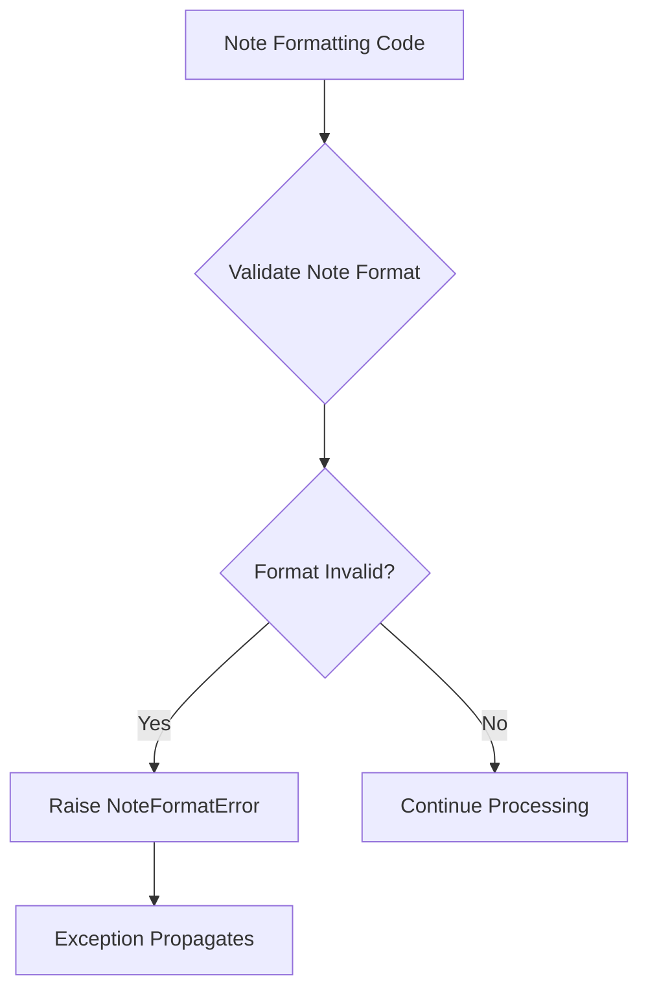
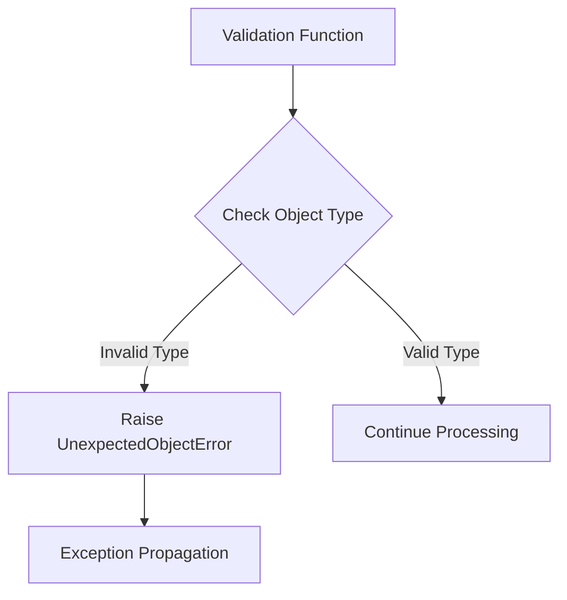
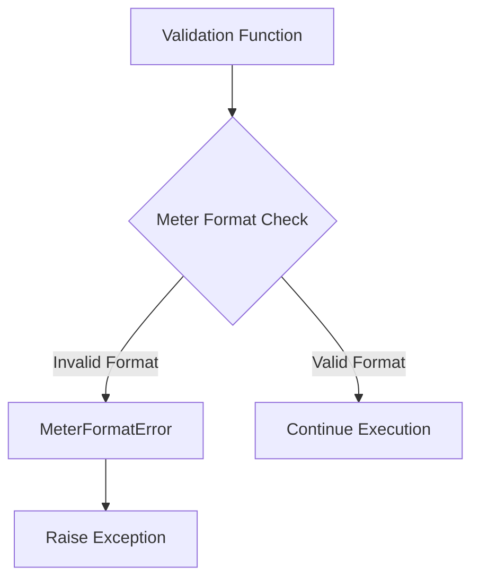
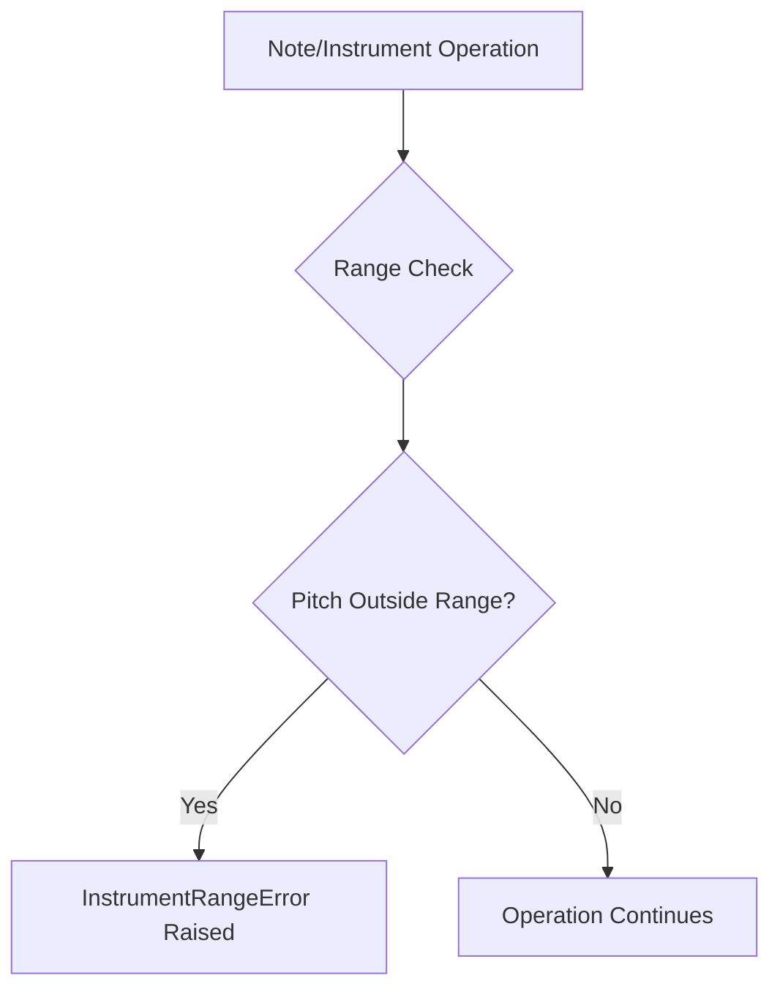

# `mt_exceptions.py`

## `mingus.containers.mt_exceptions.NoteFormatError` · *class*

## Summary:
Represents an error that occurs when a musical note is formatted incorrectly.

## Description:
The NoteFormatError exception is raised when a note object fails validation due to improper formatting. This custom exception provides a specific error type for handling note-related formatting issues in the mingus music library, allowing callers to distinguish note format errors from other types of exceptions.

## State:
This class has no instance attributes beyond those inherited from Exception. It serves purely as an exception type marker with no internal state to manage.

## Lifecycle:
Creation: Instances are created implicitly when the exception is raised, typically by code that validates note formatting. No explicit instantiation is required by users of this class.
Usage: When raised, the exception propagates up the call stack until caught by an appropriate exception handler.
Destruction: Automatically cleaned up by Python's garbage collector after being handled.

## Method Map:


## Raises:
This class itself does not raise exceptions, but instances of it are raised when note formatting validation fails.

## Example:
```python
# Raising the exception
try:
    # Some operation that validates note format
    if not is_valid_note_format(note_string):
        raise NoteFormatError("Note format is invalid: {}".format(note_string))
except NoteFormatError as e:
    print(f"Caught note format error: {e}")
```

## `mingus.containers.mt_exceptions.UnexpectedObjectError` · *class*

## Summary:
Custom exception class representing an unexpected object type or value encountered during processing.

## Description:
The UnexpectedObjectError is a specialized exception that should be raised when an operation encounters an object that does not match the expected type, structure, or value constraints. This exception serves as a clear indicator that a processing pipeline has received invalid input that cannot be handled gracefully.

This class acts as a distinct abstraction from general Exception to signal specific type-related errors in the system, helping developers quickly identify when input validation has failed or when an unexpected data structure has been encountered.

## State:
This class has no instance attributes beyond those inherited from Exception. It maintains no internal state and serves purely as an error indicator.

## Lifecycle:
Creation: Instantiated by calling `UnexpectedObjectError()` or `UnexpectedObjectError(message)` with an optional error message string.

Usage: Typically raised within validation functions, type checking routines, or data processing pipelines when encountering objects that violate expected constraints.

Destruction: Automatically cleaned up by Python's garbage collector after the exception propagates out of scope.

## Method Map:


## Raises:
- UnexpectedObjectError: Raised when an object of unexpected type or value is encountered during processing operations.

## Example:
```python
# Raising the exception
def process_note(note):
    if not isinstance(note, Note):
        raise UnexpectedObjectError(f"Expected Note object, got {type(note)}")
    
    # Process the note...
    return note.play()

# Using the exception
try:
    process_note("invalid_input")
except UnexpectedObjectError as e:
    print(f"Processing failed: {e}")
    # Handle the unexpected object error appropriately
```

## `mingus.containers.mt_exceptions.MeterFormatError` · *class*

## Summary:
Custom exception class representing formatting errors in meter specifications.

## Description:
MeterFormatError is a specialized exception type designed to indicate when a meter specification fails to meet required formatting conventions. This exception is raised when meter data (such as time signatures or rhythmic patterns) do not conform to expected structural or syntactic requirements. The exception serves as a clear signal to calling code that a meter-related input validation has failed, allowing for graceful error handling and user feedback.

## State:
This class has no instance attributes beyond those inherited from Exception. It maintains no internal state and serves purely as an error indicator.

## Lifecycle:
Creation: Instances are created by raising the exception directly with `raise MeterFormatError("message")` or by inheritance from parent classes. No special instantiation methods are required.

Usage: The exception is typically raised during validation of meter specifications (e.g., time signatures, rhythmic patterns) when input data fails format validation checks.

Destruction: As a standard Python exception, no explicit cleanup is required. The exception object is automatically destroyed when it goes out of scope.

## Method Map:


## Raises:
- MeterFormatError: Raised when meter specifications fail format validation checks, such as invalid time signature formats or malformed rhythmic patterns.

## Example:
```python
# Example of raising the exception
try:
    validate_meter_format("invalid/time/sig")
except MeterFormatError as e:
    print(f"Meter format error: {e}")

# Example of using in a validation function
def validate_time_signature(signature):
    if not isinstance(signature, str) or "/" not in signature:
        raise MeterFormatError("Time signature must be in 'numerator/denominator' format")
    return True
```

## `mingus.containers.mt_exceptions.InstrumentRangeError` · *class*

## Summary:
Represents an error that occurs when attempting to play notes outside an instrument's valid pitch range.

## Description:
This exception is raised when a musical operation attempts to play a note that falls outside the playable range of a specific instrument. It is used throughout the mingus library to enforce pitch range constraints for different instruments, ensuring that musical operations respect the physical limitations of instruments. Common scenarios include attempting to play notes that are too high or too low for the instrument's capabilities.

## State:
The class inherits all state from the base Exception class and does not define any additional attributes or properties.

## Lifecycle:
Creation: Instantiated directly when a pitch range violation is detected during musical operations.
Usage: Raised during note playback or composition when a pitch is outside an instrument's valid range.
Destruction: Handled by standard exception handling mechanisms in the calling code.

## Method Map:


## Raises:
This class itself does not raise any exceptions. It is raised by musical processing components when pitch range validation fails.

## Example:
```python
# Example of when this exception might be raised
try:
    # Attempting to play a note that's outside the piano's range
    piano = Piano()  # An instrument with limited pitch range
    piano.play_note(1000)  # This exceeds the piano's playable range
except InstrumentRangeError as e:
    print(f"Range error: {e}")
    # Handle the invalid note gracefully
```

