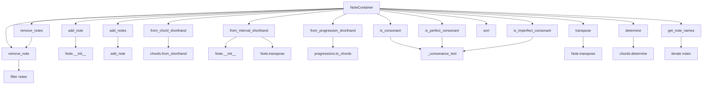

# `note_container.py`

## `mingus.containers.note_container.NoteContainer` · *class*

## Summary:
A container class for managing collections of musical notes with support for chord, interval, and progression-based construction, along with musical analysis capabilities.

## Description:
The NoteContainer class provides a flexible container for grouping musical notes, offering methods to construct note collections from various musical constructs like chords, intervals, and progressions. It supports common operations such as adding/removing notes, sorting, transposition, and musical analysis including consonance testing. The class maintains an ordered collection of Note objects and provides intuitive interfaces for musical manipulation and analysis.

This class serves as a fundamental building block in the mingus music theory library, enabling developers to work with collections of musical notes in a structured way while providing access to advanced musical analysis features.

## State:
- notes (list): A list of Note objects representing the contained musical notes. The list is maintained in sorted order internally.
  - Type: list of mingus.containers.note.Note objects
  - Valid range: Empty list or list containing Note objects
  - Invariant: The notes list is always kept sorted after modifications

## Lifecycle:
- Creation: Instantiate with optional initial notes via `__init__(notes=None)` or use factory methods like `from_chord_shorthand()` to populate the container. The constructor calls `empty()` first, then `add_notes()` to initialize the container.
- Usage: Add/remove notes, perform musical operations (transpose, augment/diminish), analyze musical properties (consonance), or convert to other representations
- Destruction: Standard Python garbage collection handles cleanup

## Method Map:


## Raises:
- UnexpectedObjectError: Raised in `add_note()` when attempting to add an object that doesn't have a "name" attribute, indicating it's not a valid Note object
- NoteFormatError: Raised by chord and interval parsing functions when encountering invalid musical notation

## Example:
```python
# Create a container and add notes
container = NoteContainer()
container.add_note("C4")
container.add_note("E4")
container.add_note("G4")

# Create from chord shorthand
container2 = NoteContainer().from_chord_shorthand("Cmaj")

# Check musical properties
print(container.is_consonant())  # True for major triad
print(container.determine())     # Returns chord name

# Transpose notes
container.transpose("P5")        # Transpose up a perfect fifth

# Remove notes
container.remove_note("E4")

# Using magic methods
container += "A4"                # Add note using +=
container -= "C4"                # Remove note using -=

# From progression (may return False if invalid)
result = container.from_progression_shorthand("I-vi-IV-V", "C")
if result is False:
    print("Invalid progression")
```

### `mingus.containers.note_container.NoteContainer.__init__` · *method*

*No documentation generated.*

### `mingus.containers.note_container.NoteContainer.empty` · *method*

## Summary:
Clears all notes from the container by resetting the notes list to an empty list.

## Description:
The `empty` method removes all notes currently stored in the NoteContainer instance by setting the internal `notes` attribute to an empty list. This method is primarily used as a utility to clear existing notes before populating the container with new notes from various musical operations such as chord, interval, or progression creation.

## Args:
    None

## Returns:
    None

## Raises:
    None

## State Changes:
    Attributes READ: None
    Attributes WRITTEN: self.notes

## Constraints:
    Preconditions: None
    Postconditions: The `self.notes` attribute will be an empty list

## Side Effects:
    None

### `mingus.containers.note_container.NoteContainer.add_note` · *method*

## Summary:
Adds a musical note to the container, handling string representations and maintaining sorted unique notes.

## Description:
The add_note method allows adding musical notes to a NoteContainer instance. It accepts either Note objects or string representations of notes and automatically converts string notes to Note objects with appropriate octave assignments. The method ensures that duplicate notes are not added and maintains the notes in sorted order.

This method is separated from inline logic to provide a clean interface for note addition while encapsulating the complexity of note conversion, duplicate detection, and sorting. It's used throughout the NoteContainer's lifecycle when individual notes need to be added to the collection.

## Args:
    note (str or Note): A musical note represented either as a string (e.g., "C4", "D#") or a Note object.
    octave (int, optional): The octave number to assign when creating a Note from a string. Defaults to None.
    dynamics (dict, optional): Dynamics information to associate with the note. Defaults to None.

## Returns:
    list[Note]: The updated list of notes in the container, sorted in ascending order.

## Raises:
    UnexpectedObjectError: When the provided note object does not have a 'name' attribute, indicating it's not a valid Note object.

## State Changes:
    Attributes READ: self.notes
    Attributes WRITTEN: self.notes

## Constraints:
    Preconditions: 
    - The note parameter must be either a string or a Note object with a 'name' attribute
    - If octave is provided, it must be a valid integer
    - If dynamics is provided, it must be a dictionary
    
    Postconditions:
    - The note is added to self.notes if it's not already present
    - The self.notes list remains sorted in ascending order
    - Duplicate notes are not added to the container

## Side Effects:
    None

### `mingus.containers.note_container.NoteContainer.add_notes` · *method*

## Summary:
Adds multiple musical notes to the container, supporting various input formats including Note objects, note strings, and collections of notes.

## Description:
The add_notes method provides a flexible interface for adding multiple musical notes to a NoteContainer instance. It intelligently handles different input types by delegating to the underlying add_note method. This method serves as a central entry point for bulk note addition, making it easier to populate containers from various sources like chord shorthands, intervals, or lists of notes.

This logic is separated from inline operations to provide a clean, reusable interface for adding multiple notes while encapsulating the complexity of input type detection and processing. It's commonly called during initialization, chord/interval construction, and general note population workflows.

## Args:
    notes: A collection of musical notes that can be:
        - Another NoteContainer object (uses its notes attribute)
        - A Note object (uses its name attribute)
        - A string representing a note (e.g., "C4", "D#")
        - An iterable of notes, where each element can be:
            - A Note object
            - A string representing a note
            - A list with 2-3 elements representing note, octave, and dynamics

## Returns:
    list[Note]: The updated list of notes in the container, sorted in ascending order.

## Raises:
    UnexpectedObjectError: When a note object doesn't have a 'name' attribute, indicating it's not a valid Note object.

## State Changes:
    Attributes READ: self.notes
    Attributes WRITTEN: self.notes

## Constraints:
    Preconditions:
    - The notes parameter must be iterable or have the expected attributes
    - Individual note objects must be valid Note objects or convertible to Note objects
    - If providing lists for notes, they must contain 1-3 elements representing note, octave, and dynamics respectively
    
    Postconditions:
    - All valid notes from the input are added to self.notes
    - Duplicate notes are not added to the container
    - The self.notes list remains sorted in ascending order
    - The method returns the updated notes list

## Side Effects:
    None

### `mingus.containers.note_container.NoteContainer.from_chord` · *method*

## Summary:
Converts a chord shorthand notation into a collection of notes and populates the NoteContainer with those notes.

## Description:
This method serves as a convenience wrapper that transforms a chord shorthand string representation (such as "Cmaj", "Am", or "G7") into individual notes and loads them into the NoteContainer. It delegates the actual conversion to the internal `from_chord_shorthand` method, which clears the container and adds the notes derived from the chord shorthand.

This method exists to provide a clean, intuitive interface for creating NoteContainers from chord notations, abstracting away the internal implementation details of how chord shorthands are processed.

## Args:
    shorthand (str): A string representing a chord in shorthand notation (e.g., "Cmaj", "Am", "G7").

## Returns:
    NoteContainer: The current NoteContainer instance, allowing for method chaining.

## Raises:
    UnexpectedObjectError: If the chord shorthand cannot be properly converted to notes, or if the resulting notes are invalid when added to the container.
    TypeError: If the shorthand parameter is not a string.

## State Changes:
    Attributes READ: None
    Attributes WRITTEN: self.notes (modified via delegation to from_chord_shorthand)

## Constraints:
    Preconditions: The shorthand parameter must be a valid chord shorthand string that can be processed by the underlying chords.from_shorthand function.
    Postconditions: The NoteContainer will contain all notes that make up the specified chord, with any previous notes cleared.

## Side Effects:
    Mutates the internal state of the NoteContainer by clearing existing notes and replacing them with notes from the chord shorthand.

### `mingus.containers.note_container.NoteContainer.from_chord_shorthand` · *method*

## Summary:
Converts a chord shorthand string into musical notes and populates the container with those notes.

## Description:
The `from_chord_shorthand` method transforms a chord shorthand notation (such as "Cmaj", "Am", or "G7") into its constituent musical notes and replaces the current notes in the container with these notes. This method provides a convenient way to build chord-based note collections from human-readable shorthand notation.

This method is separated from inline operations to provide a clean, reusable interface for chord creation while encapsulating the complexity of chord shorthand parsing and note conversion. It's typically called during musical composition workflows where chords need to be constructed from shorthand notation.

## Args:
    shorthand (str): A string representing a chord in shorthand notation (e.g., "Cmaj", "Am", "G7").

## Returns:
    NoteContainer: Returns self to enable method chaining.

## Raises:
    NoteFormatError: When the shorthand contains an unrecognized note.
    FormatError: When the shorthand notation is not recognized or invalid.

## State Changes:
    Attributes READ: None
    Attributes WRITTEN: self.notes

## Constraints:
    Preconditions: The shorthand parameter must be a valid chord shorthand string.
    Postconditions: The container will contain exactly the notes that make up the specified chord.

## Side Effects:
    None

### `mingus.containers.note_container.NoteContainer.from_interval` · *method*

## Summary:
Creates a NoteContainer with two notes: a starting note and a transposed note based on the provided interval.

## Description:
This method constructs a NoteContainer containing exactly two notes - the original startnote and a second note that is transposed by the specified interval. It serves as a convenience wrapper around the more detailed `from_interval_shorthand` method, providing a simpler interface for creating interval-based note collections.

## Args:
    startnote (Note or str): The starting note, either as a Note object or note name string
    shorthand (str): The interval shorthand notation (e.g., 'M3', 'm7')
    up (bool): Direction of transposition, True for upward, False for downward. Defaults to True

## Returns:
    NoteContainer: The current instance with two notes added: startnote and the transposed note

## Raises:
    None explicitly raised, but may raise exceptions from underlying methods like Note creation or transpose operations

## State Changes:
    Attributes READ: None
    Attributes WRITTEN: self.notes (modified via empty() and add_notes())

## Constraints:
    Preconditions: 
    - startnote must be a valid Note object or note name string
    - shorthand must be a valid interval shorthand notation
    - The NoteContainer must be properly initialized
    
    Postconditions:
    - The NoteContainer will contain exactly two notes
    - The first note is the original startnote
    - The second note is the startnote transposed by the specified interval

## Side Effects:
    None

### `mingus.containers.note_container.NoteContainer.from_interval_shorthand` · *method*

## Summary:
Creates a two-note container containing a starting note and its transposed version by the specified interval shorthand.

## Description:
Constructs a NoteContainer with exactly two notes: the original startnote and a transposed version of it. The transposed note is created by applying the given interval shorthand to the startnote, either upward or downward depending on the 'up' parameter. This method is commonly used to build interval-based musical constructs such as seconds, thirds, fourths, etc.

The method clears any existing notes from the container before creating the new pair, ensuring a clean slate for interval construction. It supports flexible input for the startnote parameter, accepting both Note objects and string representations.

## Args:
    startnote (Note or str): The base note for the interval construction. Can be a Note object or a string representation (e.g., "C4", "D#").
    shorthand (str): The interval shorthand specifying the transposition (e.g., "m3" for minor third, "P5" for perfect fifth).
    up (bool): Direction of transposition. True for upward transposition, False for downward. Defaults to True.

## Returns:
    NoteContainer: Returns self to enable method chaining.

## Raises:
    None explicitly raised

## State Changes:
    Attributes READ: None
    Attributes WRITTEN: self.notes (modified via self.empty() and self.add_notes())

## Constraints:
    Preconditions:
    - The startnote parameter must be a valid Note object or convertible string
    - The shorthand parameter must be a valid interval shorthand recognized by the intervals module
    - The NoteContainer instance must be properly initialized
    
    Postconditions:
    - The container will contain exactly two notes: the original startnote and its transposed version
    - Both notes are properly ordered in the container's notes list
    - The container's notes list is sorted in ascending order

## Side Effects:
    None

### `mingus.containers.note_container.NoteContainer.from_progression` · *method*

## Summary:
Initializes the note container with notes from a Roman numeral chord progression.

## Description:
Converts a musical progression expressed in Roman numeral notation (such as "I", "V7", "vi") into actual chord representations and populates the note container with the resulting notes. This method serves as a convenient interface for building musical progressions programmatically.

The method delegates to `from_progression_shorthand` which handles the actual conversion from Roman numeral notation to chord structures using the mingus core progressions module.

## Args:
    shorthand (str): Musical progression expressed in Roman numeral notation (e.g., "I", "V7", "vi").
    key (str, optional): Musical key for chord construction, defaults to "C". Used as the base for chord generation.

## Returns:
    NoteContainer or bool: Returns the NoteContainer instance (self) populated with chord notes if successful, or False if no chords could be generated from the progression.

## Raises:
    None explicitly raised, though invalid Roman numerals may cause early return with False.

## State Changes:
    Attributes READ: None
    Attributes WRITTEN: self.notes (emptied and repopulated with new chord notes)

## Constraints:
    Preconditions: The shorthand parameter must be a valid Roman numeral progression string.
    Postconditions: The note container will contain the notes from the first chord in the progression, or remain empty if no valid chords are found.

## Side Effects:
    Mutates the internal notes list of the NoteContainer instance by clearing existing notes and adding new ones.

### `mingus.containers.note_container.NoteContainer.from_progression_shorthand` · *method*

## Summary:
Converts a musical progression shorthand string into its constituent notes and populates the container with the first chord's notes.

## Description:
Transforms a musical progression expressed in Roman numeral shorthand (such as "I", "V7", "vi") into actual musical notes and loads them into the NoteContainer. This method serves as a convenient interface for building musical progressions programmatically by converting abstract harmonic notation into playable musical elements.

The method clears any existing notes from the container, processes the progression shorthand using the core progressions module, and adds the notes from the first chord in the resulting progression. This approach allows for easy integration with musical composition workflows where progressions are defined in standard harmonic notation.

## Args:
    shorthand (str): Musical progression expressed in Roman numeral notation (e.g., "I", "V7", "vi"). Can represent a single progression or multiple progressions.
    key (str, optional): Musical key for chord construction, defaults to "C". Used as the base for chord generation when converting Roman numerals to actual notes.

## Returns:
    NoteContainer or bool: Returns the NoteContainer instance (self) if successful, or False if the progression shorthand could not be converted to any chords.

## Raises:
    None explicitly raised, though invalid Roman numerals in the shorthand may cause early return with False.

## State Changes:
    Attributes READ: None
    Attributes WRITTEN: self.notes

## Constraints:
    Preconditions: The shorthand parameter must be a valid Roman numeral progression string or list of strings.
    Postconditions: If successful, the container will contain the notes from the first chord of the progression. If unsuccessful, the container will remain empty.

## Side Effects:
    None: This method only modifies the internal state of the NoteContainer instance.

### `mingus.containers.note_container.NoteContainer._consonance_test` · *method*

## Summary:
Tests whether all pairs of notes in the container satisfy a given consonance condition.

## Description:
Performs pairwise comparisons of all notes in the container using the provided test function. Returns False immediately upon finding any pair that fails the consonance test, otherwise returns True after checking all pairs. This method serves as a generic framework for various consonance-related validations and is used internally by public methods like `is_consonant`, `is_perfect_consonant`, and `is_imperfect_consonant`.

## Args:
    testfunc (callable): A function that takes note names as arguments and returns a boolean indicating whether they satisfy a consonance condition. Expected to accept two note name strings, optionally with a third parameter if param is provided.
    param (any, optional): Additional parameter to pass to testfunc. Defaults to None.

## Returns:
    bool: True if all pairs of notes in the container satisfy the consonance test, False otherwise.

## Raises:
    None explicitly raised

## State Changes:
    Attributes READ: self.notes
    Attributes WRITTEN: None

## Constraints:
    Preconditions:
        - self.notes contains valid note objects with .name attributes
        - testfunc must be callable and accept appropriate arguments based on param value
        - When param is None, testfunc should accept two arguments (note1, note2)
        - When param is provided, testfunc should accept three arguments (note1, note2, param)
    
    Postconditions:
        - Method returns a boolean value indicating consonance status
        - All note pairs are checked exactly once
        - Short-circuit evaluation occurs on first failure

## Side Effects:
    None

### `mingus.containers.note_container.NoteContainer.is_consonant` · *method*

## Summary:
Checks whether all pairs of notes in the container form consonant musical intervals.

## Description:
Determines if every pair of notes within the NoteContainer forms a consonant interval according to Western music theory. This method evaluates all possible combinations of two notes from the container and returns False if any pair forms a dissonant interval, otherwise returns True.

## Args:
    include_fourths (bool): Flag indicating whether perfect fourths should be treated as perfect consonances. Defaults to True. When False, perfect fourths are not considered consonant intervals.

## Returns:
    bool: True if all pairs of notes in the container form consonant intervals; False if any pair forms a dissonant interval.

## Raises:
    None explicitly raised

## State Changes:
    Attributes READ: self.notes
    Attributes WRITTEN: None

## Constraints:
    Preconditions:
        - The container must contain valid note objects with .name attributes
        - All notes in the container must be valid musical note names
        
    Postconditions:
        - Returns a boolean value indicating the consonance status of all note pairs
        - The method performs short-circuit evaluation - it stops checking as soon as any dissonant pair is found

## Side Effects:
    None

### `mingus.containers.note_container.NoteContainer.is_perfect_consonant` · *method*

## Summary:
Tests whether all pairs of notes in the container form perfect consonances according to Western music theory.

## Description:
Determines if every pair of notes within the note container forms a perfect consonance, which includes unison (0 semitones), perfect fourths (5 semitones), and perfect fifths (7 semitones). This method provides a convenient way to validate that all intervals between notes in a chord or note collection are perfectly consonant.

## Args:
    include_fourths (bool): Flag indicating whether perfect fourths should be treated as perfect consonances. Defaults to True.

## Returns:
    bool: True if all pairs of notes in the container form perfect consonances, False otherwise.

## Raises:
    None explicitly raised

## State Changes:
    Attributes READ: self.notes
    Attributes WRITTEN: None

## Constraints:
    Preconditions:
        - The container must contain valid note objects with .name attributes
        - All notes in the container must be valid musical note representations
        
    Postconditions:
        - Returns a boolean value indicating whether all note pairs satisfy perfect consonance conditions
        - The method performs short-circuit evaluation, returning False immediately upon finding any non-consonant pair

## Side Effects:
    None

### `mingus.containers.note_container.NoteContainer.is_imperfect_consonant` · *method*

## Summary:
Tests whether all pairs of notes in the container form imperfect consonant intervals.

## Description:
Determines if every pair of notes in the note container forms an imperfect consonant interval. An imperfect consonance consists of intervals that are neither perfect (fourths and fifths) nor dissonant, specifically including minor thirds, major thirds, minor sixths, and major sixths (3, 4, 8, or 9 semitones).

## Args:
    None

## Returns:
    bool: True if all pairs of notes in the container form imperfect consonant intervals; False otherwise.

## Raises:
    None

## State Changes:
    Attributes READ: self.notes
    Attributes WRITTEN: None

## Constraints:
    Preconditions:
        - The container must contain valid note objects with .name attributes
        - All notes in the container must be comparable using the intervals.is_imperfect_consonant function
    
    Postconditions:
        - Returns a boolean value indicating whether all note pairs satisfy imperfect consonance
        - The method evaluates all pairs of notes in the container exactly once
        - Short-circuit evaluation occurs on first failure

## Side Effects:
    None

### `mingus.containers.note_container.NoteContainer.is_dissonant` · *method*

## Summary:
Determines whether any pair of notes in the container forms a dissonant musical interval.

## Description:
Returns True if at least one pair of notes in the container forms a dissonant interval, and False if all pairs form consonant intervals. This method is the logical complement of `is_consonant` with inverted parameter semantics - it negates the result of `is_consonant` while inverting the `include_fourths` parameter before passing it to that method.

## Args:
    include_fourths (bool): Flag controlling whether perfect fourths are considered consonant intervals. Defaults to False. When True, perfect fourths are excluded from consonance consideration; when False, they are included. Note that this parameter is inverted when passed to the underlying consonance checking logic.

## Returns:
    bool: True if any pair of notes in the container forms a dissonant interval; False if all pairs form consonant intervals.

## Raises:
    None explicitly raised

## State Changes:
    Attributes READ: self.notes
    Attributes WRITTEN: None

## Constraints:
    Preconditions:
        - The container must contain valid note objects with .name attributes
        - All notes in the container must be valid musical note names
        
    Postconditions:
        - Returns a boolean value indicating the dissonance status of all note pairs
        - The method performs short-circuit evaluation - it stops checking as soon as any dissonant pair is found

## Side Effects:
    None

### `mingus.containers.note_container.NoteContainer.remove_note` · *method*

## Summary:
Removes notes from the container matching the specified note or note name, optionally filtered by octave.

## Description:
Removes all notes from the container that match the provided note or note name. When removing by note name (string), the operation can be further filtered by octave number. This method is designed to be a dedicated interface for note removal, separating the logic from other container operations and providing flexible removal options.

## Args:
    note (str or Note): Either a note name (string) or Note object to remove from the container
    octave (int): Optional octave number to filter matches when removing by note name. Defaults to -1 (no filtering)

## Returns:
    list[Note]: The updated list of notes in the container after removal

## Raises:
    None explicitly raised

## State Changes:
    Attributes READ: self.notes
    Attributes WRITTEN: self.notes

## Constraints:
    Preconditions: The container must have a notes attribute containing a list of Note objects
    Postconditions: The notes list will contain only notes that don't match the removal criteria

## Side Effects:
    None

## Detailed Behavior:
When `note` is a string (note name):
- All notes with matching note names are considered for removal
- If `octave` is not -1, only notes with matching names AND matching octaves are removed
- If `octave` is -1, all notes with matching names are removed regardless of octave

When `note` is a Note object:
- Direct equality comparison is performed (`x != note`)
- All notes that don't equal the provided note are retained

## Usage Examples:
- Remove all C notes: `container.remove_note("C")`
- Remove all C notes in octave 4: `container.remove_note("C", octave=4)`
- Remove a specific note: `container.remove_note(specific_note_object)`

### `mingus.containers.note_container.NoteContainer.remove_notes` · *method*

## Summary:
Removes one or more notes from the container, supporting various input types for flexible note removal.

## Description:
Removes notes from the container based on the input type. This method provides a unified interface for removing notes, handling single notes, note names, or collections of notes. It delegates to the underlying remove_note method for individual note removal and is designed to be a dedicated interface separate from inline operations.

When called with a single note or note name, it removes all matching notes. When called with an iterable of notes or note names, it removes each note individually.

## Args:
    notes (str, Note, or iterable): Single note name (string), Note object, or collection of notes/note names to remove

## Returns:
    list[Note]: The updated list of notes in the container after removal

## Raises:
    None explicitly raised

## State Changes:
    Attributes READ: self.notes
    Attributes WRITTEN: self.notes

## Constraints:
    Preconditions: The container must have a notes attribute containing a list of Note objects
    Postconditions: The notes list will contain only notes that don't match the removal criteria

## Side Effects:
    None

## Detailed Behavior:
- If `notes` is a string (note name): Delegates to `remove_note(notes)` and returns the result
- If `notes` has a "name" attribute (Note object): Delegates to `remove_note(notes)` and returns the result  
- Otherwise (iterable): Iterates through each item in `notes`, removes each one individually via `remove_note(x)`, and returns `self.notes`

### `mingus.containers.note_container.NoteContainer.remove_duplicate_notes` · *method*

## Summary:
Removes duplicate notes from the container's note list and returns the deduplicated list.

## Description:
This method eliminates duplicate Note objects from the internal `notes` list while preserving the order of first occurrences. It creates a new list without duplicates and updates the container's internal state accordingly. This method is useful for cleaning up note collections that may have accidentally duplicated notes, ensuring that each unique note appears only once in the collection.

## Args:
    None

## Returns:
    list[Note]: A list containing the unique notes from the container, maintaining their original order of appearance.

## Raises:
    None

## State Changes:
    Attributes READ: self.notes
    Attributes WRITTEN: self.notes

## Constraints:
    Preconditions: The container must have a `notes` attribute that is iterable.
    Postconditions: The `self.notes` attribute will contain no duplicate notes, and the returned list will match this deduplicated version.

## Side Effects:
    None

### `mingus.containers.note_container.NoteContainer.sort` · *method*

## Summary:
Sorts the notes in the container in ascending order based on their musical pitch.

## Description:
This method performs an in-place sort of the notes stored in the container's `notes` attribute. The sorting is performed using Python's built-in sorting algorithm, which orders the Note objects based on their natural musical pitch ordering as defined by the Note class's comparison methods.

The method is typically called during note manipulation operations to ensure notes are arranged in a consistent order, particularly after adding notes to the container or when performing musical operations that benefit from ordered note sequences.

## Args:
    None

## Returns:
    None

## Raises:
    None

## State Changes:
    Attributes READ: self.notes
    Attributes WRITTEN: self.notes

## Constraints:
    Preconditions: The `self.notes` attribute must be a list containing Note objects.
    Postconditions: The `self.notes` list will be sorted in ascending order by musical pitch.

## Side Effects:
    None

### `mingus.containers.note_container.NoteContainer.augment` · *method*

## Summary:
Applies the augmentation operation to all notes in the container, sharpening each note by one semitone.

## Description:
The augment method modifies each note in the container by applying the augmentation operation, which raises the pitch of each note by one semitone. This is achieved by calling the individual note's augment() method on every note in the container's notes list. The method follows the same pattern as the diminish() method, providing symmetric functionality for note manipulation.

This method is typically used in musical contexts where notes need to be transposed upward by a semitone, such as when constructing augmented chords or when applying musical transformations to a collection of notes.

## Args:
    None

## Returns:
    None

## Raises:
    None

## State Changes:
    Attributes READ: self.notes
    Attributes WRITTEN: Each note's name attribute in self.notes is modified through the note.augment() method call

## Constraints:
    Preconditions:
        - The container must contain valid Note objects
        - Each note in self.notes must support the augment() method call
    Postconditions:
        - All notes in the container will have their name attributes modified according to the augmentation rules
        - The order and structure of notes in the container remains unchanged

## Side Effects:
    None

### `mingus.containers.note_container.NoteContainer.diminish` · *method*

## Summary:
Reduces the pitch of all notes in the container by one semitone each.

## Description:
Applies the diminishing operation to every note contained within this NoteContainer instance. This method systematically lowers the pitch of each note by one semitone, effectively flattening each note in the collection. The operation is applied uniformly across all notes in the container, maintaining their relative order and structure.

This method serves as the counterpart to the `augment()` method, providing symmetric functionality for musical note manipulation. It is commonly used when constructing diminished chords or applying musical transformations that require lowering note pitches by semitones.

## Args:
    None

## Returns:
    None

## Raises:
    None

## State Changes:
    Attributes READ: self.notes
    Attributes WRITTEN: Each note's name attribute in self.notes is modified through the note.diminish() method call

## Constraints:
    Preconditions:
        - The container must contain valid Note objects
        - Each note in self.notes must support the diminish() method call
    Postconditions:
        - All notes in the container will have their name attributes modified according to the diminishing rules
        - The order and structure of notes in the container remains unchanged

## Side Effects:
    None

### `mingus.containers.note_container.NoteContainer.determine` · *method*

## Summary
Determines the chord type and inversion for the notes contained in this NoteContainer.

## Description
Analyzes the musical notes stored in this container and identifies the chord type, including any inversions or extensions. This method delegates to the core chords.determine function to perform the actual chord analysis, providing a convenient interface for chord identification directly from a NoteContainer instance.

The method is separated from inline logic to provide a clean, reusable interface for chord determination while leveraging the robust chord analysis capabilities in the mingus.core.chords module.

## Args
    shorthand (bool): When True, returns abbreviated chord names (e.g., "Cm"). When False, returns full descriptive names with inversion information (e.g., "C, first inversion"). Defaults to False.

## Returns
    list: A list of chord name representations for valid input chords. Each string in the list represents the same chord in different inversion positions or as different polychord combinations. For empty chords, returns an empty list. For single-note chords, returns the chord unchanged. For two-note chords, returns interval descriptions. For chords with 3-7 notes, returns chord names from specialized determination functions. For chords with more than 7 notes, returns polychord combinations.

## Raises
    None: This method does not explicitly raise exceptions, though underlying functions may raise FormatError or NoteFormatError.

## State Changes
    Attributes READ: self.notes
    Attributes WRITTEN: None

## Constraints
    Preconditions: The NoteContainer must contain valid Note objects with proper note names.
    Postconditions: Returns a list of chord name representations for valid inputs, or an empty list for empty inputs.

## Side Effects
    None: This method has no side effects.

### `mingus.containers.note_container.NoteContainer.get_note_names` · *method*

## Summary:
Returns a list of unique note names from the notes contained in this NoteContainer.

## Description:
Extracts and returns a list of distinct note names from all notes stored in this container. The returned list preserves the order of first appearance of each unique note name. This method is primarily used internally by chord determination functions to analyze the musical content of the container.

## Args:
    None

## Returns:
    list[str]: A list of unique note name strings in the order of their first occurrence. Returns an empty list if the container contains no notes.

## Raises:
    None

## State Changes:
    Attributes READ: self.notes
    Attributes WRITTEN: None

## Constraints:
    Preconditions: The NoteContainer must contain valid Note objects with properly initialized name attributes.
    Postconditions: The returned list contains only unique note names, with duplicates removed while preserving order.

## Side Effects:
    None: This method has no side effects and does not modify the NoteContainer's state.

### `mingus.containers.note_container.NoteContainer.__repr__` · *method*

## Summary:
Returns a string representation of the NoteContainer's internal notes list for debugging and development purposes.

## Description:
This method implements the Python special method `__repr__` to provide a string representation of the NoteContainer object. When `repr()` is called on a NoteContainer instance or when the object appears in interactive Python sessions, this method is automatically invoked to display the container's contents. The representation shows the internal list of notes stored in the container.

This method is part of the standard Python object protocol and enables developers to quickly inspect the contents of a NoteContainer during debugging and development. It's particularly useful in interactive environments like Jupyter notebooks or Python REPL where object representations are displayed automatically.

## Args:
    None

## Returns:
    str: A string representation of the internal `self.notes` list, which contains Note objects. The returned string follows Python's standard representation format for lists.

## Raises:
    None

## State Changes:
    Attributes READ: self.notes
    Attributes WRITTEN: None

## Constraints:
    Preconditions: The NoteContainer object must be properly initialized with a valid `notes` attribute (which defaults to an empty list).
    Postconditions: The method returns a string representation without modifying the NoteContainer's state.

## Side Effects:
    None

### `mingus.containers.note_container.NoteContainer.__getitem__` · *method*

## Summary:
Retrieves a note from the container by index or slice.

## Description:
Provides indexed access to the notes stored in this container, delegating to the underlying list's indexing mechanism. This method enables standard Python list-like access patterns for retrieving individual notes or slices of notes from the container.

## Args:
    item (int or slice): The index or slice object used to retrieve notes from the container's internal list.

## Returns:
    Note or list[Note]: A single Note object when indexing with an integer, or a list of Note objects when slicing.

## Raises:
    IndexError: When the index is out of range for the container's notes list.

## State Changes:
    Attributes READ: self.notes
    Attributes WRITTEN: None

## Constraints:
    Preconditions: The container must have notes stored in self.notes, and the item parameter must be a valid index or slice for the list.
    Postconditions: The returned value matches the result of self.notes[item] directly.

## Side Effects:
    None

### `mingus.containers.note_container.NoteContainer.__setitem__` · *method*

## Summary:
Assigns a note or note string to a specific index position in the note container, converting string representations to Note objects as needed.

## Description:
Implements the Python container protocol's `__setitem__` magic method for the NoteContainer class. This method enables indexed assignment operations such as `container[index] = value`, allowing users to set notes at specific positions within the container. When a string value is provided, it automatically converts it to a Note object before storage.

Known callers:
- Direct usage via bracket notation: `container[index] = note_value`
- Indirect usage through fluent interfaces that may internally use assignment operations

This method exists as a dedicated implementation of the container protocol rather than being inlined because it provides standardized indexed assignment semantics for musical note containers. It ensures consistent handling of both Note objects and string representations of notes, maintaining the integrity of the container's internal note list.

## Args:
    item (int or slice): The index or slice position where the note should be assigned
    value: The note to assign, which can be either a Note object or a string representation of a note

## Returns:
    list[Note]: The updated notes list after assignment

## Raises:
    IndexError: When the index is out of range for the container's notes list

## State Changes:
    Attributes READ: self.notes
    Attributes WRITTEN: self.notes

## Constraints:
    Preconditions:
    - The item parameter must be a valid index or slice for the notes list
    - If value is a string, it must be a valid note name format
    - The container must have a notes list attribute that supports item assignment
    
    Postconditions:
    - The note at the specified index is replaced with the provided value
    - If value is a string, it is converted to a Note object before assignment
    - The notes list maintains its structure and length

## Side Effects:
    None: This method only modifies the internal state of the NoteContainer object

### `mingus.containers.note_container.NoteContainer.__add__` · *method*

## Summary:
Adds notes to the NoteContainer instance and returns self for method chaining.

## Description:
Implements Python's `__add__` magic method to enable the `+` operator for NoteContainer objects. This allows users to combine NoteContainer instances or add notes to existing containers using the `+` syntax. The method delegates to `add_notes()` to handle the actual addition logic and returns `self` to support fluent interface patterns.

## Args:
    notes: Can be a Note object, string representation of a note, another NoteContainer, list of notes, or iterable containing notes to be added to this container.

## Returns:
    NoteContainer: Returns self to enable method chaining operations.

## Raises:
    UnexpectedObjectError: When attempting to add an object that is not a valid note representation.

## State Changes:
    Attributes READ: self.notes
    Attributes WRITTEN: self.notes (modified by adding new notes)

## Constraints:
    Preconditions: The `notes` parameter must be compatible with the `add_notes` method's expectations.
    Postconditions: The container will contain all previously existing notes plus the newly added notes, sorted in ascending order.

## Side Effects:
    None

### `mingus.containers.note_container.NoteContainer.__sub__` · *method*

## Summary:
Removes specified notes from the container and returns the modified container.

## Description:
Implements the subtraction operator (-) for NoteContainer objects. This method allows for removing one or more notes from the container using the '-' syntax. It delegates to the remove_notes method to handle the actual removal logic and returns self to enable method chaining.

## Args:
    notes: Can be a single note (string or Note object), or a collection of notes to remove from the container.

## Returns:
    NoteContainer: Returns self to allow for method chaining operations.

## Raises:
    None explicitly raised, though underlying remove_notes method may raise UnexpectedObjectError if invalid note objects are provided.

## State Changes:
    Attributes READ: self.notes
    Attributes WRITTEN: self.notes (modified by remove_notes call)

## Constraints:
    Preconditions: The notes parameter must be compatible with the remove_notes method's expectations (string, Note object, or iterable of such).
    Postconditions: The specified notes are removed from self.notes, and self remains unchanged except for the removal.

## Side Effects:
    None beyond modification of the container's internal notes list.

### `mingus.containers.note_container.NoteContainer.__len__` · *method*

## Summary:
Returns the number of notes contained in the NoteContainer instance.

## Description:
This method implements Python's magic `__len__` protocol, allowing instances of NoteContainer to report their size when the built-in `len()` function is called. It provides a convenient way to determine how many notes are currently stored in the container without directly accessing the underlying `notes` attribute.

## Args:
    None

## Returns:
    int: The number of Note objects currently stored in the `self.notes` list.

## Raises:
    None

## State Changes:
    Attributes READ: self.notes
    Attributes WRITTEN: None

## Constraints:
    Preconditions: The `self.notes` attribute must be a list-like object that supports the `len()` function.
    Postconditions: The method returns an integer representing the count of elements in `self.notes`.

## Side Effects:
    None

### `mingus.containers.note_container.NoteContainer.__eq__` · *method*

## Summary:
Compares two NoteContainer instances for equality by checking if all notes in self are present in other.

## Description:
Implements the equality comparison operator (`==`) for NoteContainer objects. This method determines if two NoteContainer instances contain the same notes by checking if every note in the calling instance exists in the compared instance. 

The method iterates through all notes in self and verifies that each note is present in other. If any note from self is not found in other, the method returns False. If all notes from self are found in other, it returns True.

This implementation performs a one-way subset check rather than full equality comparison, meaning that two NoteContainers with the same notes in different orders or with different cardinalities may not be considered equal.

Known callers:
- Direct calls to `container1 == container2` syntax
- Implicit calls during unit testing or assertion checks
- Used in contexts where subset relationship is meaningful

This logic is implemented as a separate method because it needs to handle the specific comparison semantics of musical note collections, where the order of notes may not matter for equality purposes, but the presence of notes does.

## Args:
    other (NoteContainer): Another NoteContainer instance to compare against

## Returns:
    bool: True if all notes in self are present in other, False otherwise

## Raises:
    None explicitly raised

## State Changes:
    Attributes READ: self.notes
    Attributes WRITTEN: None

## Constraints:
    Preconditions:
    - other must be a NoteContainer instance (though no explicit type checking occurs)
    - Both self and other should contain Note objects
    
    Postconditions:
    - Returns boolean value indicating subset relationship
    - Does not modify either container's state

## Side Effects:
    None

