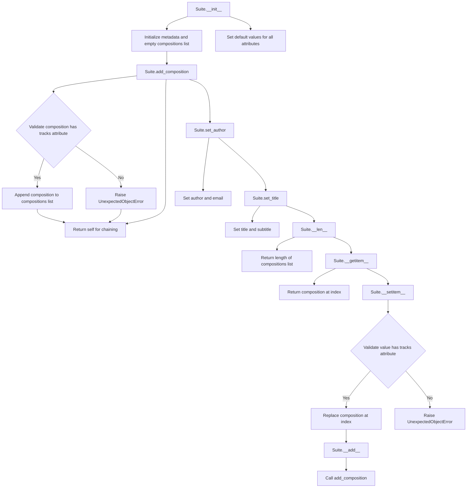

# `suite.py`

## `mingus.containers.suite.Suite` · *class*

## Summary:
A container class for organizing musical compositions into a structured suite with metadata.

## Description:
The Suite class serves as a container for grouping musical compositions together while maintaining associated metadata such as title, subtitle, author, and email. It provides methods for adding, accessing, and managing compositions, ensuring that only valid Composition objects (those with a tracks attribute) are stored.

This class is designed to represent a collection of musical works that share a common theme or are intended to be performed together, such as a concert program or album.

## State:
- title (str): The main title of the suite. Defaults to "Untitled".
- subtitle (str): An optional subtitle for the suite. Defaults to empty string.
- author (str): The author or composer of the suite. Defaults to empty string.
- email (str): Contact email for the author. Defaults to empty string.
- description (str): A description of the suite. Defaults to empty string.
- compositions (list): A list of Composition objects contained in the suite. Defaults to empty list.

## Lifecycle:
Creation: Instantiate with `Suite()` to create an empty suite with default metadata.
Usage: Add compositions using `add_composition()`, set metadata using `set_author()` and `set_title()`, access compositions via indexing (`__getitem__`) or iteration.
Destruction: No special cleanup required; relies on Python's garbage collection.

## Method Map:


## Raises:
- UnexpectedObjectError: Raised when attempting to add a composition that doesn't have a "tracks" attribute to the suite.
- UnexpectedObjectError: Raised when attempting to set a composition at an index that doesn't have a "tracks" attribute.

## Example:
```python
# Create a new suite
suite = Suite()

# Set suite metadata
suite.set_title("Classical Masterpieces", "A selection of famous classical works")
suite.set_author("Jane Smith", "jane@example.com")

# Add compositions (assuming Composition objects exist)
composition1 = Composition()  # Must have tracks attribute
composition2 = Composition()  # Must have tracks attribute
suite.add_composition(composition1)
suite.add_composition(composition2)

# Access compositions
print(len(suite))  # Prints number of compositions
first_comp = suite[0]  # Get first composition

# Add composition using + operator
suite += composition1  # Equivalent to suite.add_composition(composition1)
```

### `mingus.containers.suite.Suite.__init__` · *method*

## Summary:
Initializes a new Suite instance with default metadata values and an empty compositions list.

## Description:
The `__init__` method sets up the initial state of a Suite object by initializing all required metadata attributes to their default values and creating an empty list for storing compositions. This method ensures that every Suite instance starts with a consistent baseline state, providing sensible defaults for all metadata fields while establishing an empty container for musical compositions.

Known callers:
- Direct instantiation: `suite = Suite()` during object creation
- Object construction phase: Called automatically by Python's object creation mechanism when instantiating Suite objects

This method exists as a dedicated initialization routine rather than being inlined because it establishes the fundamental contract for all Suite instances. It separates the concerns of object creation from the business logic of managing compositions, ensuring that every Suite object begins with properly initialized state regardless of how it's constructed.

## Args:
    None

## Returns:
    None: This method does not return a value

## Raises:
    None

## State Changes:
    Attributes READ: None
    Attributes WRITTEN: 
    - self.title (str): Set to "Untitled"
    - self.subtitle (str): Set to empty string
    - self.author (str): Set to empty string
    - self.email (str): Set to empty string
    - self.description (str): Set to empty string
    - self.compositions (list): Set to empty list

## Constraints:
    Preconditions: None
    Postconditions: All Suite instance attributes are properly initialized with their default values

## Side Effects:
    None: This method does not perform any I/O operations or mutate external objects

### `mingus.containers.suite.Suite.add_composition` · *method*

## Summary:
Adds a composition to the suite's collection of compositions.

## Description:
This method appends a composition to the internal list of compositions stored in the Suite object. It validates that the provided object is a proper composition by checking for the presence of a 'tracks' attribute before adding it to the collection.

## Args:
    composition: A composition object that must have a 'tracks' attribute. This is typically a mingus.containers.Composition instance.

## Returns:
    Suite: Returns the Suite instance itself to enable method chaining.

## Raises:
    UnexpectedObjectError: When the provided object does not have a 'tracks' attribute, indicating it is not a valid composition object.

## State Changes:
    Attributes READ: None
    Attributes WRITTEN: self.compositions

## Constraints:
    Preconditions: The composition argument must have a 'tracks' attribute.
    Postconditions: The composition is appended to self.compositions list.

## Side Effects:
    None

### `mingus.containers.suite.Suite.set_author` · *method*

## Summary:
Sets the author name and email for a musical suite.

## Description:
Configures the author information for a Suite object by setting the author name and optional email address. This method provides a clean interface for updating author metadata associated with a musical suite.

## Args:
    author (str): The name of the author or composer of the suite.
    email (str): Optional email address of the author. Defaults to empty string.

## Returns:
    None: This method does not return any value.

## Raises:
    None: This method does not explicitly raise any exceptions.

## State Changes:
    Attributes READ: None
    Attributes WRITTEN: self.author, self.email

## Constraints:
    Preconditions: The Suite instance must be properly initialized.
    Postconditions: The self.author and self.email attributes will be updated to the provided values.

## Side Effects:
    None: This method only modifies the internal state of the Suite instance.

### `mingus.containers.suite.Suite.set_title` · *method*

## Summary:
Sets the title and optional subtitle of the suite.

## Description:
Configures the main identifying information for a musical suite by setting its title and optional subtitle. This method provides a clean interface for updating the suite's metadata without requiring direct attribute manipulation.

## Args:
    title (str): The main title of the suite.
    subtitle (str): Optional subtitle for the suite. Defaults to empty string.

## Returns:
    None: This method does not return a value.

## Raises:
    None: This method does not explicitly raise exceptions.

## State Changes:
    Attributes READ: None
    Attributes WRITTEN: self.title, self.subtitle

## Constraints:
    Preconditions: The suite instance must be properly initialized.
    Postconditions: The suite's title and subtitle attributes are updated to the provided values.

## Side Effects:
    None: This method only modifies the local object's attributes and has no external side effects.

### `mingus.containers.suite.Suite.__len__` · *method*

## Summary:
Returns the number of compositions contained in the suite.

## Description:
Implements the Python special method `__len__` to provide container-like behavior for the Suite class. This method allows the built-in `len()` function to be used directly on Suite instances, returning the count of compositions stored in the internal compositions list. The method is automatically called when `len(suite_instance)` is executed.

## Args:
    None

## Returns:
    int: The number of Composition objects currently stored in the suite's compositions list.

## Raises:
    None

## State Changes:
    Attributes READ: self.compositions
    Attributes WRITTEN: None

## Constraints:
    Preconditions: The Suite instance must have a valid compositions list attribute (which is initialized as an empty list in __init__)
    Postconditions: The method returns an integer representing the count of compositions without modifying the suite's state

## Side Effects:
    None

### `mingus.containers.suite.Suite.__getitem__` · *method*

## Summary:
Retrieves a composition from the suite by its index position.

## Description:
Provides indexed access to compositions stored in the suite's internal compositions list. This method enables iteration over compositions and direct access to specific compositions using bracket notation.

## Args:
    index (int): The zero-based index of the composition to retrieve.

## Returns:
    Composition: The composition object at the specified index position.

## Raises:
    IndexError: When the index is out of range for the compositions list.

## State Changes:
    Attributes READ: self.compositions
    Attributes WRITTEN: None

## Constraints:
    Preconditions: The index must be a valid integer within the bounds of the compositions list (0 <= index < len(self.compositions)).
    Postconditions: The method returns a reference to the composition object at the specified index without modifying the suite's state.

## Side Effects:
    None

### `mingus.containers.suite.Suite.__setitem__` · *method*

## Summary:
Sets a composition at the specified index position in the suite, validating that the assigned object is a proper Composition instance.

## Description:
Enables indexed assignment of Composition objects to the suite using bracket notation (e.g., `suite[index] = composition`). This method implements the Python container protocol's `__setitem__` special method, allowing direct modification of compositions at specific positions within the suite. The method performs type validation to ensure only valid Composition objects (those with a "tracks" attribute) are stored.

Known callers:
- Direct usage via bracket notation: `suite[index] = composition`
- Indirect usage through fluent interfaces that may internally use assignment operations

This method exists as a dedicated validation layer separate from the `add_composition` method because it provides indexed assignment semantics while maintaining the same validation logic. Unlike `add_composition` which appends to the end of the list, `__setitem__` allows replacement at specific indices, making it suitable for updating existing compositions in the suite.

## Args:
    index (int): The zero-based index position where the composition should be stored
    value: The object to store at the specified index position

## Returns:
    None: This method does not return a value

## Raises:
    UnexpectedObjectError: When the value parameter does not have a "tracks" attribute, indicating it is not a valid Composition object

## State Changes:
    Attributes READ: self.compositions
    Attributes WRITTEN: self.compositions

## Constraints:
    Preconditions: 
    - The index must be a valid integer within the bounds of the compositions list (or equal to the length for appending)
    - The value must be an object with a "tracks" attribute (typically a mingus.containers.Composition instance)
    
    Postconditions:
    - The composition is stored at the specified index position in self.compositions
    - The suite's internal state is updated with the new composition at the given index

## Side Effects:
    None: This method does not perform any I/O operations or mutate external objects

### `mingus.containers.suite.Suite.__add__` · *method*

## Summary:
Adds a composition to the suite using the + operator syntax, enabling fluent interface patterns.

## Description:
This special method enables the use of the + operator to add compositions to a Suite instance. It provides a clean, intuitive syntax for building suites by composition. The method delegates validation and addition logic to the underlying `add_composition` method.

## Args:
    composition: A musical composition object that must have a "tracks" attribute (typically a mingus.containers.Composition instance)

## Returns:
    Suite: Returns self to enable method chaining operations

## Raises:
    UnexpectedObjectError: When the provided composition object does not have a "tracks" attribute, indicating it's not a valid Composition object

## State Changes:
    Attributes READ: self.compositions
    Attributes WRITTEN: self.compositions

## Constraints:
    Preconditions: The composition parameter must be an object with a "tracks" attribute
    Postconditions: The composition is appended to self.compositions list and self is returned

## Side Effects:
    None

