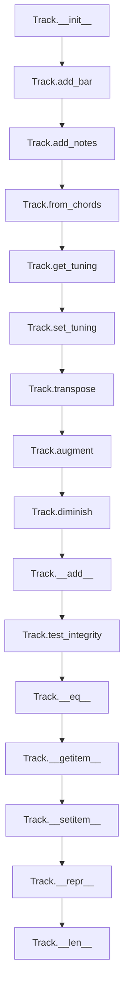

# `track.py`

## `mingus.containers.track.Track` · *class*

## Summary:
A musical track container that manages a sequence of bars, optionally associated with an instrument and tuning for musical composition and playback.

## Description:
The Track class represents a musical track composed of sequential musical bars. It serves as a container for organizing musical content in a structured way, supporting operations like adding notes and chords, managing instrument associations, and applying musical transformations. Tracks can be associated with instruments to validate note ranges and with tunings for tablature representation.

Tracks are commonly used in musical composition workflows where developers need to build up musical sequences bar by bar, either manually or through automated chord progression generation. The class integrates with other mingus components like Bars, Instruments, and NoteContainers to provide a complete musical notation system.

## State:
- bars (list): A list of Bar objects representing the musical content of the track
  - Type: list of mingus.containers.Bar objects
  - Valid range: Empty list or list containing Bar objects
  - Invariant: Maintains sequence of bars in chronological order
- instrument (Instrument or None): The musical instrument associated with this track
  - Type: mingus.containers.instrument.Instrument or None
  - Valid range: None or valid Instrument object
  - Invariant: When set, must be a valid instrument that can play notes
- name (str): Name identifier for the track, used when saving MIDI files
  - Type: str
  - Valid range: String value, defaults to "Untitled"
  - Invariant: Should be descriptive for identification purposes
- tuning (Tuning or None): Tuning configuration for tablature representation
  - Type: mingus.containers.tuning.Tuning or None
  - Valid range: None or valid Tuning object
  - Invariant: When set, must be compatible with the instrument if present

## Lifecycle:
- Creation: Instantiate with optional instrument parameter using `Track(instrument=None)`
- Usage: Add musical content using methods like `add_bar()`, `add_notes()`, or `from_chords()`. Apply transformations with `transpose()`, `augment()`, or `diminish()`. Access content via indexing or iteration.
- Destruction: Standard Python garbage collection handles cleanup

## Method Map:


## Raises:
- InstrumentRangeError: Raised in `add_notes()` and `from_chords()` when an instrument is assigned and the note(s) fall outside the instrument's playable range
- UnexpectedObjectError: Raised in `__setitem__()` when attempting to assign an object that doesn't have a "bar" attribute

## Example:
```python
# Create a track with an instrument
from mingus.containers import Track
from mingus.containers import Instrument

instrument = Instrument()
track = Track(instrument)

# Add bars and notes
bar = Bar()
track.add_bar(bar)
track.add_notes("C4 E4 G4", 4)  # Add a C major triad for one beat

# Add chords from a progression
chords = ["C", "G", "Am", "F"]
track.from_chords(chords, duration=2)

# Apply musical transformations
track.transpose("P5")  # Transpose up a perfect fifth
track.augment()        # Raise all notes by one semitone

# Access track content
print(len(track))      # Number of bars
first_bar = track[0]   # Get first bar

# Using the addition operator
new_bar = Bar()
track + new_bar        # Add bar using + operator
```

### `mingus.containers.track.Track.__init__` · *method*

## Summary:
Initializes a musical track with an empty bar collection and optional instrument association.

## Description:
Creates a new Track instance with an empty list of musical bars and optionally associates it with an instrument for note validation. This constructor establishes the fundamental structure of a musical track, allowing subsequent operations to add musical content through bars or direct note placement.

The Track class represents a sequence of musical bars that can be populated with notes, chords, or other musical elements. The instrument association enables range checking when adding notes to ensure they fall within the playable range of the specified instrument.

## Args:
    instrument (Instrument or None): Optional musical instrument to associate with this track. When provided, notes added to the track will be validated against the instrument's playable range. Defaults to None.

## Returns:
    None: This method initializes the object's state and does not return a value.

## Raises:
    None: This method does not raise any exceptions.

## State Changes:
    Attributes READ: None
    Attributes WRITTEN: 
    - self.bars: Initialized to an empty list, will store Bar objects
    - self.instrument: Set to the provided instrument parameter or None

## Constraints:
    Preconditions: None
    Postconditions: 
    - self.bars is initialized as an empty list
    - self.instrument is set to the provided value or None

## Side Effects:
    None: This method performs no I/O operations or external service calls. It only initializes object attributes.

### `mingus.containers.track.Track.add_bar` · *method*

## Summary:
Adds a musical bar to the track's collection of bars and enables method chaining.

## Description:
Appends a Bar object to the track's internal list of bars. This method is used to build up a musical composition by sequentially adding bars to a track. The method follows the fluent interface pattern by returning self, allowing for method chaining.

This method is typically called during musical composition workflows when constructing a track from individual bars. It's often used in conjunction with other track manipulation methods like `add_notes()` or when building tracks programmatically from musical data.

## Args:
    bar (Bar): A Bar object containing musical content to be added to the track. The bar must be a valid Bar instance from mingus.containers.bar.

## Returns:
    Track: Returns the Track instance itself, enabling method chaining for consecutive operations.

## Raises:
    None explicitly raised by this method. However, the underlying list append operation may raise exceptions if the bar parameter is not properly typed, though this is handled by the calling code's validation.

## State Changes:
    Attributes READ: None
    Attributes WRITTEN: self.bars (appends the bar to the list)

## Constraints:
    Preconditions: The bar parameter must be a valid Bar instance from mingus.containers.bar.
    Postconditions: The bar is appended to the end of self.bars list, and the list size increases by one.

## Side Effects:
    None

### `mingus.containers.track.Track.add_notes` · *method*

## Summary:
Adds musical notes to the track by placing them in the appropriate bar structure, creating new bars as needed.

## Description:
This method adds notes to a track by placing them in the most recent bar. If the track has no bars yet, it creates an initial bar. If the current bar is full, it creates a new bar with the same key and meter as the previous bar. It validates that the instrument (if set) can play the note before placing it.

## Args:
    note (object): The musical note to add to the track
    duration (int, optional): The duration of the note. Defaults to 4 if not specified.

## Returns:
    object: The result of placing the notes in the bar, typically a NoteContainer or similar structure containing the placed notes

## Raises:
    InstrumentRangeError: When the instrument cannot play the specified note

## State Changes:
    Attributes READ: self.instrument, self.bars
    Attributes WRITTEN: self.bars (appends new Bar instances when needed)

## Constraints:
    Preconditions: The note must be compatible with the track's instrument if one is set
    Postconditions: The note is placed in the most recent bar, and a new bar is created if the current one is full

## Side Effects:
    None

### `mingus.containers.track.Track.get_notes` · *method*

## Summary:
Generates all musical note entries from all bars in the track, yielding beat position, duration, and note container for each entry.

## Description:
Returns a generator that iterates through all bars in the track and yields individual note entries. Each yielded item represents a musical element (note or rest) positioned within a bar, providing access to its timing, duration, and musical content.

This method enables efficient traversal of all musical content in a track without loading everything into memory simultaneously. It's particularly useful for processing tracks in streaming fashion or when only partial information is needed.

Known callers:
- This method is not explicitly called by other methods in the provided code, but would be used in contexts where full track analysis or processing is required
- Likely used in rendering, analysis, or export operations that need to process each musical element individually

The logic is separated into its own method rather than being inlined because it provides a clean abstraction for accessing all musical content in a consistent format, making it reusable across different operations that need to traverse track contents.

## Returns:
    Generator yielding tuples of (float, numeric, NoteContainer or None) representing:
    - beat (float): The beat position within the bar where the note/rest occurs
    - duration (numeric): The duration of the note/rest
    - notes (NoteContainer or None): Container with musical notes, or None for rests

## State Changes:
    Attributes READ: self.bars
    Attributes WRITTEN: None

## Constraints:
    Preconditions: 
    - self.bars must be a list of Bar objects
    - Each Bar in self.bars must be iterable and yield tuples of (beat, duration, notes)
    
    Postconditions:
    - Generator is returned that yields tuples in the format (beat, duration, notes)
    - No modification to the Track's state occurs

## Side Effects:
    None

### `mingus.containers.track.Track.from_chords` · *method*

## Summary:
Converts a list of chord notations into musical notes and adds them to the track's bar structure.

## Description:
This method processes a sequence of chord notations and translates them into individual musical notes that are added to the track's bar structure. It supports both simple chord strings and nested lists of chords, automatically handling duration distribution when chords don't fit within a single bar. The method leverages tuning information when available to find optimal fingering positions for the chord notes.

The method is designed as a dedicated interface for building tracks from chord progressions rather than inlining this logic throughout the codebase, providing a clean abstraction for chord-to-note conversion while maintaining proper duration handling and bar management.

## Args:
    chords (list): A sequence of chord notations (strings) or nested lists of chords. Each element can be:
        - A string representing a chord (e.g., "Cmaj", "Am", "G7")
        - A list containing nested chords that will be processed recursively with halved durations
        - None, which represents a rest in the musical progression
    duration (int, optional): Base duration for each chord in beats. Defaults to 1.

## Returns:
    Track: The current Track instance, enabling method chaining.

## Raises:
    InstrumentRangeError: When the track's instrument cannot play one or more notes from a chord. This occurs during the call to add_notes when the instrument validation fails.

## State Changes:
    Attributes READ: self.bars, self.instrument, self.tuning
    Attributes WRITTEN: self.bars (new Bar instances may be appended)

## Constraints:
    Preconditions:
        - The track must have a valid bar structure (or be initialized with empty bars)
        - Each chord string must be a valid chord shorthand notation
        - The duration parameter must be a positive numeric value
    Postconditions:
        - All valid chords in the input list are converted to notes and added to the track
        - The track's bar structure reflects the chord progression with proper duration distribution
        - None values in the chords list result in rests being added to the track
        - Nested chord lists are processed recursively with halved durations for each level

## Side Effects:
    None

### `mingus.containers.track.Track.get_tuning` · *method*

## Summary:
Returns the tuning information for the track, prioritizing instrument-specific tuning over track-level tuning.

## Description:
Retrieves the tuning configuration for this track. If an instrument is assigned to the track and that instrument has a defined tuning, the instrument's tuning is returned. Otherwise, the track's own tuning setting is returned. This method is commonly used when processing musical chords to ensure proper fingering calculations.

## Args:
    None

## Returns:
    Tuning object or None: The tuning configuration for this track. Returns the instrument's tuning if available and defined, otherwise returns the track's tuning setting.

## Raises:
    None

## State Changes:
    Attributes READ: self.instrument, self.tuning
    Attributes WRITTEN: None

## Constraints:
    Preconditions: None
    Postconditions: The method returns either the instrument's tuning, the track's tuning, or None if neither is defined.

## Side Effects:
    None

### `mingus.containers.track.Track.set_tuning` · *method*

## Summary:
Sets the tuning for a track and its associated instrument, enabling tablature and instrument-specific pitch configurations.

## Description:
Configures the tuning of a musical track, updating both the track's own tuning attribute and the tuning of its associated instrument if one exists. This method allows for proper tablature representation and instrument-specific pitch settings.

## Args:
    tuning: The tuning configuration to apply to the track and instrument. Type and format depend on the specific tuning implementation, but typically represents a sequence of note pitches or intervals.

## Returns:
    Track: Returns the track instance itself, enabling method chaining for fluent interface patterns.

## Raises:
    None explicitly raised by this method, though underlying tuning assignment may raise exceptions from the instrument's tuning setter.

## State Changes:
    Attributes READ: self.instrument, self.tuning
    Attributes WRITTEN: self.instrument.tuning, self.tuning

## Constraints:
    Preconditions: The tuning parameter should be compatible with the expected tuning format for the instrument and track.
    Postconditions: After execution, both self.tuning and self.instrument.tuning (if instrument exists) will be set to the provided tuning value.

## Side Effects:
    None - This method only modifies internal object state and does not perform I/O operations or external service calls.

### `mingus.containers.track.Track.transpose` · *method*

## Summary:
Transposes all musical bars in the track by the specified interval, shifting the pitch of all contained notes.

## Description:
Applies pitch transposition to every bar within the track by calling the transpose method on each bar. This enables musical transposition across an entire track while maintaining the structural integrity of individual bars. The method is commonly used during musical arrangement or composition workflows when pitch modification is needed across multiple bars simultaneously.

## Args:
    interval (str): The musical interval by which to transpose (e.g., 'm3', 'P5', 'M2'). Must be a valid interval specification recognized by the underlying Note.transpose method.
    up (bool): Direction of transposition. True for upward transposition, False for downward. Defaults to True.

## Returns:
    Track: Returns self to enable method chaining for consecutive operations.

## Raises:
    None explicitly raised by this method. Exceptions may propagate from underlying Bar.transpose calls if invalid intervals are provided.

## State Changes:
    Attributes READ: self.bars
    Attributes WRITTEN: Each bar's internal note containers are modified in-place through Bar.transpose calls

## Constraints:
    Preconditions: The track must contain valid bar objects in its bars list, with each bar having a valid transpose method
    Postconditions: All notes within all bars of the track have been transposed by the specified interval in the specified direction

## Side Effects:
    None

### `mingus.containers.track.Track.augment` · *method*

## Summary:
Applies the augmentation operation to all bars in the track, raising the pitch of all notes by one semitone.

## Description:
The augment method processes each musical bar in the track by calling the augment() method on each bar instance. This operation raises the pitch of all notes contained within each bar by one semitone, effectively converting flats to sharps or adding sharps to natural notes. The method enables musical transposition operations at the track level, allowing for consistent pitch manipulation across all musical content.

This method is designed as a convenience wrapper that applies the same transformation uniformly across all bars in a track, rather than requiring individual bar manipulation. It follows the same pattern as other track transformation methods like transpose() and diminish().

## Args:
    None

## Returns:
    Track: Returns self to enable method chaining operations.

## Raises:
    AttributeError: If any bar in self.bars does not have an augment() method
    TypeError: If self.bars contains entries that are not valid Bar objects

## State Changes:
    Attributes READ: self.bars
    Attributes WRITTEN: Each bar's notes are modified through the bar.augment() method calls

## Constraints:
    Preconditions:
        - self.bars must be a list containing valid Bar objects
        - Each bar in self.bars must support the augment() method call
        - All note containers within the bars must contain valid Note objects that support the augment() operation
    Postconditions:
        - All notes in each bar will be augmented by one semitone
        - The track structure and timing information remain unchanged
        - The returned track instance is identical to the original but with modified note content

## Side Effects:
    None

### `mingus.containers.track.Track.diminish` · *method*

## Summary:
Reduces the pitch of all notes in all bars by one semitone each.

## Description:
Applies the diminishing operation to all musical bars within the track, lowering the pitch of every note by one semitone. This method systematically processes each bar in the track's bar collection and calls the bar's diminish() method on each one. The operation affects all musical content uniformly across the entire track while preserving the structural organization and timing information.

This method is part of a family of track transformation methods that operate consistently across all bars in the track, including augment() and transpose(). It enables convenient pitch manipulation at the track level rather than requiring individual bar operations.

## Args:
    None

## Returns:
    Track: Returns self to enable method chaining operations.

## Raises:
    AttributeError: If any bar in self.bars does not have a diminish() method
    TypeError: If self.bars contains entries that are not valid Bar objects

## State Changes:
    Attributes READ: self.bars
    Attributes WRITTEN: Each bar's notes are modified through the bar.diminish() method calls

## Constraints:
    Preconditions:
        - self.bars must be a list containing valid Bar objects
        - Each bar in self.bars must support the diminish() method call
        - All note containers within the bars must contain valid Note objects that support the diminish() operation
    Postconditions:
        - All notes in each bar will be diminished by one semitone
        - The track structure and timing information remain unchanged
        - The returned track instance is identical to the original but with modified note content

## Side Effects:
    None

### `mingus.containers.track.Track.__add__` · *method*

## Summary:
Adds musical content to a track by delegating to appropriate methods based on the type of content being added.

## Description:
The `__add__` method implements the `+` operator for Track objects, allowing users to append musical content to a track in a flexible manner. It determines the appropriate action based on the type of object being added by checking for specific attributes. This method serves as a unified interface for adding bars, notes, or note containers to a track, making the API more intuitive and user-friendly.

This logic is implemented as a separate method rather than being inlined because it provides a clean abstraction layer that handles type checking and delegation to specialized methods (`add_bar` and `add_notes`). This approach improves code organization, reduces duplication, and makes the Track class more extensible for future additions.

Known callers include direct usage of the `+` operator with Track objects, which occurs during musical composition workflows when building tracks incrementally.

## Args:
    value: The musical content to be added to the track. Can be one of:
        - An object with a "bar" attribute (typically a Bar object)
        - An object with a "notes" attribute (typically a NoteContainer object)  
        - An object with a "name" attribute (typically a Note object)
        - A string (which gets treated as note content)

## Returns:
    Track or NoteContainer: Returns self when adding a bar (for chaining), or the NoteContainer when adding notes (which may break chaining but is consistent with the underlying implementation).

## Raises:
    InstrumentRangeError: When adding notes to a track with an instrument that cannot play those notes, specifically when the value has a "notes" attribute or is a string/has a "name" attribute and the track has an instrument assigned that cannot play the specified notes.

## State Changes:
    Attributes READ: None
    Attributes WRITTEN: self.bars (through delegation to add_bar or add_notes methods)

## Constraints:
    Preconditions:
    - The Track object must be properly initialized
    - The value parameter must be a valid musical content object with appropriate attributes
    
    Postconditions:
    - The track's bars list is modified to include the new musical content
    - The method returns the track instance for chaining when adding bars

## Side Effects:
    None

### `mingus.containers.track.Track.test_integrity` · *method*

## Summary:
Checks if all bars in the track (except the last one) are completely filled with musical content.

## Description:
This method validates the structural integrity of a musical track by ensuring that all bars except the final one have reached their maximum capacity. It's used to verify that bars are properly completed before proceeding with further operations or validation. This validation prevents incomplete bars from being processed in subsequent operations.

## Args:
    None

## Returns:
    bool: True if all bars except the last one are full, False otherwise.

## Raises:
    None

## State Changes:
    Attributes READ: self.bars
    Attributes WRITTEN: None

## Constraints:
    Preconditions: The Track instance must have a valid bars list with at least one bar.
    Postconditions: The method returns a boolean value indicating whether the track structure meets integrity requirements.

## Side Effects:
    None

### `mingus.containers.track.Track.__eq__` · *method*

## Summary:
Compares two Track objects for equality by checking if their bars match, though with a critical implementation bug that excludes the last bar from comparison.

## Description:
This method implements equality comparison between two Track instances by iterating through their bars and comparing them pairwise. However, it contains a critical bug in the iteration range that prevents comparison of the last bar in each track. Additionally, it lacks proper validation to ensure both objects are Track instances and have matching numbers of bars.

The method is typically invoked when using the `==` operator between two Track objects, such as in unit tests or when comparing musical compositions for equality.

## Args:
    other (object): Another object to compare with this Track instance

## Returns:
    bool: True if all compared bars match, False otherwise. Due to implementation bug, this may return incorrect results when the last bar differs.

## Raises:
    AttributeError: If other does not have a bars attribute
    IndexError: If other.bars has fewer elements than self.bars

## State Changes:
    Attributes READ: self.bars, other.bars
    Attributes WRITTEN: None

## Constraints:
    Preconditions: 
    - self.bars must be a list-like object
    - other must have a bars attribute that is list-like
    - Both tracks should ideally have the same length for meaningful comparison
    
    Postconditions:
    - Returns boolean indicating equality of bars 0 to len(self.bars)-2
    - Does not modify either track's state
    - Does not validate that other is a Track instance

## Side Effects:
    None

### `mingus.containers.track.Track.__getitem__` · *method*

## Summary:
Returns a bar from the track at the specified index position.

## Description:
Provides indexed access to the bars contained within this track, enabling iteration and random access to musical bars. This method implements Python's sequence protocol, allowing the Track object to be treated as a list-like structure of bars.

## Args:
    index (int): The zero-based index of the bar to retrieve from the track's bars collection.

## Returns:
    Bar: The Bar object located at the specified index position in the track's bars list.

## Raises:
    IndexError: When the provided index is out of range for the bars collection.

## State Changes:
    Attributes READ: self.bars
    Attributes WRITTEN: None

## Constraints:
    Preconditions: The index must be a valid integer within the bounds of the bars list (0 <= index < len(self.bars))
    Postconditions: The returned Bar object maintains its original state and is not modified by this operation.

## Side Effects:
    None

### `mingus.containers.track.Track.__setitem__` · *method*

## Summary
Sets a Bar object at the specified index in the track's bar collection, validating the object type before assignment.

## Description
This method enables indexed assignment of Bar objects to a Track's internal bar collection using bracket notation. It serves as the implementation of the Python special method `__setitem__`, allowing users to modify specific bars in a track using syntax like `track[index] = bar`. The method performs type validation to ensure only valid Bar objects are assigned to the track.

Known callers include direct indexing operations such as `track[0] = some_bar` and potentially internal methods that manage track bar collections. This validation logic is separated into its own method rather than being inlined to provide reusable type checking and clear error messaging when invalid objects are attempted to be assigned to track bars.

## Args
- index (int): The zero-based index position in the bars list where the bar should be placed
- value (object): The object to assign at the specified index, which must have a 'bar' attribute

## Returns
None: This method does not return a value

## Raises
- UnexpectedObjectError: Raised when the value parameter does not have a 'bar' attribute, indicating it is not a valid Bar object

## State Changes
- Attributes READ: self.bars
- Attributes WRITTEN: self.bars (modifies the item at the specified index)

## Constraints
- Preconditions: The index must be a valid integer index for the self.bars list, and the value must have a 'bar' attribute
- Postconditions: After execution, self.bars[index] will reference the provided value object

## Side Effects
None: This method performs no I/O operations or external service calls. It only modifies the internal state of the Track object.

### `mingus.containers.track.Track.__repr__` · *method*

## Summary:
Returns a string representation of the Track object showing its instrument and bars.

## Description:
Provides a string representation of the Track object by creating a list containing the track's instrument and its collection of bars. This method is used for debugging and development purposes to visualize the internal state of a Track object.

The `__repr__` method is called automatically when the built-in `repr()` function is applied to a Track instance, or when the object is displayed in interactive environments like Python REPL. It's part of Python's standard object protocol for providing unambiguous string representations.

## Args:
    None

## Returns:
    str: A string representation of the form "[instrument, [bar1, bar2, ...]]" where instrument is the track's instrument object and bars is a list of Bar objects.

## Raises:
    None

## State Changes:
    Attributes READ: 
    - self.instrument: The instrument associated with the track
    - self.bars: The list of Bar objects in the track
    
    Attributes WRITTEN: None

## Constraints:
    Preconditions:
    - The Track object must be initialized with valid instrument and bars attributes
    - Both self.instrument and self.bars should be valid objects (though self.instrument can be None)
    
    Postconditions:
    - The returned string accurately represents the current state of the Track object
    - The string format is consistent and predictable

## Side Effects:
    None

### `mingus.containers.track.Track.__len__` · *method*

## Summary:
Returns the number of bars contained in the track.

## Description:
This method implements Python's special `__len__` protocol, enabling the Track object to support the built-in `len()` function. It provides a convenient way to determine how many musical bars are contained within the track. This method is typically called during musical composition analysis, serialization, or when determining the overall length of a musical piece.

## Args:
    None

## Returns:
    int: The number of Bar objects stored in the track's bars collection.

## Raises:
    None

## State Changes:
    Attributes READ: self.bars
    Attributes WRITTEN: None

## Constraints:
    Preconditions: The Track object must have a bars attribute that supports the `len()` function (i.e., it must be a sequence-like object).
    Postconditions: The method returns a non-negative integer representing the count of bars in the track.

## Side Effects:
    None

