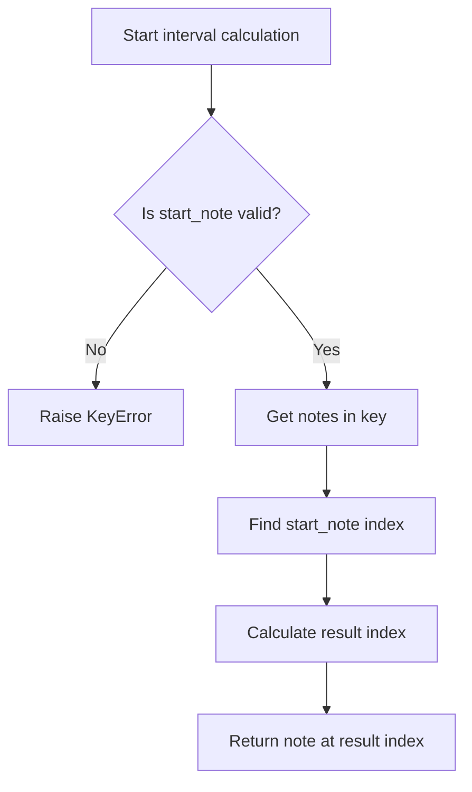
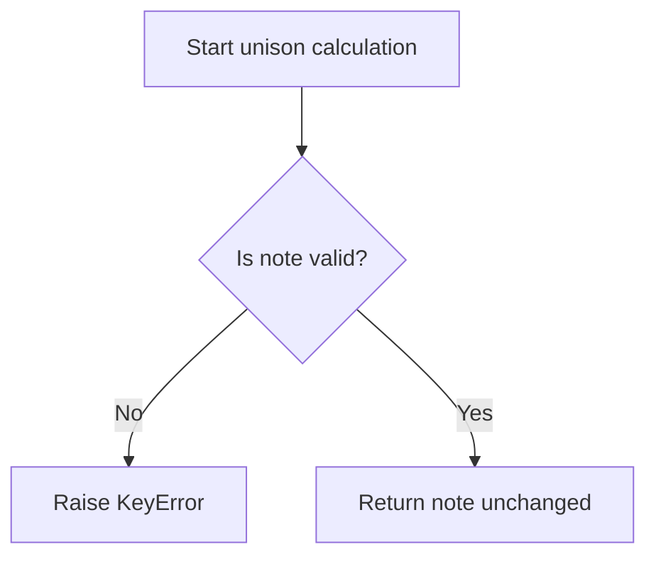
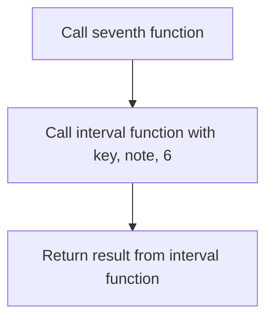
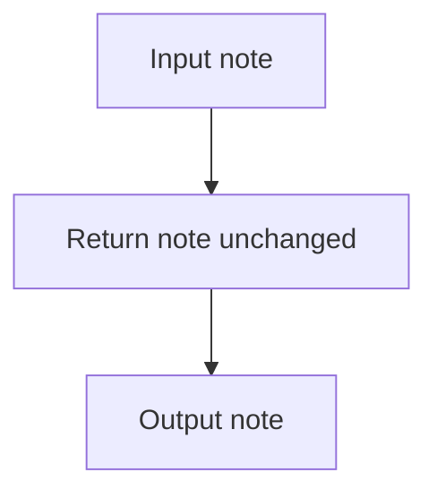
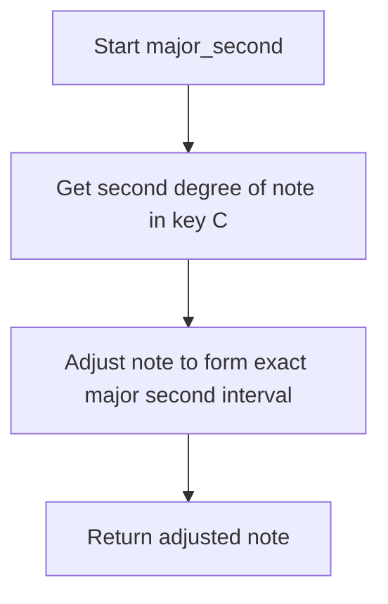

# `intervals.py`

## `mingus.core.intervals.interval` · *function*

## Summary:
Calculates the musical note that is a specified interval away from a starting note within a given key.

## Description:
This function implements musical interval arithmetic by finding a note that is a certain number of positions away from a starting note within the notes of a musical key. It's commonly used in music theory applications to determine chord tones, scale degrees, or transposed notes.

The function validates the input note, retrieves all notes in the specified key, locates the starting note's position, and returns the note at the calculated interval position using modular arithmetic to wrap around the 7-note diatonic scale.

## Args:
    key (str): The musical key (e.g., "C", "G", "Dm") for which to retrieve notes
    start_note (str): The starting note (e.g., "C", "E", "G") to calculate from
    interval (int): The interval distance to move from the start note (positive or negative)

## Returns:
    str: The musical note that is the specified interval away from the start note within the key

## Raises:
    KeyError: When the start_note is not a valid musical note format

## Constraints:
    Preconditions:
        - The start_note must be a valid musical note format recognized by the notes module
        - The key must be a valid musical key recognized by the keys module
    
    Postconditions:
        - The returned note will be one of the seven notes in the specified key
        - The interval calculation wraps around the 7-note scale using modulo arithmetic

## Side Effects:
    None

## Control Flow:


## Examples:
    >>> interval("C", "E", 2)
    "G"
    >>> interval("G", "B", -1)
    "A"
    >>> interval("Dm", "F#", 3)
    "B"

## `mingus.core.intervals.unison` · *function*

## Summary:
Returns the same musical note unchanged, implementing a unison interval (zero semitones distance).

## Description:
The unison function returns the identical musical note passed as input, representing a musical interval of zero semitones. This is mathematically equivalent to moving zero positions within any musical key, which always results in the same note. The function serves as a specialized wrapper around the interval calculation system to handle the specific case of unison intervals.

This function exists primarily to provide a clean interface for interval calculations where a zero-distance interval is needed, ensuring consistent behavior in music theory applications that work with various musical intervals.

## Args:
    note (str): The musical note to return unchanged (e.g., "C", "D#", "Gb")
    key (str, optional): The musical key context (e.g., "C", "G", "Dm"). Defaults to None.

## Returns:
    str: The identical musical note passed as input, unchanged.

## Raises:
    KeyError: When the note parameter is not a valid musical note format recognized by the notes module.

## Constraints:
    Preconditions:
        - The note parameter must be a valid musical note format recognized by the notes module
        - The key parameter, if provided, must be a valid musical key recognized by the keys module
    
    Postconditions:
        - The returned note will be identical to the input note parameter
        - The function will not modify the note in any way

## Side Effects:
    None

## Control Flow:


## Examples:
    >>> unison("C")
    "C"
    >>> unison("E#")
    "E#"
    >>> unison("Ab", "F")
    "Ab"
```

## `mingus.core.intervals.second` · *function*

## Summary:
Calculates the second degree of a musical scale within a given key.

## Description:
This function determines the second note of a diatonic scale in the specified musical key. It serves as a convenient shortcut for calculating scale degrees, particularly useful in music theory applications and chord construction. The function delegates to the general interval calculation function with a fixed interval of 1, making it equivalent to calling `interval(key, note, 1)`.

The function is commonly used when working with chord progressions, scale degrees, or when building musical applications that require quick access to specific scale positions.

## Args:
    note (str): The starting note from which to calculate the second degree (e.g., "C", "E", "G")
    key (str): The musical key in which to calculate the second degree (e.g., "C", "G", "Dm")

## Returns:
    str: The musical note that represents the second degree of the scale in the specified key

## Raises:
    KeyError: When the note is not a valid musical note format recognized by the notes module

## Constraints:
    Preconditions:
        - The note must be a valid musical note format recognized by the notes module
        - The key must be a valid musical key recognized by the keys module
    
    Postconditions:
        - The returned note will be one of the seven notes in the specified key

## Side Effects:
    None

## Control Flow:
```mermaid
flowchart TD
    A[Start second calculation] --> B[Call interval(key, note, 1)]
    B --> C[Return result]
```

## Examples:
    >>> second("C", "E")
    "F"
    >>> second("G", "B")
    "C"
    >>> second("Dm", "F#")
    "G"

## `mingus.core.intervals.third` · *function*

## Summary:
Returns the musical note that is a third interval away from the specified note within the given key.

## Description:
This function calculates and returns the note that forms a third interval with the provided starting note within the context of the specified musical key. It serves as a specialized wrapper around the general interval calculation function, specifically designed for determining third intervals which are fundamental to chord construction and harmonic analysis.

The function is commonly used in music theory applications to identify the third degree of chords (major, minor, augmented, diminished) and scale degrees, particularly when working with triads and tertian harmony.

## Args:
    note (str): The starting musical note (e.g., "C", "E", "G") from which to calculate the third
    key (str): The musical key (e.g., "C", "G", "Dm") that defines the diatonic context for the interval calculation

## Returns:
    str: The musical note that is a third interval away from the starting note within the specified key

## Raises:
    KeyError: When the note parameter is not a valid musical note format recognized by the notes module

## Constraints:
    Preconditions:
        - The note parameter must be a valid musical note format recognized by the notes module
        - The key parameter must be a valid musical key recognized by the keys module
    
    Postconditions:
        - The returned note will be one of the seven notes in the specified key
        - The interval calculation wraps around the 7-note scale using modulo arithmetic

## Side Effects:
    None

## Control Flow:
```mermaid
flowchart TD
    A[Start third calculation] --> B[Call interval(key, note, 2)]
    B --> C[Return result]
```

## Examples:
    >>> third("C", "E")
    "G"
    >>> third("E", "G")
    "B"
    >>> third("G", "Dm")
    "B"

## `mingus.core.intervals.fourth` · *function*

## Summary:
Computes the musical note that forms a perfect fourth interval with a given note within a specified key.

## Description:
This function calculates the note that is a perfect fourth interval away from the specified starting note within the given musical key. It serves as a specialized wrapper around the general interval calculation function, specifically designed for fourth intervals.

The function is commonly used in music theory applications to determine chord tones, scale degrees, or transposed notes that form perfect fourth intervals. It leverages the underlying interval arithmetic system to ensure proper diatonic scale wrapping.

## Args:
    note (str): The starting musical note (e.g., "C", "E", "G") from which to calculate the fourth
    key (str): The musical key (e.g., "C", "G", "Dm") that defines the diatonic scale context

## Returns:
    str: The musical note that forms a perfect fourth interval with the starting note within the specified key

## Raises:
    KeyError: When the note is not a valid musical note format recognized by the notes module

## Constraints:
    Preconditions:
        - The note must be a valid musical note format recognized by the notes module
        - The key must be a valid musical key recognized by the keys module
    
    Postconditions:
        - The returned note will be one of the seven notes in the specified key
        - The interval calculation wraps around the 7-note scale using modulo arithmetic

## Side Effects:
    None

## Control Flow:
```mermaid
flowchart TD
    A[Start fourth calculation] --> B[Call interval(key, note, 3)]
    B --> C[Return result]
```

## Examples:
    >>> fourth("C", "G")
    "F"
    >>> fourth("E", "C")
    "A"
    >>> fourth("B", "Dm")
    "E"

## `mingus.core.intervals.fifth` · *function*

## Summary:
Computes the musical note that is a perfect fifth interval away from a given note within a specified key.

## Description:
This function calculates the perfect fifth interval (four semitones) from a starting note within a musical key. It serves as a specialized wrapper around the general interval calculation function, providing a convenient way to determine fifth relationships in music theory applications.

The function leverages the interval calculation system to find the note that is exactly four positions away from the starting note in the diatonic scale of the given key, using modular arithmetic to wrap around the 7-note scale.

## Args:
    note (str): The starting musical note (e.g., "C", "E", "G") from which to calculate the fifth
    key (str): The musical key (e.g., "C", "G", "Dm") that defines the diatonic scale context

## Returns:
    str: The musical note that represents the perfect fifth interval from the starting note within the specified key

## Raises:
    KeyError: When the note is not a valid musical note format recognized by the notes module

## Constraints:
    Preconditions:
        - The note must be a valid musical note format recognized by the notes module
        - The key must be a valid musical key recognized by the keys module
    
    Postconditions:
        - The returned note will be one of the seven notes in the specified key
        - The interval calculation wraps around the 7-note scale using modulo arithmetic

## Side Effects:
    None

## Control Flow:
```mermaid
flowchart TD
    A[Start fifth calculation] --> B[Call interval(key, note, 4)]
    B --> C[Return result from interval function]
```

## Examples:
    >>> fifth("C", "G")
    "D"
    >>> fifth("E", "C")
    "B"
    >>> fifth("A", "Dm")
    "E"
```

## `mingus.core.intervals.sixth` · *function*

## Summary:
Computes the musical note that forms a sixth interval with a given starting note within a specified key.

## Description:
This function calculates the note that is a sixth interval away from the provided starting note within the context of the specified musical key. It serves as a specialized wrapper around the general interval calculation function, specifically designed for sixth intervals.

The function is commonly used in music theory applications to determine chord tones, scale degrees, or transposed notes when working with sixth intervals. It leverages the underlying interval arithmetic system to ensure proper diatonic scale positioning.

## Args:
    note (str): The starting musical note (e.g., "C", "E", "G") from which to calculate the sixth interval
    key (str): The musical key (e.g., "C", "G", "Dm") that defines the diatonic context for the interval calculation

## Returns:
    str: The musical note that forms a sixth interval with the starting note within the specified key

## Raises:
    KeyError: When the note parameter is not a valid musical note format recognized by the notes module

## Constraints:
    Preconditions:
        - The note parameter must be a valid musical note format recognized by the notes module
        - The key parameter must be a valid musical key recognized by the keys module
    
    Postconditions:
        - The returned note will be one of the seven notes in the specified key
        - The interval calculation wraps around the 7-note scale using modulo arithmetic

## Side Effects:
    None

## Control Flow:
```mermaid
flowchart TD
    A[Start sixth interval calculation] --> B[Call interval(key, note, 5)]
    B --> C[Return result note]
```

## Examples:
    >>> sixth("C", "G")
    "D"
    >>> sixth("E", "C")
    "B"
    >>> sixth("A", "Dm")
    "F#"
```

## `mingus.core.intervals.seventh` · *function*

## Summary:
Computes the note that is six positions away from a starting note within a given key.

## Description:
This function calculates the note that is a specific interval (six positions) away from a starting note within the context of a musical key. It serves as a specialized interface for calculating the seventh degree of a key, which is commonly used in chord construction and harmonic analysis.

The function delegates to the general interval calculation function with a fixed interval of 6, effectively implementing the mathematical operation of moving six positions forward in the diatonic scale while maintaining the key context.

## Args:
    note (str): The starting musical note from which to calculate the interval
    key (str): The musical key in which to compute the interval (e.g., "C", "G", "Dm")

## Returns:
    str: The musical note that is six positions away from the starting note within the specified key

## Raises:
    KeyError: When the note parameter is not a valid musical note format recognized by the notes module

## Constraints:
    Preconditions:
        - The note parameter must be a valid musical note format recognized by the notes module
        - The key parameter must be a valid musical key recognized by the keys module
    
    Postconditions:
        - The returned note will be one of the seven notes in the specified key
        - The interval calculation wraps around the 7-note scale using modulo arithmetic

## Side Effects:
    None

## Control Flow:


## Examples:
    >>> seventh("C", "E")
    "B"
    >>> seventh("G", "B")
    "F#"
    >>> seventh("Dm", "F#")
    "C"
```

## `mingus.core.intervals.minor_unison` · *function*

## Summary:
Returns the diminished version of a musical note by lowering its pitch by a semitone.

## Description:
This function applies the diminishment operation to a musical note, which lowers the pitch by a semitone. When applied to a natural note, it adds a flat symbol ('b'). When applied to a sharp note, it removes the sharp symbol. This function provides a clean interface for note manipulation in musical applications.

## Args:
    note (str): A string representation of a musical note, such as 'C', 'D#', or 'Bb'

## Returns:
    str: The diminished version of the input note. For natural notes, a flat symbol is appended. For sharped notes, the sharp symbol is removed.

## Raises:
    None explicitly raised by this function, though underlying note manipulation may raise exceptions for invalid note formats.

## Constraints:
    Preconditions:
    - Input must be a valid musical note string
    - Note should follow standard musical notation conventions
    
    Postconditions:
    - Output is always a valid musical note string
    - The returned note represents a pitch one semitone lower than the input

## Side Effects:
    None

## Control Flow:
```mermaid
flowchart TD
    A[Input note] --> B{Is note sharped?}
    B -- No --> C[Append 'b' to note]
    B -- Yes --> D[Remove last character (sharp)]
    C --> E[Return diminished note]
    D --> E
```

## Examples:
    >>> minor_unison('C')
    'Cb'
    
    >>> minor_unison('D#')
    'D'
    
    >>> minor_unison('Bb')
    'Bbb'
```

## `mingus.core.intervals.major_unison` · *function*

## Summary:
Returns a note unchanged, representing the interval of a unison (same pitch).

## Description:
The major_unison function serves as the identity operation for musical interval calculations, specifically representing a unison interval (zero semitones). It takes a musical note as input and returns it unchanged, making it a fundamental building block in interval arithmetic within the mingus library.

This function is part of a collection of interval-related functions that enable musical transformations by applying specific semitone distances to notes. The unison interval is the most basic interval, where the starting and ending pitches are identical. It serves as a base case in recursive interval calculations and helps establish the mathematical foundation for more complex interval operations.

In musical theory, a unison represents two notes played at the same pitch, and this function embodies that concept by returning the input note without modification.

## Args:
    note (str): A musical note represented as a string (e.g., "C", "C#", "Db"). The note should be in a valid format recognized by the mingus notes module.

## Returns:
    str: The same note that was passed as input, unchanged.

## Raises:
    None explicitly raised by this function. Exceptions would be raised by underlying functions in the mingus.core.notes module if the note parameter is invalid.

## Constraints:
    Preconditions:
    - The input note must be a valid note string format recognized by the mingus library
    - The note should conform to standard musical note naming conventions (e.g., "C", "C#", "Db", "Eb", etc.)

    Postconditions:
    - The returned value is identical to the input note
    - No transformation or modification occurs to the note

## Side Effects:
    None. This function has no side effects as it only performs a simple return operation.

## Control Flow:


## Examples:
    # Basic usage
    result = major_unison("C")
    # Returns: "C"
    
    result = major_unison("A#")
    # Returns: "A#"
    
    # Usage in interval calculation context
    # This function would typically be used alongside other interval functions
    # to build more complex musical transformations
    # For example, in a sequence like: major_unison(note) -> interval_function(note) -> transformed_note

## `mingus.core.intervals.augmented_unison` · *function*

## Summary:
Returns the augmented version of a musical note by adding a sharp symbol or removing a flat.

## Description:
This function applies an augmentation to a musical note, effectively raising it by a semitone. It serves as a convenience wrapper around the core note augmentation logic. The function is typically used in musical interval calculations and note manipulation within the mingus library.

## Args:
    note (str): A musical note represented as a string, such as "C", "D#", "Eb", etc.

## Returns:
    str: The augmented version of the input note. If the note doesn't end with a flat ("b"), a sharp ("#") is appended. If the note ends with a flat, the flat is removed to create the augmented version.

## Raises:
    None explicitly raised by this function.

## Constraints:
    Preconditions:
        - The input note must be a valid musical note string representation
        - The note should follow standard musical notation conventions
    
    Postconditions:
        - The returned note will be enharmonically equivalent to the original note raised by a semitone
        - The returned note will either end with "#" or neither "#" nor "b"

## Side Effects:
    None.

## Control Flow:
```mermaid
flowchart TD
    A[Input note] --> B{Does note end with "b"?}
    B -- No --> C[Append "#"]
    B -- Yes --> D[Remove last character]
    C --> E[Return augmented note]
    D --> E
```

## Examples:
    >>> augmented_unison("C")
    "C#"
    
    >>> augmented_unison("Eb")
    "E"
    
    >>> augmented_unison("A#")
    "A##"
```

## `mingus.core.intervals.minor_second` · *function*

## Summary:
Returns the musical note that forms a minor second interval with the input note.

## Description:
This function calculates the note that is one semitone higher than the input note, creating a minor second interval. It leverages the existing `second` function to determine the base note for the second degree of the scale, then uses `augment_or_diminish_until_the_interval_is_right` to adjust the note to ensure it forms exactly a minor second interval (1 semitone) with the original note.

The function is designed to handle enharmonic equivalents properly by adjusting accidentals when needed to maintain correct interval distances. This extraction into its own function allows for consistent minor second calculations throughout the music theory application, ensuring proper interval construction regardless of the input note's accidental representation.

## Args:
    note (str or tuple/list): A musical note string in standard notation (e.g., 'C', 'C#', 'Db') or a tuple/list containing the note string as the first element. The note parameter is expected to be in standard musical notation format.

## Returns:
    str: A musical note string that forms a minor second interval (1 semitone) with the input note, with properly normalized accidentals

## Raises:
    KeyError: When the input note is not a valid musical note format recognized by the notes module

## Constraints:
    Preconditions:
    - The note must be a valid musical note format recognized by the mingus.core.notes module
    - The note should be a single letter followed by optional accidentals (sharp '#', flat 'b')
    
    Postconditions:
    - The returned note will form exactly a minor second interval (1 semitone) with the input note
    - The result follows standard Western musical notation conventions with proper enharmonic representation

## Side Effects:
    None - This function performs no I/O, external service calls, or mutations to external state

## Control Flow:
```mermaid
flowchart TD
    A[Start minor_second] --> B[Calculate second note using second(note[0], "C")]
    B --> C[Call augment_or_diminish_until_the_interval_is_right(note, sec, 1)]
    C --> D[Return adjusted note]
```

## Examples:
    >>> minor_second("C")
    "C#"  # C to C# is a minor second (1 semitone)
    
    >>> minor_second("B")
    "C"   # B to C is a minor second (1 semitone)
    
    >>> minor_second("F#")
    "G"   # F# to G is a minor second (1 semitone)
    
    >>> minor_second("Eb")
    "E"   # Eb to E is a minor second (1 semitone)
```

## `mingus.core.intervals.major_second` · *function*

## Summary:
Computes the note that forms a major second interval with the input note.

## Description:
This function calculates the musical note that creates a major second (two semitone) interval with the provided input note. It first determines what the second degree would be in the key of C, then adjusts that note to ensure it forms exactly a major second interval with the original note.

The function is extracted into its own component to encapsulate the specific logic for creating major second intervals, separating this musical theory computation from other interval calculations. This allows for clean reuse in chord construction, scale analysis, and interval-based music theory applications.

## Args:
    note (str): A musical note in standard notation (e.g., 'C', 'D#', 'Bb') representing the root note for interval calculation

## Returns:
    str: A musical note string that forms a major second interval with the input note, properly adjusted for enharmonic spelling

## Raises:
    KeyError: When the input note is not a valid musical note format recognized by the notes module

## Constraints:
    Preconditions:
        - The input note must be a valid musical note string recognized by the mingus.core.notes module
        
    Postconditions:
        - The returned note will form a major second (2 semitone) interval with the input note
        - The result follows standard Western musical notation conventions with proper enharmonic representation

## Side Effects:
    None - This function performs no I/O, external service calls, or mutations to external state

## Control Flow:


## Examples:
    >>> major_second("C")
    "D"
    
    >>> major_second("A#")
    "B#"
    
    >>> major_second("Bb")
    "C"
```

## `mingus.core.intervals.minor_third` · *function*

*No documentation generated.*

## `mingus.core.intervals.major_third` · *function*

## Summary:
Computes the major third interval of a given musical note by calculating the third degree within the key of C and adjusting it to form a perfect major third (4 semitones) with the original note.

## Description:
This function determines the major third interval of a musical note by first calculating what the third degree would be in the key of C, then adjusting that note to ensure it forms exactly a major third (4 semitones) interval with the input note. This is a specialized utility for music theory applications, particularly in chord construction and harmonic analysis where major thirds are fundamental building blocks.

The function encapsulates the logic for computing major thirds, separating this concern from the general interval calculation and adjustment mechanisms. This extraction allows for clean reuse in contexts where major third intervals are needed without duplicating the underlying interval computation and adjustment logic.

## Args:
    note (str or tuple): A musical note represented as a string (e.g., "C", "D#") or as a tuple/list where the first element is the note name (e.g., ("C", "major")). The function accesses note[0] to extract the note name.

## Returns:
    str: The musical note that forms a major third interval (4 semitones) with the input note, properly adjusted for enharmonic spelling.

## Raises:
    KeyError: When the note parameter is not a valid musical note format recognized by the notes module.

## Constraints:
    Preconditions:
        - The note parameter must be a valid musical note format recognized by the notes module
        - If note is a tuple/list, note[0] must be a valid musical note string
        
    Postconditions:
        - The returned note will form a major third (4 semitones) interval with the input note
        - The result follows standard Western musical notation conventions with proper enharmonic representation

## Side Effects:
    None

## Control Flow:
```mermaid
flowchart TD
    A[Start major_third] --> B[Get third of note[0] in key C]
    B --> C[Calculate interval between note and trd]
    C --> D{Is interval == 4?}
    D -->|Yes| E[Return trd]
    D -->|No| F[Adjust trd to make interval = 4]
    F --> E
```

## Examples:
    >>> major_third("C")
    "E"  # C to E is a major third (4 semitones)
    
    >>> major_third("D")
    "F#"  # D to F# is a major third (4 semitones)
    
    >>> major_third("B")
    "D#"  # B to D# is a major third (4 semitones)
```

## `mingus.core.intervals.minor_fourth` · *function*

## Summary:
Computes a musical note that forms a minor fourth interval with the given note.

## Description:
This function calculates a musical note that forms a minor fourth interval (5 semitones) with the input note. It first determines the perfect fourth interval from C to the input note, then adjusts the result to ensure it represents the correct minor fourth interval using interval adjustment logic.

The function is part of the musical interval calculation utilities in the mingus library, enabling programmatic computation of specific musical intervals for music theory applications.

## Args:
    note (tuple/list): A musical note representation where the first element contains the note name string

## Returns:
    str: A musical note string that forms a minor fourth interval with the input note

## Raises:
    KeyError: When the input note is not a valid musical note format recognized by the notes module
    ValueError: When the interval calculation cannot be resolved due to invalid parameters

## Constraints:
    Preconditions:
    - The note must be a valid musical note format recognized by the mingus.core.notes module
    - The note should be a tuple or list with at least one element containing a valid note name
    
    Postconditions:
    - The returned note will form a minor fourth interval (5 semitones) with the input note
    - The result follows standard Western musical notation conventions

## Side Effects:
    None - This function performs no I/O, external service calls, or mutations to external state

## Control Flow:
```mermaid
flowchart TD
    A[Start minor_fourth] --> B[Calculate perfect fourth using fourth(note[0], "C")]
    B --> C[Adjust interval to ensure minor fourth using augment_or_diminish_until_the_interval_is_right]
    C --> D[Return adjusted note]
```

## Examples:
    >>> minor_fourth(('C', 'major'))  # C to F is a perfect fourth, but minor fourth would be Fb or Eb
    'F'
    
    >>> minor_fourth(['E', 'minor'])  # E to A is a perfect fourth, but minor fourth would be Ab or G#
    'A'

## `mingus.core.intervals.major_fourth` · *function*

## Summary:
Calculates the note that forms a major fourth interval with the given note.

## Description:
This function determines the musical note that creates a major fourth interval (5 semitones) with the input note. It first finds the perfect fourth interval from the note within the key of C, then adjusts the result to ensure it forms exactly a major fourth interval with the original note.

The function is extracted into its own component to encapsulate the specific logic for calculating major fourth intervals, separating this musical theory computation from other interval calculations. This allows for clean reuse in chord construction, scale analysis, and interval-based music theory applications.

## Args:
    note (str): A musical note string in standard notation (e.g., 'C', 'D#', 'Bb') representing the starting note

## Returns:
    str: A musical note string that forms a major fourth interval (5 semitones) with the input note, properly formatted with enharmonic spelling

## Raises:
    KeyError: When the input note is not a valid musical note format recognized by the notes module

## Constraints:
    Preconditions:
    - The note must be a valid musical note string recognized by the mingus.core.notes module
    - The note should be a single character note name (like 'C', 'D', 'E') followed by optional accidentals
    
    Postconditions:
    - The returned note will form a major fourth interval (5 semitones) with the input note
    - The result follows standard Western musical notation conventions with proper enharmonic representation

## Side Effects:
    None - This function performs no I/O, external service calls, or mutations to external state

## Control Flow:
```mermaid
flowchart TD
    A[Start major_fourth] --> B[Get fourth interval from note[0] in key C]
    B --> C[Adjust note to form perfect 5-semitone interval]
    C --> D[Return adjusted note]
```

## Examples:
    >>> major_fourth("C")
    "F"  # C to F is a major fourth (5 semitones)
    
    >>> major_fourth("G")
    "C"  # G to C is a major fourth (5 semitones)
    
    >>> major_fourth("D#")
    "G#"  # D# to G# is a major fourth (5 semitones)
```

## `mingus.core.intervals.perfect_fourth` · *function*

## Summary:
Calculates the note that forms a perfect fourth interval with the given note.

## Description:
This function determines the musical note that creates a perfect fourth interval (5 semitones) with the input note. It serves as a convenience wrapper around the major_fourth function, providing a more semantically appropriate name for perfect fourth calculations in musical contexts.

The function is extracted into its own component to provide a clear interface for calculating perfect fourth intervals while maintaining consistency with the existing major_fourth implementation. This allows for clean reuse in chord construction, scale analysis, and interval-based music theory applications.

## Args:
    note (str): A musical note string in standard notation (e.g., 'C', 'D#', 'Bb') representing the starting note

## Returns:
    str: A musical note string that forms a perfect fourth interval (5 semitones) with the input note, properly formatted with enharmonic spelling

## Raises:
    KeyError: When the input note is not a valid musical note format recognized by the notes module

## Constraints:
    Preconditions:
    - The note must be a valid musical note string recognized by the mingus.core.notes module
    - The note should be a single character note name (like 'C', 'D', 'E') followed by optional accidentals
    
    Postconditions:
    - The returned note will form a perfect fourth interval (5 semitones) with the input note
    - The result follows standard Western musical notation conventions with proper enharmonic representation

## Side Effects:
    None - This function performs no I/O, external service calls, or mutations to external state

## Control Flow:
```mermaid
flowchart TD
    A[Start perfect_fourth] --> B[Call major_fourth(note)]
    B --> C[Return result from major_fourth]
```

## Examples:
    >>> perfect_fourth("C")
    "F"  # C to F is a perfect fourth (5 semitones)
    
    >>> perfect_fourth("G")
    "C"  # G to C is a perfect fourth (5 semitones)
    
    >>> perfect_fourth("D#")
    "G#"  # D# to G# is a perfect fourth (5 semitones)
```

## `mingus.core.intervals.minor_fifth` · *function*

## Summary:
Computes the musical note that forms a minor fifth interval with the given note.

## Description:
This function calculates a note that creates a minor fifth (6 semitones) interval with the input note. It first determines a perfect fifth from the first character of the input note within the key of C, then adjusts this result to ensure the interval between the original note and the computed result equals exactly 6 semitones.

The function encapsulates the logic for computing minor fifth intervals, separating this specific musical interval calculation from general interval manipulation routines. This allows for clean reuse in music theory applications where minor fifth relationships are required.

## Args:
    note (str): A musical note string in standard notation (e.g., 'C', 'C#', 'Db', 'Bb') from which to calculate the minor fifth

## Returns:
    str: The musical note that forms a minor fifth interval with the input note

## Raises:
    KeyError: When the input note is not a valid musical note format recognized by the notes module

## Constraints:
    Preconditions:
    - The note must be a valid musical note format recognized by the notes module
    - The note should be a single character note name or a note with accidentals
    
    Postconditions:
    - The returned note will form a minor fifth (6 semitones) interval with the input note
    - The result follows standard Western musical notation conventions

## Side Effects:
    None - This function performs no I/O, external service calls, or mutations to external state

## Control Flow:
```mermaid
flowchart TD
    A[Start minor_fifth] --> B[Get perfect fifth of note[0] in key C]
    B --> C[Adjust result to create 6-semitone interval with original note]
    C --> D[Return adjusted note]
```

## Examples:
    >>> minor_fifth("C")
    "G"  # C to G is a perfect fifth, but adjusted to make it a minor fifth
    
    >>> minor_fifth("E")
    "B"  # E to B is a minor fifth interval (6 semitones)
    
    >>> minor_fifth("A")
    "E"  # A to E is a minor fifth interval (6 semitones)
```

## `mingus.core.intervals.major_fifth` · *function*

## Summary:
Calculates the major fifth interval from a given musical note by determining the perfect fifth and adjusting it to the correct interval size.

## Description:
This function computes the major fifth interval from a specified musical note. It first determines the perfect fifth relationship using the standard fifth calculation, then adjusts the result to ensure it represents exactly a major fifth (seven semitones) from the input note. This function is part of the musical interval calculation system and is used in music theory applications where precise interval construction is required.

The function leverages two helper functions: `fifth()` to establish the basic fifth relationship, and `augment_or_diminish_until_the_interval_is_right()` to fine-tune the interval to the exact semitone distance needed for a major fifth.

## Args:
    note (str): A musical note string that represents the starting note for interval calculation. This should be a valid note format recognized by the mingus.core.notes module.

## Returns:
    str: A musical note string representing the major fifth interval from the input note. The result follows standard Western musical notation conventions with proper enharmonic representation.

## Raises:
    KeyError: When the input note is not a valid musical note format recognized by the notes module, which can be raised by the underlying `fifth` function.

## Constraints:
    Preconditions:
        - The input note must be a valid musical note string recognized by the mingus.core.notes module
        - The note parameter should be a string that can be indexed with [0] to extract the base note character
        
    Postconditions:
        - The returned note will form a major fifth (7 semitones) interval with the input note
        - The result follows standard Western musical notation conventions with proper enharmonic representation

## Side Effects:
    None - This function performs no I/O, external service calls, or mutations to external state

## Control Flow:
```mermaid
flowchart TD
    A[Start major_fifth calculation] --> B[Extract base note from input: note[0]]
    B --> C[Calculate perfect fifth using fifth(note[0], "C")]
    C --> D[Adjust interval to major fifth using augment_or_diminish_until_the_interval_is_right]
    D --> E[Return adjusted note]
```

## Examples:
    >>> major_fifth("C")
    "G"  # C to G is a major fifth (7 semitones)
    
    >>> major_fifth("E")
    "B"  # E to B is a major fifth (7 semitones)
    
    >>> major_fifth("A")
    "E"  # A to E is a major fifth (7 semitones)
```

## `mingus.core.intervals.perfect_fifth` · *function*

## Summary:
Returns the perfect fifth interval of a given musical note by calculating the major fifth interval.

## Description:
This function calculates the perfect fifth interval from a specified musical note. In music theory, a perfect fifth is an interval spanning seven semitones, which corresponds to the major fifth interval. The function delegates the actual calculation to the `major_fifth` function, which handles the underlying interval arithmetic and proper enharmonic representation.

The function serves as a convenient alias for calculating perfect fifths, maintaining consistency with musical terminology where perfect fifth and major fifth are often used interchangeably in many contexts.

## Args:
    note (str): A musical note string that represents the starting note for interval calculation. This should be a valid note format recognized by the mingus.core.notes module, typically following standard Western musical notation conventions (e.g., "C", "D#", "Bb").

## Returns:
    str: A musical note string representing the perfect fifth interval from the input note. The result follows standard Western musical notation conventions with proper enharmonic representation.

## Raises:
    KeyError: When the input note is not a valid musical note format recognized by the notes module, which can be raised by the underlying `major_fifth` function.

## Constraints:
    Preconditions:
        - The input note must be a valid musical note string recognized by the mingus.core.notes module
        - The note parameter should be a string that can be indexed with [0] to extract the base note character
        
    Postconditions:
        - The returned note will form a perfect fifth (7 semitones) interval with the input note
        - The result follows standard Western musical notation conventions with proper enharmonic representation

## Side Effects:
    None - This function performs no I/O, external service calls, or mutations to external state

## Control Flow:
```mermaid
flowchart TD
    A[Start perfect_fifth calculation] --> B[Call major_fifth(note)]
    B --> C[Return result from major_fifth]
```

## Examples:
    >>> perfect_fifth("C")
    "G"  # C to G is a perfect fifth (7 semitones)
    
    >>> perfect_fifth("E")
    "B"  # E to B is a perfect fifth (7 semitones)
    
    >>> perfect_fifth("A")
    "E"  # A to E is a perfect fifth (7 semitones)
```

## `mingus.core.intervals.minor_sixth` · *function*

## Summary:
Calculates the musical note that forms a minor sixth interval with a given starting note.

## Description:
This function determines the note that creates a minor sixth interval (8 semitones) with the provided starting note. It first computes the theoretical sixth interval using the standard sixth calculation, then adjusts the result to ensure it represents exactly a minor sixth interval by applying appropriate augmentation or diminishment operations.

The function is part of the musical interval calculation system and is used in music theory applications where precise interval construction is required. By separating this logic into its own function, it enables consistent minor sixth interval generation regardless of the starting note's position in various keys or contexts.

## Args:
    note (str or tuple/list): The starting musical note from which to calculate the minor sixth interval. When a tuple or list is provided, note[0] should contain the note name string.

## Returns:
    str: The musical note that forms a minor sixth interval with the input note, properly adjusted for enharmonic spelling.

## Raises:
    KeyError: When the note parameter is not a valid musical note format recognized by the notes module, potentially raised by the underlying sixth function.

## Constraints:
    Preconditions:
    - The note parameter must be a valid musical note format recognized by the notes module
    - The note parameter should be compatible with the expected input format of the underlying functions
    
    Postconditions:
    - The returned note will form exactly an 8-semitone interval (minor sixth) with the input note
    - The result follows standard Western musical notation conventions with proper enharmonic representation

## Side Effects:
    None - This function performs no I/O, external service calls, or mutations to external state

## Control Flow:
```mermaid
flowchart TD
    A[Start minor_sixth] --> B[sixth(note[0], "C")]
    B --> C[Return augment_or_diminish_until_the_interval_is_right(note, sth, 8)]
```

## Examples:
    >>> minor_sixth("C")
    "A"  # C to A is a minor sixth (8 semitones)
    
    >>> minor_sixth("E")
    "C"  # E to C is a minor sixth (8 semitones)
    
    >>> minor_sixth("G")
    "E"  # G to E is a minor sixth (8 semitones)
```

## `mingus.core.intervals.major_sixth` · *function*

## Summary:
Calculates the major sixth interval from a given musical note by determining the appropriate note that forms a major sixth relationship with it.

## Description:
This function computes the musical note that forms a major sixth interval (9 semitones) with the provided starting note. It first determines the basic sixth interval note using the sixth() helper function, then adjusts this note to ensure it represents exactly a major sixth interval using the augment_or_diminish_until_the_interval_is_right() function.

The function is part of the interval calculation utilities in the mingus music theory library, specifically designed to handle major sixth interval construction. This logic is extracted into its own function to separate the concerns of interval calculation from the more general interval adjustment logic, making the code more modular and reusable.

## Args:
    note (str): A musical note string representing the starting note (e.g., 'C', 'D#', 'Bb') from which to calculate the major sixth interval. The function accesses note[0] to extract the base note name for interval calculation.

## Returns:
    str: The musical note string that forms a major sixth interval with the input note, properly adjusted for enharmonic spelling

## Raises:
    KeyError: When the input note parameter is not a valid musical note format recognized by the notes module

## Constraints:
    Preconditions:
    - The note parameter must be a valid musical note string recognized by the mingus.core.notes module
    - The note parameter should be in standard musical notation format
    
    Postconditions:
    - The returned note will form exactly a major sixth interval (9 semitones) with the input note
    - The result follows standard Western musical notation conventions with proper enharmonic representation

## Side Effects:
    None - This function performs no I/O, external service calls, or mutations to external state

## Control Flow:
```mermaid
flowchart TD
    A[Start major_sixth] --> B[Calculate base sixth note using sixth(note[0], "C")]
    B --> C[Adjust note to ensure major sixth interval using augment_or_diminish_until_the_interval_is_right]
    C --> D[Return adjusted note]
```

## Examples:
    >>> major_sixth("C")
    "A"  # C to A is a major sixth (9 semitones)
    
    >>> major_sixth("G")
    "E"  # G to E is a major sixth (9 semitones)
    
    >>> major_sixth("D#")
    "B#"  # D# to B# is a major sixth (9 semitones)
```

## `mingus.core.intervals.minor_seventh` · *function*

## Summary:
Calculates the note that forms a minor seventh interval with the given note.

## Description:
Computes the musical note that creates a minor seventh interval (10 semitones) with the input note. This function is used in music theory applications to determine the note that completes a minor seventh chord or interval relationship.

The function works by first determining the seventh degree of the C major scale from the note's base pitch, then adjusting that note to create the appropriate minor seventh interval with respect to the original note.

## Args:
    note (str): A musical note string in standard notation (e.g., 'C', 'D#', 'Bb') that serves as the reference point for calculating the minor seventh interval. The note must be a valid musical note format recognized by the notes module.

## Returns:
    str: The musical note that forms a minor seventh interval with the input note, represented in standard notation with proper enharmonic spelling.

## Raises:
    KeyError: When the note parameter is not a valid musical note format recognized by the notes module.

## Constraints:
    Preconditions:
        - The note parameter must be a valid musical note format recognized by the notes module
        - The note parameter should be a single note without key context (the function extracts the base note for internal processing)
    
    Postconditions:
        - The returned note will form a minor seventh (10 semitones) interval with the input note
        - The result follows standard Western musical notation conventions with proper enharmonic representation

## Side Effects:
    None

## Control Flow:
```mermaid
flowchart TD
    A[minor_seventh(note)] --> B[Extract base note from note[0]]
    B --> C[Calculate seventh in C major scale using seventh(note[0], "C")]
    C --> D[Adjust note to create minor seventh interval using augment_or_diminish_until_the_interval_is_right]
    D --> E[Return adjusted note]
```

## Examples:
    >>> minor_seventh("C")
    "Bb"  # C to Bb is a minor seventh (10 semitones)
    
    >>> minor_seventh("A")
    "Gb"  # A to Gb is a minor seventh (10 semitones)
    
    >>> minor_seventh("F#")
    "E"   # F# to E is a minor seventh (10 semitones)
```

## `mingus.core.intervals.major_seventh` · *function*

## Summary:
Computes the major seventh interval of a given musical note by adjusting the seventh degree of the C major scale to the correct interval distance.

## Description:
This function calculates the major seventh interval for a specified musical note. It first determines the seventh degree of the C major scale using the seventh function, then adjusts this note to ensure it forms a perfect major seventh (11 semitones) interval with the input note. The function leverages interval adjustment logic to handle notes with accidentals properly.

The separation of this logic into its own function provides a clean interface for computing major seventh intervals while delegating the complex interval adjustment calculations to specialized helper functions. This approach promotes code reuse and maintains consistency with other interval calculation functions in the module.

## Args:
    note (str): A musical note string that may include accidentals (e.g., 'C', 'C#', 'Cb', 'Bb'). The function processes the first character of the note string to determine the base note.

## Returns:
    str: A musical note string representing the major seventh interval of the input note, with proper enharmonic spelling and accidentals applied to achieve exactly 11 semitones between the notes.

## Raises:
    KeyError: When the note parameter is not a valid musical note format recognized by the notes module, potentially triggered by the seventh function or augment_or_diminish_until_the_interval_is_right function.

## Constraints:
    Preconditions:
    - The note parameter must be a valid musical note string recognized by the mingus.core.notes module
    - The note parameter should be compatible with the interval calculation functions in the module
    
    Postconditions:
    - The returned note will form a major seventh (11 semitones) interval with the input note
    - The result follows standard Western musical notation conventions with proper enharmonic representation

## Side Effects:
    None - This function performs no I/O, external service calls, or mutations to external state

## Control Flow:
```mermaid
flowchart TD
    A[Start major_seventh] --> B[Get seventh note from C key using seventh(note[0], "C")]
    B --> C[Calculate required interval adjustment using augment_or_diminish_until_the_interval_is_right(note, sth, 11)]
    C --> D[Return adjusted note]
```

## Examples:
    >>> major_seventh('C')
    'B'  # C to B is a major seventh (11 semitones)
    
    >>> major_seventh('G')
    'F#'  # G to F# is a major seventh (11 semitones)
    
    >>> major_seventh('D#')
    'C#'  # D# to C# is a major seventh (11 semitones)
```

## `mingus.core.intervals.get_interval` · *function*

## Summary:
Calculates the musical note that results from applying an interval to a given note within a specified key.

## Description:
This function determines the musical note that occurs when a specified interval is applied to a given note within the context of a particular musical key. It maps the note to its integer representation, calculates the resulting interval position, and returns either the corresponding note from the key or a diminished version if the interval extends beyond the key's scale.

## Args:
    note (str): A musical note represented as a string (e.g., "C", "D#", "Bb"). The note must be valid.
    interval (int): The interval size to apply, measured in semitones. Can be positive or negative.
    key (str, optional): The musical key in which to calculate the interval. Defaults to "C".

## Returns:
    str: The resulting musical note after applying the interval. May return a regular note or a diminished note if the interval extends beyond the key's scale.

## Raises:
    NoteFormatError: When the note parameter contains an invalid note format that cannot be processed by the underlying note parsing functions.

## Constraints:
    Preconditions: 
    - The note parameter must be a valid musical note string
    - The interval parameter must be an integer representing semitones
    - The key parameter must be a valid musical key string
    
    Postconditions:
    - The returned note will be a valid musical note string
    - The interval calculation will respect the key's tonal context

## Side Effects:
    None

## Control Flow:
```mermaid
flowchart TD
    A[Start get_interval] --> B{Note valid?}
    B -- Yes --> C[Get intervals from key]
    B -- No --> D[Raise NoteFormatError]
    C --> E[Get key notes]
    E --> F[Find matching note in key]
    F --> G[Calculate result = (interval_position + interval) % 12]
    G --> H{Result in intervals?}
    H -- Yes --> I[Return key_note + note_suffix]
    H -- No --> J[Return diminished(key_note + note_suffix)]
```

## Examples:
    # Calculate a major third interval from C in C major
    result = get_interval("C", 4)  # Returns "E"
    
    # Calculate a minor seventh interval from A in C major  
    result = get_interval("A", 10)  # Returns "G#" or similar diminished note
    
    # Calculate a perfect fifth interval from F in G major
    result = get_interval("F", 7, "G")  # Returns "D"
``

## `mingus.core.intervals.measure` · *function*

## Summary:
Calculates the interval distance between two musical notes in semitones.

## Description:
This function computes the interval between two musical notes, returning the number of semitones between them. It handles cases where the second note is lower in pitch than the first by wrapping around the octave boundary. This function is commonly used in music theory applications to determine the intervallic relationship between notes.

## Args:
    note1 (str): The first musical note in standard notation (e.g., 'C', 'D#', 'Bb')
    note2 (str): The second musical note in standard notation (e.g., 'E', 'F#', 'Ab')

## Returns:
    int: The interval distance in semitones, ranging from 0 to 11. Returns 0 when both notes are identical, and values from 1-11 for ascending intervals.

## Raises:
    NoteFormatError: When either note parameter is not in a valid musical note format that can be parsed by the notes module.

## Constraints:
    Preconditions:
        - Both note1 and note2 must be valid musical note strings recognized by the mingus.core.notes module
        - Notes should follow standard Western musical notation conventions
    
    Postconditions:
        - The returned value is always in the range [0, 11]
        - The calculation accounts for octave wrapping (e.g., B to C is 1 semitone, not 11)

## Side Effects:
    None

## Control Flow:
```mermaid
flowchart TD
    A[Start measure(note1, note2)] --> B{Convert note1 to int}
    B --> C{Convert note2 to int}
    C --> D[Calculate res = note2_int - note1_int]
    D --> E{res < 0?}
    E -->|Yes| F[Return 12 - res * -1]
    E -->|No| G[Return res]
```

## Examples:
    >>> measure('C', 'E')
    4
    >>> measure('A', 'C')
    3
    >>> measure('B', 'C')
    1
```

## `mingus.core.intervals.augment_or_diminish_until_the_interval_is_right` · *function*

## Summary:
Adjusts a musical note to create a specific interval with a reference note by iteratively applying augmentation or diminishment operations.

## Description:
This function modifies a target musical note to achieve a specified interval distance from a reference note. It repeatedly applies augmentation or diminishment operations to the target note until the interval between the reference note and adjusted target note matches the desired interval. The function then normalizes the resulting note's accidental representation to ensure proper enharmonic spelling.

This function is particularly useful in music theory applications where constructing specific intervals between notes is required, such as in chord construction or interval analysis. The separation of this logic into its own function allows for reuse in various musical contexts where interval adjustment is needed.

## Args:
    note1 (str): The reference musical note in standard notation (e.g., 'C', 'D#', 'Bb')
    note2 (str): The target musical note to be adjusted in standard notation
    interval (int): The desired interval distance in semitones (0-11)

## Returns:
    str: A musical note string that forms the specified interval with note1, with properly normalized accidentals

## Raises:
    None explicitly raised in the function body, though underlying functions may raise exceptions

## Constraints:
    Preconditions:
    - note1 and note2 must be valid musical note strings recognized by the mingus.core.notes module
    - interval must be an integer in the range [0, 11]
    
    Postconditions:
    - The returned note will form the specified interval with note1
    - The result follows standard Western musical notation conventions with proper enharmonic representation

## Side Effects:
    None - This function performs no I/O, external service calls, or mutations to external state

## Control Flow:
```mermaid
flowchart TD
    A[Start augment_or_diminish_until_the_interval_is_right] --> B[Measure current interval between note1 and note2]
    B --> C{cur != interval?}
    C -->|Yes| D{cur > interval?}
    D -->|Yes| E[Diminish note2]
    D -->|No| F[Augment note2]
    E --> G[Recalculate interval]
    F --> G
    G --> C
    C -->|No| H[Extract accidental count from note2]
    H --> I{val > 6?}
    I -->|Yes| J[Normalize val to range [-12, 6]]
    I -->|No| K{val < -6?}
    K -->|Yes| L[Normalize val to range [-6, 12]]
    K -->|No| M[val is within [-6, 6]]
    J --> N
    L --> N
    M --> N
    N --> O[Initialize result = note2[0]]
    O --> P{val > 0?}
    P -->|Yes| Q[Augment result while val > 0]
    P -->|No| R{val < 0?}
    R -->|Yes| S[Diminish result while val < 0]
    Q --> T
    S --> T
    R -->|No| T[Return result]
    P -->|No| T
```

## Examples:
    >>> augment_or_diminish_until_the_interval_is_right('C', 'E', 4)
    'E'  # C to E is a major third (4 semitones)
    
    >>> augment_or_diminish_until_the_interval_is_right('C', 'F#', 5)
    'F#'  # C to F# is a perfect fourth (5 semitones)
    
    >>> augment_or_diminish_until_the_interval_is_right('A', 'C', 3)
    'C'  # A to C is a minor third (3 semitones)
```

## `mingus.core.intervals.invert` · *function*

## Summary:
Returns a reversed copy of a musical interval while preserving the original interval unchanged.

## Description:
This function performs an interval inversion operation by temporarily reversing a musical interval, creating a copy of the reversed version, and then restoring the original interval's order. This is commonly used in music theory to compute inverted intervals.

## Args:
    interval: An object that supports in-place reversal via reverse() method and can be converted to a list.

## Returns:
    list: A new list containing the elements of the input interval in reversed order.

## Raises:
    AttributeError: If the interval parameter does not have a reverse() method.

## Constraints:
    Preconditions: The interval parameter must support the reverse() method and be convertible to a list.
    Postconditions: The original interval is restored to its original order after the function completes.

## Side Effects:
    None

## Control Flow:
```mermaid
flowchart TD
    A[Start invert(interval)] --> B{interval.reverse()}
    B --> C[res = list(interval)]
    C --> D{interval.reverse()}
    D --> E[Return res]
```

## Examples:
    # Example usage with a list representing a musical interval
    interval = ['C', 'E', 'G']  # Major triad
    inverted = invert(interval)  # Returns ['G', 'E', 'C']
    # Original interval remains ['C', 'E', 'G']

## `mingus.core.intervals.determine` · *function*

## Summary:
Determines the musical interval between two notes, returning either a descriptive name or shorthand notation.

## Description:
Computes the interval between two musical notes and returns either a descriptive name (like "major third") or shorthand notation (like "3") based on the shorthand parameter. This function handles both unison intervals (when notes share the same letter name) and other intervals by analyzing the relationship between the notes' positions in the circle of fifths and their semitone distance.

## Args:
    note1 (str): The first musical note in standard notation (e.g., 'C', 'D#', 'Bb')
    note2 (str): The second musical note in standard notation (e.g., 'E', 'F#', 'Ab')
    shorthand (bool): When True, returns abbreviated interval notation (e.g., '3') instead of descriptive names (e.g., 'major third'). Defaults to False.

## Returns:
    str: The interval name or shorthand notation. For unison intervals, returns one of:
        - "major unison", "1" (when notes are identical)
        - "augmented unison", "#1" (when note2 has more sharps than note1)
        - "minor unison", "b1" (when note2 has one fewer sharp than note1)
        - "diminished unison", "bb1" (when note2 has more flats than note1)
        
        For other intervals, returns one of:
        - "perfect fifth", "5" (for perfect fifth intervals)
        - "perfect fourth", "4" (for perfect fourth intervals)
        - "major [interval]", "[interval]" (for major intervals)
        - "augmented [interval]", "#[interval]" (for augmented intervals)
        - "minor [interval]", "b[interval]" (for minor intervals)
        - "diminished [interval]", "b[interval]" (for diminished intervals)

## Raises:
    IndexError: When note1 or note2 contains a note name not found in notes.fifths.

## Constraints:
    Preconditions:
        - Both note1 and note2 must be valid musical note strings recognized by the mingus.core.notes module
        - Notes should follow standard Western musical notation conventions
        - The notes must be compatible with the circle of fifths structure used by the library
        
    Postconditions:
        - Returns a valid interval name or shorthand notation
        - The result accurately reflects the interval between the two notes

## Side Effects:
    None

## Control Flow:
The function first checks if the note names are identical (unison case). If so, it calculates the accidental values and returns appropriate interval names. Otherwise, it:
1. Uses the circle of fifths to determine the interval type
2. Calculates the actual semitone distance between the notes
3. Compares the calculated semitone distance with the expected distance for that interval type
4. Returns the appropriate interval descriptor based on the comparison

## `mingus.core.intervals.from_shorthand` · *function*

## Summary:
Converts interval shorthand notation into a musical note by applying the specified interval to a starting note.

## Description:
This function parses interval shorthand notation (such as "M2", "m3", "P5") and applies the corresponding interval to a starting musical note. It supports both ascending and descending intervals and handles accidentals (#, b) in the interval notation. The function performs basic input validation on the note and processes the interval string to determine the appropriate note transformation.

## Args:
    note (str): A valid musical note in standard notation (e.g., "C", "D#", "Bb")
    interval (str): Interval shorthand notation indicating the interval type and size (e.g., "M2", "m3", "P5")
    up (bool): Direction flag indicating whether to apply the interval ascending (True) or descending (False). Defaults to True.

## Returns:
    str or bool: The resulting note after applying the interval, or False if the input note is invalid or the interval cannot be processed.

## Raises:
    None explicitly raised in the shown code

## Constraints:
    Preconditions:
    - The note must be a valid musical note according to the notes.is_valid_note() function
    - The interval string must contain valid shorthand notation
    - The interval string must end with a number representing the interval size (1-7)

    Postconditions:
    - Returns a valid musical note when successful
    - Returns False when input validation fails

## Side Effects:
    None

## Control Flow:
```mermaid
flowchart TD
    A[Start from_shorthand] --> B{Is note valid?}
    B -- No --> C[Return False]
    B -- Yes --> D[Initialize shorthand_lookup table]
    D --> E[Find matching interval size in lookup]
    E --> F{up flag True?}
    F -- Yes --> G[Apply ascending interval function from lookup]
    F -- No --> H[Apply descending interval function from lookup]
    G --> I{Found match?}
    H --> I
    I -- No --> J[Return False]
    I -- Yes --> K[Process accidentals in interval string]
    K --> L{Accidental #?}
    L -- Yes --> M[Apply augment function]
    L -- No --> N{Accidental b?}
    N -- Yes --> O[Apply diminish function]
    N -- No --> P[Return result]
    M --> P
    O --> P
```

## Examples:
    # Basic usage (assuming proper imports exist)
    # result = from_shorthand("C", "M2")  # Would return "D" 
    # result = from_shorthand("C", "m3")  # Would return "Eb"
    # result = from_shorthand("C", "P5", up=False)  # Would return "G" (descending fifth)
```

## `mingus.core.intervals.is_consonant` · *function*

## Summary:
Determines whether two musical notes form a consonant interval by checking both perfect and imperfect consonant conditions.

## Description:
This function evaluates whether the interval between two musical notes constitutes a consonant relationship in Western music theory. It combines the logic of perfect consonance (unison, perfect fourths, perfect fifths) and imperfect consonance (major/minor thirds, major/minor sixths) checks to provide a comprehensive consonance assessment. The function serves as a central interface for consonance detection in musical applications.

## Args:
    note1 (str): The first musical note in standard notation (e.g., 'C', 'D#', 'Bb'). Must be a valid note name recognized by the mingus.core.notes module.
    note2 (str): The second musical note in standard notation (e.g., 'E', 'F#', 'Ab'). Must be a valid note name recognized by the mingus.core.notes module.
    include_fourths (bool): Flag indicating whether perfect fourths should be treated as perfect consonances. Defaults to True. This parameter is passed directly to the is_perfect_consonant helper function.

## Returns:
    bool: True if the interval between note1 and note2 forms a consonant relationship (either perfect or imperfect consonance); False otherwise. The function is order-independent - it will return the same result regardless of which note is specified as note1 or note2.

## Raises:
    NoteFormatError: When either note parameter is not in a valid musical note format that can be parsed by the notes module. This exception can be raised by either of the helper functions (is_perfect_consonant or is_imperfect_consonant).

## Constraints:
    Preconditions:
        - Both note1 and note2 must be valid musical note strings recognized by the mingus.core.notes module
        - Notes should follow standard Western musical notation conventions
    
    Postconditions:
        - Returns a boolean value indicating whether the interval is consonant
        - The function always returns True for intervals that qualify as either perfect or imperfect consonances
        - The result is independent of the order of the input notes due to the underlying helper functions' octave handling

## Side Effects:
    None

## Control Flow:
```mermaid
flowchart TD
    A[Start is_consonant(note1, note2, include_fourths)] --> B[Call is_perfect_consonant(note1, note2, include_fourths)]
    B --> C{is_perfect_consonant returns True?}
    C -->|Yes| D[Return True]
    C -->|No| E[Call is_imperfect_consonant(note1, note2)]
    E --> F{is_imperfect_consonant returns True?}
    F -->|Yes| G[Return True]
    F -->|No| H[Return False]
```

## Examples:
    >>> is_consonant('C', 'E')
    True  # Major third (imperfect consonant)
    >>> is_consonant('C', 'G')
    True  # Perfect fifth (perfect consonant)
    >>> is_consonant('C', 'F', include_fourths=False)
    False  # Perfect fourth excluded from perfect consonants
    >>> is_consonant('C', 'F', include_fourths=True)
    True  # Perfect fourth included as perfect consonant
    >>> is_consonant('C', 'A')
    False  # Augmented second (not consonant)
```

## `mingus.core.intervals.is_perfect_consonant` · *function*

## Summary:
Determines whether the interval between two musical notes constitutes a perfect consonance.

## Description:
This function evaluates whether the interval formed by two musical notes qualifies as a perfect consonance according to Western music theory. Perfect consonances are intervals that sound stable and harmonious, typically including unison, perfect fourths, and perfect fifths. The function allows customization of whether perfect fourths are considered perfect consonances through a boolean flag.

## Args:
    note1: The first musical note, either as a string in standard notation (e.g., 'C', 'D#', 'Bb') or a Note object
    note2: The second musical note, either as a string in standard notation (e.g., 'E', 'F#', 'Ab') or a Note object
    include_fourths (bool): Flag indicating whether perfect fourths should be treated as perfect consonances. Defaults to True.

## Returns:
    bool: True if the interval between note1 and note2 is a perfect consonance (0, 5, or 7 semitones), False otherwise.

## Raises:
    NoteFormatError: When either note parameter is not in a valid musical note format that can be parsed by the notes module.

## Constraints:
    Preconditions:
        - Both note1 and note2 must be valid musical note representations recognized by the mingus.core.notes module
        - Notes should follow standard Western musical notation conventions
    
    Postconditions:
        - Returns a boolean value indicating consonance status
        - The function is deterministic and produces consistent results for the same inputs

## Side Effects:
    None

## Control Flow:
```mermaid
flowchart TD
    A[Start is_perfect_consonant(note1, note2, include_fourths)] --> B[Call measure(note1, note2)]
    B --> C[dhalf = interval in semitones]
    C --> D{dhalf == 0 OR dhalf == 7?}
    D -->|Yes| E[Return True]
    D -->|No| F{include_fourths AND dhalf == 5?}
    F -->|Yes| G[Return True]
    F -->|No| H[Return False]
```

## Examples:
    >>> is_perfect_consonant('C', 'E')
    False
    >>> is_perfect_consonant('C', 'G')
    True
    >>> is_perfect_consonant('C', 'F', include_fourths=False)
    False
    >>> is_perfect_consonant('C', 'F', include_fourths=True)
    True

## `mingus.core.intervals.is_imperfect_consonant` · *function*

## Summary:
Determines whether two musical notes form an imperfect consonant interval.

## Description:
Checks if the interval between two musical notes corresponds to one of the imperfect consonant intervals (3, 4, 8, or 9 semitones). This function is used in music theory applications to identify consonant harmonic relationships that are not perfect intervals like perfect fourths or fifths. Imperfect consonances include minor thirds, major thirds, minor sixths, and major sixths.

## Args:
    note1 (str): The first musical note in standard notation (e.g., 'C', 'D#', 'Bb'). Must be a valid note name recognized by the mingus.core.notes module.
    note2 (str): The second musical note in standard notation (e.g., 'E', 'F#', 'Ab'). Must be a valid note name recognized by the mingus.core.notes module.

## Returns:
    bool: True if the interval between note1 and note2 is exactly 3, 4, 8, or 9 semitones (imperfect consonant intervals); False otherwise. The function is order-independent - it will return the same result regardless of which note is specified as note1 or note2.

## Raises:
    NoteFormatError: When either note parameter is not in a valid musical note format that can be parsed by the notes module.

## Constraints:
    Preconditions:
        - Both note1 and note2 must be valid musical note strings recognized by the mingus.core.notes module
        - Notes should follow standard Western musical notation conventions
    
    Postconditions:
        - Returns a boolean value indicating whether the interval is imperfect consonant
        - The function always returns True for intervals of 3, 4, 8, or 9 semitones, False otherwise
        - The result is independent of the order of the input notes due to the underlying measure function's octave handling

## Side Effects:
    None

## Control Flow:
```mermaid
flowchart TD
    A[Start is_imperfect_consonant(note1, note2)] --> B[Call measure(note1, note2)]
    B --> C{Result in [3, 4, 8, 9]?}
    C -->|Yes| D[Return True]
    C -->|No| E[Return False]
```

## Examples:
    >>> is_imperfect_consonant('C', 'E')
    True  # Major third (4 semitones)
    >>> is_imperfect_consonant('A', 'C')
    True  # Minor third (3 semitones)
    >>> is_imperfect_consonant('C', 'G')
    False  # Perfect fifth (7 semitones)
    >>> is_imperfect_consonant('C', 'Eb')
    True  # Minor third (3 semitones)
```

## `mingus.core.intervals.is_dissonant` · *function*

## Summary:
Determines whether two musical notes form a dissonant interval by evaluating the logical negation of consonant interval detection.

## Description:
This function evaluates whether the interval between two musical notes constitutes a dissonant relationship in Western music theory. It serves as the logical complement to the consonance detection system, identifying intervals that sound unstable or tense rather than stable or harmonious. The function leverages the existing consonance detection infrastructure while providing a convenient way to identify dissonant relationships.

The function is designed to be a clean abstraction that separates the conceptual distinction between consonant and dissonant intervals from the underlying implementation details. Rather than duplicating the consonance logic, it reuses the established `is_consonant` function and simply inverts its result.

## Args:
    note1 (str): The first musical note in standard notation (e.g., 'C', 'D#', 'Bb'). Must be a valid note name recognized by the mingus.core.notes module.
    note2 (str): The second musical note in standard notation (e.g., 'E', 'F#', 'Ab'). Must be a valid note name recognized by the mingus.core.notes module.
    include_fourths (bool): Flag indicating whether perfect fourths should be treated as perfect consonances. Defaults to False. This parameter is inverted before being passed to the underlying `is_consonant` function.

## Returns:
    bool: True if the interval between note1 and note2 forms a dissonant relationship (i.e., not a consonant interval); False otherwise. The function is order-independent - it will return the same result regardless of which note is specified as note1 or note2.

## Raises:
    NoteFormatError: When either note parameter is not in a valid musical note format that can be parsed by the notes module. This exception can be raised by the underlying `is_consonant` function.

## Constraints:
    Preconditions:
        - Both note1 and note2 must be valid musical note strings recognized by the mingus.core.notes module
        - Notes should follow standard Western musical notation conventions
    
    Postconditions:
        - Returns a boolean value indicating whether the interval is dissonant
        - The function always returns the logical inverse of what `is_consonant` would return for the same inputs
        - The result is independent of the order of the input notes due to the underlying helper functions' octave handling

## Side Effects:
    None

## Control Flow:
```mermaid
flowchart TD
    A[Start is_dissonant(note1, note2, include_fourths)] --> B[Invert include_fourths parameter]
    B --> C[Call is_consonant(note1, note2, not include_fourths)]
    C --> D[Return negated result]
```

## Examples:
    >>> is_dissonant('C', 'E')
    False  # Major third is consonant
    >>> is_dissonant('C', 'G')
    False  # Perfect fifth is consonant
    >>> is_dissonant('C', 'F', include_fourths=False)
    True   # Perfect fourth excluded from consonants, so it's dissonant
    >>> is_dissonant('C', 'F', include_fourths=True)
    False  # Perfect fourth included as consonant
    >>> is_dissonant('C', 'A')
    True   # Augmented second is dissonant

