# `keys.py`

## `mingus.core.keys.is_valid_key` · *function*

## Summary:
Checks whether a given musical key is valid by verifying its presence in a predefined collection of valid key signatures.

## Description:
This function validates musical keys by testing membership against a module-level collection of valid key representations. It's designed to ensure that only recognized musical keys are accepted in the system, preventing invalid key specifications from being processed further in the music theory pipeline.

The function is extracted into its own utility to provide centralized validation logic for musical keys throughout the mingus library, enforcing a clear boundary between key representation and key validation. This separation allows for consistent key validation across different parts of the library while keeping the validation logic in one place.

## Args:
    key (any): The musical key to validate. This parameter is checked for membership in each tuple/list within the module-level `keys` collection.

## Returns:
    bool: True if the key exists in any of the predefined key couples, False otherwise.

## Raises:
    None explicitly raised by this function.

## Constraints:
    Preconditions:
    - The module-level variable `keys` must be defined and contain iterable collections of valid key representations
    - The `key` parameter should be of a comparable type to elements in the `keys` collections
    - The `keys` variable must be initialized before calling this function
    
    Postconditions:
    - The function returns a boolean value indicating validity status
    - No side effects occur during execution

## Side Effects:
    None - This function performs only pure validation without any I/O operations or state mutations.

## Control Flow:
```mermaid
flowchart TD
    A[Start is_valid_key(key)] --> B{key in keys?}
    B -- Yes --> C[Return True]
    B -- No --> D[Return False]
```

## Examples:
    # Assuming keys contains tuples like (('C', 'D'), ('G', 'A'), ('D', 'E'))
    is_valid_key('C')  # Returns True if 'C' is found in any tuple
    is_valid_key('F')  # Returns False if 'F' is not found in any tuple

## `mingus.core.keys.get_key` · *function*

## Summary:
Returns the musical key representation for a given number of accidentals.

## Description:
This function maps a numerical representation of accidentals (sharps or flats) to a corresponding musical key. The mapping handles keys with between -7 and +7 accidentals, where 0 represents no accidentals (like C major/A minor). The function uses offset indexing to access an internal keys array where index 0 corresponds to -7 accidentals, index 15 corresponds to +7 accidentals.

## Args:
    accidentals (int): Number of accidentals, ranging from -7 (seven flats) to +7 (seven sharps). Defaults to 0.

## Returns:
    The musical key representation corresponding to the specified number of accidentals. The exact return type and value depend on the internal `keys` array implementation.

## Raises:
    RangeError: When the accidentals parameter is outside the valid range of -7 to +7 inclusive.

## Constraints:
    Preconditions:
        - The accidentals parameter must be an integer
        - The accidentals parameter must be within the range [-7, 7]
    
    Postconditions:
        - Returns a valid musical key representation from the internal keys array
        - The returned value is indexed by (accidentals + 7)

## Side Effects:
    None

## Control Flow:
```mermaid
flowchart TD
    A[get_key called] --> B{accidentals in [-7,7]?}
    B -- No --> C[raise RangeError]
    B -- Yes --> D[return keys[accidentals + 7]]
    C --> E[Exception raised]
    D --> E[Value returned]
```

## Examples:
    # Get key with no accidentals (C major/A minor)
    key = get_key(0)
    
    # Get key with 2 sharps (D major/F# minor)  
    key = get_key(2)
    
    # Get key with 3 flats (Bb major/G minor)
    key = get_key(-3)
    
    # This would raise RangeError
    # key = get_key(10)
```

## `mingus.core.keys.get_key_signature` · *function*

## Summary:
Calculates the number of accidentals for a given musical key signature.

## Description:
This function computes the accidental count for a musical key by locating it within a predefined collection of key signatures and applying a mathematical transformation. It returns positive values for sharps, negative values for flats, and zero for keys with no accidentals.

The function serves as a utility for music theory applications requiring key signature calculations, separating validation from computation logic.

## Args:
    key (str): The musical key to calculate the signature for. Must be a valid key string. Defaults to "C".

## Returns:
    int: The number of accidentals for the given key. Positive values indicate sharps, negative values indicate flats, and zero indicates no accidentals.

## Raises:
    NoteFormatError: When the provided key string is not recognized or valid according to the module's key validation rules.

## Constraints:
    Preconditions:
    - The key parameter must be a valid key as determined by the is_valid_key() function
    - The module-level keys variable must be defined and contain the key signatures in a specific arrangement
    - The keys variable must be structured such that the index-based calculation produces meaningful accidental counts
    
    Postconditions:
    - The returned integer represents the accidental count for the key according to the internal keys arrangement
    - No side effects occur during execution

## Side Effects:
    None - This function performs only pure calculation without any I/O operations or state mutations.

## Control Flow:
```mermaid
flowchart TD
    A[Start get_key_signature(key)] --> B{is_valid_key(key)?}
    B -- No --> C[Raise NoteFormatError]
    B -- Yes --> D[Iterate through keys collection]
    D --> E{key in current_couple?}
    E -- No --> F[Continue searching]
    E -- Yes --> G[accidentals = keys.index(couple) - 7]
    G --> H[Return accidentals]
```

## Examples:
    # Basic usage
    get_key_signature("C")  # Returns 0 (no accidentals)
    get_key_signature("G")  # Returns 1 (one sharp)
    get_key_signature("F")  # Returns -1 (one flat)
```

## `mingus.core.keys.get_key_signature_accidentals` · *function*

## Summary:
Returns a list of accidental notes for a given musical key signature, formatted as sharps or flats.

## Description:
This function calculates the specific accidental notes (sharps or flats) required for a musical key signature. It determines whether the key requires sharps or flats, and returns them in proper musical notation format. The function operates on the circle-of-fifths principle where sharps are added in ascending order (F-C-G-D-A-E-B) and flats are added in descending order (B-E-A-D-G-C-F).

The function serves as a utility for music theory applications that need to display key signatures in standard notation format. By separating the calculation of accidental count from the formatting of those accidentals, it provides clean abstraction for key signature representation.

## Args:
    key (str): The musical key for which to generate accidentals. Must be a valid key string. Defaults to "C".

## Returns:
    list[str]: A list of note names with accidentals (either "#" for sharps or "b" for flats) required for the key signature. Returns an empty list for keys with no accidentals (like C major or A minor).

## Raises:
    NoteFormatError: When the provided key string is not recognized or valid according to the module's key validation rules.

## Constraints:
    Preconditions:
    - The key parameter must be a valid key as determined by the underlying key validation system
    - The module-level notes.fifths must be defined as a sequence of notes in circle-of-fifths order
    
    Postconditions:
    - The returned list contains properly formatted note names with accidentals
    - Each note in the result corresponds to the correct position in the key signature
    - When accidentals equals 0, an empty list is returned

## Side Effects:
    None - This function performs only pure calculation without any I/O operations or state mutations.

## Control Flow:
```mermaid
flowchart TD
    A[Start get_key_signature_accidentals(key)] --> B[Call get_key_signature(key)]
    B --> C{accidentals < 0?}
    C -- Yes --> D[Reverse notes.fifths and append "b"]
    C -- No --> E{accidentals > 0?}
    E -- Yes --> F[Use notes.fifths and append "#"]
    E -- No --> G[Return empty list]
    D --> H[Return result]
    F --> H
    G --> H
```

## `mingus.core.keys.get_notes` · *function*

## Summary:
Generates a list of the seven notes in a musical key, including appropriate accidentals for sharps or flats.

## Description:
This function constructs the complete set of notes for a given musical key by combining the basic scale notes with any required sharps or flats based on the key signature. It caches results for performance optimization and validates key formats before processing.

The function is extracted into its own utility to encapsulate the complex logic of musical key construction, separating concerns between key validation, signature calculation, and note generation. This modular approach enables efficient reuse across different music theory applications while maintaining clean separation of responsibilities.

## Args:
    key (str, optional): The musical key for which to generate notes. Defaults to "C". Must be a valid key string recognized by the module's validation system.

## Returns:
    list[str]: A list of seven note names in the specified key, with proper accidentals applied. For example, "C" returns ["C", "D", "E", "F", "G", "A", "B"], while "G" returns ["G", "A", "B", "C", "D", "E", "F#"]. Each note is represented as a string with appropriate accidental symbols.

## Raises:
    NoteFormatError: When the provided key string is not recognized or valid according to the module's key validation rules.

## Constraints:
    Preconditions:
    - The key parameter must be a valid key as determined by the is_valid_key() function
    - The module-level base_scale must be defined as a sequence of note names in proper order (typically ['C', 'D', 'E', 'F', 'G', 'A', 'B'])
    - The module-level _key_cache must be initialized as a dictionary for caching results
    - The get_key_signature() and get_key_signature_accidentals() functions must be available and working correctly
    
    Postconditions:
    - The returned list always contains exactly seven note names
    - All note names are properly formatted with accidentals when needed
    - Results are cached in the _key_cache dictionary for subsequent calls with the same key

## Side Effects:
    - Modifies the global _key_cache dictionary by storing computed results for future use
    - No other I/O operations or external state mutations occur

## Control Flow:
```mermaid
flowchart TD
    A[Start get_notes(key)] --> B{key in _key_cache?}
    B -- Yes --> C[Return cached result]
    B -- No --> D{is_valid_key(key)?}
    D -- No --> E[Raise NoteFormatError]
    D -- Yes --> F[Get altered_notes from get_key_signature_accidentals()]
    F --> G[Get accidentals count from get_key_signature()]
    G --> H{accidentals < 0?}
    H -- Yes --> I[symbol = "b"]
    H -- No --> J{accidentals > 0?}
    J -- Yes --> K[symbol = "#"]
    J -- No --> L[symbol = ""]
    I --> M
    K --> M
    L --> M
    M --> N[Get raw_tonic_index from base_scale.index()]
    N --> O[Generate 7 notes using cycle and islice]
    O --> P{note in altered_notes?}
    P -- Yes --> Q[Append note + symbol]
    P -- No --> R[Append note]
    Q --> S
    R --> S
    S --> T[Cache result in _key_cache]
    T --> U[Return result]
```

## Examples:
    # Get notes for C major (no accidentals)
    get_notes("C")  # Returns ["C", "D", "E", "F", "G", "A", "B"]
    
    # Get notes for G major (one sharp)
    get_notes("G")  # Returns ["G", "A", "B", "C", "D", "E", "F#"]
    
    # Get notes for F major (one flat)
    get_notes("F")  # Returns ["F", "G", "A", "Bb", "C", "D", "E"]
    
    # Default behavior with no arguments
    get_notes()  # Equivalent to get_notes("C")
```

## `mingus.core.keys.relative_major` · *function*

## Summary:
Maps a minor key to its relative major key by searching a predefined key relationship database.

## Description:
This function implements the musical relationship between relative major and minor keys. In music theory, every major key has a relative minor key that shares the same key signature. This function finds the corresponding relative major key for a given minor key by searching through a database of key relationships.

The function is extracted into its own component to encapsulate the logic for key conversion, separating the concern of key mapping from other musical operations and providing a reusable utility for working with relative key relationships.

## Args:
    key (str): A string representation of a minor key that should match the second element of a tuple in the keys database.

## Returns:
    str: The relative major key corresponding to the input minor key. The function returns the first element of the tuple in the keys database where the second element matches the input key.

## Raises:
    NoteFormatError: When the input key is not found in the keys database as a minor key. This occurs when no matching entry is found where the key equals the second element of any tuple in the keys collection.

## Constraints:
    Preconditions:
    - The input key must be a string that can be compared to the second elements of tuples in the keys database
    - The global `keys` variable must be properly initialized with key relationship data as a collection of tuples
    - Each tuple in the keys database must contain at least two elements where the second element represents a minor key and the first element represents its relative major key
    
    Postconditions:
    - If successful, returns a string that is the first element of a matching tuple in the keys database
    - If unsuccessful, raises NoteFormatError with descriptive message

## Side Effects:
    None: This function is pure and has no side effects beyond raising exceptions.

## Control Flow:
```mermaid
flowchart TD
    A[Start relative_major(key)] --> B{Is key equal to couple[1] for any couple in keys?}
    B -->|Yes| C[Return couple[0]]
    B -->|No| D[Raise NoteFormatError]
```

## Examples:
```python
# Convert A minor to its relative major
major_key = relative_major("a")  # Returns the relative major key string

# Convert F# minor to its relative major  
major_key = relative_major("f#")  # Returns the relative major key string

# Attempt to convert invalid key raises exception
try:
    relative_major("invalid")
except NoteFormatError as e:
    print(f"Error: {e}")  # Error: 'invalid' is not a minor key
```

## `mingus.core.keys.relative_minor` · *function*

## Summary:
Maps a major key to its relative minor key using an internal key mapping.

## Description:
This function implements a lookup mechanism to find the relative minor key for a given major key. It searches through an internal data structure called `keys` which contains pairs of major keys and their corresponding relative minors. This function serves as a clean interface for accessing relative minor key relationships in music theory applications.

## Args:
    key (str): A major key identifier that should match the first element of a pair in the internal keys mapping.

## Returns:
    str: The relative minor key that corresponds to the input major key, represented as the second element of the matching pair in the keys mapping.

## Raises:
    NoteFormatError: Raised when the input key is not found in the internal keys mapping, indicating the key is not a recognized major key.

## Constraints:
    Preconditions:
        - Input key must be a string that exists as the first element in at least one pair within the internal keys structure
        - The internal keys structure must be properly initialized before calling this function
    
    Postconditions:
        - Returns a string representing the relative minor key
        - Raises NoteFormatError if key is not found in the keys mapping

## Side Effects:
    None

## Control Flow:


```mermaid
flowchart TD
    A[Input key] --> B{Search keys mapping for key}
    B -- Match found --> C[Return corresponding minor key]
    B -- No match --> D[Raise NoteFormatError]
```

## `mingus.core.keys.Key` · *class*

## Summary:
Represents a musical key with its mode, signature, and formatted name.

## Description:
The Key class encapsulates musical key information including the base note, major/minor mode, formatted display name, and key signature. It is used in music theory applications to represent and compare musical keys. This class is typically instantiated by passing a key string like "C", "a", "G#", or "Bb" to the constructor.

## State:
- key (str): The base key identifier (e.g., "C", "a", "G#"). First character determines mode.
- mode (str): Either "major" or "minor" based on case of first character (uppercase = major, lowercase = minor)
- name (str): Formatted display name (e.g., "C major", "A minor", "G sharp major", "B flat major")
- signature (int): The key signature value representing number of sharps (positive) or flats (negative), calculated by get_key_signature()

## Lifecycle:
- Creation: Instantiate with a key string (defaults to "C"). The constructor parses the key to determine mode and format the name.
- Usage: Access properties or use equality comparison methods (__eq__, __ne__)
- Destruction: Standard Python object cleanup

## Method Map:
```mermaid
graph TD
    A[Key(key="C")] --> B[key property set]
    A --> C[mode property set based on first char case]
    A --> D[symbol parsing for accidentals]
    A --> E[name property set with formatted name]
    A --> F[signature property set via get_key_signature]
    B --> G[__eq__ method]
    C --> G
    D --> G
    E --> G
    F --> G
```

## Raises:
- NoteFormatError: Raised by get_key_signature() when the key string is invalid
- IndexError: May occur in symbol parsing if key string is too short, though handled by try/except block

## Example:
```python
# Create major key
c_major = Key("C")
print(c_major.name)  # "C major"
print(c_major.mode)  # "major"
print(c_major.key)   # "C"

# Create minor key  
a_minor = Key("a")
print(a_minor.name)  # "A minor"
print(a_minor.mode)  # "minor"

# Create sharp key
g_sharp = Key("G#")
print(g_sharp.name)  # "G sharp major"

# Create flat key
b_flat = Key("Bb")
print(b_flat.name)  # "B flat major"

# Compare keys
key1 = Key("G")
key2 = Key("G")
print(key1 == key2)  # True
```

### `mingus.core.keys.Key.__init__` · *method*

## Summary:
Initializes a musical key object with its name, mode, and signature based on the provided key string.

## Description:
The Key constructor processes a musical key specification string to determine the key's mode (major or minor), format its display name with proper capitalization and accidentals, and calculate its signature. This method is called during object instantiation to set up all necessary attributes for representing a musical key.

## Args:
    key (str): The musical key to initialize, defaults to "C". Should be a valid key string that can be processed by the key validation system.

## Returns:
    None: This method initializes instance attributes but does not return a value.

## Raises:
    NoteFormatError: When the provided key string is not recognized or valid according to the module's key validation rules, specifically when get_key_signature() raises this exception.

## State Changes:
    Attributes READ: self.key
    Attributes WRITTEN: self.key, self.mode, self.name, self.signature

## Constraints:
    Preconditions:
    - The key parameter must be a string that can be processed by the key validation system
    - The key must be valid according to the is_valid_key() function
    - The module-level keys collection must be properly initialized
    
    Postconditions:
    - self.key is set to the provided key string
    - self.mode is set to either "major" or "minor" based on the first character of the key
    - self.name is formatted as "{FirstLetterCapitalized} {AccidentalType} {Mode}"
    - self.signature is set to the calculated accidental count for the key

## Side Effects:
    None: This method performs only internal state initialization without external I/O or mutations.

### `mingus.core.keys.Key.__eq__` · *method*

## Summary:
Compares two Key objects for equality based on their key names.

## Description:
Implements the equality comparison operation for Key objects. This method determines whether two Key instances represent the same musical key by comparing their internal `key` attribute values. It is part of Python's special methods for implementing comparison operators and enables using the `==` operator between Key objects.

The method is called during equality checks such as `key1 == key2` and returns True if both objects have identical key names, False otherwise. This implementation focuses solely on the key name comparison, ignoring other attributes like mode or signature.

Known callers:
- Direct usage in `__ne__` method: When `key1 != key2` is evaluated, Python internally calls `not key1.__eq__(key2)`
- Direct operator usage: When using the `==` operator between two Key objects

This logic is implemented as its own method rather than being inlined because it follows Python's standard protocol for implementing equality comparisons and allows for consistent behavior across all equality-related operations in the class.

## Args:
    other (Key): Another Key object to compare with this instance. Must have a `key` attribute.

## Returns:
    bool: True if both Key objects have the same key name, False otherwise

## Raises:
    AttributeError: When the `other` parameter does not have a `key` attribute, which occurs if it's not a Key instance or lacks the required attribute.

## State Changes:
    Attributes READ: self.key, other.key
    Attributes WRITTEN: None

## Constraints:
    Preconditions:
    - The `other` parameter must be a Key instance (or at least have a `key` attribute)
    - Both self.key and other.key must be comparable (typically strings)
    
    Postconditions:
    - Returns a boolean value indicating equality of the key names
    - Does not modify either Key object's state

## Side Effects:
    None - This method performs only in-memory comparisons without any I/O operations or external service calls

### `mingus.core.keys.Key.__ne__` · *method*

## Summary:
Implements the not-equal comparison operation for musical key objects, returning True when two keys are different.

## Description:
This special method defines the behavior of the != operator for Key instances. It returns the logical negation of the equality comparison between this key and another object. The method delegates to the `__eq__` method to determine equality and then negates the result.

This method is part of Python's rich comparison protocol and enables intuitive comparison operations between Key objects. It's typically called during expressions like `key1 != key2` or when using functions that rely on comparison operators.

## Args:
    other (object): Another object to compare with this Key instance. While the method will attempt comparison with any object type, it's designed to work with other Key instances or objects that support key comparison.

## Returns:
    bool: True if this key is not equal to the other object, False otherwise. When comparing with non-Key objects, the behavior depends on the `__eq__` method implementation.

## Raises:
    None explicitly raised, though underlying comparison operations may raise exceptions if the other object is incompatible.

## State Changes:
    Attributes READ: 
    - self.key: Used in the delegated `__eq__` method call
    - self.mode: Used in the delegated `__eq__` method call
    
    Attributes WRITTEN: None

## Constraints:
    Preconditions:
    - The `other` parameter can be any object type, though meaningful comparisons are expected with Key instances
    - The `__eq__` method must be properly implemented to handle the comparison with the `other` object
    
    Postconditions:
    - The return value is the logical negation of `self.__eq__(other)`
    - No modifications are made to the Key instance's state

## Side Effects:
    None - This method performs only comparison operations without any I/O, external service calls, or state mutations.

