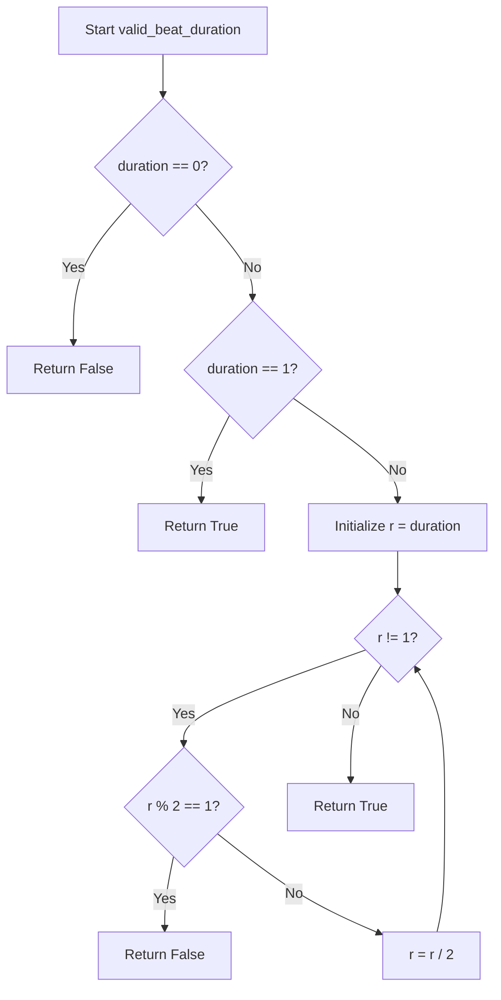

# `meter.py`

## `mingus.core.meter.valid_beat_duration` · *function*

## Summary:
Determines whether a given duration value represents a valid beat duration in musical meter calculations.

## Description:
Validates if a duration is a power of 2, which is required for valid musical beat durations. This function is used to ensure that rhythmic values conform to standard musical notation where beats are typically represented as powers of 2 (whole note, half note, quarter note, eighth note, etc.).

## Args:
    duration (int): The duration value to validate. Must be a positive integer representing a musical duration.

## Returns:
    bool: True if the duration is a valid beat duration (i.e., a power of 2), False otherwise.

## Raises:
    None

## Constraints:
    Preconditions:
        - Duration must be a non-negative integer
    Postconditions:
        - Returns boolean value indicating validity of the duration as a beat duration

## Side Effects:
    None

## Control Flow:


## Examples:
    >>> valid_beat_duration(1)
    True
    >>> valid_beat_duration(2)
    True
    >>> valid_beat_duration(4)
    True
    >>> valid_beat_duration(3)
    False
    >>> valid_beat_duration(0)
    False

## `mingus.core.meter.is_valid` · *function*

## Summary:
Validates whether a musical meter specification is properly formatted with a positive beat count and a valid beat duration.

## Description:
Checks if a meter tuple contains a positive number of beats and a valid beat duration. This function ensures that musical meter specifications conform to standard notation requirements where the beat count must be positive and the beat duration must be a power of 2 (whole note, half note, quarter note, etc.). The function is used internally to validate meter configurations before processing musical rhythms.

## Args:
    meter (tuple[int, int]): A tuple containing two integer elements where:
        - meter[0] (int): Number of beats in the meter, must be a positive integer (> 0)
        - meter[1] (int): Beat duration value, must be a valid beat duration (positive power of 2)

## Returns:
    bool: True if the meter is valid (meter[0] > 0 and meter[1] is a valid beat duration), False otherwise

## Raises:
    None

## Constraints:
    Preconditions:
        - meter must be a tuple-like object with at least 2 elements
        - meter[0] must be a positive integer
        - meter[1] must be an integer that can be validated by valid_beat_duration
        
    Postconditions:
        - Returns boolean value indicating whether the meter specification is valid

## Side Effects:
    None

## Control Flow:
```mermaid
flowchart TD
    A[Start is_valid] --> B{meter[0] > 0?}
    B -- No --> C[Return False]
    B -- Yes --> D{valid_beat_duration(meter[1])?}
    D -- No --> E[Return False]
    D -- Yes --> F[Return True]
```

## Examples:
    >>> is_valid((4, 4))
    True
    >>> is_valid((3, 8))
    True
    >>> is_valid((0, 4))
    False
    >>> is_valid((4, 3))
    False
    >>> is_valid((1, 1))
    True
    >>> is_valid((-1, 4))
    False
```

## `mingus.core.meter.is_compound` · *function*

## Summary:
Determines whether a musical meter specification represents a compound meter, where the primary beat is divisible by 3.

## Description:
Checks if a given meter tuple represents a compound meter by validating that it's a valid meter and that the number of beats per measure is divisible by 3 and at least 6. Compound meters in music theory are those where the primary beat is subdivided into three equal parts rather than two. This function is used to identify compound time signatures such as 6/8, 9/8, 12/8, etc.

## Args:
    meter (tuple[int, int]): A tuple representing a musical meter where:
        - meter[0] (int): Number of beats in the measure, must be a positive integer
        - meter[1] (int): Beat duration value, must be a valid beat duration (positive power of 2)

## Returns:
    bool: True if the meter is a compound meter (valid meter with beat count divisible by 3 and ≥ 6), False otherwise

## Raises:
    None

## Constraints:
    Preconditions:
        - meter must be a tuple-like object with at least 2 elements
        - meter[0] must be a positive integer
        - meter[1] must be a valid beat duration (positive power of 2)
        
    Postconditions:
        - Returns boolean value indicating whether the meter is compound

## Side Effects:
    None

## Control Flow:
```mermaid
flowchart TD
    A[Start is_compound] --> B{is_valid(meter)?}
    B -- No --> C[Return False]
    B -- Yes --> D{meter[0] % 3 == 0?}
    D -- No --> E[Return False]
    D -- Yes --> F{6 <= meter[0]?}
    F -- No --> G[Return False]
    F -- Yes --> H[Return True]
```

## Examples:
    >>> is_compound((6, 8))
    True
    >>> is_compound((9, 8))
    True
    >>> is_compound((12, 8))
    True
    >>> is_compound((4, 4))
    False
    >>> is_compound((3, 8))
    False
    >>> is_compound((6, 4))
    False
```

## `mingus.core.meter.is_simple` · *function*

## Summary:
Determines whether a musical meter specification represents a simple meter, which is a valid meter that is not a compound meter.

## Description:
Checks if a musical meter is a simple meter by verifying that it is a valid meter specification and that it is not a compound meter. Simple meters in music theory are those where the primary beat is subdivided into two equal parts rather than three. This function serves as a convenience wrapper around the validation logic, ensuring that only valid simple meters are accepted.

This function is typically called during musical meter processing to distinguish between simple and compound time signatures. It's used in contexts where only simple meters (like 4/4, 3/4, 2/4) are acceptable, excluding compound meters (like 6/8, 9/8, 12/8).

## Args:
    meter (tuple[int, int]): A tuple representing a musical meter where:
        - meter[0] (int): Number of beats in the measure, must be a positive integer
        - meter[1] (int): Beat duration value, must be a valid beat duration (positive power of 2)

## Returns:
    bool: True if the meter is a valid simple meter (valid meter that is not compound), False otherwise

## Raises:
    None

## Constraints:
    Preconditions:
        - meter must be a tuple-like object with at least 2 elements
        - meter[0] must be a positive integer
        - meter[1] must be a valid beat duration (positive power of 2)
        
    Postconditions:
        - Returns boolean value indicating whether the meter is a simple meter

## Side Effects:
    None

## Control Flow:
```mermaid
flowchart TD
    A[Start is_simple] --> B{is_valid(meter)?}
    B -- No --> C[Return False]
    B -- Yes --> D{is_compound(meter)?}
    D -- Yes --> E[Return False]
    D -- No --> F[Return True]
```

## Examples:
    >>> is_simple((4, 4))
    True
    >>> is_simple((3, 4))
    True
    >>> is_simple((2, 4))
    True
    >>> is_simple((6, 8))
    False
    >>> is_simple((9, 8))
    False
    >>> is_simple((0, 4))
    False
    >>> is_simple((4, 3))
    False

## `mingus.core.meter.is_asymmetrical` · *function*

## Summary:
Determines whether a musical meter specification is asymmetrical by checking if it has an odd number of beats.

## Description:
Validates a musical meter and determines if it is asymmetrical by testing whether the number of beats in the meter is odd. This function is used to identify meters that do not have an even division of beats, which can affect rhythmic patterns and musical phrasing. The function first ensures the meter is valid before performing the asymmetry check.

## Args:
    meter (tuple[int, int]): A musical meter specification consisting of two integers where:
        - meter[0] (int): Number of beats in the meter, must be a positive integer (> 0)
        - meter[1] (int): Beat duration value, must be a valid beat duration (positive power of 2)

## Returns:
    bool: True if the meter is valid and has an odd number of beats, False otherwise

## Raises:
    None

## Constraints:
    Preconditions:
        - meter must be a tuple-like object with at least 2 elements
        - meter[0] must be a positive integer
        - meter[1] must be an integer that can be validated by valid_beat_duration
        
    Postconditions:
        - Returns boolean value indicating whether the meter is asymmetrical

## Side Effects:
    None

## Control Flow:
```mermaid
flowchart TD
    A[Start is_asymmetrical] --> B{is_valid(meter)?}
    B -- No --> C[Return False]
    B -- Yes --> D{meter[0] % 2 == 1?}
    D -- No --> E[Return False]
    D -- Yes --> F[Return True]
```

## Examples:
    >>> is_asymmetrical((3, 4))
    True
    >>> is_asymmetrical((4, 4))
    False
    >>> is_asymmetrical((5, 8))
    True
    >>> is_asymmetrical((0, 4))
    False
    >>> is_asymmetrical((4, 3))
    False
```

