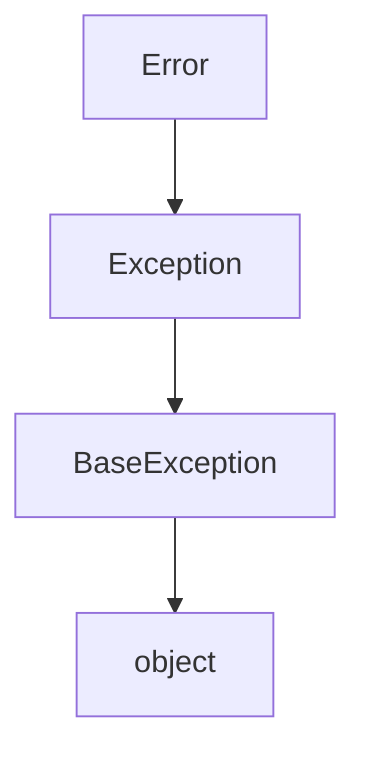
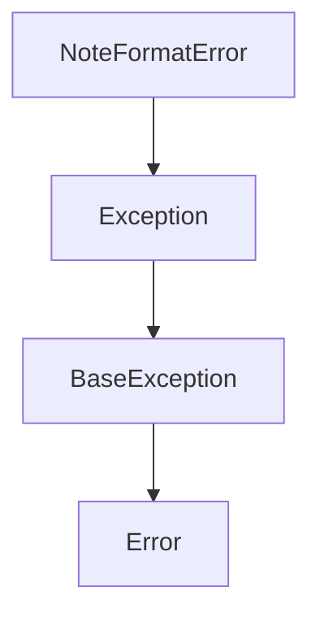
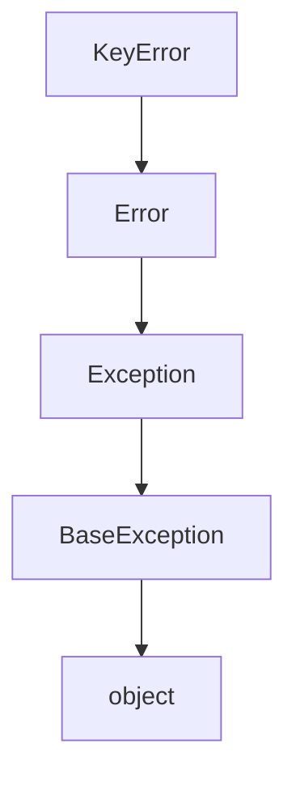
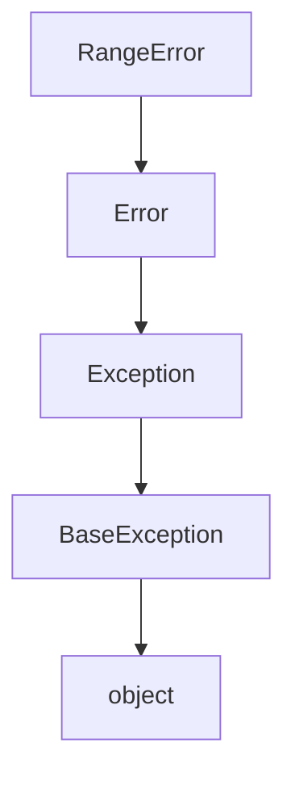

# `mt_exceptions.py`

## `mingus.core.mt_exceptions.Error` · *class*

## Summary:
Base exception class for the mingus.core module that provides a common inheritance point for custom exceptions.

## Description:
The Error class serves as the root exception type for the mingus.core module, providing a consistent hierarchy for custom exceptions. It inherits from Python's built-in Exception class and is designed to be subclassed by more specific exception types within the module. This allows for structured error handling and categorization of exceptions that occur during core operations.

## State:
- No instance attributes: This is a minimal exception class with no additional state beyond what is inherited from Exception
- No __init__ parameters: Inherits default Exception initialization behavior
- Invariants: None beyond standard Exception invariants

## Lifecycle:
- Creation: Instantiated like any other Exception, typically via direct instantiation or subclass instantiation
- Usage: Used in try/except blocks for catching core module errors
- Destruction: Handled automatically by Python's garbage collector when no longer referenced

## Method Map:


## Raises:
- No exceptions raised by __init__ as it inherits default Exception behavior
- When instantiated, raises the standard Exception with provided arguments

## Example:
```python
# Basic instantiation
try:
    raise Error("A core module error occurred")
except Error as e:
    print(f"Caught error: {e}")

# As base class for subclasses
class SpecificError(Error):
    def __init__(self, message, code=None):
        super().__init__(message)
        self.code = code
```

## `mingus.core.mt_exceptions.FormatError` · *class*

## Summary:
Custom exception class for format-related errors in the mingus music library.

## Description:
FormatError is a specialized exception that inherits from Python's built-in Error class. It is designed to be raised when format violations or inconsistencies are encountered within the mingus music processing pipeline. This exception serves as a distinct error type to differentiate format-related issues from other potential errors in the system.

The motivation for having FormatError as a separate abstraction is to allow callers to specifically catch and handle format-related errors differently from other types of exceptions, providing more granular error handling capabilities.

## State:
- Inherits from: Error (built-in Python exception base class)
- No additional attributes: This is a minimal exception class with no custom state
- No constructor parameters: Inherits default initialization from Error

## Lifecycle:
- Creation: Instantiated like any other exception using `raise FormatError()` or `raise FormatError(message)`
- Usage: Raised during operations that encounter invalid or unexpected formats in musical data
- Destruction: Handled by Python's exception mechanism; no special cleanup required

## Raises:
- FormatError: Raised when format validation fails during musical data processing operations

## Example:
```python
# Raising the exception
raise FormatError("Invalid MIDI file format detected")

# Catching the exception
try:
    process_midi_file(file_path)
except FormatError as e:
    print(f"Format error occurred: {e}")
    # Handle format-specific error
```

## `mingus.core.mt_exceptions.NoteFormatError` · *class*

## Summary:
Custom exception class for handling errors related to note format validation in the mingus music library.

## Description:
The NoteFormatError exception is raised when a note format validation failure occurs within the mingus core module. This exception serves as a specialized error type to distinguish note formatting issues from other potential errors in the music processing pipeline. It inherits from Python's built-in Error class, making it a proper exception that can be caught and handled appropriately by calling code.

## State:
- No instance attributes: This is a minimal exception class with no additional state beyond what's inherited from Error
- No initialization parameters: The constructor accepts no arguments beyond those provided by the parent Error class

## Lifecycle:
- Creation: Instantiated using standard exception construction syntax (e.g., raise NoteFormatError("message"))
- Usage: Typically raised during note parsing, validation, or formatting operations when input doesn't conform to expected formats
- Destruction: Automatically cleaned up by Python's garbage collector after being handled

## Method Map:


## Raises:
- NoteFormatError: Raised when note format validation fails during music processing operations

## Example:
```python
# Raising the exception
raise NoteFormatError("Invalid note format: expected 'C4' but got 'C#4'")

# Catching the exception
try:
    # Some operation that validates note format
    validate_note_format("invalid-note")
except NoteFormatError as e:
    print(f"Note format error occurred: {e}")
```

## `mingus.core.mt_exceptions.KeyError` · *class*

## Summary:
KeyError is a specialized exception type for key-related failures in the mingus.core module, indicating that a requested key could not be found or accessed.

## Description:
The KeyError class serves as a specific exception type within the mingus.core module's exception hierarchy. It extends the base Error class to provide more granular error handling for key-related operations that fail, such as when a musical key cannot be located in a collection, database, or lookup structure. This specialized exception allows developers to distinguish key-specific failures from other core module errors.

## State:
- No instance attributes: This is a minimal exception class with no additional state beyond what is inherited from Exception
- No __init__ parameters: Inherits default Exception initialization behavior from the parent Error class
- Invariants: None beyond standard Exception invariants

## Lifecycle:
- Creation: Instantiated like any other Exception by raising it directly or through subclass instantiation
- Usage: Used in try/except blocks to catch key-related failures specifically, enabling more targeted error handling than general Error exceptions
- Destruction: Handled automatically by Python's garbage collector when no longer referenced

## Method Map:


## Raises:
- No exceptions raised by __init__ as it inherits default Exception behavior
- When instantiated, raises the standard Exception with provided arguments

## Example:
```python
# Basic instantiation and usage
try:
    # Simulate a key lookup that fails
    raise KeyError("The requested musical key 'F#m' was not found in the key collection")
except KeyError as e:
    print(f"Key error occurred: {e}")

# Usage in a key-related function
def get_key_signature(key_name):
    available_keys = ['C', 'G', 'D', 'A', 'E', 'B']
    if key_name not in available_keys:
        raise KeyError(f"Key signature '{key_name}' not found in available keys")
    return key_name

# Catching the specific KeyError
try:
    signature = get_key_signature('F#')
except KeyError as e:
    print(f"Key lookup failed: {e}")
    # Handle key-specific error appropriately
```

## `mingus.core.mt_exceptions.RangeError` · *class*

## Summary:
RangeError is a custom exception class representing validation failures for values outside acceptable numerical ranges in the mingus.core module.

## Description:
The RangeError class is a specialized exception type used throughout the mingus.core module to indicate when a numeric value fails to meet specified range constraints. It inherits from the base Error class, creating a clear exception hierarchy for core module errors. This exception is typically raised during validation of inputs that must fall within specific bounds, such as array indices, percentage values, or other quantified measurements with defined limits.

## State:
- No instance attributes: This is a minimal exception class with no additional state beyond what is inherited from Exception
- No __init__ parameters: Inherits default Exception initialization behavior from Exception class
- Invariants: None beyond standard Exception invariants

## Lifecycle:
- Creation: Instantiated like any other Exception, typically with a descriptive message explaining the range violation
- Usage: Used in try/except blocks for catching range validation errors during core operations
- Destruction: Handled automatically by Python's garbage collector when no longer referenced

## Method Map:


## Raises:
- No exceptions raised by __init__ as it inherits default Exception behavior
- When instantiated, raises the standard Exception with provided arguments

## Example:
```python
# Example usage in range validation
def validate_percentage(value):
    if not 0 <= value <= 100:
        raise RangeError(f"Percentage value {value} is outside valid range [0, 100]")
    return value

# Example usage for array indexing
def safe_get_item(array, index):
    if index < 0 or index >= len(array):
        raise RangeError(f"Index {index} is out of bounds for array of length {len(array)}")
    return array[index]

# Catching RangeError
try:
    result = validate_percentage(150)
except RangeError as e:
    print(f"Range validation failed: {e}")

# Direct instantiation
try:
    raise RangeError("Custom range error message")
except RangeError as e:
    print(f"Caught range error: {e}")
```

## `mingus.core.mt_exceptions.FingerError` · *class*

## Summary:
Represents an error condition related to finger positioning or movement in musical contexts.

## Description:
A custom exception class used within the mingus music library to indicate problems related to finger operations, likely in the context of piano fingering, guitar fingerings, or other instrumental techniques requiring precise finger placement. This exception serves as a specialized error type that allows callers to distinguish finger-related issues from other types of errors in the musical processing pipeline.

## State:
The class inherits from Python's built-in Error class and contains no additional attributes or state beyond what's provided by the base Error class.

## Lifecycle:
Creation: Instances are created by calling the constructor with optional error message arguments, following standard Python exception conventions.
Usage: Typically raised during musical analysis or fingering computations when an invalid finger configuration is detected.
Destruction: Managed automatically by Python's garbage collection when no longer referenced.

## Method Map:
```mermaid
graph TD
    A[FingerError()] --> B[Exception Base]
    B --> C[Standard Exception Handling]
```

## Raises:
This class itself does not raise any exceptions. It is designed to be raised as an exception during program execution when finger-related errors occur.

## Example:
```python
try:
    # Some operation that might involve finger positioning
    process_fingering_sequence(finger_positions)
except FingerError as e:
    print(f"Finger error occurred: {e}")
    # Handle the specific finger-related error appropriately
```

