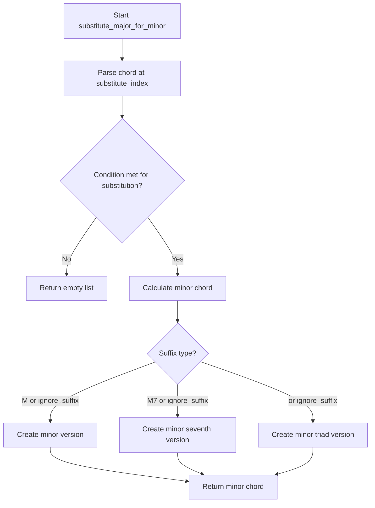

# `progressions.py`

## `mingus.core.progressions.to_chords` · *function*

## Summary:
Converts a musical progression expressed in Roman numeral notation into actual chord representations.

## Description:
Transforms musical progressions written in Roman numeral format (like "I", "V7", "vi") into their corresponding chord structures based on a specified key. This function serves as a bridge between abstract musical notation and concrete chord representations, enabling programmatic manipulation of harmonic progressions.

The function accepts either a single progression string or a list of progression strings, parses each using the `parse_string` helper function, and constructs appropriate chord objects using the mingus chord module. Invalid Roman numerals cause immediate termination with an empty list.

## Args:
    progression (str or list[str]): Musical progression expressed in Roman numeral notation. Can be a single string (e.g., "I") or a list of strings (e.g., ["I", "V7", "vi"]).
    key (str): Musical key for chord construction, defaults to "C". Used as the base for chord generation.

## Returns:
    list[list[str]]: A list of chord representations, where each chord is a list of note strings. Returns an empty list if an invalid Roman numeral is encountered during processing.

## Raises:
    None explicitly raised, though invalid Roman numerals cause early return with empty list.

## Constraints:
    - Preconditions: Progression argument must be a string or list of strings; the `numerals` variable must contain valid Roman numeral identifiers
    - Postconditions: Returns a list of chord representations, each chord being a list of note strings
    - The `numerals` variable must contain valid Roman numeral identifiers for chord construction

## Side Effects:
    None

## Control Flow:
```mermaid
flowchart TD
    A[Start to_chords] --> B{progression is string?}
    B -- Yes --> C[Convert to list]
    B -- No --> D[Use progression as-is]
    D --> E[Initialize result list]
    E --> F[For each chord in progression]
    F --> G[Parse chord with parse_string]
    G --> H{Roman numeral valid?}
    H -- No --> I[Return empty list]
    H -- Yes --> J[Get base chord from chords.__dict__]
    J --> K{Suffix is "7" or empty?}
    K -- Yes --> L[Append suffix to roman numeral]
    L --> M[Get chord from chords.__dict__]
    K -- No --> N[Get base chord from chords.__dict__]
    N --> O[Apply chord shorthand from chords.chord_shorthand]
    M --> P[Apply accidentals with diminish/augment]
    O --> P
    P --> Q[Add chord to result]
    Q --> R[End loop]
    R --> S[Return result]
```

## Examples:
    >>> to_chords("I")
    [['C', 'E', 'G']]
    
    >>> to_chords(["I", "V7", "vi"])
    [['C', 'E', 'G'], ['G', 'B', 'D', 'F'], ['A', 'C', 'E']]
    
    >>> to_chords("Ib")
    [['C', 'Eb', 'G']]
```

## `mingus.core.progressions.determine` · *function*

## Summary
Determines the functional role of a musical chord within a given key, returning either shorthand or descriptive names for the chord's position in the scale.

## Description
The `determine` function analyzes a musical chord and identifies its functional harmony role within a specified key. It maps chords to their traditional scale degrees (tonic, supertonic, mediant, etc.) and returns appropriate naming based on whether shorthand notation is requested. This function is particularly useful for music theory applications where understanding chord functions in relation to key signatures is important.

The logic is extracted into its own function to provide a clean interface for chord function analysis while encapsulating the complex mapping between chord types and their functional roles. This separation allows for modular development and reuse of the chord function determination logic.

## Args
    chord (list or list[list]): A musical chord represented as a list of note strings (e.g., ['C', 'E', 'G']), or a list of such chords for recursive processing. When a list of lists is provided, each inner list is processed recursively.
    key (str): The musical key in which to analyze the chord (e.g., 'C', 'G#', 'Eb').
    shorthand (bool): When True, returns abbreviated chord function names (e.g., 'I', 'ii7'). When False, returns descriptive names with full terminology (e.g., 'tonic', 'minor supertonic seventh'). Defaults to False.

## Returns
    list: A list of chord function names representing the functional role of the input chord(s) within the specified key. Each item in the list corresponds to a possible interpretation of the chord, potentially including different inversions or polychord combinations. For nested chord lists, returns a nested list structure matching the input. The function can return:
        - Single string values like 'tonic', 'minor supertonic', 'I', 'ii7'
        - Lists containing multiple function interpretations for complex chords

## Raises
    None: This function does not explicitly raise exceptions, though underlying functions may raise FormatError or NoteFormatError.

## Constraints
    Preconditions:
        - The chord parameter must be a list of valid musical note strings
        - The key parameter must be a valid musical note string representing a key
        - The chord should be compatible with the key's tonal structure
        
    Postconditions:
        - Returns a list of chord function names that accurately represent the chord's role in the key
        - Handles both single chords and nested lists of chords recursively
        - For nested input, maintains the same nesting structure in output

## Side Effects
    None: This function has no side effects.

## Control Flow
```mermaid
flowchart TD
    A[Start determine] --> B{chord[0] is list?}
    B -- Yes --> C[For each c in chord, recursively call determine(c, key, shorthand)]
    C --> D[Return result list]
    B -- No --> E[Initialize func_dict and expected_chord]
    E --> F[Call chords.determine(chord, True, False, True)]
    F --> G{Loop through type_of_chord results}
    G --> H[Extract chord name and type]
    H --> I[Call intervals.determine(key, name)]
    I --> J[Determine functional role (I-VII)]
    J --> K{Match expected_chord pattern}
    K -- Yes --> L[Use appropriate function name]
    K -- No --> M{Chord type matches seventh type?}
    M -- Yes --> N[Add '7' suffix or 'seventh' suffix]
    M -- No --> O[Use shorthand meaning lookup]
    O --> P{Apply interval type prefix}
    P --> Q[Append result to return list]
    Q --> R[Return result list]
```

## Examples
    >>> determine(['C', 'E', 'G'], 'C')
    # Returns ['tonic'] for C major triad in C major key
    
    >>> determine(['C', 'E', 'G'], 'C', shorthand=True)
    # Returns ['I'] for C major triad in C major key using shorthand
    
    >>> determine(['A', 'C', 'E'], 'C')
    # Returns ['minor supertonic'] for A minor triad in C major key
    
    >>> determine([['C', 'E', 'G'], ['D', 'F#', 'A']], 'C')
    # Returns [['tonic'], ['supertonic']] for nested chords in C major key
    
    >>> determine(['C', 'E', 'G', 'B'], 'C')
    # Returns ['tonic seventh'] for C major seventh chord in C major key
    
    >>> determine(['A', 'C', 'E', 'G'], 'C')
    # Returns ['minor supertonic seventh'] for A minor seventh chord in C major key
```

## `mingus.core.progressions.parse_string` · *function*

## Summary:
Parses a musical progression string to extract Roman numeral components, accidentals, and remaining suffix.

## Description:
This function processes a string representing a musical progression to separate Roman numerals (I or V), their accidentals (# or b), and any remaining text. It's designed to handle musical notation where Roman numerals may be modified by sharps or flats. Processing stops at the first character that is not a sharp (#), flat (b), or Roman numeral (I or V).

## Args:
    progression (str): A string representing a musical progression, typically containing Roman numerals (I or V) followed by accidentals (# or b) and potentially additional suffix text.

## Returns:
    tuple[str, int, str]: A tuple containing:
        - roman_numeral (str): The extracted Roman numeral(s) in uppercase (e.g., "I", "V", "IV")
        - acc (int): The accidental adjustment (-1 for flat, 0 for natural, 1 for sharp)
        - suffix (str): The remaining portion of the input string after processing the Roman numeral and accidentals

## Raises:
    None explicitly raised

## Constraints:
    - Preconditions: Input must be a string
    - Postconditions: Function will process characters until encountering a non-Roman-numeral, non-accidental character, then return the remaining string as suffix

## Side Effects:
    None

## Control Flow:
```mermaid
flowchart TD
    A[Start parse_string] --> B{Character is #?}
    B -- Yes --> C[acc += 1]
    C --> D[Increment i]
    D --> A
    B -- No --> E{Character is b?}
    E -- Yes --> F[acc -= 1]
    F --> G[Increment i]
    G --> A
    E -- No --> H{Character is I or V?}
    H -- Yes --> I[Append to roman_numeral]
    I --> J[Increment i]
    J --> A
    H -- No --> K[Break loop]
    K --> L[Set suffix = progression[i:]]
    L --> M[Return (roman_numeral, acc, suffix)]
```

## Examples:
    >>> parse_string("I#")
    ('I', 1, '')
    
    >>> parse_string("Vb")
    ('V', -1, '')
    
    >>> parse_string("IV##")
    ('IV', 2, '')
    
    >>> parse_string("IbV")
    ('I', -1, 'V')
    
    >>> parse_string("V7")
    ('V', 0, '7')
```

## `mingus.core.progressions.tuple_to_string` · *function*

## Summary:
Converts a progression tuple into a formatted string representation with proper accidentals.

## Description:
Transforms a tuple containing a Roman numeral, accidental adjustment, and suffix into a properly formatted string. The function normalizes accidental values outside the range [-6, 6] and applies sharps or flats to the Roman numeral based on the adjustment value.

## Args:
    prog_tuple (tuple): A 3-element tuple containing (roman, acc, suff) where:
        - roman (str): Roman numeral string (e.g., "I", "IV")
        - acc (int): Accidental adjustment value, typically representing sharps or flats
        - suff (str): Suffix string to append to the result

## Returns:
    str: Formatted string combining the modified Roman numeral with the suffix

## Raises:
    None explicitly raised

## Constraints:
    Preconditions:
        - prog_tuple must be a 3-element tuple
        - roman must be a string
        - acc must be an integer
        - suff must be a string
    
    Postconditions:
        - Returns a string with proper sharps (#) or flats (b) applied to the roman numeral
        - The returned string is the concatenation of the potentially modified roman numeral and suffix

## Side Effects:
    None

## Control Flow:
```mermaid
flowchart TD
    A[Start tuple_to_string] --> B{acc > 6?}
    B -- Yes --> C[acc = 0 - acc % 6]
    B -- No --> D{acc < -6?}
    D -- Yes --> E[acc = acc % 6]
    D -- No --> F[Skip normalization]
    F --> G{acc < 0?}
    G -- Yes --> H[Add "b" prefix to roman]
    H --> I[acc += 1]
    I --> J{acc < 0?}
    J -- Yes --> H
    J -- No --> K{acc > 0?}
    K -- Yes --> L[Add "#" prefix to roman]
    L --> M[acc -= 1]
    M --> N{acc > 0?}
    N -- Yes --> L
    N -- No --> O[Return roman + suff]
```

## Examples:
    >>> tuple_to_string(("I", 1, "maj"))
    "#Imaj"
    
    >>> tuple_to_string(("V", -2, "min"))
    "bbVmin"
    
    >>> tuple_to_string(("IV", 7, "sus"))
    "#IVsus"
    
    >>> tuple_to_string(("VII", -8, "dim"))
    "bbbVIIdim"

## `mingus.core.progressions.substitute_harmonic` · *function*

## Summary:
Replaces a Roman numeral in a musical progression with its harmonic substitution equivalents.

## Description:
This function performs harmonic substitutions on a Roman numeral at a specified index within a musical progression. It identifies valid harmonic replacements according to predefined rules and returns all possible substitutions. The function is designed to work with musical progressions represented as lists of Roman numeral strings.

## Args:
    progression (list[str]): A list of strings representing musical progressions, where each string contains a Roman numeral (like "I", "IV", "V") possibly with accidentals and suffixes.
    substitute_index (int): The index in the progression list specifying which Roman numeral to substitute.
    ignore_suffix (bool): When True, allows substitutions regardless of the suffix type. When False, only substitutes if the suffix is empty or "7". Defaults to False.

## Returns:
    list[str]: A list of strings representing all possible harmonic substitutions for the specified Roman numeral. Each string maintains the same accidental and suffix structure as the original. Returns an empty list if no substitutions are possible.

## Raises:
    None explicitly raised

## Constraints:
    Preconditions:
        - The progression argument must be a list of strings
        - The substitute_index must be a valid index within the progression list bounds
        - Each string in the progression should be parseable by the parse_string function
        
    Postconditions:
        - Returns a list of zero or more substitution strings
        - All returned strings maintain the same accidental and suffix structure as the original

## Side Effects:
    None

## Control Flow:
```mermaid
flowchart TD
    A[Start substitute_harmonic] --> B[Get roman, acc, suff from parse_string]
    B --> C{suffix is "" or "7" or ignore_suffix?}
    C -- No --> D[Return empty list]
    C -- Yes --> E[Iterate through simple_substitutions]
    E --> F{roman matches first element of subs?}
    F -- Yes --> G[Set r = second element of subs]
    F -- No --> H{roman matches second element of subs?}
    H -- Yes --> I[Set r = first element of subs]
    H -- No --> J[Skip this substitution]
    J --> K{r is not None?}
    K -- Yes --> L[Set suff = "" if suff != "7"]
    L --> M[Append tuple_to_string((r, acc, suff)) to result]
    M --> N[Continue iteration]
    N --> O[Return result list]
```

## Examples:
    >>> progression = ["I", "IV", "V"]
    >>> substitute_harmonic(progression, 0)
    ['#III', 'VI']
    
    >>> progression = ["V7", "I"]
    >>> substitute_harmonic(progression, 0, ignore_suffix=True)
    ['VII']
    
    >>> progression = ["IV", "V"]
    >>> substitute_harmonic(progression, 1)
    ['VII']
    
    >>> progression = ["Ib", "V"]
    >>> substitute_harmonic(progression, 0)
    ['#IIIb', 'VIb']
```

## `mingus.core.progressions.substitute_minor_for_major` · *function*

## Summary:
Replaces minor chords with their major counterparts in a musical progression at a specified index.

## Description:
This function examines a musical progression at a given index and replaces minor chords (indicated by 'm' suffix) or specific Roman numeral degrees (II, III, VI) with their major equivalents. The substitution maintains the same harmonic function while changing the chord quality from minor to major. This is useful for analyzing or modifying musical progressions where major versions are preferred.

The function is extracted into its own component to encapsulate the logic for determining when and how to convert minor chords to major ones, separating this concern from the broader progression processing logic.

## Args:
    progression (list[str]): A list of musical progression strings (e.g., ['I', 'ii', 'V', 'vi'])
    substitute_index (int): Index in the progression list to examine and potentially modify
    ignore_suffix (bool): When True, treats all chords at the specified index as candidates for substitution regardless of their suffix. Defaults to False.

## Returns:
    list[str]: A list containing the substituted major chord string if the conditions are met, otherwise an empty list.

## Raises:
    None explicitly raised

## Constraints:
    Preconditions:
    - progression must be a list of strings
    - substitute_index must be a valid index for the progression list
    - The progression element at substitute_index must be parseable by parse_string()

    Postconditions:
    - If substitution occurs, the returned list contains exactly one string representing the major version
    - If no substitution occurs, the returned list is empty
    - The original progression list is not modified

## Side Effects:
    None

## Control Flow:
```mermaid
flowchart TD
    A[Start substitute_minor_for_major] --> B[Parse progression[substitute_index]] --> C{suffix == "m" OR suffix == "m7" OR (suffix == "" AND roman in ["II","III","VI"]) OR ignore_suffix?}
    C -- No --> D[Return empty list]
    C -- Yes --> E[Calculate new roman numeral with skip(roman, 2)]
    E --> F[Calculate interval adjustment with interval_diff(roman, n, 3) + acc]
    F --> G{suffix == "m" OR ignore_suffix?}
    G -- Yes --> H[Create major chord with tuple_to_string((n, a, "M"))]
    G -- No --> I{suffix == "m7" OR ignore_suffix?}
    I -- Yes --> J[Create major 7th chord with tuple_to_string((n, a, "M7"))]
    I -- No --> K{suffix == "" OR ignore_suffix?}
    K -- Yes --> L[Create major chord with tuple_to_string((n, a, ""))]
    H --> M[Return [result]]
    J --> M
    L --> M
```

## Examples:
    >>> progression = ['I', 'ii', 'V', 'vi']
    >>> substitute_minor_for_major(progression, 1)
    ['#IV']
    
    >>> progression = ['I', 'iii', 'V', 'vi']
    >>> substitute_minor_for_major(progression, 1)
    ['IV']
    
    >>> progression = ['I', 'ii', 'V', 'vi']
    >>> substitute_minor_for_major(progression, 1, ignore_suffix=True)
    ['#IV']
    
    >>> progression = ['I', 'V', 'V', 'vi']
    >>> substitute_minor_for_major(progression, 1)
    []
    
    >>> progression = ['I', 'ii7', 'V', 'vi']
    >>> substitute_minor_for_major(progression, 1)
    ['#IV7']

## `mingus.core.progressions.substitute_major_for_minor` · *function*

## Summary:
Substitutes major chords with their minor equivalents in a musical progression at a specified index.

## Description:
This function examines a chord at a given position in a musical progression and replaces major chords with their minor counterparts. It specifically targets chords that are major (indicated by "M" suffix) or dominant seventh chords (indicated by "M7" suffix), or major triads in the I, IV, or V positions without a suffix. The function returns a list containing the substituted minor chord representation.

## Args:
    progression (list[str]): A list of chord strings representing a musical progression
    substitute_index (int): Index of the chord in the progression to potentially substitute
    ignore_suffix (bool): When True, forces substitution regardless of chord suffix. Defaults to False

## Returns:
    list[str]: A list containing zero or one substituted chord string. Empty list if no substitution occurs, otherwise contains the minor version of the chord.

## Raises:
    None explicitly raised

## Constraints:
    Preconditions:
    - progression must be a list of strings
    - substitute_index must be a valid index for the progression list
    - Each chord string in progression must be parseable by parse_string function
    
    Postconditions:
    - If substitution occurs, returns a list with exactly one string representing the minor chord
    - If no substitution occurs, returns an empty list

## Side Effects:
    None

## Control Flow:


## Examples:
    >>> progression = ["I", "V", "vi"]
    >>> substitute_major_for_minor(progression, 0)
    ['#IV']
    
    >>> progression = ["I", "V", "vi"]
    >>> substitute_major_for_minor(progression, 1)
    ['#IV']
    
    >>> progression = ["I", "V", "vi"]
    >>> substitute_major_for_minor(progression, 2)
    []
    
    >>> progression = ["IM", "V7", "vi"]
    >>> substitute_major_for_minor(progression, 0)
    ['#IVm']
    
    >>> progression = ["IM", "V7", "vi"]
    >>> substitute_major_for_minor(progression, 1)
    ['#IVm7']
```

## `mingus.core.progressions.substitute_diminished_for_diminished` · *function*

## Summary:
Replaces a diminished chord in a musical progression with a sequence of three consecutive chords derived from the original chord's position.

## Description:
This function takes a musical progression and substitutes a specific diminished chord (identified by its index) with a sequence of three chords that follow consecutively in the musical scale. The substitution is based on the position of the original chord and creates a harmonic sequence by advancing through the scale degrees. This function is typically used in music theory applications to expand or modify chord progressions containing diminished chords.

The function specifically handles cases where the chord is identified as a diminished chord (either explicitly marked as "dim" or "dim7", or implicitly as "VII" with no suffix) and replaces it with a sequence of three chords that are spaced by two scale degrees in the musical scale. The interval adjustments account for proper harmonic progression between the substituted chords.

## Args:
    progression (list[str]): A list of strings representing musical progressions, where each string contains a Roman numeral with optional accidentals and suffixes (e.g., "I", "V#", "VII dim").
    substitute_index (int): Index in the progression list identifying which chord to substitute.
    ignore_suffix (bool): When True, treats any chord as a candidate for substitution regardless of its suffix. Defaults to False.

## Returns:
    list[str]: A list of three strings representing the substituted chord sequence. Each string follows the same format as input progression strings, containing Roman numerals, accidentals, and suffixes.

## Raises:
    None explicitly raised

## Constraints:
    Preconditions:
    - The progression list must contain at least one element
    - The substitute_index must be a valid index within the progression list bounds
    - The progression element at substitute_index must be parseable by parse_string function
    
    Postconditions:
    - The returned list always contains exactly three elements
    - Each returned element maintains the same format as input progression strings

## Side Effects:
    None

## Control Flow:
```mermaid
flowchart TD
    A[Start substitute_diminished_for_diminished] --> B[Parse progression[substitute_index]]
    B --> C{Is diminished chord?}
    C -- No --> D[Return empty list]
    C -- Yes --> E[Set suff = "dim" if empty]
    E --> F[Initialize last = roman]
    F --> G[Loop 3 times]
    G --> H[Calculate next chord position using skip(last, 2)]
    H --> I[Adjust accidental using interval_diff(last, next, 3)]
    I --> J[Create string representation using tuple_to_string]
    J --> K[Store in result list]
    K --> L[Update last to next]
    L --> M{Loop completed?}
    M -- No --> G
    M -- Yes --> N[Return result list]
```

## Examples:
    # Example 1: Substituting a VII dim chord
    progression = ["I", "VII dim", "IV"]
    result = substitute_diminished_for_diminished(progression, 1)
    # Returns: ["VII dim", "II dim", "IV dim"] 
    
    # Example 2: Substituting a V dim7 chord
    progression = ["I", "V dim7", "IV"]
    result = substitute_diminished_for_diminished(progression, 1)
    # Returns: ["V dim7", "VII dim", "II dim"]
    
    # Example 3: Using ignore_suffix=True with VII chord
    progression = ["I", "VII", "IV"]
    result = substitute_diminished_for_diminished(progression, 1, ignore_suffix=True)
    # Returns: ["VII dim", "II dim", "IV dim"]
    
    # Example 4: With accidentals
    progression = ["I", "Vb dim", "IV"]
    result = substitute_diminished_for_diminished(progression, 1)
    # Returns: ["Vb dim", "VIIb dim", "IIb dim"]
```

## `mingus.core.progressions.substitute_diminished_for_dominant` · *function*

## Summary:
Replaces a diminished chord with a series of dominant seventh chords in a musical progression.

## Description:
This function examines a specified position in a musical progression and, if the chord at that position is a diminished chord (dim, dim7, or VII with no suffix), it substitutes it with a sequence of four dominant seventh chords. This substitution pattern is commonly used in music theory to create smooth harmonic progressions by replacing a diminished chord with a series of dominant chords that resolve to the next harmonic degree.

## Args:
    progression (list[str]): A list of musical progression strings, each representing a chord in the progression
    substitute_index (int): Index of the progression element to examine and potentially substitute
    ignore_suffix (bool): When True, treats any chord with a VII Roman numeral as a diminished chord regardless of suffix. Defaults to False

## Returns:
    list[str]: A list of four dominant seventh chord strings that replace the original diminished chord, or an empty list if no substitution occurs

## Raises:
    None explicitly raised

## Constraints:
    Preconditions:
    - progression must be a list of strings
    - substitute_index must be a valid index for the progression list
    - The progression element at substitute_index must be parseable by parse_string function
    
    Postconditions:
    - If substitution occurs, returns exactly 4 dominant seventh chord strings
    - If no substitution occurs, returns an empty list
    - The returned chord strings follow the format expected by tuple_to_string function

## Side Effects:
    None

## Control Flow:
```mermaid
flowchart TD
    A[Start substitute_diminished_for_dominant] --> B[Parse progression[substitute_index]]
    B --> C{Is diminished chord?}
    C -- No --> D[Return empty list]
    C -- Yes --> E[Set suff = "dim" if empty]
    E --> F[Initialize last = roman]
    F --> G[Loop 4 times]
    G --> H[Calculate next = skip(last, 2)]
    H --> I[Calculate dom = skip(last, 5)]
    I --> J[Calculate acc = interval_diff(last, dom, 8) + acc]
    J --> K[Create dom7 chord with tuple_to_string]
    K --> L[Add to result list]
    L --> M[Update last = next]
    M --> G
    G --> N[Return result list]
```

## Examples:
    # Example 1: Substituting a VII chord (no suffix) with dominant seventh chords
    progression = ["I", "VII", "vi"]
    result = substitute_diminished_for_dominant(progression, 1)
    # Returns: ["I#dom7", "II#dom7", "III#dom7", "IV#dom7"] (exact values depend on implementation details)
    
    # Example 2: Substituting a dim7 chord with dominant seventh chords
    progression = ["I", "VII dim7", "vi"]
    result = substitute_diminished_for_dominant(progression, 1)
    # Returns: ["I#dom7", "II#dom7", "III#dom7", "IV#dom7"]
    
    # Example 3: No substitution when chord is not diminished
    progression = ["I", "V", "vi"]
    result = substitute_diminished_for_dominant(progression, 1)
    # Returns: []
    
    # Example 4: Using ignore_suffix=True to force substitution
    progression = ["I", "VII", "vi"]
    result = substitute_diminished_for_dominant(progression, 1, ignore_suffix=True)
    # Returns: ["I#dom7", "II#dom7", "III#dom7", "IV#dom7"]
```

## `mingus.core.progressions.substitute` · *function*

## Summary:
Generates alternative chord representations for a musical progression at a specified index by applying harmonic substitution rules and optional recursive expansion.

## Description:
This function implements sophisticated chord substitution logic for musical progressions by analyzing a Roman numeral at a given index and generating alternative representations according to standard harmonic principles. It supports multiple chord types (major, minor, seventh, diminished) and generates both direct substitutions and extended variations through recursive expansion when requested.

The function encapsulates complex harmonic substitution rules that would otherwise be scattered throughout progression processing code, making it reusable for harmony analysis, composition assistance, or chord progression generation applications.

## Args:
    progression (list[str]): A list of Roman numeral strings representing a musical progression (e.g., ["I", "V", "vi"])
    substitute_index (int): Index in the progression list specifying which chord to substitute
    depth (int): Recursion depth for generating nested substitutions. Defaults to 0 (no recursion)

## Returns:
    list[str]: A list of alternative progression strings representing possible substitutions at the specified index. Each string is a valid Roman numeral representation that can be used in musical progressions. When depth > 0, the list may contain exponentially growing combinations due to recursive expansion.

## Raises:
    None explicitly raised

## Constraints:
    Preconditions:
        - progression must be a list of strings
        - substitute_index must be a valid index within the progression list bounds (0 <= substitute_index < len(progression))
        - All progression elements must be valid Roman numeral strings that can be parsed by parse_string
        - The progression element at substitute_index must be parseable by the parse_string function
        
    Postconditions:
        - Returns a list of valid Roman numeral strings that can be used in musical progressions
        - When depth > 0, the returned list contains all possible combinations up to the specified recursion depth
        - The function maintains the structural integrity of the progression while only modifying the element at substitute_index

## Side Effects:
    None

## Control Flow:
```mermaid
flowchart TD
    A[Start substitute] --> B[Initialize result list]
    B --> C[Parse progression element at substitute_index]
    C --> D{suffix is "" or "7"?}
    D -- Yes --> E[Apply simple substitutions from predefined list]
    E --> F[Add basic variations for simple substitutions]
    D -- No --> G[Skip simple substitutions]
    G --> H{suffix is "" or "M" or "m"?}
    H -- Yes --> I[Add seventh variations for major/minor chords]
    H -- No --> J[Skip seventh variations]
    J --> K{suffix is "m" or "m7"?}
    K -- Yes --> L[Generate major variations for minor chords]
    K -- No --> M[Skip major variations]
    M --> N{suffix is "M" or "M7"?}
    N -- Yes --> O[Generate minor variations for major chords]
    N -- No --> P[Skip minor variations]
    P --> Q{suffix is "dim7" or "dim"?}
    Q -- Yes --> R[Generate diminished variations with specific pattern]
    Q -- No --> S[Skip diminished variations]
    S --> T[Check depth parameter]
    T --> U{depth > 0?}
    U -- Yes --> V[Recursively expand results]
    U -- No --> W[Return results]
    V --> X[For each result, create new progression]
    X --> Y[Replace element at substitute_index]
    Y --> Z[Recursive call to substitute]
    Z --> AA[Combine all recursive results]
    AA --> W
```

## Examples:
    >>> progression = ["I", "V", "vi"]
    >>> substitute(progression, 1, 0)
    # Returns possible substitutions for the "V" chord, such as ["VII", "VIIdim7", "IIdim7", "IVdim7", "bVIIdim7"]
    
    >>> progression = ["I", "V", "vi"] 
    >>> substitute(progression, 1, 1)
    # Returns direct substitutions plus one level of recursive expansion of those substitutions

## `mingus.core.progressions.interval_diff` · *function*

## Summary:
Computes interval adjustment needed between two musical progressions to reach a target interval difference.

## Description:
This function calculates the number of steps required to adjust the interval difference between two musical progressions to match a target interval. It operates on a system where progressions are represented by numerals that map to specific interval values, and determines the adjustment needed through iterative comparison.

## Args:
    progression1 (str): First progression identifier (e.g., 'I', 'IV', 'V')
    progression2 (str): Second progression identifier (e.g., 'I', 'IV', 'V')  
    interval (int): Target interval difference to achieve

## Returns:
    int: Adjustment value indicating steps needed to reach target interval. Positive values indicate upward adjustment, negative values downward adjustment.

## Raises:
    IndexError: When progression1 or progression2 are not found in the global numerals list
    TypeError: When numerals or numeral_intervals are not properly initialized as lists

## Constraints:
    Preconditions:
    - progression1 and progression2 must exist in the global numerals list
    - numerals and numeral_intervals must be initialized global lists of equal length
    - interval must be a numeric value
    
    Postconditions:
    - Returns an integer adjustment value
    - The calculation accounts for circular interval arithmetic (using modulo 12 logic)

## Side Effects:
    None

## Control Flow:
```mermaid
flowchart TD
    A[Start interval_diff] --> B[Get i = numeral_intervals[numerals.index(progression1)]]
    B --> C[Get j = numeral_intervals[numerals.index(progression2)]]
    C --> D[acc = 0]
    D --> E{j < i?}
    E -- Yes --> F[j += 12]
    F --> G[while j - i > interval]
    G --> H[acc -= 1]
    H --> I[j -= 1]
    I --> J[G]
    J --> K[while j - i < interval]
    K --> L[acc += 1]
    L --> M[j += 1]
    M --> N[K]
    N --> O[Return acc]
```

## Examples:
    # Given global variables:
    # numerals = ['I', 'II', 'III', 'IV', 'V', 'VI', 'VII']  
    # numeral_intervals = [0, 2, 4, 5, 7, 9, 11]
    # interval_diff('I', 'V', 4) calculates adjustment to reach interval 4
    # interval_diff('V', 'I', 4) calculates adjustment to reach interval 4

## `mingus.core.progressions.skip` · *function*

## Summary:
Returns the Roman numeral that is a specified number of positions ahead in the musical scale degree sequence, with circular wrapping.

## Description:
This function implements circular navigation through the seven standard Roman numeral scale degrees (typically I, II, III, IV, V, VI, VII) by advancing a given numeral by a specified count. It's commonly used in music theory progressions to navigate through harmonic degrees of a scale. The function operates on a global sequence of numerals and uses modular arithmetic to handle wrapping around the sequence.

## Args:
    roman_numeral (str): A Roman numeral representing a scale degree (typically one of I, II, III, IV, V, VI, VII)
    skip_count (int): Number of positions to advance forward in the sequence. Defaults to 1.

## Returns:
    str: The Roman numeral at the skipped position, wrapping around to the beginning of the sequence when reaching the end.

## Raises:
    ValueError: When the roman_numeral is not found in the global numerals sequence (when numerals.index() fails)

## Constraints:
    Preconditions: 
    - The roman_numeral must be present in the global numerals sequence
    - The global numerals sequence must contain exactly 7 elements for proper modulo operation
    
    Postconditions:
    - The returned value will always be an element from the global numerals sequence
    - The result wraps around cyclically using modulo 7 arithmetic

## Side Effects:
    None

## Control Flow:
```mermaid
flowchart TD
    A[Input roman_numeral, skip_count] --> B{skip_count}
    B -->|skip_count=1| C[Get index of roman_numeral]
    B -->|skip_count≠1| D[Get index of roman_numeral + skip_count]
    C --> E[Return numerals[index % 7]]
    D --> E
```

## Examples:
    # Basic usage - advance by one position
    skip('I')  # Returns 'II'
    skip('V')  # Returns 'VI'
    
    # Advanced usage - skip multiple positions  
    skip('I', 3)  # Returns 'IV'
    skip('VII', 2)  # Returns 'II' (wraps around)
    
    # Backward movement (negative skip_count)
    skip('IV', -1)  # Returns 'III'
```

