# `scales.py`

## `mingus.core.scales.determine` · *function*

## Summary:
Determines which musical scales could contain the specified set of notes by checking against all available scale patterns.

## Description:
This function performs scale identification by testing whether the provided notes form a subset of any existing musical scale pattern. It systematically evaluates all combinations of keys and scale types (major and minor) to find matches. The function is designed to help identify potential scale memberships for a given collection of notes, which is useful in music theory analysis and composition tools.

The logic is extracted into its own function to separate the scale detection algorithm from other musical theory operations, enabling reuse in various contexts where scale identification is needed without duplicating the core matching logic.

## Args:
    notes (list[str]): A list of note names (e.g., ['C', 'E', 'G']) to analyze for scale membership. Each note should be a valid musical note name with proper accidentals.

## Returns:
    list[str]: A list of unique scale names that could potentially contain all the provided notes. Returns an empty list if no matching scales are found. Scale names include variations such as "C Major", "D Minor", etc.

## Raises:
    None explicitly raised by this function. However, underlying operations may raise NoteFormatError, RangeError, or FormatError from the _Scale class hierarchy when creating scale instances.

## Constraints:
    Preconditions:
    - Input notes must be valid musical note names
    - Notes should be in a format compatible with the mingus music theory library conventions
    
    Postconditions:
    - The returned list contains only unique scale names (duplicates are removed)
    - The function returns all possible matches, not just the most specific ones

## Side Effects:
    None - This function is pure and does not modify any external state or perform I/O operations.

## Control Flow:
```mermaid
flowchart TD
    A[Start determine(notes)] --> B[Convert notes to set]
    B --> C[Initialize empty result list]
    C --> D[Iterate through keys]
    D --> E{Key exists?}
    E -- Yes --> F[Iterate through _Scale subclasses]
    F --> G{Scale type is major?}
    G -- Yes --> H[Create scale(key[0]) instance]
    H --> I[Check if notes ⊆ ascending()]
    I --> J{Subset check passed?}
    J -- Yes --> K[Add scale.name to result]
    J -- No --> L[Check if notes ⊆ descending()]
    L --> M{Subset check passed?}
    M -- Yes --> N[Add scale.name to result]
    M -- No --> O[Continue to next scale]
    G -- No --> P[Check if scale type is minor?]
    P -- Yes --> Q[Get relative minor note from get_notes(key[1])[0]]
    Q --> R[Create scale(relative_minor) instance]
    R --> S[Check if notes ⊆ ascending()]
    S --> T{Subset check passed?}
    T -- Yes --> U[Add scale.name to result]
    T -- No --> V[Check if notes ⊆ descending()]
    V --> W{Subset check passed?}
    W -- Yes --> X[Add scale.name to result]
    W -- No --> Y[Continue to next scale]
    P -- No --> Z[Continue to next scale]
    F --> AA[Continue to next scale]
    D --> AB[Continue to next key]
    AB --> AC[Continue to next key]
    AC --> AD[Remove duplicates from result]
    AD --> AE[Return result list]
```

## Examples:
    # Find scales containing C, E, G notes (C major triad)
    determine(['C', 'E', 'G'])  # Returns ['C Major', 'A Minor']
    
    # Find scales containing D, F#, A notes (D major triad)
    determine(['D', 'F#', 'A'])  # Returns ['D Major', 'B Minor']
    
    # Find scales containing notes that don't form a complete scale
    determine(['C', 'D', 'F'])  # May return empty list or partial matches
    
    # Find scales with single note
    determine(['C'])  # Returns all scales that contain C

## `mingus.core.scales._Scale` · *class*

## Summary:
Abstract base class representing musical scales with methods for ascending/descending sequences and degree extraction.

## Description:
The `_Scale` class serves as the foundation for all musical scale implementations in the mingus library. It provides a standardized interface for scale operations including ascending and descending sequences, degree retrieval, and scale comparisons. Subclasses must implement the `ascending()` method to define specific scale patterns.

This class enforces a consistent abstraction for musical scales while allowing concrete implementations to define their unique interval patterns. The class is intended to be subclassed rather than instantiated directly.

## State:
- `tonic` (str): The root note of the scale, stored as a string (e.g., 'C', 'D#'). Must be a valid note name and cannot be lowercase.
- `octaves` (int): Number of octaves the scale spans. Must be a positive integer.

## Lifecycle:
- Creation: Instantiate with a valid note string and octave count through a concrete subclass
- Usage: Call methods like `ascending()`, `descending()`, or `degree()` to retrieve scale information
- Destruction: No special cleanup required; uses standard Python garbage collection

## Method Map:
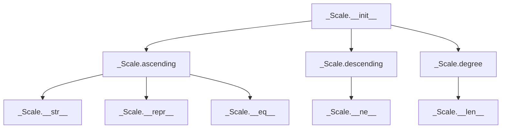

## Raises:
- `NoteFormatError`: Raised in `__init__` when the note parameter contains lowercase letters (invalid note format)
- `RangeError`: Raised in `degree()` when degree_number is less than 1
- `FormatError`: Raised in `degree()` when direction parameter is neither 'a' nor 'd'

## Example:
```python
# Creating a scale instance (through a concrete subclass)
scale = ConcreteScaleClass('C', 2)  # Create C major scale spanning 2 octaves

# Get ascending scale
ascending_notes = scale.ascending()  # ['C', 'D', 'E', 'F', 'G', 'A', 'B']

# Get descending scale  
descending_notes = scale.descending()  # ['B', 'A', 'G', 'F', 'E', 'D', 'C']

# Get specific degree
third_degree = scale.degree(3)  # 'E'
```

### `mingus.core.scales._Scale.__init__` · *method*

## Summary:
Initializes a Scale object with a tonic note and octave span, validating note format and setting internal state attributes.

## Description:
The constructor method for the Scale class that establishes the fundamental properties of a musical scale. It validates that the provided note is in proper uppercase format and sets the root note and octave range for the scale. This method ensures that all Scale instances maintain consistent formatting requirements for musical notes.

Known callers:
- Direct instantiation of concrete Scale subclasses (e.g., MajorScale, MinorScale)
- Called during object creation in the scale hierarchy lifecycle

This logic is separated into its own method to enforce consistent initialization behavior across all Scale subclasses and to centralize note format validation.

## Args:
    note (str): The root note of the scale, must be uppercase (e.g., 'C', 'D#', 'Gb'). Lowercase notes will trigger a NoteFormatError.
    octaves (int): The number of octaves the scale spans, must be a positive integer.

## Returns:
    None: This method initializes the object's state and does not return a value.

## Raises:
    NoteFormatError: When the note parameter contains lowercase letters, indicating invalid note format.

## State Changes:
    Attributes READ: None
    Attributes WRITTEN: 
    - self.tonic (str): Set to the provided note parameter
    - self.octaves (int): Set to the provided octaves parameter

## Constraints:
    Preconditions:
    - The note parameter must be a string containing valid musical note characters (A-G) with optional accidentals (# or b)
    - The note parameter must be in uppercase format to avoid NoteFormatError
    - The octaves parameter must be a positive integer

    Postconditions:
    - self.tonic is set to the exact note string provided (with validation)
    - self.octaves is set to the exact octaves integer provided
    - The object is ready for use in scale operations (ascending, descending, degree)

## Side Effects:
    None: This method performs no I/O operations or external state mutations.

### `mingus.core.scales._Scale.__repr__` · *method*

## Summary:
Returns a string representation of the Scale object that includes its name for debugging and identification purposes.

## Description:
This method implements the Python special method `__repr__` to provide a standardized string representation of Scale objects. It follows the common Python convention of returning a string that ideally could recreate the object, though in this case it's primarily for debugging and logging purposes. The method accesses the `name` attribute of the Scale instance to display meaningful identification information.

This method is intended to be used by subclasses of `_Scale` that properly define the `name` attribute. The base `_Scale` class does not define `name` in its `__init__` method, suggesting that subclasses or derived classes are expected to provide this attribute.

## Args:
    None

## Returns:
    str: A formatted string in the pattern "<Scale object ('{name}')>" where {name} is replaced with the scale's name.

## Raises:
    AttributeError: If the Scale object does not have a `name` attribute defined.

## State Changes:
    Attributes READ: self.name
    Attributes WRITTEN: None

## Constraints:
    Preconditions: The Scale object must have a `name` attribute that can be formatted into a string. This attribute is typically provided by subclasses of `_Scale`.
    Postconditions: The returned string follows the format "<Scale object ('{name}')>" where {name} is the value of self.name.

## Side Effects:
    None

### `mingus.core.scales._Scale.__str__` · *method*

## Summary:
Returns a formatted string representation showing the ascending and descending notes of the scale.

## Description:
This method provides a human-readable string representation of a Scale object, displaying both ascending and descending sequences of notes. It is automatically called when str() is invoked on a Scale instance or when the object is printed.

## Args:
    None

## Returns:
    str: A formatted string containing two lines:
         - "Ascending: [notes separated by spaces]"
         - "Descending: [notes separated by spaces]"

## Raises:
    None

## State Changes:
    Attributes READ: 
    - self.ascending(): calls the ascending method (returns list of notes)
    - self.descending(): calls the descending method (returns list of notes)

## Constraints:
    Preconditions:
    - The object must be a valid Scale instance
    - The ascending() method must return a list of note strings
    - The descending() method must return a list of note strings
    
    Postconditions:
    - Returns a properly formatted string with ascending and descending notes
    - The returned string follows the format "Ascending: [notes]\nDescending: [notes]"

## Side Effects:
    None

### `mingus.core.scales._Scale.__eq__` · *method*

## Summary:
Compares two scale objects for equality based on their ascending and descending note sequences.

## Description:
Determines whether two scale objects represent the same scale by comparing their ascending and descending note sequences. This method is called when using the equality operator (==) between two scale instances. The comparison is performed by checking if both the ascending and descending forms of the scales are identical.

This logic is implemented as a separate method rather than being inlined because it provides a standardized way to compare scale objects throughout the codebase, ensuring consistent behavior regardless of the specific scale type (Diatonic, MelodicMinor, NaturalMinor, etc.) being compared.

## Args:
    other (Scale): Another scale object to compare against this scale instance

## Returns:
    bool: True if both scales have identical ascending and descending note sequences, False otherwise

## Raises:
    None - No explicit exceptions raised by this method

## State Changes:
    Attributes READ: None - This method only reads the results of method calls
    Attributes WRITTEN: None - This method does not modify any instance attributes

## Constraints:
    Preconditions:
    - The 'other' parameter must be an instance of a class that inherits from _Scale
    - Both scales must have compatible structures for ascending() and descending() methods
    
    Postconditions:
    - Returns a boolean value indicating scale equality
    - Does not alter either scale object's state

## Side Effects:
    None - This method performs no I/O operations or external service calls

### `mingus.core.scales._Scale.__ne__` · *method*

## Summary:
Defines the "not equal" comparison operation for scale objects, returning True when two scales are not identical.

## Description:
This special method implements the `!=` operator for Scale objects. It returns the logical negation of the equality comparison between this scale and another scale object. When called as `scale1 != scale2`, it internally invokes `not scale1.__eq__(scale2)` to determine if the two scales are not equivalent.

## Args:
    other (object): Another object to compare against this scale instance. Typically another Scale object.

## Returns:
    bool: True if the scales are not equal, False if they are equal. The comparison is based on both ascending and descending note sequences.

## Raises:
    None explicitly raised, but may raise exceptions from the underlying `__eq__` method if the other object is not compatible for comparison.

## State Changes:
    Attributes READ: None - this method only reads the state of self and other for comparison purposes.
    Attributes WRITTEN: None - this method does not modify any instance attributes.

## Constraints:
    Preconditions: The other object should ideally be a Scale instance or at least support equality comparison with Scale objects.
    Postconditions: The return value is always a boolean (True or False).

## Side Effects:
    None - this method performs no I/O operations or external service calls. It only performs in-memory comparisons.

### `mingus.core.scales._Scale.__len__` · *method*

## Summary:
Returns the number of notes in the scale's ascending sequence.

## Description:
This method provides the length of the scale by counting the notes in its ascending sequence. It serves as the implementation of Python's built-in `len()` function for scale objects, allowing developers to easily determine how many notes are in a scale without having to manually call `ascending()` and then `len()`.

The method is part of the standard Python object protocol, enabling scale objects to be used with functions like `len()`, `list()`, and other operations that depend on the `__len__` method.

## Args:
    None

## Returns:
    int: The number of notes in the scale's ascending sequence. This corresponds to the count of notes in the scale, excluding the octave repetition that might be implicit in the scale structure.

## Raises:
    NotImplementedError: If called on the abstract base class `_Scale` directly, since `ascending()` is not implemented in the base class. In practice, this would only occur if the base class is instantiated directly, which should not happen in normal usage.

## State Changes:
    Attributes READ: self.ascending()
    Attributes WRITTEN: None

## Constraints:
    Preconditions: The scale object must have a properly initialized `ascending()` method implementation in its concrete subclass.
    Postconditions: The returned integer represents the count of notes in the ascending sequence of the scale.

## Side Effects:
    None

### `mingus.core.scales._Scale.ascending` · *method*

## Summary:
Returns the notes of the scale in ascending order as a list of note strings.

## Description:
This method is an abstract interface that must be implemented by subclasses to return the notes of a specific musical scale in ascending order. The returned list contains note strings that represent the scale degrees, typically starting from the tonic and ending with the tonic of the next octave.

## Args:
    None

## Returns:
    list[str]: A list of note strings representing the scale in ascending order. Each note string follows standard musical notation (e.g., "C", "D#", "Bb"). The list typically includes the tonic note and spans the specified number of octaves.

## Raises:
    NotImplementedError: This method is not implemented in the base class and must be overridden by subclasses.

## State Changes:
    Attributes READ: self.tonic, self.octaves
    Attributes WRITTEN: None

## Constraints:
    Preconditions: The method assumes that the class has been properly initialized with a valid tonic note and octaves count.
    Postconditions: The returned list should contain properly formatted note strings that follow musical conventions.

## Side Effects:
    None

### `mingus.core.scales._Scale.descending` · *method*

## Summary:
Returns the notes of the scale in descending order by reversing the ascending scale sequence.

## Description:
Provides access to the scale's notes in descending order. This method leverages the existing `ascending()` implementation by reversing its result to produce the descending sequence. It's particularly useful for musical applications that require descending scale patterns, such as practice exercises or composition analysis. This method is part of the abstract base class interface for musical scales and ensures consistent behavior across all scale implementations.

## Args:
    None

## Returns:
    list[str]: A list of note strings representing the scale in descending order. The notes follow the same format as the ascending scale but are ordered from highest to lowest pitch.

## Raises:
    None

## State Changes:
    Attributes READ: None
    Attributes WRITTEN: None

## Constraints:
    Preconditions: The class must be properly initialized with a valid tonic note and octaves count.
    Postconditions: The returned list contains the same note strings as the ascending scale but in reverse order.

## Side Effects:
    None

### `mingus.core.scales._Scale.degree` · *method*

## Summary:
Returns a specific degree note from the scale's ascending or descending sequence, excluding the octave note.

## Description:
Extracts a note at the specified degree position from either the ascending or descending scale sequence. This method provides convenient access to individual degrees within a scale without having to manually construct the full sequence. The returned note excludes the octave note (the last note in the sequence) to maintain proper degree indexing.

## Args:
    degree_number (int): The degree position to retrieve (1-based indexing). Must be >= 1.
    direction (str): Direction of scale traversal. "a" for ascending, "d" for descending. Defaults to "a".

## Returns:
    str: The note at the specified degree position in the requested scale direction.

## Raises:
    RangeError: When degree_number is less than 1.
    FormatError: When direction is neither "a" nor "d".

## State Changes:
    Attributes READ: self.ascending(), self.descending()
    Attributes WRITTEN: None

## Constraints:
    Preconditions: 
    - degree_number must be a positive integer (>= 1)
    - direction must be either "a" or "d"
    Postconditions:
    - Returns a valid note string from the scale
    - The returned note is from the scale's ascending/descending sequence (excluding octave note)

## Side Effects:
    None

## `mingus.core.scales.Diatonic` · *class*

## Summary:
Represents a diatonic scale with customizable semitone intervals, allowing for flexible scale construction based on specified semitone positions.

## Description:
The Diatonic class implements a musical scale pattern where the intervals between consecutive notes are determined by a set of specified semitone positions. It extends the abstract _Scale base class to provide concrete diatonic scale functionality. This class is particularly useful for creating scales where certain degrees are altered to minor seconds instead of major seconds, enabling the construction of various diatonic scale variations.

The class is typically instantiated through factory methods or direct instantiation by subclasses, and is designed to work with the mingus music theory framework for generating musical scales programmatically.

## State:
- `tonic` (str): The root note of the scale, inherited from _Scale base class. Must be a valid note name string (e.g., 'C', 'D#') and cannot contain lowercase letters.
- `octaves` (int): Number of octaves the scale spans, inherited from _Scale base class. Must be a positive integer.
- `semitones` (list[int]): A list of integers indicating which scale degrees (1-7) should use minor seconds instead of major seconds. Valid values are integers from 1 to 7.
- `name` (str): A descriptive name for the scale, formatted as "{tonic} diatonic, semitones in {semitones}".

## Lifecycle:
- Creation: Instantiate with a root note string, a list of semitone positions, and optionally the number of octaves (defaults to 1)
- Usage: Call the `ascending()` method to generate the complete scale sequence
- Destruction: No special cleanup required; uses standard Python garbage collection

## Method Map:


## Raises:
- `NoteFormatError`: Raised in __init__ when the note parameter contains lowercase letters (invalid note format)
- `RangeError`: Raised in degree() method when degree_number is less than 1 (inherited from _Scale)

## Example:
```python
# Create a diatonic scale with semitones at positions 2 and 5
scale = Diatonic('C', [2, 5], 1)  # C diatonic, semitones in [2, 5]

# Generate ascending scale sequence
ascending_notes = scale.ascending()  # ['C', 'D', 'Eb', 'F', 'G', 'Ab', 'B', 'C']
```

### `mingus.core.scales.Diatonic.__init__` · *method*

## Summary:
Initializes a Diatonic scale object with a root note, semitone positions, and optional octave count.

## Description:
Constructs a diatonic scale instance by setting up the root note, specifying which scale degrees should use minor seconds instead of major seconds, and defining the number of octaves. This method initializes the parent `_Scale` class with the note and octaves parameters, then configures the semitone positions and generates a descriptive name for the scale.

The method is separated from inline initialization logic to ensure proper inheritance setup and to clearly distinguish the configuration of diatonic-specific parameters from the base scale initialization.

## Args:
    note (str): The root note of the scale, must be a valid note name string (e.g., 'C', 'D#') and cannot contain lowercase letters.
    semitones (list[int]): A list of integers indicating which scale degrees (1-7) should use minor seconds instead of major seconds. Valid values are integers from 1 to 7.
    octaves (int): Number of octaves the scale spans. Defaults to 1 and must be a positive integer.

## Returns:
    None - This method initializes the object in-place and does not return a value.

## Raises:
    NoteFormatError: Raised when the note parameter contains lowercase letters (invalid note format), inherited from the parent _Scale.__init__ method.

## State Changes:
    Attributes READ: self.tonic (inherited from parent class)
    Attributes WRITTEN: 
    - self.semitones: Set to the semitones parameter value
    - self.name: Set to a descriptive string formatted as "{tonic} diatonic, semitones in {semitones}"

## Constraints:
    Preconditions:
    - The note parameter must be a valid musical note string without lowercase letters
    - The semitones parameter must be a list of integers between 1 and 7
    - The octaves parameter must be a positive integer
    
    Postconditions:
    - The object is properly initialized with the specified root note and octave span
    - The semitone positions are stored for scale construction
    - The name attribute is set to a descriptive identifier

## Side Effects:
    None - This method performs no I/O operations or external service calls.

### `mingus.core.scales.Diatonic.ascending` · *method*

## Summary:
Generates a diatonic scale in ascending order by applying alternating minor and major seconds based on semitone positions.

## Description:
Constructs a diatonic scale beginning with the tonic note and proceeding through seven notes. The intervals alternate between minor seconds and major seconds according to the semitone positions defined in the instance. The resulting scale is repeated for the specified number of octaves and concludes with the tonic note to complete the octave.

This method is implemented as a separate function because it defines the core behavior of how diatonic scales are constructed, allowing for consistent scale generation while maintaining flexibility in scale configuration through the semitones parameter.

## Args:
    None - Uses instance attributes exclusively

## Returns:
    list[str]: A list of note strings representing the ascending diatonic scale, repeated for the specified number of octaves and ending with the tonic note

## Raises:
    None - No explicit exceptions raised by this method

## State Changes:
    Attributes READ: self.tonic, self.semitones, self.octaves
    Attributes WRITTEN: None - This method is read-only

## Constraints:
    Preconditions:
    - self.tonic must be a valid musical note string
    - self.semitones must be an iterable containing integers representing positions where minor seconds should be applied
    - self.octaves must be a positive integer
    
    Postconditions:
    - The returned list contains exactly 7 * self.octaves + 1 notes
    - The first and last notes in the returned list are identical (tonic)
    - All intermediate notes follow the pattern of alternating minor and major seconds

## Side Effects:
    None - This method performs no I/O operations or external service calls

## `mingus.core.scales.Ionian` · *class*

## Summary:
Represents the Ionian scale, also known as the major scale, which is one of the most fundamental musical scales in Western music theory.

## Description:
The Ionian scale is the foundational major scale pattern consisting of seven notes with specific interval relationships. This class implements the Ionian scale by inheriting from the abstract `_Scale` base class and utilizing the `Diatonic` class to construct the proper interval pattern. The scale follows the pattern of whole steps and half steps characteristic of major scales: Tone, Tone, Half-step, Tone, Tone, Tone, Half-step.

This class is typically instantiated through factory methods or direct construction when implementing major scale functionality in musical applications. The Ionian scale serves as the basis for many musical compositions and is often used as a reference point for understanding other scale modes.

The implementation specifically uses `Diatonic(self.tonic, (3, 7))` to create the proper interval structure for the Ionian mode, where semitone positions 3 and 7 indicate the locations where minor seconds (instead of major seconds) appear in the diatonic pattern.

## State:
- `tonic` (str): The root note of the scale, inherited from `_Scale`. Must be a valid note name string (e.g., 'C', 'D#') and cannot contain lowercase letters.
- `octaves` (int): Number of octaves the scale spans, inherited from `_Scale`. Must be a positive integer.
- `type` (str): Class attribute set to "ancient", indicating this scale classification.
- `name` (str): Instance attribute formatted as "{tonic} ionian", providing a human-readable identifier for the scale.

## Lifecycle:
- Creation: Instantiate with a valid note string and optional octave count (defaults to 1)
- Usage: Call the `ascending()` method to retrieve the complete scale sequence
- Destruction: No special cleanup required; uses standard Python garbage collection

## Method Map:
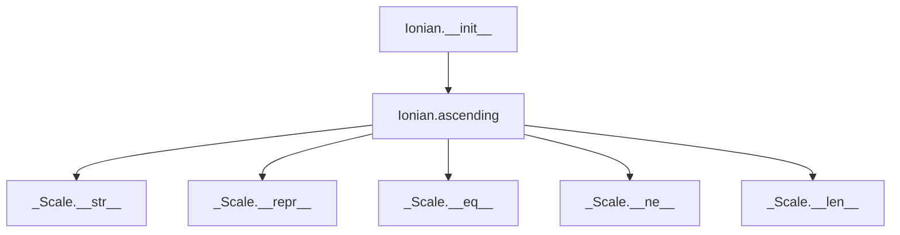

## Raises:
- `NoteFormatError`: Raised in `__init__` when the note parameter contains lowercase letters (invalid note format)
- `RangeError`: Raised in inherited methods when degree_number is less than 1

## Example:
```python
# Create an Ionian scale starting on C
ionian_scale = Ionian('C', 1)  # Creates C Ionian scale

# Get ascending scale sequence
ascending_notes = ionian_scale.ascending()  # ['C', 'D', 'E', 'F', 'G', 'A', 'B', 'C']

# Create a multi-octave Ionian scale
multi_octave = Ionian('A', 2)  # Creates A Ionian scale spanning 2 octaves

# Get the ascending sequence
result = multi_octave.ascending()  # ['A', 'B', 'C#', 'D', 'E', 'F#', 'G#', 'A', 'B', 'C#', 'D', 'E', 'F#', 'G#', 'A']
```

### `mingus.core.scales.Ionian.__init__` · *method*

## Summary:
Initializes an Ionian scale instance by calling the parent scale constructor and setting the scale's name attribute to a formatted string indicating the tonic and scale type.

## Description:
The `__init__` method serves as the constructor for the Ionian class, which represents the major scale pattern in Western music theory. This method first delegates initialization to its parent `_Scale` class to establish the basic scale properties (tonic note and octave count), then customizes the instance by setting the `name` attribute to a human-readable format that identifies the scale type.

The Ionian scale, also known as the major scale, is characterized by its specific interval pattern of whole steps and half steps (Tone, Tone, Half-step, Tone, Tone, Tone, Half-step). This implementation leverages the parent class's functionality to handle note validation and octave management while adding the specific naming convention for Ionian scales.

## Args:
    note (str): The root note of the scale, must be a valid note name string (e.g., 'C', 'D#') and cannot contain lowercase letters.
    octaves (int, optional): Number of octaves the scale spans. Defaults to 1. Must be a positive integer.

## Returns:
    None: This method initializes the instance in-place and does not return a value.

## Raises:
    NoteFormatError: Raised when the note parameter contains lowercase letters, which violates the valid note format requirements.
    RangeError: Raised when the octaves parameter is not a positive integer.

## State Changes:
    Attributes READ: self.tonic (inherited from parent class)
    Attributes WRITTEN: self.name (sets the instance name attribute)

## Constraints:
    Preconditions:
    - The note parameter must be a valid musical note string without lowercase letters
    - The octaves parameter must be a positive integer
    - The parent class initialization must succeed before setting the name attribute
    
    Postconditions:
    - The instance has valid `tonic` and `octaves` attributes inherited from `_Scale`
    - The instance has a properly formatted `name` attribute in the format "{tonic} ionian"

## Side Effects:
    None: This method performs no I/O operations or external service calls. It only modifies instance attributes.

### `mingus.core.scales.Ionian.ascending` · *method*

## Summary:
Generates an ascending Ionian scale by constructing a diatonic scale with semitones at positions 3 and 7, then repeating it across specified octaves and closing the scale with the tonic note.

## Description:
Implements the Ionian scale pattern (also known as the major scale) by creating a diatonic scale with semitone positions at degrees 3 and 7. The method constructs the scale pattern, repeats it for the specified number of octaves, and completes the final octave by appending the tonic note to form a closed scale sequence.

This method is implemented separately from the base class to provide a specialized implementation for the Ionian scale pattern, which differs from generic diatonic scales through its specific semitone positioning.

## Args:
    None - Uses instance attributes exclusively

## Returns:
    list[str]: A list of note strings representing the ascending Ionian scale, repeated for the specified number of octaves and ending with the tonic note

## Raises:
    None - No explicit exceptions raised by this method

## State Changes:
    Attributes READ: self.tonic, self.octaves
    Attributes WRITTEN: None - This method is read-only

## Constraints:
    Preconditions:
    - self.tonic must be a valid musical note string
    - self.octaves must be a positive integer
    
    Postconditions:
    - The returned list contains exactly 7 * self.octaves + 1 notes
    - The first and last notes in the returned list are identical (tonic)
    - All intermediate notes follow the Ionian scale pattern (W-W-H-W-W-W-H)

## Side Effects:
    None - This method performs no I/O operations or external service calls

## `mingus.core.scales.Dorian` · *class*

## Summary:
Represents the Dorian scale, an ancient musical scale pattern characterized by a specific interval structure with a minor second at the second degree.

## Description:
The Dorian scale is a modal scale that follows the interval pattern of whole tone, half tone, whole tone, whole tone, half tone, whole tone, whole tone. This implementation inherits from the abstract `_Scale` base class and provides a concrete realization of the Dorian mode. The class generates ascending sequences of notes following the Dorian pattern starting from a specified tonic note.

The Dorian scale is commonly used in jazz and folk music and is characterized by its distinctive sound that combines elements of both major and minor tonalities. This implementation leverages the `Diatonic` class with specific semitone positions (2, 6) to construct the Dorian pattern, where the second and sixth degrees use minor seconds instead of major seconds.

## State:
- `tonic` (str): The root note of the scale, inherited from `_Scale`. Must be a valid note name string (e.g., 'C', 'D#') and cannot contain lowercase letters.
- `octaves` (int): Number of octaves the scale spans, inherited from `_Scale`. Must be a positive integer.
- `type` (str): Class attribute set to "ancient", indicating this scale belongs to ancient musical traditions.
- `name` (str): Instance attribute formatted as "{tonic} dorian" that describes the scale.

## Lifecycle:
- Creation: Instantiate with a root note string and optional number of octaves (defaults to 1)
- Usage: Call the `ascending()` method to generate the complete ascending scale sequence
- Destruction: No special cleanup required; uses standard Python garbage collection

## Method Map:


## Raises:
- `NoteFormatError`: Raised in `__init__` when the note parameter contains lowercase letters (invalid note format)
- `RangeError`: Raised in `degree()` method when degree_number is less than 1 (inherited from `_Scale`)

## Example:
```python
# Create a Dorian scale starting from C
dorian_scale = Dorian('C', 1)  # Creates C Dorian scale

# Generate ascending scale sequence
ascending_notes = dorian_scale.ascending()  # ['C', 'D', 'Eb', 'F', 'G', 'A', 'Bb', 'C']

# Create a Dorian scale spanning 2 octaves
dorian_2_octaves = Dorian('A', 2)  # Creates A Dorian scale spanning 2 octaves

# Get ascending sequence
notes = dorian_2_octaves.ascending()  # ['A', 'B', 'C', 'D', 'E', 'F#', 'G', 'A', 'B', 'C', 'D', 'E', 'F#', 'G', 'A']
```

### `mingus.core.scales.Dorian.__init__` · *method*

## Summary:
Initializes a Dorian scale object with a specified tonic note and octave range, setting the scale's name attribute.

## Description:
The Dorian scale initialization method configures the object's state by calling the parent class constructor to establish the tonic note and octave parameters, then formats and stores the scale's descriptive name. This method ensures proper instantiation of Dorian scale objects with appropriate validation and naming conventions.

## Args:
    note (str): The tonic note of the scale, must be a valid uppercase note name (e.g., 'C', 'D#') without lowercase letters.
    octaves (int): Number of octaves the scale spans, defaults to 1.

## Returns:
    None: This method initializes the object state and does not return a value.

## Raises:
    NoteFormatError: Raised when the note parameter contains lowercase letters, violating the note format requirements.
    RangeError: Raised when the octaves parameter is not a positive integer.

## State Changes:
    Attributes READ: self.tonic (accessed during name formatting)
    Attributes WRITTEN: self.name (set to "{0} dorian".format(self.tonic)), self.tonic (assigned from note parameter), self.octaves (assigned from octaves parameter)

## Constraints:
    Preconditions:
    - The note parameter must be a valid uppercase note name string
    - The octaves parameter must be a positive integer
    - The note parameter cannot contain lowercase letters
    
    Postconditions:
    - self.tonic is set to the provided note value
    - self.octaves is set to the provided octaves value
    - self.name is set to the formatted string "{tonic} dorian"

## Side Effects:
    None: This method performs no I/O operations or external service calls.

### `mingus.core.scales.Dorian.ascending` · *method*

## Summary:
Generates the ascending form of a Dorian scale by constructing a diatonic pattern and repeating it across multiple octaves.

## Description:
This method constructs the ascending form of a Dorian scale by first creating a diatonic pattern using the interval specification (2, 6), extracting its ascending form, and removing the final note to prevent duplication. It then repeats this pattern across the specified number of octaves and appends the first note of the pattern to complete the scale structure.

## Args:
    None - This is an instance method that operates on the object's internal state

## Returns:
    list: A list of musical notes representing the ascending Dorian scale, with the first note repeated at the end to complete the scale pattern

## Raises:
    None explicitly mentioned in the code

## State Changes:
    Attributes READ: self.tonic (the starting note of the scale), self.octaves (number of octaves to span)
    Attributes WRITTEN: None - this method is read-only

## Constraints:
    Preconditions: 
    - self.tonic must be a valid musical note representation
    - self.octaves must be a positive integer indicating the number of octaves to span
    - The Diatonic class must be properly initialized with the interval tuple (2, 6) and support the ascending() method
    
    Postconditions:
    - Returns a list of notes forming a complete ascending Dorian scale
    - The returned list starts and ends with the same note (first note of the scale)
    - The total number of notes returned equals (length of diatonic pattern × self.octaves) + 1

## Side Effects:
    None - This method performs no I/O operations or external service calls

## `mingus.core.scales.Phrygian` · *class*

*No documentation generated.*

### `mingus.core.scales.Phrygian.__init__` · *method*

## Summary:
Initializes a Phrygian scale instance with a specified tonic note and octave span, setting the scale's descriptive name.

## Description:
The `__init__` method constructs a Phrygian scale object by initializing the parent `_Scale` class with the provided tonic note and octave count, then setting the instance's name attribute to a descriptive string format. This method is called during object creation to establish the fundamental properties of the Phrygian scale.

This logic is encapsulated in its own method rather than being inlined because it follows the established pattern of other scale classes in the module (like Major, HarmonicMinor, MelodicMinor) and ensures consistent initialization behavior across all scale implementations. The method also allows for proper inheritance and extension of the base scale functionality.

## Args:
    note (str): The tonic note of the scale, represented as a string (e.g., 'C', 'D#'). Must be a valid note name without lowercase letters.
    octaves (int, optional): The number of octaves the scale spans. Defaults to 1. Must be a positive integer.

## Returns:
    None: This method initializes the object's state but does not return a value.

## Raises:
    NoteFormatError: Raised by the parent `_Scale.__init__` when the note parameter contains lowercase letters (invalid note format).
    RangeError: Raised by the parent `_Scale.__init__` when octaves parameter is not a positive integer.

## State Changes:
    Attributes READ: 
    - self.tonic (str): The root note of the scale, inherited from parent class
    - self.octaves (int): The number of octaves, inherited from parent class
    
    Attributes WRITTEN: 
    - self.name (str): Set to "{0} phrygian".format(self.tonic) to create a descriptive name for the scale

## Constraints:
    Preconditions:
    - The note parameter must be a valid note name string (e.g., 'C', 'D#') without lowercase letters
    - The octaves parameter must be a positive integer
    
    Postconditions:
    - The Phrygian scale instance is properly initialized with the specified tonic and octave count
    - The instance's name attribute is set to a descriptive string in the format "{tonic} phrygian"

## Side Effects:
    None: This method performs no I/O operations or external service calls. It only modifies the object's internal state.

### `mingus.core.scales.Phrygian.ascending` · *method*

## Summary:
Generates the ascending sequence of a Phrygian scale by combining a diatonic pattern with octave repetition.

## Description:
The `ascending` method constructs the ascending sequence of a Phrygian scale by creating a diatonic scale with semitone positions (1, 5) and then repeating this pattern across multiple octaves. This method is part of the Phrygian scale implementation that inherits from the abstract _Scale base class.

This method is called during the scale generation phase when users need to obtain the complete ascending sequence of notes in a Phrygian scale. It leverages the characteristic Phrygian scale pattern where the second degree is flattened compared to a major scale.

## Args:
    self: Instance of the Phrygian class

## Returns:
    list[str]: A list of note names representing the ascending Phrygian scale sequence, where each note is a string in standard musical notation (e.g., 'C', 'D#', 'Eb'). The sequence starts and ends with the same note, creating a circular pattern that represents one complete cycle of the Phrygian scale.

## Raises:
    None explicitly raised

## State Changes:
    Attributes READ: 
    - self.tonic (str): The root note of the scale
    - self.octaves (int): Number of octaves the scale spans
    
    Attributes WRITTEN: 
    - None

## Constraints:
    Preconditions:
    - self.tonic must be a valid note name string (e.g., 'C', 'D#') without lowercase letters
    - self.octaves must be a positive integer
    
    Postconditions:
    - The returned list contains the complete ascending Phrygian scale sequence
    - The first and last notes in the sequence are the same (creating a circular pattern)
    - All notes in the sequence are valid musical note names
    - The length of the returned list is (7 * self.octaves) + 1, where 7 is the number of notes in a diatonic scale

## Side Effects:
    None

## `mingus.core.scales.Lydian` · *class*

## Summary:
Represents a Lydian scale, an ancient musical scale pattern characterized by a raised fourth degree compared to the major scale.

## Description:
The Lydian scale is one of the ancient musical scales that differs from the major scale by raising the fourth degree by a semitone. This implementation inherits from the abstract _Scale base class and provides a concrete realization of the Lydian scale pattern. The scale is constructed using the Diatonic class with semitone positions at degrees 4 and 7, which creates the distinctive Lydian interval structure (W-W-#W-W-W-W-H).

This class is typically instantiated through direct construction or by factory methods that create specific scale types. It's designed to integrate seamlessly with the mingus music theory framework for generating musical scales programmatically.

## State:
- `tonic` (str): The root note of the scale, inherited from _Scale base class. Must be a valid note name string (e.g., 'C', 'D#') and cannot contain lowercase letters.
- `octaves` (int): Number of octaves the scale spans, inherited from _Scale base class. Must be a positive integer.
- `type` (str): Class attribute indicating the scale type as "ancient". This distinguishes Lydian from other scale types.
- `name` (str): A descriptive name for the scale, formatted as "{tonic} lydian". Set during initialization.

## Lifecycle:
- Creation: Instantiate with a root note string and optionally the number of octaves (defaults to 1)
- Usage: Call the `ascending()` method to generate the complete scale sequence
- Destruction: No special cleanup required; uses standard Python garbage collection

## Method Map:
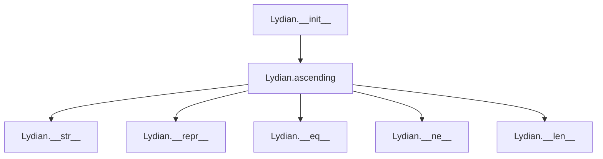

## Raises:
- `NoteFormatError`: Raised in `__init__` when the note parameter contains lowercase letters (invalid note format), inherited from _Scale
- `RangeError`: Raised in `__init__` when octaves parameter is not a positive integer, inherited from _Scale

## Example:
```python
# Create a Lydian scale with tonic C and 1 octave
scale = Lydian('C', 1)  # Creates C lydian scale

# Generate ascending scale sequence
ascending_notes = scale.ascending()  # ['C', 'D', 'E', 'F#', 'G', 'A', 'B', 'C']

# Create a multi-octave Lydian scale
multi_octave_scale = Lydian('A', 2)  # Creates A lydian scale spanning 2 octaves

# Generate the ascending sequence
multi_ascending = multi_octave_scale.ascending()  # ['A', 'B', 'C#', 'D#', 'E', 'F#', 'G#', 'A', 'B', 'C#', 'D#', 'E', 'F#', 'G#', 'A']

# The Lydian scale pattern is W-W-#W-W-W-W-H (where #W = augmented second)
# For example, C Lydian: C-D-E-F#-G-A-B-C
```

### `mingus.core.scales.Lydian.__init__` · *method*

## Summary:
Initializes a Lydian scale object with the specified tonic note and octave range, setting the scale's descriptive name.

## Description:
Constructs a Lydian scale instance by calling the parent _Scale class constructor with the provided note and octaves parameters, then formats and assigns a descriptive name to the scale. This method establishes the fundamental properties of the Lydian scale including its root note and octave span.

## Args:
    note (str): The tonic note of the scale, represented as a string (e.g., 'C', 'D#'). Must be a valid note name and cannot contain lowercase letters.
    octaves (int): The number of octaves the scale spans. Defaults to 1. Must be a positive integer.

## Returns:
    None: This method initializes the object's state and does not return a value.

## Raises:
    NoteFormatError: Raised when the note parameter contains lowercase letters (invalid note format), inherited from _Scale.__init__
    RangeError: Raised when octaves parameter is not a positive integer, inherited from _Scale.__init__

## State Changes:
    Attributes READ: self.tonic
    Attributes WRITTEN: self.name

## Constraints:
    Preconditions: 
    - The note parameter must be a valid note name string without lowercase letters
    - The octaves parameter must be a positive integer
    Postconditions:
    - The object's tonic attribute is set to the provided note
    - The object's octaves attribute is set to the provided octaves value
    - The object's name attribute is set to "{tonic} lydian" format

## Side Effects:
    None: This method performs no I/O operations or external service calls. It only modifies internal object state.

### `mingus.core.scales.Lydian.ascending` · *method*

## Summary:
Generates an ascending Lydian scale by constructing a diatonic pattern with semitones at positions 4 and 7, then repeating it across multiple octaves and closing the scale with the tonic note.

## Description:
Creates an ascending Lydian scale by leveraging the Diatonic class with semitone positions at degrees 4 and 7. The method constructs the base diatonic pattern, removes the final note to prevent duplication, repeats the pattern for the specified number of octaves, and appends the first note to complete the scale structure. This implementation follows the Lydian scale pattern where the 4th degree is raised by a semitone compared to the major scale.

The method is separated from inline logic to provide a clean interface for Lydian scale generation while maintaining consistency with the musical scale framework. It's called during the scale generation process when retrieving the ascending sequence of notes for a Lydian scale.

## Args:
    None - Uses instance attributes exclusively

## Returns:
    list[str]: A list of note strings representing the ascending Lydian scale, repeated for the specified number of octaves and ending with the tonic note. The list contains exactly 7 * self.octaves + 1 notes, where the first and last notes are identical (the tonic).

## Raises:
    None - No explicit exceptions raised by this method

## State Changes:
    Attributes READ: self.tonic, self.octaves
    Attributes WRITTEN: None - This method is read-only

## Constraints:
    Preconditions:
    - self.tonic must be a valid musical note string (e.g., 'C', 'D#')
    - self.octaves must be a positive integer
    
    Postconditions:
    - The returned list contains exactly 7 * self.octaves + 1 notes
    - The first and last notes in the returned list are identical (tonic)
    - All intermediate notes follow the Lydian scale pattern (W-W-#W-W-W-W-H)

## Side Effects:
    None - This method performs no I/O operations or external service calls

## `mingus.core.scales.Mixolydian` · *class*

## Summary:
Represents the Mixolydian scale, a musical scale pattern characterized by a flattened seventh degree that creates a distinctive sound often used in folk and popular music.

## Description:
The Mixolydian scale is a mode of the major scale that begins on the fifth degree of the major scale. It features a flattened seventh degree compared to the natural major scale, giving it a characteristic sound commonly found in blues, rock, and folk music. This class implements the Mixolydian scale pattern by leveraging the Diatonic scale implementation with semitone positions at degrees 3 and 6.

The class is designed to be instantiated through the standard musical scale creation patterns, typically via factory methods or direct instantiation. It follows the established musical scale interface defined by the `_Scale` base class.

## State:
- `tonic` (str): The root note of the scale, inherited from `_Scale`. Must be a valid note name string (e.g., 'C', 'D#') and cannot contain lowercase letters.
- `octaves` (int): Number of octaves the scale spans, inherited from `_Scale`. Must be a positive integer.
- `name` (str): A descriptive name for the scale, formatted as "{tonic} mixolydian".
- `type` (str): Class variable indicating the scale type as "ancient".

## Lifecycle:
- Creation: Instantiate with a root note string and optional number of octaves (defaults to 1)
- Usage: Call the `ascending()` method to generate the complete scale sequence
- Destruction: No special cleanup required; uses standard Python garbage collection

## Method Map:
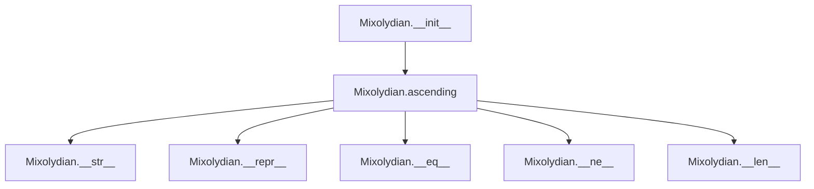

## Raises:
- `NoteFormatError`: Raised in `__init__` when the note parameter contains lowercase letters (invalid note format)
- `RangeError`: Raised in `degree()` method when degree_number is less than 1 (inherited from `_Scale`)

## Example:
```python
# Create a Mixolydian scale starting on C
mixolydian_scale = Mixolydian('C', 1)  # Create C Mixolydian scale

# Generate ascending scale sequence
ascending_notes = mixolydian_scale.ascending()  # ['C', 'D', 'E', 'F', 'G', 'A', 'Bb', 'C']

# Create a multi-octave Mixolydian scale
multi_octave_scale = Mixolydian('A', 2)  # Create A Mixolydian scale spanning 2 octaves

# Generate ascending sequence for multi-octave scale
multi_ascending = multi_octave_scale.ascending()  # ['A', 'B', 'C#', 'D', 'E', 'F#', 'G', 'A', 'B', 'C#', 'D', 'E', 'F#', 'G', 'A']
```

### `mingus.core.scales.Mixolydian.__init__` · *method*

## Summary:
Initializes a Mixolydian scale object with a specified tonic note and octave range, setting the scale's descriptive name.

## Description:
This method constructs a Mixolydian scale instance by initializing the parent scale class with the provided note and octaves parameters, then formats and assigns a descriptive name to the scale. The Mixolydian scale is a musical mode characterized by a flattened seventh degree, commonly used in folk and popular music.

## Args:
    note (str): The tonic note of the scale, represented as a string (e.g., 'C', 'D#'). Must be a valid note name without lowercase letters.
    octaves (int): The number of octaves the scale spans. Defaults to 1. Must be a positive integer.

## Returns:
    None: This method initializes the object's state and does not return a value.

## Raises:
    None explicitly documented: This method delegates initialization to the parent class, which may raise exceptions related to invalid note formats or octave ranges.

## State Changes:
    Attributes READ: 
        - self.tonic: The root note of the scale, inherited from the parent class
    Attributes WRITTEN:
        - self.name: Set to "{0} mixolydian" formatted with the tonic note
        - self.tonic: Inherited from parent class initialization
        - self.octaves: Inherited from parent class initialization

## Constraints:
    Preconditions:
        - The note parameter must be a valid note name string (uppercase letters only)
        - The octaves parameter must be a positive integer
    Postconditions:
        - The object is properly initialized with the specified tonic and octave range
        - The name attribute is set to the formatted string "{tonic} mixolydian"

## Side Effects:
    None: This method performs no I/O operations or external service calls. It only modifies the object's internal state.

### `mingus.core.scales.Mixolydian.ascending` · *method*

## Summary:
Generates the ascending sequence of a Mixolydian scale by combining diatonic notes with octave repetition.

## Description:
This method constructs the ascending form of a Mixolydian scale by creating a diatonic scale with semitone positions at degrees 3 and 6, then repeating this pattern across the specified number of octaves and appending the tonic note to complete the scale sequence. The Mixolydian scale is characterized by a flattened seventh degree compared to the major scale.

The implementation leverages the Diatonic class to generate the base pattern, removes the final note to avoid duplication, multiplies by the number of octaves, and appends the first note to close the scale.

## Args:
    self: The Mixolydian scale instance containing the tonic note and octave count

## Returns:
    list[str]: A list of note names representing the ascending Mixolydian scale, where each note is a string in standard musical notation (e.g., 'C', 'D#', 'Gb'). The list contains notes for the specified number of octaves, ending with the tonic note of the next octave.

## Raises:
    NoteFormatError: If the tonic note is invalid (contains lowercase letters)
    RangeError: If the octave count is invalid (less than 1)

## State Changes:
    - Attributes READ: self.tonic, self.octaves
    - Attributes WRITTEN: None

## Constraints:
    - Preconditions: The Mixolydian instance must have a valid tonic note and positive octaves count
    - Postconditions: The returned list will contain exactly (7 * self.octaves + 1) notes, with the first note matching the tonic and the last note being the tonic of the next octave

## Side Effects:
    None

## `mingus.core.scales.Aeolian` · *class*

## Summary:
Represents the Aeolian scale (natural minor scale) in music theory, inheriting from the abstract _Scale base class.

## Description:
The Aeolian class implements the natural minor scale pattern, which is one of the most common minor scales in Western music. It inherits from the _Scale base class and provides a specific implementation of the ascending() method that generates the characteristic Aeolian scale pattern by leveraging the Diatonic class with semitone positions at degrees 2 and 5.

The Aeolian scale follows the interval pattern: whole, half, whole, whole, half, whole, whole (W-H-W-W-H-W-W), which corresponds to the relative minor of the major scale. For example, A Aeolian is the relative minor of C major. The implementation specifically uses a Diatonic scale with semitones at positions 2 and 5 to construct the proper minor scale pattern, then manipulates the result to ensure the correct scale structure.

## State:
- `tonic` (str): The root note of the scale, inherited from _Scale base class. Must be a valid note name string (e.g., 'C', 'D#') and cannot contain lowercase letters.
- `octaves` (int): Number of octaves the scale spans, inherited from _Scale base class. Must be a positive integer.
- `type` (str): Class attribute set to "ancient", indicating this scale type designation.
- `name` (str): Instance attribute formatted as "{tonic} aeolian" that describes the scale.

## Lifecycle:
- Creation: Instantiate with a root note string and optional number of octaves (defaults to 1)
- Usage: Call the `ascending()` method to generate the complete ascending Aeolian scale sequence
- Destruction: No special cleanup required; uses standard Python garbage collection

## Method Map:


## Raises:
- `NoteFormatError`: Raised in __init__ when the note parameter contains lowercase letters (invalid note format)
- `RangeError`: Raised in degree() method when degree_number is less than 1 (inherited from _Scale)

## Example:
```python
# Create an A Aeolian scale spanning 1 octave
aeolian_scale = Aeolian('A', 1)  # Creates A aeolian scale

# Generate ascending scale sequence
ascending_notes = aeolian_scale.ascending()  # ['A', 'B', 'C', 'D', 'E', 'F', 'G', 'A']

# Create a C Aeolian scale spanning 2 octaves
aeolian_scale_2 = Aeolian('C', 2)  # Creates C aeolian scale spanning 2 octaves

# Generate ascending scale sequence
ascending_notes_2 = aeolian_scale_2.ascending()  # ['C', 'D', 'Eb', 'F', 'G', 'Ab', 'Bb', 'C', 'D', 'Eb', 'F', 'G', 'Ab', 'Bb', 'C']
```

### `mingus.core.scales.Aeolian.__init__` · *method*

## Summary:
Initializes an Aeolian scale instance with a tonic note and octave count, setting the scale's name attribute.

## Description:
The Aeolian.__init__ method constructs an Aeolian scale object by initializing the parent _Scale class with the provided note and octaves parameters, then formats and assigns the scale's name attribute. This method ensures proper instantiation of Aeolian scales with appropriate validation and naming conventions.

## Args:
    note (str): The tonic note of the scale, must be a valid note name string (e.g., 'C', 'D#') without lowercase letters.
    octaves (int): Number of octaves the scale spans, defaults to 1. Must be a positive integer.

## Returns:
    None: This method initializes the object state and returns nothing.

## Raises:
    NoteFormatError: Raised when the note parameter contains lowercase letters (invalid note format), inherited from _Scale.__init__
    RangeError: Raised when octaves parameter is not a positive integer, inherited from _Scale.__init__

## State Changes:
    Attributes READ: self.tonic
    Attributes WRITTEN: self.name

## Constraints:
    Preconditions: 
    - note must be a valid note name string (uppercase letters only)
    - octaves must be a positive integer
    Postconditions:
    - self.tonic is properly initialized from the note parameter
    - self.octaves is properly initialized from the octaves parameter
    - self.name is set to "{0} aeolian".format(self.tonic)

## Side Effects:
    None: This method performs no I/O operations or external service calls.

### `mingus.core.scales.Aeolian.ascending` · *method*

## Summary:
Generates an ascending Aeolian scale (natural minor scale) by constructing a diatonic scale with specific semitone positions and manipulating the result to form the proper minor scale pattern.

## Description:
Creates an ascending Aeolian scale (also known as the natural minor scale) by leveraging the Diatonic class with semitone positions at degrees 2 and 5. The method constructs the basic diatonic pattern, removes the final note to avoid duplication, then repeats the pattern for the specified number of octaves before appending the initial note to close the scale.

This method is separated from inline implementation to provide a clean, reusable interface for generating Aeolian scales while maintaining consistency with the broader musical scale framework in mingus.

## Args:
    None - Uses instance attributes exclusively

## Returns:
    list[str]: A list of note strings representing the ascending Aeolian scale, with length 7 * self.octaves + 1, starting and ending with the tonic note

## Raises:
    None - No explicit exceptions raised by this method

## State Changes:
    Attributes READ: self.tonic, self.octaves
    Attributes WRITTEN: None - This method is read-only

## Constraints:
    Preconditions:
    - self.tonic must be a valid musical note string (e.g., 'C', 'D#')
    - self.octaves must be a positive integer
    
    Postconditions:
    - The returned list contains exactly 7 * self.octaves + 1 notes
    - The first and last notes in the returned list are identical (tonic)
    - The pattern follows the Aeolian scale structure: whole, half, whole, whole, half, whole, whole

## Side Effects:
    None - This method performs no I/O operations or external service calls

## `mingus.core.scales.Locrian` · *class*

## Summary:
Represents the Locrian scale, an ancient musical scale pattern characterized by its distinctive interval structure with a diminished fifth.

## Description:
The Locrian scale is one of the seven modes in Western music theory, specifically the seventh mode of the harmonic major scale. It's characterized by its unique interval pattern and is often considered the least common of the modes due to its dissonant nature. This implementation constructs the Locrian scale by utilizing the Diatonic scale with specific semitone positions to generate the correct interval sequence.

The Locrian scale features the interval pattern: half-step, whole-step, whole-step, half-step, whole-step, whole-step. It's built on the seventh degree of the harmonic major scale and is typically used in advanced jazz harmony and experimental music.

This class should be instantiated through the standard musical scale creation patterns, typically via factory methods or direct instantiation when constructing musical scales programmatically.

## State:
- `tonic` (str): The root note of the scale, inherited from `_Scale`. Must be a valid note name string (e.g., 'C', 'D#') and cannot contain lowercase letters.
- `octaves` (int): Number of octaves the scale spans, inherited from `_Scale`. Must be a positive integer.
- `type` (str): Static attribute set to "ancient", indicating this scale's historical classification.
- `name` (str): Formatted name of the scale in the format "{tonic} locrian".

## Lifecycle:
- Creation: Instantiate with a valid note string and optional octave count (defaults to 1)
- Usage: Call the `ascending()` method to generate the complete scale sequence
- Destruction: No special cleanup required; uses standard Python garbage collection

## Method Map:
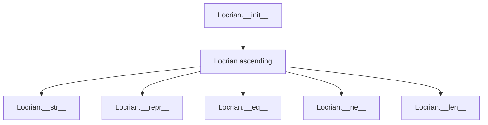

## Raises:
- `NoteFormatError`: Raised in `__init__` when the note parameter contains lowercase letters (invalid note format), inherited from `_Scale.__init__`
- `RangeError`: Raised in `degree()` method when degree_number is less than 1, inherited from `_Scale`

## Example:
```python
# Create a Locrian scale starting on C
locrian_scale = Locrian('C', 1)  # Creates C locrian scale

# Generate ascending scale sequence
ascending_notes = locrian_scale.ascending()  # ['C', 'Db', 'Eb', 'F', 'Gb', 'Ab', 'Bb', 'C']

# The scale will span multiple octaves if specified
multi_octave_scale = Locrian('D', 2)  # Creates D locrian scale spanning 2 octaves
```

### `mingus.core.scales.Locrian.__init__` · *method*

## Summary:
Initializes a Locrian scale instance with a specified tonic note and octave count, setting the scale's name attribute.

## Description:
Constructs a Locrian scale object by calling the parent _Scale class constructor and formatting the scale's name attribute. The Locrian scale is characterized by its distinctive interval pattern and is one of the seven modes in Western music theory.

This method serves as the primary constructor for Locrian scale instances, ensuring proper initialization of the scale's tonic note and octave span while establishing the descriptive name format for the scale.

## Args:
    note (str): The root note of the scale, must be a valid note name string (e.g., 'C', 'D#') and cannot contain lowercase letters.
    octaves (int): Number of octaves the scale spans, defaults to 1. Must be a positive integer.

## Returns:
    None - This method initializes the object in-place and does not return a value.

## Raises:
    NoteFormatError: Raised when the note parameter contains lowercase letters (invalid note format), inherited from _Scale.__init__
    RangeError: Raised when octaves parameter is not a positive integer, inherited from _Scale.__init__

## State Changes:
    Attributes READ: self.tonic
    Attributes WRITTEN: self.name

## Constraints:
    Preconditions:
    - The note parameter must be a valid uppercase note name string
    - The octaves parameter must be a positive integer
    - The note parameter cannot contain lowercase letters
    
    Postconditions:
    - The object is properly initialized with the specified tonic and octave count
    - The self.name attribute is set to "{tonic} locrian" format

## Side Effects:
    None - This method performs no I/O operations or external service calls

### `mingus.core.scales.Locrian.ascending` · *method*

## Summary:
Generates an ascending Locrian scale by constructing a diatonic scale with semitones at positions 1 and 4, then extending it across multiple octaves.

## Description:
Creates an ascending Locrian scale pattern by first generating a diatonic scale with semitones at positions 1 and 4, then manipulating the result to form the characteristic Locrian scale. The Locrian scale is the most unusual of the seven modes, characterized by having a minor second between the first and second degrees, and a diminished fifth between the fourth and fifth degrees.

This method is specifically implemented for Locrian scales because it defines their unique interval pattern, which differs from standard diatonic scales. The implementation leverages the Diatonic class to construct the base pattern and applies octave repetition to extend the scale across the specified number of octaves.

## Args:
    None - Uses instance attributes exclusively

## Returns:
    list[str]: A list of note strings representing the ascending Locrian scale, with length 7 * self.octaves + 1. The scale begins and ends with the tonic note, and follows the Locrian interval pattern (minor second, major second, minor second, minor second, major second, major second, minor second).

## Raises:
    None - No explicit exceptions raised by this method

## State Changes:
    Attributes READ: self.tonic, self.octaves
    Attributes WRITTEN: None - This method is read-only

## Constraints:
    Preconditions:
    - self.tonic must be a valid musical note string
    - self.octaves must be a positive integer
    
    Postconditions:
    - The returned list contains exactly 7 * self.octaves + 1 notes
    - The first and last notes in the returned list are identical (tonic)
    - The scale follows the Locrian pattern with semitones at positions 1 and 4

## Side Effects:
    None - This method performs no I/O operations or external service calls

## `mingus.core.scales.Major` · *class*

## Summary:
Represents a major scale in music theory, inheriting from the abstract _Scale base class.

## Description:
The Major class implements a concrete musical scale that generates major scale patterns. It inherits from _Scale and provides specific behavior for major scales, including ascending sequences and proper naming conventions. This class is designed to be instantiated through its constructor with a tonic note and optional octave count.

The class serves as a specialized implementation of musical scales, providing a standardized interface for accessing major scale information while maintaining consistency with the broader scale abstraction framework.

## State:
- `type` (str): Class attribute indicating this is a major scale, always set to "major"
- `name` (str): Instance attribute containing the full name of the scale (e.g., "C major"), constructed from the tonic note
- `tonic` (str): Inherited from _Scale, represents the root note of the scale
- `octaves` (int): Inherited from _Scale, indicates how many octaves the scale spans

## Lifecycle:
- Creation: Instantiate with a valid note string and optional octaves parameter (defaults to 1)
- Usage: Call the `ascending()` method to retrieve the major scale notes in ascending order
- Destruction: Standard Python garbage collection handles cleanup

## Method Map:
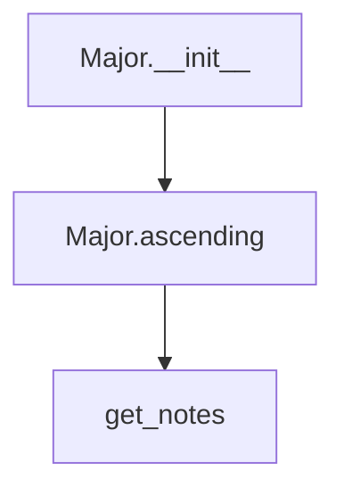

## Raises:
- `NoteFormatError`: Raised by the parent _Scale.__init__ when the note parameter contains lowercase letters (invalid note format)
- `RangeError`: Raised by the parent _Scale.__init__ when octaves parameter is invalid

## Example:
```python
# Create a C major scale spanning 1 octave
c_major = Major('C', 1)  # Creates C major scale

# Get ascending notes
ascending_notes = c_major.ascending()  # Returns ['C', 'D', 'E', 'F', 'G', 'A', 'B', 'C']

# Create a G major scale spanning 2 octaves
g_major = Major('G', 2)  # Creates G major scale spanning 2 octaves

# Get ascending notes
ascending_notes = g_major.ascending()  # Returns ['G', 'A', 'B', 'C', 'D', 'E', 'F#', 'G', 'A', 'B', 'C', 'D', 'E', 'F#', 'G']
```

### `mingus.core.scales.Major.__init__` · *method*

## Summary:
Initializes a Major scale object with a specified tonic note and octave count, setting the scale's name attribute to reflect the major scale pattern.

## Description:
The `__init__` method constructs a Major scale instance by calling the parent _Scale class constructor and then setting the instance's name attribute to a formatted string indicating the scale type. This method ensures proper initialization of the scale's tonic note and octave span while establishing the descriptive name for the scale.

## Args:
    note (str): The tonic note of the major scale, represented as a string (e.g., 'C', 'D#'). Must follow proper note formatting conventions.
    octaves (int, optional): The number of octaves the scale spans. Defaults to 1. Must be a positive integer.

## Returns:
    None: This method initializes the object state and does not return a value.

## Raises:
    NoteFormatError: Raised when the note parameter contains lowercase letters, violating note formatting requirements.
    RangeError: Raised when the octaves parameter is invalid (e.g., negative or zero).

## State Changes:
    Attributes READ: 
    - self.tonic: Read to format the scale name
    Attributes WRITTEN:
    - self.name: Set to "{0} major".format(self.tonic) to create the descriptive scale name

## Constraints:
    Preconditions:
    - The note parameter must be a valid note name string (uppercase letters, possibly with sharps/flats)
    - The octaves parameter must be a positive integer
    Postconditions:
    - The instance will have a properly initialized tonic note
    - The instance will have a valid octaves count
    - The instance will have a name attribute formatted as "{tonic} major"

## Side Effects:
    None: This method performs no I/O operations or external service calls. It only manipulates internal object state.

### `mingus.core.scales.Major.ascending` · *method*

## Summary:
Generates an ascending musical scale by repeating the base scale notes for the specified number of octaves and appending the tonic note to complete the scale.

## Description:
This method constructs an ascending musical scale by retrieving the base notes for the scale's tonic, repeating them for the specified octave range, and appending the tonic note to close the scale. It's designed to create complete scale sequences that span multiple octaves while maintaining proper musical structure.

The method is separated from inline logic to provide a clean interface for scale generation and to enable reuse across different scale types that might inherit from a common base Scale class.

## Args:
    None

## Returns:
    list[str]: A list of note names representing the ascending scale, where each note is a string in standard musical notation (e.g., "C", "C#", "Db", "Bb"). The list contains the base scale notes repeated for the specified octaves plus the tonic note appended to complete the scale. The length of the returned list equals (7 * self.octaves) + 1, where 7 represents the number of notes in a diatonic scale.

## Raises:
    NoteFormatError: When the tonic note specified by self.tonic is not recognized or valid according to the module's key validation rules.

## State Changes:
    Attributes READ: self.tonic, self.octaves
    Attributes WRITTEN: None

## Constraints:
    Preconditions:
    - self.tonic must be a valid key string recognized by the get_notes() function
    - self.octaves must be a positive integer indicating the number of octaves to repeat
    - The get_notes() function must be able to successfully generate notes for the specified tonic
    
    Postconditions:
    - The returned list always begins with the tonic note
    - The returned list always ends with the tonic note (to close the scale)
    - The length of the returned list equals (7 * self.octaves) + 1, where 7 represents the number of notes in a diatonic scale

## Side Effects:
    - Calls get_notes() which may modify the global _key_cache dictionary
    - No other I/O operations or external state mutations occur

## `mingus.core.scales.HarmonicMajor` · *class*

## Summary:
Represents a harmonic major scale in music theory, a variant of the major scale with a flattened seventh degree.

## Description:
The HarmonicMajor class implements a specialized musical scale that generates harmonic major scale patterns. It inherits from the abstract _Scale base class and provides specific behavior for harmonic major scales. This class creates a scale where the seventh degree is flattened compared to a standard major scale, creating a distinctive harmonic sound often used in classical and jazz music.

In a harmonic major scale, the pattern differs from a regular major scale in that the seventh degree is flattened (diminished) rather than natural. This creates a characteristic sound that's commonly found in classical compositions and jazz harmony.

The implementation works by taking a standard major scale, removing the highest note (making it 6 notes long), flattening the sixth degree (the former seventh), and then repeating the pattern for the requested number of octaves plus adding the first note again to complete the octave.

The class is designed to be instantiated through its constructor with a tonic note and optional octave count. It follows the standard scale interface defined by the _Scale base class while implementing the specific pattern of a harmonic major scale.

## State:
- `type` (str): Class attribute indicating this is a harmonic major scale, always set to "major"
- `name` (str): Instance attribute containing the full name of the scale (e.g., "C harmonic major"), constructed from the tonic note
- `tonic` (str): Inherited from _Scale, represents the root note of the scale
- `octaves` (int): Inherited from _Scale, indicates how many octaves the scale spans

## Lifecycle:
- Creation: Instantiate with a valid note string and optional octaves parameter (defaults to 1)
- Usage: Call the `ascending()` method to retrieve the harmonic major scale notes in ascending order
- Destruction: Standard Python garbage collection handles cleanup

## Method Map:
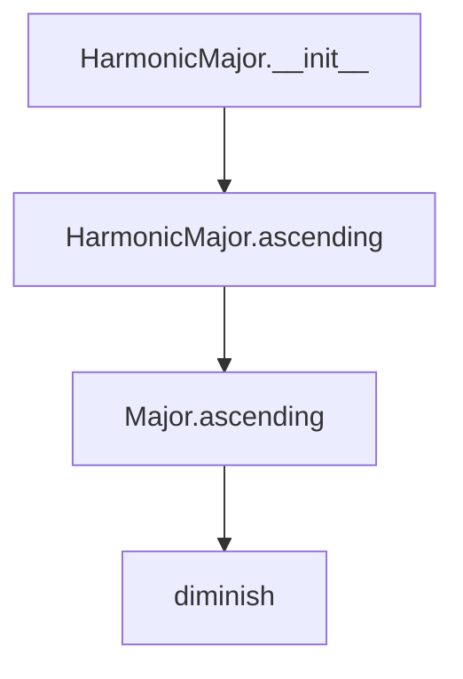

## Raises:
- `NoteFormatError`: Raised by the parent _Scale.__init__ when the note parameter contains lowercase letters (invalid note format)
- `RangeError`: Raised by the parent _Scale.__init__ when octaves parameter is invalid

## Example:
```python
# Create a C harmonic major scale spanning 1 octave
c_harmonic_major = HarmonicMajor('C', 1)  # Creates C harmonic major scale

# Get ascending notes
ascending_notes = c_harmonic_major.ascending()  # Returns ['C', 'D', 'E', 'F', 'G', 'A', 'Bb', 'C']

# Create a G harmonic major scale spanning 2 octaves
g_harmonic_major = HarmonicMajor('G', 2)  # Creates G harmonic major scale spanning 2 octaves

# Get ascending notes
ascending_notes = g_harmonic_major.ascending()  # Returns ['G', 'A', 'B', 'C', 'D', 'E', 'F', 'G', 'A', 'B', 'C', 'D', 'E', 'F', 'G']
```

### `mingus.core.scales.HarmonicMajor.__init__` · *method*

## Summary:
Initializes a HarmonicMajor scale object with a specified tonic note and octave count, setting the scale's name attribute.

## Description:
The `__init__` method constructs a HarmonicMajor scale instance by calling the parent class constructor to initialize the tonic note and octave count, then formats and assigns a descriptive name to the scale. This method ensures proper initialization of the scale's fundamental properties while maintaining consistency with the musical scale interface.

This method is separated from inline initialization to ensure proper inheritance chain execution and to centralize the naming logic for harmonic major scales. The naming convention follows the pattern "{tonic} harmonic major" to clearly identify the scale type and root note.

## Args:
    note (str): The tonic note of the scale, represented as a string (e.g., 'C', 'D#'). Must follow valid note naming conventions.
    octaves (int): Number of octaves the scale should span. Defaults to 1. Must be a positive integer.

## Returns:
    None: This method initializes the object's state and does not return a value.

## Raises:
    NoteFormatError: Raised when the note parameter contains lowercase letters, violating note format requirements.
    RangeError: Raised when the octaves parameter is invalid (negative or zero).

## State Changes:
    Attributes READ: 
        - self.tonic: Accesses the tonic note value inherited from the parent _Scale class
    Attributes WRITTEN:
        - self.name: Sets the descriptive name of the scale in the format "{tonic} harmonic major"

## Constraints:
    Preconditions:
        - The note parameter must be a valid note name string (uppercase letters, possibly with sharps/flats)
        - The octaves parameter must be a positive integer
    Postconditions:
        - The object is properly initialized with a valid tonic note
        - The octaves attribute is set to the provided value
        - The name attribute is set to the formatted string "{tonic} harmonic major"

## Side Effects:
    None: This method performs no I/O operations or external service calls. It only manipulates internal object state.

### `mingus.core.scales.HarmonicMajor.ascending` · *method*

## Summary:
Returns the ascending notes of a harmonic major scale by modifying the sixth degree of the major scale.

## Description:
Generates the ascending sequence of notes for a harmonic major scale. This method builds upon the standard major scale pattern by flattening the sixth degree (the leading tone) to create the characteristic harmonic major sound. The resulting scale pattern is repeated across the specified number of octaves.

This method is separated from inline logic to provide a clean interface for retrieving harmonic major scale notes while maintaining consistency with the scale abstraction framework.

## Args:
    None

## Returns:
    list[str]: A list of note names representing the ascending harmonic major scale. The list contains the pattern repeated across self.octaves octaves, with the sixth degree flattened, followed by the tonic note to complete the octave.

## Raises:
    None

## State Changes:
    Attributes READ: self.tonic, self.octaves
    Attributes WRITTEN: None

## Constraints:
    Preconditions: The HarmonicMajor instance must be properly initialized with a valid tonic note and positive octaves count
    Postconditions: The returned list will contain exactly (7 * self.octaves + 1) notes, where the last note matches the first note of the pattern

## Side Effects:
    None

## `mingus.core.scales.NaturalMinor` · *class*

## Summary:
Represents a natural minor musical scale with ascending note sequences following the standard natural minor interval pattern.

## Description:
The NaturalMinor class implements the natural minor scale pattern, which follows the interval structure: whole, half, whole, whole, half, whole, whole. This class inherits from the abstract `_Scale` base class and provides concrete implementations for natural minor scale operations.

This class is designed to be instantiated through its constructor with a tonic note and optional octave count. It's particularly useful for music theory applications requiring natural minor scale generation, such as composition analysis, educational tools, or music application development.

## State:
- `type` (str): Class attribute indicating the scale type is "minor"
- `tonic` (str): Inherited from `_Scale`, represents the root note of the scale (e.g., 'C', 'D#'). Must be a valid note name.
- `octaves` (int): Inherited from `_Scale`, number of octaves the scale spans (must be positive integer, default is 1)
- `name` (str): Instance attribute formatted as "{tonic} natural minor"

## Lifecycle:
- Creation: Instantiate with a valid note string and optional octaves count (default 1)
- Usage: Call `ascending()` method to retrieve the scale's ascending note sequence
- Destruction: Standard Python garbage collection handles cleanup

## Method Map:
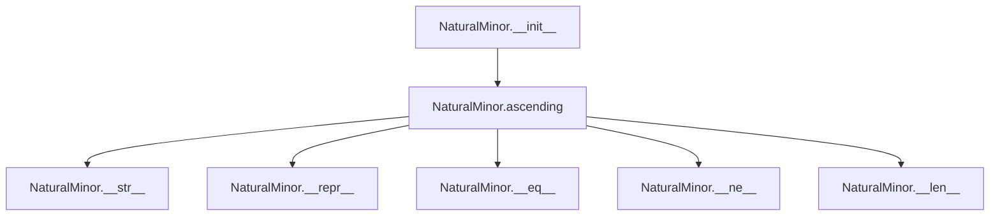

## Raises:
- `NoteFormatError`: Raised by parent `_Scale.__init__` when the note parameter contains lowercase letters (invalid note format)
- `RangeError`: Raised by parent `_Scale.__init__` when octaves parameter is not a positive integer

## Example:
```python
# Create a C natural minor scale spanning 1 octave
scale = NaturalMinor('C')

# Get ascending notes - follows natural minor pattern: W-H-W-W-H-W-W
ascending_notes = scale.ascending()  # ['C', 'D', 'Eb', 'F', 'G', 'Ab', 'Bb']

# Create a G natural minor scale spanning 2 octaves
scale2 = NaturalMinor('G', 2)

# Get ascending notes for 2 octaves
ascending_notes2 = scale2.ascending()  # ['G', 'A', 'Bb', 'C', 'D', 'Eb', 'F', 'G']
```

### `mingus.core.scales.NaturalMinor.__init__` · *method*

## Summary:
Initializes a NaturalMinor scale object with the specified tonic note and octave count, setting the scale's name attribute.

## Description:
Constructs a NaturalMinor scale instance by calling the parent _Scale class constructor and then formatting the scale's name attribute. This method establishes the fundamental properties of a natural minor scale including its root note and octave span.

The NaturalMinor class represents the natural minor scale pattern (W-H-W-W-H-W-W) and this constructor ensures proper initialization of scale properties. The method is separated from inline logic to maintain clean inheritance structure and ensure consistent initialization across scale types.

## Args:
    note (str): The tonic note of the scale (e.g., 'C', 'D#'). Must be a valid uppercase note name.
    octaves (int): Number of octaves the scale spans. Defaults to 1. Must be a positive integer.

## Returns:
    None: This method initializes the object's state and does not return a value.

## Raises:
    NoteFormatError: Raised by parent _Scale.__init__ when the note parameter contains lowercase letters (invalid note format).
    RangeError: Raised by parent _Scale.__init__ when octaves parameter is not a positive integer.

## State Changes:
    Attributes READ: self.tonic
    Attributes WRITTEN: self.name

## Constraints:
    Preconditions: 
    - The note parameter must be a valid uppercase note name (e.g., 'C', 'D#', 'Gb')
    - The octaves parameter must be a positive integer
    Postconditions:
    - self.tonic is set to the provided note value
    - self.name is set to "{tonic} natural minor" format
    - self.octaves is set to the provided octaves value

## Side Effects:
    None: This method performs no I/O operations or external service calls.

### `mingus.core.scales.NaturalMinor.ascending` · *method*

## Summary:
Returns the ascending sequence of notes for a natural minor scale, including the tonic note repeated at the octave boundary.

## Description:
This method generates the ascending form of a natural minor scale by retrieving the seven notes of the scale for the specified tonic and repeating them for the requested number of octaves, then appending the tonic note again to complete the scale pattern. This follows the standard musical convention where a scale ends on the same note it began, creating a closed circle.

The method is designed to be called as part of the scale's normal operation, typically when users want to retrieve the complete ascending sequence of notes in a natural minor scale. It's implemented as a separate method to encapsulate the specific logic for natural minor scale construction while maintaining consistency with the abstract base scale interface.

## Args:
    None - This method takes no arguments beyond the implicit `self` parameter.

## Returns:
    list[str]: A list of note names representing the ascending natural minor scale. The list contains:
        - The base notes of the natural minor scale for the tonic (7 notes)
        - Repeated for the specified number of octaves (`self.octaves`) 
        - With the first note appended at the end to close the scale
    For example, a C natural minor scale with 1 octave would return: ["C", "D", "Eb", "F", "G", "Ab", "Bb", "C"]

## Raises:
    NoteFormatError: When the `self.tonic` attribute contains invalid characters or format that cannot be processed by the underlying `get_notes()` function.

## State Changes:
    Attributes READ: 
    - self.tonic (str): The root note of the scale, used to determine the scale pattern
    - self.octaves (int): The number of octaves to span, used to determine repetition count
    
    Attributes WRITTEN: 
    - None: This method does not modify any instance attributes

## Constraints:
    Preconditions:
    - `self.tonic` must be a valid note name string (e.g., "C", "D#", "Gb")
    - `self.octaves` must be a positive integer (default is 1)
    - The `get_notes()` function must be able to process `self.tonic.lower()`
    
    Postconditions:
    - The returned list always contains exactly (7 * self.octaves + 1) elements
    - All elements are valid note names in proper string format
    - The first and last elements are identical (the tonic note)

## Side Effects:
    - Calls the `get_notes()` function which may modify the global `_key_cache` dictionary
    - No other I/O operations or external state mutations occur

## `mingus.core.scales.HarmonicMinor` · *class*

## Summary:
Represents a harmonic minor musical scale with an augmented seventh degree, following the interval pattern: whole, half, whole, whole, half, whole, whole.

## Description:
The HarmonicMinor class implements the harmonic minor scale pattern, which differs from the natural minor by raising the seventh degree by a semitone (augmenting it). This creates a distinctive sound characteristic of harmonic minor scales and is commonly used in classical and romantic music compositions. The class inherits from the abstract `_Scale` base class and provides a concrete implementation for harmonic minor scale operations.

This class is designed to be instantiated through its constructor with a tonic note and optional octave count. It's particularly useful for music theory applications requiring harmonic minor scale generation, such as composition analysis, educational tools, or music application development.

The harmonic minor scale is characterized by its unique interval pattern where the seventh degree is raised by a semitone compared to the natural minor scale. This augmentation creates a leading tone that resolves to the tonic, giving the scale its distinctive sound.

## State:
- `type` (str): Class attribute indicating the scale type is "minor"
- `tonic` (str): Inherited from `_Scale`, represents the root note of the scale (e.g., 'C', 'D#'). Must be a valid note name.
- `octaves` (int): Inherited from `_Scale`, number of octaves the scale spans (must be positive integer, default is 1)
- `name` (str): Instance attribute formatted as "{tonic} harmonic minor"

## Lifecycle:
- Creation: Instantiate with a valid note string and optional octaves count (default 1)
- Usage: Call `ascending()` method to retrieve the scale's ascending note sequence
- Destruction: Standard Python garbage collection handles cleanup

## Method Map:
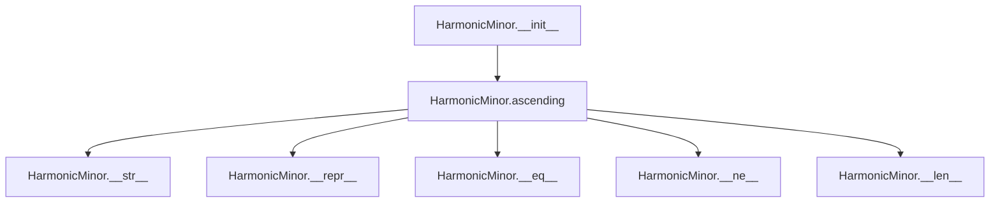

## Raises:
- `NoteFormatError`: Raised by parent `_Scale.__init__` when the note parameter contains lowercase letters (invalid note format)
- `RangeError`: Raised by parent `_Scale.__init__` when octaves parameter is not a positive integer

## Example:
```python
# Create a C harmonic minor scale spanning 1 octave
scale = HarmonicMinor('C')

# Get ascending notes - follows harmonic minor pattern: W-H-W-W-H-AUGMENTED_W-W
# Natural minor: C-D-Eb-F-G-Ab-Bb
# Harmonic minor: C-D-Eb-F-G-Ab-B (with B raised to B#)
ascending_notes = scale.ascending()  # ['C', 'D', 'Eb', 'F', 'G', 'Ab', 'B']

# Create a G harmonic minor scale spanning 2 octaves
scale2 = HarmonicMinor('G', 2)

# Get ascending notes for 2 octaves
ascending_notes2 = scale2.ascending()  # ['G', 'A', 'Bb', 'C', 'D', 'Eb', 'F#', 'G']
```

### `mingus.core.scales.HarmonicMinor.__init__` · *method*

## Summary:
Initializes a harmonic minor scale instance with the specified tonic note and octave count, setting the scale's name attribute.

## Description:
Constructs a harmonic minor scale object by calling the parent `_Scale` class constructor with the provided note and octaves parameters, then formats and assigns a descriptive name to the instance. This method serves as the primary entry point for creating harmonic minor scale objects and ensures proper initialization of the scale's fundamental properties.

The method is separated from inline initialization logic to maintain clean code organization and leverage inheritance properly. It ensures that all harmonic minor scale instances inherit the standard scale behaviors while providing a consistent naming convention that identifies the scale type and tonic.

## Args:
    note (str): The tonic note of the scale, represented as a string (e.g., 'C', 'D#'). Must be a valid note name.
    octaves (int, optional): The number of octaves the scale spans. Defaults to 1. Must be a positive integer.

## Returns:
    None: This method initializes the object's state and does not return a value.

## Raises:
    NoteFormatError: Raised by the parent `_Scale.__init__` method when the note parameter contains lowercase letters (invalid note format).
    RangeError: Raised by the parent `_Scale.__init__` method when octaves parameter is not a positive integer.

## State Changes:
    Attributes READ: self.tonic (inherited from parent class)
    Attributes WRITTEN: self.name (sets the instance name to "{tonic} harmonic minor")

## Constraints:
    Preconditions:
        - The note parameter must be a valid note name (uppercase letters, optionally with sharps or flats)
        - The octaves parameter must be a positive integer
    Postconditions:
        - The instance is properly initialized with the specified tonic and octave count
        - The instance name is set to the formatted string "{tonic} harmonic minor"
        - The object inherits all standard scale behaviors from the `_Scale` parent class

## Side Effects:
    None: This method performs no I/O operations or external state mutations beyond initializing the object's attributes.

### `mingus.core.scales.HarmonicMinor.ascending` · *method*

## Summary:
Returns the ascending note sequence for a harmonic minor scale by modifying the natural minor scale's seventh degree to raise it by a semitone.

## Description:
Generates the ascending sequence of notes for a harmonic minor scale, which differs from the natural minor scale by raising the seventh degree by a semitone (sharpening it). This method leverages the NaturalMinor class to obtain the base pattern and then applies the harmonic minor modification by augmenting the seventh note.

The method is called during the scale generation process when retrieving the ascending sequence of notes for a harmonic minor scale. It's implemented as a separate method to encapsulate the specific logic required for harmonic minor scale construction, rather than inlining this modification logic.

## Args:
    None

## Returns:
    list[str]: A list of note strings representing the ascending harmonic minor scale. The sequence spans multiple octaves as defined by the instance's octaves property, with the seventh degree properly augmented. The returned list contains 7 * self.octaves + 1 elements, where the last element is the first note of the scale repeated at the next octave.

## Raises:
    None explicitly raised

## State Changes:
    Attributes READ: self.tonic, self.octaves
    Attributes WRITTEN: None

## Constraints:
    Preconditions:
        - The instance must be properly initialized with a valid tonic note
        - The octaves property must be a positive integer
    Postconditions:
        - Returns a list of note strings in proper musical notation
        - The returned list length equals 7 * self.octaves + 1
        - The seventh degree of each octave is augmented (sharp)
        - The sequence begins and ends with the same note (tonic) at different octaves

## Side Effects:
    None

## `mingus.core.scales.MelodicMinor` · *class*

## Summary:
Represents a melodic minor musical scale that modifies the natural minor pattern by raising the 6th and 7th degrees in ascending form.

## Description:
The MelodicMinor class implements the melodic minor scale, which follows the natural minor pattern in descending form but raises the 6th and 7th degrees in ascending form. This class inherits from the abstract _Scale base class and provides concrete implementations for melodic minor scale operations.

This class is designed to be instantiated through its constructor with a tonic note and optional octave count. It's particularly useful for music theory applications requiring melodic minor scale generation, such as composition analysis, educational tools, or music application development.

## State:
- `type` (str): Class attribute indicating the scale type is "minor"
- `tonic` (str): Inherited from `_Scale`, represents the root note of the scale (e.g., 'C', 'D#'). Must be a valid note name.
- `octaves` (int): Inherited from `_Scale`, number of octaves the scale spans (must be positive integer, default is 1)
- `name` (str): Instance attribute formatted as "{tonic} melodic minor"

## Lifecycle:
- Creation: Instantiate with a valid note string and optional octaves count (default 1)
- Usage: Call `ascending()` method to retrieve the scale's ascending note sequence with raised 6th and 7th degrees, or `descending()` method to retrieve the scale's descending note sequence following natural minor pattern
- Destruction: Standard Python garbage collection handles cleanup

## Method Map:
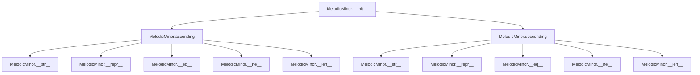

## Raises:
- `NoteFormatError`: Raised by parent `_Scale.__init__` when the note parameter contains lowercase letters (invalid note format)
- `RangeError`: Raised by parent `_Scale.__init__` when octaves parameter is not a positive integer

## Example:
```python
# Create a C melodic minor scale spanning 1 octave
scale = MelodicMinor('C')

# Get ascending notes - follows melodic minor pattern: W-H-W-W-H-W-W (with raised 6th and 7th)
ascending_notes = scale.ascending()  # ['C', 'D', 'Eb', 'F', 'G', 'A', 'B']

# Get descending notes - follows natural minor pattern: W-W-H-W-W-H-W
descending_notes = scale.descending()  # ['C', 'Bb', 'Ab', 'G', 'F', 'Eb', 'D']

# Create a G melodic minor scale spanning 2 octaves
scale2 = MelodicMinor('G', 2)

# Get ascending notes for 2 octaves
ascending_notes2 = scale2.ascending()  # ['G', 'A', 'Bb', 'C', 'D', 'E', 'F#', 'G']
```

### `mingus.core.scales.MelodicMinor.__init__` · *method*

## Summary:
Initializes a MelodicMinor scale instance with a tonic note and optional octave count, setting the instance name attribute.

## Description:
Constructs a MelodicMinor scale object by calling the parent _Scale class constructor and initializing the instance name. This method serves as the primary entry point for creating MelodicMinor scale instances, establishing the scale's root note and octave span while preparing the object for subsequent scale operations.

The method ensures proper initialization of inherited attributes from _Scale (tonic, octaves) and customizes the instance name to reflect the specific melodic minor scale being created.

## Args:
    note (str): The tonic note of the scale (e.g., 'C', 'D#'). Must be a valid uppercase note name without accidentals or lowercase letters.
    octaves (int, optional): Number of octaves the scale spans. Defaults to 1. Must be a positive integer.

## Returns:
    None: This method initializes the instance and does not return a value.

## Raises:
    NoteFormatError: Raised by parent _Scale.__init__ when the note parameter contains lowercase letters (invalid note format)
    RangeError: Raised by parent _Scale.__init__ when octaves parameter is not a positive integer

## State Changes:
    Attributes READ: self.tonic (inherited from _Scale parent class)
    Attributes WRITTEN: self.name (sets instance name to "{0} melodic minor" format)

## Constraints:
    Preconditions:
        - note must be a valid uppercase note name (e.g., 'C', 'D', 'Eb')
        - octaves must be a positive integer (>= 1)
    Postconditions:
        - self.tonic is set to the provided note parameter
        - self.octaves is set to the provided octaves parameter
        - self.name is set to "{0} melodic minor" where {0} is the tonic note

## Side Effects:
    None: This method performs no I/O operations or external service calls. It only initializes internal object state.

### `mingus.core.scales.MelodicMinor.ascending` · *method*

## Summary:
Generates the ascending melodic minor scale by raising the 6th and 7th degrees of the natural minor scale.

## Description:
Creates an ascending melodic minor scale by taking the natural minor scale pattern and augmenting the 6th and 7th degrees (relative to the tonic). This method implements the standard melodic minor scale construction where the ascending form raises the 6th and 7th scale degrees compared to the natural minor scale.

The method leverages the NaturalMinor class to obtain the base pattern, then modifies the appropriate degrees before constructing the complete scale sequence. The resulting scale spans the specified number of octaves and returns to the tonic in the final octave.

## Args:
    None

## Returns:
    list[str]: A list of note strings representing the ascending melodic minor scale. The list contains the scale notes repeated for the specified octaves plus the tonic note at the end to complete the scale pattern.

## Raises:
    None

## State Changes:
    Attributes READ: self.tonic, self.octaves
    Attributes WRITTEN: None

## Constraints:
    Preconditions:
        - self.tonic must be a valid note name (passed to parent _Scale.__init__)
        - self.octaves must be a positive integer (passed to parent _Scale.__init__)
    Postconditions:
        - Returns a list of note strings in ascending melodic minor pattern
        - The returned list length equals (7 * self.octaves) + 1
        - The first and last notes in the sequence are identical (tonic)

## Side Effects:
    None

### `mingus.core.scales.MelodicMinor.descending` · *method*

## Summary:
Returns the descending sequence of notes for a melodic minor scale, following the natural minor descending pattern with octave repetition.

## Description:
This method generates the descending form of a melodic minor scale by retrieving the descending sequence from a natural minor scale, removing the final note (which is the tonic), and then repeating the remaining 6-note sequence for the specified number of octaves before appending the first note to close the scale. This follows the musical convention where a scale ends on the same note it began, creating a closed circle.

The method leverages the natural minor scale's descending pattern to maintain consistency with musical theory, where melodic minor scales have the same descending pattern as natural minor scales, differing only in their ascending forms.

## Args:
    None - This method takes no arguments beyond the implicit `self` parameter.

## Returns:
    list[str]: A list of note names representing the descending melodic minor scale. The list contains:
        - The base notes of the natural minor scale in descending order (6 notes, excluding the final tonic note)
        - Repeated for the specified number of octaves (`self.octaves`) 
        - With the first note appended at the end to close the scale
    For example, a C melodic minor scale with 1 octave would return: ["C", "Bb", "Ab", "G", "F", "Eb", "D", "C"]

## Raises:
    NoteFormatError: When the `self.tonic` attribute contains invalid characters or format that cannot be processed by the underlying `get_notes()` function.

## State Changes:
    Attributes READ: 
    - self.tonic (str): The root note of the scale, used to determine the scale pattern
    - self.octaves (int): The number of octaves to span, used to determine repetition count
    
    Attributes WRITTEN: 
    - None: This method does not modify any instance attributes

## Constraints:
    Preconditions:
    - `self.tonic` must be a valid note name string (e.g., "C", "D#", "Gb")
    - `self.octaves` must be a positive integer (default is 1)
    - The `get_notes()` function must be able to process `self.tonic.lower()`
    
    Postconditions:
    - The returned list always contains exactly (6 * self.octaves + 1) elements
    - All elements are valid note names in proper string format
    - The first and last elements are identical (the tonic note)

## Side Effects:
    - Calls the `get_notes()` function which may modify the global `_key_cache` dictionary
    - No other I/O operations or external state mutations occur

## `mingus.core.scales.Bachian` · *class*

## Summary:
Represents a Bachian musical scale, a specialized variant of the melodic minor scale that omits the final note in each octave and repeats the first note at the octave boundary.

## Description:
The Bachian class implements a distinctive musical scale pattern derived from the melodic minor scale. This scale pattern removes the final note of the melodic minor ascending sequence and instead repeats the first note of the pattern at the octave boundary, creating a unique scale structure. This implementation is particularly useful for advanced music theory applications and specific compositional techniques.

This class is designed to be instantiated through its constructor with a tonic note and optional octave count. It inherits from the abstract `_Scale` base class and provides a concrete implementation of the Bachian scale pattern.

## State:
- `type` (str): Class attribute indicating the scale type is "minor" (inherited from parent class)
- `tonic` (str): Inherited from `_Scale`, represents the root note of the scale (e.g., 'C', 'D#'). Must be a valid note name.
- `octaves` (int): Inherited from `_Scale`, number of octaves the scale spans (must be positive integer, default is 1)
- `name` (str): Instance attribute formatted as "{tonic} Bachian", created during initialization

## Lifecycle:
- Creation: Instantiate with a valid note string and optional octaves count (default 1)
- Usage: Call `ascending()` method to retrieve the Bachian scale's ascending note sequence, or `descending()` method to retrieve the scale's descending note sequence (inherited from parent)
- Destruction: Standard Python garbage collection handles cleanup

## Method Map:
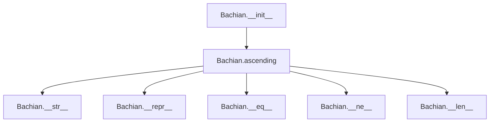

## Raises:
- `NoteFormatError`: Raised by parent `_Scale.__init__` when the note parameter contains lowercase letters (invalid note format)
- `RangeError`: Raised by parent `_Scale.__init__` when octaves parameter is not a positive integer

## Example:
```python
# Create a C Bachian scale spanning 1 octave
scale = Bachian('C')

# Get ascending notes - follows Bachian pattern: melodic minor without last note, then repeats first note
ascending_notes = scale.ascending()  # ['C', 'D', 'Eb', 'F', 'G', 'A']

# Create a G Bachian scale spanning 2 octaves
scale2 = Bachian('G', 2)

# Get ascending notes for 2 octaves
ascending_notes2 = scale2.ascending()  # ['G', 'A', 'Bb', 'C', 'D', 'E', 'G']
```

### `mingus.core.scales.Bachian.__init__` · *method*

## Summary:
Initializes a Bachian scale instance with a tonic note and optional octave count, setting the instance name to "{tonic} Bachian".

## Description:
Constructs a Bachian scale object by calling the parent `_Scale` class constructor and formatting the instance name. The Bachian scale is a specialized variant of the melodic minor scale that omits the final note in each octave and repeats the first note at the octave boundary.

This method serves as the entry point for creating Bachian scale instances and ensures proper initialization of the scale's fundamental properties including its tonic note, octave span, and descriptive name.

## Args:
    note (str): The tonic note of the scale, must be a valid note name (e.g., 'C', 'D#', 'Gb'). Cannot contain lowercase letters.
    octaves (int, optional): Number of octaves the scale spans. Defaults to 1. Must be a positive integer.

## Returns:
    None: This is a constructor method that initializes the object state.

## Raises:
    NoteFormatError: Raised by parent `_Scale.__init__` when the note parameter contains lowercase letters (invalid note format).
    RangeError: Raised by parent `_Scale.__init__` when octaves parameter is not a positive integer.

## State Changes:
    Attributes READ: 
        - self.tonic: Read from parent class initialization to format the name attribute
    Attributes WRITTEN:
        - self.name: Set to "{tonic} Bachian" format string

## Constraints:
    Preconditions:
        - The note parameter must be a valid note name (uppercase letters only)
        - The octaves parameter must be a positive integer
    Postconditions:
        - The object is properly initialized with a valid tonic note
        - The object has a valid octave count
        - The name attribute is set to the formatted string "{tonic} Bachian"

## Side Effects:
    None: This method performs no I/O operations or external service calls. It only modifies internal object state.

### `mingus.core.scales.Bachian.ascending` · *method*

## Summary:
Generates an ascending Bachian scale pattern by combining multiple octaves of a melodic minor scale with a closing note.

## Description:
The ascending method creates a Bachian scale by taking the ascending notes from a melodic minor scale starting at the same tonic, removing the final note to avoid duplication, then repeating the sequence for the specified number of octaves before adding the first note again to close the scale. This creates a continuous ascending pattern that spans multiple octaves.

This method is specifically implemented as a separate method because it defines the unique structural pattern of the Bachian scale, which differs from standard scales by its specific octave repetition and closure mechanism. The Bachian scale is a musical scale pattern that builds upon the melodic minor scale structure, typically used in classical music theory contexts.

## Args:
    None

## Returns:
    list[str]: A list of note strings representing the ascending Bachian scale pattern. The pattern consists of the melodic minor scale notes repeated for the specified number of octaves, with the first note appended at the end to close the scale. The length of the returned list is (len(melodic_minor_ascending) * self.octaves) + 1, where melodic_minor_ascending is the ascending notes of the melodic minor scale starting at self.tonic.

## Raises:
    None explicitly raised, but may propagate exceptions from MelodicMinor.ascending() or parent class operations.

## State Changes:
    Attributes READ: self.tonic, self.octaves
    Attributes WRITTEN: None

## Constraints:
    Preconditions: 
    - self.tonic must be a valid note name (passed to parent _Scale.__init__)
    - self.octaves must be a positive integer (passed to parent _Scale.__init__)
    
    Postconditions:
    - Returns a list of note strings in ascending order
    - The returned list length equals (len(melodic_minor_ascending) * self.octaves) + 1
    - The first and last notes in the returned list are identical
    - All notes in the returned list are valid note names

## Side Effects:
    None

## `mingus.core.scales.MinorNeapolitan` · *class*

## Summary:
Represents the minor Neapolitan scale, a specialized minor scale pattern used in classical music theory with distinctive ascending and descending forms.

## Description:
The MinorNeapolitan class implements the minor Neapolitan scale, a musical scale that combines elements from both harmonic and natural minor scales. This scale is characterized by its specific interval pattern and is commonly used in classical music composition and analysis. The class inherits from the abstract `_Scale` base class and provides concrete implementations for generating ascending and descending sequences of notes.

This class is designed to be instantiated with a tonic note and optional octave count. It's particularly useful for music theory applications requiring the generation of minor Neapolitan scale patterns, such as composition analysis, educational tools, or music application development.

## State:
- `type` (str): Class attribute indicating the scale type is "minor"
- `tonic` (str): Inherited from `_Scale`, represents the root note of the scale (e.g., 'C', 'D#'). Must be a valid note name.
- `octaves` (int): Inherited from `_Scale`, number of octaves the scale spans (must be positive integer, default is 1)
- `name` (str): Instance attribute formatted as "{tonic} minor Neapolitan"

## Lifecycle:
- Creation: Instantiate with a valid note string and optional octaves count (default 1)
- Usage: Call `ascending()` or `descending()` methods to retrieve the scale's note sequences
- Destruction: Standard Python garbage collection handles cleanup

## Method Map:
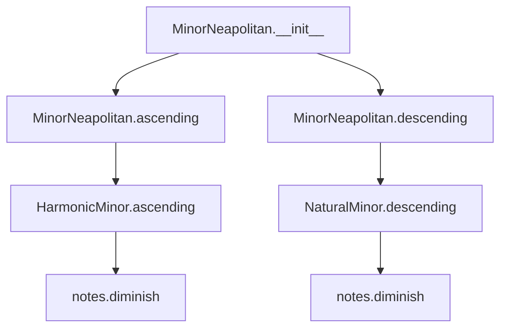

## Raises:
- `NoteFormatError`: Raised by parent `_Scale.__init__` when the note parameter contains lowercase letters (invalid note format)
- `RangeError`: Raised by parent `_Scale.__init__` when octaves parameter is not a positive integer

## Example:
```python
# Create a C minor Neapolitan scale spanning 1 octave
scale = MinorNeapolitan('C')

# Get ascending notes - follows minor Neapolitan pattern
# Starts with HarmonicMinor pattern but dims the second note
ascending_notes = scale.ascending()  # ['C', 'Db', 'Eb', 'F', 'G', 'Ab', 'Bb', 'C']

# Get descending notes - follows minor Neapolitan pattern
# Starts with NaturalMinor pattern but dims the seventh note  
descending_notes = scale.descending()  # ['C', 'Bb', 'Ab', 'G', 'F', 'Eb', 'Db', 'C']

# Create a G minor Neapolitan scale spanning 2 octaves
scale2 = MinorNeapolitan('G', 2)

# Get ascending notes for 2 octaves
ascending_notes2 = scale2.ascending()  # ['G', 'Ab', 'Bb', 'C', 'D', 'Eb', 'F', 'G', 'G', 'Ab', 'Bb', 'C', 'D', 'Eb', 'F', 'G']
```

### `mingus.core.scales.MinorNeapolitan.__init__` · *method*

## Summary:
Initializes a MinorNeapolitan scale instance with a tonic note and optional octave count, setting the instance name attribute.

## Description:
Constructs a MinorNeapolitan scale object by calling the parent `_Scale` class constructor with the provided note and octaves parameters, then formats and assigns a descriptive name to the instance. This method serves as the primary entry point for creating MinorNeapolitan scale instances.

The method is separated from inline initialization logic to ensure proper inheritance chain execution and to centralize the naming convention for MinorNeapolitan scales. This allows for consistent naming across all instances while maintaining the proper object initialization sequence.

## Args:
    note (str): The tonic note of the scale (e.g., 'C', 'D#'). Must be a valid note name and cannot contain lowercase letters.
    octaves (int, optional): Number of octaves the scale spans. Defaults to 1. Must be a positive integer.

## Returns:
    None: This method initializes the object state and does not return a value.

## Raises:
    NoteFormatError: Raised by parent `_Scale.__init__` when the note parameter contains lowercase letters (invalid note format).
    RangeError: Raised by parent `_Scale.__init__` when octaves parameter is not a positive integer.

## State Changes:
    Attributes READ: 
        - self.tonic: Accesses the inherited tonic note from the parent class
    Attributes WRITTEN:
        - self.name: Sets the instance name attribute to "{tonic} minor Neapolitan"

## Constraints:
    Preconditions:
        - The note parameter must be a valid note name (uppercase letters only)
        - The octaves parameter must be a positive integer
    Postconditions:
        - The object is properly initialized with the specified tonic and octave count
        - The instance name is set to the formatted string "{tonic} minor Neapolitan"

## Side Effects:
    None: This method performs no I/O operations or external service calls. It only modifies internal object state.

### `mingus.core.scales.MinorNeapolitan.ascending` · *method*

## Summary:
Returns the ascending note sequence for a minor Neapolitan scale, which modifies the harmonic minor pattern by flattening the second degree.

## Description:
Generates the ascending form of the minor Neapolitan scale by taking the ascending notes of a harmonic minor scale with the same tonic, removing the last note, flattening the second note (index 1), and then repeating the sequence for the specified number of octaves followed by the first note again.

This method implements the specific musical pattern of the minor Neapolitan scale, which is characterized by its distinctive interval structure and is commonly used in classical music composition. The method is separated from inline logic to provide a clean, reusable interface for retrieving the ascending scale notes.

## Args:
    None

## Returns:
    list[str]: A list of note names representing the ascending minor Neapolitan scale. The sequence follows the pattern: [tonic, flattened second, third, fourth, fifth, sixth, flattened seventh] repeated for the specified number of octaves, ending with the tonic note.

## Raises:
    None

## State Changes:
    Attributes READ: self.tonic, self.octaves
    Attributes WRITTEN: None

## Constraints:
    Preconditions: The `MinorNeapolitan` instance must have been properly initialized with a valid tonic note and positive integer octaves count.
    Postconditions: The returned list will contain exactly `7 * self.octaves + 1` notes, where the second note in each octave is flattened and the final note matches the first note.

## Side Effects:
    None

### `mingus.core.scales.MinorNeapolitan.descending` · *method*

## Summary:
Returns the descending form of the minor Neapolitan scale by modifying the natural minor scale's seventh degree.

## Description:
Generates the descending sequence of the minor Neapolitan scale, which is a variant of the natural minor scale with specific alterations. This method implements the standard descending pattern for the Neapolitan minor scale by taking the descending natural minor scale, diminishing its seventh degree, and structuring the output according to the scale's octave specification.

The method is part of the MinorNeapolitan class and is specifically designed to return the descending form of this particular scale variant. It leverages the NaturalMinor class to obtain the base descending pattern and applies the characteristic alteration of the seventh degree.

## Args:
    None

## Returns:
    list[str]: A list of note names representing the descending minor Neapolitan scale. The list contains the notes repeated for the specified number of octaves plus the first note again, maintaining proper musical scale structure.

## Raises:
    None explicitly raised by this method, though underlying operations may raise:
    - NoteFormatError: From parent class initialization if the tonic note is invalid
    - RangeError: From parent class initialization if octaves is not a positive integer

## State Changes:
    Attributes READ: 
    - self.tonic: Used to instantiate NaturalMinor
    - self.octaves: Used to repeat the note sequence
    
    Attributes WRITTEN: 
    - None

## Constraints:
    Preconditions:
    - self.tonic must be a valid note name (uppercase letter followed by optional accidental)
    - self.octaves must be a positive integer
    
    Postconditions:
    - Returns a list of note names in descending order
    - The returned list length equals (7 * self.octaves) + 1
    - The seventh degree (index 6) is diminished according to Neapolitan scale rules

## Side Effects:
    None

## `mingus.core.scales.Chromatic` · *class*

## Summary:
Represents a chromatic scale generator that produces ascending and descending sequences of notes.

## Description:
The Chromatic class implements a musical scale that includes all twelve pitches within an octave, with each adjacent pair of notes separated by a semitone. This class generates both ascending and descending chromatic scales based on a specified musical key and octave span.

The class is a concrete implementation of the abstract _Scale base class and is categorized as a "other" type scale in the mingus library's classification system. It provides methods to generate complete chromatic scale sequences that can span multiple octaves.

## State:
- `key` (str): The musical key for which the chromatic scale is generated. Must be a valid key string recognized by the mingus.core.keys module.
- `tonic` (str): The root note of the scale, derived from the key using get_notes(). This is the starting note for both ascending and descending sequences.
- `octaves` (int): Number of octaves the scale spans. Must be a positive integer, defaults to 1.
- `name` (str): The human-readable name of the scale, formatted as "{tonic} chromatic".
- `type` (str): Classification identifier set to "other" for this scale type.

## Lifecycle:
- Creation: Instantiate with a valid key string and optional octaves parameter (defaulting to 1)
- Usage: Call `ascending()` or `descending()` methods to retrieve scale sequences
- Destruction: Standard Python garbage collection handles cleanup

## Method Map:
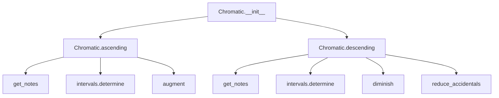

## Raises:
- `NoteFormatError`: Raised by `get_notes()` when the key parameter contains invalid characters or is not a recognized key
- `IndexError`: May be raised by internal note manipulation functions if malformed note strings are encountered

## Example:
```python
# Create a chromatic scale for C major
chromatic_scale = Chromatic("C", 2)

# Get ascending chromatic scale
ascending_notes = chromatic_scale.ascending()
# Returns: ['C', 'C#', 'D', 'D#', 'E', 'F', 'F#', 'G', 'G#', 'A', 'A#', 'B', 'C', 'C#', 'D', 'D#', 'E', 'F', 'F#', 'G', 'G#', 'A', 'A#', 'B', 'C']

# Get descending chromatic scale
descending_notes = chromatic_scale.descending()
# Returns: ['B', 'Bb', 'A', 'Ab', 'G', 'Gb', 'F', 'E', 'Eb', 'D', 'Db', 'C', 'B', 'Bb', 'A', 'Ab', 'G', 'Gb', 'F', 'E', 'Eb', 'D', 'Db', 'C', 'B']
```

### `mingus.core.scales.Chromatic.__init__` · *method*

## Summary:
Initializes a chromatic scale object with a specified key and octave range.

## Description:
Constructs a Chromatic scale instance that will generate ascending and descending chromatic sequences based on the provided musical key and octave span. This method sets up the fundamental properties needed for chromatic scale generation, including the tonic note, key information, and octave specifications.

The initialization process extracts the tonic note from the specified key using the get_notes() utility function, which handles proper accidental application for different key signatures. This method serves as the entry point for creating chromatic scale instances and prepares the object's state for subsequent scale generation operations.

## Args:
    key (str): The musical key for the chromatic scale, such as "C", "G", "F#", etc. Must be a valid key recognized by the mingus.core.keys module.
    octaves (int): Number of octaves the scale should span. Defaults to 1, representing a single octave.

## Returns:
    None: This method initializes the object's state and does not return a value.

## Raises:
    NoteFormatError: When the provided key string is not recognized or valid according to the module's key validation rules.

## State Changes:
    Attributes READ: None
    Attributes WRITTEN: 
    - self.key: Stores the provided key string
    - self.tonic: Stores the first note from get_notes(key) as the scale's tonic
    - self.octaves: Stores the number of octaves for the scale
    - self.name: Stores the formatted name string for the scale

## Constraints:
    Preconditions:
    - The key parameter must be a valid key string recognized by the get_notes() function
    - The octaves parameter must be a non-negative integer
    - The get_notes() function must be available and working correctly
    
    Postconditions:
    - The self.key attribute is set to the provided key string
    - The self.tonic attribute is set to the first note of the key's note sequence
    - The self.octaves attribute is set to the provided octaves value
    - The self.name attribute is set to "{tonic} chromatic"

## Side Effects:
    None: This method performs no I/O operations or external state mutations. It only initializes object attributes.

### `mingus.core.scales.Chromatic.ascending` · *method*

## Summary:
Generates an ascending chromatic scale pattern by applying interval-based augmentation to maintain proper chromatic progression.

## Description:
Creates a chromatic scale pattern by iterating through the notes of the key and applying augmentation when major second intervals are encountered. The method begins with the tonic note and processes subsequent notes from the key, inserting augmented versions of previous notes when a major second interval is detected. The resulting pattern is repeated for the specified number of octaves and closed by appending the first note of the pattern.

This implementation specifically handles the chromatic scale generation where consecutive notes maintain proper interval relationships, particularly addressing the case where a major second interval requires the previous note to be sharpened.

## Args:
    None

## Returns:
    list[str]: A list of note strings representing the ascending chromatic scale. The pattern consists of the tonic followed by key notes with interval-based augmentations, repeated self.octaves times, and terminated with the first note of the pattern.

## Raises:
    None explicitly raised

## State Changes:
    Attributes READ: 
    - self.tonic: Used as the starting note of the scale
    - self.key: Used to determine the base notes of the key via get_notes()
    - self.octaves: Used to determine how many times to repeat the scale pattern
    
    Attributes WRITTEN: 
    - None

## Constraints:
    Preconditions:
    - self.tonic must be a valid musical note string
    - self.key must be a valid key string recognized by get_notes()
    - self.octaves must be a positive integer
    
    Postconditions:
    - Returns a list of note strings in proper musical notation
    - The returned list represents a complete chromatic scale pattern
    - The scale pattern repeats for the specified number of octaves
    - The final note in the returned list matches the first note of the pattern

## Side Effects:
    None

### `mingus.core.scales.Chromatic.descending` · *method*

## Summary:
Generates a descending chromatic scale pattern by applying interval-based diminishment to maintain proper chromatic progression.

## Description:
Creates a chromatic scale pattern by iterating through the notes of the key in reverse order and applying diminishment when major second intervals are encountered. The method begins with the tonic note and processes subsequent notes from the key in reverse order. When a major second interval is detected between the current note and the last note in the growing pattern, it inserts a diminished version of the previous note before adding the current note. The resulting pattern is repeated for the specified number of octaves and closed by appending the first note of the pattern.

This method is designed to generate descending chromatic scales that maintain proper interval relationships, particularly handling the case where a major second interval requires the previous note to be flattened to maintain the chromatic progression.

## Args:
    None

## Returns:
    list[str]: A list of note strings representing the descending chromatic scale. The pattern consists of the tonic followed by key notes with interval-based diminishments, repeated self.octaves times, and terminated with the first note of the pattern.

## Raises:
    None explicitly raised

## State Changes:
    Attributes READ: 
    - self.tonic: Used as the starting note of the scale
    - self.key: Used to determine the base notes of the key via get_notes()
    - self.octaves: Used to determine how many times to repeat the scale pattern
    
    Attributes WRITTEN: 
    - None

## Constraints:
    Preconditions:
    - self.tonic must be a valid musical note string
    - self.key must be a valid key string recognized by get_notes()
    - self.octaves must be a positive integer
    
    Postconditions:
    - Returns a list of note strings in proper musical notation
    - The returned list represents a complete chromatic scale pattern
    - The scale pattern repeats for the specified number of octaves
    - The final note in the returned list matches the first note of the pattern

## Side Effects:
    None

## `mingus.core.scales.WholeTone` · *class*

*No documentation generated.*

### `mingus.core.scales.WholeTone.__init__` · *method*

## Summary:
Initializes a WholeTone scale instance by calling the parent scale constructor and setting the scale's descriptive name attribute.

## Description:
The `__init__` method constructs a WholeTone scale object by first delegating initialization to its parent `_Scale` class to establish the fundamental scale properties (tonic note and octave count), then setting a descriptive name attribute that identifies the scale type and root note. This method ensures proper initialization of all WholeTone scale instances while maintaining consistency with the musical scale interface.

Known callers:
- Direct instantiation: `scale = WholeTone('C')` during object creation
- Object construction phase: Called automatically by Python's object creation mechanism when instantiating WholeTone objects

This method exists as a dedicated initialization routine rather than being inlined because it separates the concerns of parent class initialization from the specific naming logic for WholeTone scales. It ensures that all WholeTone scale instances inherit the standard scale behaviors while providing a consistent naming convention that clearly identifies the scale type and tonic.

## Args:
    note (str): The tonic note of the whole tone scale, represented as a string (e.g., 'C', 'D#'). Must be a valid note name and cannot contain lowercase letters.
    octaves (int): The number of octaves the scale spans. Defaults to 1. Must be a positive integer.

## Returns:
    None: This method initializes the object's state and does not return a value.

## Raises:
    NoteFormatError: Raised when the note parameter contains lowercase letters (invalid note format), inherited from `_Scale.__init__`
    RangeError: Raised when octaves parameter is not a positive integer, inherited from `_Scale.__init__`

## State Changes:
    Attributes READ: 
        - self.tonic: Read from parent class initialization to format the name attribute
    Attributes WRITTEN:
        - self.name: Set to "{0} whole tone".format(self.tonic) to create the descriptive scale name
        - self.tonic: Assigned from the note parameter via parent class initialization
        - self.octaves: Assigned from the octaves parameter via parent class initialization

## Constraints:
    Preconditions:
        - The note parameter must be a valid note name string (uppercase letters only)
        - The octaves parameter must be a positive integer
    Postconditions:
        - The object is properly initialized with the specified tonic note and octave count
        - The name attribute is set to the formatted string "{tonic} whole tone"
        - The object inherits all standard scale behaviors from the `_Scale` parent class

## Side Effects:
    None: This method performs no I/O operations or external service calls. It only modifies internal object state.

### `mingus.core.scales.WholeTone.ascending` · *method*

## Summary:
Generates a whole tone scale in ascending order by applying major second intervals sequentially.

## Description:
Creates a complete whole tone scale pattern starting from the tonic note. The method constructs a sequence of 6 notes (including the tonic) by repeatedly applying major second intervals, then repeats this pattern for the specified number of octaves before returning the full ascending scale.

This method is specifically implemented for the WholeTone scale class to generate the characteristic whole tone scale pattern where each adjacent pair of notes is separated by a whole step (major second interval).

## Args:
    None - Uses instance attributes exclusively

## Returns:
    list[str]: A list of note strings representing the ascending whole tone scale, including the tonic at the beginning and end of the sequence

## Raises:
    None - This method does not explicitly raise exceptions

## State Changes:
    Attributes READ: self.tonic, self.octaves
    Attributes WRITTEN: None

## Constraints:
    Preconditions:
        - self.tonic must be a valid musical note string
        - self.octaves must be a positive integer
    Postconditions:
        - The returned list contains exactly (6 * self.octaves + 1) notes
        - The first and last notes in the returned list are identical (the tonic)
        - Each consecutive pair of notes in the sequence forms a major second interval

## Side Effects:
    None - This method performs no I/O, external service calls, or mutations to external state

## `mingus.core.scales.Octatonic` · *class*

## Summary:
Octatonic scale class implementing an 8-note scale pattern with alternating whole and half steps.

## Description:
The Octatonic class represents an octatonic scale, a type of scale that contains eight notes per octave. This implementation follows a specific pattern of alternating intervals: major second, minor third, repeated three times, followed by a major seventh and adjusted to a major sixth. The class inherits from the abstract _Scale base class and implements the specific ascending scale pattern characteristic of octatonic scales.

This class is typically instantiated through factory methods or direct construction when working with octatonic scales in musical applications. The octatonic scale is commonly used in jazz and contemporary classical music due to its symmetrical properties and rich harmonic possibilities.

## State:
- `tonic` (str): The root note of the scale, stored as a string (e.g., 'C', 'D#'). Must be a valid note name and cannot be lowercase.
- `octaves` (int): Number of octaves the scale spans. Must be a positive integer.
- `type` (str): Class attribute set to "other" indicating this is a specialized scale type.
- `name` (str): Formatted name of the scale, constructed as "{tonic} octatonic".

## Lifecycle:
- Creation: Instantiate with a valid note string and optional octave count (default 1)
- Usage: Call the `ascending()` method to retrieve the scale notes in ascending order
- Destruction: Uses standard Python garbage collection

## Method Map:
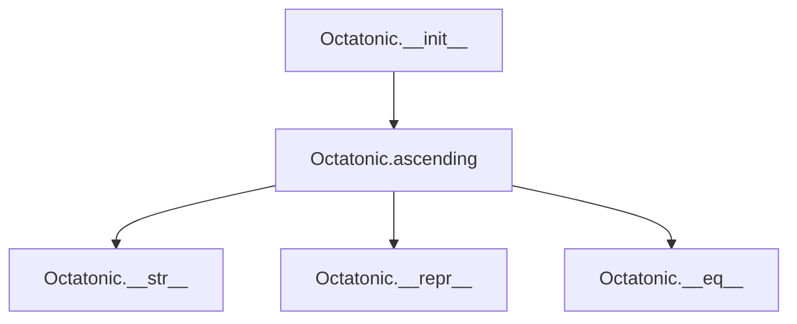

## Raises:
- `NoteFormatError`: Raised in initialization when the note parameter contains lowercase letters (invalid note format)
- `RangeError`: Raised in degree() method when degree_number is less than 1 (inherited from _Scale)

## Example:
```python
# Create an octatonic scale starting on C
scale = Octatonic('C')

# Get the ascending scale notes
ascending_notes = scale.ascending()
# Returns: ['C', 'D', 'Eb', 'F', 'Gb', 'A', 'Bb', 'D', 'C']

# Create a two-octave octatonic scale
two_octave_scale = Octatonic('C', 2)
ascending_notes_2 = two_octave_scale.ascending()
# Returns: ['C', 'D', 'Eb', 'F', 'Gb', 'A', 'Bb', 'D', 'C', 'D', 'Eb', 'F', 'Gb', 'A', 'Bb', 'D', 'C']
```

### `mingus.core.scales.Octatonic.__init__` · *method*

## Summary:
Initializes an Octatonic scale instance by calling the parent scale constructor and setting the scale's descriptive name attribute.

## Description:
The `__init__` method constructs an Octatonic scale object by first delegating initialization to its parent `_Scale` class to establish the fundamental scale properties (tonic note and octave count), then setting a descriptive name attribute that identifies the scale type and root note. This method ensures proper initialization of all Octatonic scale instances while maintaining consistency with the musical scale interface.

Known callers:
- Direct instantiation: `scale = Octatonic('C')` during object creation
- Object construction phase: Called automatically by Python's object creation mechanism when instantiating Octatonic objects

This method exists as a dedicated initialization routine rather than being inlined because it separates the concerns of parent class initialization from the specific naming logic for Octatonic scales. It ensures that all Octatonic scale instances inherit the standard scale behaviors while providing a consistent naming convention that clearly identifies the scale type and tonic.

## Args:
    note (str): The tonic note of the octatonic scale, represented as a string (e.g., 'C', 'D#'). Must be a valid note name and cannot contain lowercase letters.
    octaves (int): The number of octaves the scale spans. Defaults to 1. Must be a positive integer.

## Returns:
    None: This method initializes the object's state and does not return a value.

## Raises:
    NoteFormatError: Raised when the note parameter contains lowercase letters (invalid note format), inherited from `_Scale.__init__`
    RangeError: Raised when octaves parameter is not a positive integer, inherited from `_Scale.__init__`

## State Changes:
    Attributes READ: 
        - self.tonic: Read from parent class initialization to format the name attribute
    Attributes WRITTEN:
        - self.name: Set to "{0} octatonic".format(self.tonic) to create the descriptive scale name
        - self.tonic: Assigned from the note parameter via parent class initialization
        - self.octaves: Assigned from the octaves parameter via parent class initialization

## Constraints:
    Preconditions:
        - The note parameter must be a valid note name string (uppercase letters only)
        - The octaves parameter must be a positive integer
    Postconditions:
        - The object is properly initialized with the specified tonic note and octave count
        - The name attribute is set to the formatted string "{tonic} octatonic"
        - The object inherits all standard scale behaviors from the `_Scale` parent class

## Side Effects:
    None: This method performs no I/O operations or external service calls. It only modifies internal object state.

### `mingus.core.scales.Octatonic.ascending` · *method*

## Summary:
Generates an octatonic scale pattern by constructing a sequence of eight notes using alternating major seconds and minor thirds, then adjusting the final notes to create the characteristic octatonic interval structure.

## Description:
This method implements the construction of an octatonic scale, which is a scale with eight notes per octave. The algorithm begins with the tonic note and alternates between major second and minor third intervals for three iterations, creating a seven-note pattern. The final two notes are then adjusted to form the proper octatonic structure, where the second-to-last note becomes the major sixth of the tonic and the last note becomes the major seventh of the tonic. The resulting pattern is repeated for the specified number of octaves and closed by returning to the initial tonic.

The method is separated from the constructor and other scale methods to provide a clean interface for generating the ascending form of the octatonic scale, enabling consistent scale representation regardless of the scale's octave span.

## Args:
    None - This is a method of the Octatonic class and operates on instance attributes

## Returns:
    list[str]: A list of musical note strings representing the ascending octatonic scale pattern, repeated for the specified number of octaves and ending with the tonic note. The pattern consists of 8 notes total: tonic, major second, minor third, major second, minor third, major second, minor third, major seventh, with the second-to-last note replaced by major sixth.

## Raises:
    None - This method does not explicitly raise exceptions, though underlying interval functions may raise NoteFormatError or other exceptions from the notes module

## State Changes:
    Attributes READ: self.tonic, self.octaves
    Attributes WRITTEN: None - This method is read-only and doesn't modify instance state

## Constraints:
    Preconditions:
        - self.tonic must be a valid musical note string recognized by the mingus.core.notes module
        - self.octaves must be a positive integer
        - The interval functions (major_second, minor_third, major_seventh, major_sixth) must work with the provided tonic note
        
    Postconditions:
        - The returned list contains exactly (8 * self.octaves + 1) notes when self.octaves > 0
        - The first and last notes in the returned list are identical (the tonic)
        - The pattern follows the octatonic scale structure: tone, semitone, tone, semitone, tone, semitone, tone, semitone

## Side Effects:
    None - This method performs no I/O, external service calls, or mutations to objects outside the instance

