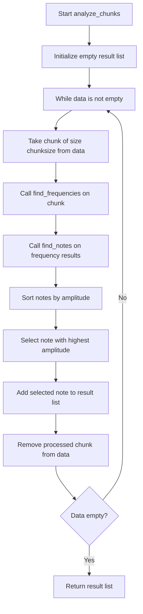

# `fft.py`

## `mingus.extra.fft._find_log_index` · *function*

## Summary:
Finds the appropriate logarithmic index for a given frequency value using binary search with caching optimization.

## Description:
This function performs a binary search on a pre-computed logarithmic cache to find the closest matching index for a given frequency value. It implements an optimization that leverages previously computed results to avoid full binary search when the requested frequency is greater than or equal to the last requested frequency.

## Args:
    f (float): The frequency value to find the logarithmic index for. Must be positive.

## Returns:
    int: The logarithmic index corresponding to the frequency value. Returns 128 if the frequency exceeds the maximum cached value or is zero or negative.

## Raises:
    None explicitly raised, but may raise IndexError if global variables are not properly initialized.

## Constraints:
    Preconditions:
    - Global variable `_log_cache` must be initialized as a list/array of at least 128 elements
    - Global variable `_last_asked` must be either None or a tuple of (index, frequency_value)
    - Input frequency `f` must be a numeric value
    
    Postconditions:
    - Returns an integer index between 0 and 128 inclusive
    - The returned index corresponds to a position in `_log_cache` where the frequency value fits within the range

## Side Effects:
    - Modifies the global variable `_last_asked` to cache the most recent lookup result
    - Accesses the global variable `_log_cache` for lookup operations

## Control Flow:
```mermaid
flowchart TD
    A[Start _find_log_index(f)] --> B{f <= 0 OR f > _log_cache[127]}
    B -- Yes --> C[Return 128]
    B -- No --> D{Has _last_asked?}
    D -- No --> E[Initialize begin=0, end=128]
    D -- Yes --> F{f >= lastval?}
    F -- No --> G[Initialize begin=0, end=128]
    F -- Yes --> H{f <= _log_cache[lastn]?}
    H -- Yes --> I[Return lastn]
    H -- No --> J{f <= _log_cache[lastn+1]?}
    J -- Yes --> K[Return lastn+1]
    J -- No --> L[Set begin=lastn]
    L --> M[Binary search loop]
    M --> N{begin != end?}
    N -- No --> O[Return begin]
    N -- Yes --> P[Calculate n=(begin+end)//2]
    P --> Q{cp < f <= c?}
    Q -- Yes --> R[Set _last_asked=(n,f) and return n]
    Q -- No --> S{f < c?}
    S -- Yes --> T[Set end=n]
    S -- No --> U[Set begin=n]
    T --> V[M]
    U --> V
```

## Examples:
    # Typical usage in audio processing context
    freq = 440.0  # A4 note frequency
    index = _find_log_index(freq)  # Returns appropriate log-scale index
    
    # When frequency is out of range
    index = _find_log_index(0)  # Returns 128
    index = _find_log_index(100000)  # Returns 128 if exceeds max cache value

## `mingus.extra.fft.find_frequencies` · *function*

## Summary:
Converts time-domain audio data into frequency-domain representation with power spectrum values.

## Description:
Transforms audio sample data into a list of frequency-power pairs, useful for audio analysis and spectral visualization. This function performs Fast Fourier Transform on the input data and normalizes the results to provide meaningful frequency and amplitude information. The function implements a real FFT approach that returns only the unique frequency components due to symmetry in real-valued signals.

## Args:
    data (list or array-like): Time-domain audio samples to analyze. Should contain real-valued numeric data representing audio amplitudes.
    freq (int): Sampling frequency in Hz. Defaults to 44100 (standard CD quality)
    bits (int): Audio bit depth. Defaults to 16 (standard for audio files). Note: This parameter is currently unused in the implementation.

## Returns:
    list[tuple[float, float]]: List of (frequency, power) tuples representing the frequency spectrum. Each tuple contains the frequency in Hz and corresponding power magnitude. The list contains ceil((n+1)/2) elements where n is the length of input data, representing frequencies from 0 Hz up to the Nyquist frequency.

## Raises:
    None explicitly raised in the function body

## Constraints:
    Preconditions:
    - Input data must be a sequence of numeric values representing audio samples
    - Sampling frequency must be positive
    - Bit depth should be a valid audio bit depth (typically 8, 16, 24, or 32)

    Postconditions:
    - Returns a list of frequency-power pairs with length equal to ceil((n+1)/2) where n is the length of input data
    - Frequency values start at 0 and increment by freq/n
    - Power values represent normalized squared magnitudes
    - First element corresponds to DC component (0 Hz)
    - Last element corresponds to Nyquist frequency (if n is even)
    - All returned frequencies are in the range [0, freq/2]

## Side Effects:
    None

## Control Flow:
```mermaid
flowchart TD
    A[Input data] --> B[Calculate length n]
    B --> C[Call _fft(data)]
    C --> D[Calculate uniquePts = ceil((n+1)/2)]
    D --> E[Normalize FFT results]
    E --> F[Adjust DC and Nyquist components]
    F --> G[Calculate frequency step s = freq/n]
    G --> H[Generate frequency array]
    H --> I[Zip frequency and power arrays]
    I --> J[Return list of (freq, power) tuples]
```

## Examples:
    # Basic usage with audio data
    audio_samples = [0.1, 0.2, 0.3, 0.4, 0.3, 0.2, 0.1]
    frequencies = find_frequencies(audio_samples, freq=44100)
    # Returns [(0.0, power0), (s, power1), ...] where s = 44100/len(audio_samples)
    # Result contains 4 frequency bins (ceil((7+1)/2) = 4)
    
    # With custom sampling rate
    frequencies = find_frequencies(audio_samples, freq=22050)
    # Returns frequency bins spaced by 22050/len(audio_samples)
    
    # Typical usage for audio analysis
    # Assuming audio_samples contains 1024 samples at 44100 Hz
    # frequencies = find_frequencies(audio_samples, freq=44100)
    # This produces 512 frequency bins from 0 to 22050 Hz

## `mingus.extra.fft.find_notes` · *function*

## Summary:
Maps frequency-amplitude pairs to musical notes by converting frequencies to logarithmic indices and aggregating amplitudes per note.

## Description:
The `find_notes` function processes a table of frequency-amplitude pairs and converts them into musical note representations. It aggregates amplitude values for each note based on their frequency mappings, handling frequencies outside the normal range by grouping them under a special "out of range" category.

This function is extracted from the audio processing pipeline to separate the logic of converting frequency data to note representations from the raw FFT computation and analysis. This separation allows for cleaner code organization and easier testing of the note mapping logic independently from the audio processing workflow.

## Args:
    freqTable (list[tuple[float, float]]): A list of (frequency, amplitude) tuples representing audio spectrum data. Frequencies must be positive numbers, and amplitudes must be positive numbers to be considered.
    maxNote (int): Maximum note index to consider for normal note mapping. Notes with indices greater than or equal to this value are grouped into the "out of range" category. Defaults to 100.

## Returns:
    list[tuple[Note or None, Note]]: A list of 129 tuples where each tuple corresponds to a note index (0-128):
        - Indices 0-127: Tuple of (Note object representing the note, Note object placeholder)
        - Index 128: Tuple of (None, Note object placeholder) for out-of-range frequencies
        The Note objects in the first position represent musical notes mapped from frequencies, while the second element is always the same Note instance (created once at the start of the function).

## Raises:
    None explicitly raised by this function, though underlying operations may raise exceptions from:
    - Note class construction when invalid parameters are passed
    - Indexing operations if freqTable contains malformed data

## Constraints:
    Preconditions:
    - freqTable must be iterable containing (frequency, amplitude) tuples
    - Frequency values must be numeric and positive
    - Amplitude values must be numeric and positive
    - maxNote must be a numeric value

    Postconditions:
    - Returns a list of exactly 129 tuples (one for each possible note index plus one for out-of-range)
    - Each tuple contains a Note object or None as the first element
    - The second element of each tuple is always the same Note instance (n) created at function start

## Side Effects:
    None

## Control Flow:
```mermaid
flowchart TD
    A[Start find_notes] --> B[Initialize res=[0]*129]
    B --> C[Initialize n=Note()]
    C --> D[For each (freq, ampl) in freqTable]
    D --> E{freq > 0 AND ampl > 0?}
    E -- No --> F[Skip to next iteration]
    E -- Yes --> G[Call _find_log_index(freq)]
    G --> H{f < maxNote?}
    H -- Yes --> I[res[f] += ampl]
    H -- No --> J[res[128] += ampl]
    J --> K[End loop]
    K --> L[Return list comprehension]
    L --> M[For each (x,n) in enumerate(res)]
    M --> N{x < 128?}
    N -- Yes --> O[Note().from_int(x)]
    N -- No --> P[None]
    O --> Q[Return (Note, n)]
    P --> Q
```

## Examples:
    # Basic usage with typical audio data
    freq_table = [(440.0, 0.8), (523.3, 0.6), (659.3, 0.4)]
    notes = find_notes(freq_table)
    # Returns list of 129 tuples with note mappings and aggregated amplitudes
    
    # Usage with custom maxNote limit
    notes = find_notes(freq_table, maxNote=80)
    # Groups notes beyond index 80 into the out-of-range category
    
    # Handling zero or negative values
    freq_table_with_zeros = [(0.0, 0.5), (440.0, 0.8)]
    notes = find_notes(freq_table_with_zeros)
    # Only processes positive frequencies and amplitudes

## `mingus.extra.fft.data_from_file` · *function*

## Summary:
Extracts mono audio data, sample rate, and bit depth from a WAV audio file.

## Description:
Reads audio data from a WAV file and isolates the first audio channel for processing. This function serves as a utility for preparing audio data for further signal processing operations like Fast Fourier Transform analysis. It handles the low-level details of WAV file parsing and channel extraction, making it easier to work with audio data in scientific computing applications.

## Args:
    file (str): Path to the WAV audio file to read

## Returns:
    tuple: A tuple containing:
        - channel1 (list[int]): Sample values from the first audio channel
        - freq (int): Sampling frequency in Hz
        - bits (int): Bit depth of the audio samples (in bytes, not bits)

## Raises:
    FileNotFoundError: If the specified file does not exist
    wave.Error: If the file is not a valid WAV file or cannot be read

## Constraints:
    Precondition: The input file must be a valid WAV audio file with readable frames
    Postcondition: The returned channel data contains only samples from the first channel

## Side Effects:
    - Opens and closes the specified file for reading
    - Reads entire audio file into memory

## Control Flow:
```mermaid
flowchart TD
    A[Start data_from_file] --> B[Open WAV file in read mode]
    B --> C[Read all frames from file]
    C --> D[Get audio properties: channels, freq, bits]
    D --> E[Unpack binary data to integers]
    E --> F[Initialize empty channel1 list]
    F --> G[Iterate through unpacked data]
    G --> H{Is current sample from channel 1?}
    H -->|Yes| I[Append sample to channel1]
    H -->|No| J[Skip sample]
    J --> K[Increment counter]
    K --> L{End of data?}
    L -->|No| G
    L -->|Yes| M[Close file handle]
    M --> N[Return (channel1, freq, bits)]
```

## Examples:
```python
# Basic usage
channel_data, sample_rate, bit_depth = data_from_file("audio.wav")

# Typical usage in audio processing pipeline
try:
    channel1, freq, bits = data_from_file("recording.wav")
    # Process the audio data...
except FileNotFoundError:
    print("Audio file not found")
except wave.Error:
    print("Invalid WAV file")
```

## `mingus.extra.fft.find_Note` · *function*

## Summary:
Identifies the most prominent musical note from audio data by analyzing frequency components and mapping them to note representations.

## Description:
The `find_Note` function serves as the primary interface for extracting musical note information from audio samples. It processes time-domain audio data through a series of transformations: first converting to frequency domain using FFT, then mapping frequency components to musical notes, and finally selecting the note with the highest amplitude as the dominant note.

This function is extracted from the audio processing pipeline to provide a clean, high-level interface for note detection while separating concerns between frequency analysis, note mapping, and result selection. The function handles the complete workflow from raw audio samples to a single musical note identification.

## Args:
    data (list or array-like): Time-domain audio samples to analyze. Should contain real-valued numeric data representing audio amplitudes.
    freq (int): Sampling frequency in Hz. Defaults to 44100 (standard CD quality). Must be positive.
    bits (int): Audio bit depth. Defaults to 16 (standard for audio files). Note: This parameter is currently unused in the implementation.

## Returns:
    Note: The musical note object representing the most prominent frequency component in the audio data. Returns a Note object with appropriate pitch and octave information.

## Raises:
    None explicitly raised by this function, though underlying operations may raise exceptions from:
    - Note class construction when invalid parameters are passed during note creation
    - Indexing operations if input data contains malformed values
    - FFT-related operations if input data is invalid

## Constraints:
    Preconditions:
    - Input data must be a sequence of numeric values representing audio samples
    - Sampling frequency must be positive
    - Bit depth should be a valid audio bit depth (typically 8, 16, 24, or 32)
    - Input data should contain sufficient samples for meaningful frequency analysis

    Postconditions:
    - Returns a valid Note object representing the dominant musical note
    - The returned note corresponds to the frequency component with maximum amplitude
    - Function execution completes successfully when input data is valid

## Side Effects:
    None

## Control Flow:
```mermaid
flowchart TD
    A[Input data, freq, bits] --> B[Call find_frequencies(data, freq, bits)]
    B --> C[Assign result to data]
    C --> D[Call find_notes(data)]
    D --> E[Sort results by amplitude (key=operator.itemgetter(1))]
    E --> F[Select last element (-1) and first item ([0])]
    F --> G[Return dominant Note]
```

## Examples:
    # Basic usage with audio data
    audio_samples = [0.1, 0.2, 0.3, 0.4, 0.3, 0.2, 0.1]
    dominant_note = find_Note(audio_samples, freq=44100, bits=16)
    # Returns a Note object representing the most prominent musical note
    
    # Typical usage for audio analysis
    # Assuming audio_samples contains 1024 samples at 44100 Hz
    note = find_Note(audio_samples, freq=44100, bits=16)
    # Returns the dominant musical note detected from the audio signal

## `mingus.extra.fft.analyze_chunks` · *function*

## Summary:
Processes audio data in chunks to identify the dominant musical note from each segment.

## Description:
Analyzes audio data by dividing it into fixed-size chunks and determining the most prominent musical note in each chunk. This function serves as the core processing unit for audio-to-note conversion, extracting musical information from time-domain audio samples by applying frequency analysis and note mapping to each chunk sequentially.

The function is designed to handle continuous audio streams by processing data in manageable segments, making it suitable for real-time audio analysis applications. It leverages the `find_frequencies` function to convert audio samples into frequency spectra and `find_notes` to map those frequencies to musical notes.

## Args:
    data (list[float]): Time-domain audio samples to process. Each element should represent an audio amplitude value in the range [-1.0, 1.0] for normalized audio.
    freq (int): Sampling frequency in Hz used for frequency analysis. Typically 44100 for CD-quality audio.
    bits (int): Audio bit depth used in frequency calculations. Currently unused in the implementation but maintained for interface consistency.
    chunksize (int, optional): Size of audio chunks to process in each iteration. Defaults to 512 samples.

## Returns:
    list[Note]: A list of musical Note objects representing the dominant note from each complete chunk of audio data. Incomplete chunks at the end of the data are ignored. The number of returned notes equals floor(len(data)/chunksize).

## Raises:
    None explicitly raised by this function, though underlying operations may raise exceptions from:
    - Note class construction when invalid parameters are passed
    - Indexing operations if data contains malformed values
    - Memory errors if data is extremely large

## Constraints:
    Preconditions:
    - Input data must be a sequence of numeric values representing audio samples
    - Sampling frequency must be positive
    - Bit depth should be a valid audio bit depth (typically 8, 16, 24, or 32)
    - Chunk size must be a positive integer
    - Data should contain at least one complete chunk for meaningful results

    Postconditions:
    - Returns a list of Note objects with length equal to floor(len(data)/chunksize)
    - Each Note object represents the dominant musical note in its respective chunk
    - Input data remains unmodified
    - Incomplete chunks (less than chunksize samples) are discarded

## Side Effects:
    None

## Control Flow:


## Examples:
    # Basic usage with audio data
    audio_samples = [0.1, 0.2, 0.3, 0.4, 0.3, 0.2, 0.1] * 100  # 700 samples
    dominant_notes = analyze_chunks(audio_samples, freq=44100, bits=16, chunksize=512)
    # Returns list of Note objects representing dominant notes from first 512 samples and remaining 188 samples
    # Since 188 < 512, the last chunk is ignored, returning 1 note
    
    # Processing with different chunk size
    dominant_notes = analyze_chunks(audio_samples, freq=22050, bits=16, chunksize=256)
    # Processes data in 256-sample chunks instead of 512
    
    # Handling edge case with insufficient data
    short_audio = [0.1, 0.2, 0.3]  # Only 3 samples
    notes = analyze_chunks(short_audio, freq=44100, bits=16, chunksize=512)
    # Returns empty list since 3 < 512, so no complete chunks exist

## `mingus.extra.fft.find_melody` · *function*

## Summary:
Identifies and groups consecutive musical notes from audio data, returning a sequence of note-frequency pairs with duration counts.

## Description:
Processes audio data from a WAV file by analyzing it in chunks to extract musical notes, then groups consecutive identical notes to create a melody representation with timing information. This function serves as the main interface for converting audio recordings into a simplified musical notation format that preserves temporal relationships between notes.

The function is designed to work with audio files containing musical content, where it identifies dominant musical notes in sequential time windows and aggregates consecutive occurrences of the same note. This creates a compact representation of the melody that's useful for music analysis, transcription, or playback simulation.

## Args:
    file (str, optional): Path to the WAV audio file to process. Defaults to "440_480_clean.wav"
    chunksize (int, optional): Size of audio chunks in samples for processing. Defaults to 512

## Returns:
    list[tuple[Note, int]]: A list of tuples where each tuple contains:
        - Note: The musical note identified in the chunk
        - int: The frequency (Hz) associated with the note
    Each tuple represents a unique note occurrence with its duration count (number of consecutive chunks with that note).

## Raises:
    FileNotFoundError: If the specified audio file does not exist
    wave.Error: If the audio file is not a valid WAV file or cannot be read
    NoteError: If the Note class encounters issues creating note objects from detected frequencies

## Constraints:
    Preconditions:
    - Input file must be a valid WAV audio file with readable frames
    - Audio data should contain sufficient samples for at least one complete chunk
    - Audio samples should be in a format compatible with the audio processing pipeline
    - Chunk size must be a positive integer

    Postconditions:
    - Returns a list of note-frequency pairs with grouping of consecutive identical notes
    - Input audio file remains unmodified
    - All returned Note objects are valid musical note representations

## Side Effects:
    - Opens and reads the specified audio file
    - Processes entire audio file into memory
    - May raise exceptions from underlying file I/O or audio processing operations

## Control Flow:
```mermaid
flowchart TD
    A[Start find_melody] --> B[Call data_from_file(file)]
    B --> C{data_from_file successful?}
    C -->|Yes| D[Initialize empty result list]
    D --> E[Process chunks via analyze_chunks]
    E --> F{Result list empty?}
    F -->|Yes| G[Add first note to result]
    F -->|No| H[Check if last note matches current]
    H -->|Yes| I[Increment duration counter]
    H -->|No| J[Add new note with duration 1]
    J --> K{More chunks?}
    K -->|Yes| E
    K -->|No| L[Return result list]
    C -->|No| M[Re-raise exception]
```

## Examples:
```python
# Basic usage with default parameters
melody = find_melody()
# Processes "440_480_clean.wav" with default 512-sample chunks

# Process custom audio file
melody = find_melody("my_music.wav", chunksize=1024)
# Processes "my_music.wav" with 1024-sample chunks

# Handle potential exceptions
try:
    melody = find_melody("nonexistent.wav")
except FileNotFoundError:
    print("Audio file not found")
except wave.Error:
    print("Invalid WAV file format")
```

